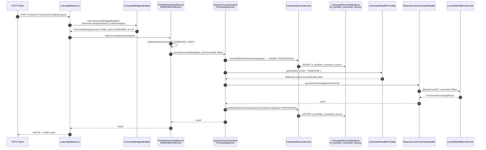

Apache Fineract routes **every state-changing API call** through a single command bus. The
REST resource never talks to a JPA repository directly — instead it builds a
[`CommandWrapper`](https://github.com/apache/fineract/blob/develop/fineract-core/src/main/java/org/apache/fineract/commands/domain/CommandWrapper.java)
that names an `entity`, an `action`, and an optional resource id, hands it to
`PortfolioCommandSourceWritePlatformService`, and the bus dispatches it to the
matching `*CommandHandler` bean. This page is the map you need before reading
the per-module deep dives.

## Why a command bus

The original Mifos X codebase fused REST controllers, domain services, and the
permission system. Fineract pulled them apart by introducing two layers of
indirection:

1. **`CommandWrapper`** — a value object describing *what* the caller wants to do
   (`entity = "LOAN"`, `action = "DISBURSE"`, `resourceId = 17`). It carries the
   raw JSON body plus contextual ids (client, group, office, idempotency key).
2. **`CommandSource`** — a JPA entity stored in `m_portfolio_command_source` that
   captures *who* asked, *when*, *what payload*, and the **lifecycle status**
   (`UNDER_PROCESSING`, `AWAITING_APPROVAL`, `PROCESSED`, `REJECTED`, `ERROR`,
   `INVALID`).

Wrapping every mutation in a `CommandSource` row gives Fineract four superpowers
for free:

<CardGroup cols={2}>
  <Card title="Audit log" icon="clipboard-list">
    Every write is recorded with maker, JSON, IP, and result. The
    `/v1/audits` endpoint reads the same table.
  </Card>
  <Card title="Maker–checker" icon="user-check">
    A command can be parked at `AWAITING_APPROVAL`; a second user must
    invoke `/v1/makercheckers/{id}?command=approve` to release it.
  </Card>
  <Card title="Idempotency" icon="repeat">
    The `Idempotency-Key` HTTP header is stored on the row; replays of the
    same key return the original result.
  </Card>
  <Card title="Pluggable dispatchers" icon="shuffle">
    Synchronous, async, or LMAX Disruptor backends can be swapped without
    touching handlers — they only implement `CommandDispatcher`.
  </Card>
</CardGroup>

## The five Gradle modules

The command subsystem is split across six modules; five of them live under the
`fineract-command*` prefix, and the sixth — `fineract-core` — defines the
provider-facing API used by handlers throughout the platform.

| Module                       | Adds                                                                                           | Default |
|------------------------------|------------------------------------------------------------------------------------------------|---------|
| `fineract-command`           | `Command`, `CommandHandler`, `CommandDispatcher`, hook SPI, **synchronous** dispatcher         | always on |
| `fineract-command-audit`     | `CommandHookBefore/After/Error` that persist state transitions via `CommandStore`              | opt-in  |
| `fineract-command-jdbc`      | `JdbcCommandStore` + `m_command` Liquibase schema (the durable log)                            | opt-in  |
| `fineract-command-async`     | `AsyncCommandDispatcher` using `CompletableFuture.supplyAsync`                                 | opt-in  |
| `fineract-command-disruptor` | LMAX Disruptor-backed dispatcher with a ring buffer                                            | opt-in  |
| `fineract-command-test`      | Sample `DummyCommand` / `DummyService` plus integration test scaffolding (not packaged in prod) | n/a     |

The provider-facing entities (`CommandWrapper`, `CommandSource`,
`CommandHandlerProvider`, `SynchronousCommandProcessingService`,
`PortfolioCommandSourceWritePlatformService`) all live in
`fineract-core/src/main/java/org/apache/fineract/commands/`. That is the surface
every domain module (`fineract-loan`, `fineract-savings`, …) compiles against.

<Note>
  There are **two different "command" APIs** in the codebase:

  - The **provider-facing** API in `org.apache.fineract.commands` (singular
    `commands`) used by every REST resource and handler.
  - The **newer, generic** API in `org.apache.fineract.command` (singular
    `command`) defined by the `fineract-command*` modules. It is still marked
    `// TODO: WIP - not ready yet for prime time` in the async and disruptor
    dispatchers and is intended to eventually replace the older
    `CommandProcessingService`.

  This wiki documents both — the older API drives the live REST surface today;
  the newer one is where features like idempotency persistence, hooks, and the
  Disruptor live.
</Note>

## End-to-end dispatch flow

The diagram below traces a `POST /v1/loans/17?command=disburse` from the JAX-RS
resource down to `LoanWritePlatformService.disburseLoan(...)`. Every numbered
step maps to a real file in the repo; the per-module pages dig into each box.



## What each module contributes

### `fineract-command` — the SPI

`fineract-command/src/main/java/org/apache/fineract/command/core/` defines the
contract every dispatcher and store has to honour:

- `Command<T>` — envelope with `commandId`, `idempotencyKey`, `payload`,
  `initiatedByUsername`, timestamps, error string.
- `CommandHandler<REQ, RES>` — single-method handler; the `matches(...)` default
  uses Guava `TypeToken` to find a handler whose generic `REQ` matches the
  payload class.
- `CommandDispatcher` — `Supplier<RES> dispatch(Command<REQ>)`. The
  [`SynchronousCommandDispatcher`](https://github.com/apache/fineract/blob/develop/fineract-command/src/main/java/org/apache/fineract/command/implementation/SynchronousCommandDispatcher.java)
  is the default implementation in
  `fineract-command/src/main/java/org/apache/fineract/command/implementation/`.
- `CommandHookBefore` / `CommandHookAfter` / `CommandHookError` — three SPI
  interfaces a module can implement to react to the lifecycle. The
  `hook/` package ships three built-ins (`ServletHeadersCommandHook`,
  `TimestampCommandHook`, `UsernameCommandHook`).

See [Command Core SPI](/command/command-core) for the type-by-type tour.

### `fineract-command-audit` — persist transitions

The audit module wires three hooks (`AuditCommandHookBefore`,
`AuditCommandHookAfter`, `AuditCommandHookError`) that call `CommandStore.store`
with the right `CommandState`. They are gated on
`fineract.command.audit.enabled=true` and the per-hook flags
`fineract.command.hooks.audit-pre|audit-post|audit-error`.

See [Command Audit Hooks](/command/command-audit).

### `fineract-command-jdbc` — durable log

The default `CommandStore` is `JdbcCommandStore`, backed by the `m_command`
table created by Liquibase changelogs in
`fineract-command-jdbc/src/main/resources/db/changelog/tenant/module/command/`.
A Resilience4j `@Retry(name = "commandStore")` wraps `store(...)`, and a
file-based dead-letter queue can be enabled via
`fineract.command.jdbc.file-dead-letter-queue-enabled=true`.

See [Command JDBC Store](/command/command-jdbc-store).

### `fineract-command-async` — fire-and-await

`AsyncCommandDispatcher` wraps the same hook/handler pipeline in
`CompletableFuture.supplyAsync(...)` and exposes a `Supplier` that blocks until
the future completes (currently hard-coded to 3 s). It is enabled by
`fineract.command.async.enabled=true`. The module is explicitly marked
`// TODO: WIP - not ready yet for prime time`.

See [Async Command Dispatcher](/command/command-async).

### `fineract-command-disruptor` — LMAX ring buffer

`DisruptorCommandDispatcher` uses an LMAX Disruptor ring buffer (default size
`1024`, `ProducerType.SINGLE`) so the calling thread only publishes the event
and waits on a `CompletableFuture` that a dedicated daemon thread completes.
Enabled by `fineract.command.disruptor.enabled=true`.

See [Disruptor Dispatcher](/command/command-disruptor).

## The provider-side glue (`fineract-core`)

Even though the new `CommandHandler<REQ, RES>` SPI exists, **every domain
handler in Fineract today** still implements the older provider-side interface:

```java
// fineract-core/.../commands/handler/NewCommandSourceHandler.java
public interface NewCommandSourceHandler {

    CommandProcessingResult processCommand(JsonCommand command);
}
```

Handlers are picked by
`fineract-core/.../commands/provider/CommandHandlerProvider.java`, which scans
the Spring context at startup for any bean annotated with
`@CommandType(entity, action)` and stores them in a `HashMap<String, String>`
keyed by `entity + "|" + action`. Lookups throw `UnsupportedCommandException`
when no handler is registered for a key.

```java
// fineract-core/.../commands/provider/CommandHandlerProvider.java
private void initializeHandlerRegistry() {
    final String[] beans = applicationContext.getBeanNamesForAnnotation(CommandType.class);
    for (final String name : beans) {
        final CommandType type = applicationContext.findAnnotationOnBean(name, CommandType.class);
        if (type != null) {
            registeredHandlers.put(type.entity() + "|" + type.action(), name);
        }
    }
}
```

The dispatcher that actually calls them is
`fineract-core/.../commands/service/SynchronousCommandProcessingService.java`.
It owns the full transactional dance:

1. Resolve idempotency key (`IdempotencyKeyResolver`).
2. Check the row does not already exist with this key (`exceptionWhenTheRequestAlreadyProcessed`).
3. `saveInitialNewTransaction(...)` → `UNDER_PROCESSING` row.
4. `processCommand(handler, …)` inside a `@Transactional`.
5. On success, retry-with-backoff `saveResultSameTransaction(...)` → `PROCESSED`.
6. On failure, persist `ERROR` row in a fresh transaction so the rollback of the
   main one doesn't lose the error trail.
7. Publish a hook event so webhooks (`fineract-provider/.../infrastructure/hooks`) fire.

See [Synchronous Implementation](/command/command-implementation) for the full
walk-through.

## Two parallel persistence tables

The current state of the codebase has **two** durable command logs co-existing.
They have different schemas, different lifecycle enums, and different REST
surfaces — knowing which is which saves a lot of digging:

| Table                            | Owned by                                          | Written from                                                              | Lifecycle column         |
|----------------------------------|---------------------------------------------------|---------------------------------------------------------------------------|--------------------------|
| `m_portfolio_command_source`     | `fineract-core` (`CommandSource` JPA entity)      | `CommandSourceService.saveInitial / saveResult`                            | `status` (int)           |
| `m_command`                      | `fineract-command-jdbc` (`CommandEntity`, Spring Data JDBC) | `JdbcCommandStore.store(...)` via the `AuditCommandHookBefore/After/Error` | `state` (string enum)    |

The `m_portfolio_command_source` table is the **production** audit log
exposed at `GET /v1/audits` and the queue for `GET /v1/makercheckers`. The
`m_command` table is part of the new SPI; it is written only when
`fineract.command.audit.enabled=true` **and** `fineract.command.jdbc.enabled=true`.

Migrating from one to the other is on the long-term roadmap; for now, treat
the new SPI as opt-in instrumentation and the provider stack as authoritative.

## Naming and conventions

- `entity` and `action` strings are UPPERCASE constants from
  `fineract-core/.../commands/domain/CommandWrapperConstants.java`
  (`ENTITY_LOAN`, `ACTION_DISBURSE`, …). They are concatenated with `_` to form
  the **permission code** Fineract checks against:
  `appUser.validateHasPermissionTo("DISBURSE_LOAN")`.
- Handler beans live in `*/handler/` packages and are named `<Action><Entity>CommandHandler`.
  See [the full catalogue](/command/command-handlers-catalog).
- `CommandWrapperBuilder` is a 4 000-line fluent builder containing one method
  per command (e.g. `disburseLoanApplication(loanId)`, `loanRepaymentTransaction(loanId)`).
  REST resources only ever call those builders — they do not construct
  `CommandWrapper` directly.

## Configuration cheat sheet

The full set of `fineract.command.*` properties exposed by the bus modules:

| Property                                                          | Default                | Module                       |
|-------------------------------------------------------------------|------------------------|------------------------------|
| `fineract.command.enabled`                                          | `true`                 | `fineract-command`           |
| `fineract.command.idem-potency-key-header-name`                     | `Idempotency-Key`      | `fineract-command`           |
| `fineract.command.hooks.servlet-header-pre`                         | `false`                | `fineract-command`           |
| `fineract.command.hooks.timestamp-pre`                              | `false`                | `fineract-command`           |
| `fineract.command.hooks.username-pre`                               | `false`                | `fineract-command`           |
| `fineract.command.hooks.audit-pre / audit-post / audit-error`       | `false` / `false` / `false` | `fineract-command-audit`  |
| `fineract.command.audit.enabled`                                    | `false`                | `fineract-command-audit`     |
| `fineract.command.async.enabled`                                    | `false`                | `fineract-command-async`     |
| `fineract.command.async.timeout`                                    | `PT3S` (currently unused) | `fineract-command-async`  |
| `fineract.command.disruptor.enabled`                                | `false`                | `fineract-command-disruptor` |
| `fineract.command.disruptor.ring-buffer-size`                       | `1024`                 | `fineract-command-disruptor` |
| `fineract.command.disruptor.producer-type`                          | `SINGLE`               | `fineract-command-disruptor` |
| `fineract.command.jdbc.enabled`                                     | `false`                | `fineract-command-jdbc`      |
| `fineract.command.jdbc.file-dead-letter-queue-enabled`              | `false`                | `fineract-command-jdbc`      |
| `fineract.command.jdbc.file-dead-letter-queue-path`                 | `/tmp/fineract/dlq`    | `fineract-command-jdbc`      |

The provider stack (`fineract-core/.../commands`) has no `fineract.command.*`
toggles — it is always active and is what drives every REST write today.

## What's next

- [Command Core SPI](/command/command-core) — `Command`, `CommandHandler`,
  hook interfaces, exception types.
- [Synchronous Implementation](/command/command-implementation) — the default
  in-process dispatcher and its interaction with `CommandSourceService`.
- [Maker-Checker & Audits](/command/maker-checker-and-audits) — lifecycle of an
  `AWAITING_APPROVAL` row.
- [Command Handlers Catalogue](/command/command-handlers-catalog) — every
  `@CommandType` registered, grouped by domain.
