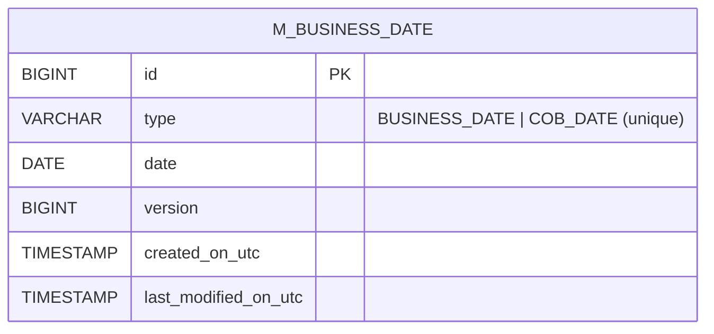

In banking workflows a "today" is not the wall-clock day. Apache Fineract's `fineract-core` exposes an explicit *business date* per tenant so accruals, schedules, and COB processing operate on a deterministic logical date that the operator can advance — manually, or via a scheduled job — independently of the host clock. This page covers the `infrastructure/businessdate/` sub-package: the enum, entity, repositories, API, validation and the `INCREASE_BUSINESS_DATE_BY_1_DAY` / `INCREASE_COB_DATE_BY_1_DAY` jobs.

Source root: `fineract-core/src/main/java/org/apache/fineract/infrastructure/businessdate/`.

## Why two dates?

Fineract distinguishes two logical dates per tenant. Both are typed by `BusinessDateType`:

```java fineract-core/.../businessdate/domain/BusinessDateType.java
public enum BusinessDateType {

    BUSINESS_DATE(1, "Business Date"),
    COB_DATE(2, "Close of Business Date");

    private final Integer id;
    private final String description;

    public String getName() {
        return name();
    }
}
```

| Type | Meaning | Used by |
| --- | --- | --- |
| `BUSINESS_DATE` | The *operational* today. New transactions, default `transactionDate`, ageing checks, etc. | API write paths, manual loan operations, accruals. |
| `COB_DATE` | The most recently *closed* day. After Loan COB runs against business date *D*, `COB_DATE` advances to *D*. Effectively `COB_DATE = BUSINESS_DATE - 1` when COB is up-to-date. | Loan COB chain decisions, "is COB up-to-date" guards. |

The relationship is enforced by validation and by an `ENABLE_AUTOMATIC_COB_DATE_ADJUSTMENT` global flag (see [Configuration](/core/configuration-and-global-config)).

## Persistence model



The entity is at `infrastructure/businessdate/domain/BusinessDate.java`:

```java fineract-core/.../businessdate/domain/BusinessDate.java
@Entity
@Table(name = "m_business_date", uniqueConstraints = {
        @UniqueConstraint(name = "uq_business_date_type", columnNames = { "type" }) })
public class BusinessDate extends AbstractAuditableWithUTCDateTimeCustom<Long> {

    @Enumerated(EnumType.STRING)
    @Column(name = "type")
    private BusinessDateType type;

    @Column(name = "date", columnDefinition = "DATE")
    private LocalDate date;

    @Version
    private Long version;

    public static BusinessDate instance(@NotNull BusinessDateType businessDateType, @NotNull LocalDate date) {
        return new BusinessDate().setType(businessDateType).setDate(date);
    }
}
```

Key points:

- It extends `AbstractAuditableWithUTCDateTimeCustom` — audit columns are written in UTC, not tenant-local.
- The `type` column carries the enum *name* (e.g. `BUSINESS_DATE`) and is uniquely constrained, so a tenant can have at most one row per type.
- `@Version` provides optimistic locking — important because the same row is updated by the API and by the scheduled increase-by-1-day job.

The repository at `domain/BusinessDateRepository.java` extends Spring Data's `JpaRepository<BusinessDate, Long>` and is consumed by the read/write services.

## Read and write services

Both interfaces live under `service/`:

| Interface | Implementation | Responsibility |
| --- | --- | --- |
| `BusinessDateReadPlatformService` | `BusinessDateReadPlatformServiceImpl` | List all dates, fetch one by type, return `BusinessDateData` DTOs for the API. |
| `BusinessDateWritePlatformService` | `BusinessDateWritePlatformServiceImpl` | Set a date (with constraint checks), increase BUSINESS_DATE by one day, optionally advance COB_DATE in lockstep. |

`BusinessDateData` (under `data/`) is the API DTO. `BusinessDateMapper` (under `mapper/`) is a MapStruct mapper from entity to DTO.

The write service is also the entry point used by the scheduler — both the API and the Quartz job invoke the same write methods, which then update audit fields, bump `@Version`, and (if `ENABLE_AUTOMATIC_COB_DATE_ADJUSTMENT` is on) keep `COB_DATE` consistent.

## REST API resource

`api/BusinessDateApiResource.java` exposes the dates over HTTP. It lives in `fineract-core` rather than `fineract-provider` because the COB engine (`fineract-cob`) needs to call it indirectly during integration testing without dragging in the provider.

The conventional endpoints are:

| Method | Path | Behaviour |
| --- | --- | --- |
| `GET` | `/businessdate` | Return all configured dates. |
| `GET` | `/businessdate/{type}` | Return one date (e.g. `BUSINESS_DATE`). |
| `POST` | `/businessdate` | Set a date. Body: `{ "type": "BUSINESS_DATE", "date": "01 January 2025", "dateFormat": "dd MMMM yyyy", "locale": "en" }`. |

The handler delegates through the command framework — see the `command/` and `handler/` sub-packages of `businessdate/` for the create/update wrappers used by maker-checker.

## Validation

`validation/` contains the JSON deserializer that validates incoming payloads:

- `type` must be a member of `BusinessDateType`.
- `date` must parse against the supplied `dateFormat`/`locale`.
- When updating `COB_DATE`, the new value cannot move ahead of `BUSINESS_DATE` (and vice versa) unless `ENABLE_AUTOMATIC_COB_DATE_ADJUSTMENT` is off.

Failures throw `PlatformApiDataValidationException` populated by `DataValidatorBuilder` (see [Infrastructure Core](/core/infrastructure-core)).

## Runtime access: `DateUtils` and `ThreadLocalContextUtil`

Application code does not query `m_business_date` on the hot path. Instead, the per-request filter loads all `BusinessDate` rows into a `Map<BusinessDateType, LocalDate>` stored in `FineractContext` and pushed into `ThreadLocalContextUtil` for the duration of the request. The convention is then:

```java
// Always prefer this over LocalDate.now()
LocalDate today = DateUtils.getBusinessLocalDate();

// Direct access to either typed date
LocalDate cob = ThreadLocalContextUtil.getBusinessDateByType(BusinessDateType.COB_DATE);
```

Background jobs (Quartz / Spring Batch) load the same map into their thread-local before running so all downstream code sees identical values.

```mermaid
sequenceDiagram
    autonumber
    participant Filter as Auth/Tenant filter
    participant Repo as BusinessDateRepository
    participant TL as ThreadLocalContextUtil
    participant Code as DateUtils.getBusinessLocalDate()

    Filter->>Repo: findAll()
    Repo-->>Filter: List&lt;BusinessDate&gt;
    Filter->>TL: setBusinessDates(map)
    Filter->>Code: (request body executes)
    Code->>TL: getBusinessDateByType(BUSINESS_DATE)
    TL-->>Code: 2025-01-15
```

## The increase-by-one-day jobs

Two scheduled jobs advance the dates:

```java fineract-core/.../jobs/service/JobName.java
INCREASE_BUSINESS_DATE_BY_1_DAY("Increase Business Date by 1 day"),
INCREASE_COB_DATE_BY_1_DAY("Increase COB Date by 1 day"),
```

(Excerpted from the `JobName` enum — full list in [Jobs Framework](/core/jobs-framework).)

Implementations live under `fineract-provider/.../infrastructure/jobs/service/increasedateby1day/`. Each one:

1. Loads the matching `BusinessDate` row by type.
2. Calls `setDate(currentDate.plusDays(1))`.
3. Saves with optimistic locking.
4. If `BUSINESS_DATE` was just advanced and `ENABLE_AUTOMATIC_COB_DATE_ADJUSTMENT` is on, also bumps `COB_DATE` to keep them in step.

Operators normally chain these jobs:


<Note>
The order is intentional. `COB_DATE` is advanced *before* `LOAN_COB` runs because `LOAN_COB` reads `COB_DATE` to decide which loans to process. `BUSINESS_DATE` is advanced *after* the day's post-COB jobs so user-facing operations the next morning see a fresh "today".
</Note>

## Interaction with COB

The COB engine (in `fineract-cob` and `fineract-provider/.../cob/`) uses `BusinessDate` to:

1. Drive partitioning: `LoanCOBPartitioner` filters loans whose `last_closed_business_date` lags behind `COB_DATE` and partitions them across worker threads.
2. Compute event payloads: every business event emitted during COB carries the COB date.
3. Decide whether a loan can be operated on inline — if a loan's `last_closed_business_date` is more than one behind `COB_DATE`, the inline COB tasklets (`InlineLoanCOBBuildExecutionContextTasklet`, `ApplyLoanLockTasklet`) catch it up first.

The COB business rule "no manual loan write can advance past `COB_DATE`" is enforced inside the loan write services by reading `ThreadLocalContextUtil.getBusinessDateByType(COB_DATE)`.

## Toggle: `ENABLE_BUSINESS_DATE`

The whole subsystem is gated by a global configuration flag:

```java fineract-core/.../configuration/api/GlobalConfigurationConstants.java
public static final String ENABLE_BUSINESS_DATE = "enable-business-date";
public static final String ENABLE_AUTOMATIC_COB_DATE_ADJUSTMENT = "enable-automatic-cob-date-adjustment";
```

When `ENABLE_BUSINESS_DATE` is `false`:

- `DateUtils.getBusinessLocalDate()` falls back to `LocalDate.now()` in the system zone.
- The API resource still works but writes are ignored by callers.
- The scheduled jobs still advance the row but no consumer reads it.

When `ENABLE_AUTOMATIC_COB_DATE_ADJUSTMENT` is `true`, advancing `BUSINESS_DATE` via the API or job also pushes `COB_DATE` to the same value − 1 (or equal, depending on operator preference). When `false`, the two dates are independent and the operator is responsible for keeping them aligned.

## Class index

<CardGroup cols={2}>
  <Card title="domain/BusinessDateType" icon="tags">
    Enum of the two date types (`BUSINESS_DATE`, `COB_DATE`).
  </Card>
  <Card title="domain/BusinessDate" icon="database">
    JPA entity backed by `m_business_date`. Optimistically locked.
  </Card>
  <Card title="domain/BusinessDateRepository" icon="database">
    Spring Data JPA repository.
  </Card>
  <Card title="service/BusinessDateReadPlatformService(Impl)" icon="eye">
    Read DTOs for the API.
  </Card>
  <Card title="service/BusinessDateWritePlatformService(Impl)" icon="pen-to-square">
    Create/update with version check + COB sync.
  </Card>
  <Card title="api/BusinessDateApiResource" icon="globe">
    JAX-RS endpoints under `/businessdate`.
  </Card>
  <Card title="data/BusinessDateData" icon="file">
    DTO returned by the API.
  </Card>
  <Card title="mapper/BusinessDateMapper" icon="arrows-spin">
    MapStruct entity→DTO mapping.
  </Card>
  <Card title="command + handler" icon="terminal">
    Wrappers for the maker-checker command bus.
  </Card>
  <Card title="validation/" icon="shield-check">
    JSON deserializer + DataValidatorBuilder usage.
  </Card>
  <Card title="exception/" icon="triangle-exclamation">
    Business-date-specific platform exceptions.
  </Card>
</CardGroup>

## Operational tips

<Tip>
For most production deployments, the cron for the two date-advance jobs should run *together* in the COB chain so the dates can never drift independently. Operators sometimes also wire a "freeze business date" override during incident response — that's just disabling the `INCREASE_BUSINESS_DATE_BY_1_DAY` job via the scheduler API.
</Tip>

<Note>
The business date subsystem is **per-tenant**. Each tenant database has its own `m_business_date` table; the multi-tenant routing datasource (see [Infrastructure Core](/core/infrastructure-core) → `service/database/`) ensures reads and writes always target the active tenant.
</Note>

## Initial seeding

Out of the box a fresh tenant DB has *no* rows in `m_business_date`. The first call to `DateUtils.getBusinessLocalDate()` would then fall back to `LocalDate.now()` in the tenant's zone, which is fine but means the operator hasn't yet opted in. The conventional bootstrap is:

<Steps>
  <Step title="Enable the toggle">
    `PUT /configurations/{id}` for the `enable-business-date` property with `{ enabled: true }`.
  </Step>
  <Step title="Seed the BUSINESS_DATE row">
    `POST /businessdate { "type": "BUSINESS_DATE", "date": "<today in tenant zone>", "dateFormat": "yyyy-MM-dd", "locale": "en" }`.
  </Step>
  <Step title="Seed COB_DATE">
    `POST /businessdate { "type": "COB_DATE", "date": "<yesterday>", … }`. With `ENABLE_AUTOMATIC_COB_DATE_ADJUSTMENT` on, future advances of `BUSINESS_DATE` will keep this row consistent.
  </Step>
  <Step title="Schedule the daily jobs">
    Use the scheduler API to enable `INCREASE_BUSINESS_DATE_BY_1_DAY` and `INCREASE_COB_DATE_BY_1_DAY` at the right cron times (typically right after the COB chain runs).
  </Step>
</Steps>

## Troubleshooting

| Symptom | Likely cause |
| --- | --- |
| `DateUtils.getBusinessLocalDate()` returns wall clock | `ENABLE_BUSINESS_DATE` is off or the row was never seeded. |
| `OptimisticLockException` on `POST /businessdate` | The scheduler advanced the row between the API read and your write. Re-fetch and retry. |
| COB jobs complain "COB_DATE is in the future" | `ENABLE_AUTOMATIC_COB_DATE_ADJUSTMENT` is off and the operator advanced `BUSINESS_DATE` without bumping `COB_DATE`. |
| COB chain refuses to run | `COB_DATE` lags `BUSINESS_DATE` by more than one day — catch-up runs are needed; the inline COB endpoint may help. |
| Audit columns show wrong timestamp | `BusinessDate` extends `AbstractAuditableWithUTCDateTimeCustom` — audit columns are intentionally UTC, not tenant-local. |

## Why an entity, not a config row?

Why not store the dates as `c_configuration` rows? Two reasons:

1. **Optimistic locking** — `@Version` on `BusinessDate` lets concurrent scheduler + API writes detect collisions. `c_configuration` rows don't carry one.
2. **Audit columns and UTC timestamps** — the date-advance subsystem is forensically interesting; you want to see exactly when and by whom each advance occurred. `AbstractAuditableWithUTCDateTimeCustom` gives that.
