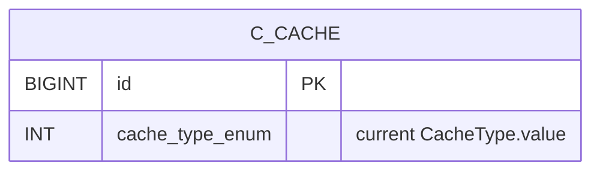

Apache Fineract caches a handful of hot read paths (permissions, currencies, code values, configuration flags) behind Spring's `@Cacheable` abstraction. To support both single-instance and clustered deployments without redeploying, `fineract-core` exposes a *runtime-switchable* `CacheManager`: operators flip between **no cache**, **single-node (Ehcache)** and (intended) **multi-node** modes through a REST endpoint. This page covers the enum, the delegating cache manager, the API resource and the persistence model that records the active choice.

Source root: `fineract-core/src/main/java/org/apache/fineract/infrastructure/cache/`.

## Subsystem map

```mermaid
flowchart LR
    subgraph CORE["fineract-core / cache"]
        CT[CacheType enum]
        PC[PlatformCache entity<br/>c_cache]
        PCR[PlatformCacheRepository]
        RDM[RuntimeDelegatingCacheManager]
        PCC[PlatformCacheConfiguration<br/>@EnableCaching]
        CWS[CacheWritePlatformService]
        API[CacheApiResource<br/>/v1/caches]
        CE[CacheEnumerations]
    end

    subgraph SPRING["Spring caching"]
        AbstractCacheable[@Cacheable / @CacheEvict]
        EH[ehCacheManager<br/>(Ehcache 3)]
        DEF[defaultCacheManager<br/>(NoOpCacheManager)]
    end

    AbstractCacheable --> RDM
    RDM -.delegates to.-> EH
    RDM -.delegates to.-> DEF
    PCC --> RDM
    API --> CWS
    CWS --> RDM
    CWS --> PCR
    PCR --> PC
    CT -.id <-> code.-> CE
```

## `CacheType` enum

```java fineract-core/.../cache/domain/CacheType.java
public enum CacheType {

    INVALID(0, "cacheType.invalid"),
    NO_CACHE(1, "cacheType.noCache"),
    SINGLE_NODE(2, "cacheType.singleNode"),
    MULTI_NODE(3, "cacheType.multiNode");

    private final Integer value;
    private final String code;

    public static CacheType fromInt(final Integer value) { /* ... */ }

    public boolean isNoCache()           { return NO_CACHE.getValue().equals(this.value); }
    public boolean isEhcache()           { return SINGLE_NODE.getValue().equals(this.value); }
    public boolean isDistributedCache()  { return MULTI_NODE.getValue().equals(this.value); }
}
```

| Constant | Value | Meaning |
| --- | --- | --- |
| `INVALID` | 0 | Defensive sentinel returned by `fromInt(value)` when the integer isn't recognised. Never persisted in normal operation. |
| `NO_CACHE` | 1 | All `@Cacheable` calls go through `NoOpCacheManager` — every call computes the real value, nothing is stored. The safe default. |
| `SINGLE_NODE` | 2 | Use Ehcache 3 as a JVM-local cache. Correct only when this JVM is the *single* writer for the cached domain. |
| `MULTI_NODE` | 3 | Distributed (multi-JVM) cache. **Not implemented** — `RuntimeDelegatingCacheManager.switchToCache` throws `UnsupportedOperationException` on this branch. |

The three boolean helpers (`isNoCache()`, `isEhcache()`, `isDistributedCache()`) are how application code branches on the mode without re-checking integer ids.

## `CacheEnumerations`

`fineract-core/.../cache/CacheEnumerations.java` translates between integer ids and the platform's standard `EnumOptionData` shape `{ id, code, value }` used by the API:

```java fineract-core/.../cache/CacheEnumerations.java
public static EnumOptionData cacheType(final CacheType cacheType) {
    EnumOptionData optionData = new EnumOptionData(
            CacheType.INVALID.getValue().longValue(), CacheType.INVALID.getCode(), "Invalid");
    switch (cacheType) {
        case NO_CACHE:
            optionData = new EnumOptionData(
                CacheType.NO_CACHE.getValue().longValue(),
                CacheType.NO_CACHE.getCode(), "No cache");
            break;
        case SINGLE_NODE:
            optionData = new EnumOptionData(
                CacheType.SINGLE_NODE.getValue().longValue(),
                CacheType.SINGLE_NODE.getCode(), "Single node");
            break;
        case MULTI_NODE:
            optionData = new EnumOptionData(
                CacheType.MULTI_NODE.getValue().longValue(),
                CacheType.MULTI_NODE.getCode(), "Multi node");
            break;
        // INVALID handled by default initialisation
    }
    return optionData;
}
```

## Persistence



Single-row table written by the write service:

```java fineract-core/.../cache/domain/PlatformCache.java
@Entity
@Table(name = "c_cache")
public class PlatformCache extends AbstractPersistableCustom<Long> {

    @Column(name = "cache_type_enum")
    private Integer cacheType;

    public boolean isNoCachedEnabled()       { return CacheType.fromInt(this.cacheType).isNoCache(); }
    public boolean isEhcacheEnabled()        { return CacheType.fromInt(this.cacheType).isEhcache(); }
    public boolean isDistributedCacheEnabled() { return CacheType.fromInt(this.cacheType).isDistributedCache(); }
}
```

The repository, `PlatformCacheRepository`, is a thin Spring Data interface — one row per tenant, loaded at startup, updated when the operator switches modes via the API.

## `PlatformCacheConfiguration`

The `@EnableCaching` entry point:

```java fineract-core/.../cache/PlatformCacheConfiguration.java
@Configuration
@EnableCaching
public class PlatformCacheConfiguration implements CachingConfigurer {

    @Autowired
    private RuntimeDelegatingCacheManager delegatingCacheManager;

    @Bean
    @Override
    public CacheManager cacheManager() {
        return this.delegatingCacheManager;
    }
}
```

Spring's `@Cacheable`, `@CachePut`, `@CacheEvict` annotations resolve to *this* `CacheManager` bean. Because it's a delegating implementation, switching mode at runtime swaps the underlying delegate without re-publishing Spring beans.

## `RuntimeDelegatingCacheManager`

The core of the subsystem:

```java fineract-core/.../cache/service/RuntimeDelegatingCacheManager.java
/**
 * At present this implementation of {@link CacheManager} just delegates to the real {@link CacheManager} to use.
 *
 * By default it is {@link NoOpCacheManager} but we can change that by checking some persisted configuration in the
 * database on startup and allow user to switch implementation through UI/API
 */
@Component(value = "runtimeDelegatingCacheManager")
@RequiredArgsConstructor
@Slf4j
public class RuntimeDelegatingCacheManager implements CacheManager, InitializingBean {

    @Qualifier("ehCacheManager")
    private final CacheManager ehCacheManager;
    @Qualifier("defaultCacheManager")
    private final CacheManager defaultCacheManager;
    private CacheManager currentCacheManager;

    @Override
    public void afterPropertiesSet() throws Exception {
        currentCacheManager = defaultCacheManager;
    }

    @Override
    public Cache getCache(final String name) {
        return currentCacheManager.getCache(name);
    }

    @Override
    public Collection<String> getCacheNames() {
        return currentCacheManager.getCacheNames();
    }
    // ...
}
```

Two `CacheManager`s are injected:

- `defaultCacheManager` — a `NoOpCacheManager`. Wired in `fineract-provider` (or the cache module config) under the qualifier `"defaultCacheManager"`. Always present, always safe.
- `ehCacheManager` — the real Ehcache-backed `CacheManager` wired in `fineract-provider`.

A private field, `currentCacheManager`, holds whichever delegate is active. `afterPropertiesSet` initialises it to the safe default; the write service flips it via `switchToCache`.

### `switchToCache` — the runtime swap

```java fineract-core/.../cache/service/RuntimeDelegatingCacheManager.java
public Map<String, Object> switchToCache(final boolean ehcacheEnabled, final CacheType toCacheType) {
    final Map<String, Object> changes = new HashMap<>();
    final boolean noCacheEnabled = !ehcacheEnabled;

    switch (toCacheType) {
        case INVALID -> log.warn("Invalid cache type used");
        case NO_CACHE -> {
            if (!noCacheEnabled) {
                changes.put(CacheApiConstants.CACHE_TYPE_PARAMETER, toCacheType.getValue());
            }
            currentCacheManager = defaultCacheManager;
        }
        case SINGLE_NODE -> {
            if (!ehcacheEnabled) {
                changes.put(CacheApiConstants.CACHE_TYPE_PARAMETER, toCacheType.getValue());
                clearEhCache();
            }
            currentCacheManager = ehCacheManager;
            if (currentCacheManager.getCacheNames().isEmpty()) {
                log.error("No caches configured for activated CacheManager {}", currentCacheManager);
            }
        }
        case MULTI_NODE -> throw new UnsupportedOperationException("Multi node cache is not supported");
    }
    return changes;
}
```

Behaviour:

- Switching to `NO_CACHE`: delegate becomes `NoOpCacheManager`. Existing entries are abandoned (not actively cleared — the next access just returns nothing).
- Switching to `SINGLE_NODE` from no-cache: clears the Ehcache first (it might hold stale entries from a previous activation) and points the delegate at it.
- Switching to `MULTI_NODE`: explicit `UnsupportedOperationException`. The constant exists for forward-compatibility; the implementation has never been merged.
- Returns a `changes` map (empty if no change) compatible with the platform's standard write-side response shape.

### `clearEhCache`

```java
private void clearEhCache() {
    for (String cacheName : ehCacheManager.getCacheNames()) {
        try {
            if (Objects.nonNull(ehCacheManager.getCache(cacheName))) {
                Objects.requireNonNull(ehCacheManager.getCache(cacheName)).clear();
            }
        } catch (NullPointerException npe) {
            log.warn("NullPointerException occurred", npe);
        }
    }
}
```

Iterates the Ehcache cache names and clears each. The `try/catch` is defensive against a race between iteration and shutdown.

## Write service

```java fineract-core/.../cache/service/CacheWritePlatformServiceJpaRepositoryImpl.java
@Service
public class CacheWritePlatformServiceJpaRepositoryImpl implements CacheWritePlatformService {

    private final ConfigurationDomainService configurationDomainService;
    private final RuntimeDelegatingCacheManager cacheService;

    @Transactional
    @Override
    public Map<String, Object> switchToCache(final CacheType toCacheType) {
        final boolean ehCacheEnabled = this.configurationDomainService.isEhcacheEnabled();
        final Map<String, Object> changes = this.cacheService.switchToCache(ehCacheEnabled, toCacheType);
        if (!changes.isEmpty()) {
            // updates ConfigurationDomainService cache flag + c_cache row
        }
        return changes;
    }
}
```

The write service:

1. Reads the current `isEhcacheEnabled()` flag from `ConfigurationDomainService` (see [Configuration](/core/configuration-and-global-config)).
2. Calls `RuntimeDelegatingCacheManager.switchToCache` to swap the delegate (and clear Ehcache if needed).
3. Persists the new choice into the `c_cache` row and updates the `ConfigurationDomainService` flag.

This dual write — `c_cache` row plus the `ConfigurationDomainService.updateCache(CacheType)` call defined in the configuration interface — keeps the cache decision visible to other read paths that branch on `isEhcacheEnabled()` without going through Spring's `CacheManager`.

## REST API

```java fineract-core/.../cache/api/CacheApiResource.java
@Path("/v1/caches")
@Produces({ MediaType.APPLICATION_JSON })
@Component
@Tag(name = "Cache", description = """
        The following settings are possible for cache:

        No Caching: caching turned off

        Single node: caching on for single instance deployments of platorm
        (works for multiple tenants but only one tomcat).
        By default caching is set to No Caching. Switching between caches results
        in the cache been clear e.g. from single node to no cache and back again
        would clear down the single node cache.
        """)
public class CacheApiResource {

    @Qualifier("runtimeDelegatingCacheManager")
    private final RuntimeDelegatingCacheManager cacheService;
    private final CommandDispatcher dispatcher;

    @GET
    public Collection<CacheData> retrieveAll() {
        return cacheService.retrieveAll();
    }

    @PUT
    @Consumes({ MediaType.APPLICATION_JSON })
    public CacheSwitchResponse switchCache(@Valid CacheSwitchRequest request) {
        final var command = new CacheSwitchCommand();
        command.setPayload(request);
        // dispatch through the command bus...
    }
}
```

Endpoints:

| Method | Path | Behaviour |
| --- | --- | --- |
| `GET` | `/v1/caches` | Returns the list of cache modes with an `enabled` boolean on the currently active one. |
| `PUT` | `/v1/caches` | Body `{ "cacheType": 1\|2 }`. Switches mode via the command bus. |

`CacheData` is the response shape: `{ cacheType: { id, code, value }, enabled }` produced by `retrieveAll()`:

```java fineract-core/.../cache/service/RuntimeDelegatingCacheManager.java
public Collection<CacheData> retrieveAll() {
    final boolean ehCacheEnabled = currentCacheManager == ehCacheManager;
    final boolean noCacheEnabled = currentCacheManager == defaultCacheManager;

    final EnumOptionData noCacheType = CacheEnumerations.cacheType(CacheType.NO_CACHE);
    final EnumOptionData singleNodeCacheType = CacheEnumerations.cacheType(CacheType.SINGLE_NODE);

    final CacheData noCache = CacheData.builder().cacheType(noCacheType).enabled(noCacheEnabled).build();
    final CacheData singleNodeCache = CacheData.builder().cacheType(singleNodeCacheType).enabled(ehCacheEnabled).build();

    return Arrays.asList(noCache, singleNodeCache);
}
```

Note that only `NO_CACHE` and `SINGLE_NODE` are returned — `MULTI_NODE` is not exposed because the implementation is not present.

## Command bus integration

`fineract-core/.../cache/command/CacheSwitchCommand.java` plus its handler under `handler/` plug the PUT into the platform's command dispatcher (so the switch is auditable / maker-checker-able). The handler ultimately calls `CacheWritePlatformService.switchToCache`.

## What is cached?

`@Cacheable` annotations are scattered across the read services. The most commonly-cached ones are:

| Cache name | Where annotated | Purpose |
| --- | --- | --- |
| `permissions` | `useradministration/permission/` services | Permission lookup by role. |
| `users` / `usersByUsername` | `useradministration/users/` services | Per-username lookup during auth. |
| `codes` / `codeValues` | `codes/` read services | User-defined enumerations. |
| `currencies` | `organisation/monetary/` read services | Currency definitions per tenant. |
| `configByName` | `configuration/` read service | Global configuration property by name. |
| `holidays` | `organisation/holiday/` read services | Active holiday set. |
| `officesByHierarchy` | `organisation/office/` read service | Office hierarchy. |

Each one is also marked with `@CacheEvict` on the matching write path so the cache stays consistent. Switching to `NO_CACHE` makes every annotated method recompute on every call — heavier but always correct.

## Switching flow

```mermaid
sequenceDiagram
    autonumber
    participant Admin
    participant API as CacheApiResource
    participant Cmd as CacheSwitchCommand handler
    participant Write as CacheWritePlatformService
    participant Cfg as ConfigurationDomainService
    participant CM as RuntimeDelegatingCacheManager
    participant DB

    Admin->>API: PUT /v1/caches { cacheType: 2 }
    API->>Cmd: dispatch
    Cmd->>Write: switchToCache(SINGLE_NODE)
    Write->>Cfg: isEhcacheEnabled() ?
    Cfg-->>Write: false
    Write->>CM: switchToCache(false, SINGLE_NODE)
    CM->>CM: clearEhCache(); currentCacheManager = ehCacheManager
    CM-->>Write: changes = { cacheType: 2 }
    Write->>DB: UPDATE c_cache SET cache_type_enum = 2
    Write->>Cfg: updateCache(SINGLE_NODE)
    Write-->>Cmd: changes map
    Cmd-->>API: CacheSwitchResponse
    API-->>Admin: 200 OK
```

## Class index

<CardGroup cols={2}>
  <Card title="domain/CacheType" icon="layer-group">
    The mode enum (`INVALID`, `NO_CACHE`, `SINGLE_NODE`, `MULTI_NODE`).
  </Card>
  <Card title="domain/PlatformCache" icon="database">
    Single-row `c_cache` entity.
  </Card>
  <Card title="domain/PlatformCacheRepository" icon="magnifying-glass">
    Spring Data repo.
  </Card>
  <Card title="service/RuntimeDelegatingCacheManager" icon="layer-group">
    The active `CacheManager` bean — delegates to ehCache or NoOp.
  </Card>
  <Card title="service/CacheWritePlatformService(Impl)" icon="pen-to-square">
    Swap + persist + update ConfigurationDomainService.
  </Card>
  <Card title="PlatformCacheConfiguration" icon="gear">
    `@EnableCaching` and the `cacheManager` bean.
  </Card>
  <Card title="api/CacheApiResource" icon="globe">
    `/v1/caches` GET + PUT.
  </Card>
  <Card title="command/CacheSwitchCommand" icon="terminal">
    Command bus payload.
  </Card>
  <Card title="handler/" icon="play">
    Command handler that calls the write service.
  </Card>
  <Card title="data/CacheData / CacheSwitchRequest / CacheSwitchResponse" icon="file">
    Read DTO + request/response shapes.
  </Card>
  <Card title="CacheEnumerations" icon="arrows-spin">
    `CacheType` → `EnumOptionData` mapper.
  </Card>
  <Card title="CacheApiConstants" icon="hashtag">
    Resource and parameter name constants.
  </Card>
</CardGroup>

## Practical notes

<Note>
- The Ehcache `CacheManager` is wired with the qualifier `ehCacheManager` in `fineract-provider`'s cache config. The cache names declared there (`permissions`, `users`, …) must exist or `getCache(name)` returns `null` and Spring throws when an annotation tries to hit a missing region.
- `MULTI_NODE` exists in the enum but the switch path throws. If you operate Fineract in a clustered configuration, **keep `SINGLE_NODE` off** (use `NO_CACHE`) or accept per-node cache divergence — the platform does not invalidate across JVMs.
- The cache state survives JVM restarts via the `c_cache` row, so a deployment that boots with `SINGLE_NODE` selected will re-activate Ehcache automatically.
</Note>

<Tip>
For local dev where you want to see the latest data without restarting, hit `PUT /v1/caches { cacheType: 1 }` — switching to `NO_CACHE` immediately bypasses Ehcache for every annotated method.
</Tip>

## Continue with

- [Configuration](/core/configuration-and-global-config) — `ConfigurationDomainService.isEhcacheEnabled()` and `updateCache(CacheType)`.
- [Infrastructure Core](/core/infrastructure-core) — `EnumOptionData` and the command bus.
