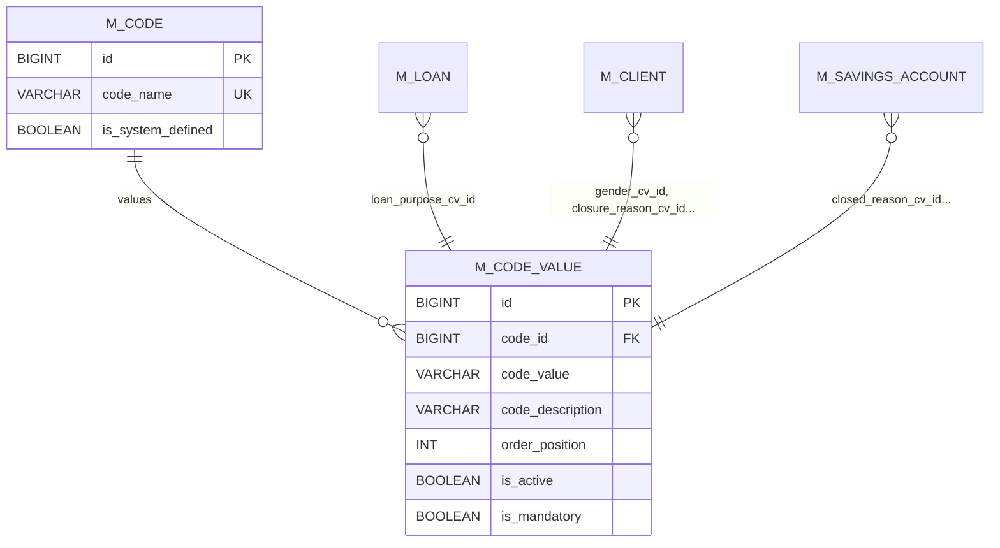
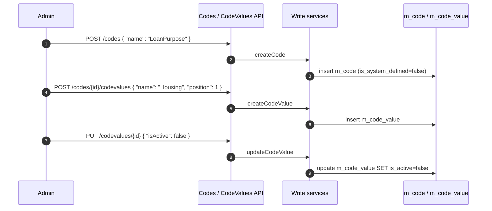

Apache Fineract avoids hard-coding enumerations like *loan purpose*, *client gender*, *closure reason* or *ID-document type*. Instead, the `infrastructure/codes/` sub-package of `fineract-core` provides a generic registry of *Code* and *CodeValue* rows that operators maintain at runtime through the API. Every domain entity that needs a configurable dropdown references a `CodeValue` row by foreign key. This page walks the model, the services and the integration points.

Source root: `fineract-core/src/main/java/org/apache/fineract/infrastructure/codes/`.

## Why "Codes"?

Picture a typical microfinance organisation: their loan officers want to track loan purposes ("housing", "education", "agriculture"), each MFI has its own list, and these change over the lifetime of the deployment. Hard-coding them in Java would force a release for every change. Instead, the operator:

1. Creates a `Code` named e.g. `LoanPurpose` (one-time, optionally system-defined).
2. Creates `CodeValue` rows under it (`Housing`, `Education`, `Agriculture`).
3. The loan create form references `CodeValue.id` for its `loanPurposeId` field.

This pattern repeats across the platform — every "Select one of …" dropdown that isn't tied to platform semantics is a code.

## Domain model



### `Code` entity

```java fineract-core/.../codes/domain/Code.java
@Entity
@Table(name = "m_code", uniqueConstraints = {
        @UniqueConstraint(columnNames = { "code_name" }, name = "code_name") })
public class Code extends AbstractPersistableCustom<Long> {

    @Column(name = "code_name", length = 100)
    private String name;

    @Column(name = "is_system_defined")
    private boolean systemDefined;

    @OneToMany(fetch = FetchType.EAGER, cascade = CascadeType.ALL,
               mappedBy = "code", orphanRemoval = true)
    private Set<CodeValue> values;
    // ...
}
```

Key invariants enforced by the entity:

- `code_name` is unique platform-wide.
- A *system-defined* code cannot be renamed; `update()` throws `SystemDefinedCodeCannotBeChangedException` if you try:

```java fineract-core/.../codes/domain/Code.java
public Map<String, Object> update(final JsonCommand command) {
    if (this.systemDefined) {
        throw new SystemDefinedCodeCannotBeChangedException();
    }
    // ... otherwise apply name change ...
}
```

- Values are eagerly fetched and cascade-deleted with the code; deleting a code value-by-value is also supported through `CodeValueRepository`.

### `CodeValue` entity

`infrastructure/codes/domain/CodeValue.java` (extends `AbstractPersistableCustom<Long>`, table `m_code_value`) carries:

- `code` — `@ManyToOne` back-reference to its `Code`.
- `label` (column `code_value`) — the human-readable label.
- `description` (column `code_description`).
- `position` (column `order_position`) — display ordering.
- `isActive` — soft-disable a value without breaking historical FK references.
- `isMandatory` — used by `EntityDatatableChecks` validation to require this value at a certain workflow step.

### Repositories

| Type | Interface | Purpose |
| --- | --- | --- |
| Code | `CodeRepository` | Spring Data CRUD by id / name. |
| CodeValue | `CodeValueRepository` | Spring Data CRUD with `findByCodeNameAndLabel` style finders. |
| CodeValue | `CodeValueRepositoryWrapper` | Throws `CodeValueNotFoundException` on `findOneWithNotFoundDetection(id)` — used by domain code paths that want a fail-fast lookup. |

The wrapper pattern is the same one used elsewhere (e.g. `GlobalConfigurationRepositoryWrapper`) — see [Configuration](/core/configuration-and-global-config) for the convention.

## Read services

`service/CodeReadPlatformService` and `service/CodeValueReadPlatformService` return DTOs for the API:

- `CodeData` — `{ id, name, systemDefined }`.
- `CodeValueData` — `{ id, name, description, position, active, mandatory }`.

Both interfaces have JDBC-based implementations in `fineract-provider/.../infrastructure/codes/service/` that the provider wires up. They produce `Collection<CodeData>` / `Collection<CodeValueData>` for the UI dropdowns.

## Write side (in `fineract-provider`)

The corresponding write services and command handlers — `CodeWritePlatformServiceJpaRepositoryImpl`, `CodeValueWritePlatformServiceJpaRepositoryImpl` — live in `fineract-provider/.../infrastructure/codes/service/`, plus a `CodeCommandHandler` and `CodeValueCommandHandler` for the maker-checker bus. They translate `JsonCommand` payloads into create/update/delete operations on the entities defined here.

## Swagger documentation

The two swagger schema classes that document the public API live in `fineract-core` so they ship with the core jar:

- `api/CodesApiResourceSwagger.java`
- `api/CodeValuesApiResourceSwagger.java`

These are inner-record-only files referenced from the REST API resources `CodesApiResource` / `CodeValuesApiResource` in `fineract-provider`.

## How other modules reference codes

The convention everywhere is the `_cv_id` suffix on FK columns and a typed `CodeValue` field on the entity. A few examples:

| Entity | Column | Field |
| --- | --- | --- |
| `m_loan` | `loanpurpose_cv_id` | `Loan.loanPurpose: CodeValue` |
| `m_client` | `gender_cv_id`, `client_type_cv_id`, `client_classification_cv_id`, `sub_status` | `Client.gender`, `clientType`, `clientClassification`, `subStatus` |
| `m_client_identifier` | `document_type_id` | `ClientIdentifier.documentType: CodeValue` |
| `m_loan_repayment_schedule_history` | `closed_loan_status_cv_id` (and similar reason columns) | `CodeValue` |
| `m_savings_account` | `closed_reason_cv_id`, `reject_reason_cv_id`, `withdrawn_reason_cv_id` | `SavingsAccount.closeReason`, etc. |

Domain code typically pulls the value via the wrapper:

```java
final CodeValue purpose = this.codeValueRepository
        .findOneWithNotFoundDetection(loanPurposeId);
loan.setLoanPurpose(purpose);
```

So the only validation needed at the loan-write site is "does a `CodeValue` with that id exist". The Code that owns the value is irrelevant to the loan write path.

## Code lifecycle: creating a new dropdown



Once values are in place the loan create UI populates its "Loan purpose" dropdown by calling `/codes/LoanPurpose/codevalues` and submitting the chosen `id` as `loanPurposeId` on `POST /loans`.

## System-defined codes

The Liquibase migrations under `fineract-core/src/main/resources/db/changelog/tenant/` seed a handful of system-defined codes (e.g. `Gender`, `YesNo`, `LoanCollateral`, status reasons) with `is_system_defined = true`. Those code rows cannot be renamed via the API; their values can usually still be edited (so an operator can rename "Male" → "M" if desired) unless flagged otherwise in the migration.

<Tip>
If you need a hard-coded enum (one whose semantics the code branches on), keep it in Java and don't model it as a code. The `Code`/`CodeValue` model is exclusively for *user-facing dropdowns whose semantics are inert to the platform*.
</Tip>

## Validation interaction: `EntityDatatableChecks`

The datatable framework can require a particular `CodeValue` to be set before a workflow step is allowed (see [Data Queries & Datatables](/core/data-queries-and-datatables)). The check is configured by an `EntityDatatableChecks` row pointing at a datatable column that itself references a `CodeValue` foreign key.

## Constants

`CodeConstants.java` lives at the top of the package and declares the parameter names used by JSON commands:

```java fineract-core/.../codes/CodeConstants.java
public final class CodeConstants {
    public static final String CODE_RESOURCE_NAME = "code";
    public static final String CODE_VALUE_RESOURCE_NAME = "codevalue";
    public static final String CODE_NAME_PARAM_NAME = "name";
    public static final String CODE_VALUE_PARAM_NAME = "name";
    public static final String CODE_DESCRIPTION_PARAM_NAME = "description";
    public static final String CODE_POSITION_PARAM_NAME = "position";
    public static final String CODE_IS_ACTIVE_PARAM_NAME = "isActive";
    public static final String CODE_IS_MANDATORY_PARAM_NAME = "isMandatory";
    // ...
}
```

These are used by `CodeCommandFromApiJsonDeserializer` in the provider when validating incoming bodies (typical pattern, see [Infrastructure Core](/core/infrastructure-core) → serialization).

## Exceptions

`exception/`:

- `CodeNotFoundException` — 404 when a code id/name does not resolve.
- `CodeValueNotFoundException` — 404 when a code-value id does not resolve.
- `SystemDefinedCodeCannotBeChangedException` — 403 on attempts to rename a system code.
- `CodeValueLabelInvalidException` — 400 on invalid label content.
- `CodeDeletedException` — surfaces FK violations when a value or code is in use.

These derive from the standard `Abstract*` base classes in `infrastructure/core/exception/` (see [Infrastructure Core](/core/infrastructure-core)).

## Mapper

`mapper/` contains a MapStruct mapper from `CodeValue` → `CodeValueData` used by the read service. The mapping is one-to-one with no special transformation.

## Class index

<CardGroup cols={2}>
  <Card title="domain/Code" icon="database">
    JPA entity for a code header.
  </Card>
  <Card title="domain/CodeValue" icon="database">
    JPA entity for a single dropdown option.
  </Card>
  <Card title="domain/CodeRepository" icon="magnifying-glass">
    Spring Data repo for `Code`.
  </Card>
  <Card title="domain/CodeValueRepository" icon="magnifying-glass">
    Spring Data repo for `CodeValue`.
  </Card>
  <Card title="domain/CodeValueRepositoryWrapper" icon="shield">
    `findOneWithNotFoundDetection` wrapper throwing typed 404s.
  </Card>
  <Card title="service/CodeReadPlatformService" icon="eye">
    Read DTOs for the codes API.
  </Card>
  <Card title="service/CodeValueReadPlatformService" icon="eye">
    Read DTOs for the code-values API; supports filtering by code name.
  </Card>
  <Card title="api/CodesApiResourceSwagger" icon="file-lines">
    Swagger schema definitions for `/codes`.
  </Card>
  <Card title="api/CodeValuesApiResourceSwagger" icon="file-lines">
    Swagger schema definitions for `/codes/{codeId}/codevalues`.
  </Card>
  <Card title="exception/" icon="triangle-exclamation">
    Typed 404/403/400 exceptions.
  </Card>
  <Card title="mapper/" icon="arrows-spin">
    MapStruct entity→DTO mapping.
  </Card>
  <Card title="CodeConstants" icon="code">
    Resource and parameter name constants.
  </Card>
</CardGroup>

<Note>
The HTTP `*ApiResource` classes for codes are in `fineract-provider`, not `fineract-core`. The split keeps `fineract-core` free of JAX-RS resource registrations while still owning the entities, repositories, services and swagger schemas.
</Note>
