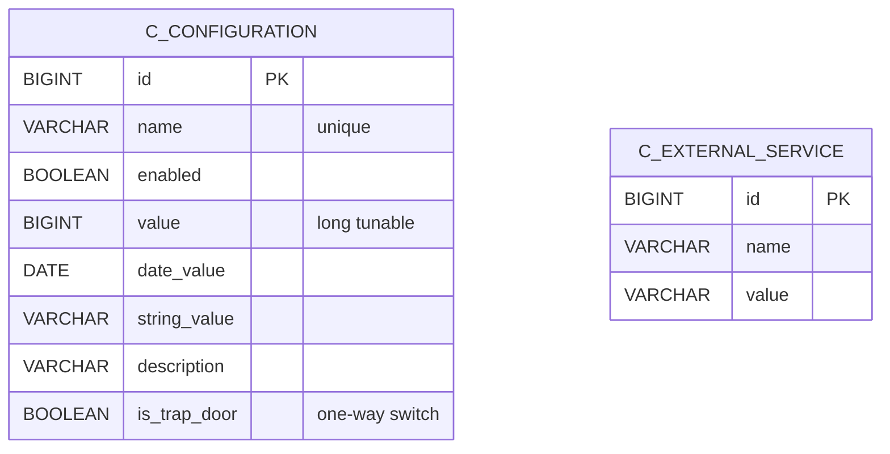
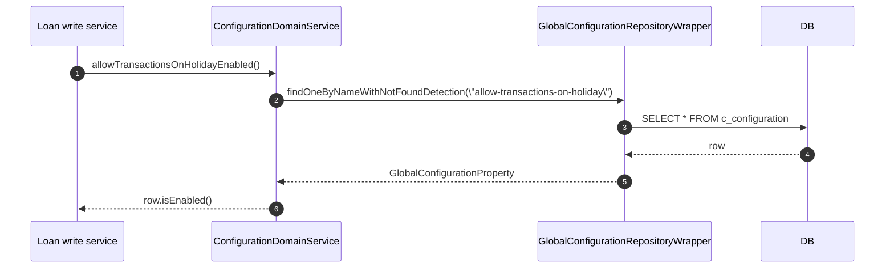
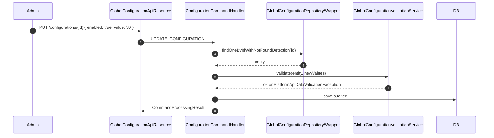

Apache Fineract exposes around 90 named runtime flags and tunables that operators flip without redeploying — maker-checker, two-factor auth, business date enablement, S3 document storage, accrual behaviour, password rules, COB toggles and many more. The `infrastructure/configuration/` package in `fineract-core` defines the entity, repository, constants, and service interface for these flags. This page tours the model and enumerates the notable settings.

Source root: `fineract-core/src/main/java/org/apache/fineract/infrastructure/configuration/`.

## The persistence model



A single configuration row is modelled by `GlobalConfigurationProperty`:

```java fineract-core/.../configuration/domain/GlobalConfigurationProperty.java
@Entity
@Table(name = "c_configuration")
public class GlobalConfigurationProperty extends AbstractPersistableCustom<Long> {

    @Column(name = "name", nullable = false)
    private String name;

    @Column(name = "enabled", nullable = false)
    private boolean enabled;

    @Column(name = "value", nullable = true)
    private Long value;

    @Column(name = "date_value", nullable = true)
    private LocalDate dateValue;

    @Column(name = "string_value", nullable = true)
    private String stringValue;

    @Column(name = "description", nullable = true)
    private String description;

    @Column(name = "is_trap_door", nullable = false)
    private boolean isTrapDoor;
    // ...
}
```

Two design ideas to note:

- A property is *polymorphic*: it may carry a boolean (`enabled`), a numeric tunable (`value`), a date (`dateValue`) or free text (`stringValue`). Some properties use only `enabled`; others combine `enabled` + `value` (e.g. `purge-external-events-older-than-days`).
- `is_trap_door` is a one-way switch. Once enabled, the row can never be disabled through the API. The migration seeds it as `true` for irreversible behavioural transitions (e.g. opting into a new accounting model). The validation service enforces this on update.

## Constants — the canonical names

Every flag has a string identifier defined in `GlobalConfigurationConstants`. A representative slice:

```java fineract-core/.../configuration/api/GlobalConfigurationConstants.java
public static final String MAKER_CHECKER = "maker-checker";
public static final String ENABLE_SAME_MAKER_CHECKER = "enable-same-maker-checker";
public static final String AMAZON_S3 = "amazon-s3";
public static final String RESCHEDULE_FUTURE_REPAYMENTS = "reschedule-future-repayments";
public static final String RESCHEDULE_REPAYMENTS_ON_HOLIDAYS = "reschedule-repayments-on-holidays";
public static final String ALLOW_TRANSACTIONS_ON_HOLIDAY = "allow-transactions-on-holiday";
public static final String ALLOW_TRANSACTIONS_ON_NON_WORKING_DAY = "allow-transactions-on-non-workingday";
public static final String CONSTRAINT_APPROACH_FOR_DATATABLES = "constraint-approach-for-datatables";
public static final String PENALTY_WAIT_PERIOD = "penalty-wait-period";
public static final String FORCE_PASSWORD_RESET_DAYS = "force-password-reset-days";
public static final String GRACE_ON_PENALTY_POSTING = "grace-on-penalty-posting";
public static final String FINANCIAL_YEAR_BEGINNING_MONTH = "financial-year-beginning-month";
public static final String MIN_CLIENTS_IN_GROUP = "min-clients-in-group";
public static final String MAX_CLIENTS_IN_GROUP = "max-clients-in-group";
public static final String ENABLE_BUSINESS_DATE = "enable-business-date";
public static final String ENABLE_AUTOMATIC_COB_DATE_ADJUSTMENT = "enable-automatic-cob-date-adjustment";
public static final String PURGE_EXTERNAL_EVENTS_OLDER_THAN_DAYS = "purge-external-events-older-than-days";
public static final String PURGE_PROCESSED_COMMANDS_OLDER_THAN_DAYS = "purge-processed-commands-older-than-days";
public static final String ENABLE_COB_BULK_EVENT = "enable-cob-bulk-event";
public static final String EXTERNAL_EVENT_BATCH_SIZE = "external-event-batch-size";
public static final String ENABLE_AUTO_GENERATED_EXTERNAL_ID = "enable-auto-generated-external-id";
public static final String MAX_LOGIN_RETRY_ATTEMPTS = "max-login-retry-attempts";
public static final String PASSWORD_REUSE_CHECK_HISTORY_COUNT = "password-reuse-check-history-count";
public static final String FORCE_WITHDRAWAL_ON_SAVINGS_ACCOUNT = "allow-force-withdrawal-on-savings-account";
public static final String FORCE_WITHDRAWAL_ON_SAVINGS_ACCOUNT_LIMIT = "force-withdrawal-on-savings-account-limit";
public static final String FORCE_PASSWORD_RESET_ON_FIRST_LOGIN = "force-password-reset-on-first-login";
public static final String BLOCK_TRANSACTIONS_ON_CLOSED_OVERPAID_LOANS = "block-transactions-on-closed-overpaid-loans";
public static final String DAYS_BEFORE_REPAYMENT_IS_DUE = "days-before-repayment-is-due";
public static final String DAYS_AFTER_REPAYMENT_IS_OVERDUE = "days-after-repayment-is-overdue";
public static final String ENABLE_PAYMENT_HUB_INTEGRATION = "enable-payment-hub-integration";
// ... and many more
```

The full list is in the file, ~90 constants long.

## Notable flag groups

<Accordion title="Workflow / authorisation">
| Constant | Effect when enabled |
| --- | --- |
| `MAKER_CHECKER` | Every write API call routes through the maker-checker bus instead of being executed directly. |
| `ENABLE_SAME_MAKER_CHECKER` | Allow the same user to be maker and checker. Off by default. |
| `MAX_LOGIN_RETRY_ATTEMPTS` | Tunable (`value`) — lock the account after N failed logins. |
| `FORCE_PASSWORD_RESET_DAYS` | Tunable — days between forced password resets. |
| `FORCE_PASSWORD_RESET_ON_FIRST_LOGIN` | Boolean — require reset on first sign-in. |
| `PASSWORD_REUSE_CHECK_HISTORY_COUNT` | Tunable — N most recent passwords prohibited from reuse. |
</Accordion>

<Accordion title="Business date / COB">
| Constant | Effect |
| --- | --- |
| `ENABLE_BUSINESS_DATE` | Enable the [Business Date](/core/business-date) abstraction. |
| `ENABLE_AUTOMATIC_COB_DATE_ADJUSTMENT` | Advance `COB_DATE` automatically when `BUSINESS_DATE` is advanced. |
| `ENABLE_COB_BULK_EVENT` | Emit a single bulk event per COB partition instead of one event per loan. |
| `PURGE_PROCESSED_COMMANDS_OLDER_THAN_DAYS` | Tunable — retention for the maker-checker `m_portfolio_command_source` table. |
</Accordion>

<Accordion title="External events / hooks">
| Constant | Effect |
| --- | --- |
| `PURGE_EXTERNAL_EVENTS_OLDER_THAN_DAYS` | Tunable — retention of the external events outbox. |
| `EXTERNAL_EVENT_BATCH_SIZE` | Tunable — batch size for the `SEND_ASYNCHRONOUS_EVENTS` job. |
| `ENABLE_AUTO_GENERATED_EXTERNAL_ID` | Auto-generate `ExternalId` UUIDs on entity creation. |
</Accordion>

<Accordion title="Holiday / repayment behaviour">
| Constant | Effect |
| --- | --- |
| `RESCHEDULE_FUTURE_REPAYMENTS` | Reshape the schedule when a future holiday is added. |
| `RESCHEDULE_REPAYMENTS_ON_HOLIDAYS` | Move a repayment falling on a holiday. |
| `ALLOW_TRANSACTIONS_ON_HOLIDAY` | Permit transactions even on a holiday. |
| `ALLOW_TRANSACTIONS_ON_NON_WORKING_DAY` | Permit transactions on a non-working day. |
| `SKIP_REPAYMENT_ON_FIRST_DAY_OF_MONTH` | Skip the first day when generating monthly schedules. |
| `LOAN_RESCHEDULE_IS_FIRST_PAYDAY_ALLOWED_ON_HOLIDAY` | Allow first payday on a holiday. |
</Accordion>

<Accordion title="Datatables / accounting">
| Constant | Effect |
| --- | --- |
| `CONSTRAINT_APPROACH_FOR_DATATABLES` | Use FK constraint-based uniqueness on datatable columns. |
| `BACKDATE_PENALTIES_ENABLED` | Permit penalty postings dated in the past. |
| `OFFICE_OPENING_BALANCES_CONTRA_ACCOUNT` | Tunable — GL account id used as the contra account for office openings. |
| `CHARGE_ACCRUAL_DATE` | String — accrual date policy for charges. |
| `ENABLE_IMMEDIATE_CHARGE_ACCRUAL_POST_MATURITY` | Boolean. |
| `ALLOW_CASH_AND_NON_CASH_ACCRUAL` | Permit mixed accrual modes. |
</Accordion>

<Accordion title="External services / integrations">
| Constant | Effect |
| --- | --- |
| `AMAZON_S3` | Switch document storage to S3 (see `fineract-document`). |
| `ENABLE_PAYMENT_HUB_INTEGRATION` | Forward applicable transactions to the Payment Hub. |
| `REPORT_EXPORT_S3_FOLDER_NAME` | String — S3 prefix for exported reports. |
</Accordion>

<Accordion title="Tunables exposed as `value`">
| Constant | Units |
| --- | --- |
| `PENALTY_WAIT_PERIOD` | Days. |
| `GRACE_ON_PENALTY_POSTING` | Days. |
| `MIN_CLIENTS_IN_GROUP` / `MAX_CLIENTS_IN_GROUP` | Count. |
| `DAILY_TPT_LIMIT` | Currency unit. |
| `CUSTOM_ACCOUNT_NUMBER_LENGTH` | Characters. |
| `RANDOM_ACCOUNT_NUMBER` | Boolean. |
| `ALLOW_BACKDATED_TRANSACTION_BEFORE_INTEREST_POSTING` | Boolean. |
| `ALLOW_BACKDATED_TRANSACTION_BEFORE_INTEREST_POSTING_DATE_FOR_DAYS` | Days. |
| `EXTERNAL_EVENT_BATCH_SIZE` | Count. |
</Accordion>

## `ConfigurationDomainService`

The Java interface code branches on. Signature head:

```java fineract-core/.../configuration/domain/ConfigurationDomainService.java
public interface ConfigurationDomainService {

    boolean isMakerCheckerEnabledForTask(String taskPermissionCode);

    List<String> getAllowedLoanStatusesForExternalAssetTransfer();
    List<String> getAllowedLoanStatusesOfDelayedSettlementForExternalAssetTransfer();

    boolean isSameMakerCheckerEnabled();
    boolean isAmazonS3Enabled();
    boolean isRescheduleFutureRepaymentsEnabled();
    boolean isRescheduleRepaymentsOnHolidaysEnabled();
    boolean allowTransactionsOnHolidayEnabled();
    boolean allowTransactionsOnNonWorkingDayEnabled();
    boolean isConstraintApproachEnabledForDatatables();

    boolean isEhcacheEnabled();
    void updateCache(CacheType cacheType);

    Long retrievePenaltyWaitPeriod();
    boolean isPasswordForcedResetEnable();
    Long retrievePasswordLiveTime();
    Long retrieveGraceOnPenaltyPostingPeriod();
    Long retrieveOpeningBalancesContraAccount();
    // ... ~150 methods total
}
```

Every flag listed in the constants file gets a typed getter (or setter, in the case of cache type) on this interface. Application code never reads `c_configuration` directly — it calls the typed methods.

## Repository wrapper

The repository pair follows the standard Fineract pattern:

- `GlobalConfigurationRepository` extends Spring Data `JpaRepository<GlobalConfigurationProperty, Long>` with a `findOneByNameIgnoreCase(String name)` finder.
- `GlobalConfigurationRepositoryWrapper` decorates the repo with `findOneByNameWithNotFoundDetection(String name)` that throws `ConfigurationPropertyNotFoundException` when the row is absent. Application code typically depends on the wrapper.

## Read service and DTO

- `service/ConfigurationReadPlatformService` — returns `GlobalConfigurationPropertyData` (immutable DTO holding the same fields) for the API.
- `domain/GlobalConfigurationProperty.toData()` is the entity → DTO converter:

```java
public GlobalConfigurationPropertyData toData() {
    return new GlobalConfigurationPropertyData()
        .setName(getName()).setEnabled(isEnabled()).setValue(getValue())
        .setDateValue(getDateValue()).setStringValue(getStringValue())
        .setId(this.getId()).setDescription(this.description)
        .setTrapDoor(this.isTrapDoor);
}
```

## Validation service

`service/GlobalConfigurationValidationService` enforces:

- Trap-door rule (cannot disable once enabled).
- Numeric ranges per property (e.g. `MAX_LOGIN_RETRY_ATTEMPTS` must be > 0).
- Date format coherence.
- Type matching (e.g. a property modelled with `value` rejects a body that sends `dateValue`).

## REST API resource

`fineract-provider/.../infrastructure/configuration/api/GlobalConfigurationApiResource.java` exposes:

| Method | Path | Behaviour |
| --- | --- | --- |
| `GET` | `/configurations` | List every property. |
| `GET` | `/configurations/{id}` | Fetch one by id. |
| `GET` | `/configurations/name/{name}` | Fetch one by name. |
| `PUT` | `/configurations/{id}` | Update one (enabled/value/dateValue/stringValue). |

External services (S3 credentials, SMTP server, Notification Gateway URL) use a separate model exposed by:

- `ExternalServicesConfigurationApiResource` — `/externalservice/{serviceName}` returns name/value pairs.
- `InternalConfigurationsApiResource` — internal toggles surfaced for the admin UI.

`GlobalConfigurationApiConstant` (in `fineract-core`) declares the JSON parameter names used by the PUT body:

```java fineract-core/.../configuration/api/GlobalConfigurationApiConstant.java
public static final String ENABLED = "enabled";
public static final String VALUE = "value";
public static final String DATE_VALUE = "dateValue";
public static final String STRING_VALUE = "stringValue";
public static final String ID = "id";
public static final String CONFIGURATION_RESOURCE_NAME = "globalConfiguration";
```

## `TemporaryConfigurationServiceContainer`

This is a documented workaround in the codebase:

```java fineract-core/.../configuration/service/TemporaryConfigurationServiceContainer.java
/**
 * Temporary (static) configuration service container.
 *
 * Provide static access to the configuration service.
 * TODO: To be deleted when the code cleanup / refactor finished (of Loan.java)
 * and we don't need this workaround anymore
 */
@Component
@RequiredArgsConstructor
public class TemporaryConfigurationServiceContainer implements InitializingBean {

    private static volatile ConfigurationDomainService STATIC_REF_CONFIGURATION_SERVICE;
    private final ConfigurationDomainService configurationDomainService;

    public static boolean isExternalIdAutoGenerationEnabled() {
        return STATIC_REF_CONFIGURATION_SERVICE.isExternalIdAutoGenerationEnabled();
    }

    public static String getAccrualDateConfigForCharge() {
        return STATIC_REF_CONFIGURATION_SERVICE.getAccrualDateConfigForCharge();
    }
    // ...
}
```

Used by `Loan` (and a handful of other entities) that pre-date Spring DI being available on the entity itself. New code should `@Autowired ConfigurationDomainService` instead.

## Money helper bootstrap

Two initialization services in this package wire monetary rounding:

- `MoneyHelperInitializationService` — runs once at startup, reads `ROUNDING_MODE` from `c_configuration`, stores it in `MoneyHelper`.
- `MoneyHelperStartupInitializationService` — Spring `InitializingBean` that delegates to the above.

These ensure `Money` arithmetic (in `organisation/monetary/`) honours the operator-chosen rounding mode (`HALF_EVEN`, `HALF_UP`, etc.).

## Async configuration

`fineract-provider/.../infrastructure/configuration/async/` contains `FineractAsyncProperties` and friends. They configure the `@Async` executor used by non-batch background work (e.g. external-event publishing fan-out). They are *Spring configuration properties*, not `c_configuration` rows.

## How code consumes a flag



In tight loops the implementation memoises lookups in a request-scoped cache, but the contract is otherwise just a DB read.

## Update flow with audit

A PUT to `/configurations/{id}`:



If `isTrapDoor` is true and you try to flip `enabled` from `true` → `false`, the validation service rejects the change.

## Class index

<CardGroup cols={2}>
  <Card title="domain/GlobalConfigurationProperty" icon="database">
    Polymorphic config entity (enabled, value, dateValue, stringValue, isTrapDoor).
  </Card>
  <Card title="domain/GlobalConfigurationRepository" icon="magnifying-glass">
    Spring Data repo, lookup by name (case-insensitive).
  </Card>
  <Card title="domain/GlobalConfigurationRepositoryWrapper" icon="shield">
    404-throwing wrapper.
  </Card>
  <Card title="domain/ConfigurationDomainService" icon="gear">
    Typed getter / setter interface used across the codebase.
  </Card>
  <Card title="api/GlobalConfigurationConstants" icon="hashtag">
    ~90 string constants — one per flag.
  </Card>
  <Card title="api/GlobalConfigurationApiConstant" icon="hashtag">
    JSON parameter name constants for the PUT body.
  </Card>
  <Card title="service/ConfigurationReadPlatformService" icon="eye">
    Read DTOs for the API.
  </Card>
  <Card title="service/GlobalConfigurationValidationService" icon="shield-check">
    Enforces trap-door, ranges, type matching.
  </Card>
  <Card title="service/TemporaryConfigurationServiceContainer" icon="warning">
    Static-access workaround for legacy entities.
  </Card>
  <Card title="service/MoneyHelperInitializationService" icon="coin">
    Wires rounding mode into `MoneyHelper` at boot.
  </Card>
  <Card title="data/GlobalConfigurationPropertyData" icon="file">
    DTO returned by the read service.
  </Card>
  <Card title="exception/" icon="triangle-exclamation">
    Typed 404 / validation exceptions for config.
  </Card>
</CardGroup>

<Tip>
Two failure modes are worth knowing about: if you add a new constant in `GlobalConfigurationConstants` but forget to seed it in a Liquibase migration, every call to the typed getter will throw `ConfigurationPropertyNotFoundException`. And if you set `isTrapDoor=true` in the migration without intending it, operators will be unable to turn the feature off — only a SQL hand-edit recovers from that.
</Tip>
