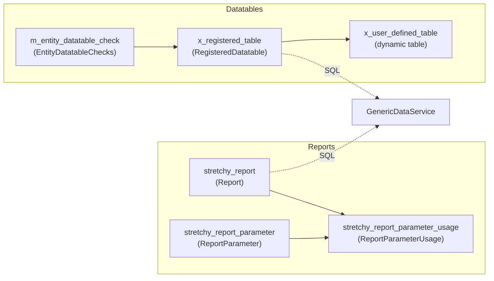
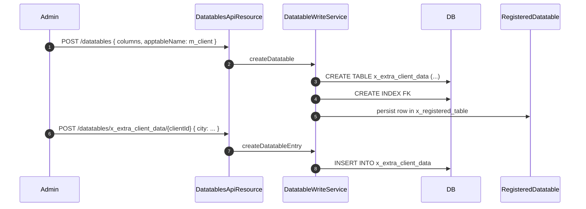

The `infrastructure/dataqueries/` package of Apache Fineract's `fineract-core` module hosts two related runtime-configurable features that share a SQL backbone: **datatables** (user-defined columns hanging off core entities) and **reports** (parametrised, named SQL queries). This page covers the interfaces, entities, services and security model — including how SQL is templated and whitelisted to fend off injection.

Source roots:

- `fineract-core/src/main/java/org/apache/fineract/infrastructure/dataqueries/` — interfaces, base data, validators, `ReportType` whitelist.
- `fineract-provider/src/main/java/org/apache/fineract/infrastructure/dataqueries/` — entities, repositories, JAX-RS resources, write implementations.

## The two features



Both lean on `GenericDataService` to template, validate and run SQL.

## Datatables

A datatable is a user-defined table named `whatever_extra_data` whose rows are 1-to-1 or 1-to-many with a *core* entity such as a `Client`, `Loan` or `Savings` account. The operator defines columns through the API; Fineract issues the `CREATE TABLE` against the tenant database and indexes the foreign key.

### `EntityTables` — the registry of attachable entities

```java fineract-core/.../dataqueries/data/EntityTables.java
public enum EntityTables {
    CLIENT("m_client", "client_id", "id", CREATE, ACTIVATE, CLOSE),
    GROUP("m_group", "group_id", "id", CREATE, ACTIVATE, CLOSE),
    CENTER("m_center", "m_group", "center_id", "id"),
    OFFICE("m_office", "office_id", "id"),
    LOAN_PRODUCT("m_product_loan", "product_loan_id", "id"),
    LOAN("m_loan", "loan_id", "id", CREATE, APPROVE, DISBURSE, WITHDRAWN, REJECTED, WRITE_OFF),
    SAVINGS_PRODUCT("m_savings_product", "savings_product_id", "id"),
    SAVINGS("m_savings_account", "savings_account_id", "id", CREATE, APPROVE, ACTIVATE, WITHDRAWN, REJECTED, CLOSE),
    SAVINGS_TRANSACTION("m_savings_account_transaction", "savings_transaction_id", "id"),
    SHARE_PRODUCT("m_share_product", "share_product_id", "id"),
    WC_LOAN_PRODUCT("m_wc_loan_product", "wc_product_loan_id", "id"),
    // ...
}
```

Each constant pairs the application table name, the FK column name and the parent PK column with a set of `StatusEnum` constants — those are the workflow transition points at which a `EntityDatatableChecks` rule can fire.

### `StatusEnum`

`fineract-core/.../dataqueries/data/StatusEnum.java` defines lifecycle hooks (`CREATE(100)`, `APPROVE(200)`, `ACTIVATE(300)`, `DISBURSE(400)`, `WITHDRAWN(500)`, `REJECTED(600)`, `CLOSE(700)`, `WRITE_OFF(800)`). A `EntityDatatableChecks` row pins a datatable to one of these for one of these entities.

### `RegisteredDatatable` entity

Source: `fineract-provider/.../dataqueries/domain/RegisteredDatatable.java`.

```java fineract-provider/.../dataqueries/domain/RegisteredDatatable.java
@Entity
@Table(name = "x_registered_table")
public class RegisteredDatatable extends AbstractPersistableCustom<Long> {
    @Column(name = "registered_table_name", nullable = false)
    private String datatableName;

    @Column(name = "application_table_name", nullable = false)
    private String entity;

    @Column(name = "entity_subtype", nullable = true)
    private String subtype;

    @Column(name = "category", nullable = false)
    private int category;
    // ...
}
```

`category` distinguishes two main buckets defined in `DataTableApiConstant`:

```java fineract-core/.../dataqueries/api/DataTableApiConstant.java
public static final Integer CATEGORY_PPI = 200;
public static final Integer CATEGORY_DEFAULT = 100;
```

`PPI` is the [Progress out of Poverty Index](https://www.povertyindex.org/) — those datatables are scored differently by reports. Everything else is `DEFAULT`.

### `EntityDatatableChecks` entity

Source: `fineract-provider/.../dataqueries/domain/EntityDatatableChecks.java`.

```java
@Entity
@Table(name = "m_entity_datatable_check")
public class EntityDatatableChecks extends AbstractPersistableCustom<Long> {

    @Column(name = "application_table_name", nullable = false)
    private String entity;

    @Column(name = "x_registered_table_name", nullable = false)
    private String datatableName;

    @Column(name = "status_enum", nullable = false)
    private Integer status;

    @Column(name = "system_defined")
    private boolean systemDefined = false;

    @Column(name = "product_id", nullable = true)
    private Long productId;
    // ...
}
```

Semantics: *"Before you may transition entity X to status S, a row must exist in datatable D — optionally scoped to product P."* The check is enforced by `EntityDatatableChecksWritePlatformService` (in `fineract-provider`) during the relevant write action.

### Read & Write services (in `fineract-core`)

The contract:

```java fineract-core/.../dataqueries/service/DatatableReadService.java
public interface DatatableReadService {

    List<DatatableData> retrieveDatatableNames(String appTable);

    DatatableData retrieveDatatable(String datatable);

    List<JsonObject> queryDataTable(@NonNull String datatable, @NonNull String columnName,
            String columnValue, @NonNull String resultColumns);

    Page<JsonObject> queryDataTableAdvanced(@NonNull String datatable,
            @NonNull PagedLocalRequest<AdvancedQueryData> pagedRequest);

    boolean buildDataQueryEmbedded(@NonNull EntityTables entityTable, @NonNull String datatable,
            @NonNull AdvancedQueryData request, @NonNull List<String> selectColumns,
            @NonNull StringBuilder select, @NonNull StringBuilder from, @NonNull StringBuilder where,
            @NonNull List<Object> params, String mainAlias, String alias,
            String dateFormat, String dateTimeFormat, Locale locale);

    GenericResultsetData retrieveDataTableGenericResultSet(String datatable, Long appTableId,
            String order, Long id);

    Long countDatatableEntries(String datatableName, Long appTableId, String foreignKeyColumn);

    String getTableName(String Url);

    String getDataTableName(String Url);
}
```

`DatatableWriteService` is the matching write-side interface. Its provider implementation issues DDL (`CREATE TABLE`, `ALTER TABLE ADD COLUMN`, `DROP TABLE`) plus the inserts/updates/deletes against the dynamic table. Both services live in `fineract-core` so the contracts are reusable; the JDBC implementations are in `fineract-provider/.../dataqueries/service/`.

### `GenericDataService`

The shared SQL backbone:

```java fineract-core/.../dataqueries/service/GenericDataService.java
public interface GenericDataService {

    GenericResultsetData fillGenericResultSet(String sql);

    List<ResultsetColumnHeaderData> fillResultsetColumnHeaders(String tableName);

    List<ResultsetRowData> fillResultsetRowData(String sql, List<ResultsetColumnHeaderData> columnHeaders);

    List<ResultsetRowData> fillResultsetRowData(String sql, List<ResultsetColumnHeaderData> columnHeaders, Object... args);

    String generateJsonFromGenericResultsetData(GenericResultsetData grs);

    String replace(String str, String pattern, String replace);

    String wrapSQL(String sql);

    boolean isExplicitlyUnique(String tableName, String columnName);

    boolean isExplicitlyIndexed(String tableName, String columnName);
}
```

Highlights:

- `fillResultsetColumnHeaders` inspects `INFORMATION_SCHEMA` to discover the column types of a (white-listed) table. Datatables and reports use this to project results without trusting client input for column names.
- `wrapSQL` performs a small set of vendor-specific tweaks (e.g. `LIMIT` vs `FETCH FIRST`).
- `replace(str, pattern, replace)` is the lightweight templating engine used to substitute `${...}` parameters into report SQL after validating them against `stretchy_report_parameter` definitions.
- `generateJsonFromGenericResultsetData` produces the wire format used by `/runreports` and `/datatables/{table}/{appId}` GET responses.

The provider implementation, `GenericDataServiceImpl`, uses the routing `JdbcTemplate` to keep all queries inside the active tenant's data DB.

## Reports

A *report* is a parametrised, named SQL query persisted in `stretchy_report` together with its parameter definitions.

### Domain entities (in `fineract-provider`)

| Entity | Table | Notes |
| --- | --- | --- |
| `Report` | `stretchy_report` | `name`, `reportName`, `reportType` (matches `ReportType.value`), `reportSubType`, `reportCategory`, `description`, `reportSql`, `coreReport`, `useReport`. |
| `ReportParameter` | `stretchy_parameter` | `parameterName`, `parameterLabel`, `parameterDisplayType`, `parameterSql`, etc. |
| `ReportParameterUsage` | `stretchy_report_parameter` | Join table from `Report` to `ReportParameter`. |
| `ReportRepository`, `ReportParameterRepository`, `ReportParameterUsageRepository` | — | Spring Data repos. |
| `ReportRepositoryWrapper` | — | `findOneWithNotFoundDetection`-style 404 wrapper. |

### `ReportType` whitelist

The first line of defence against arbitrary type values:

```java fineract-core/.../dataqueries/domain/ReportType.java
public enum ReportType {

    /** Standard report type for retrieving report data */
    REPORT("report"),

    /** Parameter type for retrieving parameter definitions and possible values */
    PARAMETER("parameter");

    public static boolean isValidType(String type) {
        return type != null && !type.trim().isEmpty()
            && VALID_VALUES.contains(type.toLowerCase(Locale.ROOT));
    }

    public static ReportType fromValue(String type) { /* throws on miss */ }
}
```

`fromValue` throws `IllegalArgumentException` on anything outside the whitelist — `RunreportsApiResource` calls it before any SQL templating happens.

### `RunreportsApiResource`

Lives at `fineract-provider/.../dataqueries/api/RunreportsApiResource.java`. Endpoints:

| Method | Path | Behaviour |
| --- | --- | --- |
| `GET` | `/runreports/{reportName}` | Execute report. Query params populate `${parameter}` placeholders. |
| `GET` | `/runreports/{reportName}?parameterType=true` | Return parameter list / dropdown data. |

The resource:

1. Pulls query parameters into a `Map<String,String>`.
2. Validates the `reportType` against `ReportType`.
3. Loads the `Report` row by name; validates each provided parameter against `stretchy_report_parameter` definitions.
4. Substitutes values into `reportSql` via `GenericDataService.replace`.
5. Hands the rendered SQL to `GenericDataService.fillGenericResultSet`.
6. Serializes through `generateJsonFromGenericResultsetData`.

### `ReportsApiResource`

`fineract-provider/.../dataqueries/api/ReportsApiResource.java` is the **management** API (create / update / delete / list reports). It is distinct from `RunreportsApiResource` which only *executes* reports.

### `DatatablesApiResource` & `EntityDatatableChecksApiResource`

Both also live in `fineract-provider/.../dataqueries/api/`:

- `/datatables` — list registered datatables.
- `/datatables/{table}` — CRUD on the datatable definition.
- `/datatables/{table}/{appId}` — CRUD on rows (1-to-1) for an entity.
- `/datatables/{table}/{appId}/{rowId}` — CRUD on rows (1-to-many).
- `/entityDatatableChecks` — manage check rules.

Each is documented by a Swagger schema class (`DatatablesApiResourceSwagger`, `ReportsApiResourceSwagger`, `RunreportsApiResourceSwagger`, `EntityDatatableChecksApiResourceSwagger`) that ships next to it.

## Security implications

User-supplied table names, column names and parameter values feed SQL. The mitigations are layered:

<Steps>
  <Step title="Whitelist enums where you can">
    `EntityTables` and `ReportType` make sure the *kind* of thing being queried is from a closed set defined in Java.
  </Step>
  <Step title="INFORMATION_SCHEMA-driven column lists">
    `GenericDataService.fillResultsetColumnHeaders` is the only source of truth for which columns a datatable has. The API never trusts client-supplied column names verbatim — it intersects them with this list.
  </Step>
  <Step title="Parameter binding rather than string concat">
    `fillResultsetRowData(String sql, List<ResultsetColumnHeaderData>, Object... args)` accepts a positional `?` placeholder list. Report execution uses this for the substituted parameter values.
  </Step>
  <Step title="SQL guards in fineract-core/security">
    `SqlValidator` / `DefaultSqlValidator`, `ColumnValidator` and `SqlInjectionPreventerService` in `infrastructure/security/` reject identifiers containing whitespace, semicolons, comment tokens or known dangerous fragments. See [Security Primitives](/core/security-primitives).
  </Step>
  <Step title="Constraint approach for datatables">
    The global flag `constraint-approach-for-datatables` (see [Configuration](/core/configuration-and-global-config)) switches between trigger-based and application-level uniqueness on datatable columns.
  </Step>
</Steps>

<Note>
Reports SQL is **trusted** content — only authorised users can create/edit reports. The runtime validation is for the *invocation*, not the report body itself. Deployments routinely lock down `READ_REPORT` and `CREATE_REPORT` permissions to a small admin group.
</Note>

## Data shapes used by the API

| Class | Used for |
| --- | --- |
| `DatatableData` | Description of a registered datatable. |
| `DatatableChecksData` / `DatatableCheckStatusData` | Check rule listings. |
| `EntityDataTableChecksData` | Per-entity check listing. |
| `DatatableSearchRequest` | Body of `POST /datatables/{table}/query`. |
| `GenericResultsetData` | `{ columnHeaders, data }` envelope returned by report runs. |
| `ResultsetColumnHeaderData` / `ResultsetColumnValueData` / `ResultsetRowData` | Per-column metadata and per-row values. |
| `ReportData`, `ReportParameterData`, `ReportParameterJoinData` | Report definition shapes. |
| `ReportExportType` | Available export formats (PDF/XLS/CSV via Pentaho integration, see provider). |
| `ColumnFilter` | Part of `AdvancedQueryData` — used by `DatatableReadService.queryDataTableAdvanced`. |
| `DataTableValidator` | Validates datatable JSON commands using `DataValidatorBuilder`. |

## Datatable lifecycle



## Cleanup service

`service/CleanupService.java` declares hooks the provider calls to delete datatable rows when their parent entity is purged. This keeps the dynamic table consistent with the application table.

## Datatable keyword generator

`service/DatatableKeywordGenerator.java` is used during datatable creation to derive safe identifiers (column suffixes, index names) from user input — enforcing length, case and character constraints.

## Class index

<CardGroup cols={2}>
  <Card title="data/EntityTables" icon="table">
    Enum of attachable application tables + valid `StatusEnum` transition points.
  </Card>
  <Card title="data/StatusEnum" icon="signs-post">
    Workflow transition labels used by entity-datatable checks.
  </Card>
  <Card title="domain/ReportType" icon="shield-check">
    Whitelist of `report`/`parameter` types accepted by `/runreports`.
  </Card>
  <Card title="service/GenericDataService" icon="database">
    Shared SQL backbone — header reflection, parameter substitution, JSON serialization.
  </Card>
  <Card title="service/DatatableReadService" icon="eye">
    Read API for datatable metadata and rows.
  </Card>
  <Card title="service/DatatableWriteService" icon="pen-to-square">
    Issue DDL + DML against dynamic datatables.
  </Card>
  <Card title="service/CleanupService" icon="broom">
    Cascade delete of datatable rows on entity deletion.
  </Card>
  <Card title="service/DatatableKeywordGenerator" icon="hashtag">
    Safe identifier generation.
  </Card>
  <Card title="data/GenericResultsetData" icon="file">
    `{ columnHeaders, data }` envelope.
  </Card>
  <Card title="data/DataTableValidator" icon="shield">
    `DataValidatorBuilder` recipes for datatable commands.
  </Card>
  <Card title="api/DataTableApiConstant" icon="code">
    Resource/parameter name + category constants.
  </Card>
  <Card title="provider api resources" icon="globe">
    `DatatablesApiResource`, `EntityDatatableChecksApiResource`, `ReportsApiResource`, `RunreportsApiResource`.
  </Card>
</CardGroup>

<Tip>
If you write a custom report against a tenant's database, do *not* assume the column types you see in DBeaver — query `GenericDataService.fillResultsetColumnHeaders` instead, because Fineract's tenant DBs evolve through Liquibase migrations and column types may shift between minor versions.
</Tip>
