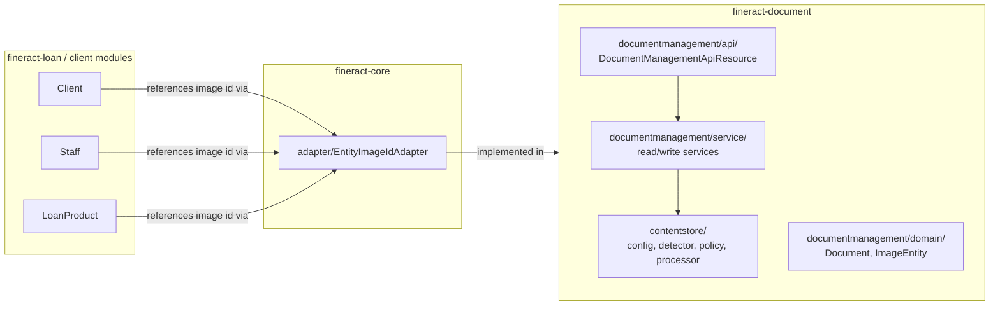
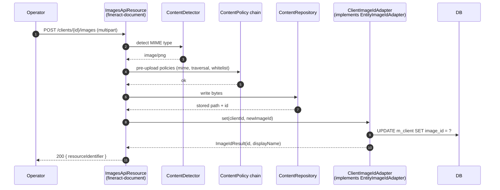
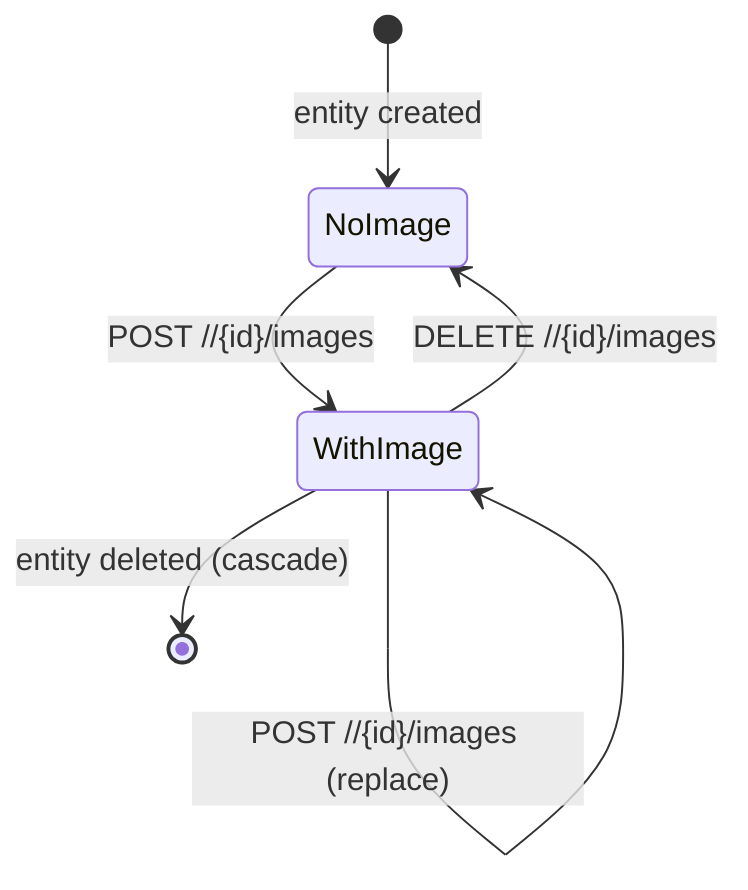

Document management in Apache Fineract is split across two Gradle modules. `fineract-core` carries only a single decoupling primitive — the `EntityImageIdAdapter` interface — so that core entities can hold an image id without depending on the document/content-store machinery. The complete document API, the content-store implementations (filesystem, S3) and the upload/download policies all live in `fineract-document`. This page covers what `fineract-core` contributes and points at the deep dive for the rest.

Source root: `fineract-core/src/main/java/org/apache/fineract/infrastructure/documentmanagement/`.

## Module layout



## The single primitive in `fineract-core`

Everything `fineract-core` contributes is this file:

```java fineract-core/.../documentmanagement/adapter/EntityImageIdAdapter.java
// NOTE: this is a trick to decouple the entity image IDs from the image service
@Deprecated
public interface EntityImageIdAdapter {

    boolean accept(String entityType);

    Optional<ImageIdResult> get(Long entityId);

    Optional<ImageIdResult> set(Long entityId, Long imageId);

    @Builder
    @Data
    @NoArgsConstructor
    @AllArgsConstructor
    class ImageIdResult implements Serializable {

        @Serial
        private static final long serialVersionUID = 1L;

        private Long id;
        private String displayName;
    }
}
```

### Why it exists

Many domain entities can have an attached image — a client's photo, a staff member's signature, a loan product's logo. Each of those entities lives in its own module (`Client` in `fineract-core` / `fineract-loan`-adjacent code, `Staff` in `fineract-core/organisation/staff/`, etc.). At the same time, the image-upload pipeline (multipart parsing, content detection, content store writing, JPA persistence of `m_image`) lives in `fineract-document`.

If `Client.imageId` referenced a `org.apache.fineract.infrastructure.documentmanagement.domain.Image` JPA entity directly, every module containing an "imageable" entity would have to depend on `fineract-document`. Instead, each module:

1. Stores a `Long imageId` column on the entity.
2. Provides a Spring `@Component` implementation of `EntityImageIdAdapter` that knows how to read/write its `imageId` column.
3. The image service in `fineract-document` iterates known adapters, picking the one that `accept(entityType)`s the requested type ("clients", "staff", "loanproducts", etc.).

### Method semantics

| Method | Purpose |
| --- | --- |
| `accept(String entityType)` | True if this adapter handles the given entity-type URL segment (e.g. `"clients"`, `"staff"`). |
| `get(Long entityId)` | Return the current image id + display name for the given entity, or `Optional.empty()` if none / entity not found. |
| `set(Long entityId, Long imageId)` | Update the entity's image id; return the new pair. Implementations also persist a `displayName` for logging/UX. |

### Why `@Deprecated`?

The deprecation marker is a signal that the team wants to retire the indirection by inverting the dependency — letting `fineract-document` own a single image table that other modules join against — but for now the adapter pattern is the operational choice. New entity types should still register an adapter.

## What lives in `fineract-document` (the full picture)

The rest of document handling is in the [Document & Content Store](/document/overview) group. A quick map for orientation:

<CardGroup cols={2}>
  <Card title="contentstore/config" icon="gear">
    `ContentStoreConfig` plus the `ContentStoreType` enum (FILE_SYSTEM, S3, DB).
  </Card>
  <Card title="contentstore/detector" icon="magnifying-glass">
    `ContentDetector`, `FileContentDetector`, `TikaContentDetector` — MIME type sniffing.
  </Card>
  <Card title="contentstore/policy" icon="shield">
    Pre- and post-upload policies: `WhitelistContentPolicy`, `MimeContentPolicy`, `TraversalContentPolicy`.
  </Card>
  <Card title="contentstore/processor" icon="arrows-spin">
    Base64/data-URL/gzip encoders & decoders applied during upload/download.
  </Card>
  <Card title="documentmanagement/api" icon="globe">
    `DocumentManagementApiResource`, `ImagesApiResource` (in fineract-document) — multipart upload, download by id.
  </Card>
  <Card title="documentmanagement/domain" icon="database">
    `Document`, `Image` entities mapped to `m_document` and `m_image`.
  </Card>
  <Card title="documentmanagement/service" icon="server">
    Read/write services backed by the content store + the adapters above.
  </Card>
  <Card title="documentmanagement/contentrepository" icon="hard-drive">
    `ContentRepository` interface and `FileSystemContentRepository` / `S3ContentRepository` implementations.
  </Card>
</CardGroup>

## Configuration touch-points

Two `c_configuration` flags drive document-storage behaviour (see [Configuration](/core/configuration-and-global-config)):

| Flag | Effect |
| --- | --- |
| `AMAZON_S3` (`amazon-s3`) | Switch the active `ContentRepository` to S3. Without it, files land in the filesystem path configured by `fineract.content.regularFolderName`. |
| `REPORT_EXPORT_S3_FOLDER_NAME` | Override the S3 prefix used by report-export sinks. |

S3 credentials and bucket name are stored in `c_external_service` rows (see `ExternalServicesConfigurationApiResource`).

## Sequence: uploading a client photo



Notice that the client write path never touches the `Image` JPA entity — it goes through the adapter so the loan/client domain modules stay independent of the document module.

## What you should remember

<Note>
- `fineract-core/infrastructure/documentmanagement/` contains **one file**: `EntityImageIdAdapter`.
- It exists so entities with an image can be linked without each owning a JPA reference to `Image`.
- The complete content store, upload/download API, policies and processors are in `fineract-document`.
- Storage backend is switched via the `amazon-s3` global configuration flag.
</Note>

<Tip>
Adding image support to a new entity? Implement `EntityImageIdAdapter` in the entity's own module, mark the implementation `@Component`, and the `fineract-document` image service will pick it up automatically through Spring's `List<EntityImageIdAdapter>` injection.
</Tip>

## Deep dives

Continue with the [Document & Content Store](/document/overview) group for:

- The `ContentStoreType` enum and `ContentStoreConfig` wiring.
- The pre/post-upload policy chain and how `WhitelistContentPolicy` is configured.
- Filesystem vs S3 `ContentRepository` implementations.
- `ImagesApiResource` and `DocumentManagementApiResource` endpoints.
- The `Document` and `Image` JPA entities and the audit columns they carry.
- How thumbnails are generated and cached.

## Adapter implementation checklist

Implementing `EntityImageIdAdapter` for a new entity is small but has gotchas. The typical contract:

```java
@Component
@RequiredArgsConstructor
public class StaffImageIdAdapter implements EntityImageIdAdapter {

    private static final String ENTITY_TYPE = "staff";

    private final StaffRepository staffRepository;

    @Override
    public boolean accept(String entityType) {
        return ENTITY_TYPE.equalsIgnoreCase(entityType);
    }

    @Override
    public Optional<ImageIdResult> get(Long entityId) {
        return staffRepository.findById(entityId)
                .map(s -> ImageIdResult.builder()
                        .id(s.getImageId())
                        .displayName(s.getDisplayName())
                        .build());
    }

    @Override
    public Optional<ImageIdResult> set(Long entityId, Long imageId) {
        return staffRepository.findById(entityId).map(s -> {
            s.setImageId(imageId);
            staffRepository.save(s);
            return ImageIdResult.builder()
                    .id(imageId)
                    .displayName(s.getDisplayName())
                    .build();
        });
    }
}
```

Key things to get right:

- **`accept` must be case-insensitive** — entity types arrive from URL segments which may be either `staff` or `STAFF`.
- **Return `Optional.empty()`, not `null`** — the image service collapses adapters via `Stream.flatMap(Optional::stream)`; nulls would throw.
- **Persist via the entity's own repository** — do not write to the `image_id` column directly with a custom UPDATE. The entity's audit columns and any `@Version` field need to be honoured.
- **Do not pre-validate the imageId** — the image service ensures the row exists before calling `set`. The adapter's job is just storage.

## Image lifecycle states



Replacement is a two-step write inside the image service: the new bytes are stored, the adapter is updated, and only then is the old `m_image` row marked for deletion. This protects against losing the previous image if the upload fails mid-flight.

## Related global config flags

| Flag | Effect on document handling |
| --- | --- |
| `AMAZON_S3` | Switch the active `ContentRepository` to S3. |
| `REPORT_EXPORT_S3_FOLDER_NAME` | Prefix for report exports stored in S3. |

Both are documented in [Configuration](/core/configuration-and-global-config).
