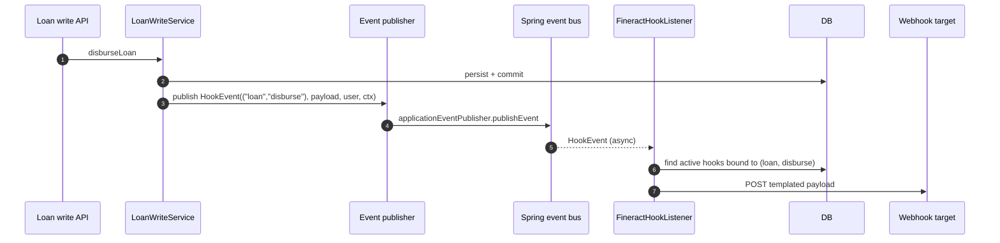

Apache Fineract ships a *hooks* framework that lets operators register webhooks (and a handful of other side-channels) which fire when named events occur — a loan disbursal, a client activation, a savings transaction. The framework is split across modules: `fineract-core` defines only the bare *event* primitives that the higher-level domain code emits; the persistent model, the template engine, the resolvers and the processors all live in `fineract-provider`. This page covers what `fineract-core` owns and points at the deep dive for the rest.

Source roots:

- `fineract-core/src/main/java/org/apache/fineract/infrastructure/hooks/event/` — `HookEvent` + `HookEventSource`.
- `fineract-provider/src/main/java/org/apache/fineract/infrastructure/hooks/` — entities, listeners, processors, API.

## What is in `fineract-core`

Only one sub-package — `infrastructure/hooks/event/` — with two files.

### `HookEventSource`

A small, serializable two-string record identifying *what* happened:

```java fineract-core/.../hooks/event/HookEventSource.java
@RequiredArgsConstructor
@Getter
public class HookEventSource implements Serializable {

    private final String entityName;
    private final String actionName;
}
```

| Field | Examples |
| --- | --- |
| `entityName` | `"client"`, `"loan"`, `"savingsaccount"`, `"loantransaction"`. |
| `actionName` | `"create"`, `"approve"`, `"activate"`, `"disburse"`, `"makerepayment"`. |

The pair forms a stable identifier the operator binds a hook to. The strings are also the same ones the platform uses on its REST permissions (e.g. `CREATE_CLIENT`), so a hook bound to `(client, create)` fires when a successful POST to `/clients` completes.

### `HookEvent`

The Spring `ApplicationEvent` that wraps the source plus a JSON payload:

```java fineract-core/.../hooks/event/HookEvent.java
@Getter
public class HookEvent extends FineractEvent {

    private final String payload;

    private final AppUser appUser;

    public HookEvent(final HookEventSource source, final String payload,
                     final AppUser appUser, FineractContext fineractContext) {
        super(source, fineractContext);
        this.payload = payload;
        this.appUser = appUser;
    }
}
```

It extends `FineractEvent` from `infrastructure/core/domain/` (see [Infrastructure Core](/core/infrastructure-core)) which gives every event:

- A `source` of type `Object` (here a `HookEventSource`).
- A `FineractContext` snapshot — tenant, business dates, locale — needed so the listener can restore the originating context before delivery (hooks are processed asynchronously).

The `payload` is a Gson-serialised JSON string of the entity that changed; `appUser` is the user who triggered the change (used in templates and request signing).

## How the rest of the framework plugs in (in `fineract-provider`)

```mermaid
flowchart TB
    subgraph Emit["Domain code (fineract-loan / -savings / ...)"]
        WS[Write services<br/>throw HookEvent into Spring's event bus]
    end

    subgraph Core["fineract-core / hooks"]
        HE[HookEvent + HookEventSource]
    end

    subgraph Prov["fineract-provider / infrastructure/hooks"]
        L[FineractHookListener<br/>@EventListener / async]
        S[HookReadPlatformServiceImpl]
        D[Hook + HookConfiguration + HookResource<br/>HookTemplate + HookSchema]
        P[HookProcessor implementations]
        Hp[ProcessorHelper / WebHookService]
        T[Template engine<br/>(fineract-template module)]
        API[HookResource API]
    end

    subgraph Side["Side channels"]
        Web[HTTP webhook target]
        ES[Elastic Search]
        TW[Twilio SMS]
        MG[Mojaloop / Message Gateway]
    end

    WS --> HE
    HE --> L
    L --> S
    S --> D
    L --> P
    P --> Hp
    P --> T
    Hp --> Web
    P --> ES
    P --> TW
    P --> MG
    API --> D
```

### Entities (in `fineract-provider`)

| Entity | Table | Notes |
| --- | --- | --- |
| `Hook` | `m_hook` | The registered hook: name, active flag, set of `HookResource` event bindings, set of `HookConfiguration` key/value pairs, a `HookTemplate` (processor type), and an optional `Template` (UGD template id) for payload templating. |
| `HookResource` | `m_hook_resource` | The `(entityName, actionName)` rows the hook binds to. |
| `HookConfiguration` | `m_hook_configuration` | Free-form configuration entries (URL, content type, secret, …). |
| `HookTemplate` | `m_hook_templates` | One row per processor (`Web`, `ElasticSearch`, `MessageGateway`, `Twilio`). Holds the JSON `schema` of expected configuration keys. |
| `HookSchema` | `m_hook_schema` | Per-template schema items (name, type). |

`Hook` carries audit columns via `AbstractAuditableCustom`. Its `template` FK is what `HookProcessorProvider` uses to pick the right processor at fire time.

### Listener

`fineract-provider/.../hooks/listener/FineractHookListener.java` is the entry point. It registers as a Spring `@EventListener` for `HookEvent` and:

1. Restores tenant context from `event.getFineractContext()`.
2. Looks up all *active* hooks where the bound `(entityName, actionName)` matches `event.getSource()`.
3. For each match, asks `HookProcessorProvider` for the right processor and calls `process(event, hook)`.
4. Catches and logs any per-hook exceptions so one bad hook doesn't stop another.

`HookListener` is its (small) interface counterpart.

### Processors

`fineract-provider/.../hooks/processor/`:

| Class | Purpose |
| --- | --- |
| `HookProcessor` | Single-method interface `process(Hook, HookEventSource, payload, …)`. |
| `HookProcessorProvider` | Looks up the right implementation by `HookTemplate.name` (`"Web"`, `"ElasticSearch"`, `"Twilio"`, `"MessageGateway"`). |
| `WebHookProcessor` | Generic HTTP POST. Reads URL, content type, secret from `HookConfiguration`; signs the payload if a secret is configured. Delegates to `WebHookService`. |
| `WebHookService` | The Retrofit / OkHttp call wrapper used by `WebHookProcessor`. |
| `ElasticSearchHookProcessor` | Index the payload directly into Elasticsearch. |
| `TwilioHookProcessor` | Send SMS via Twilio using a payload template. |
| `MessageGatewayHookProcessor` | Forward to a Mojaloop-style message gateway. |
| `ProcessorHelper` | Shared utilities: payload templating, signature generation, retry. |

### Template engine

When a hook needs to *transform* the raw JSON payload before sending (e.g. project just the customer name + amount for an SMS), `Hook.ugdTemplate` (`ugd_template_id`) references a row in `m_templates`. That table belongs to the `fineract-template` module, whose deep dive lives elsewhere; from a hooks perspective it's an opaque "render a Mustache-like template" engine. `ProcessorHelper.compileTemplate` invokes it.

### REST API

`fineract-provider/.../hooks/api/HookApiResource.java` exposes:

| Method | Path | Behaviour |
| --- | --- | --- |
| `GET` | `/hooks` | List hooks. |
| `GET` | `/hooks/{id}` | Fetch one. |
| `GET` | `/hooks/template` | Fetch templates + event sources catalogue. |
| `POST` | `/hooks` | Create a new hook. |
| `PUT` | `/hooks/{id}` | Update. |
| `DELETE` | `/hooks/{id}` | Delete. |

`HookReadPlatformService` / `HookWritePlatformService` are the matching services; their command handlers live next door.

## Event emission pattern

Write services don't emit `HookEvent` directly inside the domain logic — they ask the platform's event publisher to do it after a successful commit. The pattern is:



The publisher participates in the transaction's after-commit hook (`TransactionLifecycleCallback` in [Infrastructure Core](/core/infrastructure-core)) so a rolled-back write does *not* fire hooks. Delivery itself is asynchronous — `FineractHookListener` runs on the platform's `@Async` executor.

## Available event sources

The platform exposes a catalogue of valid `(entityName, actionName)` pairs through `GET /hooks/template`. Domain modules each contribute their own set; canonical examples include:

| Entity | Actions |
| --- | --- |
| `client` | `create`, `update`, `activate`, `close`, `reject`, `withdraw`, `assignstaff`, … |
| `loan` | `create`, `approve`, `disburse`, `makerepayment`, `writeoff`, `reject`, `withdraw`, `close`, … |
| `loantransaction` | `makerepayment`, `adjusttransaction`, `undotransaction`, … |
| `savingsaccount` | `create`, `approve`, `activate`, `deposit`, `withdrawal`, `close`, `applyannualfees`, … |
| `journalentry` | `create`, `reverse` |
| `centergroup`, `group`, `office`, `staff` | crud actions |
| `user`, `permission`, `role` | admin actions |

Each pair is something `HookEventSource` is constructed with.

## Deep dive

The full hooks framework — including the persistence model, the template registry, payload-signing semantics and how operators register webhooks via the UI — is documented in the [Events & Hooks Framework](/events/hooks-framework) page in the Events group. That page picks up where this one ends.

## Class index

<CardGroup cols={2}>
  <Card title="core/HookEventSource" icon="tag">
    `(entityName, actionName)` pair.
  </Card>
  <Card title="core/HookEvent" icon="bell">
    `FineractEvent` carrying source, payload, user and `FineractContext`.
  </Card>
  <Card title="provider/Hook" icon="database">
    `m_hook` entity — bindings, configuration, template references.
  </Card>
  <Card title="provider/HookResource" icon="link">
    `(entityName, actionName)` rows bound to a `Hook`.
  </Card>
  <Card title="provider/HookConfiguration" icon="gear">
    Free-form configuration entries (URL, secret, content type).
  </Card>
  <Card title="provider/HookTemplate / HookSchema" icon="file-lines">
    Per-processor configuration schema.
  </Card>
  <Card title="provider/FineractHookListener" icon="ear-listen">
    The `@EventListener` that dispatches to processors.
  </Card>
  <Card title="provider/HookProcessor" icon="play">
    Pluggable processor interface.
  </Card>
  <Card title="provider/WebHookProcessor + WebHookService" icon="globe">
    HTTP POST processor with payload signing.
  </Card>
  <Card title="provider/ElasticSearchHookProcessor" icon="magnifying-glass">
    Index the payload into Elasticsearch.
  </Card>
  <Card title="provider/TwilioHookProcessor" icon="comment">
    Send templated SMS via Twilio.
  </Card>
  <Card title="provider/MessageGatewayHookProcessor" icon="diagram-project">
    Forward to a Mojaloop-style gateway.
  </Card>
</CardGroup>

<Note>
`fineract-core` carries no Hook entities, no listeners, no processors — only the two `event/` files. The split lets `fineract-core` stay free of HTTP-client dependencies (OkHttp/Retrofit live with the processors).
</Note>

<Tip>
The simplest way to test a hook in dev is to register a `Web` template hook pointing at `http://localhost:9000/anything` of an httpbin-like service. Watch the `FineractHookListener` log to confirm dispatch order and inspect the signed payload header (`X-Mifos-Entity-Signature`) generated by `ProcessorHelper`.
</Tip>

## Continue with

- [Events & Hooks Framework](/events/hooks-framework) — full deep dive on the provider-side hook stack.
- [Infrastructure Core](/core/infrastructure-core) — `FineractEvent` base, `FineractContext` snapshot.
- [Configuration](/core/configuration-and-global-config) — async / hub-integration related flags.
