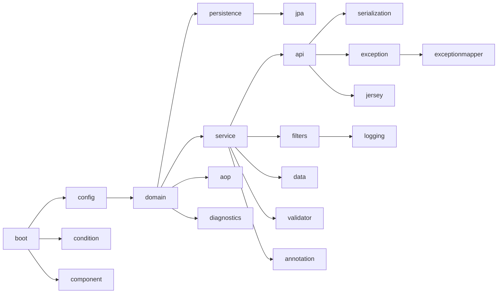
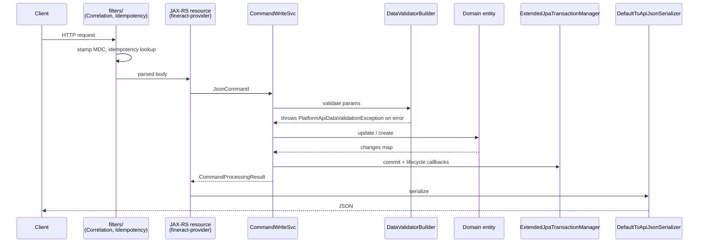

The `org.apache.fineract.infrastructure.core` package inside Apache Fineract's `fineract-core` module is the deepest cross-cutting plumbing in the codebase. Almost every other package — loans, savings, accounting, COB, jobs, hooks — depends on its primitives. This page walks each sub-package from boot to serialization.

Source root: `fineract-core/src/main/java/org/apache/fineract/infrastructure/core/`.

## Sub-package tour



### `boot/`

Single file: `FineractProfiles.java`. Holds Spring profile name constants:

```java fineract-core/.../core/boot/FineractProfiles.java
public final class FineractProfiles {

    public static final String LIQUIBASE_ONLY = "liquibase-only";
    public static final String DIAGNOSTICS = "diagnostics";
    public static final String TEST = "test";

    private FineractProfiles() {}
}
```

These names are referenced by `@Profile` annotations and by conditional beans under `condition/`.

### `condition/`

A set of Spring `Condition` implementations used to switch beans on/off based on properties or profiles:

| Class | Purpose |
| --- | --- |
| `ProfileCondition` | Activate a bean only when a named Spring profile is active. |
| `PropertiesCondition` | Activate a bean based on a property predicate. |
| `FineractLiquibaseOnlyApplicationCondition` | True when the JVM was started in `liquibase-only` profile (migration runner). |
| `FineractWebApplicationCondition` | True when the JVM is a normal web application. |
| `FineractEventsCondition` / `EnableFineractEventListenerCondition` | Toggle the external-events publisher / listener. |
| `FineractModeValidationCondition` | Verifies that mutually-exclusive `fineract.mode.*` flags (e.g. batch-manager vs batch-worker) are not both enabled. |
| `FineractPartitionJobConfigValidationCondition` | Validates partitioned-job property bundles. |
| `FineractRemoteJobMessageHandlerCondition` | Enables JMS / Kafka message handler beans for remote jobs. |
| `SpringPropertiesFactory` | Helper that materializes `java.util.Properties` from Spring `Environment`. |

### `config/`

Strongly-typed Spring `@ConfigurationProperties` lives here.

- `FineractProperties.java` — root config record. Holds mode flags (`batchManagerEnabled`, `batchWorkerEnabled`, `readOnlyMode`), database tuning, idempotency settings, JPA flush mode, content-store and event-publisher configuration.
- `AbstractFineractModuleProperties.java` — base class for per-module configuration property classes.
- `ExplicitConfigurationPropertiesFactory.java` — used to instantiate module property beans early in the lifecycle.
- `MapstructMapperConfig.java` — global MapStruct mapper configuration (used by entity ↔ DTO mappers).

### `domain/`

This is the entity-base / context package — the most-imported package in the repo.

| Class | Role |
| --- | --- |
| `AbstractPersistableCustom<ID>` | Replacement for Spring Data's `AbstractPersistable` with a `Long` ID by default. Every Fineract JPA entity inherits from this (or from `AbstractAuditableCustom`). |
| `AbstractAuditableCustom` | Adds Spring Data `@CreatedBy`, `@LastModifiedBy`, `@CreatedDate`, `@LastModifiedDate`. |
| `AbstractAuditableWithUTCDateTimeCustom` | Same as above but timestamps are stored UTC. Newer entities (`BusinessDate`, etc.) use this. |
| `FineractPlatformTenant` | Immutable Lombok `@Builder` value object: id, `tenantIdentifier`, `name`, `timezoneId`, `FineractPlatformTenantConnection`. The unit of multi-tenancy. |
| `FineractPlatformTenantConnection` | JDBC connection details for the tenant's data DB. |
| `FineractContext` | Snapshot of the per-request context: contextHolder, tenant, auth token, business dates map keyed by `BusinessDateType`. Serializable. |
| `FineractRequestContextHolder` | `ThreadLocal` holder for request-scoped attributes (e.g. idempotency key, correlation id). |
| `ContextHolder` | Generic ThreadLocal helper. |
| `BatchRequestContextHolder` | Tracks whether the current call is inside a Batch API sub-request, plus per-batch attributes. |
| `ActionContext` | Indicates whether the current action is a normal business action or a COB action (affects which business date is used). |
| `FineractEvent` | Base class for in-process Spring events emitted by the platform; subclassed by `HookEvent`, business-event objects, etc. |
| `ExternalId` | Wrapper around the platform's external identifier (random string used for idempotent external references). |
| `LocalDateInterval` | Closed half-interval `[start, end]` of `LocalDate` — used heavily by loan schedule math. |
| `Base64EncodedImage` | Parsed representation of a `data:` URL for uploaded images. |
| `AuditableFieldsConstants` | Column names of the four audit columns. |
| `JdbcSupport` | Static helpers for safely reading nullable columns from a `ResultSet` (e.g. `getLocalDate`, `getBigDecimalDefaultToNullIfZero`). |

The `FineractPlatformTenant` definition is the canonical multi-tenant key:

```java fineract-core/.../core/domain/FineractPlatformTenant.java
public class FineractPlatformTenant implements Serializable {
    private final Long id;
    private final String tenantIdentifier;
    private final String name;
    private final String timezoneId;
    private final FineractPlatformTenantConnection connection;
}
```

### `service/`

Stateless helpers and ThreadLocal context utilities.

| Class | Notes |
| --- | --- |
| `ThreadLocalContextUtil` | The mandatory entry point for tenant context: `setTenant`, `getTenant`, `setBusinessDates`, `getBusinessDateByType`, `setActionContext`. Every request filter, every job, every Batch API sub-request hits this. |
| `DateUtils` | Centralised time API. `getBusinessLocalDate()`, `getBusinessDateTime()`, `getSystemZoneId()`, comparators, parsers. Always prefer this over `LocalDate.now()`. |
| `MathUtil` | Null-safe `BigDecimal` arithmetic helpers used by loan and accounting math. |
| `StringUtil` | Null-safe string helpers. |
| `ExternalIdFactory` | Generates `ExternalId` instances; respects the `enable-auto-generated-external-id` global config flag. |
| `MDCWrapper` | Sets/clears SLF4J MDC keys for tenant id, correlation id, business date. |
| `Page<T>`, `PagedRequest<T>`, `PagedLocalRequest<T>` | Generic pagination types used by API resources. |
| `PaginationHelper` | Translates Fineract `SearchParameters` into JDBC paging. |
| `SearchParameters` | Carrier for offset/limit/sort/search-text used by read services. |
| `JdbcTemplateFactory` | Factory producing tenant-aware `JdbcTemplate` instances on top of the routing datasource. |
| `IpAddressUtils` | Extracts the caller IP from `HttpServletRequest`, respecting `X-Forwarded-For`. |
| `FrequencyTypeUtil` | Common period frequency conversions (days ↔ weeks ↔ months ↔ years). |
| `CommandParameterUtil` | Pulls typed parameters out of `Map<String,Object>` command payloads. |
| `DataEnricher` / `DataEnricherProcessor` | Generic enrichment hook used by some read services. |
| `DefaultOption` | Cheap two-field "id/name" enum-option record. |

Sub-folders:

- `service/database/` — routing datasource (`RoutingDataSource`), database vendor detection, dialect support.
- `service/migration/` — Liquibase wrappers for tenant DB upgrades.
- `service/tenant/` — `TenantDetailsService` interface and helpers for resolving a tenant.

### `api/`

REST API plumbing shared by every API resource.

| Class | Role |
| --- | --- |
| `JsonCommand` | Wraps a parsed JSON body plus context (entityId, command id, locale, dateFormat). Every write-side command handler receives one. Has dozens of typed accessors (`stringValueOfParameterNamed`, `longValueOfParameterNamed`, `isChangeInStringParameterNamed`, …). |
| `JsonQuery` | Query-side variant. |
| `ApiRequestParameterHelper` | Parses common query parameters (`pretty`, `template`, `genericResultSet`, parameter inclusion/exclusion). |
| `ApiParameterHelper` | Lower-level helper used to test for parameter presence in a parsed JSON object. |
| `DateParam` | JSON-binding date parameter, used in JAX-RS `@QueryParam` and `@FormParam`. |
| `ApiFacingEnum` | Marker for enums that have an `id` + `code` + `value` representation in JSON. |
| `MutableUriInfo` | Wrapper around `UriInfo` allowing query-parameter mutation (used by the Batch API). |
| `*Adapter` classes | JAXB / Gson adapters for `LocalDate`, `LocalDateTime`, `LocalTime`, `OffsetDateTime`, `MonthDay`, `ExternalId`. |
| `IdTypeResolver` | Abstract resolver with an `IdType` enum (`ID`, `EXTERNAL_ID`, `SHORT_NAME`) used by API resources that let callers identify a resource by any of the three. |
| `ParameterListExclusionStrategy` / `ParameterListInclusionStrategy` | Gson strategies used by `DefaultToApiJsonSerializer` to honour the `?fields=` query parameter. |

Sub-folder `api/jersey/` contains Jersey-specific `ExceptionMapper` and provider wiring.

### `serialization/`

Gson is Fineract's primary JSON library on the response side. The classes here build atop it.

| Class | Role |
| --- | --- |
| `DefaultToApiJsonSerializer<T>` | The canonical serializer injected into every read-side service. Honours `pretty`, parameter inclusion/exclusion, ignores nulls by default. |
| `ToApiJsonSerializer<T>` | Older interface; `DefaultToApiJsonSerializer` is its main implementation. |
| `ExcludeNothingWithPrettyPrintingOffJsonSerializerGoogleGson<T>` | Variant used when full payload + compact output is required. |
| `CommandSerializer` / `CommandSerializerDefaultToJson` | Serialize `CommandWrapper` payloads for the maker-checker queue. |
| `CommandProcessingResultJsonSerializer` | Serializes the result of a write-side command (resourceId, changes map, etc.). |
| `FromJsonHelper` | Inverse of the to-API serializer: parses a JSON string into Gson `JsonElement`, extracts typed fields, validates that no unrecognised parameters were supplied. The de-facto JSON parser everywhere in the platform. |
| `JsonParserHelper` | Lower-level reusable parsing helpers used by `FromJsonHelper`. |
| `GoogleGsonSerializerHelper` | Builds the canonical `Gson` instance (registers all date adapters, exclusion strategies). |
| `AbstractFromApiJsonDeserializer<T>` / `FromApiJsonDeserializer<T>` | Base classes for write-side validators that translate a JSON command body into a domain object after running parameter checks. |
| `DatatableCommandFromApiJsonDeserializer` | Specific to datatable create/update commands (lives in core because datatable contracts do). |
| `ApiRequestJsonSerializationSettings` | Carrier for the parsed `?fields=`, `?pretty=`, `?template=` flags. |
| `ThrowableSerialization` | Serializes a `Throwable` into structured JSON for error responses. |

### `exception/`

Every exception thrown by the platform that bubbles to a HTTP response derives from one of the abstract base classes here:

| Base class | HTTP semantic |
| --- | --- |
| `AbstractPlatformException` | Root of platform exceptions. |
| `AbstractPlatformDomainRuleException` | 403 / business rule violation — non-recoverable user error. |
| `AbstractPlatformResourceNotFoundException` | 404. |
| `AbstractPlatformServiceUnavailableException` | 503. |
| `PlatformApiDataValidationException` | 400 with a list of `ApiParameterError` per field. |
| `PlatformDataIntegrityException` | Surfaces JDBC integrity violations (unique constraint, FK, etc.). |
| `PlatformInternalServerException` | 500 — internal misconfiguration. |
| `PlatformRequestBodyItemLimitValidationException` | 400 — Batch API submission size exceeded. |
| `UnsupportedParameterException` / `UnrecognizedQueryParamException` | 400 — body or query string had a parameter the deserializer did not declare. |
| `InvalidJsonException`, `ImageDataURLNotValidException`, `ImageUploadException` | 400 — request-parsing issues. |
| `AbstractIdempotentCommandException`, `IdempotentCommandProcessFailedException`, `IdempotentCommandProcessSucceedException`, `IdempotentCommandProcessUnderProcessingException` | Idempotency-store outcomes; replayed responses or 409s. |
| `MultiException` | Aggregates multiple thrown exceptions in batch contexts. |
| `JobIsNotFoundOrNotEnabledException` | Thrown when the scheduler is asked to run a missing/disabled job. |
| `ResourceNotFoundException` | Generic 404 wrapper. |

`ErrorHandler` and `HttpMessageNotReadableErrorController` translate these into Jersey / Spring responses. Concrete mappers live next door in `exceptionmapper/`.

### `exceptionmapper/`

JAX-RS `@Provider`-annotated classes that map a specific exception type to an HTTP `Response`. Wiring lives in `fineract-provider`, but the abstractions are here.

### `filters/`

Servlet `Filter` implementations registered in the security/web pipeline:

- `BatchFilter` + `BatchFilterChain` + `BatchCallHandler` — orchestrate Batch API multi-request execution.
- `BatchRequestPreprocessor` — normalises an incoming Batch request body.
- `CallerIpTrackingFilter` — captures the caller IP into MDC.
- `CorrelationHeaderFilter` — propagates the `X-Correlation-Id` (or generates one) into MDC.
- `IdempotencyStoreFilter` + `IdempotencyStoreBatchFilter` + `IdempotencyStoreHelper` — implement idempotent command processing using the `m_idempotent_command_processed` table.
- `RequestResponseFilter` — logs request/response bodies when diagnostics is on.

### `jersey/`

Custom Jersey serializers (`jersey/serializer/`) that hook into JAX-RS message-body writing for Gson interop.

### `jpa/`

`CriteriaQueryFactory` — small helper for typed criteria queries.

### `persistence/`

- `ExtendedJpaTransactionManager` — extends Spring's `JpaTransactionManager` with `TransactionLifecycleCallback` notification. The Batch / Quartz layer plugs callbacks into it (e.g. to flush the action-context, drain the event queue) before commit.
- `TransactionLifecycleCallback` — the callback interface.
- `FlushModeHandler` — wraps Hibernate `FlushMode` switching used by `FlushModeAspect`.
- `DatabaseSelectingPersistenceUnitPostProcessor` — selects between MySQL/MariaDB and PostgreSQL persistence units based on the active database vendor.

### `aop/`

`FlushModeAspect` — AOP advice that temporarily flips JPA flush mode to `COMMIT` while inside an annotated method (used by hot paths like loan schedule generation to avoid auto-flush overhead).

### `data/`

Shared DTOs and validation:

| Class | Role |
| --- | --- |
| `CommandProcessingResult` | Standard write-side response (resourceId, externalId, changes map, officeId, etc.). |
| `CommandProcessingResultBuilder` | Builder used by every command handler. |
| `DataValidatorBuilder` | Fluent validation DSL — chained predicates that collect `ApiParameterError`s and throw `PlatformApiDataValidationException` on `throwValidationErrors()`. **Used everywhere**. |
| `ApiGlobalErrorResponse`, `ApiParameterError`, `ApiErrorMessageArg` | Wire format of validation errors. |
| `EnumOptionData`, `BaseEnumOptionData`, `StringEnumOptionData`, `GenericEnumListConverter` | Standard "id / code / value" shape used to expose enums to the API. |
| `DateFormat` | Helper distinguishing `dateFormat` from `locale` for parsing. |
| `PaginationParameters`, `PaginationParametersDataValidator` | Validate `offset`, `limit`, `orderBy`, `sortOrder`. |
| `UploadRequest` | Multipart upload binding. |

### `diagnostics/performance/`

Diagnostic-only helpers active when the `diagnostics` Spring profile is on. `MeasuringUtil` wraps timing of code blocks; published as MDC + logs.

### `logging/`

`TenantIdentifierLoggingConverter` — Logback converter `%tenantId` printing the current tenant identifier in log lines.

### `validator/`

Helpers used by Bean Validation constraint validators.

### `annotation/`

Marker annotations consumed by reflection and AOP elsewhere.

### `component/`

Small Spring `@Component`s shared by other packages (e.g. classpath scanners used at boot).

## Cross-cutting flow: a write request



## Key classes you will import constantly

<CardGroup cols={2}>
  <Card title="ThreadLocalContextUtil" icon="layer-group">
    Tenant + business date access. Found at `infrastructure/core/service/ThreadLocalContextUtil.java`.
  </Card>
  <Card title="DateUtils" icon="calendar">
    Use `DateUtils.getBusinessLocalDate()` not `LocalDate.now()`. Found at `infrastructure/core/service/DateUtils.java`.
  </Card>
  <Card title="DataValidatorBuilder" icon="shield-check">
    Fluent parameter validation. `infrastructure/core/data/DataValidatorBuilder.java`.
  </Card>
  <Card title="JsonCommand" icon="code">
    The write-side command shape. `infrastructure/core/api/JsonCommand.java`.
  </Card>
  <Card title="FromJsonHelper / DefaultToApiJsonSerializer" icon="arrow-down-up">
    The two sides of JSON serialization. `infrastructure/core/serialization/`.
  </Card>
  <Card title="AbstractPersistableCustom" icon="database">
    Every entity inherits from this. `infrastructure/core/domain/AbstractPersistableCustom.java`.
  </Card>
</CardGroup>

<Note>
The actual security context interface (`PlatformSecurityContext`) is in `infrastructure/security/` — see [Security Primitives](/core/security-primitives). The `JobName` enum is in `infrastructure/jobs/` — see [Jobs Framework](/core/jobs-framework).
</Note>
