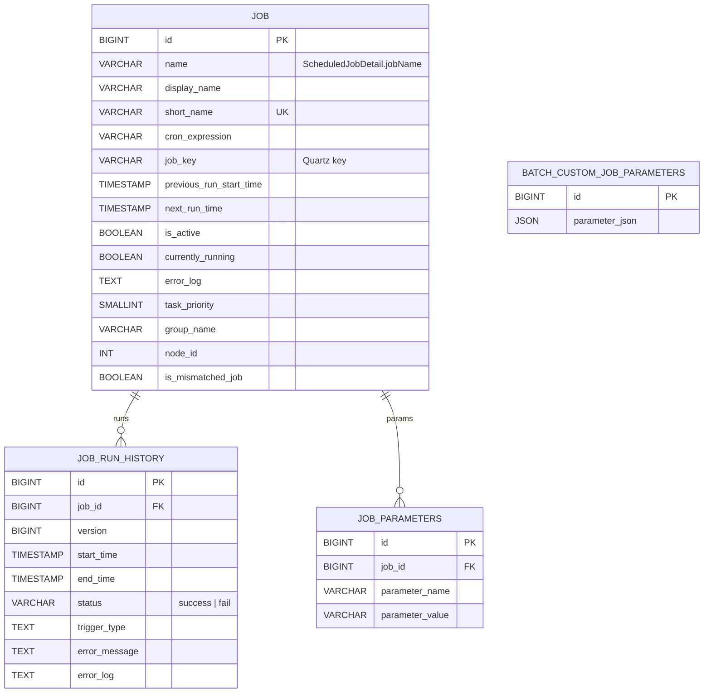
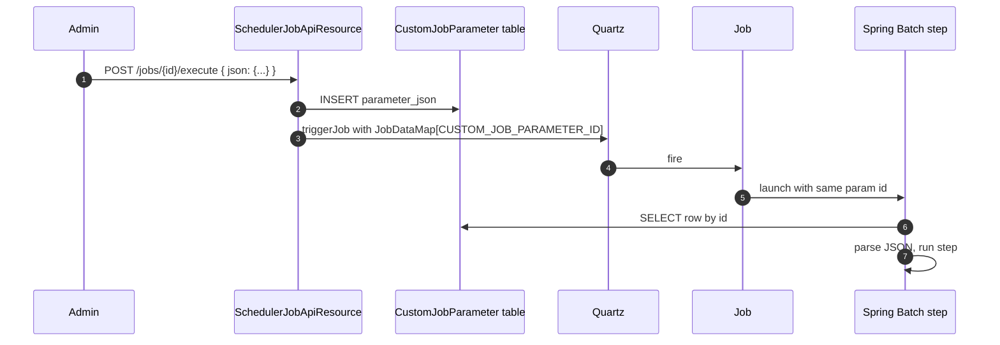
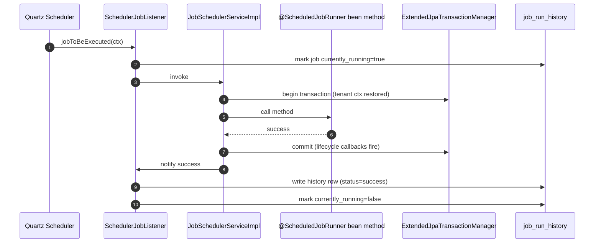

Background work in Apache Fineract is run from a single Quartz scheduler per JVM. Each scheduled action is identified by a constant in the `JobName` enum in `fineract-core`, has metadata persisted in the tenant database (`job`, `job_run_history`), and is executed by either a plain Spring bean method or a Spring Batch job graph. This page walks the `infrastructure/jobs/` package in both `fineract-core` and `fineract-provider`, lists every job, and shows how partitioned jobs hand off to Spring Batch.

Source roots:

- `fineract-core/src/main/java/org/apache/fineract/infrastructure/jobs/` — the `JobName` and `StepName` enums, `CustomJobParameter` entity, `TenantAwareEqualsHashCodeAdvice`, the read-service interface.
- `fineract-provider/src/main/java/org/apache/fineract/infrastructure/jobs/` — Quartz wiring, REST API resources, write services, scheduled-job entities and history.

## Architecture

```mermaid
flowchart TB
    subgraph CORE["fineract-core / jobs"]
        JN[JobName enum]
        SN[StepName enum]
        CJP[CustomJobParameter entity]
        TenantAdv[TenantAwareEqualsHashCodeAdvice]
        ReadSvc[SchedulerJobRunnerReadService]
    end

    subgraph PROV["fineract-provider / jobs"]
        Cfg[ScheduledJobRunnerConfig<br/>@EnableBatchProcessing]
        Reg[JobRegisterServiceImpl]
        Sched[JobSchedulerServiceImpl]
        Quartz[Quartz Scheduler]
        Listener[SchedulerJobListener]
        Stuck[StuckJobExecutorServiceImpl]
        Inline[InlineExecutorService]
        SJD[ScheduledJobDetail entity]
        SJRH[ScheduledJobRunHistory entity]
        API[SchedulerApiResource<br/>SchedulerJobApiResource<br/>InlineJobApiResource]
    end

    subgraph BATCH["Spring Batch"]
        JR[JobRepository]
        JE[JobExplorer]
        JL[TaskExecutorJobLauncher]
    end

    JN --> Reg
    Reg --> Quartz
    Quartz --> Listener
    Listener --> Sched
    Sched --> SJRH
    Reg --> SJD
    ReadSvc --> SJD
    ReadSvc --> SJRH
    Sched -.partitioned jobs.-> JL
    JL --> JR
    Reg --> JE
    CJP -.parameters.-> Sched
    API --> Reg
    API --> ReadSvc
    Cfg --> JR
    Cfg --> JL
```

## The `JobName` enum (every job in the platform)

```java fineract-core/.../jobs/service/JobName.java
public enum JobName {
    UPDATE_LOAN_ARREARS_AGEING("Update Loan Arrears Ageing"),
    APPLY_ANNUAL_FEE_FOR_SAVINGS("Apply Annual Fee For Savings"),
    APPLY_HOLIDAYS_TO_LOANS("Apply Holidays To Loans"),
    POST_INTEREST_FOR_SAVINGS("Post Interest For Savings"),
    // ...
}
```

This is the **canonical list of scheduled work** in Fineract. Every entry below corresponds to one row in the `job` table per tenant.

| Constant | Display name | What it does |
| --- | --- | --- |
| `UPDATE_LOAN_ARREARS_AGEING` | Update Loan Arrears Ageing | Refreshes `m_loan_arrears_aging` rows from current schedules. |
| `APPLY_ANNUAL_FEE_FOR_SAVINGS` | Apply Annual Fee For Savings | Posts the annual fee charge to eligible savings accounts. |
| `APPLY_HOLIDAYS_TO_LOANS` | Apply Holidays To Loans | Reshuffles repayment dates around configured holidays. |
| `POST_INTEREST_FOR_SAVINGS` | Post Interest For Savings | Accrues + posts savings interest per posting period. |
| `TRANSFER_FEE_CHARGE_FOR_LOANS` | Transfer Fee For Loans From Savings | Pulls due loan fees from linked savings accounts. |
| `ACCOUNTING_RUNNING_BALANCE_UPDATE` | Update Accounting Running Balances | Re-computes GL account running balances. |
| `PAY_DUE_SAVINGS_CHARGES` | Pay Due Savings Charges | Settles due savings charges. |
| `APPLY_CHARGE_TO_OVERDUE_LOAN_INSTALLMENT` | Apply penalty to overdue loans | Posts overdue penalty charges. |
| `EXECUTE_STANDING_INSTRUCTIONS` | Execute Standing Instruction | Runs scheduled loan/savings transfers. |
| `ADD_ACCRUAL_ENTRIES` | Add Accrual Transactions | Accrues interest, fees, penalties (per transaction). |
| `UPDATE_NPA` | Update Non Performing Assets | Marks/unmarks loans as NPA (partitioned, see Spring Batch). |
| `UPDATE_DEPOSITS_ACCOUNT_MATURITY_DETAILS` | Update Deposit Accounts Maturity details | Updates FD/RD maturity dates. |
| `TRANSFER_INTEREST_TO_SAVINGS` | Transfer Interest To Savings | Transfers FD/RD interest to a linked savings account. |
| `ADD_PERIODIC_ACCRUAL_ENTRIES` | Add Periodic Accrual Transactions | Periodic (per loan) accrual. |
| `RECALCULATE_INTEREST_FOR_LOAN` | Recalculate Interest For Loans | Re-amortises affected loans. |
| `GENERATE_RD_SCEHDULE` | Generate Mandatory Savings Schedule | Generates the next RD installments. |
| `GENERATE_LOANLOSS_PROVISIONING` | Generate Loan Loss Provisioning | Posts provisioning GL entries. |
| `POST_DIVIDENTS_FOR_SHARES` | Post Dividends For Shares | Posts dividends to share accounts. |
| `UPDATE_SAVINGS_DORMANT_ACCOUNTS` | Update Savings Dormant Accounts | Flags inactive accounts as dormant. |
| `ADD_PERIODIC_ACCRUAL_ENTRIES_FOR_LOANS_WITH_INCOME_POSTED_AS_TRANSACTIONS` | Add Accrual Transactions For Loans With Income Posted As Transactions | Variant of accrual for "income as transaction" products. |
| `EXECUTE_REPORT_MAILING_JOBS` | Execute Report Mailing Jobs | Runs configured `m_report_mailing_job` rows. |
| `UPDATE_SMS_OUTBOUND_WITH_CAMPAIGN_MESSAGE` | Update SMS Outbound with Campaign Message | Builds outgoing SMS bodies. |
| `SEND_MESSAGES_TO_SMS_GATEWAY` | Send Messages to SMS Gateway | Pushes outbound SMS. |
| `GET_DELIVERY_REPORTS_FROM_SMS_GATEWAY` | Get Delivery Reports from SMS Gateway | Polls delivery receipts. |
| `GENERATE_ADHOC_CLIENT_SCHEDULE` | Generate AdhocClient Schedule | Generates ad-hoc client schedules. |
| `UPDATE_EMAIL_OUTBOUND_WITH_CAMPAIGN_MESSAGE` | Update Email Outbound with campaign message | Builds outgoing email bodies. |
| `EXECUTE_EMAIL` | Execute Email | Sends queued email. |
| `UPDATE_TRIAL_BALANCE_DETAILS` | Update Trial Balance Details | Refreshes trial balance materialised data. |
| `EXECUTE_DIRTY_JOBS` | Execute All Dirty Jobs | Re-runs jobs marked dirty (failed/retry). |
| `INCREASE_BUSINESS_DATE_BY_1_DAY` | Increase Business Date by 1 day | Advances `BUSINESS_DATE` (see [Business Date](/core/business-date)). |
| `INCREASE_COB_DATE_BY_1_DAY` | Increase COB Date by 1 day | Advances `COB_DATE`. |
| `LOAN_COB` | Loan COB | Loan close-of-business — partitioned, runs the COB business-step chain. |
| `LOAN_DELINQUENCY_CLASSIFICATION` | Loan Delinquency Classification | Re-classifies loans against delinquency buckets. |
| `SEND_ASYNCHRONOUS_EVENTS` | Send Asynchronous Events | Drains the external-events outbox to the message broker. |
| `PURGE_EXTERNAL_EVENTS` | Purge External Events | Deletes sent events older than the configured retention. |
| `PURGE_PROCESSED_COMMANDS` | Purge Processed Commands | Deletes processed maker-checker rows. |
| `ACCRUAL_ACTIVITY_POSTING` | Accrual Activity Posting | Posts accrual GL activity. |
| `ADD_PERIODIC_ACCRUAL_ENTRIES_FOR_SAVINGS_WITH_INCOME_POSTED_AS_TRANSACTIONS` | Add Accrual Transactions For Savings | Variant of accrual for savings "income as transaction" products. |
| `JOURNAL_ENTRY_AGGREGATION` | Journal Entry Aggregation | Aggregates GL journal entries for reporting. |
| `WORKING_CAPITAL_LOAN_COB_JOB` | Working Capital Loan COB | COB pass for working-capital loan products. |

<Note>
Display strings are stored in `job.display_name`. The matching enum constant name is used as `job.name` (so Quartz job keys are stable across renames).
</Note>

## Persistence model



### `ScheduledJobDetail`

`fineract-provider/.../jobs/domain/ScheduledJobDetail.java` is the `job` row. It carries the cron expression, the Quartz `job_key`, the next/last run times, the task priority, the active/currently-running flags, and the latest error log.

### `ScheduledJobRunHistory`

`fineract-provider/.../jobs/domain/ScheduledJobRunHistory.java` is the per-run record. Every Quartz execution writes one row with start/end timestamps, status (`success`/`fail`), the trigger type (cron / API / inline) and the error message if applicable.

### `CustomJobParameter`

Lives in `fineract-core` because the Spring Batch wiring (which is in `fineract-core`'s `springbatch` package and the worker module) needs a stable contract for passing JSON-shaped per-execution parameters into a batch job:

```java fineract-core/.../jobs/domain/CustomJobParameter.java
@Entity
@Table(name = "batch_custom_job_parameters")
public class CustomJobParameter extends AbstractPersistableCustom<Long> {

    @Column(name = "parameter_json", nullable = false, columnDefinition = "json")
    private String parameterJson;
}
```

The repository (`CustomJobParameterRepository` + `CustomJobParameterRepositoryImpl`) writes the JSON blob; the running batch job pulls its row id from the Spring Batch execution context under the key:

```java fineract-core/.../springbatch/SpringBatchJobConstants.java
public static final String CUSTOM_JOB_PARAMETER_ID_KEY = "CUSTOM_JOB_PARAMETER_ID";
```

## `StepName`

`fineract-core/.../jobs/service/StepName.java` enumerates step names that span modules:

```java
public enum StepName {
    PURGE_PROCESSED_COMMANDS_STEP,
    SEND_ASYNCHRONOUS_EVENTS_STEP
}
```

Loan COB defines its own step names privately in `cob/loan/LoanCOBConstant.java` — those are not duplicated in `StepName`.

## `TenantAwareEqualsHashCodeAdvice`

A CGLIB `MethodInterceptor` used to wrap Quartz `JobDataMap` entries so that `equals`/`hashCode` include the tenant identifier. Without this advice, Quartz would consider two tenants' job-data entries equal when their payloads matched — and break job dispatching across tenants.

```java fineract-core/.../jobs/TenantAwareEqualsHashCodeAdvice.java
public class TenantAwareEqualsHashCodeAdvice implements MethodInterceptor {

    private final Object target;
    private final String tenantIdentifier;

    public TenantAwareEqualsHashCodeAdvice(Object target) {
        this.target = target;
        FineractPlatformTenant tenant = ThreadLocalContextUtil.getTenant();
        this.tenantIdentifier = tenant != null ? tenant.getTenantIdentifier() : null;
    }
    // ...
}
```

## Read service (in `fineract-core`)

```java fineract-core/.../jobs/service/SchedulerJobRunnerReadService.java
public interface SchedulerJobRunnerReadService {

    List<JobDetailData> findAllJobDetails();

    JobDetailData retrieveOne(@NonNull IdTypeResolver.IdType idType, String identifier);

    Page<JobDetailHistoryData> retrieveJobHistory(@NonNull IdTypeResolver.IdType idType,
            String identifier, SearchParameters searchParameters);

    @NonNull
    Long retrieveId(@NonNull IdTypeResolver.IdType idType, String identifier);

    boolean isUpdatesAllowed();
}
```

`IdTypeResolver.IdType` lets callers identify a job by its numeric id, its short name or its UUID — used by the REST resources.

## Quartz wiring (in `fineract-provider`)

### `JobRegisterServiceImpl`

`fineract-provider/.../jobs/service/JobRegisterServiceImpl.java` is the central registry. At startup it:

1. Reads every `ScheduledJobDetail` row.
2. Translates `cronExpression` into a `CronTriggerFactoryBean` Trigger.
3. Builds a `MethodInvokingJobDetailFactoryBean`-style Quartz `JobDetail` targeting the bean method annotated for that job name.
4. Registers a `SchedulerJobListener` (per job) and a `SchedulerTriggerListener` (global) for status reporting.
5. Schedules everything through a single `org.quartz.Scheduler` configured via `SchedulerFactoryBean`.

Key Quartz imports (visible at the top of the file):

```java fineract-provider/.../jobs/service/JobRegisterServiceImpl.java
import org.quartz.JobDataMap;
import org.quartz.JobDetail;
import org.quartz.JobKey;
import org.quartz.JobListener;
import org.quartz.Scheduler;
import org.quartz.SchedulerException;
import org.quartz.Trigger;
import org.quartz.TriggerListener;
// ...
import org.springframework.scheduling.quartz.CronTriggerFactoryBean;
import org.springframework.scheduling.quartz.MethodInvokingJobDetailFactoryBean;
import org.springframework.scheduling.quartz.SchedulerFactoryBean;
```

Thread-pool sizing is taken from `SchedulerFactoryBean.PROP_THREAD_COUNT` (the `noOfThreads` value in the scheduler-config row). One Quartz scheduler is created **per tenant**, keyed by tenant identifier, and stored in a `Map<String, Scheduler>` so per-tenant pause/resume can flow through the `SchedulerApiResource` without affecting other tenants.

### `JobSchedulerServiceImpl`

`fineract-provider/.../jobs/service/JobSchedulerServiceImpl.java` is what the Quartz triggers invoke. It:

1. Restores tenant context from the `JobDataMap`.
2. Resolves the matching `ScheduledJobRunner`-annotated bean method.
3. Wraps execution in a fresh `Transaction` via `ExtendedJpaTransactionManager`.
4. On success/failure, writes a `ScheduledJobRunHistory` row through `SchedularWritePlatformServiceJpaRepositoryImpl`.

The `ScheduledJobRunner` marker annotation lives in the provider (alongside the `Config` class) and is used by `JobRegisterServiceImpl` to discover bean methods at startup. It is the discovery glue between the `JobName` enum and the implementing Spring service method.

### `ScheduledJobRunnerConfig`

```java fineract-provider/.../infrastructure/jobs/ScheduledJobRunnerConfig.java
@Configuration(proxyBeanMethods = false)
@EnableBatchProcessing
public class ScheduledJobRunnerConfig {

    @Bean
    public PlatformTransactionManager transactionManager(
            ObjectProvider<TransactionManagerCustomizers> customizers,
            List<TransactionLifecycleCallback> callbacks) {
        ExtendedJpaTransactionManager mgr = new ExtendedJpaTransactionManager();
        mgr.setLifecycleCallbacks(callbacks);
        mgr.setValidateExistingTransaction(true);
        customizers.ifAvailable(c -> c.customize(mgr));
        return mgr;
    }

    @Bean
    public DataFieldMaxValueIncrementerFactory incrementerFactory(RoutingDataSource ds) {
        // The DefaultDataFieldMaxValueIncrementerFactory has to be overridden because Spring 6 introduced
        // a new MariaDB incrementer that's incompatible with Spring Batch 4.x
        return new FineractDataFieldMaxValueIncrementerFactory(ds);
    }

    @Bean
    public JobRepository jobRepository(RoutingDataSource ds, PlatformTransactionManager tm,
            Jackson2ExecutionContextStringSerializer ser,
            DataFieldMaxValueIncrementerFactory inc) throws Exception {
        // ...
    }
}
```

`@EnableBatchProcessing` brings in Spring Batch beans: the `JobRepository`, a `TaskExecutorJobLauncher`, and a `JobExplorer`. These persist Batch metadata into Fineract's own routing datasource (so the metadata stays scoped to the active tenant).

## Listeners

Three Quartz listeners are wired by `JobRegisterServiceImpl`:

| Class | Purpose |
| --- | --- |
| `SchedulerJobListener` | Per-job: writes `ScheduledJobRunHistory` rows, flips `currently_running`, captures errors. |
| `SchedulerTriggerListener` | Global: catches misfires, vetoes triggers when `currentlyRunning` would conflict. |
| `SchedulerStopListener` | Hook used during graceful shutdown to drain in-flight jobs. |
| `SchedulerVetoer` | Vetoes triggers when prerequisites (e.g. business-date alignment) aren't met. |

## Stuck-job recovery

`StuckJobExecutorServiceImpl` detects jobs left in `currently_running=true` after a crash:

- It scans `job` rows where `currently_running=true` but Quartz reports no active execution.
- For each such row it sets `currently_running=false` and writes a synthetic `ScheduledJobRunHistory` row with status `fail` and an explanatory message.
- Hooked into the Spring lifecycle via `StuckJobListener` so the recovery runs on app start.

## Inline execution

For testing and operator-driven catch-up runs, the platform supports running a job *inline* — outside Quartz:

- `InlineJobApiResource` exposes `POST /jobs/{name}/inline`.
- `InlineExecutorService` resolves the target bean method and invokes it synchronously on the request thread, after re-establishing tenant context and a transaction.
- `InlineJobType` enumerates the inline-allowed jobs; only a curated subset is exposed inline.
- `InlineJobExecuteHandler` is the command handler.

The COB engine has its own specialised inline path in `fineract-provider/.../cob/loan/LoanInlineCOBConfig` and `InlineCOBLoanItemReader/Processor/Writer`.

## Custom parameters at runtime

For some jobs (notably `LOAN_COB`, `UPDATE_NPA`) the operator can supply per-run parameters. The flow:



`JobParameterDataParser` parses the JSON into a strongly-typed object the step uses.

## Partitioned vs non-partitioned jobs

Most jobs are non-partitioned — a single Quartz trigger fires, a single thread runs a single Spring service method, and the job is done. **Partitioned** jobs hand off to Spring Batch and shard their workload across worker threads.

`fineract-provider/.../infrastructure/jobs/data/partitionedjobs/PartitionedJob.java` is the enum that names them:

```java fineract-provider/.../jobs/data/partitionedjobs/PartitionedJob.java
public enum PartitionedJob {
    LOAN_COB(LoanCOBConstant.LOAN_COB_PARTITIONER_STEP);

    @Getter
    private final String partitionerStepName;

    public static boolean existsByJobName(String jobName) { /* ... */ }
}
```

In addition, the NPA update (`UPDATE_NPA`) has its own Spring Batch graph under `infrastructure/jobs/service/updatenpa/` even though it is not listed in `PartitionedJob` (it uses parallel chunk processing rather than range partitioning).

See [Spring Batch](/core/spring-batch) for the partitioner / step builder / partition-handler details and the `PropertyService` knobs that tune partition size, chunk size, retry limit and thread-pool dimensions.

## Scheduler API surface

`fineract-provider/.../infrastructure/jobs/api/`:

| Resource | Endpoints | Purpose |
| --- | --- | --- |
| `SchedulerApiResource` | `GET/POST /scheduler` | Get/update scheduler-wide state (paused, node id, retries). |
| `SchedulerJobApiResource` | `GET /jobs`, `GET /jobs/{id}`, `PUT /jobs/{id}`, `POST /jobs/{id}` (execute), `GET /jobs/{id}/runhistory` | Per-job ops. |
| `InlineJobApiResource` | `POST /jobs/{name}/inline` | Run a job synchronously. |

The matching swagger schemas (`SchedulerApiResourceSwagger`, `SchedulerJobApiResourceSwagger`, `InlineJobResourceSwagger`) live next to them.

`SchedulerJobApiConstants` declares the JSON parameter names accepted by the PUT/POST bodies.

## Constants

`fineract-provider/.../jobs/service/SchedulerServiceConstants.java` collects the magic strings (job-data-map keys, trigger groups, default thread counts) used across the registry, listeners and write services.

## Putting it together: a normal job execution



## Class index

<CardGroup cols={2}>
  <Card title="core/JobName" icon="list">
    The canonical list of platform jobs (~40 constants).
  </Card>
  <Card title="core/StepName" icon="list">
    Cross-module Spring Batch step names.
  </Card>
  <Card title="core/CustomJobParameter" icon="database">
    JSON-blob row for per-run parameters.
  </Card>
  <Card title="core/CustomJobParameterRepository(Impl)" icon="magnifying-glass">
    Reads/writes the JSON blob row.
  </Card>
  <Card title="core/TenantAwareEqualsHashCodeAdvice" icon="layer-group">
    CGLIB advice fixing equals/hashCode across tenants.
  </Card>
  <Card title="core/SchedulerJobRunnerReadService" icon="eye">
    Read interface for job detail + history.
  </Card>
  <Card title="provider/ScheduledJobRunnerConfig" icon="gear">
    `@EnableBatchProcessing`; defines `JobRepository`, `JobExplorer`, `JobLauncher`.
  </Card>
  <Card title="provider/JobRegisterServiceImpl" icon="plug">
    Wires Quartz triggers, jobs and listeners at startup.
  </Card>
  <Card title="provider/JobSchedulerServiceImpl" icon="play">
    Per-execution invocation: restores tenant ctx, runs the bean method, records history.
  </Card>
  <Card title="provider/SchedulerJobListener" icon="ear-listen">
    Quartz `JobListener`: updates `job` + writes history.
  </Card>
  <Card title="provider/StuckJobExecutorServiceImpl" icon="rotate">
    Recovers jobs marked running after a crash.
  </Card>
  <Card title="provider/InlineExecutorService" icon="bolt">
    Synchronous, in-thread job execution path.
  </Card>
  <Card title="provider/PartitionedJob" icon="layer-group">
    Enum of jobs that use Spring Batch partitioning.
  </Card>
  <Card title="provider/SchedulerApiResource / SchedulerJobApiResource / InlineJobApiResource" icon="globe">
    Public REST surface.
  </Card>
  <Card title="provider/ScheduledJobDetail" icon="database">
    `job` entity.
  </Card>
  <Card title="provider/ScheduledJobRunHistory" icon="database">
    `job_run_history` entity.
  </Card>
</CardGroup>

<Tip>
When debugging a misbehaving job, look at `job_run_history.trigger_type` first — it tells you whether the run was kicked off by Quartz (`cron`), by the REST API (`runOnceNow`), or by the inline endpoint (`inline`). Each path takes slightly different transactional + retry policies.
</Tip>

<Note>
The Quartz scheduler runs **per JVM** and **per tenant** within each JVM. In a clustered Fineract deployment, one node is designated the scheduler node via `node_id` on the `scheduler_detail` row — only that node fires triggers, but stuck-job recovery runs on every node.
</Note>

## Continue with

- [Spring Batch](/core/spring-batch) — partition strategies, chunk sizing, manager/worker wiring.
- [Business Date](/core/business-date) — the date-advance jobs.
- [Configuration](/core/configuration-and-global-config) — retention flags consumed by purge jobs.
