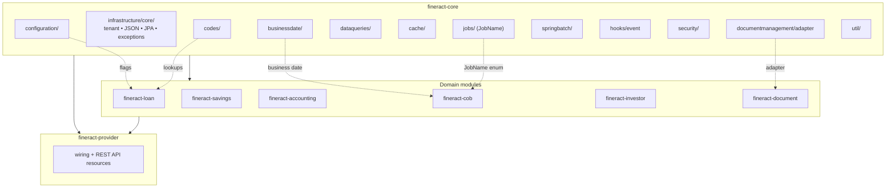

The `fineract-core` Gradle module is the foundational library shared by every higher-level Apache Fineract module (`fineract-provider`, `fineract-document`, `fineract-loan`, `fineract-savings`, `fineract-accounting`, `fineract-investor`, the COB engine, etc.). It contains the cross-cutting primitives — tenant context, persistence base classes, JSON serializers, the business-date abstraction, the global-configuration model, the codes/code-values registry, the job-name enum, the cache delegating manager, hook event primitives, the security context, datatable & report contracts, and utility helpers — that every other module depends on.

This page is the map. Each subsequent page in this group is a deep dive into one sub-package or family of sub-packages found under `fineract-core/src/main/java/org/apache/fineract/`.

## What lives in `fineract-core`

The module's `build.gradle` declares it as `Fineract Core` (see `fineract-core/build.gradle`, line 19). Its top-level Java packages are:

```text fineract-core/src/main/java/org/apache/fineract/
accounting/
batch/
commands/
infrastructure/   ← the bulk of this group of wiki pages
interoperation/
notification/
organisation/
portfolio/
useradministration/
util/
```

Within `infrastructure/`, these are the sub-packages this group of pages dissects:

```text fineract-core/src/main/java/org/apache/fineract/infrastructure/
accountnumberformat/
bulkimport/
businessdate/
cache/
codes/
configuration/
core/                ← the deepest plumbing: tenant, JSON, exceptions, JPA, jersey
dataqueries/
documentmanagement/  ← thin adapter; bulk in fineract-document
event/
hooks/               ← primitives only; processors in fineract-provider
instancemode/
jobs/                ← JobName enum + custom job parameters
security/            ← PlatformSecurityContext + SQL-injection guards
springbatch/         ← partition properties + constants
```

The `infrastructure/core/` package is itself a constellation of sub-packages — `annotation`, `aop`, `api`, `boot`, `component`, `condition`, `config`, `data`, `diagnostics`, `domain`, `exception`, `exceptionmapper`, `filters`, `jersey`, `jpa`, `logging`, `persistence`, `serialization`, `service`, `validator` — which the [Infrastructure Core](/core/infrastructure-core) page walks through in detail.

## How `fineract-core` supports the rest of the platform



`fineract-core` is a *primitives-only* library: it carries entity base classes, repositories, services, and a small number of API resource classes (notably `CacheApiResource`, `BusinessDateApiResource`). The HTTP wiring, the Quartz scheduler, the Spring Batch worker/manager configuration, datatable REST API resources, and the hook processors all live in `fineract-provider`. That split keeps `fineract-core` light and lets the COB worker / batch worker JVMs depend on the core without pulling in the entire web stack.

## Sub-package map

<Note>
Every row below points at a page in this same wiki group. Pages cover both the `fineract-core` primitives and — where relevant — the `fineract-provider` wiring that completes them.
</Note>

| Sub-package | Purpose | Deep-dive |
| --- | --- | --- |
| `infrastructure/core/` | Tenant context, base entities, JSON serialization, exceptions, JPA, filters, Jersey, diagnostics — the deepest cross-cutting plumbing. | [Infrastructure Core](/core/infrastructure-core) |
| `infrastructure/businessdate/` | `BusinessDateType` enum (`BUSINESS_DATE`, `COB_DATE`), `BusinessDate` entity, repository wrapper, API resource, "increase by one day" job. | [Business Date](/core/business-date) |
| `infrastructure/codes/` | User-defined enumerations: `Code` and `CodeValue` entities, repositories, read services, swagger docs. Backs loan purposes, gender, IDs, etc. | [Codes & Code Values](/core/codes-and-code-values) |
| `infrastructure/dataqueries/` | Datatable & report primitives: `GenericDataService`, `ReportType` whitelist, datatable read/write services, `DataTableApiConstant`. | [Data Queries & Datatables](/core/data-queries-and-datatables) |
| `infrastructure/configuration/` | `GlobalConfigurationProperty` entity, `ConfigurationDomainService` interface (~150 flags), `GlobalConfigurationConstants`, validation, `TemporaryConfigurationServiceContainer`. | [Configuration & Global Config](/core/configuration-and-global-config) |
| `infrastructure/documentmanagement/` | A single `EntityImageIdAdapter` decoupling primitive. Full document/content-store stack is in `fineract-document`. | [Document Management](/core/document-management) |
| `infrastructure/jobs/` | The `JobName` enum (every scheduled job in the platform), `CustomJobParameter` entity, `Step` names, `TenantAwareEqualsHashCodeAdvice`. | [Jobs Framework](/core/jobs-framework) |
| `infrastructure/springbatch/` | `PropertyService` interface (partition size, chunk size, retry, thread pool), `SpringBatchJobConstants`. Worker/Manager configs live in provider. | [Spring Batch](/core/spring-batch) |
| `infrastructure/cache/` | `CacheType` enum (`NO_CACHE`, `SINGLE_NODE`, `MULTI_NODE`), `PlatformCacheConfiguration`, `RuntimeDelegatingCacheManager`, `CacheApiResource`. | [Cache](/core/cache) |
| `infrastructure/hooks/event/` | `HookEvent` and `HookEventSource` primitives only. Hook entities, processors, template engine live in `fineract-provider`. | [Hooks](/core/hooks) |
| `infrastructure/security/` | `PlatformSecurityContext`, `PlatformUser`, `SqlValidator`/`SqlInjectionPreventerService`, `ColumnValidator`, `SQLBuilder`, password encoders. | [Security Primitives](/core/security-primitives) |
| `infrastructure/accountnumberformat/`, `bulkimport/`, `event/`, `instancemode/` | Account number formatter, bulk import data model, business/external event base classes, instance-mode (read-only) filter primitives. | covered piecemeal under [Infrastructure Core](/core/infrastructure-core) |
| `org.apache.fineract.util` | `StreamUtil`, `StreamResponseUtil`, `LoopGuard`, `LoopContext` — generic helpers. | [Util & Helpers](/core/util-and-helpers) |

## What is *not* in `fineract-core`

`fineract-core` deliberately holds interfaces, base classes, and lightweight services. The implementations / wiring you need to know about live elsewhere:

<CardGroup cols={2}>
  <Card title="HTTP API resources" icon="globe">
    Most `*ApiResource` classes (Datatables, Reports, Hooks, Scheduler, GlobalConfiguration, etc.) live in `fineract-provider/src/main/java/org/apache/fineract/infrastructure/<sub>/api/`.
  </Card>
  <Card title="Quartz scheduler" icon="clock">
    `JobRegisterServiceImpl`, `JobSchedulerServiceImpl`, `SchedulerJobListener` are in `fineract-provider/.../infrastructure/jobs/service/`.
  </Card>
  <Card title="Spring Batch worker/manager" icon="layer-group">
    `ManagerConfig`, `WorkerConfig`, `InputChannelInterceptor`, `OutputChannelInterceptor` live in `fineract-provider/.../infrastructure/springbatch/`.
  </Card>
  <Card title="Content stores" icon="folder">
    Filesystem / S3 content stores, content detectors, content policies are in `fineract-document/`.
  </Card>
</CardGroup>

## Reading order

<Steps>
  <Step title="Start with Infrastructure Core">
    The [Infrastructure Core](/core/infrastructure-core) page introduces tenant context, the base entity hierarchy, and JSON/serialization primitives that every other page references.
  </Step>
  <Step title="Then the data primitives">
    [Codes & Code Values](/core/codes-and-code-values) and [Data Queries & Datatables](/core/data-queries-and-datatables) cover user-defined enums and user-defined tables — they show up everywhere in loan/savings configuration.
  </Step>
  <Step title="Then the runtime knobs">
    [Configuration & Global Config](/core/configuration-and-global-config), [Cache](/core/cache), and [Business Date](/core/business-date) describe state that toggles platform behaviour at runtime.
  </Step>
  <Step title="Then async">
    [Jobs Framework](/core/jobs-framework) and [Spring Batch](/core/spring-batch) are tightly coupled; read jobs first.
  </Step>
  <Step title="Finally cross-cutting">
    [Hooks](/core/hooks), [Security Primitives](/core/security-primitives), [Document Management](/core/document-management), [Util & Helpers](/core/util-and-helpers).
  </Step>
</Steps>

<Tip>
When you see a class referenced without a `fineract-provider/` or `fineract-document/` path prefix, it lives in `fineract-core`. Provider/document classes are always called out explicitly.
</Tip>

## Cross-module dependency rule

The Gradle build (`fineract-core/build.gradle`) declares `fineract-core` as a leaf-ish library — it depends on Spring core, Spring Data JPA, Spring Security primitives, Jersey/JAX-RS, Gson, Apache Commons, Hibernate, but **not** on any other `fineract-*` module. Every other module depends *on* `fineract-core` rather than the other way around. That asymmetry is what lets a worker-only JVM (one configured purely as a Spring Batch worker) pull in `fineract-core` plus its Spring Batch graph without the entire web stack.

In practice the rule manifests as:

- The `CacheApiResource` and `BusinessDateApiResource` exist in `fineract-core` because they need no domain-specific dependencies (just `RuntimeDelegatingCacheManager` and `BusinessDateWritePlatformService`). They are the *only* two REST resources in core.
- The codes/configuration/datatable/job REST resources live in `fineract-provider` because they participate in the maker-checker bus and pull in domain-validation chains.
- Spring conditional beans (`@ConditionalOnProperty(value = "fineract.mode.batch-worker-enabled")`) ensure the right beans for each JVM role are activated; the conditions themselves are declared in `fineract-core/.../core/condition/`.

## Common build manipulations

```text fineract-core/build.gradle
description = 'Fineract Core'

apply plugin: 'java'
apply plugin: 'eclipse'

configurations {
    providedRuntime // needed for Spring Boot executable WAR
    providedCompile
    // ...
}

compileJava {
    dependsOn ':fineract-avro-schemas:buildJavaSdk'
    options.compilerArgs += ['-parameters']
}
```

Two notable lines:

- `dependsOn ':fineract-avro-schemas:buildJavaSdk'` — Avro-generated Java classes (used by the external events publisher) are compiled before `fineract-core` so its `event/external/` subpackage can reference them.
- `options.compilerArgs += ['-parameters']` — keeps parameter names available at runtime, which the JAX-RS layer and Spring MVC use for `@QueryParam` / `@PathParam` introspection without explicit annotations.

## When to add to `fineract-core` vs elsewhere

<Steps>
  <Step title="Cross-cutting concern with no domain coupling?">
    Add to `fineract-core`. Examples: a new JSON adapter, a new validator builder method, a new tenant-context utility.
  </Step>
  <Step title="REST resource consuming maker-checker / domain services?">
    Add to `fineract-provider/.../infrastructure/`. The matching domain primitives may still live in `fineract-core`.
  </Step>
  <Step title="A new scheduled job?">
    Add the constant to `JobName` in `fineract-core`, then add the bean and Quartz wiring in `fineract-provider/.../infrastructure/jobs/service/`. See [Jobs Framework](/core/jobs-framework).
  </Step>
  <Step title="A new global config flag?">
    Add the string constant to `GlobalConfigurationConstants` and the typed getter to `ConfigurationDomainService` in `fineract-core`, then seed the row in a Liquibase migration. See [Configuration](/core/configuration-and-global-config).
  </Step>
  <Step title="A new domain entity (loan product type, savings feature)?">
    Lives in the relevant domain module (`fineract-loan`, `fineract-savings`, etc.). `fineract-core` only carries genuinely cross-cutting concerns.
  </Step>
</Steps>
