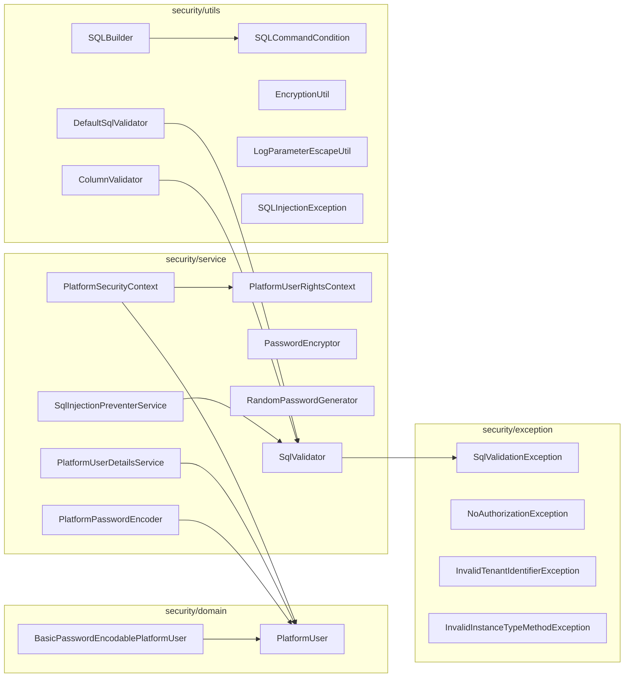
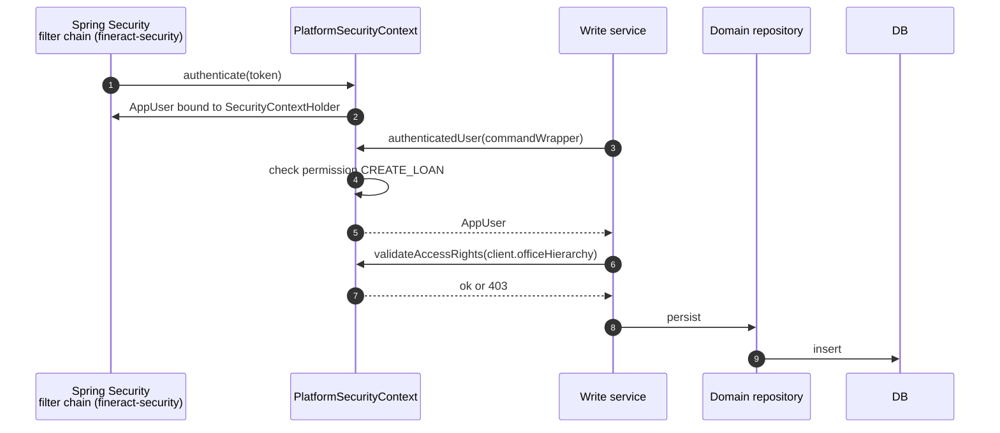

`fineract-core` carries the *abstractions* that every authenticated path in Apache Fineract depends on — the security context interface, the platform-user marker, the password encoders, and a small library of SQL-injection guards. The bulk of the security wiring (JWT decoding, Spring Security filter chain, two-factor flow, OAuth2 configuration) lives in `fineract-security`, but those modules build on what this page documents.

Source root: `fineract-core/src/main/java/org/apache/fineract/infrastructure/security/`.

## Sub-package map



## Identity primitives

### `PlatformUser` — the Spring Security adapter

```java fineract-core/.../security/domain/PlatformUser.java
/**
 * Interface to protect platform from implementation detail of spring security.
 */
public interface PlatformUser extends UserDetails {
}
```

A marker that says "this is a Fineract user as Spring sees it". The concrete `AppUser` (in `useradministration/domain/`) implements `PlatformUser` so it can be authenticated by Spring Security while also being a JPA entity.

### `BasicPasswordEncodablePlatformUser`

```java fineract-core/.../security/domain/BasicPasswordEncodablePlatformUser.java (excerpt)
public final class BasicPasswordEncodablePlatformUser implements PlatformUser {
    // value type: { username, password, salt-like material }
}
```

A lightweight, non-entity `PlatformUser` used by the password-encoder when it needs to project an `AppUser` into the minimal shape required for hashing without dragging the entire entity through the hashing call.

## `PlatformSecurityContext` — the request-scoped identity

```java fineract-core/.../security/service/PlatformSecurityContext.java
public interface PlatformSecurityContext extends PlatformUserRightsContext {

    AppUser authenticatedUser();

    /**
     * Convenience method returns null (does not throw an exception) if an authenticated user is not present
     *
     * To be used only in service layer methods that can be triggered via both the API and batch Jobs
     * (which do not have an authenticated user)
     */
    AppUser getAuthenticatedUserIfPresent();

    void validateAccessRights(String resourceOfficeHierarchy);

    String officeHierarchy();

    boolean doesPasswordHasToBeRenewed(AppUser currentUser);

    AppUser authenticatedUser(CommandWrapper commandWrapper);
}
```

| Method | Used by |
| --- | --- |
| `authenticatedUser()` | Most write services. Throws `UnAuthenticatedUserException` if no user. |
| `getAuthenticatedUserIfPresent()` | Services that are called from both the API and from background jobs (where there is no user). |
| `validateAccessRights(officeHierarchy)` | Office-scoped reads — confirms the current user's office covers the resource's office prefix. |
| `officeHierarchy()` | Returns the current user's office hierarchy string, e.g. `.1.5.7.`. |
| `doesPasswordHasToBeRenewed(currentUser)` | Used by auth flows to enforce password-expiry. |
| `authenticatedUser(CommandWrapper)` | Variant for the command bus: also enforces permission for the target command + maker-checker rules. |

`PlatformUserRightsContext` is the tiny base:

```java fineract-core/.../security/service/PlatformUserRightsContext.java
public interface PlatformUserRightsContext {
    void isAuthenticated();
}
```

The concrete implementation lives in `fineract-security` (`SpringSecurityPlatformSecurityContext`). It pulls the principal from Spring's `SecurityContextHolder`, casts to `AppUser`, and threads it through.

## `PlatformUserDetailsService`

The Spring `UserDetailsService` projection:

```java fineract-core/.../security/service/PlatformUserDetailsService.java (excerpt)
public interface PlatformUserDetailsService extends UserDetailsService {
    // resolves username -> AppUser (PlatformUser) for the basic auth / JWT path
}
```

Implementation lives in the user-administration module (`useradministration/service/AppUserReadPlatformServiceImpl`).

## Password handling

### `PlatformPasswordEncoder`

```java fineract-core/.../security/service/PlatformPasswordEncoder.java
public interface PlatformPasswordEncoder {

    String encode(PlatformUser appUser);
}
```

Takes a `PlatformUser` and returns the encoded password (the user carries both the raw and the per-user salt material). The implementation in `fineract-security` is BCrypt-based by default, configurable.

### `PasswordEncryptor`

```java fineract-core/.../security/service/PasswordEncryptor.java
```

An interface used by *non-user* secret material — webhook secrets, S3 keys persisted in `c_external_service`, etc. The implementation is AES-based with a tenant-scoped master key.

### `RandomPasswordGenerator`

Concrete utility for generating one-off passwords (used when an admin creates a user account and an initial password must be issued). Implementation uses `SecureRandom`.

## SQL injection guards

These are the line of defence around the [Data Queries & Datatables](/core/data-queries-and-datatables) subsystem and any other place where user-supplied identifiers reach SQL.

### `SqlValidator` interface

```java fineract-core/.../security/service/SqlValidator.java
public interface SqlValidator {

    void validate(String statement) throws SqlValidationException;

    void validate(String profile, String statement) throws SqlValidationException;
}
```

Two-argument variant lets callers pick a *profile* (e.g. a stricter rule set for report SQL than for ad-hoc reads).

### `DefaultSqlValidator`

The default implementation under `security/utils/DefaultSqlValidator.java`. It rejects:

- Semicolons (`;`) outside string literals.
- SQL comments (`--`, `/* */`).
- Multiple statements.
- `INTO OUTFILE`, `LOAD_FILE`, `SLEEP(`, `BENCHMARK(` and other well-known fingerprints.
- Statements whose top-level keyword isn't in an allowed list per profile.

On failure it throws `SqlValidationException` (under `security/exception/`).

### `SqlInjectionPreventerService`

A higher-level helper that **encodes** rather than just validates:

```java fineract-core/.../security/service/SqlInjectionPreventerService.java
public interface SqlInjectionPreventerService {

    String encodeSql(String literal);

    /**
     * Validates and quotes a database identifier (table name, column name) using
     * database-specific quoting rules. This method ensures that identifiers are
     * safely quoted to prevent SQL injection attacks.
     */
    String quoteIdentifier(String identifier, java.util.Set<String> allowedValues);

    /**
     * Validates and quotes a database identifier without whitelist validation.
     */
    String quoteIdentifier(String identifier);
}
```

| Method | Use |
| --- | --- |
| `encodeSql(literal)` | Escape a user-supplied *value* destined to be embedded as a SQL literal. Generally avoided in favour of `?` placeholders. |
| `quoteIdentifier(identifier, allowedValues)` | Quote a column/table name **and** enforce membership of a whitelist. |
| `quoteIdentifier(identifier)` | Quote a column/table name without a whitelist — caller must already be sure. |

The provider implementation switches its quoting style (backticks for MySQL/MariaDB, double-quotes for PostgreSQL) by checking the active database vendor.

### `ColumnValidator`

```java fineract-core/.../security/utils/ColumnValidator.java
@Component
public class ColumnValidator {

    private final SqlValidator sqlValidator;
    private final JdbcTemplate jdbcTemplate;
    // ...
}
```

Reads `INFORMATION_SCHEMA` through the routing `JdbcTemplate` and validates that a requested column actually exists on a given table — used by report and datatable execution to confirm the projection list is real before substituting it into SQL.

### `SQLBuilder`

A small DSL for assembling parameterised `WHERE` clauses without manual string concatenation:

```java fineract-core/.../security/utils/SQLBuilder.java (excerpt)
/**
 * Utility to assemble the WHERE clause of an SQL query without the risk of SQL injection.
 * When using this utility instead of manually assembling SQL queries, then SqlValidator
 * should not be required anymore.
 * (Correctly using this means only ever passing completely fixed String literals to .)
 *
 * @author Michael Vorburger <mike@vorburger.ch>
 */
public class SQLBuilder {

    private static final Pattern ATOZ = Pattern.compile("([a-zA-Z_][a-zA-Z0-9_-]*\\.)?[a-zA-Z_-][a-zA-Z0-9_-]*");

    // ...
}
```

The identifier pattern `ATOZ` enforces that column/table names supplied to the builder match a strict identifier regex; otherwise the builder throws. The actual values are bound via `?` placeholders against a `PreparedStatement`.

### `SQLCommandCondition`

Companion to `SQLBuilder` — encapsulates one `column OP value` predicate together with its bound parameter.

### `SQLInjectionException`

Lives at `security/utils/SQLInjectionException.java` (not `exception/`) — thrown by `SQLBuilder` when an identifier fails the regex check.

### Other exceptions in `security/exception/`

| Exception | Used for |
| --- | --- |
| `SqlValidationException` | Top-level failure thrown by `SqlValidator`/`DefaultSqlValidator`. Extends `AbstractPlatformDomainRuleException`. |
| `NoAuthorizationException` | 403 — current user lacks the requested permission. |
| `InvalidTenantIdentifierException` | 400 — incoming tenant header doesn't resolve. |
| `InvalidInstanceTypeMethodException` | Thrown by the instance-mode filter when a write call hits a read-only JVM (see `infrastructure/instancemode/`). |

### `EncryptionUtil` and `LogParameterEscapeUtil`

| Class | Role |
| --- | --- |
| `EncryptionUtil` | Static helpers wrapping `javax.crypto` — used by `PasswordEncryptor` and friends. |
| `LogParameterEscapeUtil` | Escapes potentially-malicious characters (`\n`, `\r`, control bytes) out of user input before it is logged, preventing log forging. |

## Permissions interaction (in `useradministration`)

`AppUser` (in `useradministration/domain/`) implements `PlatformUser` and carries:

- `Role` and `Permission` entities — Spring Security `GrantedAuthority`s.
- `Office` reference — used by `validateAccessRights`.
- `staff` reference — drives office-scoped queries.
- Password history (`AppUserPreviousPassword`) — supports the `password-reuse-check-history-count` config flag.
- Two-factor secret and remembered devices (when 2FA is enabled).

Hashing happens via `PlatformPasswordEncoder.encode(user)` in the implementation in `fineract-security`.

## How a typical request authorises



## Common usage pattern

```java
@RequiredArgsConstructor
@Service
public class LoanWritePlatformServiceImpl implements LoanWritePlatformService {

    private final PlatformSecurityContext context;
    // ...

    @Override
    public CommandProcessingResult disburseLoan(Long loanId, JsonCommand command) {
        AppUser currentUser = this.context.authenticatedUser();  // 401 if absent
        Loan loan = this.loanRepository.findOneWithNotFoundDetection(loanId);
        this.context.validateAccessRights(loan.getOfficeHierarchy());  // 403 if out of scope
        // ... apply domain change ...
    }
}
```

For service methods callable from background jobs:

```java
AppUser user = this.context.getAuthenticatedUserIfPresent();
// user may be null — branch accordingly, do not throw
```

## Class index

<CardGroup cols={2}>
  <Card title="domain/PlatformUser" icon="user">
    Marker extending Spring's `UserDetails`.
  </Card>
  <Card title="domain/BasicPasswordEncodablePlatformUser" icon="key">
    Value-type `PlatformUser` used by the encoder.
  </Card>
  <Card title="service/PlatformSecurityContext" icon="shield-halved">
    Request-scoped identity, office validation, password renewal check.
  </Card>
  <Card title="service/PlatformUserRightsContext" icon="check">
    `isAuthenticated()` base.
  </Card>
  <Card title="service/PlatformUserDetailsService" icon="address-card">
    UserDetails projection.
  </Card>
  <Card title="service/PlatformPasswordEncoder" icon="lock">
    User-password hashing.
  </Card>
  <Card title="service/PasswordEncryptor" icon="lock">
    Symmetric encryption for non-user secrets.
  </Card>
  <Card title="service/RandomPasswordGenerator" icon="dice">
    Initial password generator.
  </Card>
  <Card title="service/SqlValidator" icon="shield-check">
    Reject dangerous SQL fragments.
  </Card>
  <Card title="service/SqlInjectionPreventerService" icon="ban">
    Encode literals + quote identifiers (with whitelist).
  </Card>
  <Card title="utils/DefaultSqlValidator" icon="shield-check">
    Default `SqlValidator` implementation.
  </Card>
  <Card title="utils/SQLBuilder" icon="hammer">
    Safe WHERE-clause builder with regex-guarded identifiers.
  </Card>
  <Card title="utils/SQLCommandCondition" icon="puzzle-piece">
    Per-predicate carrier used by `SQLBuilder`.
  </Card>
  <Card title="utils/ColumnValidator" icon="table-columns">
    `INFORMATION_SCHEMA` column existence check.
  </Card>
  <Card title="utils/EncryptionUtil" icon="lock">
    AES helpers.
  </Card>
  <Card title="utils/LogParameterEscapeUtil" icon="terminal">
    Sanitises user input before logging.
  </Card>
  <Card title="utils/SQLInjectionException" icon="triangle-exclamation">
    Thrown by `SQLBuilder` on bad identifiers.
  </Card>
</CardGroup>

<Tip>
The single most common mistake when adding a custom read service that touches user-supplied column names: skipping `ColumnValidator` and reaching for string concatenation. Don't. Use `SQLBuilder` for `WHERE` predicates, `SqlInjectionPreventerService.quoteIdentifier(name, whitelist)` for identifiers, and `?` placeholders for values.
</Tip>

<Note>
The Spring Security filter chain, JWT decoder, OAuth2 client configuration, two-factor authentication flow and recover-password endpoints all live in `fineract-security`. They consume the interfaces on this page but extend well beyond the scope of `fineract-core`.
</Note>

## Continue with

- [Data Queries & Datatables](/core/data-queries-and-datatables) — primary consumer of `SqlValidator` / `ColumnValidator`.
- [Configuration](/core/configuration-and-global-config) — password-policy flags (`force-password-reset-days`, `password-reuse-check-history-count`, etc.).
- [Infrastructure Core](/core/infrastructure-core) — `AbstractPlatform*Exception` ancestors of the security exceptions.
