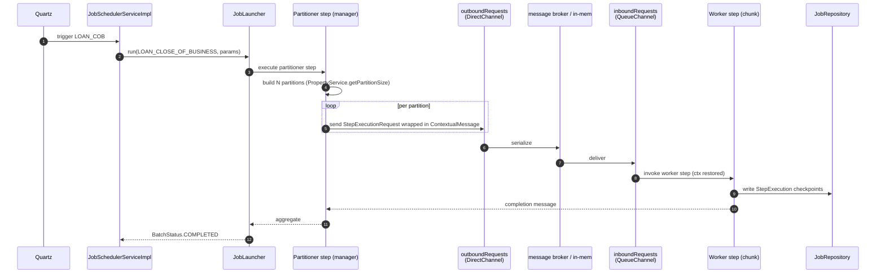

A subset of Apache Fineract jobs need parallelism and durable checkpointing — most notably **Loan COB** and **Non-Performing Asset (NPA) update**. Those jobs are implemented as Spring Batch graphs that run on top of the Quartz scheduling layer described in [Jobs Framework](/core/jobs-framework). `fineract-core` contributes the *knobs* (the `PropertyService` interface and shared constants); `fineract-provider` contributes the manager/worker configurations and the channel interceptors that propagate tenant context across remote workers.

Source roots:

- `fineract-core/src/main/java/org/apache/fineract/infrastructure/springbatch/`
- `fineract-provider/src/main/java/org/apache/fineract/infrastructure/springbatch/`
- Example partitioner: `fineract-provider/src/main/java/org/apache/fineract/cob/loan/`

## Architecture

```mermaid
flowchart TB
    subgraph CORE["fineract-core / springbatch"]
        PS[PropertyService]
        SC[SpringBatchJobConstants]
    end

    subgraph MGR["fineract-provider / Manager JVM"]
        ManagerCfg[ManagerConfig<br/>@EnableBatchIntegration]
        OutCh[DirectChannel<br/>outboundRequests]
        OutInt[OutputChannelInterceptor<br/>captures ctx]
        LoanCOBMgr[LoanCOBManagerConfiguration<br/>partitioner + handler]
        Partitioner[LoanCOBPartitioner<br/>extends CommonPartitioner]
    end

    subgraph WRK["fineract-provider / Worker JVM"]
        WorkerCfg[WorkerConfig<br/>@EnableBatchIntegration]
        InCh[QueueChannel<br/>inboundRequests]
        InInt[InputChannelInterceptor<br/>restores ctx + ActionContext.COB]
        LoanCOBWrk[LoanCOBWorkerConfiguration<br/>worker step]
    end

    subgraph BATCH["Spring Batch"]
        JR[JobRepository]
        JL[TaskExecutorJobLauncher]
        JE[JobExplorer]
    end

    PS --> LoanCOBMgr
    PS --> LoanCOBWrk
    LoanCOBMgr --> Partitioner
    Partitioner --> OutCh
    OutInt --> OutCh
    OutCh --> InCh
    InCh --> InInt
    InInt --> LoanCOBWrk
    LoanCOBWrk --> JR
    LoanCOBMgr --> JR
    SC --> Partitioner
    SC --> InInt
```

## What `fineract-core` defines

### `PropertyService`

The single source of truth for per-job batch knobs. Every partitioned job pulls its sizing from this interface:

```java fineract-core/.../springbatch/PropertyService.java
public interface PropertyService {

    Integer getPartitionSize(String jobName);

    Integer getChunkSize(String jobName);

    Integer getRetryLimit(String jobName);

    Integer getThreadPoolCorePoolSize(String jobName);

    Integer getThreadPoolMaxPoolSize(String jobName);

    Integer getThreadPoolQueueCapacity(String jobName);

    Integer getPollInterval(String jobName);
}
```

| Method | Tunes |
| --- | --- |
| `getPartitionSize` | Number of partitions the partitioner creates per run. |
| `getChunkSize` | Spring Batch chunk size (reader → processor → writer per transaction). |
| `getRetryLimit` | Per-chunk retry count on transient failure. |
| `getThreadPoolCorePoolSize` / `MaxPoolSize` / `QueueCapacity` | `ThreadPoolTaskExecutor` for worker execution. |
| `getPollInterval` | Manager poll interval when awaiting worker completion. |

The interface is implemented by `PropertyServiceImpl` in `fineract-provider/.../infrastructure/springbatch/PropertyServiceImpl.java`:

```java fineract-provider/.../springbatch/PropertyServiceImpl.java
@Service
@RequiredArgsConstructor
public class PropertyServiceImpl implements PropertyService {

    private final FineractProperties fineractProperties;

    @Override
    public Integer getPartitionSize(String jobName) {
        return getProperty(jobName, FineractProperties.PartitionedJobProperty::getPartitionSize);
    }

    // ... one method per knob ...

    private Integer getProperty(String jobName,
            Function<? super FineractProperties.PartitionedJobProperty, Integer> function) {
        List<FineractProperties.PartitionedJobProperty> jobProperties = fineractProperties
                .getPartitionedJob().getPartitionedJobProperties();
        return jobProperties.stream()
                .filter(p -> jobName.equals(p.getJobName()))
                .findFirst()
                .map(function)
                .orElse(1);
    }
}
```

The actual values come from `FineractProperties` (Spring `@ConfigurationProperties`) — i.e. `application.yaml` / environment variables. A typical config block looks like:

```yaml
fineract:
  partitioned-job:
    partitioned-job-properties:
      - job-name: LOAN_COB
        partition-size: 100
        chunk-size: 100
        retry-limit: 3
        thread-pool-core-pool-size: 4
        thread-pool-max-pool-size: 8
        thread-pool-queue-capacity: 100
        poll-interval: 1000
```

If a job has no entry the helper falls back to `1`.

### `SpringBatchJobConstants`

```java fineract-core/.../springbatch/SpringBatchJobConstants.java
public abstract class SpringBatchJobConstants {

    public static final String CUSTOM_JOB_PARAMETER_ID_KEY = "CUSTOM_JOB_PARAMETER_ID";
}
```

The single key under which a custom-parameter id is stamped into the Spring Batch `JobParameters` so worker steps can fetch the JSON blob (see [Jobs Framework](/core/jobs-framework) → `CustomJobParameter`).

## What `fineract-provider` contributes

### `ManagerConfig` — outbound side

```java fineract-provider/.../springbatch/ManagerConfig.java
@Configuration
@EnableBatchIntegration
@ConditionalOnProperty(value = "fineract.mode.batch-manager-enabled", havingValue = "true")
public class ManagerConfig {

    @Bean
    public DirectChannel outboundRequests() {
        return new DirectChannel();
    }

    @Bean
    public OutputChannelInterceptor outputInterceptor() {
        return new OutputChannelInterceptor();
    }
}
```

When `fineract.mode.batch-manager-enabled=true`, the JVM acts as the **manager**: it creates partitions and dispatches `StepExecutionRequest` messages through `outboundRequests`. The interceptor wraps each message so it carries the originating `FineractContext` (tenant id, business dates, locale, etc.).

### `WorkerConfig` — inbound side

```java fineract-provider/.../springbatch/WorkerConfig.java
@Configuration
@ConditionalOnProperty(value = "fineract.mode.batch-worker-enabled", havingValue = "true")
public class WorkerConfig {

    @Bean
    public QueueChannel inboundRequests() {
        return new QueueChannel();
    }

    @Bean
    public InputChannelInterceptor inputInterceptor() {
        return new InputChannelInterceptor();
    }
}
```

When `fineract.mode.batch-worker-enabled=true`, the JVM acts as a **worker**: it receives `StepExecutionRequest` messages on `inboundRequests`. The interceptor restores tenant context before each step:

```java fineract-provider/.../springbatch/InputChannelInterceptor.java
public StepExecutionRequest beforeHandleMessage(ContextualMessage contextualMessage) {
    log.debug("Initializing ThreadLocal context for message handling: {}", contextualMessage);
    ThreadLocalContextUtil.init(contextualMessage.getContext());
    ThreadLocalContextUtil.setActionContext(ActionContext.COB);
    return contextualMessage.getStepExecutionRequest();
}
```

`ContextualMessage` carries the original `FineractContext`. The `ActionContext.COB` switch makes downstream code aware that this thread is a COB worker — for instance, `DateUtils.getBusinessLocalDate()` returns `COB_DATE` instead of `BUSINESS_DATE` for COB threads.

### Message handlers

`fineract-provider/.../springbatch/messagehandler/` contains the JMS / Kafka / in-memory implementations that ferry `ContextualMessage` instances between the manager and the workers. Which one is wired in depends on `FineractProperties.remoteJobMessageHandler` and is conditionally enabled by `FineractRemoteJobMessageHandlerCondition`.

A single JVM can run both manager and worker (`fineract.mode.batch-manager-enabled=true` and `batch-worker-enabled=true`), in which case the interceptors are wired but use an in-process channel — the typical development setup.

## Worked example: Loan COB

Loan COB is the largest partitioned job. Its constants live at `fineract-provider/cob/loan/LoanCOBConstant.java`:

```java fineract-provider/.../cob/loan/LoanCOBConstant.java
public final class LoanCOBConstant extends COBConstant {
    public static final String JOB_NAME = "LOAN_COB";
    public static final String JOB_HUMAN_READABLE_NAME = "Loan COB";
    public static final String LOAN_COB_JOB_NAME = "LOAN_CLOSE_OF_BUSINESS";
    public static final String LOAN_COB_WORKER_STEP = "loanCOBWorkerStep";
    // ...
    public static final String LOAN_COB_PARTITIONER_STEP = /* ... */;
}
```

### Partitioner

```java fineract-provider/.../cob/loan/LoanCOBPartitioner.java
@Slf4j
public class LoanCOBPartitioner extends CommonPartitioner implements Partitioner {

    private final PropertyService propertyService;
    private final COBBusinessStepService cobBusinessStepService;
    // partition(...) splits the eligible loan id set into N chunks
}
```

The partitioner extends `CommonPartitioner` (a small Fineract-specific base class in `fineract-provider/cob/common/`) which centralises:

- Tenant context propagation into each partition's `ExecutionContext`.
- Loan id range computation using `RetrieveLoanIdService` to find all *eligible* (non-closed, lagging-COB) loans.
- Stamping the resolved set of `COBBusinessStep`s into each partition so workers run the same step chain.

### Manager configuration

```java fineract-provider/.../cob/loan/LoanCOBManagerConfiguration.java
@Configuration
@Conditional(BatchManagerCondition.class)
public class LoanCOBManagerConfiguration {
    // uses StepBuilder, JobBuilder, RemotePartitioningManagerStepBuilderFactory
    // builds the partitioner step and the COB job
}
```

It uses Spring Batch's `RemotePartitioningManagerStepBuilderFactory` (when remote workers are configured) or a local executor (single-JVM case). The partitioner step is wrapped in a `JobBuilder` keyed by `LoanCOBConstant.LOAN_COB_JOB_NAME`.

### Worker configuration

```java fineract-provider/.../cob/loan/LoanCOBWorkerConfiguration.java
@Configuration
@Conditional(BatchWorkerCondition.class)
public class LoanCOBWorkerConfiguration {

    @Autowired private JobRepository jobRepository;
    @Autowired private PlatformTransactionManager transactionManager;
    @Autowired private RemotePartitioningWorkerStepBuilderFactory stepBuilderFactory;
    @Autowired private PropertyService propertyService;
    @Autowired private LoanRepository loanRepository;
    @Autowired private QueueChannel inboundRequests;
    @Autowired private COBBusinessStepService cobBusinessStepService;
    // ...
}
```

The worker step is a *chunk-oriented* step built with `SimpleStepBuilder`:

- Reader: `LoanItemReader` reads a page of loan ids from this partition.
- Processor: `LoanItemProcessor` runs the configured `COBBusinessStep`s on each loan.
- Writer: `LoanItemWriter` flushes mutated loans.

Its chunk size comes from `propertyService.getChunkSize(JobName.LOAN_COB.name())`.

### `PartitionedJob` enum

```java fineract-provider/.../jobs/data/partitionedjobs/PartitionedJob.java
public enum PartitionedJob {
    LOAN_COB(LoanCOBConstant.LOAN_COB_PARTITIONER_STEP);

    @Getter
    private final String partitionerStepName;

    public static boolean existsByJobName(String jobName) { /* ... */ }
}
```

`JobRegisterServiceImpl` consults `PartitionedJob.existsByJobName` when wiring Quartz; if true, the trigger launches the Spring Batch job instead of invoking a plain bean method.

## NPA Update — a simpler example

The `UPDATE_NPA` job has its own Spring Batch graph under `fineract-provider/.../infrastructure/jobs/service/updatenpa/`:

```
UpdateNpaConfig.java
UpdateNpaTasklet.java
```

This is a single-step tasklet-style batch (no chunk-orientation), but it still flows through Spring Batch so it can run on worker JVMs in clustered deployments and benefit from durable `JobRepository` checkpoints.

`UpdateNpaConfig` exposes a `Job` bean wired by `JobRegisterServiceImpl`; the tasklet does the actual SQL update under tenant context.

## End-to-end flow



`Output`/`InputChannelInterceptor` are responsible for the serialisation of `FineractContext` into `ContextualMessage` and back — see `ContextualMessage.java` in `fineract-provider/.../springbatch/`.

## Spring Batch metadata

The Spring Batch tables (`BATCH_JOB_INSTANCE`, `BATCH_JOB_EXECUTION`, `BATCH_STEP_EXECUTION`, `BATCH_JOB_EXECUTION_CONTEXT`, `BATCH_STEP_EXECUTION_CONTEXT`, `BATCH_JOB_EXECUTION_PARAMS`) live in the tenant data DB. They are written through the `JobRepository` defined in `ScheduledJobRunnerConfig` ([Jobs Framework](/core/jobs-framework)), which uses the routing datasource so they end up scoped to the active tenant.

`FineractDataFieldMaxValueIncrementerFactory` overrides the default factory because Spring 6's MariaDB incrementer conflicts with Fineract's Spring Batch version:

```java fineract-provider/.../jobs/ScheduledJobRunnerConfig.java
@Bean
public DataFieldMaxValueIncrementerFactory incrementerFactory(RoutingDataSource ds) {
    // The DefaultDataFieldMaxValueIncrementerFactory has to be overridden because Spring 6 introduced
    // a new MariaDB incrementer that's incompatible with Spring Batch 4.x
    return new FineractDataFieldMaxValueIncrementerFactory(ds);
}
```

## Conditions

| Condition | Activates |
| --- | --- |
| `BatchManagerCondition` (in `cob/conditions/`) | Manager-side beans when `fineract.mode.batch-manager-enabled=true`. |
| `BatchWorkerCondition` | Worker-side beans when `fineract.mode.batch-worker-enabled=true`. |
| `FineractPartitionJobConfigValidationCondition` (in `fineract-core`) | Validates that every entry in `partitioned-job-properties` is well-formed at startup. |
| `FineractRemoteJobMessageHandlerCondition` | Picks the active remote-message handler implementation. |

## Channel interceptors at a glance

| Class | Role |
| --- | --- |
| `OutputChannelInterceptor` | Wraps each outbound `StepExecutionRequest` into a `ContextualMessage` carrying the current `FineractContext`. |
| `InputChannelInterceptor` | Unwraps the message, calls `ThreadLocalContextUtil.init(ctx)` and `setActionContext(ActionContext.COB)` before the worker step executes. |
| `ContextualMessage` | Payload record: `{ FineractContext context, StepExecutionRequest stepExecutionRequest }`. |

## Class index

<CardGroup cols={2}>
  <Card title="core/PropertyService" icon="sliders">
    Per-job partition / chunk / retry / threadpool knobs.
  </Card>
  <Card title="core/SpringBatchJobConstants" icon="hashtag">
    `CUSTOM_JOB_PARAMETER_ID_KEY` for parameter blob lookup.
  </Card>
  <Card title="provider/PropertyServiceImpl" icon="gear">
    Reads `FineractProperties.partitionedJob.partitionedJobProperties`.
  </Card>
  <Card title="provider/ManagerConfig" icon="plug">
    `outboundRequests` DirectChannel + `OutputChannelInterceptor`.
  </Card>
  <Card title="provider/WorkerConfig" icon="plug">
    `inboundRequests` QueueChannel + `InputChannelInterceptor`.
  </Card>
  <Card title="provider/ContextualMessage" icon="envelope">
    Payload carrying tenant context across the channel.
  </Card>
  <Card title="provider/Output/InputChannelInterceptor" icon="arrows-up-down">
    Tenant-context serialization across worker hops.
  </Card>
  <Card title="provider/PartitionedJob" icon="layer-group">
    Enum listing partitioned jobs (currently `LOAN_COB`).
  </Card>
  <Card title="cob/loan/LoanCOBPartitioner" icon="grid">
    Splits eligible loan ids into N partitions.
  </Card>
  <Card title="cob/loan/LoanCOBManagerConfiguration" icon="briefcase">
    Manager-side job / partitioner step beans.
  </Card>
  <Card title="cob/loan/LoanCOBWorkerConfiguration" icon="screwdriver-wrench">
    Worker-side chunk step (reader/processor/writer).
  </Card>
  <Card title="infrastructure/jobs/service/updatenpa/" icon="chart-line">
    NPA update batch job (tasklet style).
  </Card>
</CardGroup>

<Tip>
Sizing partitioned jobs is a deployment concern. The default `partitionSize=1` is safe but wastes parallelism. A common starting point for Loan COB is `partitionSize ≈ active_loans / 1000` and `chunkSize ≈ 100`, then tune via `JobRepository` step-execution timings.
</Tip>

<Note>
The COB business-step chain itself (`COBBusinessStepService`, the `CheckLoanRepaymentOverdueBusinessStep`, `AccrualActivityPostingBusinessStep` and friends) is documented in the COB group of pages. This page is only about the Spring Batch *plumbing*.
</Note>

## Continue with

- [Jobs Framework](/core/jobs-framework) — Quartz scheduling, `JobName`, history.
- [Business Date](/core/business-date) — drives which loans the partitioner considers eligible.
- [Infrastructure Core](/core/infrastructure-core) — `ThreadLocalContextUtil`, `ExtendedJpaTransactionManager`.
