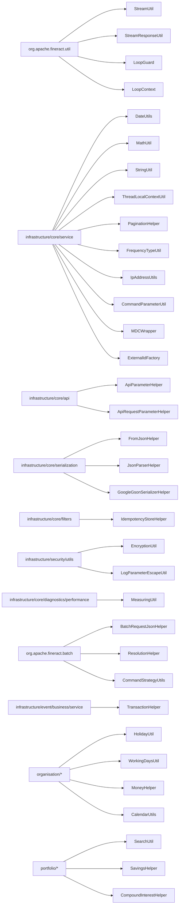

Apache Fineract's `fineract-core` is dotted with utility classes — date arithmetic helpers, null-safe math wrappers, JSON parsing, pagination, streaming responses, loop guards. They are conventionally named `*Util` or `*Helper`, live in a handful of packages (`org.apache.fineract.util` and `infrastructure/core/service`, `serialization`, `api`), and are imported pervasively. This page is a reference: what each one exists for, where it lives, and the typical call.

## Where utilities live



## `org.apache.fineract.util` package

A small, deliberately-generic package — anything that has no domain dependency.

### `StreamUtil`

```java fineract-core/.../util/StreamUtil.java
public final class StreamUtil {

    public static <A, B> Collector<A, ?, B> foldLeft(final B init,
            final BiFunction<? super B, ? super A, ? extends B> f) { /* ... */ }

    public static <K, V> Collector<Map<K, List<V>>, ?, Map<K, List<V>>> mergeMapsOfLists() {
        return Collectors.collectingAndThen(
            Collectors.flatMapping((Map<K, List<V>> m) -> m.entrySet().stream(),
                Collectors.toMap(Map.Entry::getKey, Map.Entry::getValue,
                    (list1, list2) -> {
                        List<V> merged = new ArrayList<>(list1);
                        merged.addAll(list2);
                        return merged;
                    })),
            HashMap::new
        );
    }
}
```

Two collectors for stream pipelines:

- `foldLeft(init, f)` — left-fold over a stream into a single value.
- `mergeMapsOfLists()` — merge a stream of `Map<K, List<V>>` into one map where colliding keys have their lists concatenated.

### `StreamResponseUtil`

Builds JAX-RS `Response` objects for streamed downloads — typically used by document/image download endpoints:

```java fineract-core/.../util/StreamResponseUtil.java
public final class StreamResponseUtil {

    public static String DISPOSITION_TYPE_ATTACHMENT = "attachment";
    public static String DISPOSITION_TYPE_INLINE = "inline";

    public static Response ok(final StreamResponseData content) {
        final var stream = new StreamingOutput() {
            @Override
            public void write(OutputStream out) throws IOException {
                IOUtils.copy(content.getStream(), out);
            }
        };
        if (StringUtils.isEmpty(content.getDispositionType())) {
            return Response.ok(stream, content.getType()).build();
        } else {
            return Response.ok(stream, content.getType())
                .header(HttpHeaders.CONTENT_DISPOSITION,
                    String.format("%s; filename=\"%s\"",
                        content.getDispositionType(), content.getFileName()))
                .build();
        }
    }

    public static Future<?> ok(final AsyncResponse asyncResponse,
                               final StreamResponseData content) { /* async variant */ }

    @Builder @Data @NoArgsConstructor @AllArgsConstructor
    public static final class StreamResponseData {
        private InputStream stream;
        private String type;
        private String fileName;
        private String dispositionType;
        private Long size;
    }
}
```

Two convenience signatures (sync + async) and a builder data class for the response payload.

### `LoopGuard`

```java fineract-core/.../util/LoopGuard.java
/**
 * Loop Guard is a utility solution to avoid endless loops
 *
 * Example: LoopGuard.runSafeDoWhileLoop(500, () -> { // loop body }, () -> conditions() );
 */
public final class LoopGuard {

    public interface LoopBody<T extends LoopContext> {
        void execute(T context);
    }

    public static <T extends LoopContext> void runSafeDoWhileLoop(int maxIterations, T context,
            Predicate<T> condition, LoopBody<T> body) {
        int count = 0;
        do {
            if (++count > maxIterations) {
                throw new IllegalStateException(
                    "Loop exceeded " + maxIterations + " iterations. Possible infinite loop.");
            }
            body.execute(context);
        } while (condition.test(context));
    }

    public static <T extends LoopContext> void runSafeWhileLoop(int maxIterations, T context,
            Predicate<T> condition, LoopBody<T> body) { /* ... */ }
}
```

Defensive iteration helpers used by loan-schedule generation and interest math — anywhere a `while` could plausibly run forever in an edge case.

### `LoopContext`

```java fineract-core/.../util/LoopContext.java
public interface LoopContext {}
```

Marker interface that callers extend with their per-iteration state.

## Date and time

### `DateUtils`

`infrastructure/core/service/DateUtils.java` — the canonical date helper:

```java fineract-core/.../core/service/DateUtils.java
public static final String DEFAULT_DATE_FORMAT = "yyyy-MM-dd";
public static final String DEFAULT_DATETIME_FORMAT = DEFAULT_DATE_FORMAT + " HH:mm:ss";
public static final DateTimeFormatter DEFAULT_DATE_FORMATTER = DateTimeFormatter.ofPattern(DEFAULT_DATE_FORMAT);
public static final DateTimeFormatter DEFAULT_DATETIME_FORMATTER = DateTimeFormatter.ofPattern(DEFAULT_DATETIME_FORMAT);

public static ZoneId getSystemZoneId() { return ZoneId.systemDefault(); }
public static ZoneId getDateTimeZoneOfTenant() { /* tenant.timezoneId */ }
public static LocalDate getLocalDateOfTenant() { /* now in tenant zone */ }
public static LocalDateTime getLocalDateTimeOfTenant() { /* ... */ }
public static OffsetDateTime getOffsetDateTimeOfTenant() { /* ... */ }
public static OffsetDateTime getOffsetDateTimeOfTenantFromLocalDate(LocalDate) { /* ... */ }
public static LocalDateTime getLocalDateTimeOfSystem() { /* ... */ }
```

Also provides:

- `getBusinessLocalDate()` — the *correct* "today" honouring `ENABLE_BUSINESS_DATE` (see [Business Date](/core/business-date)).
- `getBusinessLocalDateTime()` — combined with the tenant zone.
- A library of parsers and comparators.

<Tip>
The rule of thumb: **never** call `LocalDate.now()` in business code. Always go through `DateUtils.getBusinessLocalDate()`.
</Tip>

### `FrequencyTypeUtil`

Translations between period units used by loan/savings schedules — days ↔ weeks ↔ months ↔ years, mapped to the internal `PeriodFrequencyType` enum.

## Numeric helpers

### `MathUtil`

```java fineract-core/.../core/service/MathUtil.java
public static <E extends Number> E nullToDefault(E value, E def) {
    return value == null ? def : value;
}

public static Long nullToZero(Long value)        { return nullToDefault(value, 0L); }
public static Integer nullToZero(Integer value)  { return nullToDefault(value, 0); }
public static Long zeroToNull(Long value)        { return isEmpty(value) ? null : value; }

/** @return parameter value or ZERO if it is negative */
public static Long negativeToZero(Long value)    { return isGreaterThanZero(value) ? value : 0L; }

public static boolean isEmpty(Long value)            { return value == null || value.equals(0L); }
public static boolean isGreaterThanZero(Long value)  { return value != null && value > 0L; }
public static boolean isLessThanZero(Long value)     { return value != null && value < 0L; }
public static boolean isZero(Long value)             { return value != null && value.equals(0L); }
```

Comprehensive overloads cover `Long`, `Integer`, `BigDecimal`, `Money`. Null-safe arithmetic is critical because loan/charge fields are nullable in JPA — direct `a.add(b)` invites NPE.

### `MoneyHelper`

`organisation/monetary/domain/MoneyHelper.java` — the canonical rounding helper. Reads the `rounding-mode` global config flag (`HALF_EVEN`, `HALF_UP`, `DOWN`, …) at startup via `MoneyHelperInitializationService` (see [Configuration](/core/configuration-and-global-config)) and exposes it as the default `MathContext` for all `Money` arithmetic.

### `CompoundInterestHelper`

`portfolio/savings/domain/interest/CompoundInterestHelper.java` — closed-form compound interest computations used by savings posting.

### `SavingsHelper`

`portfolio/savings/domain/SavingsHelper.java` — period-start/period-end computations for the savings interest posting cycle.

## Threading and request context

### `ThreadLocalContextUtil`

```java fineract-core/.../core/service/ThreadLocalContextUtil.java (excerpt)
public final class ThreadLocalContextUtil {

    public static final String CONTEXT_TENANTS = "tenants";
    private static final ThreadLocal<String> contextHolder = new ThreadLocal<>();
    private static final ThreadLocal<FineractPlatformTenant> tenantContext = new ThreadLocal<>();
    private static final ThreadLocal<String> authTokenContext = new ThreadLocal<>();
    private static final ThreadLocal<HashMap<BusinessDateType, LocalDate>> businessDateContext = new ThreadLocal<>();
    private static final ThreadLocal<ActionContext> actionContext = new ThreadLocal<>();

    public static FineractPlatformTenant getTenant() { return tenantContext.get(); }
    public static void setTenant(FineractPlatformTenant tenant) { tenantContext.set(tenant); }
    // ...
}
```

Holds five thread-local slots:

| Slot | Lifetime |
| --- | --- |
| `contextHolder` (data source) | Set by the routing datasource per query. |
| `tenantContext` | Set by the tenant filter on entry, cleared on exit. |
| `authTokenContext` | The raw JWT / basic token — used by hooks for downstream calls. |
| `businessDateContext` | Map of `BusinessDateType` → `LocalDate` loaded from `m_business_date`. |
| `actionContext` | `NORMAL` for API threads, `COB` for COB worker threads. Controls which business date is "today". |

Every entry point — Servlet filters, Quartz job dispatchers, Spring Batch worker interceptors, Batch API sub-request handlers — pushes a context and clears it on completion.

### `MDCWrapper`

Pushes the same identifiers into SLF4J MDC keys so structured logs carry `tenantId`, `correlationId`, `businessDate`.

### `MeasuringUtil`

Lives in `infrastructure/core/diagnostics/performance/`. A `try-with-resources` timing wrapper logged at INFO when the `diagnostics` profile is on.

## Pagination

### `PaginationHelper`

`infrastructure/core/service/PaginationHelper.java` — builds the SQL `LIMIT ?,?` (or `OFFSET ? FETCH ?`) clauses from a `SearchParameters` and assembles a `Page<T>` from a JDBC `ResultSet`. The total-count query is optional (controlled by `isLazy()` on `SearchParameters`).

### `Page<T>`, `PagedRequest<T>`, `PagedLocalRequest<T>`

Lightweight DTOs:

- `Page<T>` — `{ totalFilteredRecords, pageItems: List<T> }`.
- `PagedRequest<T>` — request envelope `{ request: T, pagedParameters }` for write-side pageable endpoints.
- `PagedLocalRequest<T>` — variant carrying locale/date format for parsing.

### `SearchParameters`

Carrier for offset, limit, orderBy, sortOrder, search text, status, accountNumber and a handful of domain-scoped filters. Built by the API resource from `?` query parameters.

## JSON helpers

### `FromJsonHelper`

The de-facto JSON parser:

- `parse(String json) → JsonElement`
- `extractStringNamed(name, element)` / `extractIntegerNamed(...)` / `extractBigDecimalNamed(...)` / `extractLocalDateNamed(...)` / etc.
- `parameterExists(name, element)` — boolean presence check.
- `checkForUnsupportedParameters(JsonElement, Set<String> supported)` — throws `UnsupportedParameterException` if anything outside the supported set was sent.

### `JsonParserHelper`

Lower-level helpers used by `FromJsonHelper`. Handles locale-aware number parsing, date parsing against a supplied `dateFormat`/`locale` pair, and the array-of-strings parsing used for permissions lists.

### `GoogleGsonSerializerHelper`

Builds the canonical `Gson` instance with all type adapters (LocalDate, LocalDateTime, OffsetDateTime, MonthDay, ExternalId, etc.) registered. Use this instead of `new Gson()` if you need a Gson at runtime.

## API helpers

### `ApiParameterHelper`

Static helpers asking *yes/no* questions about a parsed JSON `JsonObject` — used by `FromApiJsonDeserializer` subclasses.

### `ApiRequestParameterHelper`

Parses the common query parameters: `pretty`, `template`, `genericResultSet`, `fields`. Yields an `ApiRequestJsonSerializationSettings` consumed by `DefaultToApiJsonSerializer`.

## Misc service-layer helpers

### `CommandParameterUtil`

Typed extraction of values from `Map<String, Object>` command payloads.

### `StringUtil`

Small null-safe string helpers — `defaultIfEmpty`, `isNotBlankAndNotZero`, etc.

### `ExternalIdFactory`

Generates `ExternalId` UUIDs honouring the `enable-auto-generated-external-id` global flag.

### `IpAddressUtils`

```java fineract-core/.../core/service/IpAddressUtils.java
```

Extracts the client IP from `HttpServletRequest`, respecting `X-Forwarded-For` and `X-Real-IP` headers when behind a load balancer.

## Filters & idempotency

### `IdempotencyStoreHelper`

Lives at `infrastructure/core/filters/IdempotencyStoreHelper.java`. Helpers used by `IdempotencyStoreFilter` / `IdempotencyStoreBatchFilter` to read/write the `m_idempotent_command_processed` table — keyed by the `Idempotency-Key` request header.

## Security helpers

### `EncryptionUtil` and `LogParameterEscapeUtil`

Both at `infrastructure/security/utils/`. Covered in [Security Primitives](/core/security-primitives):

- `EncryptionUtil` — AES helpers used by `PasswordEncryptor` and the `c_external_service` secret storage.
- `LogParameterEscapeUtil` — sanitises user input before it lands in log lines (defends against log forging).

## Batch API helpers

### `BatchRequestJsonHelper`

`org.apache.fineract.batch.serialization.BatchRequestJsonHelper` — parses the Batch API request body (array of `BatchRequest`).

### `ResolutionHelper`

`org.apache.fineract.batch.service.ResolutionHelper` — resolves `${} placeholders` inside child batch requests against the parent's `BatchResponse`s (used to chain "create client → create loan for that client").

### `CommandStrategyUtils`

Per-strategy helpers shared by `CommandStrategy` implementations in the Batch API command dispatch chain.

## Event helpers

### `TransactionHelper`

`infrastructure/event/business/service/TransactionHelper.java` — used by business-event publishers to bind event emission to the after-commit phase of the active transaction. Wraps the `TransactionLifecycleCallback` registration so domain code doesn't have to.

## Calendar / holidays / working days

### `HolidayUtil`

`organisation/holiday/service/HolidayUtil.java` — given a date and the holiday set, computes the next non-holiday business date used by `RESCHEDULE_REPAYMENTS_ON_HOLIDAYS`.

### `WorkingDaysUtil`

`organisation/workingdays/service/WorkingDaysUtil.java` — checks whether a date is a configured working day and shifts to the next one if not.

### `CalendarUtils`

`portfolio/calendar/service/CalendarUtils.java` — recurrence rule (RFC 5545 RRULE) helpers used by loan schedules, group meetings, and savings statements. Most-used method is `getRecurringDates(LocalDate seed, LocalDate from, LocalDate to, String recurrence)`.

## Search

### `SearchUtil`

`portfolio/search/service/SearchUtil.java` — helpers for the advanced-query feature used by datatables (see [Data Queries](/core/data-queries-and-datatables)) and global search.

## Class index

<CardGroup cols={2}>
  <Card title="util/StreamUtil" icon="diagram-project">
    `foldLeft`, `mergeMapsOfLists` stream collectors.
  </Card>
  <Card title="util/StreamResponseUtil" icon="download">
    JAX-RS streaming download responses (sync + async).
  </Card>
  <Card title="util/LoopGuard + LoopContext" icon="shield">
    Defensive `while` / `do-while` wrappers.
  </Card>
  <Card title="service/DateUtils" icon="calendar">
    Canonical date helpers — `getBusinessLocalDate()` and friends.
  </Card>
  <Card title="service/MathUtil" icon="calculator">
    Null-safe BigDecimal / Long / Integer math.
  </Card>
  <Card title="service/ThreadLocalContextUtil" icon="layer-group">
    Tenant + business date + action context slots.
  </Card>
  <Card title="service/MDCWrapper" icon="terminal">
    SLF4J MDC propagation.
  </Card>
  <Card title="service/PaginationHelper" icon="list-ol">
    JDBC paging + `Page<T>` assembly.
  </Card>
  <Card title="service/FrequencyTypeUtil" icon="repeat">
    Period unit conversions.
  </Card>
  <Card title="service/IpAddressUtils" icon="globe">
    Caller IP extraction.
  </Card>
  <Card title="service/StringUtil" icon="font">
    Null-safe string helpers.
  </Card>
  <Card title="service/ExternalIdFactory" icon="fingerprint">
    Generates auto external ids.
  </Card>
  <Card title="service/CommandParameterUtil" icon="terminal">
    Typed Map&lt;String,Object&gt; extractors.
  </Card>
  <Card title="serialization/FromJsonHelper" icon="brackets-curly">
    Canonical JSON parser + `checkForUnsupportedParameters`.
  </Card>
  <Card title="serialization/JsonParserHelper" icon="brackets-curly">
    Locale/dateFormat-aware parsing.
  </Card>
  <Card title="serialization/GoogleGsonSerializerHelper" icon="gear">
    Canonical Gson builder.
  </Card>
  <Card title="api/ApiParameterHelper" icon="circle-question">
    Presence/yes-no helpers on parsed bodies.
  </Card>
  <Card title="api/ApiRequestParameterHelper" icon="filter">
    Parses `pretty`/`template`/`fields` query params.
  </Card>
  <Card title="filters/IdempotencyStoreHelper" icon="rotate">
    Idempotency-key store reads/writes.
  </Card>
  <Card title="diagnostics/performance/MeasuringUtil" icon="stopwatch">
    Timing helper for diagnostics profile.
  </Card>
  <Card title="event/business/service/TransactionHelper" icon="bell">
    After-commit event emission glue.
  </Card>
  <Card title="batch/serialization/BatchRequestJsonHelper" icon="brackets-curly">
    Parses Batch API bodies.
  </Card>
  <Card title="batch/service/ResolutionHelper" icon="link">
    Resolves `${reference}` placeholders in Batch child requests.
  </Card>
  <Card title="batch/command/CommandStrategyUtils" icon="branch">
    Shared helpers across `CommandStrategy` impls.
  </Card>
  <Card title="organisation/monetary/MoneyHelper" icon="coins">
    Rounding mode + Money math.
  </Card>
  <Card title="organisation/holiday/HolidayUtil" icon="umbrella-beach">
    Holiday shifting for schedules.
  </Card>
  <Card title="organisation/workingdays/WorkingDaysUtil" icon="calendar-days">
    Working-day-aware date shifting.
  </Card>
  <Card title="portfolio/calendar/CalendarUtils" icon="calendar">
    RRULE-based recurrence helpers.
  </Card>
  <Card title="portfolio/savings/SavingsHelper" icon="piggy-bank">
    Savings period-end computations.
  </Card>
  <Card title="portfolio/savings/interest/CompoundInterestHelper" icon="percent">
    Compound interest math.
  </Card>
  <Card title="portfolio/search/SearchUtil" icon="magnifying-glass">
    Advanced query / global search helpers.
  </Card>
  <Card title="security/utils/EncryptionUtil" icon="lock">
    AES helpers.
  </Card>
  <Card title="security/utils/LogParameterEscapeUtil" icon="terminal">
    Log-forging defence.
  </Card>
</CardGroup>

## Conventions to know

<Steps>
  <Step title="Names tell you the intent">
    `*Util` = static helper class (private constructor). `*Helper` = component that may have state or Spring dependencies. `*Factory` = something that constructs domain objects.
  </Step>
  <Step title="Static methods only on Util">
    `Util` classes have `private` constructors and only `public static` methods — they're stateless. `Helper` classes are typically Spring beans (`@Component`).
  </Step>
  <Step title="Date helpers belong in DateUtils">
    Never reimplement date arithmetic in a service. Extend `DateUtils` instead so the business-date and timezone behaviour stays centralised.
  </Step>
  <Step title="Use the canonical Gson">
    For ad-hoc JSON, get the `Gson` from `GoogleGsonSerializerHelper` (or inject the existing one). Hand-rolling a `Gson` skips date adapters and `ExternalId` handling.
  </Step>
  <Step title="Null-safe math">
    Most domain field types are nullable (`BigDecimal`, `Long`). Use `MathUtil.nullToZero(...)` or the typed equivalents before arithmetic.
  </Step>
</Steps>

<Note>
Helpers that touch *domain* concepts (loan, savings, journal entry) live next to their domain code, not in `util/`. The `util/` package is reserved for things with no domain dependency — currently just streams, loop guards and response streaming.
</Note>

## Continue with

- [Infrastructure Core](/core/infrastructure-core) — deeper context on `JsonCommand`, `DataValidatorBuilder`, `Page<T>`.
- [Business Date](/core/business-date) — how `DateUtils.getBusinessLocalDate()` is fed.
- [Security Primitives](/core/security-primitives) — `EncryptionUtil`, `LogParameterEscapeUtil`.
