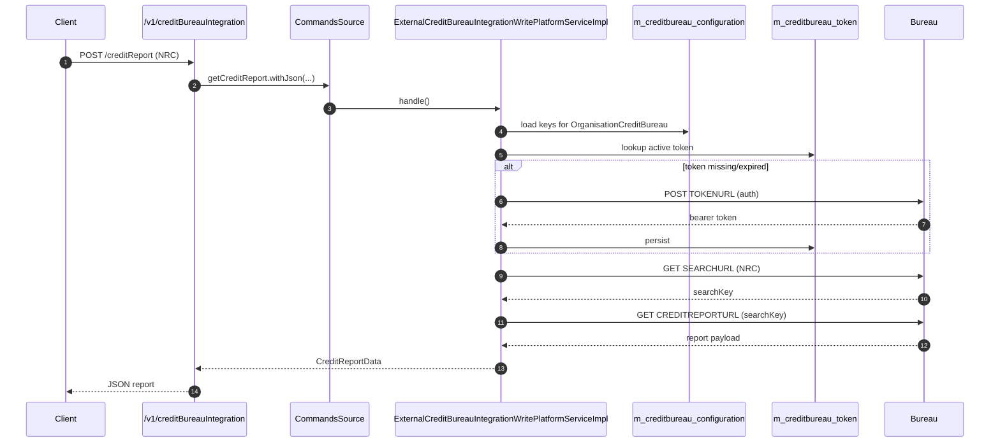

Apache Fineract exposes the credit‑bureau (CB) subsystem through two JAX‑RS resources under `fineract-provider/src/main/java/org/apache/fineract/infrastructure/creditbureau/api/`. The first, `CreditBureauConfigurationApiResource` at `/v1/CreditBureauConfiguration`, is the administrative surface — you list installed bureaus, enable them per tenant (an `OrganisationCreditBureau`), bind loan products, and write the per‑bureau key/value configuration. The second, `CreditBureauIntegrationApiResource` at `/v1/creditBureauIntegration`, is the runtime surface — fetch a fresh report, upload a batch file, persist a fetched report, list cached reports, or delete one. Both resources push state changes through `PortfolioCommandSourceWritePlatformService` so every operation is auditable and maker‑checker compatible.

For background on the entities and where bureau credentials live, see the [Credit Bureau Overview](/creditbureau/overview).

## At a glance

```mermaid
flowchart LR
    subgraph CFG ["/v1/CreditBureauConfiguration"]
      A1[GET bureaus] --> A2[PUT organisationCreditBureau<br/>enable + alias]
      A2 --> A3[POST configuration/&#123;id&#125;<br/>SUBSCRIPTIONID, PASSWORD, URLs]
      A3 --> A4[POST mappings/&#123;orgId&#125;<br/>bind LoanProduct]
    end
    subgraph INT ["/v1/creditBureauIntegration"]
      B1[POST creditReport<br/>fetch by NRC]
      B2[POST saveCreditReport]
      B3[GET creditReport/&#123;bureauId&#125;]
      B4[DELETE deleteCreditReport]
      B5[POST addCreditReport<br/>multipart upload]
    end
    A4 --> B1
```



## Resource 1 — `/v1/CreditBureauConfiguration`

Source: `infrastructure/creditbureau/api/CreditBureauConfigurationApiResource.java`. All endpoints require the `CreditBureau` permission (`RESOURCE_NAME_FOR_PERMISSIONS = "CreditBureau"`):

```java
@Path("/v1/CreditBureauConfiguration")
@Tag(name = "Credit Bureau Configuration", description = "")
public class CreditBureauConfigurationApiResource {
    private static final String RESOURCE_NAME_FOR_PERMISSIONS = "CreditBureau";
    // ...
}
```

### Read endpoints

| Method | Path | Purpose | Service |
|---|---|---|---|
| `GET` | `/v1/CreditBureauConfiguration` | List `CreditBureau` catalogue rows. | `CreditBureauReadPlatformService.retrieveCreditBureau()` |
| `GET` | `/v1/CreditBureauConfiguration/mappings` | List all loan‑product mappings. | `CreditBureauLoanProductMappingReadPlatformService.readCreditBureauLoanProductMapping()` |
| `GET` | `/v1/CreditBureauConfiguration/organisationCreditBureau` | List tenant‑enabled bureaus. | `OrganisationCreditBureauReadPlatformService.retrieveOrgCreditBureau()` |
| `GET` | `/v1/CreditBureauConfiguration/config/{organisationCreditBureauId}` | Fetch the key/value `CreditBureauConfiguration` rows for one tenant‑enabled bureau. | `CreditBureauReadConfigurationService.readConfigurationByOrganisationCreditBureauId(...)` |
| `GET` | `/v1/CreditBureauConfiguration/loanProduct` | List loan products with their bureau mapping (or no mapping). | `CreditBureauLoanProductMappingReadPlatformService.fetchLoanProducts()` |
| `GET` | `/v1/CreditBureauConfiguration/loanProduct/{loanProductId}` | Read the single mapping for one product. | `readMappingByLoanId(loanProductId)` |

Response data parameters are bounded by:

```java
private static final Set<String> RESPONSE_DATA_PARAMETERS = new HashSet<>(
        Arrays.asList("creditBureauId", "alias", "country",
                      "creditBureauProductId", "startDate", "endDate", "isActive"));
```

### Write endpoints

All writes flow through `CommandWrapperBuilder` so the orchestrator at `commandsSourceWritePlatformService.logCommandSource(...)` records the operation, applies maker‑checker if configured, and dispatches to the matching command handler.

| Method | Path | Command builder | Use |
|---|---|---|---|
| `PUT` | `/organisationCreditBureau` | `updateCreditBureau()` | Toggle `isActive`, change `alias`, etc. |
| `POST` | `/organisationCreditBureau/{organisationCreditBureauId}` | `addOrganisationCreditBureau(id)` | Enable a `CreditBureau` for the current tenant. |
| `POST` | `/configuration/{creditBureauId}` | `addCreditBureauConfiguration(creditBureauId)` | Insert one `m_creditbureau_configuration` row (one key/value at a time). |
| `PUT` | `/configuration/{configurationId}` | `updateCreditBureauConfiguration(configurationId)` | Change a single configuration value. |
| `POST` | `/mappings/{organisationCreditBureauId}` | `createCreditBureauLoanProductMapping(orgId)` | Bind a loan product. |
| `PUT` | `/mappings` | `updateCreditBureauLoanProductMapping()` | Adjust a mapping (flags, stale period, active). |

#### Example: enable a bureau for the tenant

```http
POST /fineract-provider/api/v1/CreditBureauConfiguration/organisationCreditBureau/1
Content-Type: application/json

{
  "creditBureauId": 1,
  "alias": "ThitsaWorks",
  "isActive": true
}
```

#### Example: write a configuration value

The `creditBureauId` path segment refers to the **OrganisationCreditBureau** id (the tenant‑specific enabling row). The body uses the keys from `CreditBureauConfigurations`:

```http
POST /fineract-provider/api/v1/CreditBureauConfiguration/configuration/1
Content-Type: application/json

{
  "configkey": "SUBSCRIPTIONKEY",
  "value": "5a73d0...redacted",
  "description": "Production subscription key"
}
```

Repeat with `configkey` values from:

```java
public enum CreditBureauConfigurations {
    THITSAWORKS,
    SUBSCRIPTIONID,
    SUBSCRIPTIONKEY,
    USERNAME,
    PASSWORD,
    TOKENURL,
    SEARCHURL,
    CREDITREPORTURL;
}
```

#### Example: bind a loan product

```http
POST /fineract-provider/api/v1/CreditBureauConfiguration/mappings/1
Content-Type: application/json

{
  "loanProductId": 7,
  "isCreditcheckMandatory": true,
  "skipCreditcheckInFailure": false,
  "stalePeriod": 30,
  "isActive": true
}
```

(Watch the case: the deserialiser keys are `isCreditcheckMandatory` and `skipCreditcheckInFailure` — lower‑case `c` in `check`. See `CreditBureauLoanProductCommandFromApiJsonDeserializer`.)

After this, every loan submitted under product 7 will pull a report — falling back to a cached one in `m_creditreport` if a saved row for the same NRC is younger than 30 days.

## Resource 2 — `/v1/creditBureauIntegration`

Source: `infrastructure/creditbureau/api/CreditBureauIntegrationApiResource.java`.

```java
@Path("/v1/creditBureauIntegration")
@Tag(name = "Credit Bureau Integration", description = "")
public class CreditBureauIntegrationApiResource {
    private static final Set<String> RESPONSE_DATA_PARAMETERS = new HashSet<>(
            Arrays.asList("id", "creditBureauId", "nrc", "creditReport"));
    // ...
}
```

### Endpoint summary

| Method | Path | What it does | Source |
|---|---|---|---|
| `POST` | `/creditReport` | Live fetch from the bureau using credentials from the configuration table. | `commandsSourceWritePlatformService.logCommandSource(getCreditReport().withJson(...))` |
| `POST` | `/addCreditReport` (multipart) | Upload a loan-file to the bureau. | `creditReportWritePlatformService.addCreditReport(creditBureauId, file, fileDetail)` |
| `POST` | `/saveCreditReport?creditBureauId=&nationalId=` | Persist a fetched report into `m_creditreport`. | `saveCreditReport(creditBureauId, nationalId)` command |
| `GET` | `/creditReport/{creditBureauId}` | List cached reports for a bureau. | `creditReportReadPlatformService.retrieveCreditReportDetails(creditBureauId)` |
| `DELETE` | `/deleteCreditReport/{creditBureauId}` | Remove a cached report. | `deleteCreditReport(creditBureauId)` command |

### Fetching a report

The fetch endpoint accepts arbitrary parameters because each bureau needs a different lookup payload (national ID, passport, search code, …):

```java
@POST
@Path("creditReport")
public String fetchCreditReport(@Context final UriInfo uriInfo,
        @RequestParam("params") final Map<String, Object> params) {
    Gson gson = new Gson();
    final String json = gson.toJson(params);
    final CommandWrapper commandRequest = new CommandWrapperBuilder()
            .getCreditReport().withJson(json).build();
    final CommandProcessingResult result =
            this.commandsSourceWritePlatformService.logCommandSource(commandRequest);
    return this.toCreditReportApiJsonSerializer.serialize(result);
}
```

Typical request body for the bundled ThitsaWorks adapter:

```http
POST /fineract-provider/api/v1/creditBureauIntegration/creditReport
Content-Type: application/json

{
  "creditBureauID": "1",
  "NRC": "12/MaBaTa(N)123456",
  "process": "NEWLOAN"
}
```

The command dispatches to `ExternalCreditBureauIntegrationWritePlatformServiceImpl`, which:

1. Looks up the active `OrganisationCreditBureau` for the supplied `creditBureauID`.
2. Loads `SUBSCRIPTIONID`, `SUBSCRIPTIONKEY`, `USERNAME`, `PASSWORD`, `TOKENURL`, `SEARCHURL`, and `CREDITREPORTURL` from `m_creditbureau_configuration`.
3. Obtains (or reuses) a `CreditBureauToken` from `m_creditbureau_token` by calling `TOKENURL`.
4. Calls `SEARCHURL` with the NRC to obtain a unique search key, then `CREDITREPORTURL` to download the report.
5. Returns the bureau's payload as a `CreditReportData` JSON blob.



### Saving a report

The saving step is a deliberate second call. The client receives the live report, decides whether to retain it, and posts back:

```http
POST /fineract-provider/api/v1/creditBureauIntegration/saveCreditReport?creditBureauId=1&nationalId=12/MaBaTa(N)123456
Content-Type: application/json

{ ...the JSON returned by the previous fetch... }
```

Internally:

```java
@POST
@Path("saveCreditReport")
public String saveCreditReport(final String apiRequestBodyAsJson,
        @QueryParam("creditBureauId") final Long creditBureauId,
        @QueryParam("nationalId") final String nationalId) {
    final CommandWrapper commandRequest = new CommandWrapperBuilder()
            .saveCreditReport(creditBureauId, nationalId)
            .withJson(apiRequestBodyAsJson)
            .build();
    final CommandProcessingResult result =
            this.commandsSourceWritePlatformService.logCommandSource(commandRequest);
    return this.toCreditReportApiJsonSerializer.serialize(result);
}
```

The handler writes a row into `m_creditreport` (entity: `infrastructure/creditbureau/domain/CreditReport.java`). Subsequent fetches within the loan‑product's `stale_period` short‑circuit to this cache.

### Listing & deleting cached reports

```java
@GET
@Path("creditReport/{creditBureauId}")
public String getSavedCreditReport(@PathParam("creditBureauId") final Long creditBureauId,
        @Context final UriInfo uriInfo) {
    this.context.authenticatedUser();
    final Collection<CreditReportData> creditReport =
            this.creditReportReadPlatformService.retrieveCreditReportDetails(creditBureauId);
    // ...
}

@DELETE
@Path("deleteCreditReport/{creditBureauId}")
public String deleteCreditReport(@PathParam("creditBureauId") final Long creditBureauId,
        final String apiRequestBodyAsJson) {
    final CommandWrapper commandRequest = new CommandWrapperBuilder()
            .deleteCreditReport(creditBureauId)
            .withJson(apiRequestBodyAsJson)
            .build();
    // ...
}
```

The `DELETE` is body‑bearing so the client can pass the `id` (PK in `m_creditreport`) inside the JSON payload.

### Uploading a loan‑file (regulatory reporting)

```java
@POST
@Path("addCreditReport")
@Consumes(MediaType.MULTIPART_FORM_DATA)
public String addCreditReport(@FormDataParam("file") final File creditReport,
        @FormDataParam("file") InputStream uploadedInputStream,
        @FormDataParam("file") final UriInfo uriInfo,
        @FormDataParam("file") FormDataContentDisposition fileDetail,
        @QueryParam("creditBureauId") final Long creditBureauId) {
    final String responseMessage = this.creditReportWritePlatformService
            .addCreditReport(creditBureauId, creditReport, fileDetail);
    return this.toCreditReportApiJsonSerializer.serialize(responseMessage);
}
```

Use this for jurisdictions (e.g. the ThitsaWorks/Myanmar pipeline) where lenders must periodically submit their loan book to the bureau. The actual upload protocol is implementation‑specific and lives in `ExternalCreditBureauIntegrationWritePlatformServiceImpl`.

## End‑to‑end workflow

```mermaid
flowchart TD
    A[Install / discover<br/>m_creditbureau row] --> B[POST organisationCreditBureau/&#123;id&#125;<br/>enable for tenant]
    B --> C[POST configuration/&#123;orgId&#125;<br/>x N configkeys]
    C --> D[POST mappings/&#123;orgId&#125;<br/>bind loan product]
    D --> E[Loan origination triggers<br/>POST creditReport]
    E --> F{Cache fresh?}
    F -- yes --> G[Return cached CreditReportData]
    F -- no --> H[Adapter calls bureau]
    H --> I[Return CreditReportData]
    I --> J[Optional<br/>POST saveCreditReport]
    G --> K[Decision engine consumes report]
    J --> K
```



## Wiring & command handlers

The `CommandWrapperBuilder` calls used above map to handler beans discovered through Fineract's `CommandSourceWritePlatformService`. The handlers in turn delegate to:

| Operation | Service implementation |
|---|---|
| `addOrganisationCreditBureau`, `updateCreditBureau` | `OrganisationCreditBureauWritePlatflormServiceImpl` |
| `addCreditBureauConfiguration`, `updateCreditBureauConfiguration` | `CreditBureauConfigurationWritePlatformServiceImpl` |
| `createCreditBureauLoanProductMapping`, `updateCreditBureauLoanProductMapping` | `CreditBureauLoanProductMappingWritePlatformServiceImpl` |
| `getCreditReport` | `ExternalCreditBureauIntegrationWritePlatformServiceImpl` |
| `saveCreditReport`, `deleteCreditReport` | `CreditReportWritePlatformServiceImpl` |

Read services live next to them with the matching `*ReadPlatformServiceImpl` suffix.

## Errors you may see

- **`CreditReportNotFoundException`** (`infrastructure/creditbureau/exception/CreditReportNotFoundException.java`) — thrown by `creditReportReadPlatformService` when no cached row exists for the requested key. The HTTP layer translates this to a 404 with `error.msg.creditReport.not.found`.
- **`PlatformDataIntegrityException`** when a configuration key is left blank for a required value (e.g. missing `TOKENURL`).
- **HTTP errors from the bureau** propagate as `PlatformDataIntegrityException` with the upstream status embedded in the message — check the adapter logs for the request URL.

## Operational tips

- Keep `SUBSCRIPTIONKEY`/`PASSWORD` blank in lower environments and use sandbox URLs in `TOKENURL`/`SEARCHURL`/`CREDITREPORTURL`. The same row layout works in every environment; only values change.
- Treat the `addCreditReport` upload as an asynchronous boundary: log the returned `responseMessage` and reconcile separately — Fineract does not retain a job-level status row beyond what the bureau returns synchronously.
- The DELETE path expects the body to carry the row id; if you call it without the JSON payload your command will silently no‑op.

## Related pages

- [Credit Bureau Overview](/creditbureau/overview) — entities, the per‑mapping flags, and where this sits in loan origination.
- [External services configuration & secrets](/external-services/configuration-and-secrets) — the unrelated `c_external_service_properties` flow used by S3/SMTP/SMS, *not* by bureaus.
