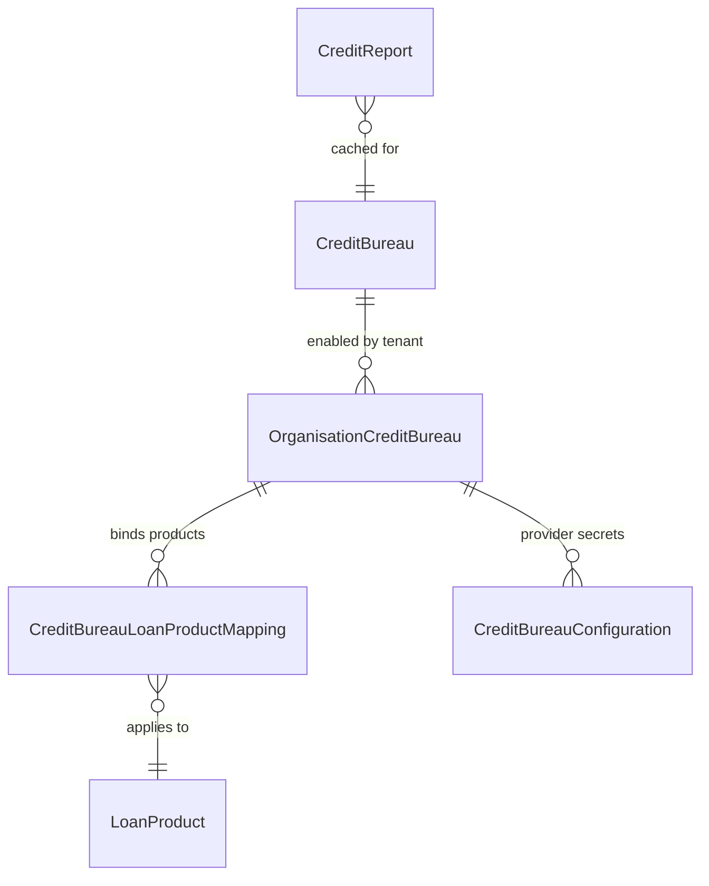
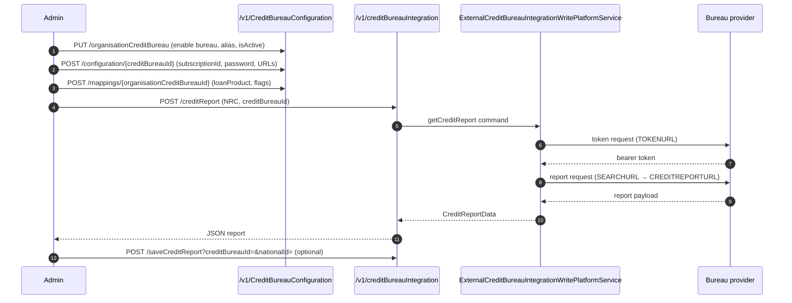
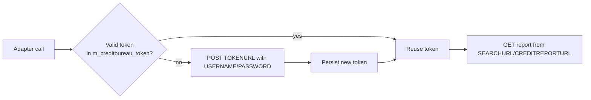

Apache Fineract ships a pluggable credit‑bureau (CB) subsystem under `fineract-provider/src/main/java/org/apache/fineract/infrastructure/creditbureau/`. It lets a tenant register one or more external bureau providers, bind each to a set of loan products, store provider‑specific credentials (subscription keys, OAuth endpoints, search URLs), and finally fetch — or upload — credit reports tied to a National Registration / National ID number (NRC). The package follows the same `api → data → domain → service` layout used elsewhere in Fineract: two JAX‑RS resources (`CreditBureauConfigurationApiResource`, `CreditBureauIntegrationApiResource`) sit on top of read/write services that work against four JPA entities (`CreditBureau`, `OrganisationCreditBureau`, `CreditBureauLoanProductMapping`, `CreditBureauConfiguration`) and a small `CreditReport` cache table.

This page is the orientation for the cluster. The companion page [Configuration & Integration API](/creditbureau/configuration-and-integration-api) walks the REST endpoints, JSON shapes, and command/handler flow that connect the domain model to an in‑market provider (ThitsaWorks is the bundled reference implementation).

## What credit‑bureau integration provides

<CardGroup cols={2}>
  <Card title="Pluggable providers" icon="plug">
    A `CreditBureau` row is the catalogue entry for a bureau implementation (e.g. ThitsaWorks Myanmar). The `implementation_key` column selects which adapter the write service routes to.
  </Card>
  <Card title="Per‑tenant aliasing" icon="building">
    An `OrganisationCreditBureau` row enables a global `CreditBureau` for the current tenant under a local alias and an `is_active` flag.
  </Card>
  <Card title="Loan‑product binding" icon="layer-group">
    `CreditBureauLoanProductMapping` ties a tenant‑enabled bureau to a `LoanProduct` and declares whether a credit check is mandatory, can be skipped on failure, and how long a cached report stays "fresh" (`stale_period`).
  </Card>
  <Card title="Encrypted configuration" icon="key">
    `CreditBureauConfiguration` rows hold provider keys (`SUBSCRIPTIONID`, `SUBSCRIPTIONKEY`, `USERNAME`, `PASSWORD`, `TOKENURL`, `SEARCHURL`, `CREDITREPORTURL`) — the values that actually authenticate calls to the bureau.
  </Card>
  <Card title="Report caching" icon="database">
    Fetched reports can be saved into `m_creditreport` so subsequent origination decisions in the stale window avoid a billable bureau call.
  </Card>
  <Card title="Upload path" icon="upload">
    A multipart `addCreditReport` endpoint accepts a file (typically a batch loan file) and pushes it to the bureau — useful for jurisdictions where lenders are obligated to share data back.
  </Card>
</CardGroup>

## The configuration model

The four entities form a 1‑to‑many ladder from the global catalogue down to per‑mapping configuration:



### `m_creditbureau` — the catalogue

Mapped by `infrastructure/creditbureau/domain/CreditBureau.java`:

```java
@Entity
@Table(name = "m_creditbureau")
public class CreditBureau extends AbstractPersistableCustom<Long> {
    private String name;
    private String product;
    private String country;
    @Column(name = "implementation_key")
    private String implementationKey;
    // ...
}
```

A row here is a *platform‑level* declaration that a particular bureau exists. The `implementationKey` is what the write service (`ExternalCreditBureauIntegrationWritePlatformServiceImpl`) reads to decide which adapter to call.

### `m_organisation_creditbureau` — tenant opt‑in

```java
@Entity
@Table(name = "m_organisation_creditbureau")
public class OrganisationCreditBureau extends AbstractPersistableCustom<Long> {
    private String alias;
    private CreditBureau creditbureau;
    @Column(name = "is_active")
    private boolean isActive;
    private List<CreditBureauLoanProductMapping> creditBureauLoanProductMapping;
    // ...
}
```

An `OrganisationCreditBureau` is the *enabling* record: until you create one of these, none of the configuration or mapping endpoints accept writes for that bureau. The `alias` is the tenant‑local nickname (e.g. "MyanmarCB" instead of the bureau's long official name).

### `m_creditbureau_loanproduct_mapping`

```java
@Entity
@Table(name = "m_creditbureau_loanproduct_mapping")
public class CreditBureauLoanProductMapping extends AbstractPersistableCustom<Long> {
    @Column(name = "is_credit_check_mandatory")
    private boolean creditCheckMandatory;
    @Column(name = "skip_credit_check_in_failure")
    private boolean skipCreditCheckInFailure;
    @Column(name = "stale_period")
    private int stalePeriod;
    @Column(name = "is_active")
    private boolean active;
    private OrganisationCreditBureau organisation_creditbureau;
    private LoanProduct loanProduct;
}
```

Two flags drive workflow behaviour during loan origination:

| Flag | Effect when `true` |
|---|---|
| `is_credit_check_mandatory` | Loan submission/approval fails if no report can be retrieved. |
| `skip_credit_check_in_failure` | If the bureau is unreachable, allow the workflow to continue without a report. |

`stale_period` is in days — when a saved report from `m_creditreport` is younger than this for a given NRC, it is served from cache.

### `m_creditbureau_configuration`

```java
@Entity
@Table(name = "m_creditbureau_configuration")
public class CreditBureauConfiguration extends AbstractPersistableCustom<Long> {
    @Column(name = "configkey")
    private String configurationKey;
    @Column(name = "value")
    private String value;
    @Column(name = "description")
    private String description;
    private OrganisationCreditBureau organisationCreditbureau;
}
```

These rows are simple key/value pairs scoped to a specific `OrganisationCreditBureau`. The known keys are enumerated in `infrastructure/creditbureau/data/CreditBureauConfigurations.java`:

```java
public enum CreditBureauConfigurations {
    THITSAWORKS,
    SUBSCRIPTIONID,
    SUBSCRIPTIONKEY,
    USERNAME,
    PASSWORD,
    TOKENURL,
    SEARCHURL,
    CREDITREPORTURL;
}
```

The `THITSAWORKS` literal acts as a marker for the bundled implementation; the rest are the credentials and endpoints the adapter needs to call out to the bureau.

## End‑to‑end flow



## Where things live

| Concern | File |
|---|---|
| Catalogue API | `infrastructure/creditbureau/api/CreditBureauConfigurationApiResource.java` |
| Fetch / upload / cache API | `infrastructure/creditbureau/api/CreditBureauIntegrationApiResource.java` |
| Entities | `infrastructure/creditbureau/domain/{CreditBureau,OrganisationCreditBureau,CreditBureauLoanProductMapping,CreditBureauConfiguration,CreditReport,CreditBureauToken}.java` |
| Provider adapter | `infrastructure/creditbureau/service/ExternalCreditBureauIntegrationWritePlatformServiceImpl.java` |
| Token cache | `infrastructure/creditbureau/domain/TokenRepository.java`, `CreditBureauToken.java` |
| Known config keys | `infrastructure/creditbureau/data/CreditBureauConfigurations.java` |
| Read services | `infrastructure/creditbureau/service/CreditBureauReadPlatformServiceImpl.java`, `OrganisationCreditBureauReadPlatformServiceImpl.java`, `CreditBureauLoanProductMappingReadPlatformServiceImpl.java` |
| Errors | `infrastructure/creditbureau/exception/CreditReportNotFoundException.java` |

## Token caching

`CreditBureauToken` (`m_creditbureau_token`) caches the OAuth bearer that the adapter obtains from the bureau's `TOKENURL`. The `TokenRepositoryWrapper` looks up the most recent valid token; if expired, a new one is requested and persisted. This means a burst of loan‑origination calls won't drown the bureau's auth endpoint.



## When you need this subsystem

You should enable a bureau when:

- Regulators require a credit‑check on every consumer loan.
- A bureau offers risk scoring you want to feed into origination rules.
- You're obligated to file periodic loan books to a national bureau (use `addCreditReport`).
- You want to deduplicate identity using national IDs (NRC) and surface prior delinquency.

When none of those apply, leave the tables empty — Fineract treats no `OrganisationCreditBureau` rows as "no bureau configured" and skips the integration entirely.

## Permissions

All endpoints in `CreditBureauConfigurationApiResource` validate against the `CreditBureau` resource permission. Operations dispatched through `PortfolioCommandSourceWritePlatformService` (e.g. `createCreditBureauConfiguration`, `updateCreditBureauLoanProductMapping`, `saveCreditReport`) go through Fineract's standard `m_permission` + maker‑checker layer, so you can require an approval before a configuration change goes live.

## Related pages

- [Credit Bureau Configuration & Integration API](/creditbureau/configuration-and-integration-api) — every endpoint, the JSON request/response shape, and how commands wire into the write services.
- [External services configuration & secrets](/external-services/configuration-and-secrets) — for non‑bureau external integrations (S3, SMTP, SMS gateway, push notifications). Bureau credentials live in their own tables and don't share the `c_external_service_properties` flow.
