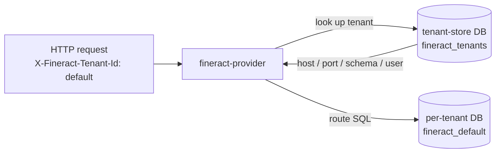
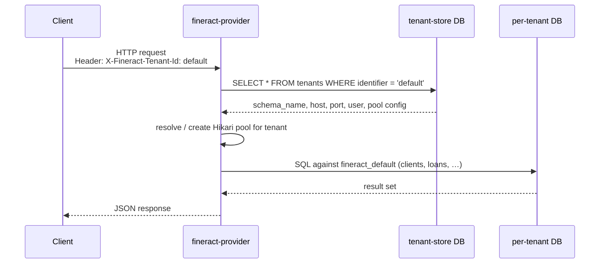
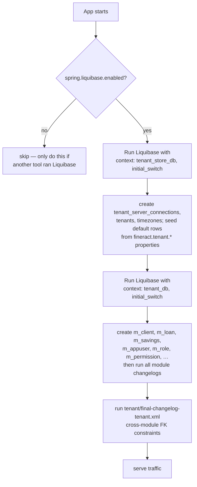

Apache Fineract is a multi-tenant core banking platform, and its **database layer** is built around two design choices that you have to understand before you touch a single SQL file: every tenant gets its **own physical schema** for business data, and **every schema is created and evolved by Liquibase changelogs** that ship inside the application JAR. The relational store underneath can be PostgreSQL, MariaDB, or MySQL — Fineract ships the JDBC drivers for all three and the changelogs are written to be dialect-aware.

This page is the map of the `database/` group of wiki pages. It explains the high-level picture; the sibling pages drill into the Liquibase changelogs, the tenant-store / per-tenant split, and the legacy SQL files that still live under `fineract-db/`.

## The dual-database model

Fineract runs against **two logically distinct databases**:

| Database | Role | Liquibase context | Default name |
| --- | --- | --- | --- |
| **tenant-store** | Catalog of tenants, their schemas, their JDBC connection settings, and timezone data | `tenant_store_db` | `fineract_tenants` |
| **per-tenant** | All business data for a single tenant (clients, loans, savings, journal entries, …) | `tenant_db` | `fineract_default` (for the bundled demo tenant) |

The tenant-store is consulted on every incoming request to resolve which per-tenant datasource to route the call to. The per-tenant database is where every business write actually lands.

Both databases are managed by the same Spring Boot process and the same Liquibase master changelog (`fineract-provider/src/main/resources/db/changelog/db.changelog-master.xml`) — Liquibase is just invoked twice with a different context.



## Supported database engines

Fineract is tested against three engines. The drivers are declared in `fineract-provider/build.gradle`:

```groovy fineract-provider/build.gradle
driver 'org.mariadb.jdbc:mariadb-java-client'
driver 'org.postgresql:postgresql'
driver 'com.mysql:mysql-connector-j'
```

At runtime the default driver is **MariaDB**, configured in `fineract-provider/src/main/resources/application.properties`:

```properties application.properties
spring.datasource.hikari.driverClassName=${FINERACT_HIKARI_DRIVER_SOURCE_CLASS_NAME:org.mariadb.jdbc.Driver}
spring.datasource.hikari.jdbcUrl=${FINERACT_HIKARI_JDBC_URL:jdbc:mariadb://localhost:3306/fineract_tenants}
```

Switching to PostgreSQL or MySQL is purely a matter of environment variables (`FINERACT_HIKARI_DRIVER_SOURCE_CLASS_NAME`, `FINERACT_HIKARI_JDBC_URL`, plus the tenant-side equivalents). The Liquibase changelogs use dialect-aware properties so the same XML works on all three engines.

### Dialect-aware properties

The master changelog declares context-scoped properties so the same XML can be applied to both MySQL/MariaDB and PostgreSQL:

```xml fineract-provider/src/main/resources/db/changelog/db.changelog-master.xml
<property name="current_date" value="CURDATE()" context="mysql"/>
<property name="current_date" value="CURRENT_DATE" context="postgresql"/>
<property name="current_datetime" value="NOW()"/>
<property name="uuid" value="uuid()" context="mysql"/>
<property name="uuid" value="uuid_generate_v4()" context="postgresql"/>
```

Liquibase substitutes the correct expression based on the active context, so changesets can reference `${current_date}` or `${uuid}` without caring about the engine.

## Liquibase, not Flyway

Earlier releases of Fineract / MifosX migrated schemas with **Flyway**. The current codebase has moved entirely to **Liquibase**. The transition is preserved as a one-time "initial switch" that bootstraps Liquibase's `DATABASECHANGELOG` table from the previous Flyway state:

```xml fineract-provider/src/main/resources/db/changelog/db.changelog-master.xml
<include file="tenant-store/initial-switch-changelog-tenant-store.xml"
         relativeToChangelogFile="true" context="tenant_store_db AND initial_switch"/>
<include file="tenant-store/changelog-tenant-store.xml"
         relativeToChangelogFile="true" context="tenant_store_db AND !initial_switch"/>
<include file="tenant/initial-switch-changelog-tenant.xml"
         relativeToChangelogFile="true" context="tenant_db AND initial_switch"/>
<include file="tenant/changelog-tenant.xml"
         relativeToChangelogFile="true" context="tenant_db AND !initial_switch"/>
```

Note the four Liquibase contexts that show up everywhere in this group:

- `tenant_store_db` — applies to the tenant-store
- `tenant_db` — applies to a per-tenant database
- `initial_switch` — only runs once, to migrate from Flyway
- `custom_changelog` — opt-in slot for deployment-specific changesets

See [Liquibase changelogs](/database/liquibase-changelogs) for the full layout and how the per-module changelogs from `fineract-loan`, `fineract-savings`, `fineract-investor`, `fineract-progressive-loan`, `fineract-loan-origination`, `fineract-command-jdbc`, and `fineract-working-capital-loan` are wired in.

## Multi-tenant data isolation

Tenant isolation in Fineract is **physical**, not logical. A tenant does not share tables with another tenant; it gets its own schema, on its own database server if you want to, with its own JDBC credentials. The `tenants` table in the tenant-store holds the address of the per-tenant schema, and the `tenant_server_connections` table holds the connection-pool settings:

```xml fineract-provider/src/main/resources/db/changelog/tenant-store/parts/0001_initial_schema.xml
<createTable tableName="tenant_server_connections">
    <column autoIncrement="true" name="id" type="BIGINT">
        <constraints nullable="false" primaryKey="true"/>
    </column>
    <column defaultValue="localhost" name="schema_server" type="VARCHAR(100)">
        <constraints nullable="false"/>
    </column>
    <column name="schema_name" type="VARCHAR(100)">
        <constraints nullable="false"/>
    </column>
    <column defaultValue="3306" name="schema_server_port" type="VARCHAR(10)"/>
    ...
    <column defaultValue="root" name="schema_username" type="VARCHAR(100)"/>
    <column defaultValue="mysql" name="schema_password" type="VARCHAR(100)"/>
    <column defaultValueNumeric="1" name="auto_update" type="TINYINT"/>
    <column defaultValueNumeric="5" name="pool_initial_size" type="INT"/>
    ...
</createTable>
```

Per-tenant routing happens at the connection-pool level — the Hikari pool for tenant `A` is a completely different object from the Hikari pool for tenant `B`, and the SQL sent through them lands on whatever JDBC URL the `tenant_server_connections` row pointed at.

### Request → schema flow

The end-to-end flow for a single API call looks like this:



The header name (`X-Fineract-Tenant-Id`) and the default identifier (`default`) come from the `fineract.tenant.*` configuration block in `application.properties` and are covered in detail on the [tenant vs. tenant-store](/database/tenant-vs-tenant-store) page.

## Where the schema lives in the repository

The DDL and DML that build both databases is split across several locations:

| Path | Purpose |
| --- | --- |
| `fineract-provider/src/main/resources/db/changelog/db.changelog-master.xml` | The single Liquibase entry point that includes everything else |
| `fineract-provider/src/main/resources/db/changelog/tenant-store/` | Tenant-store changesets (`changelog-tenant-store.xml`, `parts/`, `upgrades/`) |
| `fineract-provider/src/main/resources/db/changelog/tenant/` | Core per-tenant changesets — currently 233 numbered parts |
| `fineract-loan/src/main/resources/db/changelog/tenant/module/loan/` | Loan module changesets |
| `fineract-savings/src/main/resources/db/changelog/tenant/module/savings/parts/` | Savings module changesets |
| `fineract-investor/src/main/resources/db/changelog/tenant/module/investor/` | External-asset-owner / investor module changesets |
| `fineract-progressive-loan/src/main/resources/db/changelog/tenant/module/progressiveloan/` | Progressive-loan changesets |
| `fineract-loan-origination/src/main/resources/db/changelog/tenant/module/loanorigination/` | Loan-origination changesets |
| `fineract-command-jdbc/src/main/resources/db/changelog/tenant/module/command/` | Command-source persistence changesets |
| `fineract-working-capital-loan/src/main/resources/db/changelog/tenant/module/workingcapitalloan/` | Working-capital-loan changesets |
| `fineract-accounting/src/main/resources/jpa/accounting/db/changelog/tenant/module/accounting/` | Accounting module changesets |
| `fineract-charge/src/main/resources/jpa/charge/db/changelog/tenant/module/charge/` | Charge module changesets |
| `fineract-rates/src/main/resources/jpa/rates/db/changelog/tenant/module/rates/` | Rates module changesets |
| `fineract-branch/src/main/resources/db/changelog/tenant/module/branch/` | Branch module changesets |
| `fineract-db/` | **Legacy** Flyway-era SQL dumps and pre-made demo backups |

Every module bundles its own `module-changelog-master.xml`, which the top-level `db.changelog-master.xml` pulls in via classpath includes — see [Liquibase changelogs](/database/liquibase-changelogs) for the full include graph and naming rules.

## Configuration surface

A handful of `fineract.tenant.*` properties in `fineract-provider/src/main/resources/application.properties` drive everything described above:

```properties application.properties
fineract.tenant.host=${FINERACT_DEFAULT_TENANTDB_HOSTNAME:localhost}
fineract.tenant.port=${FINERACT_DEFAULT_TENANTDB_PORT:3306}
fineract.tenant.username=${FINERACT_DEFAULT_TENANTDB_UID:root}
fineract.tenant.password=${FINERACT_DEFAULT_TENANTDB_PWD:mysql}
fineract.tenant.parameters=${FINERACT_DEFAULT_TENANTDB_CONN_PARAMS:}
fineract.tenant.timezone=${FINERACT_DEFAULT_TENANTDB_TIMEZONE:Asia/Kolkata}
fineract.tenant.identifier=${FINERACT_DEFAULT_TENANTDB_IDENTIFIER:default}
fineract.tenant.name=${FINERACT_DEFAULT_TENANTDB_NAME:fineract_default}
fineract.tenant.description=${FINERACT_DEFAULT_TENANTDB_DESCRIPTION:Default Demo Tenant}
fineract.tenant.master-password=${FINERACT_DEFAULT_TENANTDB_MASTER_PASSWORD:fineract}
fineract.tenant.encrytion=${FINERACT_DEFAULT_TENANTDB_ENCRYPTION:"AES/CBC/PKCS5Padding"}
```

These properties feed two things:

1. The **default tenant-store row** that is inserted on first boot (so a fresh install always has a working `default` tenant).
2. The **Liquibase parameters** (`spring.liquibase.parameters.fineract.tenant.*`) that the changelogs reference when they create user-visible default rows.

The `fineract.tenant.master-password` is the symmetric key used to encrypt the per-tenant `schema_password` and `readonly_schema_password` columns in the tenant-store — see changelog `0007_encrypt_existing_tenant_passwords.xml` for the historical migration that introduced it.

### Read-only datasource

Every tenant can declare an **optional** read-only replica:

```properties application.properties
fineract.tenant.read-only-host=${FINERACT_DEFAULT_TENANTDB_RO_HOSTNAME:}
fineract.tenant.read-only-port=${FINERACT_DEFAULT_TENANTDB_RO_PORT:}
fineract.tenant.read-only-username=${FINERACT_DEFAULT_TENANTDB_RO_UID:}
fineract.tenant.read-only-password=${FINERACT_DEFAULT_TENANTDB_RO_PWD:}
fineract.tenant.read-only-parameters=${FINERACT_DEFAULT_TENANTDB_RO_CONN_PARAMS:}
fineract.tenant.read-only-name=${FINERACT_DEFAULT_TENANTDB_RO_NAME:}
```

These map onto the `readonly_schema_*` columns in `tenant_server_connections` (added by `0004_readonly_database_connection.xml`). Reporting and other heavy read paths can route to the replica instead of the primary.

### Connection-pool sizing

`fineract.tenant.config.*` exposes a small set of pool overrides:

```properties application.properties
fineract.tenant.config.min-pool-size=${FINERACT_CONFIG_MIN_POOL_SIZE:-1}
fineract.tenant.config.max-pool-size=${FINERACT_CONFIG_MAX_POOL_SIZE:-1}
fineract.tenant.config.rounding-mode=${FINERACT_CONFIG_ROUNDING_MODE:6}
```

`-1` means "use the per-tenant value from the `tenant_server_connections` row". Everything finer-grained (`pool_validation_interval`, `pool_remove_abandoned`, `pool_test_on_borrow`, eviction timers, deadlock retry counts) is stored per-tenant-server in the tenant-store and is described on the [tenant vs. tenant-store](/database/tenant-vs-tenant-store) page.

## The `fineract-db/` legacy directory

Alongside the Liquibase changelogs the repo still carries a `fineract-db/` directory:

```text fineract-db/
mifospltaform-tenants-first-time-install.sql
multi-tenant-demo-backups/
old-schema-files/
```

These files predate the Liquibase migration. They are **not** executed at runtime — Liquibase always wins — but they are useful for:

- Bootstrapping a tenant-store on engines / tooling that cannot run Liquibase.
- Restoring one of the bundled **demo tenants** (`bare-bones`, `default-demo`, `latam-demo`, `ceda`, `gk-maarg`).
- Reading the original schema as a historical reference.

The [legacy SQL and demo backups](/database/legacy-sql-and-demo-backups) page walks through every file in this directory and explains which ones you still care about today.

## Why the two-database split

Some core-banking platforms model multi-tenancy with a single shared schema and a `tenant_id` column on every table. Fineract takes the opposite approach for three reasons that are baked into the codebase:

- **Hard isolation.** A query in tenant `A`'s session cannot, even in principle, read tenant `B`'s rows — the JDBC connection points at a different schema (and possibly a different server). This is the strongest form of tenant isolation a database engine offers.
- **Independent scaling.** Each tenant has its own Hikari pool, configured from the `tenant_server_connections` row that points at it. A heavy tenant cannot starve a quiet one of connections, and tenants can be sharded across multiple physical servers as the catalog grows.
- **Independent backup / restore.** A `mysqldump` of one tenant database is a complete copy of that tenant; backups and restores never have to filter by `tenant_id`. The `fineract-db/multi-tenant-demo-backups/` directory (described in [Legacy SQL and demo backups](/database/legacy-sql-and-demo-backups)) is a direct beneficiary of this — every demo tenant is just a per-database mysqldump.

The price is that the application has to **route** every connection itself: every Hikari pool is per-tenant, the tenant identifier has to be on every request, and the tenant-store is on the hot path of every API call. The rest of this group of wiki pages drills into how that routing works.

## A typical install

A working Apache Fineract install therefore has three moving pieces around the database layer:

1. A **JDBC reachable** PostgreSQL, MariaDB, or MySQL instance (could be one server or several).
2. The **tenant-store database** (`fineract_tenants` by default) with the Liquibase-managed `tenants`, `tenant_server_connections`, and `timezones` tables, plus at least one row pointing at:
3. A **per-tenant database** (`fineract_default` by default) with the full business schema — clients, loans, savings, journal entries, products, permissions, batch jobs, reports.

Liquibase brings both databases up to the current schema version on boot. Adding a new tenant means inserting a row into `tenants` (and possibly `tenant_server_connections`), creating an empty database with the right name, and rebooting — Liquibase will then run the entire per-tenant changelog against the new database, leaving it ready to serve traffic.

### Boot-time bootstrap

The first time the application starts against an empty MariaDB / MySQL / PostgreSQL instance:



On subsequent boots the `initial_switch` context is dropped; only the post-initial-switch parts of the changelogs run, applying whatever new changesets shipped with the upgrade.

## `application-liquibase-only.properties`

There is also a dedicated Spring profile for running **only** Liquibase, without booting the rest of the application:

```text fineract-provider/src/main/resources/
application.properties
application-liquibase-only.properties
```

Activated with `--spring.profiles.active=liquibase-only`, this profile makes the JVM exit after the Liquibase update finishes — perfect for a CI step or a Kubernetes init-container that wants to evolve the schema separately from the workload container that serves API traffic.

## Frequently consulted files

A short cheat-sheet for the files this whole group references:

| File | What it does |
| --- | --- |
| `fineract-provider/src/main/resources/db/changelog/db.changelog-master.xml` | The single Liquibase entry point for every database. |
| `fineract-provider/src/main/resources/db/changelog/tenant-store/changelog-tenant-store.xml` | Entry point for tenant-store upgrades after the Flyway → Liquibase switch. |
| `fineract-provider/src/main/resources/db/changelog/tenant/changelog-tenant.xml` | Entry point for per-tenant upgrades after the Flyway → Liquibase switch. |
| `fineract-provider/src/main/resources/db/changelog/tenant/final-changelog-tenant.xml` | Cross-module FK constraints, run last on a per-tenant DB. |
| `fineract-provider/src/main/resources/application.properties` | The `fineract.tenant.*` block plus `spring.datasource.hikari.*` and `spring.liquibase.*`. |
| `fineract-provider/src/main/resources/application-liquibase-only.properties` | Spring profile for running Liquibase as a one-shot init container. |
| `<module>/src/main/resources/db/changelog/tenant/module/<name>/module-changelog-master.xml` | Per-module changelog, included by the top-level master. |
| `fineract-db/` | Pre-Liquibase reference SQL and bundled demo tenant dumps. |

## Pages in this group

<CardGroup cols={2}>
  <Card title="Liquibase changelogs" href="/database/liquibase-changelogs" icon="layer-group">
    The master changelog, the tenant / tenant-store include graph, the per-module changesets, the `0001_xxx.xml` naming convention, and the four Liquibase contexts.
  </Card>
  <Card title="Tenant vs. tenant-store" href="/database/tenant-vs-tenant-store" icon="database">
    The two-database model in depth — schemas of `tenants`, `tenant_server_connections`, `timezones`, and the `fineract.tenant.*` configuration that ties it all together.
  </Card>
  <Card title="Legacy SQL and demo backups" href="/database/legacy-sql-and-demo-backups" icon="floppy-disk">
    `fineract-db/mifospltaform-tenants-first-time-install.sql`, the four `old-schema-files/`, and every bundled demo tenant dump.
  </Card>
  <Card title="Runtime configuration" href="/overview/runtime-and-deployment" icon="gear">
    The wider `application.properties` surface — JDBC, Hikari, Spring Boot, Liquibase toggles, batch/COB toggles — that wraps the database layer.
  </Card>
</CardGroup>
