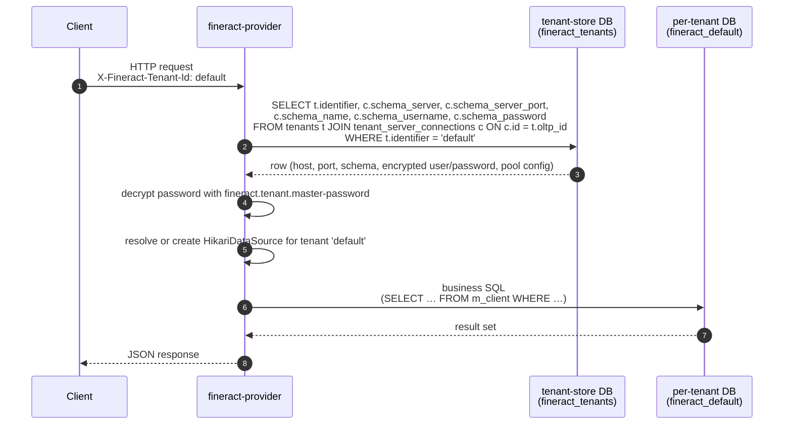

Multi-tenancy in Apache Fineract is not a discriminator column or a schema-per-row trick. It is a **physical split** between two distinct databases:

1. A small, shared **tenant-store** that holds the list of tenants and the JDBC connection details for each one.
2. A **per-tenant database** for every tenant, holding all of that tenant's business data — clients, loans, savings, journal entries, datatables, reports — completely isolated from every other tenant.

The two databases are managed by the same Spring Boot process, evolved by the same Liquibase master changelog, and configured by the same `fineract.tenant.*` properties — but they are different physical things, and routing between them is the central concern of the application's data layer.

## The data flow, end to end

Every API call carries a tenant identifier in the `X-Fineract-Tenant-Id` HTTP header (or whatever the deployment has configured). The application uses that identifier to look up the tenant's row in the tenant-store and resolves the right Hikari connection pool against the per-tenant database.



The same flow plays out at startup for the **default** tenant: the application reads `fineract.tenant.identifier` from `application.properties`, queries the tenant-store, and primes the default Hikari pool before serving any traffic.

## The tenant-store schema

The tenant-store has exactly three tables, all created by `tenant-store/parts/0001_initial_schema.xml`. They are small, slow-changing, and serve as the runtime catalog of who-is-who.

### `tenant_server_connections`

Holds the JDBC coordinates and connection-pool configuration for **one database server** that one (or more) tenants live on.

```xml fineract-provider/src/main/resources/db/changelog/tenant-store/parts/0001_initial_schema.xml
<createTable tableName="tenant_server_connections">
    <column autoIncrement="true" name="id" type="BIGINT">
        <constraints nullable="false" primaryKey="true"/>
    </column>
    <column defaultValue="localhost" name="schema_server" type="VARCHAR(100)">
        <constraints nullable="false"/>
    </column>
    <column name="schema_name" type="VARCHAR(100)">
        <constraints nullable="false"/>
    </column>
    <column defaultValue="3306" name="schema_server_port" type="VARCHAR(10)">
        <constraints nullable="false"/>
    </column>
    <column defaultValue="root" name="schema_username" type="VARCHAR(100)">
        <constraints nullable="false"/>
    </column>
    <column defaultValue="mysql" name="schema_password" type="VARCHAR(100)">
        <constraints nullable="false"/>
    </column>
    <column defaultValueNumeric="1"     name="auto_update"                        type="TINYINT"/>
    <column defaultValueNumeric="5"     name="pool_initial_size"                  type="INT"/>
    <column defaultValueNumeric="30000" name="pool_validation_interval"           type="INT"/>
    <column defaultValueNumeric="1"     name="pool_remove_abandoned"              type="TINYINT"/>
    <column defaultValueNumeric="60"    name="pool_remove_abandoned_timeout"      type="INT"/>
    <column defaultValueNumeric="1"     name="pool_log_abandoned"                 type="TINYINT"/>
    <column defaultValueNumeric="50"    name="pool_abandon_when_percentage_full"  type="INT"/>
    <column defaultValueNumeric="1"     name="pool_test_on_borrow"                type="TINYINT"/>
    <column defaultValueNumeric="40"    name="pool_max_active"                    type="INT"/>
    <column defaultValueNumeric="20"    name="pool_min_idle"                      type="INT"/>
    <column defaultValueNumeric="10"    name="pool_max_idle"                      type="INT"/>
    <column defaultValueNumeric="60"    name="pool_suspect_timeout"               type="INT"/>
    <column defaultValueNumeric="34000" name="pool_time_between_eviction_runs_millis" type="INT"/>
    <column defaultValueNumeric="60000" name="pool_min_evictable_idle_time_millis"    type="INT"/>
    <column defaultValueNumeric="0"     name="deadlock_max_retries"               type="INT"/>
    <column defaultValueNumeric="1"     name="deadlock_max_retry_interval"        type="INT"/>
    <column name="schema_connection_parameters" type="TEXT"/>
</createTable>
```

There are two important things to notice:

- The pool sizing knobs (`pool_initial_size`, `pool_max_active`, `pool_min_idle`, `pool_test_on_borrow`, eviction timers, …) are **per-tenant-server, not global**. Each row in the table is a complete Hikari recipe.
- `schema_password` is the **encrypted** password. The encryption key is `fineract.tenant.master-password`, and the algorithm defaults to `AES/CBC/PKCS5Padding` via `fineract.tenant.encrytion`. Changeset `0007_encrypt_existing_tenant_passwords.xml` introduced this; before that it was plaintext.

A subsequent changelog (`0004_readonly_database_connection.xml`) adds the **read-only replica** columns to this same table:

```xml fineract-provider/src/main/resources/db/changelog/tenant-store/parts/0004_readonly_database_connection.xml
<column name="readonly_schema_server" type="VARCHAR(100)"/>
<column name="readonly_schema_name" type="VARCHAR(100)"/>
<column name="readonly_schema_server_port" type="VARCHAR(10)"/>
<column name="readonly_schema_username" type="VARCHAR(100)"/>
<column name="readonly_schema_password" type="VARCHAR(100)"/>
<column name="readonly_schema_connection_parameters" type="TEXT"/>
```

When those columns are populated, Fineract maintains a second Hikari pool per tenant pointing at the replica. Reporting and heavy read queries route to that pool.

### `tenants`

A row per tenant. Holds the **logical identity** of the tenant and points at the connection rows that hold the JDBC coordinates.

```xml fineract-provider/src/main/resources/db/changelog/tenant-store/parts/0001_initial_schema.xml
<createTable tableName="tenants">
    <column autoIncrement="true" name="id" type="BIGINT">
        <constraints nullable="false" primaryKey="true"/>
    </column>
    <column name="identifier" type="VARCHAR(100)">
        <constraints nullable="false" unique="true"/>
    </column>
    <column name="name" type="VARCHAR(100)">
        <constraints nullable="false"/>
    </column>
    <column name="timezone_id" type="VARCHAR(100)">
        <constraints nullable="false"/>
    </column>
    <column defaultValueComputed="NULL" name="country_id"        type="INT"/>
    <column defaultValueComputed="NULL" name="joined_date"       type="date"/>
    <column defaultValueComputed="NULL" name="created_date"      type="datetime"/>
    <column defaultValueComputed="NULL" name="lastmodified_date" type="datetime"/>
    <column name="oltp_id"   type="BIGINT"><constraints nullable="false"/></column>
    <column name="report_id" type="BIGINT"><constraints nullable="false"/></column>
</createTable>
<createIndex indexName="fk_oltp_id" tableName="tenants">
    <column name="oltp_id"/>
</createIndex>
<createIndex indexName="fk_report_id" tableName="tenants">
    <column name="report_id"/>
</createIndex>
```

Notable columns:

| Column | Meaning |
| --- | --- |
| `identifier` | The string that arrives in the `X-Fineract-Tenant-Id` header. Unique across the catalog. |
| `name` | A human-readable label (defaulted from `fineract.tenant.description`). |
| `timezone_id` | An IANA timezone name (e.g. `Asia/Kolkata`); drives all business date math for the tenant. |
| `oltp_id` | FK into `tenant_server_connections` for the **primary** (read/write) database server. |
| `report_id` | FK into `tenant_server_connections` for the **read-only / reporting** database server. May equal `oltp_id` if there is no separate replica. |

The presence of two FKs — one for OLTP, one for reporting — is why the codebase often talks about "two connections per tenant".

### `timezones`

A static reference table populated by `parts/0002_initial_data.xml` with the IANA timezone list.

```xml fineract-provider/src/main/resources/db/changelog/tenant-store/parts/0001_initial_schema.xml
<createTable tableName="timezones">
    <column autoIncrement="true" name="id" type="INT">
        <constraints nullable="false" primaryKey="true"/>
    </column>
    <column name="country_code" type="VARCHAR(2)">
        <constraints nullable="false"/>
    </column>
    <column name="timezonename" type="VARCHAR(100)">
        <constraints nullable="false"/>
    </column>
    <column name="comments" type="VARCHAR(150)"/>
</createTable>
```

There is no FK from `tenants.timezone_id` into `timezones.timezonename` — the column on `tenants` is a free-form IANA string, and `timezones` is purely for picker UIs that want to validate or display the choice list.

### Default rows seeded on first boot

`tenant-store/parts/0002_initial_data.xml` inserts the **default tenant** row, parameterised from `application.properties`:

```xml fineract-provider/src/main/resources/db/changelog/tenant-store/parts/0002_initial_data.xml
<insert tableName="tenant_server_connections">
    <column name="id" valueNumeric="1"/>
    <column name="schema_server"                 value="${fineract.tenant.host}"/>
    <column name="schema_name"                   value="${fineract.tenant.schema-name}"/>
    <column name="schema_server_port"            value="${fineract.tenant.port}"/>
    <column name="schema_username"               value="${fineract.tenant.username}"/>
    <column name="schema_password"               value="${fineract.tenant.password}"/>
    <column name="schema_connection_parameters"  value="${fineract.tenant.parameters}"/>
</insert>

<insert tableName="tenants">
    <column name="id" valueNumeric="1"/>
    <column name="identifier"  value="${fineract.tenant.identifier}"/>
    <column name="name"        value="${fineract.tenant.description}"/>
    <column name="timezone_id" value="${fineract.tenant.timezone}"/>
    <column name="oltp_id"   valueNumeric="1"/>
    <column name="report_id" valueNumeric="1"/>
</insert>
```

So a fresh install always boots with a tenant whose identifier matches `fineract.tenant.identifier` (default: `default`) and whose schema lives at `${fineract.tenant.host}:${fineract.tenant.port}/${fineract.tenant.name}` (default: `localhost:3306/fineract_default`).

## The per-tenant schema

Everything that is not "where do I find the tenant" lives in the **per-tenant** database. That schema is created by Liquibase's much larger `tenant/` changelog — the 233 numbered files under `fineract-provider/src/main/resources/db/changelog/tenant/parts/` plus every per-module changelog (loan, savings, investor, progressive-loan, loan-origination, command, working-capital-loan).

The very first changeset, `0001_initial_schema.xml`, sets the tone:

```xml fineract-provider/src/main/resources/db/changelog/tenant/parts/0001_initial_schema.xml
<changeSet author="fineract" id="1">
    <createTable tableName="acc_accounting_rule">
        <column autoIncrement="true" name="id" type="BIGINT">
            <constraints nullable="false" primaryKey="true"/>
        </column>
        <column name="name" type="VARCHAR(100)">
            <constraints unique="true"/>
        </column>
        <column defaultValueComputed="NULL" name="office_id"        type="BIGINT"/>
        <column defaultValueComputed="NULL" name="debit_account_id" type="BIGINT"/>
        <column defaultValueBoolean="false" name="allow_multiple_debits" type="boolean">
            <constraints nullable="false"/>
        </column>
        ...
    </createTable>
    ...
</changeSet>
```

This schema is dramatically bigger than the tenant-store — it contains every business table Fineract has ever shipped. A non-exhaustive taxonomy:

| Table prefix | What it holds |
| --- | --- |
| `m_client*` | Clients, client identifiers, client family members |
| `m_loan*` | Loans, loan transactions, loan charges, loan repayment schedule |
| `m_savings*` | Savings accounts, transactions, charges |
| `m_share*` | Share products and accounts |
| `m_office*` | Branch hierarchy |
| `m_product_*` | Loan / savings / share / fixed-deposit product templates |
| `acc_*` | Chart of accounts, journal entries, accounting rules |
| `r_*` / `stretchy_*` | Reports and report parameter wiring |
| `external_*` | External-asset-owner (investor) tables |
| `wc_*` | Working-capital-loan tables |
| `c_*` / `permission`, `appuser`, `m_role*` | Users, roles, permissions |
| `job*`, `scheduler_*` | Spring Batch metadata and the job catalog |

Because the schema is per-tenant, every one of these tables exists once per tenant. Tenant `A` and tenant `B` could be on completely different servers with completely different database engines (e.g. tenant `A` on PostgreSQL, tenant `B` on MariaDB) and Fineract would still serve both.

For the full include graph that builds this schema see [Liquibase changelogs](/database/liquibase-changelogs).

## `fineract.tenant.*` — the configuration bridge

The bridge between the two databases is `fineract-provider/src/main/resources/application.properties`. It does two jobs at once:

1. Tells the application **where the tenant-store lives** (via `spring.datasource.hikari.*`).
2. Defines the **default tenant row** that gets inserted into the tenant-store on first boot (via `fineract.tenant.*`), so that a fresh install has at least one working tenant.

### Tenant-store JDBC

```properties application.properties
spring.datasource.hikari.driverClassName=${FINERACT_HIKARI_DRIVER_SOURCE_CLASS_NAME:org.mariadb.jdbc.Driver}
spring.datasource.hikari.jdbcUrl=${FINERACT_HIKARI_JDBC_URL:jdbc:mariadb://localhost:3306/fineract_tenants}
```

This is the **tenant-store** datasource. The tenant-store is the only DB whose JDBC URL is baked into the Spring Boot datasource — every other JDBC URL is computed at runtime from a tenant-store row.

### Per-tenant identity (default tenant)

```properties application.properties
fineract.tenant.identifier=${FINERACT_DEFAULT_TENANTDB_IDENTIFIER:default}
fineract.tenant.name=${FINERACT_DEFAULT_TENANTDB_NAME:fineract_default}
fineract.tenant.description=${FINERACT_DEFAULT_TENANTDB_DESCRIPTION:Default Demo Tenant}
fineract.tenant.timezone=${FINERACT_DEFAULT_TENANTDB_TIMEZONE:Asia/Kolkata}
```

| Property | Maps onto | Default |
| --- | --- | --- |
| `fineract.tenant.identifier` | `tenants.identifier` | `default` |
| `fineract.tenant.name` | `tenant_server_connections.schema_name` (passed to Liquibase as `fineract.tenant.schema-name`) | `fineract_default` |
| `fineract.tenant.description` | `tenants.name` | `Default Demo Tenant` |
| `fineract.tenant.timezone` | `tenants.timezone_id` | `Asia/Kolkata` |

### Per-tenant primary connection (default tenant)

```properties application.properties
fineract.tenant.host=${FINERACT_DEFAULT_TENANTDB_HOSTNAME:localhost}
fineract.tenant.port=${FINERACT_DEFAULT_TENANTDB_PORT:3306}
fineract.tenant.username=${FINERACT_DEFAULT_TENANTDB_UID:root}
fineract.tenant.password=${FINERACT_DEFAULT_TENANTDB_PWD:mysql}
fineract.tenant.parameters=${FINERACT_DEFAULT_TENANTDB_CONN_PARAMS:}
```

| Property | Maps onto |
| --- | --- |
| `fineract.tenant.host` | `tenant_server_connections.schema_server` |
| `fineract.tenant.port` | `tenant_server_connections.schema_server_port` |
| `fineract.tenant.username` | `tenant_server_connections.schema_username` |
| `fineract.tenant.password` | `tenant_server_connections.schema_password` (encrypted on insert) |
| `fineract.tenant.parameters` | `tenant_server_connections.schema_connection_parameters` |

### Per-tenant read-only replica (default tenant)

```properties application.properties
fineract.tenant.read-only-host=${FINERACT_DEFAULT_TENANTDB_RO_HOSTNAME:}
fineract.tenant.read-only-port=${FINERACT_DEFAULT_TENANTDB_RO_PORT:}
fineract.tenant.read-only-username=${FINERACT_DEFAULT_TENANTDB_RO_UID:}
fineract.tenant.read-only-password=${FINERACT_DEFAULT_TENANTDB_RO_PWD:}
fineract.tenant.read-only-parameters=${FINERACT_DEFAULT_TENANTDB_RO_CONN_PARAMS:}
fineract.tenant.read-only-name=${FINERACT_DEFAULT_TENANTDB_RO_NAME:}
```

Empty by default. Populating them turns on the read-only replica path described above.

### Password encryption

```properties application.properties
fineract.tenant.master-password=${FINERACT_DEFAULT_TENANTDB_MASTER_PASSWORD:fineract}
fineract.tenant.encrytion=${FINERACT_DEFAULT_TENANTDB_ENCRYPTION:"AES/CBC/PKCS5Padding"}
```

`master-password` is the symmetric key used to encrypt `schema_password` and `readonly_schema_password` in the tenant-store. Rotating it is non-trivial — it requires re-encrypting every row — so it should be set once at install time via `FINERACT_DEFAULT_TENANTDB_MASTER_PASSWORD` and then left alone.

### Pool sizing override

```properties application.properties
fineract.tenant.config.min-pool-size=${FINERACT_CONFIG_MIN_POOL_SIZE:-1}
fineract.tenant.config.max-pool-size=${FINERACT_CONFIG_MAX_POOL_SIZE:-1}
fineract.tenant.config.rounding-mode=${FINERACT_CONFIG_ROUNDING_MODE:6}
```

A value of `-1` means "use the per-tenant value from the `pool_*` columns in `tenant_server_connections`". Setting a positive value here lets a single deployment override the per-tenant pool sizing without having to update every tenant row.

`rounding-mode` is forwarded to Liquibase as a changelog parameter and ends up in business-table defaults that need a `BigDecimal` rounding strategy.

## Where each piece of data lives

A quick lookup table when you are debugging "which database does this come from?":

| Question / Data | Database | Table(s) |
| --- | --- | --- |
| What tenants exist? | tenant-store | `tenants` |
| Where does tenant `X` connect to? | tenant-store | `tenant_server_connections` |
| What timezone choices does the picker show? | tenant-store | `timezones` |
| What clients does tenant `X` have? | per-tenant `X` | `m_client` |
| What loans does tenant `X` have? | per-tenant `X` | `m_loan`, `m_loan_transaction`, `m_loan_repayment_schedule`, … |
| What is tenant `X`'s chart of accounts? | per-tenant `X` | `acc_gl_account`, `acc_accounting_rule`, … |
| What users / roles / permissions does tenant `X` have? | per-tenant `X` | `m_appuser`, `m_role`, `m_permission`, … |
| What jobs are scheduled for tenant `X`? | per-tenant `X` | `job`, plus Spring Batch tables |

The line is sharp: anything that identifies or addresses a tenant is in the tenant-store; everything else is per-tenant.

## Running just Liquibase

Because the two databases share one master changelog, there is a dedicated profile for running Liquibase **without** booting the rest of the application. It lives alongside the regular config:

```text fineract-provider/src/main/resources/
application.properties
application-liquibase-only.properties
```

Activating this profile (e.g. `--spring.profiles.active=liquibase-only`) makes Spring Boot exit after the Liquibase update completes, which is useful for CI / Kubernetes init-containers that want to evolve the schema separately from running the app.

## See also

<CardGroup cols={2}>
  <Card title="Database overview" href="/database/overview" icon="database">
    The high-level picture, supported engines, and where every changelog lives.
  </Card>
  <Card title="Liquibase changelogs" href="/database/liquibase-changelogs" icon="layer-group">
    Detailed walk-through of every changelog that builds these two schemas.
  </Card>
  <Card title="Legacy SQL and demo backups" href="/database/legacy-sql-and-demo-backups" icon="floppy-disk">
    The `fineract-db/` directory — the pre-Liquibase tenant-store bootstrap and the bundled demo tenant dumps.
  </Card>
  <Card title="Security overview" href="/security/overview" icon="lock">
    Where the `m_appuser`, `m_role`, and `m_permission` tables fit in the wider authentication and authorization story.
  </Card>
</CardGroup>
