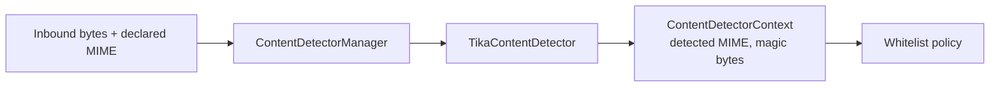
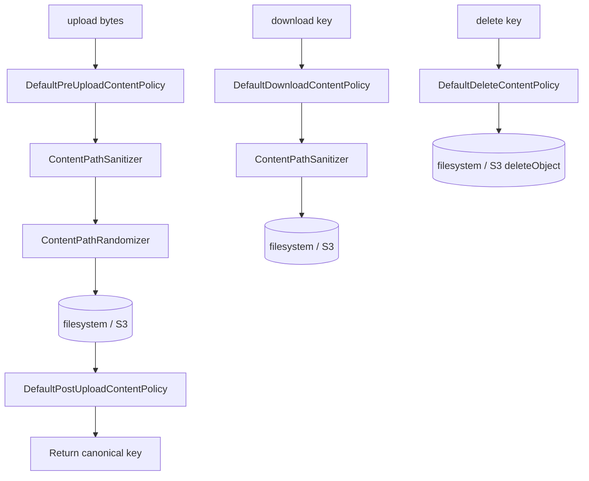
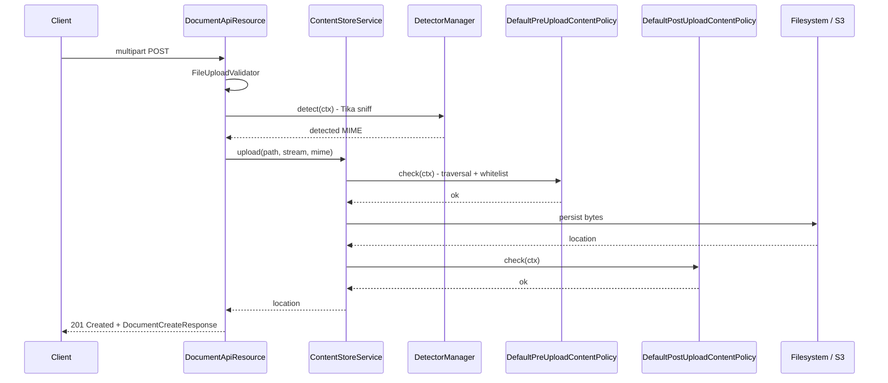

Every byte that goes into Apache Fineract's content store first walks a
short, well-defined pipeline that catches path-traversal attempts,
rejects disallowed MIME types, sniffs the *actual* content with Apache
Tika and — for outbound responses — runs an optional processor chain
that can resize an image, gzip a payload or wrap it in a data URL. The
pipeline is shared by the filesystem and S3 backends, so the
guarantees are identical regardless of where the bytes finally land.

## Module layout

```text
fineract-document/src/main/java/org/apache/fineract/infrastructure/contentstore/
├── detector/      Tika-based MIME detection
├── policy/        Guards: whitelist, traversal, pre/post upload, download, delete
├── processor/     Transformations: base64, gzip, image-resize, size, data-URL
└── util/          Sanitisers, randomisers, the ContentPipe runner
```

Each package corresponds to one cleanly-separated concern:

- **detector/** answers *what is this file actually?*
- **policy/** answers *are we allowed to do X with it?*
- **processor/** answers *what transformation should we apply on the way in/out?*
- **util/** owns the pieces shared across all three (path sanitisation,
  random suffixing, the executor that fans the pipeline out).

## Detectors

`ContentDetector` is the SPI; the only production implementation is
`TikaContentDetector`. The manager that fronts them is
`DefaultContentDetectorManager`
(`fineract-document/src/main/java/org/apache/fineract/infrastructure/contentstore/detector/DefaultContentDetectorManager.java`):

```java
@Component
public final class DefaultContentDetectorManager implements ContentDetectorManager {

    private final TikaContentDetector tikaContentDetector;

    @Override
    public ContentDetectorContext detect(ContentDetectorContext ctx) {
        return tikaContentDetector.detect(ctx);
    }
}
```

The detector takes a `ContentDetectorContext` (file name + optional
input stream + flag controlling whether the stream may be consumed)
and returns a clone of the context populated with the detected MIME
type, extension and format. `TikaContentDetector` uses a streaming
`Tika.detect(stream, metadata)` call when an input stream is supplied
and `Tika.detect(fileName)` otherwise; in both cases it falls back to
`application/octet-stream` if no extension can be resolved.

A second implementation, `FileContentDetector`, also lives in the
detector package. It delegates to JVM `Files.probeContentType(...)` and
`FilenameUtils.getExtension(...)`. The stock
`DefaultContentDetectorManager` does **not** consult it — it only
calls `TikaContentDetector`. `FileContentDetector` is kept as an
alternative `@Component` for custom managers that need an
extension-only sniff.



## Policies

The `policy/` package is the security perimeter. It is split into
**building-block policies** (`WhitelistContentPolicy`,
`TraversalContentPolicy`, `MimeContentPolicy`) and four **defaults**
that compose them for the four lifecycle hooks:

| Default | Composes | Where it runs |
| ------- | -------- | ------------- |
| `DefaultPreUploadContentPolicy` | `TraversalContentPolicy` → `WhitelistContentPolicy` | Before `upload()` writes a byte |
| `DefaultPostUploadContentPolicy` | `MimeContentPolicy` | After `upload()`, before returning the canonical key |
| `DefaultDownloadContentPolicy` | `TraversalContentPolicy` | Before `download()` opens a stream |
| `DefaultDeleteContentPolicy`   | `TraversalContentPolicy` | Before `delete()` removes an object |

The pre-upload default ties the building blocks together
(`fineract-document/src/main/java/org/apache/fineract/infrastructure/contentstore/policy/DefaultPreUploadContentPolicy.java`):

```java
@Component
public class DefaultPreUploadContentPolicy implements ContentPolicy {

    private final WhitelistContentPolicy whitelistContentPolicy;
    private final TraversalContentPolicy traversalContentPolicy;

    @Override
    public void check(ContentPolicyContext ctx) {
        traversalContentPolicy.check(ctx);
        whitelistContentPolicy.check(ctx);
    }
}
```

Every implementation throws `ContentPolicyException` on failure. The
exception extends `AbstractPlatformException` with the globalisation
code `error.msg.content.policy` and the failure message, which the
generic Fineract exception mapper turns into an HTTP error response.

### `TraversalContentPolicy`

A single regex — `.*((\.)?\./+)+(/+)?.*` — applied to `ctx.getPath()`.
Any path that matches is rejected with
`"Trying to overwrite a sibling file: <path>"`. This is the only check
the policy performs; it does not enforce a prefix, an absolute / relative
distinction, or a length limit. The same regex is consulted from every
lifecycle hook (`Default*ContentPolicy`) so upload, download and delete
all reject hostile keys uniformly.

### `WhitelistContentPolicy`

Has two independent halves, both driven by `FineractProperties.FineractContentProperties`:

- When `fineract.content.regex-whitelist-enabled=true` (the default),
  the **file name** (`FilenameUtils.getName(ctx.getPath())`) must match
  at least one regex in `fineract.content.regex-whitelist`. The
  shipped default is
  `.*\.pdf$,.*\.doc,.*\.docx,.*\.xls,.*\.xlsx,.*\.jpg,.*\.jpeg,.*\.png`.
- When `fineract.content.mime-whitelist-enabled=true` (the default),
  `ctx.getMimeType()` (the declared MIME, before Tika re-detects it)
  must appear in the `fineract.content.mime-whitelist` list. The
  shipped default covers PDF, Word, Excel and PNG / JPEG.

Both checks throw `ContentPolicyException` on miss. Patterns are
compiled once on `ApplicationStartedEvent` and cached.

### `MimeContentPolicy`

Only runs when `ctx.getInputStream()` is non-null (true for the
post-upload check). It re-runs the Tika detector against the actual
bytes and throws
`"Detected file type (X), but mime type (Y) was provided. Mismatch!"`
if the sniffed MIME differs from the one declared by the caller. This
is the check that defeats extension-spoofing — a `.png` payload that is
really a script is caught here even when the file-name extension passed
the upstream whitelist.

### Lifecycle hook map



## Processors

Where policies *guard* the pipeline, processors *transform* the
payload. Each processor implements `ContentProcessor` and is given a
`ContentProcessorContext` that carries parameters from the API request
plus an input stream:

```text
fineract-document/.../contentstore/processor/
├── Base64DecoderContentProcessor.java
├── Base64EncoderContentProcessor.java
├── ContentProcessor.java
├── ContentProcessorContext.java
├── DataUrlDecoderContentProcessor.java
├── DataUrlEncoderContentProcessor.java
├── GzipDecoderContentProcessor.java
├── GzipEncoderContentProcessor.java
├── ImageResizeContentProcessor.java
└── SizeContentProcessor.java
```

Each processor exposes its parameter keys as `public static final String`
constants on the class itself, prefixed by a stable namespace.
`ImagesApiResource` is the main caller and imports them via
`import static ...`:

| Processor | Parameter keys (`ctx.getParameter(...)`) | Result keys (`ctx.getResult(...)`) |
| --------- | ---------------------------------------- | ---------------------------------- |
| `ImageResizeContentProcessor` | `image.resize.max-width` (required `Integer`), `image.resize.max-height` (required `Integer`), `image.resize.format` (default `"jpg"`, must match `^(gif\|jpg\|jpeg\|png)$`) | — |
| `Base64EncoderContentProcessor` | `base64.encode.buffer-size` (default `fineract.content.default-buffer-size`) | — |
| `Base64DecoderContentProcessor` | `base64.decode.buffer-size` | — |
| `DataUrlEncoderContentProcessor` | `dataurl.encode.param.buffer-size`, `dataurl.encode.param.content-type` (default `text/plain`), `dataurl.encode.param.encoding` (default `charset=US-ASCII`) | — |
| `DataUrlDecoderContentProcessor` | `dataurl.decode.param.buffer-size` | `dataurl.decode.result.content-type`, `dataurl.decode.result.encoding` |
| `GzipEncoderContentProcessor` | `gzip.encode.buffer-size` | — |
| `GzipDecoderContentProcessor` | `gzip.decode.buffer-size` | — |
| `SizeContentProcessor` | — | `size.result.value` (`long`) |

Behaviour notes:

- **`ImageResizeContentProcessor`** — drains the input through
  `ImageIO.createImageInputStream` (wrapped in
  `StreamUtils.nonClosing`), rescales to the target width/height with
  `BufferedImage`, and writes back through `ImageIO.write(image, format, out)`.
  An invalid `format` raises `ContentProcessorException`.
- **`DataUrlEncoderContentProcessor`** — wraps the payload as
  `data:<contentType>;<encoding>,<payload>` (using the prefix bytes
  computed at construction time). `ImagesApiResource` chains it after
  `Base64EncoderContentProcessor` and supplies
  `dataurl.encode.param.content-type = <detected MIME>` and
  `dataurl.encode.param.encoding = base64` so the result is a
  `text/plain` body of the form `data:image/png;base64,<...>`.
- **`Base64EncoderContentProcessor` / `Base64DecoderContentProcessor`** —
  symmetric base64 transformations, used by the image API to round-trip
  data URLs.
- **`GzipEncoderContentProcessor` / `GzipDecoderContentProcessor`** —
  wrap the stream in `GZIPOutputStream` / `GZIPInputStream`. They are
  not on the default image or document pipelines today; they exist for
  custom callers.
- **`SizeContentProcessor`** — wraps the stream in a
  `ByteCountingInputStream` and writes the final byte count into
  `ctx.setResult("size.result.value", byteCount)` on `close()`. It does
  not throw on a size cap; it only measures.

### How the streaming pipeline runs

Every processor that needs to *transform* bytes returns a new
`InputStream` to the caller, built around a `PipedInputStream` /
`PipedOutputStream` pair that is pumped from a worker thread. The
plumbing lives in `ContentPipe` (in `util/`), which submits the
producer side to an `ExecutorService` provided by `ContentStoreConfig`
(`fineract-document/src/main/java/org/apache/fineract/infrastructure/contentstore/config/ContentStoreConfig.java`):

```java
@Configuration
class ContentStoreConfig {

    @Bean(BEAN_NAME_EXECUTOR)
    ExecutorService contentProcessorExecutor() {
        // TODO: make this more configurable?
        return Executors.newCachedThreadPool();
    }
}
```

The buffer size of the `PipedInputStream` is taken from
`fineract.content.default-buffer-size` (defaults to `8192`). This is
not parallel processor *fan-out* — it is the standard
`PipedInputStream` pattern that lets one thread write into a buffer
while another (the HTTP response thread, typically) reads from it,
which is what stops the entire processor chain from materialising the
whole file in heap. Composition of multiple processors happens through
`ContentProcessor#then(...)`, which wraps each step's output stream as
the next step's input — exactly as `ImagesApiResource` does for
`imageResizeContentProcessor.then(base64EncoderContentProcessor).then(dataUrlEncoderContentProcessor)`.

A small `FutureInputStream` wrapper around the `PipedInputStream`
checks the worker `Future` on every `read()` so any exception thrown
by the producer surfaces in the consumer rather than hanging the
pipe.

## Utilities

`util/` carries the helpers every service in the package consumes:

- **`ContentPathSanitizer`** / `DefaultContentPathSanitizer` — the
  `String sanitize(String path)` method called from
  `FileContentStoreService` and `S3ContentStoreService` before every
  read, write or delete. The default implementation simply calls
  `Path.of(path).normalize().toString()`; rejection of traversal
  patterns is the job of `TraversalContentPolicy`, which runs before
  sanitisation.
- **`ContentPathRandomizer`** / `DefaultContentPathRandomizer` —
  appends entropy so two uploads with the same display name don't
  collide.
- **`ContentPipe`** — the thin wrapper around `ExecutorService` that
  runs the processor chain.

## End-to-end upload sequence



If any policy fails, a `ContentPolicyException` is raised and the
upload is aborted before any persistent state changes — the document
row is not inserted, the bytes are not on disk / in S3, and the
response is the standard `errors[]` envelope with a 400.

## Extending the pipeline

The pipeline is designed for additive extension, but note that the
shipped `Default*ContentPolicy` classes hard-wire which building blocks
they call — there is no `List<ContentPolicy>` auto-collection. Adding a
new step means:

- **New policy** — implement `ContentPolicy` as a `@Component`, then
  either change the relevant `Default*ContentPolicy` to invoke it,
  or replace that default with a custom `@Component` of the same
  type (e.g. `@Primary`) so the content-store services pick it up
  through constructor injection.
- **New detector** — implement `ContentDetector` and provide a
  replacement `ContentDetectorManager` `@Component` that fans calls
  out across detectors. The default `DefaultContentDetectorManager`
  only delegates to `TikaContentDetector`.
- **New processor** — implement `ContentProcessor` and inject it into
  the resource that should use it (e.g. a watermarking processor
  added to `ImagesApiResource` and chained with
  `imageResizeContentProcessor.then(watermarkProcessor)`).

## Examples

<AccordionGroup>
<Accordion title="Reject a previously-allowed type">
Trim either `fineract.content.regex-whitelist` or
`fineract.content.mime-whitelist` in `application.properties` (or via
the `FINERACT_CONTENT_*_WHITELIST` env vars). On the next upload of a
removed type, `WhitelistContentPolicy` throws
`ContentPolicyException("File name not allowed: ...")` or
`ContentPolicyException("Detected mime type ... not allowed!")` and
the API responds with HTTP 400.
</Accordion>

<Accordion title="Add a virus-scan post-upload step">
Implement a `ContentPolicy` that streams the just-written bytes
(`ctx.getInputStream()`) through a ClamAV client, then replace
`DefaultPostUploadContentPolicy` with a `@Primary` variant that
invokes both `MimeContentPolicy` and the new scan. Because
`FileContentStoreService.upload(...)` deletes the file when the
post-upload check throws, a virus hit will also roll back the just-
written object.
</Accordion>

<Accordion title="Return a thumbnail without storing it">
The Image API already chains
`ImageResizeContentProcessor` `.then(base64EncoderContentProcessor)`
`.then(dataUrlEncoderContentProcessor)` on GET when the caller asks
for a `text/plain` response (the default). Add `?maxWidth=128&maxHeight=128`
to constrain the resize. To get raw octet bytes instead, set
`Accept: application/octet-stream` or `?output=octet` /
`?output=inline_octet`. The original bytes on the store are untouched.
</Accordion>

<Accordion title="Compress large CSV imports">
Hook `GzipDecoderContentProcessor` into the
import-handling controller so a `Content-Encoding: gzip` payload is
inflated before validation — the rest of the import pipeline never
needs to know.
</Accordion>
</AccordionGroup>

## Related reading

- Content-store providers — how the filesystem and S3 services
  consume these policies and processors.
- S3 content store — the AWS SDK config that the pipeline writes
  through.
- Document and Image API — the HTTP layer that triggers the pipeline.
