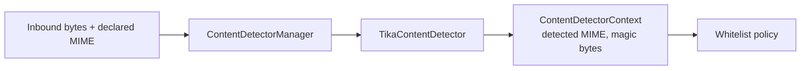
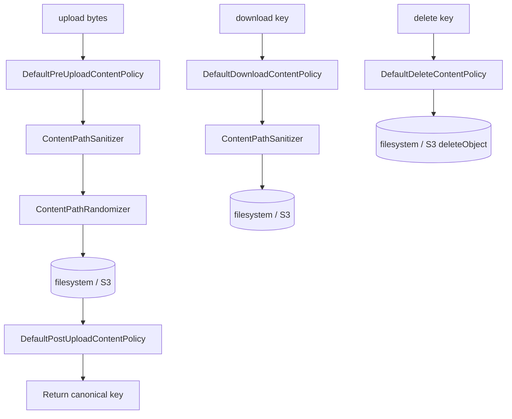
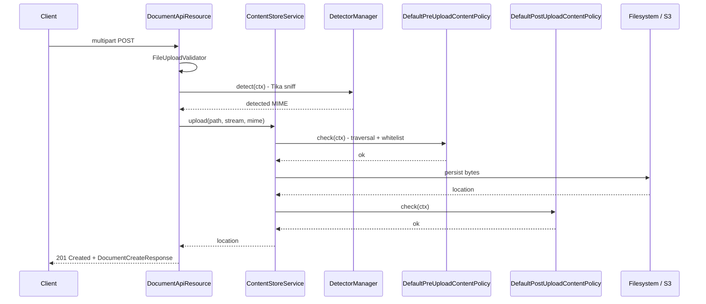

Every byte that goes into Apache Fineract's content store first walks a
short, well-defined pipeline that catches path-traversal attempts,
rejects disallowed MIME types, sniffs the *actual* content with Apache
Tika and — for outbound responses — runs an optional processor chain
that can resize an image, gzip a payload or wrap it in a data URL. The
pipeline is shared by the filesystem and S3 backends, so the
guarantees are identical regardless of where the bytes finally land.

## Module layout

```text
fineract-document/src/main/java/org/apache/fineract/infrastructure/contentstore/
├── detector/      Tika-based MIME detection
├── policy/        Guards: whitelist, traversal, pre/post upload, download, delete
├── processor/     Transformations: base64, gzip, image-resize, size, data-URL
└── util/          Sanitisers, randomisers, the ContentPipe runner
```

Each package corresponds to one cleanly-separated concern:

- **detector/** answers *what is this file actually?*
- **policy/** answers *are we allowed to do X with it?*
- **processor/** answers *what transformation should we apply on the way in/out?*
- **util/** owns the pieces shared across all three (path sanitisation,
  random suffixing, the executor that fans the pipeline out).

## Detectors

`ContentDetector` is the SPI; the only production implementation is
`TikaContentDetector`. The manager that fronts them is
`DefaultContentDetectorManager`
(`fineract-document/src/main/java/org/apache/fineract/infrastructure/contentstore/detector/DefaultContentDetectorManager.java`):

```java
@Component
public final class DefaultContentDetectorManager implements ContentDetectorManager {

    private final TikaContentDetector tikaContentDetector;

    @Override
    public ContentDetectorContext detect(ContentDetectorContext ctx) {
        return tikaContentDetector.detect(ctx);
    }
}
```

The detector takes a `ContentDetectorContext` (file path + input
stream + declared MIME type) and returns it populated with the
**detected** MIME type and the sniffed magic number — the value the
whitelist policy then checks. The file under
`fineract-document/.../contentstore/detector/FileContentDetector.java`
is the lightweight extension-only detector used when Tika is
unavailable.



## Policies

The `policy/` package is the security perimeter. It is split into
**building-block policies** (`WhitelistContentPolicy`,
`TraversalContentPolicy`, `MimeContentPolicy`) and four **defaults**
that compose them for the four lifecycle hooks:

| Default | Composes | Where it runs |
| ------- | -------- | ------------- |
| `DefaultPreUploadContentPolicy` | `TraversalContentPolicy`, `WhitelistContentPolicy` | Before `upload()` writes a byte |
| `DefaultPostUploadContentPolicy` | (extensible — checksum etc.) | After `upload()`, before responding 200 |
| `DefaultDownloadContentPolicy` | `TraversalContentPolicy` | Before `download()` opens a stream |
| `DefaultDeleteContentPolicy`   | `TraversalContentPolicy` | Before `delete()` removes an object |

The pre-upload default ties the building blocks together
(`fineract-document/src/main/java/org/apache/fineract/infrastructure/contentstore/policy/DefaultPreUploadContentPolicy.java`):

```java
@Component
public class DefaultPreUploadContentPolicy implements ContentPolicy {

    private final WhitelistContentPolicy whitelistContentPolicy;
    private final TraversalContentPolicy traversalContentPolicy;

    @Override
    public void check(ContentPolicyContext ctx) {
        traversalContentPolicy.check(ctx);
        whitelistContentPolicy.check(ctx);
    }
}
```

Every implementation throws `ContentPolicyException` on failure, which
the API layer surfaces as an HTTP 400 with the appropriate
globalisation message code.

### `TraversalContentPolicy`

Blocks paths containing `..`, absolute markers (`/`, `\`),
device-prefix segments and other shell-special sequences. The same
class is consulted from every lifecycle hook so that *any* operation
on a hostile key (upload, download, delete) is rejected.

### `WhitelistContentPolicy`

Compares the detected MIME against an allow-list of MIME / file
extensions. The default list covers documents (PDF, DOCX, XLSX,
CSV) and images (PNG, JPEG, GIF). Anything else fails closed.

### `MimeContentPolicy`

Asserts that the *detected* MIME matches the *declared* MIME on the
upload, so a file claiming to be `image/png` but actually containing a
`application/x-executable` magic is rejected even if both extensions
happened to be whitelisted.

### Lifecycle hook map



## Processors

Where policies *guard* the pipeline, processors *transform* the
payload. Each processor implements `ContentProcessor` and is given a
`ContentProcessorContext` that carries parameters from the API request
plus an input stream:

```text
fineract-document/.../contentstore/processor/
├── Base64DecoderContentProcessor.java
├── Base64EncoderContentProcessor.java
├── ContentProcessor.java
├── ContentProcessorContext.java
├── DataUrlDecoderContentProcessor.java
├── DataUrlEncoderContentProcessor.java
├── GzipDecoderContentProcessor.java
├── GzipEncoderContentProcessor.java
├── ImageResizeContentProcessor.java
└── SizeContentProcessor.java
```

Highlights:

- **`ImageResizeContentProcessor`** — driven by `maxWidth` /
  `maxHeight` / `format` query parameters (the constants are imported
  by `ImagesApiResource`). Produces a smaller PNG/JPEG/etc. before the
  bytes reach the client; the original on disk is unchanged.
- **`DataUrlEncoderContentProcessor`** — wraps the payload as
  `data:<mime>;base64,<payload>` so a single GET can return an inline
  image as a `text/plain` response (used by the Mifos web UI for
  client cards).
- **`Base64EncoderContentProcessor` / `Base64DecoderContentProcessor`** —
  symmetric base64 transformations for tooling that round-trips
  binaries as JSON.
- **`GzipEncoderContentProcessor` / `GzipDecoderContentProcessor`** —
  optional compression for large textual uploads (mostly imports).
- **`SizeContentProcessor`** — drains the stream to measure its size
  and asserts an upper bound; used by some custom callers as a
  belt-and-braces check on top of `Content-Length`.

### Running multiple processors

`ContentPipe` (in `util/`) is the small executor that fans processors
across a shared `ExecutorService` provided by `ContentStoreConfig`
(`fineract-document/src/main/java/org/apache/fineract/infrastructure/contentstore/config/ContentStoreConfig.java`):

```java
@Configuration
class ContentStoreConfig {

    @Bean(BEAN_NAME_EXECUTOR)
    ExecutorService contentProcessorExecutor() {
        return Executors.newCachedThreadPool();
    }
}
```

Processors that can be applied in parallel — for example, encoding a
data URL while computing the file size — are dispatched on this pool
so an image download response can be composed without serial blocking
on each step.

## Utilities

`util/` carries the helpers every service in the package consumes:

- **`ContentPathSanitizer`** / `DefaultContentPathSanitizer` — the
  `String sanitize(String path)` method called from both
  `FileContentStoreService.upload` and `S3ContentStoreService.upload`
  before any I/O.
- **`ContentPathRandomizer`** / `DefaultContentPathRandomizer` —
  appends entropy so two uploads with the same display name don't
  collide.
- **`ContentPipe`** — the thin wrapper around `ExecutorService` that
  runs the processor chain.

## End-to-end upload sequence



If any policy fails, a `ContentPolicyException` is raised and the
upload is aborted before any persistent state changes — the document
row is not inserted, the bytes are not on disk / in S3, and the
response is the standard `errors[]` envelope with a 400.

## Extending the pipeline

The pipeline is designed for additive extension:

- **New policy** — implement `ContentPolicy`, register it as a
  `@Component`, and inject it into the relevant `Default*ContentPolicy`
  (or write a new default and bind a custom
  `ContentStoreService` implementation).
- **New detector** — implement `ContentDetector` and decide whether to
  replace the default `DefaultContentDetectorManager` or compose with
  Tika.
- **New processor** — implement `ContentProcessor`, then wire it into
  the GET path that should use it (e.g., a watermarking processor
  invoked from `ImagesApiResource`).

## Examples

<AccordionGroup>
<Accordion title="Reject a previously-allowed type">
Override the whitelist contributions in
`WhitelistContentPolicy` (or its property-driven equivalent) and the
next upload of that MIME fails with
`error.msg.contentstore.policy.whitelist`.
</Accordion>

<Accordion title="Add a virus-scan post-upload step">
Implement a `ContentPolicy` that posts the just-written key to a
ClamAV service, then inject it into `DefaultPostUploadContentPolicy`.
On failure, the same exception flow tears down the freshly-uploaded
object.
</Accordion>

<Accordion title="Return a thumbnail without storing it">
The Image API already chains
`ImageResizeContentProcessor` + `DataUrlEncoderContentProcessor` on
GET, controlled by `maxWidth` / `maxHeight` / `encoding=base64` /
`output=inline_octet`. The original bytes on the store are untouched.
</Accordion>

<Accordion title="Compress large CSV imports">
Hook `GzipDecoderContentProcessor` into the
import-handling controller so a `Content-Encoding: gzip` payload is
inflated before validation — the rest of the import pipeline never
needs to know.
</Accordion>
</AccordionGroup>

## Related reading

- Content-store providers — how the filesystem and S3 services
  consume these policies and processors.
- S3 content store — the AWS SDK config that the pipeline writes
  through.
- Document and Image API — the HTTP layer that triggers the pipeline.
