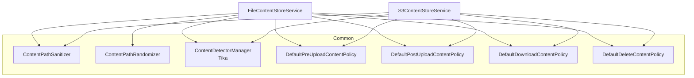

Every binary that flows through Apache Fineract — client photographs,
loan supporting documents, imported CSVs, generated reports — passes
through a small **content-store SPI**. The SPI hides the difference
between a local filesystem mount and an S3 bucket behind a single
service interface, and the wiring uses Spring's `@ConditionalOnProperty`
to pick the right implementation at boot.

## Module layout

The whole abstraction lives in `fineract-document` so it can be shared
by the document-management API and any other module that needs a place
to put files:

```text
fineract-document/src/main/java/org/apache/fineract/infrastructure/contentstore/
├── config/         ContentStoreConfig.java  (executor for processors)
├── data/           ContentStoreType.java    (S3 / FILE_SYSTEM enum)
├── detector/       Tika-based MIME detection
├── exception/      ContentStoreException, ContentPolicyException
├── policy/         Whitelist, traversal, pre/post upload, download, delete
├── processor/      Base64, GZIP, image-resize, size, data-URL processors
├── service/
│   ├── ContentStoreService.java        (interface)
│   ├── FileContentStoreService.java    (@ConditionalOnProperty filesystem)
│   └── S3ContentStoreService.java      (@ConditionalOnProperty s3)
└── util/           Path sanitisers, randomisers, content pipe
```

## The `ContentStoreService` interface

`ContentStoreService`
(`fineract-document/src/main/java/org/apache/fineract/infrastructure/contentstore/service/ContentStoreService.java`)
is the single SPI every content-store implementation must honour.
Callers — most importantly `DocumentApiResource` and `ImagesApiResource`
— talk only to this interface, so swapping storage backends is just a
matter of changing which implementation Spring activates.

The contract is intentionally narrow:

- **`String upload(String path, InputStream is, String mimeType)`** —
  persist the bytes at the requested path; return the canonical key
  that should be stored in `m_document.location` / `m_image.location`.
- **`InputStream download(String path)`** — stream the bytes back.
- **`void delete(String path)`** — remove the object.
- **`ContentStoreType getType()`** — `S3` or `FILE_SYSTEM`, used by
  callers that need to stamp `storage_type_enum` on the row.

## Implementation 1 — `FileContentStoreService`

The filesystem variant lives at
`fineract-document/src/main/java/org/apache/fineract/infrastructure/contentstore/service/FileContentStoreService.java`
and is selected by:

```java
@Service
@ConditionalOnProperty(name = "fineract.content.filesystem.enabled",
                       havingValue = "true")
public class FileContentStoreService implements ContentStoreService {

    private final ContentPathSanitizer pathSanitizer;
    private final ContentPathRandomizer pathRandomizer;
    private final DefaultDownloadContentPolicy   downloadContentPolicy;
    private final DefaultPreUploadContentPolicy  preUploadContentPolicy;
    private final DefaultPostUploadContentPolicy postUploadContentPolicy;
    private final DefaultDeleteContentPolicy     deleteContentPolicy;
    private final ContentDetectorManager         contentDetectorManager;
    private final FineractProperties             properties;
    // ...
}
```

Behaviour notes:

- The **root directory** comes from `FineractProperties.FineractContentFilesystemProperties.rootFolder`,
  configured via the `fineract.content.filesystem.rootFolder` property (defaults to
  `${user.home}/.fineract` in `application.properties`).
- Every key is **sanitised** through `ContentPathSanitizer`
  (`DefaultContentPathSanitizer` calls `Path.of(path).normalize()`) before
  any I/O. Path-traversal sequences are rejected upstream by
  `TraversalContentPolicy`. New uploads also get an entropy segment from
  `ContentPathRandomizer` injected into the path (a 16-character
  directory between the parent path and the filename) so two uploads
  with the same display name don't collide — but only when the target
  file doesn't already exist; in-place overwrites reuse the existing
  randomised path.
- The effective root for a write is `<rootFolder>/<tenantName>` where
  `tenantName` comes from `ThreadLocalContextUtil.getTenant().getName()`
  with spaces stripped — multi-tenancy is enforced at the path level.
- Pre-upload, post-upload, download and delete policies and the Tika
  detector manager are constructor-injected so the same guarantees are
  honoured whether the bytes land on disk or in S3.
- Empty parent directories are removed after a successful delete (see
  `hasFiles()` check in `delete()`).

## Implementation 2 — `S3ContentStoreService`

The S3 variant lives at
`fineract-document/src/main/java/org/apache/fineract/infrastructure/contentstore/service/S3ContentStoreService.java`
and is selected by:

```java
@Service
@ConditionalOnProperty(name = "fineract.content.s3.enabled",
                       havingValue = "true")
public class S3ContentStoreService implements ContentStoreService {

    private final S3Client                       s3Client;
    private final ContentPathSanitizer           pathSanitizer;
    private final DefaultDownloadContentPolicy   downloadContentPolicy;
    private final DefaultPreUploadContentPolicy  preUploadContentPolicy;
    private final DefaultPostUploadContentPolicy postUploadContentPolicy;
    private final DefaultDeleteContentPolicy     deleteContentPolicy;
    private final ContentDetectorManager         contentDetectorManager;
    private final FineractProperties             properties;

    @Override
    public InputStream download(String path) {
        downloadContentPolicy.check(ContentPolicyContext.builder().path(path).build());
        final var safePath = pathSanitizer.sanitize(path);
        try {
            return s3Client.getObject(
                    GetObjectRequest.builder()
                            .bucket(properties.getContent().getS3().getBucketName())
                            .key(safePath).build(),
                    ResponseTransformer.toBytes()).asInputStream();
        } catch (Exception e) {
            throw new ContentStoreException(e);
        }
    }
}
```

Key points:

- Uses the AWS SDK v2 `S3Client` injected from `ContentS3Config`
  (`fineract-provider/src/main/java/org/apache/fineract/infrastructure/core/config/ContentS3Config.java`),
  which is itself guarded by `@ConditionalOnProperty("fineract.content.s3.enabled")`.
  A separate `AmazonS3Config` in `fineract-provider/.../infrastructure/s3/`
  produces an `S3Client` bean named `s3Client` for the **report-export**
  pipeline — they are two different concerns and Spring autowires
  whichever bean is registered at boot.
- The bucket name comes from `FineractProperties.getContent().getS3().getBucketName()`,
  populated from the property `fineract.content.s3.bucketName` (camelCase).
- Same policy / detector pipeline as the filesystem variant — no branch
  in the documents API. Note that `S3ContentStoreService` does **not**
  inject `ContentPathRandomizer`: keys are sanitised but not randomised,
  so a second upload with the same logical path overwrites the previous
  object.

## Selection matrix

The two flags are independent — they are meant to be mutually exclusive
in production, and `application.properties` ships with
`fineract.content.filesystem.enabled=true` and
`fineract.content.s3.enabled=false` as the defaults.

| `fineract.content.filesystem.enabled` | `fineract.content.s3.enabled` | Active bean |
| ------------------------------------- | ----------------------------- | ----------- |
| `true` (default)                      | `false` (default)             | `FileContentStoreService` |
| `false`                               | `true`                        | `S3ContentStoreService` (plus `ContentS3Config#contentS3Client`) |
| `true`                                | `true`                        | *startup error* — two beans implementing `ContentStoreService` |
| `false`                               | `false`                       | *startup error* — no `ContentStoreService` bean |

## Shared infrastructure

Both implementations consume the same supporting collaborators, all
constructor-injected:



This is *the* design point: behaviour like "files traversing `..`
are rejected" or "MIME types not on the whitelist are bounced before
the bytes ever land" lives in the shared policy components, not inside
the per-backend service. Adding a new backend (Azure Blob, GCS, …) is
mostly a matter of writing a new `ContentStoreService` impl that
delegates to the same policy beans.

## No explicit factory

There is no `ContentStoreServiceFactory` class. Spring's
`@ConditionalOnProperty` on the two `@Service` implementations *is* the
selection mechanism — whichever implementation Spring registers
becomes the singleton autowired into the read/write platform services.
Adding a third backend would mean writing a new
`ContentStoreService` `@Service` guarded by its own
`@ConditionalOnProperty`.

## Configuration properties

The properties used by the two backends, as defined on
`FineractProperties.FineractContentProperties` and its nested
`FineractContentFilesystemProperties` / `FineractContentS3Properties`
in `fineract-core/src/main/java/org/apache/fineract/infrastructure/core/config/FineractProperties.java`:

<ResponseField name="fineract.content.filesystem.enabled" type="boolean">
Switch the filesystem implementation on. Defaults to `true` in
`application.properties`.
</ResponseField>

<ResponseField name="fineract.content.filesystem.rootFolder" type="string">
Root directory under which the filesystem store lays out
`<tenantName>/<key>` paths. Defaults to `${user.home}/.fineract`. Must
be writable by the JVM user.
</ResponseField>

<ResponseField name="fineract.content.s3.enabled" type="boolean">
Switch the S3 implementation on. Defaults to `false`.
</ResponseField>

<ResponseField name="fineract.content.s3.bucketName" type="string">
Target bucket. Lives on `FineractContentS3Properties.bucketName`.
</ResponseField>

<ResponseField name="fineract.content.s3.accessKey / secretKey" type="string">
Optional static AWS credentials. When both are non-empty,
`ContentS3Config` builds a `StaticCredentialsProvider`; otherwise it
falls back to `DefaultCredentialsProvider.create()` (env vars,
instance profile, IRSA, etc.). Leave blank in production and use the
default chain.
</ResponseField>

<ResponseField name="fineract.content.s3.region" type="string">
Optional. When non-empty, sets `Region.of(region)` on the
`S3ClientBuilder`. When blank, the SDK picks up the region from the
default chain.
</ResponseField>

<ResponseField name="fineract.content.s3.endpoint" type="string">
Optional. When non-empty, calls `endpointOverride(URI.create(endpoint))`
on the `S3ClientBuilder` — useful for Localstack, MinIO and other
S3-compatible stores.
</ResponseField>

<ResponseField name="fineract.content.s3.path-style-addressing-enabled" type="boolean">
Combined with `endpoint`, calls `forcePathStyle(...)` on the
`S3ClientBuilder`. Set `true` for path-style-only stacks like
Localstack. Defaults to `false`.
</ResponseField>

<ResponseField name="fineract.content.regex-whitelist-enabled / regex-whitelist" type="boolean / list">
Top-level content properties consumed by `WhitelistContentPolicy`
during every pre-upload check. Not specific to either backend but
required for uploads to succeed.
</ResponseField>

<ResponseField name="fineract.content.mime-whitelist-enabled / mime-whitelist" type="boolean / list">
The Tika-detected MIME must appear in this list when the flag is on
(default). See the policies page for the default values.
</ResponseField>

<ResponseField name="fineract.content.default-buffer-size" type="integer">
Default `PipedInputStream` buffer size used by `ContentPipe` and the
streaming processors. Defaults to `8192`.
</ResponseField>

## Operational guidance

<AccordionGroup>
<Accordion title="Pick filesystem for single-node dev, S3 for HA production">
The filesystem backend is the easiest to set up — a single
`fineract.content.filesystem.enabled=true` plus a writable directory
— but it ties a node to its disk. For HA / Kubernetes, use the S3
backend and let the bucket replicate.
</Accordion>

<Accordion title="Run a periodic integrity check">
The post-upload policy (`DefaultPostUploadContentPolicy`) is the
right place to wire a checksum verification — read back the object
via `ContentStoreService.download(...)` and confirm its hash matches
what was streamed in. Custom deployments often extend the policy
chain with a `ChecksumContentPolicy`.
</Accordion>

<Accordion title="Migrate between backends">
Because both implementations honour the same path keys, the migration
is "for each `m_document.location`: download from old store, upload
to new store". Switching the flags makes the new store take over
without any database change.
</Accordion>

<Accordion title="Debug a missing bean at startup">
`No qualifying bean of type 'ContentStoreService'` at boot means
neither flag is set to `true`. The opposite (two matching) raises
`NoUniqueBeanDefinitionException` from Spring.
</Accordion>
</AccordionGroup>

## Related reading

- S3 content store — `AmazonS3Config`, `LocalstackS3ClientCustomizer`
  and the per-bucket properties.
- Content-store policies and processors — what runs inside
  `pre/post/upload/download/delete` and the content-processor
  pipeline.
- Document and image API — the HTTP layer that consumes the chosen
  `ContentStoreService` implementation.
