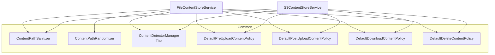

Every binary that flows through Apache Fineract — client photographs,
loan supporting documents, imported CSVs, generated reports — passes
through a small **content-store SPI**. The SPI hides the difference
between a local filesystem mount and an S3 bucket behind a single
service interface, and the wiring uses Spring's `@ConditionalOnProperty`
to pick the right implementation at boot.

## Module layout

The whole abstraction lives in `fineract-document` so it can be shared
by the document-management API and any other module that needs a place
to put files:

```text
fineract-document/src/main/java/org/apache/fineract/infrastructure/contentstore/
├── config/         ContentStoreConfig.java  (executor for processors)
├── data/           ContentStoreType.java    (S3 / FILE_SYSTEM enum)
├── detector/       Tika-based MIME detection
├── exception/      ContentStoreException, ContentPolicyException
├── policy/         Whitelist, traversal, pre/post upload, download, delete
├── processor/      Base64, GZIP, image-resize, size, data-URL processors
├── service/
│   ├── ContentStoreService.java        (interface)
│   ├── FileContentStoreService.java    (@ConditionalOnProperty filesystem)
│   └── S3ContentStoreService.java      (@ConditionalOnProperty s3)
└── util/           Path sanitisers, randomisers, content pipe
```

## The `ContentStoreService` interface

`ContentStoreService`
(`fineract-document/src/main/java/org/apache/fineract/infrastructure/contentstore/service/ContentStoreService.java`)
is the single SPI every content-store implementation must honour.
Callers — most importantly `DocumentApiResource` and `ImagesApiResource`
— talk only to this interface, so swapping storage backends is just a
matter of changing which implementation Spring activates.

The contract is intentionally narrow:

- **`String upload(String path, InputStream is, String mimeType)`** —
  persist the bytes at the requested path; return the canonical key
  that should be stored in `m_document.location` / `m_image.location`.
- **`InputStream download(String path)`** — stream the bytes back.
- **`void delete(String path)`** — remove the object.
- **`ContentStoreType getType()`** — `S3` or `FILE_SYSTEM`, used by
  callers that need to stamp `storage_type_enum` on the row.

## Implementation 1 — `FileContentStoreService`

The filesystem variant lives at
`fineract-document/src/main/java/org/apache/fineract/infrastructure/contentstore/service/FileContentStoreService.java`
and is selected by:

```java
@Service
@ConditionalOnProperty(name = "fineract.content.filesystem.enabled",
                       havingValue = "true")
public class FileContentStoreService implements ContentStoreService {

    private final ContentPathSanitizer pathSanitizer;
    private final ContentPathRandomizer pathRandomizer;
    private final DefaultDownloadContentPolicy   downloadContentPolicy;
    private final DefaultPreUploadContentPolicy  preUploadContentPolicy;
    private final DefaultPostUploadContentPolicy postUploadContentPolicy;
    private final DefaultDeleteContentPolicy     deleteContentPolicy;
    private final ContentDetectorManager         contentDetectorManager;
    private final FineractProperties             properties;
    // ...
}
```

Behaviour notes:

- The **root directory** comes from `FineractProperties` — typically
  `fineract.content.filesystem.root` (something like `/var/lib/fineract/content`).
- Every key is **sanitised** (`ContentPathSanitizer` strips
  `..`, leading slashes and shell-special characters) and **randomised**
  (`ContentPathRandomizer` adds an entropy segment so two uploads with
  the same filename don't collide).
- Uploads land in `<root>/<tenant>/<sanitised+randomised path>` —
  multi-tenancy is enforced at the path level using
  `ThreadLocalContextUtil.getTenant()`.
- All four policies (pre-upload, post-upload, download, delete) and
  the Tika detector are injected through the constructor so the same
  guarantees are honoured whether the bytes land on disk or in S3.

## Implementation 2 — `S3ContentStoreService`

The S3 variant lives at
`fineract-document/src/main/java/org/apache/fineract/infrastructure/contentstore/service/S3ContentStoreService.java`
and is selected by:

```java
@Service
@ConditionalOnProperty(name = "fineract.content.s3.enabled",
                       havingValue = "true")
public class S3ContentStoreService implements ContentStoreService {

    private final S3Client                       s3Client;
    private final ContentPathSanitizer           pathSanitizer;
    private final DefaultDownloadContentPolicy   downloadContentPolicy;
    private final DefaultPreUploadContentPolicy  preUploadContentPolicy;
    private final DefaultPostUploadContentPolicy postUploadContentPolicy;
    private final DefaultDeleteContentPolicy     deleteContentPolicy;
    private final ContentDetectorManager         contentDetectorManager;
    private final FineractProperties             properties;

    @Override
    public InputStream download(String path) {
        downloadContentPolicy.check(ContentPolicyContext.builder().path(path).build());
        final var safePath = pathSanitizer.sanitize(path);
        try {
            return s3Client.getObject(
                    GetObjectRequest.builder()
                            .bucket(properties.getContent().getS3().getBucketName())
                            .key(safePath).build(),
                    ResponseTransformer.toBytes()).asInputStream();
        } catch (Exception e) {
            throw new ContentStoreException(e);
        }
    }
}
```

Key points:

- Uses the AWS SDK v2 `S3Client` injected from
  `AmazonS3Config`
  (`fineract-provider/src/main/java/org/apache/fineract/infrastructure/s3/AmazonS3Config.java`).
- The bucket name comes from `FineractProperties.getContent().getS3().getBucketName()`,
  populated from `fineract.content.s3.bucket-name`.
- Same policy / detector pipeline as the filesystem variant — no
  branch in the documents API.

## Selection matrix

The two flags are mutually exclusive in production, but the same
property names are independent so it is possible to have *neither*
enabled (in which case the document APIs that consume
`ContentStoreService` will fail to start with an unsatisfied bean
dependency — exactly what we want).

| `fineract.content.filesystem.enabled` | `fineract.content.s3.enabled` | Active bean |
| ------------------------------------- | ----------------------------- | ----------- |
| `true`                                | unset / `false`               | `FileContentStoreService` |
| unset / `false`                       | `true`                        | `S3ContentStoreService`   |
| `true`                                | `true`                        | *startup error* — two beans implementing `ContentStoreService` |
| unset / `false`                       | unset / `false`               | *startup error* — no `ContentStoreService` bean |

## Shared infrastructure

Both implementations consume the same supporting collaborators, all
constructor-injected:



This is *the* design point: behaviour like "files traversing `..`
are rejected" or "MIME types not on the whitelist are bounced before
the bytes ever land" lives in the shared policy components, not inside
the per-backend service. Adding a new backend (Azure Blob, GCS, …) is
mostly a matter of writing a new `ContentStoreService` impl that
delegates to the same policy beans.

## A note on a "factory"

Earlier Fineract releases shipped an explicit
`ContentRepositoryFactory` that picked between
`FileSystemContentRepository` and `S3ContentRepository` based on a
configuration value at runtime. The current `fineract-document` design
folds that role into Spring itself — `@ConditionalOnProperty` on the
two implementations *is* the factory. Both classes implement the same
`ContentStoreService` interface and only one of them ever gets
registered as a bean. There is no separate factory class to maintain or
test.

## Configuration properties

The exact properties used by the two backends, as defined on
`FineractProperties.FineractContent*`:

<ResponseField name="fineract.content.filesystem.enabled" type="boolean">
Switch the filesystem implementation on. Defaults to `false` /
unset.
</ResponseField>

<ResponseField name="fineract.content.filesystem.root" type="string">
Root directory under which the filesystem store lays out
`<tenant>/<key>` paths. Must be writable by the JVM user.
</ResponseField>

<ResponseField name="fineract.content.s3.enabled" type="boolean">
Switch the S3 implementation on.
</ResponseField>

<ResponseField name="fineract.content.s3.bucket-name" type="string">
Target bucket. Lives on `FineractContentS3Properties.bucketName`.
</ResponseField>

<ResponseField name="fineract.content.s3.access-key / secret-key / region / endpoint / path-style-addressing-enabled" type="string / boolean">
Optional S3-specific tunables surfaced through `FineractContentS3Properties`
in `fineract-core/.../infrastructure/core/config/FineractProperties.java`.
Credentials normally come from the AWS default chain (see the S3 page),
so leave the access key / secret blank in production.
</ResponseField>

## Operational guidance

<AccordionGroup>
<Accordion title="Pick filesystem for single-node dev, S3 for HA production">
The filesystem backend is the easiest to set up — a single
`fineract.content.filesystem.enabled=true` plus a writable directory
— but it ties a node to its disk. For HA / Kubernetes, use the S3
backend and let the bucket replicate.
</Accordion>

<Accordion title="Run a periodic integrity check">
The post-upload policy (`DefaultPostUploadContentPolicy`) is the
right place to wire a checksum verification — read back the object
via `ContentStoreService.download(...)` and confirm its hash matches
what was streamed in. Custom deployments often extend the policy
chain with a `ChecksumContentPolicy`.
</Accordion>

<Accordion title="Migrate between backends">
Because both implementations honour the same path keys, the migration
is "for each `m_document.location`: download from old store, upload
to new store". Switching the flags makes the new store take over
without any database change.
</Accordion>

<Accordion title="Debug a missing bean at startup">
`No qualifying bean of type 'ContentStoreService'` at boot means
neither flag is set to `true`. The opposite (two matching) raises
`NoUniqueBeanDefinitionException` from Spring.
</Accordion>
</AccordionGroup>

## Related reading

- S3 content store — `AmazonS3Config`, `LocalstackS3ClientCustomizer`
  and the per-bucket properties.
- Content-store policies and processors — what runs inside
  `pre/post/upload/download/delete` and the content-processor
  pipeline.
- Document and image API — the HTTP layer that consumes the chosen
  `ContentStoreService` implementation.
