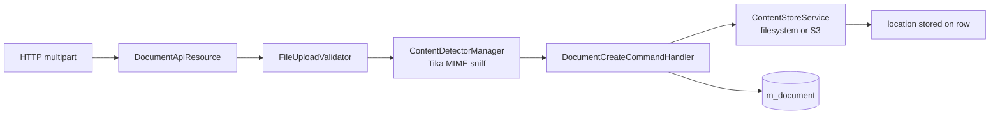
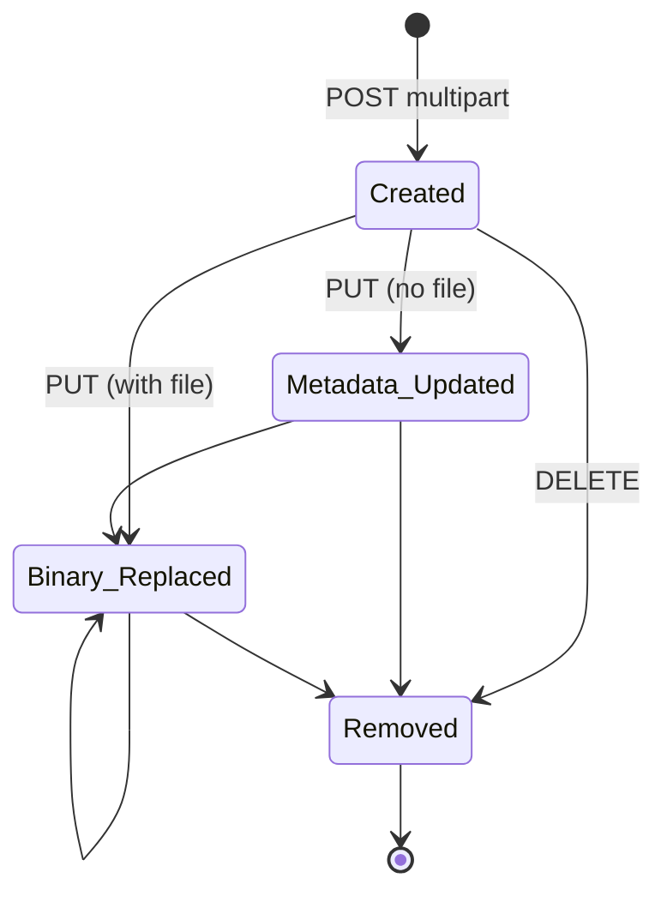

Apache Fineract gives every domain object — clients, loans, savings,
groups, offices, employees, etc. — the ability to carry **attached
documents** and **avatar images** through a single, polymorphic API. The
parent entity type is a path parameter, the binary content is streamed
through Fineract's content store (filesystem or S3), and metadata lives in
the `m_document` / `m_image` tables.

The whole feature ships as the dedicated `fineract-document` module so it
can be wired in or omitted without touching the main provider.

## Module layout

```text
fineract-document/src/main/java/org/apache/fineract/infrastructure/documentmanagement/
├── api/
│   ├── DocumentApiConstants.java
│   ├── DocumentApiResource.java
│   ├── FileUploadValidator.java
│   ├── ImageApiConstants.java
│   └── ImagesApiResource.java
├── command/                 # Create / Update / Delete commands
├── data/                    # Request / Response / Data DTOs
├── domain/
│   ├── Document.java
│   ├── DocumentRepository.java
│   ├── Image.java
│   └── ImageRepository.java
├── exception/
├── handler/                 # Command handlers
├── mapping/
└── service/                 # Read / write services
```

## The `Document` aggregate

`Document` is a Spring Data JDBC entity mapped to `m_document`
(`fineract-document/src/main/java/org/apache/fineract/infrastructure/documentmanagement/domain/Document.java`):

```java
@Table("m_document")
@Getter @Setter @NoArgsConstructor @AllArgsConstructor
@Accessors(chain = true)
@FieldNameConstants
public final class Document implements Serializable {

    @Id @Column("id") private Long id;

    @Column("parent_entity_type") private String parentEntityType;
    @Column("parent_entity_id")   private Long parentEntityId;
    @Column("name")               private String name;
    @Column("file_name")          private String fileName;
    // ... description, type, size, storage_type_enum, location
}
```

The `parent_entity_type` / `parent_entity_id` pair is the polymorphism
trick: instead of a hard FK to `m_client`, `m_loan` etc., the document
carries the *name* of the parent collection (`clients`, `loans`,
`savings`, `groups`, `offices`, `staff`, `imports`, …) along with the
parent's own primary key. The same mechanism drives `m_image` for
profile pictures.

The repository (`DocumentRepository`) lives next door and exposes the
standard Spring Data CRUD plus two derived queries used by the read
service: `findAllByParentEntityTypeAndParentEntityId(String, Long)`
backs the `GET .../documents` listing, and
`findByIdAndParentEntityTypeAndParentEntityId(Long, String, Long)`
backs the single-document lookup.

## REST surface — `DocumentApiResource`

The resource is rooted at a *templated* path so the same controller
handles every parent kind
(`fineract-document/src/main/java/org/apache/fineract/infrastructure/documentmanagement/api/DocumentApiResource.java`):

```java
@Path("/v1/{entityType}/{entityId}/documents")
```

Endpoints exposed:

| Method | Path | Purpose |
| ------ | ---- | ------- |
| GET    | `/v1/{entityType}/{entityId}/documents` | List documents for a parent |
| GET    | `/v1/{entityType}/{entityId}/documents/{documentId}` | Metadata for one document |
| GET    | `/v1/{entityType}/{entityId}/documents/{documentId}/attachment` | Stream the binary content |
| POST   | `/v1/{entityType}/{entityId}/documents` | Multipart upload — creates `Document` + content-store entry |
| PUT    | `/v1/{entityType}/{entityId}/documents/{documentId}` | Replace the binary and/or update metadata |
| DELETE | `/v1/{entityType}/{entityId}/documents/{documentId}` | Remove both row and content-store object |

Example listing:

```java
@GET
public List<DocumentData> retrieveAllDocuments(
        @PathParam(DOCUMENT_API_PARAM_ENTITY_TYPE) final String entityType,
        @PathParam(DOCUMENT_API_PARAM_ENTITY_ID)   final Long entityId) {
    // ...
}
```

`DocumentApiConstants` defines the field names used both in path
parameters and in the multipart form (`entityType`, `entityId`,
`documentId`, `name`, `description`, `file`).

### Supported parent entity types

The `{entityType}` path segment is a free-form string. Fineract's
historical convention uses the plural collection names —
`clients`, `loans`, `client_identifiers`, `staff`, `savings`,
`groups`, `offices`, `imports`, etc. — and `DocumentWritePlatformServiceImpl`
joins it into the storage key as `documents/{entityType}/{entityId}/{fileName}`.

There is **no allow-list validation** in `FileUploadValidator`; it only
asserts that `Content-Length`, the multipart input stream, the
`FormDataContentDisposition` and the `FormDataBodyPart` are present and
non-blank. The polymorphism is by convention, which is what lets the
same resource serve every Fineract aggregate without compile-time
coupling. The trade-off is that there is no foreign-key enforcement
between `m_document.parent_entity_type` and the underlying tables, and
no API-side check that the parent row actually exists.

### Multipart create

```http
POST /fineract-provider/api/v1/clients/12/documents
Content-Type: multipart/form-data; boundary=----------XYZ

------------XYZ
Content-Disposition: form-data; name="name"

Passport copy
------------XYZ
Content-Disposition: form-data; name="description"

Front page only
------------XYZ
Content-Disposition: form-data; name="file"; filename="passport.png"
Content-Type: image/png

<binary>
```

The controller wires the parts into a `DocumentCreateCommand`, which the
`CommandDispatcher` routes to the `DocumentCreateCommandHandler` under
`fineract-document/.../documentmanagement/handler/`.



## The `Image` aggregate

`Image` is the avatar-style cousin of `Document`. It is stored in
`m_image`, but unlike `Document` the entity only carries
`id`, `location` and `storage_type_enum` — there is **no
`parent_entity_type` / `parent_entity_id` on the row itself**. The
link back to the parent (client, staff, …) is held by a column on the
parent table (for example `m_client.image_id`) which is updated by an
`EntityImageIdAdapter` for each supported aggregate. At most one image
is associated per parent: a `POST` replaces whatever was there.

`ImagesApiResource`
(`fineract-document/src/main/java/org/apache/fineract/infrastructure/documentmanagement/api/ImagesApiResource.java`)
is rooted under the same parent path:

```text
/v1/{entityType}/{entityId}/images
```

and supports POST (set), GET (download — optionally Base64 / data URL
encoded, optionally resized via Tika's image processor), and DELETE.
The image API leverages the content-store **content processors**
through the static parameter names imported from the contentstore
package:

```java
import static org.apache.fineract.infrastructure.contentstore.processor.ImageResizeContentProcessor.IMAGE_RESIZE_PARAM_MAX_WIDTH;
import static org.apache.fineract.infrastructure.contentstore.processor.ImageResizeContentProcessor.IMAGE_RESIZE_PARAM_MAX_HEIGHT;
import static org.apache.fineract.infrastructure.contentstore.processor.DataUrlEncoderContentProcessor.DATA_URL_ENCODE_PARAM_ENCODING;
```

so a single GET can ask for an inline octet-stream, an attachment, or a
base64-encoded data URL — sized for a card vs. a full profile shot —
all of which are computed by the content-store pipeline (see the
content-store policies page).

## Lifecycle



- **Create.** `DocumentCreateCommandHandler` (with
  `@Retry(name = "commandDocumentCreate")`) routes to
  `DocumentWritePlatformServiceImpl.createDocument`. That service
  builds the path
  `documents/{entityType}/{entityId}/{fileName}`, calls
  `ContentStoreService.upload(...)` (which runs the pre-upload policy,
  sanitises the path, writes the bytes and runs the post-upload
  policy), persists the `Document` row with `storage_type_enum =
  store.getType().getValue()`, and emits a
  `DocumentCreatedBusinessEvent` via `BusinessEventNotifierService`.
- **Update.** `DocumentUpdateCommandHandler` is wrapped in
  `@Retry(name = "commandDocumentUpdate")`. When the PUT carries a new
  `fileName`, the handler computes the new key, **deletes the previous
  object first** (`storeService.delete(doc.getLocation())`), uploads
  the replacement, then updates the row. When the PUT carries only a
  stream (no filename change), it overwrites the existing key in
  place. No `DocumentUpdatedBusinessEvent` is emitted today —
  there is an explicit `TODO` in the source.
- **Download.** `GET /attachment` calls
  `DocumentReadPlatformService.retrieveDocumentContent(...)` which in
  turn calls `ContentStoreService.download(location)` and streams the
  result with `Content-Disposition: attachment`.
- **Delete.** `DocumentDeleteCommandHandler` (with
  `@Retry(name = "commandDocumentDelete")`) calls
  `storeService.delete(doc.getLocation())` (running
  `DefaultDeleteContentPolicy` → `TraversalContentPolicy`), removes
  the row and emits `DocumentDeletedBusinessEvent`.

## Storage location

`m_document.location` is the **path inside whichever content store**
handled the upload, not an absolute file system path. The actual
location is decided by the configured `ContentStoreService` bean:

- `FileContentStoreService`
  (`fineract-document/.../contentstore/service/FileContentStoreService.java`)
  writes under `${fineract.content.filesystem.rootFolder}/<tenantName>/<sanitized-path>`
  (the property defaults to `${user.home}/.fineract`; spaces in the
  tenant name are stripped).
- `S3ContentStoreService`
  (`fineract-document/.../contentstore/service/S3ContentStoreService.java`)
  writes the same key into the configured S3 bucket.

The provider page explains how the two services are selected by
`@ConditionalOnProperty` and how their pre/post-upload pipelines wire
in the policy and detector components.

## Validation

`FileUploadValidator`
(`fineract-document/.../documentmanagement/api/FileUploadValidator.java`)
runs before the command is dispatched. It is intentionally tiny — its
single `validate(Long contentLength, InputStream, FormDataContentDisposition, FormDataBodyPart)`
method asserts via `DataValidatorBuilder` that:

- `Content-Length` is present and `> 0` (read from the
  `Content-Length` HTTP header by the resource).
- The multipart `InputStream`, `FormDataContentDisposition` and
  `FormDataBodyPart` references are all non-null.

The validator does **not** check the entity type, the file name, the
description or the MIME type. The MIME sniff happens later in the
content-store pipeline through `TikaContentDetector`
(via `DefaultContentDetectorManager`), and `WhitelistContentPolicy`
ensures the detected MIME and the file name are on the configured
`fineract.content.regex-whitelist` and `fineract.content.mime-whitelist`.

## Image endpoints in practice

<CodeGroup>
```bash Upload avatar
curl -X POST \
  -F "file=@/tmp/avatar.png" \
  -H "Authorization: Basic ..." \
  -H "Fineract-Platform-TenantId: default" \
  https://fineract.example.com/fineract-provider/api/v1/clients/12/images
```

```bash Fetch resized as inline octet-stream
curl -G \
  --data-urlencode "maxWidth=128" \
  --data-urlencode "maxHeight=128" \
  --data-urlencode "output=inline_octet" \
  -H "Accept: application/octet-stream" \
  https://fineract.example.com/fineract-provider/api/v1/clients/12/images
```

```bash Fetch resized as base64 data URL (default text/plain response)
curl -G \
  --data-urlencode "maxWidth=128" \
  --data-urlencode "maxHeight=128" \
  -H "Accept: text/plain" \
  https://fineract.example.com/fineract-provider/api/v1/clients/12/images
```

```bash Delete avatar
curl -X DELETE \
  https://fineract.example.com/fineract-provider/api/v1/clients/12/images
```
</CodeGroup>

## Common operational tasks

<AccordionGroup>
<Accordion title="Allow a new MIME type">
Edit the whitelist in
`fineract-document/.../contentstore/policy/WhitelistContentPolicy.java`
or override the
`fineract.content.policy.whitelist.*` properties. The Tika detector
will still verify the actual bytes match.
</Accordion>

<Accordion title="Migrate document blobs from filesystem to S3">
Switch the content-store flag (`fineract.content.s3.enabled=true`,
`fineract.content.filesystem.enabled=false`) and run a one-time
migration job that streams every `m_document.location` value out of the
old store and back into the new one through `ContentStoreService` —
the database rows themselves do not need to change because the key is
the same.
</Accordion>

<Accordion title="Bulk delete documents for a closed client">
Cascade is intentionally **not** at the DB level — the polymorphic FK
isn't enforceable, and there is no automatic cleanup when a parent row
is removed. To purge attachments for a closed entity, list them via
`GET /v1/{entityType}/{entityId}/documents` and issue a
`DELETE /v1/{entityType}/{entityId}/documents/{documentId}` per row;
the handler invokes `ContentStoreService.delete(...)` and removes the
`m_document` row inside one transaction.
</Accordion>

<Accordion title="Hot-swap a profile picture without breaking the URL">
`POST /v1/{entityType}/{entityId}/images` is idempotent for the same
parent — it replaces the binary and the row in place. Existing GET
URLs continue to work and serve the new bytes on the next download.
</Accordion>
</AccordionGroup>

## Related reading

- Content-store providers — see the next page for how the filesystem
  and S3 implementations are selected.
- S3 content store — environment-driven configuration and Localstack
  testing.
- Content-store policies / detectors / processors — the whitelist,
  Tika sniffing, traversal guard and image-resize pipeline that this
  API plugs into.
