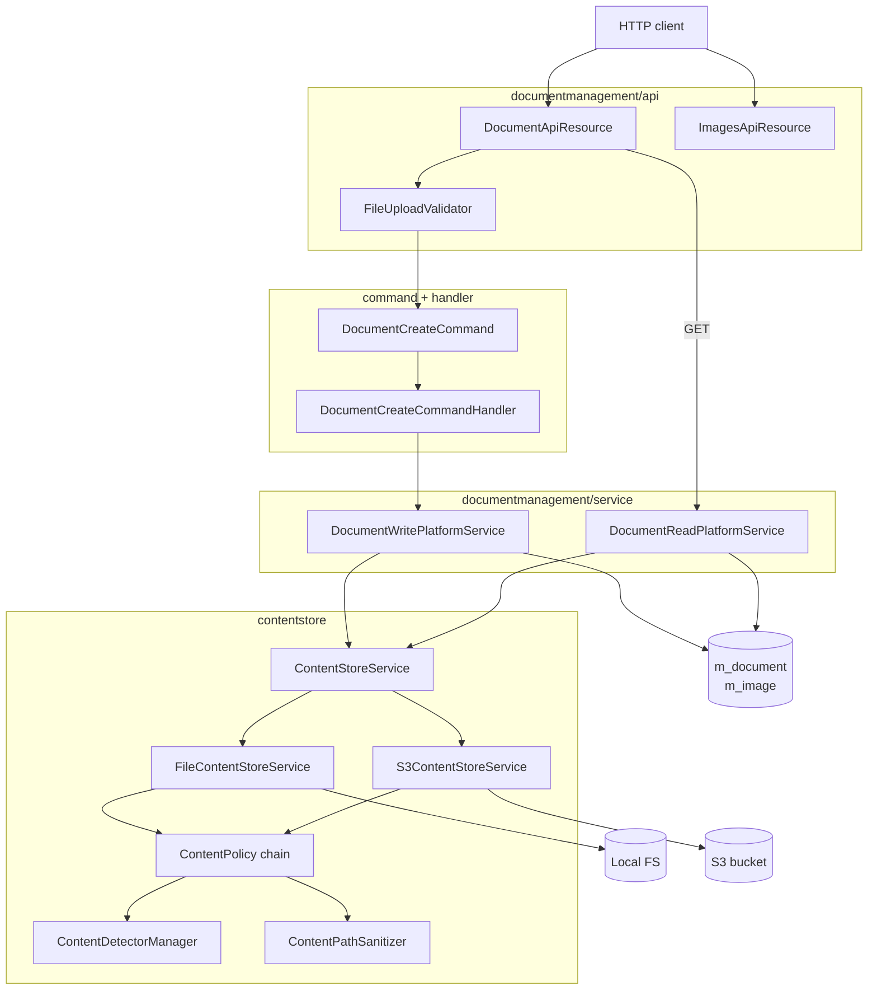
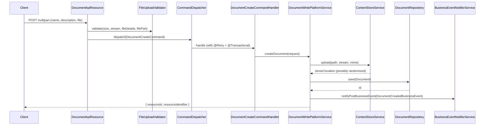

Apache Fineract lets users attach files — KYC scans, signed loan agreements, photo IDs, statements, signature images — to almost every business entity the platform tracks: clients, groups, staff, loans, savings, share accounts, client identifiers. Behind that very plain "upload a file" UX sits a fairly opinionated subsystem split into two halves: a **document-management** facade that owns the `m_document` and `m_image` rows in the database and the `/v1/{entityType}/{entityId}/documents` and `/v1/{entityType}/{entityId}/images` REST resources, and a **content store** that abstracts the actual bytes behind a `ContentStoreService` interface with `FILE_SYSTEM` and `S3` implementations. Around that core, Fineract layers Apache Tika–driven MIME detection, regex and MIME whitelists, path-traversal guards, randomized path segments, and a small functional pipeline of stream `ContentProcessor`s for things like Base64, data-URL, gzip, and image resize. This page is the entry point — it maps the Gradle module, lists the packages, and explains how an HTTP multipart upload flows from `DocumentApiResource` all the way down to S3 or the local filesystem.

## Gradle module

The code lives in its own Gradle module:

```
fineract-document/
└── src/main/java/org/apache/fineract/infrastructure/
    ├── contentstore/
    │   ├── config/        // ContentStoreConfig (executor for piped streams)
    │   ├── data/          // ContentStoreType enum (FILE_SYSTEM=1, S3=2)
    │   ├── detector/      // ContentDetector + Tika / Files.probeContentType
    │   ├── exception/     // ContentStoreException, ContentPolicyException, …
    │   ├── policy/        // ContentPolicy + pre/post/download/delete defaults
    │   ├── processor/     // ContentProcessor + Base64 / gzip / image resize / …
    │   ├── service/       // ContentStoreService + File and S3 implementations
    │   └── util/          // ContentPathSanitizer, ContentPathRandomizer, ContentPipe
    ├── documentmanagement/
    │   ├── api/           // DocumentApiResource, ImagesApiResource, FileUploadValidator
    │   ├── command/       // DocumentCreate/Update/DeleteCommand, ImageCreate/DeleteCommand
    │   ├── data/          // DocumentData, DocumentContent, *Request, *Response DTOs
    │   ├── domain/        // Document, Image entities + Spring Data repositories
    │   ├── exception/     // DocumentNotFoundException, DocumentInvalidRequestException
    │   ├── handler/       // CommandHandlers wired to CommandDispatcher
    │   ├── mapping/       // DocumentMapper (MapStruct)
    │   └── service/       // DocumentRead/Write & ImageRead/Write platform services
    └── event/business/domain/document/
        ├── DocumentBusinessEvent
        ├── DocumentCreatedBusinessEvent
        └── DocumentDeletedBusinessEvent
```

S3 client construction lives outside `fineract-document` to keep the AWS SDK off the module's compile-time classpath:

```
fineract-provider/src/main/java/org/apache/fineract/infrastructure/
├── core/config/ContentS3Config.java       // S3Client bean for content (conditional)
└── s3/
    ├── AmazonS3Config.java                 // S3Client bean for report export
    ├── AmazonS3ConfigCondition.java
    ├── S3ClientCustomizer.java             // SPI for endpoint / region tweaks
    └── LocalstackS3ClientCustomizer.java   // Test profile → AWS_ENDPOINT_URL
```

## High-level architecture

The runtime is a layered call chain. The REST resource validates the multipart form, builds a typed `*Request`, wraps it in a `Command`, and dispatches it through Fineract's `CommandDispatcher`. The matching `CommandHandler` invokes a `WritePlatformService` which talks to `ContentStoreService` to persist the bytes and to `DocumentRepository` to persist the row. Reads bypass the command bus and go directly through `DocumentReadPlatformService` to the repository and the store.



`ContentStoreService` is the seam. Fineract picks exactly **one** implementation per process based on Spring's `@ConditionalOnProperty`:

| Property                            | Default | Bean activated                                             |
| ----------------------------------- | ------- | ---------------------------------------------------------- |
| `fineract.content.filesystem.enabled` | `true`  | `FileContentStoreService` (`ContentStoreType.FILE_SYSTEM`) |
| `fineract.content.s3.enabled`         | `false` | `S3ContentStoreService` + `ContentS3Config#contentS3Client` |

Only one should ever be `true` at a time. Whichever wins is the singleton that gets autowired into `DocumentWritePlatformServiceImpl`, `DocumentReadPlatformServiceImpl`, `ImageWritePlatformServiceImpl`, and `ImageReadPlatformServiceImpl`. The chosen store's `getType()` (an enum value of `1` or `2`) is written into `m_document.storage_type_enum` so each row knows which backend it came from.

## ContentStoreService — the storage SPI

The pluggable seam is small on purpose. From `contentstore/service/ContentStoreService.java`:

```java
public interface ContentStoreService {
    String EXTENSION_REGEX = "^.+\\..+$";
    String DELIMITER = "/";

    InputStream download(String path);
    String upload(String path, InputStream is, String mimeType);
    void delete(String path);
    ContentStoreType getType();

    default String getDelimiter() { return DELIMITER; }
}
```

The contract is intentionally byte-oriented and stateless. Callers compose logical paths themselves — `DocumentWritePlatformServiceImpl` joins `documents/{entityType}/{entityId}/{fileName}` with the store's delimiter, and `ImageWritePlatformServiceImpl` joins `images/{entityType}/{entityId}/{fileName}`. The `upload` method returns the final relative path, which is what's stored in `m_document.location` / `m_image.location`. The path returned by `upload` may differ from the path passed in: `FileContentStoreService` injects a randomized 16-character directory into the path when the file does not already exist, to prevent file enumeration; `S3ContentStoreService` returns the sanitized key unchanged.

Both implementations sandwich their I/O between `ContentPolicy` checks:

```
upload(path, is, mime)
  ├─ DefaultPreUploadContentPolicy.check     // TraversalContentPolicy + WhitelistContentPolicy
  ├─ ContentPathSanitizer.sanitize           // normalize ../ etc.
  ├─ <write bytes to backend>
  └─ DefaultPostUploadContentPolicy.check    // MimeContentPolicy (Tika magic vs declared MIME)

download(path)
  ├─ DefaultDownloadContentPolicy.check      // TraversalContentPolicy
  ├─ ContentPathSanitizer.sanitize
  └─ <read bytes from backend>

delete(path)
  ├─ DefaultDeleteContentPolicy.check        // TraversalContentPolicy
  ├─ ContentPathSanitizer.sanitize
  └─ <delete from backend>
```

If the post-upload policy fails (the magic bytes do not match the declared MIME type), the freshly written file is rolled back via `delete(...)` and a `ContentPolicyException` is thrown.

## DocumentManagementApi facade

The HTTP surface is two JAX-RS resources:

| Resource              | Path template                                | Notes                                                                                  |
| --------------------- | -------------------------------------------- | -------------------------------------------------------------------------------------- |
| `DocumentApiResource` | `/v1/{entityType}/{entityId}/documents`      | Full CRUD on the `Document` aggregate. Multi-document per parent. Streaming download. |
| `ImagesApiResource`   | `/v1/{entityType}/{entityId}/images`         | Legacy single-image-per-parent surface (`@Deprecated`). Resize + base64/data-URL.     |

Both resources sit in front of the same command/handler/service stack. The difference is mainly persistence: documents go into `m_document` and many can exist per parent entity; images go into `m_image` and at most one is associated per parent (via `EntityImageIdAdapter`s that update a parent column like `clients.image_id`).

The `entityType` path parameter is just a free-form string — the API documentation lists `clients`, `staff`, `loans`, `savings`, `client_identifiers`, and `groups` as the supported values. There is **no FK enforcement** between `m_document.parent_entity_type` / `parent_entity_id` and the underlying tables; the polymorphism is by convention, which is what makes the same resource work for every Fineract aggregate.

## Lifecycle and business events

Successful creates and deletes go through `BusinessEventNotifierService`:



Updates do **not** emit a business event (see the `TODO` in `DocumentWritePlatformServiceImpl#updateDocument`). Deletes emit `DocumentDeletedBusinessEvent`. The handlers are annotated with `@Retry(name = "commandDocument...")` so transient failures (typically S3 timeouts) are retried per the resilience4j configuration.

## Where to read next

The remaining pages drill into each layer in detail:

- **[Document Management API](/document/document-management-api)** — the `Document` and `Image` entities, the full REST surface (`DocumentApiResource`, `ImagesApiResource`), the multipart form, command/handler/service wiring, and the polymorphic parent entity model.
- **[Content Store Providers](/document/content-store-providers)** — the `ContentStoreService` SPI, the file-system and S3 implementations, how Spring picks one via `@ConditionalOnProperty`, and the path layout each backend writes.
- **[S3 Content Store](/document/s3-content-store)** — `ContentS3Config`, `AmazonS3Config`, `LocalstackS3ClientCustomizer`, the credential / region / endpoint resolution rules, and the full set of `fineract.content.s3.*` properties.
- **[Content Store Policies and Processors](/document/content-store-policies-and-processors)** — the MIME / Tika detector chain, the pre-/post-upload `ContentPolicy` pipeline, the regex and MIME whitelists, path sanitization, and the streaming `ContentProcessor` library used by the image API (Base64, data URL, gzip, image resize, size counter).

## Module dependencies at a glance

A few cross-module touchpoints matter when reading the code:

- `fineract-document` depends on `fineract-core` for `FineractProperties` and command-bus infrastructure, and on `fineract-command` for `Command` / `CommandHandler` / `CommandDispatcher`.
- `fineract-document` does **not** depend on the AWS SDK directly. The `S3Client` bean is contributed by `fineract-provider`'s `ContentS3Config` and injected into `S3ContentStoreService`. This keeps S3 optional for downstream packagers.
- Apache Tika (`org.apache.tika:tika-core`) ships with `fineract-document` itself, because MIME detection is part of every upload path regardless of backend.
- `ContentStoreConfig` defines a single `@Bean("contentProcessorExecutor")` of `Executors.newCachedThreadPool()` that powers `ContentPipe`'s background pumping of `PipedInputStream` / `PipedOutputStream` pairs, which is how the streaming processors avoid buffering whole files in heap.

Once you have this map, the other four pages each focus on one slice without re-explaining the whole pipeline.
