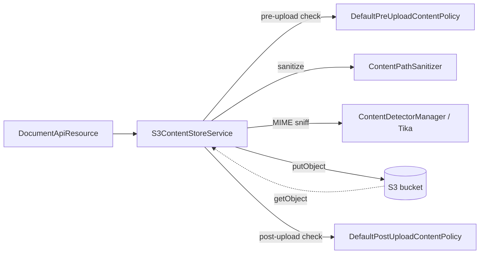

When Apache Fineract is deployed for high availability, the natural
content-store backend is S3 — every node sees the same bucket, the
infrastructure team gets versioning and replication for free, and the
filesystem on each pod becomes purely ephemeral. The wiring is split
across two modules: the **content-store `S3Client` bean** in
`fineract-provider/.../infrastructure/core/config/ContentS3Config.java`,
and the **content-store service** in
`fineract-document/.../contentstore/service/S3ContentStoreService.java`.

Note that `fineract-provider` also ships a *second* unrelated
`S3Client` configuration in
`fineract-provider/.../infrastructure/s3/AmazonS3Config.java`. That one
powers the **datatable report export** feature
(`S3DatatableReportExportServiceImpl`) — it reads from
`fineract.report.export.s3.*` properties, not from
`fineract.content.s3.*`, and is gated by a separate
`AmazonS3ConfigCondition`. The two pipelines do not share a client
bean.

## Module layout

```text
fineract-provider/src/main/java/org/apache/fineract/infrastructure/
├── core/config/
│   └── ContentS3Config.java           # @Bean S3Client contentS3Client - for the content store
└── s3/
    ├── AmazonS3Config.java            # @Bean("s3Client") - for report export (separate)
    ├── AmazonS3ConfigCondition.java
    ├── S3ClientCustomizer.java        # SPI used only by AmazonS3Config
    └── LocalstackS3ClientCustomizer.java

fineract-document/src/main/java/org/apache/fineract/infrastructure/contentstore/
├── service/S3ContentStoreService.java # Consumes S3Client; @ConditionalOnProperty
├── data/ContentStoreType.java
└── (policy, detector, processor packages)
```

The S3 properties themselves live on `FineractProperties` in
`fineract-core/src/main/java/org/apache/fineract/infrastructure/core/config/FineractProperties.java`:

```java
@Getter @Setter
public static class FineractContentS3Properties {
    private Boolean enabled;
    private String bucketName;
    private String accessKey;
    private String secretKey;
    private String region;
    private String endpoint;
    private Boolean pathStyleAddressingEnabled;
}
```

## `ContentS3Config` — the content-store `S3Client` bean

`ContentS3Config`
(`fineract-provider/src/main/java/org/apache/fineract/infrastructure/core/config/ContentS3Config.java`)
is the Spring `@Configuration` that produces the
`software.amazon.awssdk.services.s3.S3Client` that
`S3ContentStoreService` autowires. The whole class is small:

```java
@Configuration
public class ContentS3Config {

    @Bean
    @ConditionalOnProperty("fineract.content.s3.enabled")
    public S3Client contentS3Client(FineractProperties fineractProperties) {
        S3ClientBuilder builder = S3Client.builder()
                .credentialsProvider(getCredentialProvider(fineractProperties.getContent().getS3()));

        if (!Strings.isNullOrEmpty(fineractProperties.getContent().getS3().getRegion())) {
            builder.region(Region.of(fineractProperties.getContent().getS3().getRegion()));
        }
        if (!Strings.isNullOrEmpty(fineractProperties.getContent().getS3().getEndpoint())) {
            builder.endpointOverride(URI.create(fineractProperties.getContent().getS3().getEndpoint()))
                    .forcePathStyle(fineractProperties.getContent().getS3().getPathStyleAddressingEnabled());
        }

        return builder.build();
    }

    private AwsCredentialsProvider getCredentialProvider(FineractProperties.FineractContentS3Properties s3Properties) {
        if (Strings.isNullOrEmpty(s3Properties.getAccessKey()) || Strings.isNullOrEmpty(s3Properties.getSecretKey())) {
            return DefaultCredentialsProvider.create();
        }

        return StaticCredentialsProvider.create(
                AwsBasicCredentials.create(s3Properties.getAccessKey(), s3Properties.getSecretKey()));
    }
}
```

Three things to notice:

1. **Credentials resolution.** If *both* `fineract.content.s3.accessKey`
   and `fineract.content.s3.secretKey` are non-empty, a
   `StaticCredentialsProvider` is built from them. Otherwise the AWS SDK
   `DefaultCredentialsProvider.create()` chain is used: env vars
   (`AWS_ACCESS_KEY_ID` / `AWS_SECRET_ACCESS_KEY`), container/IRSA,
   profile file, instance metadata.
2. **Region.** Only set on the builder when `fineract.content.s3.region`
   is non-empty. When blank, the SDK uses its own default region
   provider chain (`AWS_REGION` / profile / IMDS).
3. **Endpoint override.** When `fineract.content.s3.endpoint` is
   non-empty, the builder calls `endpointOverride(...)` *and*
   `forcePathStyle(fineract.content.s3.path-style-addressing-enabled)`.
   This is how Fineract talks to Localstack, MinIO or any other
   S3-compatible store. There is no `S3ClientCustomizer` SPI on the
   content-store path — the customizer mechanism only applies to
   `AmazonS3Config` (report-export).

## Localstack for tests

The report-export `AmazonS3Config` and its `LocalstackS3ClientCustomizer`
(both in `fineract-provider/.../infrastructure/s3/`) do not affect the
content-store S3 client. For the content store, the same redirection is
expressed through plain properties:

```properties
fineract.content.s3.enabled=true
fineract.content.s3.endpoint=http://localhost:4566
fineract.content.s3.path-style-addressing-enabled=true
fineract.content.s3.region=us-east-1
fineract.content.s3.accessKey=test
fineract.content.s3.secretKey=test
fineract.content.s3.bucketName=fineract-content
```

For reference, the report-export side uses a customizer
(`fineract-provider/src/main/java/org/apache/fineract/infrastructure/s3/LocalstackS3ClientCustomizer.java`):

```java
@Component
@RequiredArgsConstructor
@Profile(FineractProfiles.TEST)
public class LocalstackS3ClientCustomizer implements S3ClientCustomizer {

    private final Environment environment;

    @Override
    public void customize(S3ClientBuilder builder) {
        String env = environment.getProperty("AWS_ENDPOINT_URL", "");
        if (StringUtil.isNotBlank(env)) {
            builder.endpointOverride(URI.create(env)).forcePathStyle(true);
        }
    }
}
```

`AWS_ENDPOINT_URL` is the Localstack convention. The `@Profile(TEST)`
guard keeps the customizer out of production deployments. Again: this
hook does **not** alter the content-store client — for that you set the
`fineract.content.s3.endpoint` property directly.

## `S3ContentStoreService`

The content-store implementation lives in `fineract-document` and is
the consumer of the `S3Client` bean. From
`fineract-document/src/main/java/org/apache/fineract/infrastructure/contentstore/service/S3ContentStoreService.java`:

```java
@Slf4j
@RequiredArgsConstructor
@Service
@ConditionalOnProperty(name = "fineract.content.s3.enabled", havingValue = "true")
public class S3ContentStoreService implements ContentStoreService {

    private final S3Client s3Client;
    private final ContentPathSanitizer pathSanitizer;
    private final DefaultDownloadContentPolicy   downloadContentPolicy;
    private final DefaultPreUploadContentPolicy  preUploadContentPolicy;
    private final DefaultPostUploadContentPolicy postUploadContentPolicy;
    private final DefaultDeleteContentPolicy     deleteContentPolicy;
    private final ContentDetectorManager         contentDetectorManager;
    private final FineractProperties             properties;
```

The download path shows the typical interaction with the SDK:

```java
@Override
public InputStream download(String path) {
    downloadContentPolicy.check(ContentPolicyContext.builder().path(path).build());
    final var safePath = pathSanitizer.sanitize(path);
    try {
        return s3Client
                .getObject(GetObjectRequest.builder()
                        .bucket(properties.getContent().getS3().getBucketName())
                        .key(safePath).build(),
                        ResponseTransformer.toBytes())
                .asInputStream();
    } catch (Exception e) {
        throw new ContentStoreException(e);
    }
}
```

Upload follows the same pattern: validate via `preUploadContentPolicy`,
sanitise the key, push the bytes with `PutObjectRequest` +
`RequestBody.fromInputStream(...)`, then run `postUploadContentPolicy`.



## Boot-time activation

A node activates the S3 content store when `fineract.content.s3.enabled=true`
is set. That single flag drives two `@ConditionalOnProperty` guards:

- `ContentS3Config.contentS3Client(...)` registers the `S3Client` bean.
- `S3ContentStoreService` is instantiated as the `ContentStoreService`
  implementation.

To avoid two `ContentStoreService` beans, set
`fineract.content.filesystem.enabled=false` at the same time — the
default is `true`.

If the AWS credentials/region cannot be resolved at runtime
(no static credentials, no env vars, no instance profile), the failure
surfaces on the first S3 call rather than at boot, because both the
default credentials provider and the default region provider are lazy.

## Configuration reference

The full set of properties consumed under `fineract.content.s3`, as
declared on `FineractProperties.FineractContentS3Properties`:

<ResponseField name="enabled" type="boolean">
Toggle the entire S3 backend. Drives the `@ConditionalOnProperty`
guards on both `ContentS3Config#contentS3Client` and
`S3ContentStoreService`. Defaults to `false`.
</ResponseField>

<ResponseField name="bucketName" type="string">
Target bucket. Used as `.bucket(...)` in every `GetObjectRequest` /
`PutObjectRequest` / `DeleteObjectRequest`. No `ListBucket` calls are
made at runtime.
</ResponseField>

<ResponseField name="accessKey / secretKey" type="string">
When *both* are non-empty, a `StaticCredentialsProvider` backed by
`AwsBasicCredentials` is built. When either is empty,
`DefaultCredentialsProvider.create()` is used (env vars, IRSA,
instance profile, profile file). Leave both blank in production and
rely on the default chain.
</ResponseField>

<ResponseField name="region" type="string">
When non-empty, sets `Region.of(region)` on the builder. When blank,
the SDK default region chain (`AWS_REGION` / profile / IMDS) is used.
</ResponseField>

<ResponseField name="endpoint" type="string">
When non-empty, calls `endpointOverride(URI.create(endpoint))` on the
`S3ClientBuilder`. Use for Localstack, MinIO, Wasabi or any other
S3-compatible store.
</ResponseField>

<ResponseField name="pathStyleAddressingEnabled" type="boolean">
Only consulted when `endpoint` is also set. Passed straight to
`forcePathStyle(...)` on the builder. Defaults to `false`.
</ResponseField>

## Worked example — Localstack integration test

```bash
# Spin up Localstack
docker run --rm -p 4566:4566 -e SERVICES=s3 localstack/localstack

# Create the bucket once
aws --endpoint-url=http://localhost:4566 s3 mb s3://fineract-content

# Point the content store at Localstack
export FINERACT_CONTENT_FILESYSTEM_ENABLED=false
export FINERACT_CONTENT_S3_ENABLED=true
export FINERACT_CONTENT_S3_BUCKET_NAME=fineract-content
export FINERACT_CONTENT_S3_ENDPOINT=http://localhost:4566
export FINERACT_CONTENT_S3_PATH_STYLE_ADDRESSING_ENABLED=true
export FINERACT_CONTENT_S3_REGION=us-east-1
export FINERACT_CONTENT_S3_ACCESS_KEY=test
export FINERACT_CONTENT_S3_SECRET_KEY=test
./gradlew :fineract-provider:bootRun
```

These env vars correspond one-to-one with the placeholders in
`fineract-provider/src/main/resources/application.properties` (e.g.
`fineract.content.s3.bucketName=${FINERACT_CONTENT_S3_BUCKET_NAME:}`).

What happens on boot:

1. `fineract.content.s3.enabled=true` triggers
   `ContentS3Config.contentS3Client(...)`, which sees the static
   `accessKey` / `secretKey`, builds a `StaticCredentialsProvider`,
   sets `Region.of("us-east-1")`, calls
   `endpointOverride(URI.create("http://localhost:4566"))` and
   `forcePathStyle(true)`.
2. The same flag triggers `@ConditionalOnProperty` on
   `S3ContentStoreService`, which is registered as the
   `ContentStoreService` bean.
3. `fineract.content.filesystem.enabled=false` keeps
   `FileContentStoreService` out of the context so there is no
   `NoUniqueBeanDefinitionException`.
4. Document and Image API uploads land as keys in the
   `fineract-content` bucket.

## Production checklist

<AccordionGroup>
<Accordion title="Credentials">
Use IRSA on EKS, instance-profile on EC2, or workload identity on
GKE — never put the bucket's access key in `application.properties`.
`ContentS3Config.getCredentialProvider(...)` only falls back to
static credentials when **both** `fineract.content.s3.accessKey` and
`fineract.content.s3.secretKey` are non-empty, so leaving them blank
in production automatically selects `DefaultCredentialsProvider`.
</Accordion>

<Accordion title="Bucket policy">
Grant `s3:GetObject`, `s3:PutObject`, `s3:DeleteObject` on the
content prefix. Fineract does not need `ListBucket` at runtime — the
keys are stored on `m_document.location`.
</Accordion>

<Accordion title="Encryption at rest">
Configure SSE-KMS on the bucket. The SDK adds the required headers
transparently — no code change needed in
`S3ContentStoreService`.
</Accordion>

<Accordion title="Versioning and lifecycle">
Enable versioning to make deletes recoverable, and add a lifecycle
rule that transitions infrequently-accessed objects to S3
Infrequent-Access or Glacier. Fineract reads keys, not version IDs,
so the current version is always served.
</Accordion>

<Accordion title="Multi-tenancy">
The store does not segment by tenant on its own. If multiple tenants
share a deployment, either pre-fix every path with the tenant
identifier inside `ContentPathSanitizer`, or run one bucket per
tenant.
</Accordion>
</AccordionGroup>

## Related reading

- Content-store providers — selection between filesystem and S3.
- Content-store policies and processors — what the
  `preUploadContentPolicy`, `postUploadContentPolicy` and
  `downloadContentPolicy` actually enforce.
- Document and Image API — the HTTP layer that consumes
  `S3ContentStoreService`.
