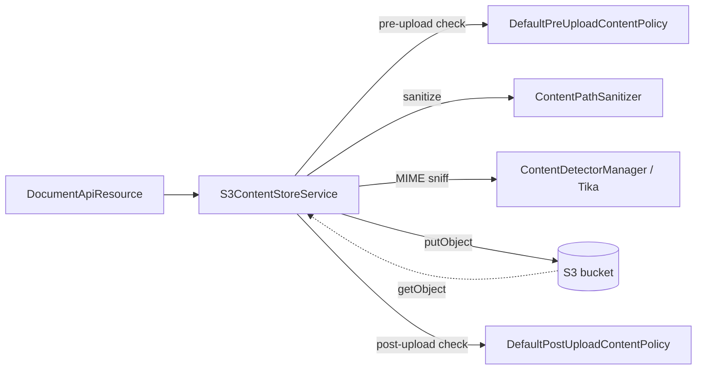

When Apache Fineract is deployed for high availability, the natural
content-store backend is S3 — every node sees the same bucket, the
infrastructure team gets versioning and replication for free, and the
filesystem on each pod becomes purely ephemeral. The wiring is split
across two modules: the **shared AWS SDK configuration** in
`fineract-provider/.../infrastructure/s3/`, and the **content-store
service** in `fineract-document/.../contentstore/service/`.

## Module layout

```text
fineract-provider/src/main/java/org/apache/fineract/infrastructure/s3/
├── AmazonS3Config.java                # Defines the S3Client bean
├── AmazonS3ConfigCondition.java       # PropertiesCondition driving @Conditional
├── S3ClientCustomizer.java            # SPI for builder tweaks
└── LocalstackS3ClientCustomizer.java  # Test-profile customizer

fineract-document/src/main/java/org/apache/fineract/infrastructure/contentstore/
├── service/S3ContentStoreService.java # Consumes S3Client; @ConditionalOnProperty
├── data/ContentStoreType.java
└── (policy, detector, processor packages)
```

The S3 properties themselves live on `FineractProperties` in
`fineract-core/src/main/java/org/apache/fineract/infrastructure/core/config/FineractProperties.java`:

```java
@Getter @Setter
public static class FineractContentS3Properties {
    private Boolean enabled;
    private String bucketName;
    private String accessKey;
    private String secretKey;
    private String region;
    private String endpoint;
    private Boolean pathStyleAddressingEnabled;
}
```

## `AmazonS3Config` — the `S3Client` bean

`AmazonS3Config`
(`fineract-provider/src/main/java/org/apache/fineract/infrastructure/s3/AmazonS3Config.java`)
is the single Spring `@Configuration` that produces an
`software.amazon.awssdk.services.s3.S3Client`. The decisive lines:

```java
@Configuration
@Conditional(AmazonS3ConfigCondition.class)
public class AmazonS3Config {

    @Bean
    public DefaultCredentialsProvider awsCredentialsProvider() {
        return DefaultCredentialsProvider.create();
    }

    @Bean
    public AwsRegionProvider awsRegionProvider() {
        return DefaultAwsRegionProviderChain.builder().build();
    }

    @Bean("s3Client")
    public S3Client s3Client(DefaultCredentialsProvider awsCredentialsProvider,
                             AwsRegionProvider awsRegionProvider,
                             List<S3ClientCustomizer> customizers) {
        S3ClientBuilder builder = S3Client.builder()
                .credentialsProvider(awsCredentialsProvider)
                .region(awsRegionProvider.getRegion());
        customizers.forEach(customizer -> customizer.customize(builder));
        return builder.build();
    }
    // ...
}
```

Three things to notice:

1. **Default credentials chain** — Fineract uses
   `DefaultCredentialsProvider.create()`, which walks the standard AWS
   chain: env vars (`AWS_ACCESS_KEY_ID` / `AWS_SECRET_ACCESS_KEY`),
   container/IRSA, profile file, instance metadata. There is **no
   hard-coded fallback to `accessKey` / `secretKey` properties** in
   `FineractContentS3Properties`; those exist on the type for downstream
   customizers but the default config defers to the SDK chain.
2. **Default region chain** — same story for the region:
   `AWS_REGION`/`AWS_DEFAULT_REGION`, profile, then instance metadata.
3. **Customizer hook** — every bean implementing `S3ClientCustomizer`
   gets a chance to tweak the builder. This is how the test profile
   redirects the client to Localstack without redefining the bean.

## `S3ClientCustomizer` and Localstack

`S3ClientCustomizer` is a tiny SPI:

```java
public interface S3ClientCustomizer {
    void customize(S3ClientBuilder builder);
}
```

The platform ships one implementation
(`fineract-provider/src/main/java/org/apache/fineract/infrastructure/s3/LocalstackS3ClientCustomizer.java`):

```java
@Component
@RequiredArgsConstructor
@Profile(FineractProfiles.TEST)
public class LocalstackS3ClientCustomizer implements S3ClientCustomizer {

    private final Environment environment;

    @Override
    public void customize(S3ClientBuilder builder) {
        String env = environment.getProperty("AWS_ENDPOINT_URL", "");
        if (StringUtil.isNotBlank(env)) {
            builder.endpointOverride(URI.create(env)).forcePathStyle(true);
        }
    }
}
```

What this gives you:

- The `@Profile(FineractProfiles.TEST)` guard keeps the customizer out
  of production deployments.
- When `AWS_ENDPOINT_URL` is set (the Localstack convention), every
  call goes there instead of the public AWS endpoint.
- `forcePathStyle(true)` switches the URL pattern from
  `<bucket>.s3.amazonaws.com/...` to `<endpoint>/<bucket>/...`, which
  is what Localstack actually expects.

So integration tests can simply set `AWS_ENDPOINT_URL=http://localhost:4566`
plus the usual access-key env vars (Localstack accepts anything), and
the same `S3ContentStoreService` exercised in production runs against
the local stub.

## `S3ContentStoreService`

The content-store implementation lives in `fineract-document` and is
the consumer of the `S3Client` bean. From
`fineract-document/src/main/java/org/apache/fineract/infrastructure/contentstore/service/S3ContentStoreService.java`:

```java
@Slf4j
@RequiredArgsConstructor
@Service
@ConditionalOnProperty(name = "fineract.content.s3.enabled", havingValue = "true")
public class S3ContentStoreService implements ContentStoreService {

    private final S3Client s3Client;
    private final ContentPathSanitizer pathSanitizer;
    private final DefaultDownloadContentPolicy   downloadContentPolicy;
    private final DefaultPreUploadContentPolicy  preUploadContentPolicy;
    private final DefaultPostUploadContentPolicy postUploadContentPolicy;
    private final DefaultDeleteContentPolicy     deleteContentPolicy;
    private final ContentDetectorManager         contentDetectorManager;
    private final FineractProperties             properties;
```

The download path shows the typical interaction with the SDK:

```java
@Override
public InputStream download(String path) {
    downloadContentPolicy.check(ContentPolicyContext.builder().path(path).build());
    final var safePath = pathSanitizer.sanitize(path);
    try {
        return s3Client
                .getObject(GetObjectRequest.builder()
                        .bucket(properties.getContent().getS3().getBucketName())
                        .key(safePath).build(),
                        ResponseTransformer.toBytes())
                .asInputStream();
    } catch (Exception e) {
        throw new ContentStoreException(e);
    }
}
```

Upload follows the same pattern: validate via `preUploadContentPolicy`,
sanitise the key, push the bytes with `PutObjectRequest` +
`RequestBody.fromInputStream(...)`, then run `postUploadContentPolicy`.



## Boot-time activation

A node activates the S3 backend when both of the following are true:

- `AmazonS3ConfigCondition` (driven by the surrounding Fineract S3
  property block) reports that the AWS configuration is present —
  `AmazonS3Config` then builds an `S3Client` bean.
- `fineract.content.s3.enabled=true` is set, which triggers the
  `@ConditionalOnProperty` on `S3ContentStoreService` so the bean is
  registered as the implementation of `ContentStoreService`.

If the flag is on but the AWS config is missing, Spring fails fast
with an unsatisfied `S3Client` dependency — which is the desired
behaviour, because the alternative is silent fall-back to the
filesystem store.

## Configuration reference

The full set of properties consumed under `fineract.content.s3`:

<ResponseField name="enabled" type="boolean">
Toggle the entire S3 backend. Maps to `FineractContentS3Properties.enabled`
and to the `@ConditionalOnProperty` on `S3ContentStoreService`.
</ResponseField>

<ResponseField name="bucket-name" type="string">
Target bucket. Used directly in `GetObjectRequest` / `PutObjectRequest`
keys.
</ResponseField>

<ResponseField name="access-key / secret-key" type="string">
Surfaced on the properties type for custom builds that want to bypass
the default chain. The stock `AmazonS3Config` ignores them — for
production deployments leave both blank and use IRSA, instance-profile
or env-var credentials.
</ResponseField>

<ResponseField name="region" type="string">
Surfaced on the properties type. The stock `AmazonS3Config` defers to
the AWS default region chain.
</ResponseField>

<ResponseField name="endpoint" type="string">
For custom builds that need to point at S3-compatible storage from
production (MinIO, Wasabi). The bundled `LocalstackS3ClientCustomizer`
uses the dedicated `AWS_ENDPOINT_URL` env var instead so it can stay
test-only.
</ResponseField>

<ResponseField name="path-style-addressing-enabled" type="boolean">
For non-AWS / on-prem object stores that don't support virtual-hosted
URLs. Localstack flips this on automatically inside the customizer.
</ResponseField>

## Worked example — Localstack integration test

```bash
# Spin up Localstack
docker run --rm -p 4566:4566 -e SERVICES=s3 localstack/localstack

# Create the bucket once
aws --endpoint-url=http://localhost:4566 s3 mb s3://fineract-content

# Run Fineract with the TEST profile + the S3 store
export SPRING_PROFILES_ACTIVE=test
export AWS_ENDPOINT_URL=http://localhost:4566
export AWS_ACCESS_KEY_ID=test
export AWS_SECRET_ACCESS_KEY=test
export AWS_REGION=us-east-1
export FINERACT_CONTENT_S3_ENABLED=true
export FINERACT_CONTENT_S3_BUCKET_NAME=fineract-content
./gradlew :fineract-provider:bootRun
```

What happens on boot:

1. `AmazonS3Config` is activated by `AmazonS3ConfigCondition`.
2. `LocalstackS3ClientCustomizer` is picked up (TEST profile).
3. `LocalstackS3ClientCustomizer.customize(builder)` calls
   `endpointOverride(URI.create("http://localhost:4566"))` and
   `forcePathStyle(true)`.
4. `S3ContentStoreService` is registered because
   `fineract.content.s3.enabled=true`, and `ContentStoreService`
   becomes the S3 backed implementation.
5. The Document API uploads land as keys in the
   `fineract-content` bucket.

## Production checklist

<AccordionGroup>
<Accordion title="Credentials">
Use IRSA on EKS, instance-profile on EC2, or workload identity on
GKE — never put the bucket's access key in `application.properties`.
The default credentials chain is the only thing the bundled config
relies on.
</Accordion>

<Accordion title="Bucket policy">
Grant `s3:GetObject`, `s3:PutObject`, `s3:DeleteObject` on the
content prefix. Fineract does not need `ListBucket` at runtime — the
keys are stored on `m_document.location`.
</Accordion>

<Accordion title="Encryption at rest">
Configure SSE-KMS on the bucket. The SDK adds the required headers
transparently — no code change needed in
`S3ContentStoreService`.
</Accordion>

<Accordion title="Versioning and lifecycle">
Enable versioning to make deletes recoverable, and add a lifecycle
rule that transitions infrequently-accessed objects to S3
Infrequent-Access or Glacier. Fineract reads keys, not version IDs,
so the current version is always served.
</Accordion>

<Accordion title="Multi-tenancy">
The store does not segment by tenant on its own. If multiple tenants
share a deployment, either pre-fix every path with the tenant
identifier inside `ContentPathSanitizer`, or run one bucket per
tenant.
</Accordion>
</AccordionGroup>

## Related reading

- Content-store providers — selection between filesystem and S3.
- Content-store policies and processors — what the
  `preUploadContentPolicy`, `postUploadContentPolicy` and
  `downloadContentPolicy` actually enforce.
- Document and Image API — the HTTP layer that consumes
  `S3ContentStoreService`.
