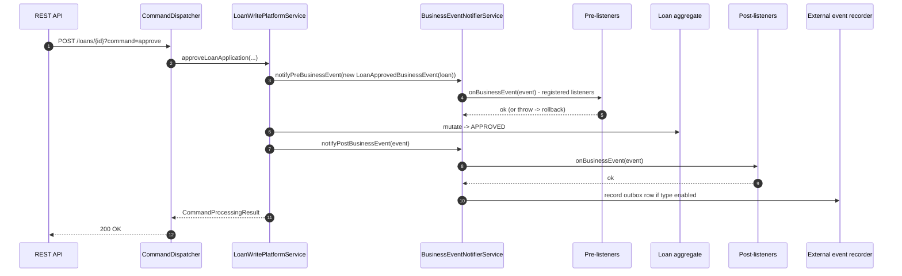

Apache Fineract ships a tiny, opinionated in-process event bus that domain services use to fan
out **synchronous, transactional** notifications about state changes. It pre-dates the external
event outbox — both pipelines now share the same event objects, but the in-process path remains
the only place where a listener can run "inside" the loan-approval transaction and still influence
the outcome (e.g. by throwing to roll the whole thing back). The contract is small enough to fit
on a postcard, but its surface area — the catalogue of concrete `*BusinessEvent` classes — is
where almost every Fineract feature plugs in.

## The SPI

The interfaces live in
[`fineract-core/src/main/java/org/apache/fineract/infrastructure/event/business/`](https://github.com/apache/fineract/tree/develop/fineract-core/src/main/java/org/apache/fineract/infrastructure/event/business):

```java
// fineract-core/.../event/business/domain/BusinessEvent.java
public interface BusinessEvent<T> {
    T get();
    String getType();
    String getCategory();
    Long getAggregateRootId();
}

// fineract-core/.../event/business/BusinessEventListener.java
public interface BusinessEventListener<T extends BusinessEvent<?>> {
    void onBusinessEvent(T event);
}
```

`BusinessEvent<T>` carries a typed payload (`T`) and three string identifiers used by the
serializers / configuration table:

- **`type`** — the event class name, e.g. `LoanApprovedBusinessEvent`. Used as the primary key in
  `m_external_event_configuration`.
- **`category`** — the broad domain, e.g. `Loan`, `Client`, `Savings`. Used for grouping in the
  configuration API.
- **`aggregateRootId`** — the DDD aggregate id (loan id, savings account id, client id) used as
  the Kafka partition key downstream so per-aggregate ordering is preserved.

A convenience base class `AbstractBusinessEvent<T>` (Lombok `@RequiredArgsConstructor`) stores
the payload and implements `get()`; concrete events only have to fill in the three strings.

```java
// fineract-core/.../event/business/domain/AbstractBusinessEvent.java
@RequiredArgsConstructor
public abstract class AbstractBusinessEvent<T> implements BusinessEvent<T> {

    private final T value;

    @Override
    public T get() {
        return value;
    }
}
```

## `BusinessEventNotifierService` — the publisher

`BusinessEventNotifierService`
([source](https://github.com/apache/fineract/blob/develop/fineract-core/src/main/java/org/apache/fineract/infrastructure/event/business/service/BusinessEventNotifierService.java))
is the only API domain code ever touches. It exposes four pairs of methods:

```java
public interface BusinessEventNotifierService {

    void notifyPreBusinessEvent(BusinessEvent<?> businessEvent);
    void notifyPostBusinessEvent(BusinessEvent<?> businessEvent);

    <T extends BusinessEvent<?>> void addPreBusinessEventListener(Class<T> eventType,
                                                                  BusinessEventListener<T> listener);
    <T extends BusinessEvent<?>> void addPostBusinessEventListener(Class<T> eventType,
                                                                   BusinessEventListener<T> listener);

    void startExternalEventRecording();
    void stopExternalEventRecording();
    void resetEventRecording();
}
```

The two registration overloads are normally called from `@PostConstruct` initializers on the
listener bean itself; the two notification overloads are called by writers. The
`*ExternalEventRecording()` trio is what `BusinessEventNotifierServiceImpl` uses to suppress
outbox writes during specific COB ("close of business") phases where the same event would
otherwise be replayed for every loan in the batch.

A canonical usage pattern from `LoanWritePlatformServiceJpaRepositoryImpl`:

```java
businessEventNotifierService.notifyPreBusinessEvent(new LoanApprovedBusinessEvent(loan));
// ... move state machine to APPROVED, persist ...
businessEventNotifierService.notifyPostBusinessEvent(new LoanApprovedBusinessEvent(loan));
```

`notifyPreBusinessEvent` runs **before** the domain mutation; throwing from a pre-listener aborts
the mutation. `notifyPostBusinessEvent` runs **after** the mutation but **before** the commit,
which is what enables an external-event outbox row to be written atomically with the loan update.

## Flow of an event



## Sub-package layout

Every concrete event class lives under
`fineract-provider/src/main/java/org/apache/fineract/infrastructure/event/business/domain/`
(plus a small amount in `fineract-core/.../event/business/domain/datatable` for datatable
events). The directories mirror the domain:

```
infrastructure/event/business/domain/
├── client/
├── deposit/        (fixed + recurring deposit accounts)
├── group/          (groups + centers)
├── loan/product/   (loan products only; loan + transaction events live in their own modules)
├── savings/
│   └── transaction/
└── share/
```

The base / framework classes (`BusinessEvent`, `AbstractBusinessEvent`, `BulkBusinessEvent`,
`NoExternalEvent`, `DatatableEntry*BusinessEvent`) live in
[`fineract-core/.../event/business/domain/`](https://github.com/apache/fineract/tree/develop/fineract-core/src/main/java/org/apache/fineract/infrastructure/event/business/domain).

## Catalogue — `client/`

Path: `fineract-provider/.../event/business/domain/client/`

| Class | Payload type | When it fires |
| --- | --- | --- |
| `ClientBusinessEvent` (abstract) | `Client` | Base class for all client events |
| `ClientCreateBusinessEvent` | `Client` | After a `Client` row is inserted |
| `ClientActivateBusinessEvent` | `Client` | After a pending client is activated |
| `ClientRejectBusinessEvent` | `Client` | After a pending client is rejected |

All four extend `ClientBusinessEvent`, which sets `category = "Client"` and returns the client id
as the aggregate-root id.

```java
public class ClientActivateBusinessEvent extends ClientBusinessEvent {
    private static final String TYPE = "ClientActivateBusinessEvent";

    public ClientActivateBusinessEvent(Client value) { super(value); }

    @Override public String getType() { return TYPE; }
}
```

## Catalogue — `deposit/`

Path: `fineract-provider/.../event/business/domain/deposit/`

| Class | Payload type |
| --- | --- |
| `FixedDepositAccountBusinessEvent` (abstract) | `SavingsAccount` |
| `FixedDepositAccountCreateBusinessEvent` | `SavingsAccount` |
| `RecurringDepositAccountBusinessEvent` (abstract) | `SavingsAccount` |
| `RecurringDepositAccountCreateBusinessEvent` | `SavingsAccount` |

Both fixed- and recurring-deposit hierarchies wrap the underlying `SavingsAccount` JPA entity
because in Fineract a deposit account is a specialized savings account.

## Catalogue — `group/`

Path: `fineract-provider/.../event/business/domain/group/`

| Class | Payload | Notes |
| --- | --- | --- |
| `GroupsBusinessEvent` (abstract) | `Group` | Base for group events |
| `GroupsCreateBusinessEvent` | `Group` | Group created |
| `CentersCreateBusinessEvent` | `Group` | Centers in Fineract are modelled as groups with a centre flag |

## Catalogue — `loan/product/`

Path: `fineract-provider/.../event/business/domain/loan/product/`

| Class | Payload |
| --- | --- |
| `LoanProductBusinessEvent` (abstract) | `LoanProduct` |
| `LoanProductCreateBusinessEvent` | `LoanProduct` |

The loan-product hierarchy in this folder covers *product* lifecycle. The much larger catalogue of
**loan account** and **loan transaction** events (`LoanCreatedBusinessEvent`,
`LoanApprovedBusinessEvent`, `LoanDisbursalBusinessEvent`, `LoanRefundPreBusinessEvent` /
`LoanRefundPostBusinessEvent`, `LoanChargeOffPreBusinessEvent` /
`LoanChargeOffPostBusinessEvent`, `LoanAddChargeBusinessEvent`,
`LoanDelinquencyRangeChangeBusinessEvent`, `LoanAccountDelinquencyPauseChangedBusinessEvent`,
and so on) lives in the sibling `fineract-loan` Gradle module under
`fineract-loan/src/main/java/org/apache/fineract/infrastructure/event/business/domain/loan/`
(with `loan/transaction/` and `loan/charge/` sub-packages). The presence of a
`*BusinessEventSerializer` in `event/external/service/serialization/serializer/loan/` is the
canonical way to discover the full set without walking every domain module.

```java
public class LoanProductCreateBusinessEvent extends LoanProductBusinessEvent {
    private static final String TYPE = "LoanProductCreateBusinessEvent";

    public LoanProductCreateBusinessEvent(LoanProduct value) { super(value); }

    @Override public String getType() { return TYPE; }
}
```

## Catalogue — `savings/`

Path: `fineract-provider/.../event/business/domain/savings/`

Lifecycle events:

| Class | Payload |
| --- | --- |
| `SavingsAccountBusinessEvent` (abstract) | `SavingsAccount` |
| `SavingsCreateBusinessEvent` | `SavingsAccount` |
| `SavingsApproveBusinessEvent` | `SavingsAccount` |
| `SavingsActivateBusinessEvent` | `SavingsAccount` |
| `SavingsRejectBusinessEvent` | `SavingsAccount` |
| `SavingsCloseBusinessEvent` | `SavingsAccount` |
| `SavingsPostInterestBusinessEvent` | `SavingsAccount` |

Transaction-level events under `savings/transaction/`:

| Class | Payload |
| --- | --- |
| `SavingsAccountTransactionBusinessEvent` (abstract) | `SavingsAccountTransaction` |
| `SavingsDepositBusinessEvent` | `SavingsAccountTransaction` |
| `SavingsWithdrawalBusinessEvent` | `SavingsAccountTransaction` |
| `SavingsAccountForceWithdrawalBusinessEvent` | `SavingsAccountTransaction` |

The transaction-level events carry the **transaction** as payload and use the
**savings-account id** as the aggregate-root id, so all transactions on the same account share a
Kafka partition.

## Catalogue — `share/`

Path: `fineract-provider/.../event/business/domain/share/`

| Class | Payload |
| --- | --- |
| `ShareAccountBusinessEvent` (abstract) | `ShareAccount` |
| `ShareAccountCreateBusinessEvent` | `ShareAccount` |
| `ShareAccountApproveBusinessEvent` | `ShareAccount` |
| `ShareProductDividentsCreateBusinessEvent` | dividend payload | Fired when a dividend is declared on a share product |

## Datatable events (in `fineract-core`)

Path: `fineract-core/.../event/business/domain/datatable/`

Generic events fired by `ReadWriteNonCoreDataServiceImpl` for any row insert/update/delete on a
user-defined datatable, so consumers don't need a separate event per datatable:

| Class | Payload | Type |
| --- | --- | --- |
| `DatatableEntryBusinessEvent` (abstract) | `DatatableEntryDetails` | base |
| `DatatableEntryCreatedBusinessEvent` | `DatatableEntryDetails` | `"DatatableEntryCreatedBusinessEvent"` |
| `DatatableEntryUpdatedBusinessEvent` | `DatatableEntryDetails` | `"DatatableEntryUpdatedBusinessEvent"` |
| `DatatableEntryDeletedBusinessEvent` | `DatatableEntryDetails` | `"DatatableEntryDeletedBusinessEvent"` |

`DatatableEntryDetails` is a small POJO with the datatable name, app-table identifier, and the
JSON of the row.

## Special events

### `BulkBusinessEvent`

```java
// fineract-core/.../event/business/domain/BulkBusinessEvent.java
public class BulkBusinessEvent extends AbstractBusinessEvent<List<BusinessEvent<?>>> {

    private static final String CATEGORY = "Bulk";
    public static final String TYPE = "BulkBusinessEvent";

    public BulkBusinessEvent(List<BusinessEvent<?>> value) {
        super(value);
        verifySameAggregate(value);
    }

    private void verifySameAggregate(List<BusinessEvent<?>> events) {
        Set<Long> aggregateRootIds = events.stream()
            .map(BusinessEvent::getAggregateRootId)
            .filter(Objects::nonNull)
            .collect(toSet());
        if (aggregateRootIds.size() > 1) {
            throw new IllegalArgumentException(
                "The business events are related to multiple aggregate roots which is not allowed");
        }
    }

    @Override public String getType() { return TYPE; }
    @Override public String getCategory() { return CATEGORY; }
    @Override public Long getAggregateRootId() { return get().iterator().next().getAggregateRootId(); }
}
```

`BulkBusinessEvent` is used by COB-style flows that need to fan out **many** events for the **same
aggregate** in one atomic publication — e.g. when a single repayment causes a charge to be paid,
an installment to be marked complete, and a delinquency band to change. The constructor enforces
the same-aggregate invariant; the resulting Avro message preserves the ordering.

### `NoExternalEvent`

A marker interface (`fineract-core/.../event/business/domain/NoExternalEvent.java`) implemented
by `BusinessEvent` subclasses that should fire **only** to in-process listeners and never be
written to the outbox. The recorder side of `BusinessEventNotifierServiceImpl` checks
`event instanceof NoExternalEvent` and skips serialization. Use this for purely-internal
events you don't want to ship to downstream consumers.

## Writing a listener

A listener is a Spring bean that implements `BusinessEventListener<T>` for a single concrete
event class and registers itself at startup. The typical idiom:

```java
@Component
@RequiredArgsConstructor
public class GuarantorFundsReleaseListener
        implements BusinessEventListener<LoanApprovedBusinessEvent> {

    private final BusinessEventNotifierService notifier;
    private final GuarantorWritePlatformService guarantors;

    @PostConstruct
    public void register() {
        notifier.addPostBusinessEventListener(LoanApprovedBusinessEvent.class, this);
    }

    @Override
    public void onBusinessEvent(LoanApprovedBusinessEvent event) {
        Loan loan = event.get();
        guarantors.holdGuarantorFunds(loan);
    }
}
```

Things to keep in mind:

- The listener runs **on the caller's thread inside the open JPA transaction**, so it can use
  the same `EntityManager` and any JDBC connection bound to that transaction.
- Throwing from a listener **rolls back** the originating mutation. Catch and log if you want
  best-effort delivery semantics.
- The order in which listeners for the same event class fire is the order of registration. If you
  need deterministic ordering, register from a `SmartInitializingSingleton` after all beans are
  ready.
- Don't perform long-running I/O in a listener — it will hold the loan transaction open. Push
  the work to `SchedulerJobApiResource` / Spring Batch instead.

## Pre vs post

You almost always want **post** listeners; pre-listeners only make sense when:

- You want to **veto** the change (throw to roll back). Examples: guarantor sanity checks before
  loan approval, fraud rules before disbursal.
- You need to **snapshot** the aggregate in its prior state for diffing.

The two registries in `BusinessEventNotifierServiceImpl` are independent; registering on the
post-side does not register on the pre-side and vice-versa.

## How external events plug in

`BusinessEventNotifierServiceImpl` carries an internal "recorder" — a list of `BusinessEvent`s
collected during the current request that should be persisted to `m_external_event` at commit
time. The lifecycle methods `startExternalEventRecording()` / `stopExternalEventRecording()` /
`resetEventRecording()` exist for COB phases that want to control exactly which events get
forwarded to the outbox (e.g. don't double-emit during replays).

The recorder consults `ExternalBusinessEventConfigurationService` to check whether the event's
`getType()` is currently enabled, and `BusinessEventSerializerFactory` to find the matching
`*BusinessEventSerializer` bean. If both succeed, the resulting Avro byte array is wrapped in an
`ExternalEvent` row and saved. See [External Events & Producers](/events/external-events-and-producers)
for the full pipeline.

## Discovering events at runtime

Two practical ways to enumerate every event type the running JVM knows about:

1. **Scan the classpath** for `BusinessEvent` implementations:

   ```java
   ClassPathScanningCandidateComponentProvider scanner =
       new ClassPathScanningCandidateComponentProvider(false);
   scanner.addIncludeFilter(new AssignableTypeFilter(BusinessEvent.class));
   scanner.findCandidateComponents("org.apache.fineract")
          .forEach(bd -> System.out.println(bd.getBeanClassName()));
   ```

2. **Query the configuration table** through the REST API
   `GET /v1/externalevents/configuration` (see
   [Event Configuration](/events/event-configuration)). The table is seeded at install time with
   one row per registered event type, so it's the authoritative list of events that can be
   externalised.

## Cross-references

<CardGroup cols={2}>
  <Card title="External Events & Producers" icon="paper-plane" href="/events/external-events-and-producers">
    How the same `BusinessEvent` becomes a Kafka or ActiveMQ message.
  </Card>
  <Card title="Event Configuration" icon="sliders" href="/events/event-configuration">
    Per-event-type enable/disable and the REST resource.
  </Card>
  <Card title="Hooks Framework" icon="plug" href="/events/hooks-framework">
    Command-level webhooks; an alternative for external subscribers.
  </Card>
  <Card title="Command Bus" icon="bolt" href="/command/overview">
    The write path that ultimately triggers business events.
  </Card>
</CardGroup>
