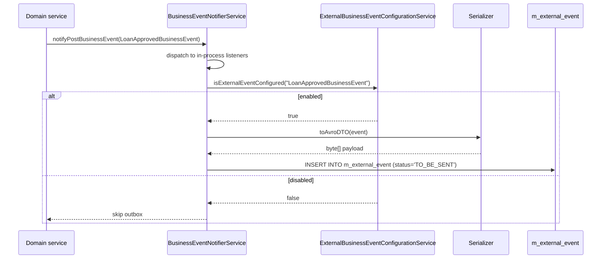
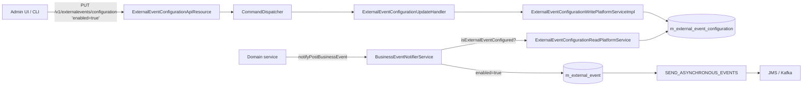

Apache Fineract gives operators **per-event-type control** over which business events leak into
the external pipeline. The decision is stored in a simple table, exposed through a tiny REST
resource, and consulted on every `notifyPostBusinessEvent` call — so flipping a switch in the API
takes effect immediately, no restart required. This page covers the configuration entity, the
two REST resources (production and test-only), and the broker-side properties that decide where
enabled events actually end up.

## The configuration entity

The table is keyed by event type and has a single boolean flag:

```java
// fineract-core/.../event/external/repository/domain/ExternalEventConfiguration.java
@Entity
@Table(name = "m_external_event_configuration")
@Getter @NoArgsConstructor @AllArgsConstructor
public class ExternalEventConfiguration {

    @Id
    @Column(name = "type", nullable = false)
    private String type;

    @Column(name = "enabled", nullable = false)
    private boolean enabled = false;

    public void setEnabled(boolean enabled) {
        this.enabled = enabled;
    }
}
```

`type` is the value returned by `BusinessEvent.getType()` — typically the simple class name like
`LoanApprovedBusinessEvent` or `SavingsDepositBusinessEvent`. The table is **seeded at install
time** by a Liquibase changelog so it always contains one row per known event class. There is no
"create" operation in the public API — the type vocabulary is determined by the running JVM, not
by user input.

The repository
([`ExternalEventConfigurationRepository`](https://github.com/apache/fineract/blob/develop/fineract-core/src/main/java/org/apache/fineract/infrastructure/event/external/repository/ExternalEventConfigurationRepository.java))
extends `JpaRepository<ExternalEventConfiguration, String>` and adds two helpers:

```java
ExternalEventConfiguration findExternalEventConfigurationByTypeWithNotFoundDetection(String type);
List<ExternalEventConfiguration> findExternalEventConfigurationByTypeIn(Collection<String> types);
```

The first one is used by the update handler; the second is used by the recorder to bulk-check
which events in a `BulkBusinessEvent` are enabled.

## How the flag is consulted at runtime

`ExternalBusinessEventConfigurationServiceImpl`
([source](https://github.com/apache/fineract/blob/develop/fineract-core/src/main/java/org/apache/fineract/infrastructure/event/business/service/ExternalBusinessEventConfigurationServiceImpl.java))
is the read-side cache. On every event publish, `BusinessEventNotifierServiceImpl` asks it
"`isExternalEventConfigured(type)`?" and only serializes / writes the outbox row if the answer
is yes.



So **in-process listeners always fire**; only the **external** path is conditional. That
asymmetry is intentional: turning off the outbox shouldn't break business logic that depends on
synchronous listeners (like guarantor releases or COB-triggered downstream calculations).

## `ExternalEventConfigurationApiResource` — the public REST face

The production resource lives in
[`fineract-core/.../event/external/api/ExternalEventConfigurationApiResource.java`](https://github.com/apache/fineract/blob/develop/fineract-core/src/main/java/org/apache/fineract/infrastructure/event/external/api/ExternalEventConfigurationApiResource.java):

```java
@RequiredArgsConstructor
@Path("/v1/externalevents/configuration")
@Component
@Tag(name = "External event configuration",
     description = "External event configuration enables user to enable/disable event posting to downstream message channel")
public class ExternalEventConfigurationApiResource {

    private final ExternalEventConfigurationReadPlatformService readPlatformService;
    private final CommandDispatcher dispatcher;

    @GET
    @Produces({ MediaType.APPLICATION_JSON })
    @Operation(summary = "List all external event configurations")
    public ExternalEventConfigurationResponse getExternalEventConfigurations() {
        return readPlatformService.findAllExternalEventConfigurations();
    }

    @PUT
    @Consumes({ MediaType.APPLICATION_JSON })
    @Produces({ MediaType.APPLICATION_JSON })
    @Operation(summary = "Enable/Disable external events posting")
    public ExternalEventConfigurationUpdateResponse updateExternalEventConfigurations(
            @Valid ExternalEventConfigurationUpdateRequest request) {
        final var command = new ExternalConfigurationsUpdateCommand();
        command.setPayload(request);
        return dispatcher.dispatch(command).get();
    }
}
```

### `GET /v1/externalevents/configuration`

Returns the full list of registered types and their on/off status:

```json
{
  "externalEventConfiguration": [
    { "type": "ClientCreateBusinessEvent",   "enabled": true  },
    { "type": "ClientActivateBusinessEvent", "enabled": true  },
    { "type": "LoanCreateBusinessEvent",     "enabled": false },
    { "type": "LoanApprovedBusinessEvent",   "enabled": false },
    { "type": "SavingsDepositBusinessEvent", "enabled": true  }
  ]
}
```

The DTO classes (`ExternalEventConfigurationResponse`,
`ExternalEventConfigurationItemResponse`) are vanilla Lombok value objects living in
`.../event/external/data/`. The implementation
[`ExternalEventConfigurationReadPlatformServiceImpl`](https://github.com/apache/fineract/blob/develop/fineract-core/src/main/java/org/apache/fineract/infrastructure/event/external/service/ExternalEventConfigurationReadPlatformServiceImpl.java)
just does a `findAll()` and maps the results through `ExternalEventsConfigurationMapper`.

### `PUT /v1/externalevents/configuration`

Body shape:

```java
public class ExternalEventConfigurationUpdateRequest implements Serializable {
    @NotNull(message = "{org.apache.fineract.externalevent.configurations.not-null}")
    private Map<String, Boolean> externalEventConfigurations;
}
```

Example payload:

```json
{
  "externalEventConfigurations": {
    "LoanCreateBusinessEvent":   true,
    "LoanApprovedBusinessEvent": true,
    "LoanDisbursalBusinessEvent": true
  }
}
```

Partial updates are supported — any key omitted from the map keeps its current value. The
endpoint returns a `ExternalEventConfigurationUpdateResponse` containing the changed values, in
the same `changes` shape that the rest of the [command bus](/command/overview) uses:

```json
{
  "changes": {
    "externalEventConfigurations": {
      "LoanCreateBusinessEvent": true,
      "LoanApprovedBusinessEvent": true,
      "LoanDisbursalBusinessEvent": true
    }
  }
}
```

The PUT dispatches an `ExternalConfigurationsUpdateCommand` through `CommandDispatcher`, which
lands at the handler:

```java
// fineract-core/.../event/external/handler/ExternalEventConfigurationUpdateHandler.java
@Slf4j @Component @RequiredArgsConstructor
public class ExternalEventConfigurationUpdateHandler
        implements CommandHandler<ExternalEventConfigurationUpdateRequest, ExternalEventConfigurationUpdateResponse> {

    private final ExternalEventConfigurationWritePlatformService writePlatformService;

    @Retry(name = "commandExternalEventConfigurationUpdate", fallbackMethod = "fallback")
    @Transactional
    @Override
    public ExternalEventConfigurationUpdateResponse handle(Command<ExternalEventConfigurationUpdateRequest> command) {
        return writePlatformService.updateConfigurations(command.getPayload());
    }
}
```

…and finally
[`ExternalEventConfigurationWritePlatformServiceImpl`](https://github.com/apache/fineract/blob/develop/fineract-core/src/main/java/org/apache/fineract/infrastructure/event/external/service/ExternalEventConfigurationWritePlatformServiceImpl.java)
does the work:

```java
@Transactional
@Override
public ExternalEventConfigurationUpdateResponse updateConfigurations(
        final ExternalEventConfigurationUpdateRequest request) {

    final var commandConfigurations = request.getExternalEventConfigurations();
    final var changes = new HashMap<String, Object>();
    final var changedConfigurations = new HashMap<String, Boolean>();
    final var modifiedConfigurations = new ArrayList<ExternalEventConfiguration>();

    for (var entry : commandConfigurations.entrySet()) {
        final var configuration =
            repository.findExternalEventConfigurationByTypeWithNotFoundDetection(entry.getKey());
        configuration.setEnabled(entry.getValue());
        changedConfigurations.put(entry.getKey(), entry.getValue());
        modifiedConfigurations.add(configuration);
    }

    if (!modifiedConfigurations.isEmpty()) {
        repository.saveAll(modifiedConfigurations);
    }
    if (!changedConfigurations.isEmpty()) {
        changes.put("externalEventConfigurations", changedConfigurations);
    }
    return ExternalEventConfigurationUpdateResponse.builder().changes(changes).build();
}
```

Unknown event types cause `ExternalEventConfigurationNotFoundException` (thrown by
`findExternalEventConfigurationByTypeWithNotFoundDetection`), which maps to HTTP **404** — useful
for catching typos in CI scripts that try to flip a renamed event.

### Validation

`ExternalEventConfigurationValidationService` validates the request before it reaches the
handler. The two main rules:

- The map cannot be null or empty (`@NotNull` on the field + an explicit emptiness check).
- Every key must already exist in `m_external_event_configuration`; the configuration table is
  authoritative, the request is not allowed to add new types.

## `InternalExternalEventsApiResource` — test-only outbox inspection

A second resource exists strictly for integration tests:

```java
// fineract-core/.../event/external/api/InternalExternalEventsApiResource.java
@Slf4j
@Profile(FineractProfiles.TEST)
@Component
@Path("/v1/internal/externalevents")
@RequiredArgsConstructor
public class InternalExternalEventsApiResource {

    private final InternalExternalEventService internalExternalEventService;

    @GET
    @Produces({ MediaType.APPLICATION_JSON })
    public List<ExternalEventResponse> getAllExternalEvents(
            @QueryParam("idempotencyKey") final String idempotencyKey,
            @QueryParam("type") final String type,
            @QueryParam("category") final String category,
            @QueryParam("aggregateRootId") final Long aggregateRootId) {
        return internalExternalEventService.getAllExternalEvents(idempotencyKey, type, category, aggregateRootId);
    }

    @DELETE
    @Produces({ MediaType.APPLICATION_JSON })
    public void deleteAllExternalEvents() {
        internalExternalEventService.deleteAllExternalEvents();
    }
}
```

Things worth noting:

- The `@Profile(FineractProfiles.TEST)` annotation means the bean **never registers in
  production** — there's no flag to enable it without recompiling with the test profile.
- `GET /v1/internal/externalevents?type=LoanApprovedBusinessEvent` returns the rows from the
  outbox (the `ExternalEventResponse` includes `eventId`, `type`, `category`, `idempotencyKey`,
  `createdAt`, `businessDate`, `aggregateRootId`, and a JSON projection of the Avro payload).
- `DELETE /v1/internal/externalevents` truncates the outbox so the next test case starts clean.
- The integration test client lives at
  `integration-tests/.../client/feign/helpers/InternalExternalEventsApi.java` if you want a
  pre-built Feign client.

This resource is the primary way integration tests assert "event X was raised with these
fields" without standing up a real broker.

## End-to-end interaction



## Broker connection properties

Toggling a type ON does nothing if no producer is enabled. The producer side is controlled
entirely by `application.properties`
([`fineract-provider/src/main/resources/application.properties`](https://github.com/apache/fineract/blob/develop/fineract-provider/src/main/resources/application.properties)):

### Top-level switch and batch sizing

```properties
fineract.events.external.enabled=${FINERACT_EXTERNAL_EVENTS_ENABLED:false}
fineract.events.external.partition-size=${FINERACT_EXTERNAL_EVENTS_PARTITION_SIZE:5000}
fineract.events.external.thread-pool-core-pool-size=${FINERACT_EVENT_TASK_EXECUTOR_CORE_POOL_SIZE:2}
fineract.events.external.thread-pool-max-pool-size=${FINERACT_EVENT_TASK_EXECUTOR_MAX_POOL_SIZE:25}
fineract.events.external.thread-pool-queue-capacity=${FINERACT_EVENT_TASK_EXECUTOR_QUEUE_CAPACITY:500}
```

If `fineract.events.external.enabled=false`, the recorder is bypassed at the
`BusinessEventNotifierServiceImpl` level — no outbox rows are written **and the configuration
table is not consulted**. This is the kill switch.

### JMS / ActiveMQ broker properties

```properties
fineract.events.external.producer.jms.enabled=false
fineract.events.external.producer.jms.async-send-enabled=false
fineract.events.external.producer.jms.event-queue-name=
fineract.events.external.producer.jms.event-topic-name=
fineract.events.external.producer.jms.broker-url=tcp://127.0.0.1:61616
fineract.events.external.producer.jms.broker-username=
fineract.events.external.producer.jms.broker-password=
fineract.events.external.producer.jms.producer-count=1
fineract.events.external.producer.jms.thread-pool-task-executor-core-pool-size=10
fineract.events.external.producer.jms.thread-pool-task-executor-max-pool-size=100
```

Bound at runtime into
[`FineractProperties.FineractExternalEventsProducerJmsProperties`](https://github.com/apache/fineract/blob/develop/fineract-core/src/main/java/org/apache/fineract/infrastructure/core/config/FineractProperties.java):

```java
public static class FineractExternalEventsProducerJmsProperties {
    private boolean enabled;
    private String eventQueueName;
    private String eventTopicName;
    private String brokerUrl;
    private String brokerUsername;
    private String brokerPassword;
    private int producerCount;
    private boolean asyncSendEnabled;
    private int threadPoolTaskExecutorCorePoolSize;
    private int threadPoolTaskExecutorMaxPoolSize;

    public boolean isBrokerPasswordProtected() {
        return StringUtils.isNotBlank(brokerUsername) || StringUtils.isNotBlank(brokerPassword);
    }
}
```

Set **either** `event-topic-name` **or** `event-queue-name` (not both). The choice between topic
and queue is encoded by `EnableExternalEventTopicCondition` /
`EnableExternalEventQueueCondition` — exactly one of `ActiveMQTopic` or `ActiveMQQueue` is
registered as `externalEventDestination`.

### Kafka broker properties

```properties
fineract.events.external.producer.kafka.enabled=false
fineract.events.external.producer.kafka.timeout-in-seconds=10
fineract.events.external.producer.kafka.bootstrap-servers=localhost:9092
fineract.events.external.producer.kafka.topic.auto-create=true
fineract.events.external.producer.kafka.topic.name=external-events
fineract.events.external.producer.kafka.topic.replicas=1
fineract.events.external.producer.kafka.topic.partitions=10

# extra-properties is pipe-delimited "k=v|k=v"
fineract.events.external.producer.kafka.producer.extra-properties-separator=|
fineract.events.external.producer.kafka.producer.extra-properties-key-value-separator==
fineract.events.external.producer.kafka.producer.extra-properties=linger.ms=10|batch.size=16384

fineract.events.external.producer.kafka.admin.extra-properties-separator=|
fineract.events.external.producer.kafka.admin.extra-properties-key-value-separator==
fineract.events.external.producer.kafka.admin.extra-properties=
```

The bound POJO:

```java
public static class FineractExternalEventsProducerKafkaProperties {
    private boolean enabled;
    private String bootstrapServers;
    private KafkaTopicProperties topic;
    private KafkaProperties producer;
    private KafkaProperties admin;
    private int timeoutInSeconds;
}
```

`producer.extra-properties` is parsed into a `Map<String, Object>` and merged into the producer
config when building `DefaultKafkaProducerFactory`, so anything you can put in
`spring.kafka.producer.properties` you can put here too — `acks`, `enable.idempotence`,
`compression.type`, security settings, etc.

`admin.extra-properties` is for the `KafkaAdmin` bean used by topic auto-creation. Set it to
include security/SSL properties if your cluster requires them.

## Purge retention

Independent of the producer, the **purge** retention window for `m_external_event` rows is held
in `c_configuration`, key `external-events-purge-days-criteria`. You can change it through the
Global Configuration API:

```
PUT /v1/configurations/{configurationId}
{
  "value": 7
}
```

The `PURGE_EXTERNAL_EVENTS` job then deletes `SENT` rows older than `value` days on its next run.
See [External Events & Producers](/events/external-events-and-producers#purge_external_events--retention)
for the tasklet.

## Operational recipes

### Turn the feed on for the first time

1. **Provision broker** (ActiveMQ broker, or Kafka cluster + the `external-events` topic if
   `auto-create=false`).
2. Set `fineract.events.external.enabled=true` and the producer-specific properties.
3. Restart Fineract (these properties are bound at startup; the toggles below are runtime).
4. `GET /v1/externalevents/configuration` to inspect the seeded list.
5. `PUT /v1/externalevents/configuration` with a map of the events you actually care about.
6. Watch `m_external_event` populate and the `SEND_ASYNCHRONOUS_EVENTS` job drain it on the next
   scheduler tick.

### Disable a noisy event

```bash
curl -X PUT https://fineract.example.com/fineract-provider/api/v1/externalevents/configuration \
     -H "Content-Type: application/json" \
     -H "Authorization: Basic ..." \
     -d '{ "externalEventConfigurations": { "LoanInstallmentLevelDelinquencyEvent": false } }'
```

Effective immediately on the next event publish — no restart.

### Re-emit a specific event in a test

In the `TEST` profile only:

```bash
# inspect what was raised
curl 'http://localhost:8080/.../v1/internal/externalevents?type=LoanApprovedBusinessEvent&aggregateRootId=42'

# wipe the slate between cases
curl -X DELETE http://localhost:8080/.../v1/internal/externalevents
```

This is exactly what
`integration-tests/.../client/feign/helpers/InternalExternalEventsApi.java` is wired to.

## What's next

<CardGroup cols={2}>
  <Card title="External Events & Producers" icon="paper-plane" href="/events/external-events-and-producers">
    What happens after the toggle is on: outbox, Avro, JMS, Kafka.
  </Card>
  <Card title="Business Events" icon="bolt" href="/events/business-events">
    The vocabulary of `type` keys you can flip in the configuration table.
  </Card>
  <Card title="Command Bus" icon="bolt" href="/command/overview">
    Background on the `CommandDispatcher` used by the PUT endpoint.
  </Card>
  <Card title="Hooks Framework" icon="plug" href="/events/hooks-framework">
    The other configurable outbound mechanism.
  </Card>
</CardGroup>
