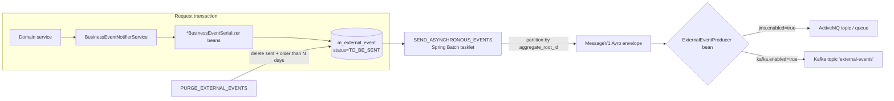

Apache Fineract's external-event pipeline is a textbook **transactional outbox** built on top of
the in-process [business event bus](/events/business-events). Every business event that's
enabled in `m_external_event_configuration` is serialized to Avro, persisted as an
`m_external_event` row in the same transaction as the originating mutation, and shipped to a
downstream broker (**ActiveMQ** or **Kafka**) by a Spring Batch tasklet running on a fixed
cadence. The result is at-least-once, partition-ordered, schema-typed delivery without ever
making the API path depend on the broker being up.

## The whole pipeline at a glance



The two boxes you would change as an operator are highlighted: the producer bean is selected at
runtime by `@ConditionalOnProperty`, and the outbox table is purged on a configurable retention
window.

## The outbox row: `ExternalEvent` / `m_external_event`

[`ExternalEvent`](https://github.com/apache/fineract/blob/develop/fineract-core/src/main/java/org/apache/fineract/infrastructure/event/external/repository/domain/ExternalEvent.java)
is a small JPA entity:

```java
@Entity
@Table(name = "m_external_event")
public class ExternalEvent extends AbstractPersistableCustom<Long> {

    @Column(name = "type", nullable = false)       private String type;
    @Column(name = "category", nullable = false)   private String category;
    @Column(name = "schema", nullable = false)     private String schema;

    @Basic(fetch = FetchType.LAZY)
    @Column(name = "data", nullable = false)       private byte[] data;

    @Column(name = "created_at", nullable = false) private OffsetDateTime createdAt;

    @Enumerated(EnumType.STRING)
    @Column(name = "status", nullable = false)     private ExternalEventStatus status;

    @Column(name = "sent_at", nullable = true)     private OffsetDateTime sentAt;
    @Column(name = "idempotency_key", nullable = false) private String idempotencyKey;
    @Column(name = "business_date", nullable = false)   private LocalDate businessDate;
    @Column(name = "aggregate_root_id", nullable = true) private Long aggregateRootId;

    public ExternalEvent(String type, String category, String schema, byte[] data,
                         String idempotencyKey, Long aggregateRootId) {
        this.type = type;
        this.category = category;
        this.schema = schema;
        this.data = data;
        this.idempotencyKey = idempotencyKey;
        this.aggregateRootId = aggregateRootId;
        this.createdAt = DateUtils.getAuditOffsetDateTime();
        this.status = ExternalEventStatus.TO_BE_SENT;
        this.businessDate = DateUtils.getBusinessLocalDate();
    }
}
```

Columns worth knowing:

- **`status`** — `TO_BE_SENT` or `SENT`. The job uses
  `findByStatusOrderByBusinessDateAscIdAsc(TO_BE_SENT, ...)` to pull batches.
- **`idempotency_key`** — a UUID generated when the row is written. Re-delivery by a broker means
  consumers see the same key twice and can deduplicate.
- **`aggregate_root_id`** — used as the partition key when shipping to Kafka so per-aggregate
  ordering is preserved.
- **`business_date`** — the **business** date (not the wall clock), so a COB run dated yesterday
  still produces yesterday-dated events.
- **`data`** — the Avro-encoded business event payload (just the payload; the
  [envelope is added at send time](#the-messagev1-envelope)).
- **`schema`** — the fully-qualified Avro record name of `data`, e.g.
  `org.apache.fineract.avro.loan.v1.LoanAccountDataV1`.

`ExternalEventStatus` is a two-value enum:

```java
public enum ExternalEventStatus {
    TO_BE_SENT,
    SENT
}
```

The corresponding repository
([`ExternalEventRepository`](https://github.com/apache/fineract/blob/develop/fineract-core/src/main/java/org/apache/fineract/infrastructure/event/external/repository/ExternalEventRepository.java))
exposes pagination over `TO_BE_SENT`, batch UPDATE to `SENT`, and a single-shot
`deleteOlderEventsWithSentStatus(SENT, dateForPurgeCriteria)` used by the purge job.

## Avro schemas — `fineract-avro-schemas/`

The whole external feed is **strongly typed** by Avro. The schemas are kept in their own Gradle
module, [`fineract-avro-schemas/src/main/avro/`](https://github.com/apache/fineract/tree/develop/fineract-avro-schemas/src/main/avro),
and code-generated into a sibling Java package (`org.apache.fineract.avro.*`) at build time.
Subscribers usually depend on this jar directly so they can deserialize without touching
Fineract internals.

### The `MessageV1` envelope

[`MessageV1.avsc`](https://github.com/apache/fineract/blob/develop/fineract-avro-schemas/src/main/avro/MessageV1.avsc)
is the **outer envelope** every external event is wrapped in before going to the broker:

```json
{
    "name": "MessageV1",
    "namespace": "org.apache.fineract.avro",
    "type": "record",
    "fields": [
        { "name": "id",            "type": "long",   "doc": "The ID of the message" },
        { "name": "source",        "type": "string", "doc": "A unique identifier of the source service" },
        { "name": "type",          "type": "string", "doc": "Event type, e.g. LoanApprovedBusinessEvent" },
        { "name": "category",      "type": "string", "doc": "Category, e.g. LOAN" },
        { "name": "createdAt",     "type": "string", "doc": "UTC time, ISO_LOCAL_DATE_TIME" },
        { "name": "businessDate",  "type": "string", "doc": "Business date, ISO_LOCAL_DATE" },
        { "name": "tenantId",      "type": "string" },
        { "name": "idempotencyKey","type": "string" },
        { "name": "dataschema",    "type": "string", "doc": "FQ name of the payload schema" },
        { "name": "data",          "type": "bytes",  "doc": "Avro-encoded payload" }
    ]
}
```

`data` is **double-encoded Avro** (envelope bytes wrap payload bytes). Consumers parse the
envelope, read `dataschema`, and then parse `data` against the schema named by that field.
`BulkMessagePayloadV1` and `BulkMessageItemV1` are the equivalent envelope types used by
`BulkBusinessEvent`.

### Payload schemas

Payload `.avsc` files are organised by domain under `src/main/avro/`:

```
fineract-avro-schemas/src/main/avro/
├── BulkMessageItemV1.avsc
├── BulkMessagePayloadV1.avsc
├── MessageV1.avsc
├── client/v1/    (ClientDataV1, ClientTimelineDataV1, ClientCollateralManagementV1, ...)
├── document/v1/  (DocumentDataV1)
├── fixeddeposit/v1/ (FixedDepositAccountDataV1)
├── generic/v1/   (CalendarDataV1, CodeValueDataV1, CommandProcessingResultV1, CurrencyDataV1,
│                  EnumOptionDataV1, StringEnumOptionDataV1)
├── gl/v1/        (GLAccountDataV1)
├── group/v1/     (GroupGeneralDataV1, GroupRoleDataV1)
├── loan/v1/      (LoanAccountDataV1, LoanTransactionDataV1, DelinquencyBucketDataV1,
│                  LoanChargeDataRangeViewV1, DelinquencyPausePeriodV1, ...)
├── recurringdeposit/v1/
├── savings/v1/   (SavingsAccountDataV1, SavingsAccountTransactionDataV1, ...)
└── share/v1/     (ShareAccountDataV1, ShareProductDataV1)
```

The `v1/` directory suffix is a hint: the project versions schemas by directory and class name,
not via Avro's built-in resolution. A breaking change becomes `*V2.avsc` and lives alongside
`*V1.avsc`; producers and serializers pick the version at compile time.

## Serializers — mapping in-process events to Avro

For every event type that goes external, there is a `*BusinessEventSerializer` bean
in [`fineract-provider/.../event/external/service/serialization/serializer/`](https://github.com/apache/fineract/tree/develop/fineract-provider/src/main/java/org/apache/fineract/infrastructure/event/external/service/serialization/serializer)
that:

1. Implements `BusinessEventSerializer.canSerialize(BusinessEvent<?>)` to claim a specific class.
2. Implements `BusinessEventSerializer.toAvroDTO(BusinessEvent<?>)` to project the JPA entity into
   an Avro POJO using one of the `*DataMapper` MapStruct mappers.
3. Returns the Avro POJO; the framework Avro-encodes it to `byte[]` and writes the
   `ExternalEvent` row.

Representative serializers:

- `ClientBusinessEventSerializer`
- `LoanBusinessEventSerializer`, `LoanChargeBusinessEventSerializer`,
  `LoanChargeOffBusinessEventSerializer`, `LoanAdjustTransactionBusinessEventSerializer`,
  `LoanDelinquencyRangeChangeBusinessEventSerializer`,
  `LoanAccountsStayedLockedBusinessEventSerializer`,
  `LoanChargeDeletedBusinessEventSerializer`
- `GroupsBusinessEventSerializer`
- `FixedDepositAccountBusinessEventSerializer`
- `DocumentBusinessEventSerializer`
- And one producer-style serializer: `LoanInstallmentLevelDelinquencyEventProducer` (under
  `serializer/loan/`).

The MapStruct mappers live in the parallel `service/serialization/mapper/` tree
(`ClientDataMapper`, `LoanAccountDataMapper`, `LoanTransactionDataMapper`,
`SavingsAccountDataMapper`, `ShareAccountDataMapper`, etc.). Generic reusable mappers
(currency, code value, enum option, calendar) live under
`fineract-core/.../event/external/service/serialization/mapper/generic`.

## The producer SPI

The producer abstraction
([`ExternalEventProducer`](https://github.com/apache/fineract/blob/develop/fineract-core/src/main/java/org/apache/fineract/infrastructure/event/external/producer/ExternalEventProducer.java))
is a single method:

```java
public interface ExternalEventProducer {
    /**
     * Sends the created ExternalEvents.
     *
     * @param partitions  The value is list of external events belong to the same key,
     *                    serialized into byte array
     */
    void sendEvents(Map<Long, List<byte[]>> partitions) throws AcknowledgementTimeoutException;
}
```

`Map<Long, List<byte[]>>` is the **aggregate-root-id → ordered messages** map. The job groups
the batch of rows by `aggregateRootId` before calling `sendEvents`, which lets the JMS producer
hash partitions onto producer sessions and the Kafka producer use the key directly as the
partition key.

Three implementations ship today:

| Bean | Profile / condition | Used when |
| --- | --- | --- |
| `JMSMultiExternalEventProducer` | `@ConditionalOnProperty("fineract.events.external.producer.jms.enabled")` | You want ActiveMQ delivery |
| `KafkaExternalEventProducer` | `@ConditionalOnProperty("fineract.events.external.producer.kafka.enabled")` | You want Kafka delivery |
| `NoopExternalEventProducer` | `@Conditional(NoopExternalEventEnabled.class)` | Neither broker is enabled — outbox rows accumulate then get purged |

## `JMSMultiExternalEventProducer` — ActiveMQ delivery

Location: `fineract-provider/.../event/external/producer/jms/JMSMultiExternalEventProducer.java`.

```java
@Component
@ConditionalOnProperty(value = "fineract.events.external.producer.jms.enabled", havingValue = "true")
public class JMSMultiExternalEventProducer implements ExternalEventProducer {

    @Qualifier("externalEventDestination")
    private final Destination destination;

    @Qualifier("externalEventConnectionFactory")
    private final ConnectionFactory connectionFactory;

    private final MessageFactory messageFactory;

    @Qualifier(TaskExecutorConstant.EVENT_TASK_EXECUTOR_BEAN_NAME)
    private final AsyncTaskExecutor taskExecutor;

    private final HashingService hashingService;
    private final FineractProperties fineractProperties;

    @Override
    public void sendEvents(Map<Long, List<byte[]>> partitions) throws AcknowledgementTimeoutException {
        Map<Integer, List<byte[]>> indexedPartitions = mapPartitionsToProducers(partitions);
        // open `producerCount` sessions/producers, submit batches to them on `taskExecutor`,
        // await futures, surface AcknowledgementTimeoutException if any session stalls
    }
}
```

The configuration class
[`ExternalEventJMSConfiguration`](https://github.com/apache/fineract/blob/develop/fineract-provider/src/main/java/org/apache/fineract/infrastructure/event/external/config/ExternalEventJMSConfiguration.java)
wires the rest:

```java
@Configuration
@ConditionalOnProperty(value = "fineract.events.external.producer.jms.enabled", havingValue = "true")
public class ExternalEventJMSConfiguration {

    @Bean(name = "externalEventConnectionFactory")
    public CachingConnectionFactory connectionFactory() {
        // builds ActiveMQConnectionFactory with brokerUrl/username/password
        // and wraps it in a CachingConnectionFactory sized to producerCount
    }

    @Conditional(EnableExternalEventTopicCondition.class)
    @Bean(name = "externalEventDestination")
    public ActiveMQTopic activeMqTopic() {
        return new ActiveMQTopic(jms.getEventTopicName());
    }

    @Conditional(EnableExternalEventQueueCondition.class)
    @Bean(name = "externalEventDestination")
    public ActiveMQQueue activeMqQueue() {
        return new ActiveMQQueue(jms.getEventQueueName());
    }
}
```

So the destination is either a **topic** (fan-out to all subscribers) or a **queue** (work-stealing
across one consumer group) depending on which of `event-topic-name` / `event-queue-name` is set.
The conditions in `EnableExternalEventTopicCondition` / `EnableExternalEventQueueCondition`
mutually exclude the two beans.

### JMS configuration knobs

```properties
fineract.events.external.producer.jms.enabled=true
fineract.events.external.producer.jms.broker-url=tcp://127.0.0.1:61616
fineract.events.external.producer.jms.broker-username=
fineract.events.external.producer.jms.broker-password=
fineract.events.external.producer.jms.event-topic-name=external-events
fineract.events.external.producer.jms.event-queue-name=
fineract.events.external.producer.jms.producer-count=1
fineract.events.external.producer.jms.async-send-enabled=false
fineract.events.external.producer.jms.thread-pool-task-executor-core-pool-size=10
fineract.events.external.producer.jms.thread-pool-task-executor-max-pool-size=100
```

`producer-count` controls how many cached JMS sessions/producers the producer opens — partitions
are hashed onto that pool by `HashingService`, so increasing it raises horizontal throughput at
the cost of more broker connections.

## `KafkaExternalEventProducer` — Kafka delivery

Location: `fineract-provider/.../event/external/producer/kafka/KafkaExternalEventProducer.java`.

```java
@Component
@ConditionalOnProperty(value = "fineract.events.external.producer.kafka.enabled", havingValue = "true")
@AllArgsConstructor
public class KafkaExternalEventProducer implements ExternalEventProducer {

    @Autowired private KafkaTemplate<Long, byte[]> externalEventsKafkaTemplate;
    @Autowired private FineractProperties fineractProperties;

    @Override
    public void sendEvents(Map<Long, List<byte[]>> partitions) throws AcknowledgementTimeoutException {
        String topicName = fineractProperties.getEvents().getExternal().getProducer().getKafka()
                                             .getTopic().getName();
        List<CompletableFuture<SendResult<Long, byte[]>>> sendResults = new ArrayList<>();
        for (Map.Entry<Long, List<byte[]>> entry : partitions.entrySet()) {
            for (byte[] message : entry.getValue()) {
                sendResults.add(externalEventsKafkaTemplate.send(topicName, entry.getKey(), message));
            }
        }
        CompletableFuture<Void> allOf = CompletableFuture.allOf(sendResults.toArray(new CompletableFuture[0]));
        allOf.get(kafkaProperties.getTimeoutInSeconds(), TimeUnit.SECONDS);
    }
}
```

The Kafka **key** is the `aggregateRootId` (Long), so Kafka's partitioner will keep all events for
the same loan on the same partition automatically. The **value** is the raw `MessageV1`
Avro-encoded byte array.

The supporting `KafkaTemplate` is built by
[`ExternalEventKafkaConfiguration`](https://github.com/apache/fineract/blob/develop/fineract-provider/src/main/java/org/apache/fineract/infrastructure/event/external/config/ExternalEventKafkaConfiguration.java):

```java
@Bean
public ProducerFactory<Long, byte[]> externalEventsProducerFactory() {
    Map<String, Object> props = new HashMap<>(kafkaProp.getProducer().getExtraPropertiesMap());
    props.put(BOOTSTRAP_SERVERS_CONFIG, kafkaProp.getBootstrapServers());
    props.put(KEY_SERIALIZER_CLASS_CONFIG, LongSerializer.class);
    props.put(VALUE_SERIALIZER_CLASS_CONFIG, ByteArraySerializer.class);
    return new DefaultKafkaProducerFactory<>(props);
}
```

`extra-properties` is a pipe-delimited string of `key=value` overrides, so any vanilla Kafka
producer config (`linger.ms`, `batch.size`, `compression.type`, `acks`, `enable.idempotence`,
…) can be injected without changing Java code.

Topic auto-creation is handled by
[`KafkaExternalEventTopicConfig`](https://github.com/apache/fineract/blob/develop/fineract-provider/src/main/java/org/apache/fineract/infrastructure/event/external/config/KafkaExternalEventTopicConfig.java):

```java
@Configuration
@Conditional(ExternalEventsKafkaTopicAutoCreateCondition.class)
public class KafkaExternalEventTopicConfig {

    @Bean public KafkaAdmin admin() { /* ... */ }

    @Bean public NewTopic externalEventsTopic() {
        return TopicBuilder.name(topic.getName())
                           .partitions(topic.getPartitions())
                           .replicas(topic.getReplicas())
                           .build();
    }
}
```

Set `fineract.events.external.producer.kafka.topic.auto-create=false` to suppress this and let
operations provision the topic with the right retention/ACLs.

### Kafka configuration knobs

```properties
fineract.events.external.producer.kafka.enabled=true
fineract.events.external.producer.kafka.timeout-in-seconds=10
fineract.events.external.producer.kafka.bootstrap-servers=localhost:9092
fineract.events.external.producer.kafka.topic.auto-create=true
fineract.events.external.producer.kafka.topic.name=external-events
fineract.events.external.producer.kafka.topic.replicas=1
fineract.events.external.producer.kafka.topic.partitions=10
fineract.events.external.producer.kafka.producer.extra-properties=linger.ms=10|batch.size=16384
fineract.events.external.producer.kafka.admin.extra-properties=
```

## The `SEND_ASYNCHRONOUS_EVENTS` Spring Batch job

The job is wired by
[`SendAsynchronousEventsConfig`](https://github.com/apache/fineract/blob/develop/fineract-core/src/main/java/org/apache/fineract/infrastructure/event/external/jobs/SendAsynchronousEventsConfig.java):

```java
@Configuration
public class SendAsynchronousEventsConfig {

    @Bean
    public Job sendAsynchronousEventsJob() {
        return new JobBuilder(JobName.SEND_ASYNCHRONOUS_EVENTS.name(), jobRepository)
                .start(sendAsynchronousEventsStep())
                .incrementer(new RunIdIncrementer())
                .build();
    }

    @Bean
    protected Step sendAsynchronousEventsStep() {
        return new StepBuilder(StepName.SEND_ASYNCHRONOUS_EVENTS_STEP.name(), jobRepository)
                .tasklet(tasklet, transactionManager)
                .build();
    }
}
```

`JobName.SEND_ASYNCHRONOUS_EVENTS("Send Asynchronous Events")` is the display name shown in the
scheduler UI. The tasklet (`SendAsynchronousEventsTasklet`) does the real work:

```java
@Override
public RepeatStatus execute(StepContribution contribution, ChunkContext chunkContext) {
    try {
        if (isDownstreamChannelEnabled()) {
            List<ExternalEventView> events = getQueuedEventsBatch();
            log.debug("Queued events size: {}", events.size());
            sendEvents(events);
        }
    } catch (Exception e) {
        log.error("Error occurred while processing events: ", e);
    }
    return RepeatStatus.FINISHED;
}

protected boolean isDownstreamChannelEnabled() {
    return fineractProperties.getEvents().getExternal().getProducer().getJms().isEnabled()
        || fineractProperties.getEvents().getExternal().getProducer().getKafka().isEnabled();
}

private List<ExternalEventView> getQueuedEventsBatch() {
    int readBatchSize = getBatchSize();
    Pageable batchSize = PageRequest.ofSize(readBatchSize);
    return repository.findByStatusOrderByBusinessDateAscIdAsc(ExternalEventStatus.TO_BE_SENT, batchSize);
}
```

The high-level algorithm:

1. **Guard**: if neither JMS nor Kafka is enabled, return immediately.
2. **Read** `partition-size` (default 5000) outbox rows ordered by `(business_date asc, id asc)`.
3. **Wrap** each `byte[] data` into a `MessageV1` envelope with tenantId/source/createdAt/etc.
4. **Group by** `aggregate_root_id` → `Map<Long, List<byte[]>>`.
5. **Hand off** to `ExternalEventProducer.sendEvents(...)`.
6. **Mark** the rows `SENT` with `sent_at = now()` — this happens on the
   `eventMarksAsSentExecutor` thread pool so the next batch can be read while the previous
   batch's status updates are still in flight.

### Scheduling

The job appears in `m_scheduled_job` after a fresh install and is normally run on a short
interval (every minute is the default in many deployments) via the scheduler UI
(`/v1/jobs/{jobId}`). It is idempotent: failed runs leave the rows in `TO_BE_SENT` and the next
run picks them up again.

### `PURGE_EXTERNAL_EVENTS` — retention

[`PurgeExternalEventsTasklet`](https://github.com/apache/fineract/blob/develop/fineract-core/src/main/java/org/apache/fineract/infrastructure/event/external/jobs/PurgeExternalEventsTasklet.java)
is the symmetric purge job, wired by `PurgeExternalEventsConfig`:

```java
@Component
@AllArgsConstructor
public class PurgeExternalEventsTasklet implements Tasklet {

    private final ExternalEventRepository repository;
    private final ConfigurationDomainService configurationDomainService;

    @Override
    public RepeatStatus execute(StepContribution contribution, ChunkContext chunkContext) {
        try {
            Long days = configurationDomainService.retrieveExternalEventsPurgeDaysCriteria();
            LocalDate cutoff = DateUtils.getBusinessLocalDate().minusDays(days);
            repository.deleteOlderEventsWithSentStatus(ExternalEventStatus.SENT, cutoff);
        } catch (Exception e) {
            log.error("Error occurred while purging external events: ", e);
        }
        return RepeatStatus.FINISHED;
    }
}
```

The retention window is read from `c_configuration` (key
`external-events-purge-days-criteria`) so it can be edited via the global-configuration API
without redeploying. The job display name is
`JobName.PURGE_EXTERNAL_EVENTS("Purge External Events")`.

## Top-level external-events properties

```properties
fineract.events.external.enabled=true
fineract.events.external.partition-size=5000
fineract.events.external.thread-pool-core-pool-size=2
fineract.events.external.thread-pool-max-pool-size=25
fineract.events.external.thread-pool-queue-capacity=500
```

`partition-size` is the batch size pulled per job run. `thread-pool-*` controls the executor that
parallelises the "mark as sent" work after a successful send. The whole feature can be killed by
setting `fineract.events.external.enabled=false` — the configuration table is still queried, but
no outbox rows are written.

## Suppressing events with `NoExternalEvent`

In-process events that implement
[`NoExternalEvent`](https://github.com/apache/fineract/blob/develop/fineract-core/src/main/java/org/apache/fineract/infrastructure/event/business/domain/NoExternalEvent.java)
are never serialized — even if their `type` is enabled in the configuration table. Use this
marker for things you really only want listeners inside the same JVM to see (mostly internal
COB orchestration events).

## Failure semantics & operational tips

- **Broker outages** — `TO_BE_SENT` rows accumulate; the tasklet retries on the next schedule.
  Make sure the purge window is much longer than the broker SLA so you don't garbage-collect
  unsent rows.
- **Slow consumers** — for JMS, queue mode + multiple consumers gives back-pressure-friendly
  semantics. Topic mode is fan-out; a slow subscriber can fill the broker.
- **Replays** — the job has no concept of replay. To re-emit events, run an UPDATE that resets
  `status = 'TO_BE_SENT'` (and clear `sent_at`) on the desired range; the next job tick will
  re-deliver. Consumers must rely on `idempotency_key` to deduplicate.
- **Schema evolution** — Avro is forward-compatible if new fields are added with defaults. The
  project bumps the version suffix (`V1` → `V2`) for breaking changes; both schemas can coexist
  and which one fires depends on which serializer is registered.

## Testing the outbox in integration tests

The `InternalExternalEventsApiResource` (see [Event Configuration](/events/event-configuration))
exposes a `GET /v1/internal/externalevents` endpoint **available only in the `TEST` profile**
that lets integration tests assert which events were written. The `DELETE` on the same path
truncates the outbox between test cases so the next case starts from a clean slate. There is no
production use for this resource — it's guarded by `@Profile(FineractProfiles.TEST)`.

## What's next

<CardGroup cols={2}>
  <Card title="Event Configuration" icon="sliders" href="/events/event-configuration">
    Per-event enable/disable and the configuration REST API.
  </Card>
  <Card title="Business Events" icon="bolt" href="/events/business-events">
    The event classes serialized by this pipeline.
  </Card>
  <Card title="Jobs" icon="clock" href="/overview/runtime-and-deployment">
    Where `SEND_ASYNCHRONOUS_EVENTS` and `PURGE_EXTERNAL_EVENTS` show up in the scheduler.
  </Card>
  <Card title="Hooks Framework" icon="plug" href="/events/hooks-framework">
    Alternative outbound channel that operates per command rather than per event.
  </Card>
</CardGroup>
