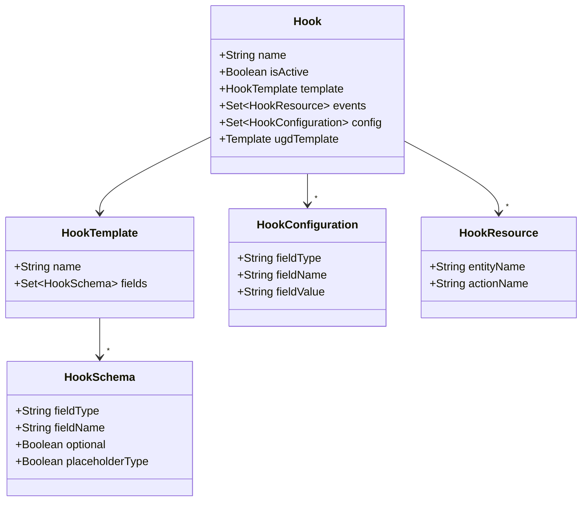
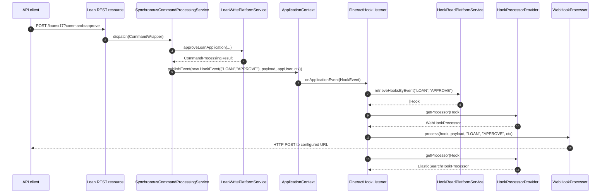

Apache Fineract's hooks framework lets operators install **outbound callbacks at runtime** that
fire whenever a specific `(entityName, actionName)` command finishes successfully on the
[command bus](/command/overview). Unlike [business events](/events/business-events), hooks are
**registered by users through the REST API** — no redeploy, no Java listener. The framework
ships four built-in processors (`Web`, `SMS Bridge`, `Message Gateway`, `Elastic Search`) and
the data model is generic enough that adding a fifth is just a Spring bean.

## Anatomy of a hook

A hook is the conjunction of three database entities:



In plain English:

- **`HookTemplate`** (table `m_hook_templates`) is a *named processor* — `Web`, `SMS Bridge`,
  `Message Gateway`, `Elastic Search`. It comes with a schema of expected fields (URL, content
  type, API key, etc.) defined by `HookSchema` rows.
- **`Hook`** (table `m_hook`) is the *operator-installed instance*: one hook = "POST to this URL
  on these events using this template". It references a template and is active/inactive.
- **`HookConfiguration`** (table `m_hook_configuration`) is the per-hook *field values* — the
  actual URL, content type, API key… one row per configured field.
- **`HookResource`** (table `m_hook_registered_events`) is the *(entity, action) subscription* —
  e.g. `(LOAN, APPROVE)`. A hook can listen to many.

The four entity classes live in
[`fineract-provider/.../infrastructure/hooks/domain/`](https://github.com/apache/fineract/tree/develop/fineract-provider/src/main/java/org/apache/fineract/infrastructure/hooks/domain):

```java
// fineract-provider/.../hooks/domain/Hook.java
@Entity @Table(name = "m_hook")
public final class Hook extends AbstractAuditableCustom {

    @Column(name = "name", nullable = false, length = 100)
    private String name;

    @Column(name = "is_active", nullable = false)
    private Boolean isActive;

    @OneToMany(cascade = CascadeType.ALL, mappedBy = "hook",
               orphanRemoval = true, fetch = FetchType.EAGER)
    private Set<HookResource> events = new HashSet<>();

    @OneToMany(cascade = CascadeType.ALL, mappedBy = "hook",
               orphanRemoval = true, fetch = FetchType.EAGER)
    private Set<HookConfiguration> config = new HashSet<>();

    @ManyToOne(optional = true)
    @JoinColumn(name = "template_id", referencedColumnName = "id", nullable = false)
    private HookTemplate template;

    @ManyToOne(optional = true)
    @JoinColumn(name = "ugd_template_id", referencedColumnName = "id", nullable = true)
    private Template ugdTemplate;     // optional user-generated payload template
}
```

```java
// fineract-provider/.../hooks/domain/HookTemplate.java
@Entity @Table(name = "m_hook_templates")
public final class HookTemplate extends AbstractPersistableCustom<Long> {
    @Column(name = "name", nullable = false, length = 100)
    private String name;

    @OneToMany(cascade = CascadeType.ALL, mappedBy = "template",
               orphanRemoval = true, fetch = FetchType.EAGER)
    private Set<HookSchema> fields = new HashSet<>();
}
```

```java
// fineract-provider/.../hooks/domain/HookConfiguration.java
@Entity @Table(name = "m_hook_configuration")
public class HookConfiguration extends AbstractPersistableCustom<Long> {
    @ManyToOne @JoinColumn(name = "hook_id") private Hook hook;
    @Column(name = "field_type",  length = 20)  private String fieldType;
    @Column(name = "field_name",  length = 100) private String fieldName;
    @Column(name = "field_value", length = 100) private String fieldValue;
}
```

```java
// fineract-provider/.../hooks/domain/HookResource.java
@Entity @Table(name = "m_hook_registered_events")
public class HookResource extends AbstractPersistableCustom<Long> {
    @ManyToOne @JoinColumn(name = "hook_id") private Hook hook;
    @Column(name = "entity_name", length = 45) private String entityName;
    @Column(name = "action_name", length = 45) private String actionName;
}
```

The template-level fields are looked up by name. The constants in
[`HookApiConstants`](https://github.com/apache/fineract/blob/develop/fineract-provider/src/main/java/org/apache/fineract/infrastructure/hooks/api/HookApiConstants.java)
list the standard ones:

```java
public final class HookApiConstants {
    public static final String webTemplateName            = "Web";
    public static final String elasticSearchTemplateName  = "Elastic Search";
    public static final String httpSMSTemplateName        = "Message Gateway";
    public static final String smsTemplateName            = "SMS Bridge";

    public static final String payloadURLName             = "Payload URL";
    public static final String contentTypeName            = "Content Type";
    public static final String smsProviderName            = "SMS Provider";
    public static final String smsProviderAccountIdName   = "SMS Provider Account Id";
    public static final String smsProviderTokenIdName     = "SMS Provider Token";
    public static final String phoneNumberName            = "Phone Number";
    public static final String apiKeyName                 = "Api Key";
    public static final String SMSProviderIdParamName     = "SMS Provider Id";
}
```

## How a hook gets triggered

Hooks plug into the [command bus](/command/overview), not into business events. The publish site
is `SynchronousCommandProcessingService` — *after* the command has been successfully processed
and the response serialized, it builds a `HookEvent` and publishes it through Spring's
`ApplicationEventPublisher`:

```java
// fineract-core/.../commands/service/SynchronousCommandProcessingService.java
final String serializedResult = toApiJsonSerializer.serialize(reqmap);

final HookEvent applicationEvent =
    new HookEvent(hookEventSource, serializedResult, appUser, ThreadLocalContextUtil.getContext());

applicationContext.publishEvent(applicationEvent);
```

`HookEventSource` carries the `(entityName, actionName)` pair; `HookEvent` extends the
project's `FineractEvent` (an `ApplicationEvent` subclass) and adds the payload + the calling
`AppUser` + the `FineractContext` (tenant identifier, business date, etc.).

The Spring container delivers the event to every `ApplicationListener<HookEvent>`. The only such
listener in the codebase is `FineractHookListener`:

```java
// fineract-provider/.../hooks/listener/FineractHookListener.java
@Service
@RequiredArgsConstructor
@Slf4j
public class FineractHookListener implements HookListener {

    private final HookProcessorProvider hookProcessorProvider;
    private final HookReadPlatformService hookReadPlatformService;

    @Override
    public void onApplicationEvent(final HookEvent event) {
        try {
            ThreadLocalContextUtil.init(event.getContext());

            final AppUser appUser = event.getAppUser();
            final HookEventSource hookEventSource = (HookEventSource) event.getSource();
            final FineractContext fineractContext = event.getContext();
            final String entityName = hookEventSource.getEntityName();
            final String actionName = hookEventSource.getActionName();
            final String payload = event.getPayload();

            final List<Hook> hooks = hookReadPlatformService
                .retrieveHooksByEvent(hookEventSource.getEntityName(), hookEventSource.getActionName());

            for (final Hook hook : hooks) {
                final HookProcessor processor = hookProcessorProvider.getProcessor(hook);
                try {
                    processor.process(hook, payload, entityName, actionName, fineractContext);
                } catch (Throwable e) {
                    log.error(
                        "Hook {} failed in HookProcessor {} for tenant/user {}/{}, entity {}, action {}, payload {} ",
                        hook.getId(), processor.getClass().getSimpleName(),
                        fineractContext.getTenantContext().getTenantIdentifier(),
                        appUser.getDisplayName(), entityName, actionName, payload, e);
                }
            }
        } finally {
            ThreadLocalContextUtil.reset();
        }
    }
}
```

Things to notice:

- A single failing hook **does not stop the loop** — its exception is logged and the rest of the
  hooks still fire.
- The listener restores `ThreadLocalContextUtil` so the processor sees the right tenant /
  business date even though it may not be on the original request thread.
- Hook delivery happens **after** the command is committed (this site is reached only when
  `commandProcessingResult` is successful), so a hook cannot roll back the underlying mutation.

## End-to-end flow



## `HookProcessor` SPI

The SPI is one method:

```java
// fineract-provider/.../hooks/processor/HookProcessor.java
public interface HookProcessor {
    void process(Hook hook, String payload, String entityName,
                 String actionName, FineractContext context) throws Exception;
}
```

A processor inspects `hook.getConfig()` (the field/value pairs the operator configured), reads
its own configuration knobs, and delivers `payload` (the serialized command response JSON) to
the destination.

### `HookProcessorProvider` — selecting a processor by template name

```java
// fineract-provider/.../hooks/processor/HookProcessorProvider.java
@Service
@RequiredArgsConstructor
public class HookProcessorProvider {

    private final ApplicationContext applicationContext;

    public HookProcessor getProcessor(final Hook hook) {
        HookProcessor processor;
        final String templateName = hook.getTemplate().getName();
        if (templateName.equalsIgnoreCase(smsTemplateName)) {
            processor = this.applicationContext.getBean("twilioHookProcessor", TwilioHookProcessor.class);
        } else if (templateName.equals(webTemplateName)) {
            processor = this.applicationContext.getBean("webHookProcessor", WebHookProcessor.class);
        } else if (templateName.equals(elasticSearchTemplateName)) {
            processor = this.applicationContext.getBean("elasticSearchHookProcessor", ElasticSearchHookProcessor.class);
        } else if (templateName.equals(httpSMSTemplateName)) {
            processor = this.applicationContext.getBean("messageGatewayHookProcessor", MessageGatewayHookProcessor.class);
        } else {
            processor = null;
        }
        return processor;
    }
}
```

That's the only place the framework branches on template name — to add a new processor you only
need to (a) ship a `HookProcessor` Spring bean, (b) insert a `m_hook_templates` row, and (c) add
the corresponding `else if`.

## Built-in processors

### `WebHookProcessor` — POST JSON to a URL

The web hook is the most-used template. It reads `payloadURLName` and `contentTypeName` from the
hook's configuration:

```java
// fineract-provider/.../hooks/processor/WebHookProcessor.java
@Service @RequiredArgsConstructor
public class WebHookProcessor implements HookProcessor {

    private final ProcessorHelper processorHelper;

    @Override
    public void process(final Hook hook, final String payload, final String entityName,
                        final String actionName, final FineractContext context) {

        final Set<HookConfiguration> config = hook.getConfig();
        String url = "";
        String contentType = "";

        for (final HookConfiguration conf : config) {
            final String fieldName = conf.getFieldName();
            if (fieldName.equals(payloadURLName))   { url = conf.getFieldValue(); }
            if (fieldName.equals(contentTypeName))  { contentType = conf.getFieldValue(); }
        }
        // Build a Retrofit `WebHookService` against `url`, set Content-Type, and POST
        // the JSON payload. The Callback logs success/failure asynchronously.
    }
}
```

Supported `Content Type` values:

- `application/json` — the payload is posted as-is.
- `application/x-www-form-urlencoded` — the JSON object is flattened to form fields.

The underlying HTTP machinery lives in
[`WebHookService`](https://github.com/apache/fineract/blob/develop/fineract-provider/src/main/java/org/apache/fineract/infrastructure/hooks/processor/WebHookService.java)
(a Retrofit interface) and
[`ProcessorHelper`](https://github.com/apache/fineract/blob/develop/fineract-provider/src/main/java/org/apache/fineract/infrastructure/hooks/processor/ProcessorHelper.java)
(which builds a Retrofit client). `ProcessorHelper` can opt into trusting self-signed certs via
the system property `fineract.insecureHttpClient=true`, which is convenient for staging but
should never be enabled in production.

### `TwilioHookProcessor` — outbound SMS via the legacy gateway

The `SMS Bridge` template fires a "send SMS" command back into Fineract itself rather than
calling Twilio directly:

```java
@Service @RequiredArgsConstructor
public class TwilioHookProcessor implements HookProcessor {
    // imports include ACTION_SEND, ENTITY_SMS, apiKeyName
    // reads hook config: api key, sms provider id, message text template
    // looks up client phone number via ClientRepositoryWrapper
    // submits an SMS command (ENTITY_SMS / ACTION_SEND) through the command bus
}
```

It's named "Twilio" for historical reasons; in the current code path it builds an
`SmsMessage` and hands it to `SmsMessageScheduledJobService` which later drains the SMS outbox.

### `MessageGatewayHookProcessor` — push to the SMS gateway micro-service

The `Message Gateway` template is the modern replacement for the Twilio integration. It pushes
the payload to the
[`fineract-message-gateway`](https://github.com/apache/fineract-cn-fineract-message-gateway)
micro-service. The single template field is the `SMS Provider Id`:

```java
@Service @RequiredArgsConstructor
public class MessageGatewayHookProcessor implements HookProcessor {

    @Override
    public void process(Hook hook, String payload, String entityName, String actionName,
                        FineractContext context) throws IOException {
        // pull SMSProviderIdParamName from hook config
        // build a JSON envelope with tenant identifier + payload
        // POST to gateway via Retrofit
    }
}
```

### `ElasticSearchHookProcessor` — index command payload

The Elasticsearch processor uses the same `Payload URL` and `Content Type` fields as the web
processor — they just point at the Elasticsearch ingest endpoint:

```java
@Service @RequiredArgsConstructor
public class ElasticSearchHookProcessor implements HookProcessor {

    private final ProcessorHelper processorHelper;

    @Override
    public void process(final Hook hook, final String payload, final String entityName,
                        final String actionName, final FineractContext context) {
        // same shape as WebHookProcessor; index name typically encoded in the URL
    }
}
```

## `HookApiResource` — managing hooks via REST

[`HookApiResource`](https://github.com/apache/fineract/blob/develop/fineract-provider/src/main/java/org/apache/fineract/infrastructure/hooks/api/HookApiResource.java)
sits at `/v1/hooks`:

```java
@Path("/v1/hooks")
@Consumes({ MediaType.APPLICATION_JSON })
@Produces({ MediaType.APPLICATION_JSON })
public class HookApiResource {

    @GET                                     /* list all hooks */
    public Collection<HookData> retrieveHooks(@Context final UriInfo uriInfo) { ... }

    @GET @Path("{hookId}")                   /* fetch one hook + its template fields */
    public HookData retrieveHook(@PathParam("hookId") final Long hookId, ...) { ... }

    @GET @Path("template")                   /* metadata: available templates and grouping */
    public HookDetailsData template() { ... }

    @POST                                    /* create */
    public HookCreateResponse createHook(@Valid final HookCreateRequest request) { ... }

    @PUT @Path("{hookId}")                   /* update */
    public HookUpdateResponse updateHook(@PathParam("hookId") final Long hookId,
                                         @Valid final HookUpdateRequest request) { ... }

    @DELETE @Path("{hookId}")                /* delete */
    public HookDeleteResponse deleteHook(@PathParam("hookId") final Long hookId) { ... }
}
```

All mutating endpoints dispatch through `CommandDispatcher` (handlers: `HookCreateCommandHandler`,
`HookUpdateCommandHandler`, `HookDeleteCommandHandler`) so hook CRUD itself participates in the
audit log and maker–checker.

The DTOs in `.../hooks/data/` are:

| DTO | Purpose |
| --- | --- |
| `HookCreateRequest` / `HookCreateResponse` | Create payloads |
| `HookUpdateRequest` / `HookUpdateResponse` | Update payloads |
| `HookDeleteRequest` / `HookDeleteResponse` | Delete payloads |
| `HookData` | Hook with its template, configuration map, and events list |
| `HookDetailsData` | Template metadata for the UI (returned by `GET /v1/hooks/template`) |
| `HookEntityData`, `HookEventData`, `HookGroupingData` | Catalogue of available (entity, action) combinations |
| `HookFieldData` | Template field definition (from `HookSchema`) |
| `HookSmsProviderData` | Available SMS provider records |

### Example: register a web hook on loan approval

```bash
curl -X POST https://fineract.example.com/fineract-provider/api/v1/hooks \
  -H "Content-Type: application/json" \
  -H "Authorization: Basic ..." \
  -d '{
    "name": "Web",
    "displayName": "loan-approved-webhook",
    "isActive": true,
    "events": [
      { "actionName": "APPROVE", "entityName": "LOAN" }
    ],
    "config": {
      "Payload URL":  "https://internal.example.com/fineract/loan-approved",
      "Content Type": "json"
    }
  }'
```

After this POST returns 200, any successful `POST /loans/{id}?command=approve` will trigger an
HTTP POST to your URL with the command's JSON response in the body.

## Discovering available `(entity, action)` pairs

The vocabulary is held in `m_hook_events` (one row per supported `(entityName, actionName)`).
The `GET /v1/hooks/template` endpoint returns the list, grouped by entity, ready for the UI:

```json
{
  "groupings": [
    {
      "name": "loan",
      "entities": [
        { "entityName": "LOAN", "actionName": "CREATE"     },
        { "entityName": "LOAN", "actionName": "APPROVE"    },
        { "entityName": "LOAN", "actionName": "DISBURSE"   },
        { "entityName": "LOAN", "actionName": "REPAYMENT"  }
      ]
    },
    {
      "name": "client",
      "entities": [
        { "entityName": "CLIENT", "actionName": "CREATE"   },
        { "entityName": "CLIENT", "actionName": "ACTIVATE" }
      ]
    }
  ],
  "templates": [ { "name": "Web" }, { "name": "SMS Bridge" }, ... ]
}
```

`HookEventMapper` and `HookFieldMapper` (`.../hooks/mapper/`) project the JDBC result sets into
these DTOs.

## Commands and handlers

Hook CRUD goes through three commands and three handlers:

| Command | Handler | Service method |
| --- | --- | --- |
| `HookCreateCommand` | `HookCreateCommandHandler` | `HookWritePlatformServiceImpl.createHook(...)` |
| `HookUpdateCommand` | `HookUpdateCommandHandler` | `HookWritePlatformServiceImpl.updateHook(...)` |
| `HookDeleteCommand` | `HookDeleteCommandHandler` | `HookWritePlatformServiceImpl.deleteHook(...)` |

Reads go through `HookReadPlatformServiceImpl` — JDBC-backed using `HookEventResultSetExtractor`
to flatten the multi-table join (`m_hook` + `m_hook_configuration` + `m_hook_registered_events` +
`m_hook_templates`) into a single `HookData` graph.

## Operational notes

### Threading & back-pressure

`SynchronousCommandProcessingService.publishEvent` calls Spring's default synchronous
event multicaster, so `FineractHookListener.onApplicationEvent(...)` runs **on the request
thread** by default. A slow webhook URL therefore directly increases command latency. Two
mitigations the project recommends:

1. Always front your webhook URLs with a queue (SQS, Kafka REST proxy) — never let them do
   significant synchronous work.
2. Override the `ApplicationEventMulticaster` bean to use an async `TaskExecutor` if your
   deployment can tolerate fire-and-forget semantics (loses ordering with the response).

### Failures

`FineractHookListener` swallows `Throwable` from each processor. There is **no automatic retry**
and no DLQ — failed webhook deliveries are only visible in the application log. For guaranteed
delivery to external systems, prefer the
[external event outbox](/events/external-events-and-producers).

### Idempotency

Hook payloads are the same JSON as the command response, which already carries the
`commandId` / `resourceId` of the originating `CommandSource`. Use that to deduplicate
re-deliveries from your side if the hook is replayed (e.g. because a previous invocation timed
out and you re-ran the command).

### Securing webhook URLs

`HookConfiguration` stores `field_value` as plain `VARCHAR(100)` — long bearer tokens or API
keys may not fit. Use a short token whose lookup is done by the receiving endpoint. For Twilio /
Message Gateway flows, the API keys are stored on dedicated SMS provider records, not on the
hook itself.

## Hooks vs business events vs external events

| Mechanism | Trigger | Latency | Delivery | Configuration | Best for |
| --- | --- | --- | --- | --- | --- |
| **Business event** | `notifyPostBusinessEvent` | Sub-ms in-process | In-transaction | Java code | Internal logic |
| **External event** | Same call, persisted to outbox | Batch (seconds) | At-least-once via JMS/Kafka | `PUT /v1/externalevents/configuration` | Downstream services |
| **Hook** | Command-bus `publishEvent` | On request thread, fire-and-forget | Best effort | `POST /v1/hooks` | Operator-installed callbacks |

Pick the one whose lifecycle, configuration story, and delivery guarantee match your use case.

## What's next

<CardGroup cols={2}>
  <Card title="Command Bus" icon="bolt" href="/command/overview">
    Where the command-bus event that triggers hooks is published.
  </Card>
  <Card title="External Events & Producers" icon="paper-plane" href="/events/external-events-and-producers">
    Stronger delivery guarantees than hooks if you control the consumer.
  </Card>
  <Card title="Notifications" icon="bell" href="/events/notifications">
    The in-app, per-user counterpart to hooks.
  </Card>
  <Card title="Business Events" icon="bolt" href="/events/business-events">
    Java-level alternative when your subscriber is in-process.
  </Card>
</CardGroup>
