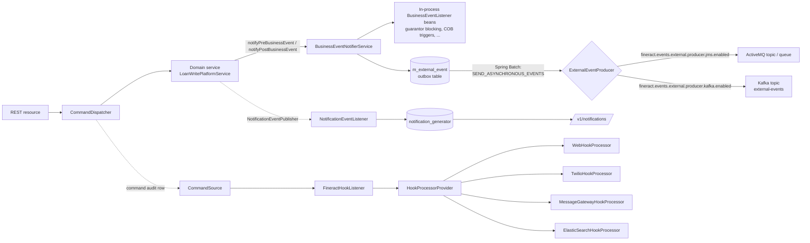

Apache Fineract publishes signals to the outside world through **four parallel mechanisms** that
share neither code nor wiring but cooperate at the domain layer. This page is the map you need
before reading the deep dives. Every loan disbursal, savings deposit, client activation or
generic command-bus mutation can fan out simultaneously to:

1. **In-process `BusinessEvent` listeners** — synchronous Java `BusinessEventListener<T>` beans
   that run inside the same transaction as the business action (e.g. release guarantor funds the
   instant a loan is approved).
2. **External event producers** — the same `BusinessEvent` instances are serialized to **Avro**,
   written into the `m_external_event` outbox table, and shipped by a Spring Batch tasklet to an
   **ActiveMQ** topic/queue or a **Kafka** topic at the configured cadence.
3. **Hooks framework** — generic command-bus interceptor that POSTs JSON to user-registered
   webhooks, fires SMS messages through Twilio or the Message Gateway, or indexes commands in
   Elasticsearch.
4. **In-app notifications** — Spring or ActiveMQ-published events that materialise as user-facing
   notifications stored in `notification_generator` and served by `/v1/notifications`.

The four systems sit at different layers of the stack: business events live next to the domain
services, hooks plug into the [command bus](/command/overview), external events are an outbox on
top of business events, and notifications run on top of the application-event bus. Knowing which
one to extend depends on whether your consumer is in-process, an external service, a SaaS
provider, or the logged-in user.

## The big picture



The boxes on the right are the four mechanisms; the boxes on the left are the **single funnel** —
every write goes through `CommandDispatcher` and most domain services then call
`BusinessEventNotifierService.notifyPostBusinessEvent(...)` before the transaction commits.

## Mechanism 1 — In-process business events

The interfaces that define the SPI live in
[`fineract-core/.../infrastructure/event/business/`](https://github.com/apache/fineract/tree/develop/fineract-core/src/main/java/org/apache/fineract/infrastructure/event/business):

- `BusinessEvent<T>` — minimal contract: `get()`, `getType()`, `getCategory()`, `getAggregateRootId()`.
- `AbstractBusinessEvent<T>` — Lombok-backed convenience base class.
- `BusinessEventListener<T>` — the single-method consumer SPI (`onBusinessEvent(T event)`).
- `BusinessEventNotifierService` — service that domain code calls to fan out, and listeners use
  to register themselves at startup.

A domain service raises an event like this:

```java
businessEventNotifierService.notifyPreBusinessEvent(new LoanCreateBusinessEvent(loan));
// ...mutate the aggregate...
businessEventNotifierService.notifyPostBusinessEvent(new LoanCreateBusinessEvent(loan));
```

The notifier service walks two `Map<Class<? extends BusinessEvent<?>>, List<BusinessEventListener<?>>>`
registries (pre and post) and dispatches each event **synchronously, inside the caller's
transaction**. That synchronous-and-transactional guarantee is critical: rolling back the domain
mutation rolls back the listener side effects, and listeners see a fully-mutated aggregate.

The concrete event classes — `LoanCreateBusinessEvent`, `LoanApprovedBusinessEvent`,
`ClientActivateBusinessEvent`, `SavingsApproveBusinessEvent`, `SavingsDepositBusinessEvent`,
`ShareAccountApproveBusinessEvent`, `FixedDepositAccountCreateBusinessEvent`, etc. — live under
`fineract-provider/.../infrastructure/event/business/domain/{client,loan,savings,deposit,share,group}/`.
The full catalogue is enumerated in [Business Events](/events/business-events).

## Mechanism 2 — The external event outbox

The external pipeline exists because most production integrators (data lakes, fraud engines,
core-banking peers, CRM systems) want a durable feed of "what happened" without having to write
Java listeners inside Fineract. The producer side has four moving parts:

- **`ExternalBusinessEventConfigurationServiceImpl`** — inspects the
  `m_external_event_configuration` row for the event's type; if `enabled = true`, serialization is
  triggered.
- **`*BusinessEventSerializer` beans** (under
  `fineract-provider/.../event/external/service/serialization/serializer/`) — translate the
  in-process event into an Avro record (see `LoanBusinessEventSerializer`,
  `ClientBusinessEventSerializer`, etc.).
- **`m_external_event` outbox table** — written in the same transaction as the business event;
  schema captured by the [`ExternalEvent`](https://github.com/apache/fineract/blob/develop/fineract-core/src/main/java/org/apache/fineract/infrastructure/event/external/repository/domain/ExternalEvent.java)
  entity (`type`, `category`, `schema`, `data` bytes, `created_at`, `status`, `idempotency_key`,
  `business_date`, `aggregate_root_id`).
- **`SEND_ASYNCHRONOUS_EVENTS` job** — Spring Batch tasklet
  (`SendAsynchronousEventsTasklet`) that picks up `TO_BE_SENT` rows, partitions them by
  `aggregate_root_id`, wraps each into a top-level `MessageV1` Avro envelope, and hands the byte
  arrays to whichever `ExternalEventProducer` bean is wired up:
  - `JMSMultiExternalEventProducer` — `@ConditionalOnProperty("fineract.events.external.producer.jms.enabled")`.
  - `KafkaExternalEventProducer` — `@ConditionalOnProperty("fineract.events.external.producer.kafka.enabled")`.
  - `NoopExternalEventProducer` — the fallback when no channel is enabled.

`PURGE_EXTERNAL_EVENTS` is a sibling tasklet (`PurgeExternalEventsTasklet`) that deletes rows
older than `external-events-purge-data-criteria` days once they've reached `SENT`.

The wire format is described by Avro `.avsc` files in `fineract-avro-schemas/` — see
[External Events & Producers](/events/external-events-and-producers).

## Mechanism 3 — Hooks (generic per-command webhooks)

Hooks operate at the command-bus level, not at the domain-event level. Whenever a command of
`(entityName, actionName)` finishes successfully, the `FineractHookListener` queries
`m_hook_resource` for any active hooks subscribed to that pair and dispatches the JSON payload
through one of the four built-in processors:

| Template name (`m_hook_templates.name`) | Processor bean | Purpose |
| --- | --- | --- |
| `Web` | `WebHookProcessor` | POST JSON to a user-supplied URL |
| `SMS Bridge` | `TwilioHookProcessor` | Send SMS via Twilio |
| `Message Gateway` | `MessageGatewayHookProcessor` | Push commands to the SMS gateway micro-service |
| `Elastic Search` | `ElasticSearchHookProcessor` | Index command payload into Elasticsearch |

Hooks are configured by **administrators** through `/v1/hooks` (`HookApiResource`) — see
[Hooks Framework](/events/hooks-framework). Unlike business events, hooks are a "subscribe at
runtime" feature: an integrator deploys, then registers a hook through the REST API and starts
receiving callbacks immediately.

## Mechanism 4 — In-app notifications

Notifications target the **user interface**, not external systems. The notification subsystem
lives in `fineract-provider/.../notification/`:

- `NotificationEventPublisher` — either `SpringNotificationEventPublisher` (in-process
  `ApplicationEventPublisher`) or `ActiveMQNotificationEventPublisher` when
  `activeMqEnabled` profile is on.
- `NotificationEventListener` — consumes the `NotificationData` and calls
  `UserNotificationService.notifyUsers(...)`.
- `Notification` entity (`notification_generator` table) and `NotificationMapper`
  (`notification_mapper`) record the message and the per-user mapping respectively.
- `/v1/notifications` (`NotificationApiResource`) returns paginated unread or full lists for the
  logged-in user.

A `CacheNotificationResponseHeader` is also injected into responses so SPAs can poll for "do I
have new notifications since last fetch?" without re-querying the whole list. Full details in
[Notifications](/events/notifications).

## Why four systems, not one?

The split is not accidental. Each system answers a different latency / coupling question:

<CardGroup cols={2}>
  <Card title="Business events — in process, transactional" icon="bolt">
    Sub-millisecond delivery, all-or-nothing with the originating mutation, but coupled to the
    Java classpath. Used by code Fineract itself ships (guarantor release, NPA bucket update,
    delinquency classification…).
  </Card>
  <Card title="External events — durable, eventually consistent" icon="database">
    Outbox semantics; the broker may be down for hours. Used for data lakes, downstream
    micro-services, BI pipelines. Per-type toggles via
    `ExternalEventConfigurationApiResource`.
  </Card>
  <Card title="Hooks — operator-installed, command-level" icon="plug">
    Subscribe at run-time without redeploying Fineract. Best for SaaS integrations (SMS, search
    indexing) tied to a single `(entity, action)` pair.
  </Card>
  <Card title="Notifications — user-facing, UI-bound" icon="bell">
    Cached, per-user, polled by the SPA. Don't use these for machine-to-machine integration —
    they're scoped to the AppUser table.
  </Card>
</CardGroup>

## Choosing the right mechanism

A common decision matrix:

| You need to… | Pick | Why |
| --- | --- | --- |
| Run logic inside the same DB transaction as the loan approval | **Business event listener** | Synchronous + transactional |
| Push every loan disbursal into a downstream data warehouse | **External event** | Outbox, idempotent, Avro-typed |
| Let the operator hit any URL on `LOAN.APPROVE` without redeploying | **Hook (Web template)** | UI-managed |
| Send an SMS to the borrower when their loan is approved | **Hook (SMS Bridge / Message Gateway template)** | Pre-wired processors |
| Surface a banner inside the Fineract Web UI when a checker has a task | **Notification** | Cached, per-user, paged |

If two consumers need the same payload, prefer business events for **internal Java code** and
external events for **everything else**. The hook framework should not be used for high-volume
machine integrations: it executes per command on the request thread (and so is bounded by the
command bus's throughput).

## Configuration toggles at a glance

External-event toggles live under `fineract.events.external.*` in
`fineract-provider/src/main/resources/application.properties`:

```properties
fineract.events.external.enabled=${FINERACT_EXTERNAL_EVENTS_ENABLED:false}
fineract.events.external.partition-size=${FINERACT_EXTERNAL_EVENTS_PARTITION_SIZE:5000}
fineract.events.external.producer.jms.enabled=${FINERACT_EXTERNAL_EVENTS_PRODUCER_JMS_ENABLED:false}
fineract.events.external.producer.jms.broker-url=${FINERACT_EXTERNAL_EVENTS_PRODUCER_JMS_BROKER_URL:tcp://127.0.0.1:61616}
fineract.events.external.producer.kafka.enabled=${FINERACT_EXTERNAL_EVENTS_KAFKA_ENABLED:false}
fineract.events.external.producer.kafka.bootstrap-servers=${FINERACT_EXTERNAL_EVENTS_KAFKA_BOOTSTRAP_SERVERS:localhost:9092}
fineract.events.external.producer.kafka.topic.name=${FINERACT_EXTERNAL_EVENTS_KAFKA_TOPIC_NAME:external-events}
```

Notifications are gated by the Spring `activeMqEnabled` profile (see
`SpringNotificationEventPublisher` vs `ActiveMQNotificationEventPublisher`). Hooks are always
active — they only fire when there is at least one matching row in `m_hook`.

The full list of properties and how they map into `FineractProperties.FineractEventsProperties`
is in [Event Configuration](/events/event-configuration).

## Threading and ordering

Business events fan out **on the caller's thread**, so they preserve the natural ordering of the
domain operation: pre-listeners run, the aggregate mutates, post-listeners run, the JPA
transaction commits.

External events also enqueue **on the caller's thread** (writing the outbox row inside the same
transaction), but actual broker delivery happens later: `SendAsynchronousEventsTasklet` reads the
table in batches of `partition-size`, groups by `aggregate_root_id` so that all events for the
same loan/savings/client are sent to the same Kafka partition (preserving per-aggregate order),
and dispatches them in parallel using the `eventMarksAsSentExecutor` thread pool.

Hooks dispatch in `FineractHookListener.onApplicationEvent(HookEvent)` — synchronously on the
event-publishing thread inside `ThreadLocalContextUtil.init(...)`, which is why a slow webhook
can backpressure the command thread. Pin hook URLs to fast endpoints or front them with a queue.

Notifications go through `ApplicationEventPublisher.publishEvent(...)` (or `JmsTemplate.convertAndSend`
for the ActiveMQ profile). Spring's default async event multicaster makes them effectively
fire-and-forget from the producer's perspective.

## Gradle modules and packages at a glance

```
fineract-core/src/main/java/org/apache/fineract/infrastructure/event/
├── business/
│   ├── BusinessEventListener.java          (the SPI consumers implement)
│   ├── domain/                             (BusinessEvent, AbstractBusinessEvent,
│   │                                        BulkBusinessEvent, NoExternalEvent,
│   │                                        datatable/* events)
│   └── service/                            (BusinessEventNotifierService(Impl),
│                                            ExternalBusinessEventConfigurationService(Impl))
└── external/
    ├── api/                                (ExternalEventConfigurationApiResource,
    │                                        InternalExternalEventsApiResource (TEST profile))
    ├── command/                            (ExternalConfigurationsUpdateCommand)
    ├── config/                             (NoopExternalEventEnabled)
    ├── data/                               (ExternalEventConfigurationResponse, ...)
    ├── exception/                          (ExternalEventConfigurationNotFoundException)
    ├── handler/                            (ExternalEventConfigurationUpdateHandler)
    ├── jobs/                               (SendAsynchronousEventsTasklet/Config,
    │                                        PurgeExternalEventsTasklet/Config)
    ├── producer/                           (ExternalEventProducer SPI + Noop impl)
    ├── repository/                         (ExternalEventRepository, ExternalEventConfigurationRepository,
    │                                        domain/{ExternalEvent, ExternalEventConfiguration,
    │                                        ExternalEventStatus, ExternalEventView})
    └── service/                            (read/write services, idempotency, message,
                                             serialization, support, validation)

fineract-provider/src/main/java/org/apache/fineract/infrastructure/event/
├── business/domain/                        (concrete *BusinessEvent classes)
│   ├── client/                             (ClientCreate/Activate/Reject)
│   ├── deposit/                            (Fixed/Recurring deposit account create)
│   ├── group/                              (Groups/Centers create)
│   ├── loan/product/                       (LoanProduct create)
│   ├── savings/                            (Savings create/approve/activate/reject/close/postInterest)
│   │   └── transaction/                    (Deposit/Withdrawal/ForceWithdrawal)
│   └── share/                              (ShareAccount, ShareProductDividents)
└── external/
    ├── config/                             (ExternalEventJMSConfiguration,
    │                                        ExternalEventKafkaConfiguration,
    │                                        KafkaExternalEventTopicConfig,
    │                                        ExternalEventsKafkaTopicAutoCreateCondition)
    ├── producer/jms/                       (JMSMultiExternalEventProducer)
    ├── producer/kafka/                     (KafkaExternalEventProducer)
    └── service/serialization/              (mapper/* MapStruct mappers, serializer/* serializers)

fineract-avro-schemas/src/main/avro/
├── MessageV1.avsc                          (the outer envelope)
├── BulkMessagePayloadV1.avsc, BulkMessageItemV1.avsc
└── {client,document,fixeddeposit,generic,gl,group,loan,recurringdeposit,savings,share}/v1/*.avsc

fineract-provider/src/main/java/org/apache/fineract/infrastructure/hooks/
├── api/                                    (HookApiResource, HookApiConstants)
├── command/                                (HookCreate/Update/Delete commands)
├── data/                                   (HookData, HookCreateRequest, HookDetailsData, ...)
├── domain/                                 (Hook, HookTemplate, HookConfiguration, HookSchema,
│                                            HookResource entities + repositories)
├── handler/                                (HookCreate/Update/DeleteCommandHandler)
├── listener/                               (FineractHookListener, HookListener)
├── mapper/                                 (HookEventMapper, HookFieldMapper)
├── processor/                              (HookProcessor SPI + Web/Twilio/MessageGateway/ElasticSearch impls)
└── service/                                (HookRead/WritePlatformService(Impl))

fineract-provider/src/main/java/org/apache/fineract/notification/
├── api/                                    (NotificationApiResource)
├── cache/                                  (CacheNotificationResponseHeader)
├── config/                                 (MessagingConfiguration - ActiveMQ wiring)
├── data/                                   (NotificationData, NotificationMapperData)
├── domain/                                 (Notification, NotificationMapper + repositories)
├── eventandlistener/                       (Spring + ActiveMQ publishers and listeners,
│                                            NotificationEventListener)
├── service/                                (NotificationDomainServiceImpl, UserNotificationServiceImpl,
│                                            NotificationReadPlatformServiceImpl, generator+mapper
│                                            read/write services)
└── starter/                                (NotificationConfiguration - autoconfig)
```

Everything in `fineract-core` is API; everything in `fineract-provider` is implementation. The
Avro schemas are their own Gradle module so consumer micro-services can depend on the generated
classes without pulling in the Fineract Spring stack.

## Where to read next

<CardGroup cols={2}>
  <Card title="Business Events" icon="bolt" href="/events/business-events">
    The `BusinessEventListenable` SPI and the per-domain event catalogue.
  </Card>
  <Card title="External Events & Producers" icon="paper-plane" href="/events/external-events-and-producers">
    Outbox table, Avro serialization, JMS and Kafka producers, batch jobs.
  </Card>
  <Card title="Event Configuration" icon="sliders" href="/events/event-configuration">
    The per-event-type on/off table and its REST API.
  </Card>
  <Card title="Hooks Framework" icon="plug" href="/events/hooks-framework">
    Web, SMS, Message Gateway, and Elasticsearch hook processors.
  </Card>
  <Card title="Notifications" icon="bell" href="/events/notifications">
    The in-app notification pipeline and `/v1/notifications` resource.
  </Card>
</CardGroup>
