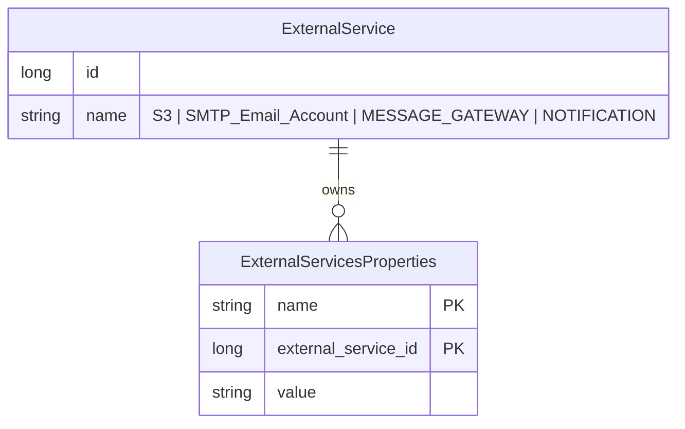
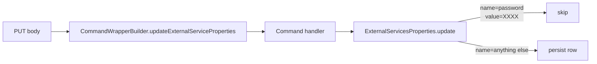

Apache Fineract centralises third‑party service credentials in one table, `c_external_service_properties`, and exposes a single REST resource — `ExternalServicesConfigurationApiResource` at `/v1/externalservice/{servicename}` — to read and update them. The five known services (S3 object storage, SMTP email, the SMS message gateway, push notification servers, and any custom integration) all reuse the same name/value row layout, so the runtime config that drives Amazon S3 document storage looks identical, structurally, to the FCM server key used by the notification dispatcher. This page is the reference for the data model, the REST surface, the per‑service property names, and the masking that keeps passwords from leaking back through `GET` responses.

Source root: `fineract-provider/src/main/java/org/apache/fineract/infrastructure/configuration/`.

## The data model



### `c_external_service`

Service catalogue. The names are constants on `infrastructure/configuration/service/ExternalServicesConstants.java`:

```java
public static final String S3_SERVICE_NAME           = "S3";
public static final String SMTP_SERVICE_NAME         = "SMTP_Email_Account";
public static final String SMS_SERVICE_NAME          = "MESSAGE_GATEWAY";
public static final String NOTIFICATION_SERVICE_NAME = "NOTIFICATION";
```

These are the values you put in the `{servicename}` path segment.

### `c_external_service_properties`

The key/value rows. Mapped by `infrastructure/configuration/domain/ExternalServicesProperties.java`:

```java
@Entity
@Table(name = "c_external_service_properties")
public class ExternalServicesProperties {

    @EmbeddedId
    ExternalServicePropertiesPK externalServicePropertiesPK;

    @Column(name = "value", length = 250)
    private String value;
    // ...
}
```

The composite key (`ExternalServicePropertiesPK`) pairs `external_service_id` with `name`, meaning each `(service, property)` combination is unique.

## Service properties

The constants file enumerates every property name the platform understands. They map 1‑to‑1 to rows you should insert when you enable a service.

### S3 (`S3`)

| Property name | Constant | Purpose |
|---|---|---|
| `s3_bucket_name` | `S3_BUCKET_NAME` | Bucket holding tenant documents / images. |
| `s3_access_key` | `S3_ACCESS_KEY` | IAM access key id. |
| `s3_secret_key` | `S3_SECRET_KEY` | IAM secret. *Not* in the secret‑mask list (see below). |

Read pattern in `infrastructure/configuration/service/ExternalServicesPropertiesReadPlatformServiceImpl.java` returns these as an `S3CredentialsData`.

### SMTP (`SMTP_Email_Account`)

| Property name | Purpose |
|---|---|
| `username` | SMTP login. |
| `password` | SMTP password — **masked on read**. |
| `host` | Mail relay host. |
| `port` | Port (numeric, kept as string). |
| `useTLS` | `true`/`false`. |
| `fromEmail` | Default From address. |
| `fromName` | Default From display name. |

These are surfaced through `SMTPCredentialsData`. The platform reads them when sending campaign emails, two‑factor codes via email, and notifications.

### SMS message gateway (`MESSAGE_GATEWAY`)

| Property name | Constant | Used by |
|---|---|---|
| `host_name` | `SMS_HOST` | `SmsConfigUtils.getMessageGateWayRequestURI(...)` |
| `port_number` | `SMS_PORT` | same |
| `end_point` | `SMS_END_POINT` | same |
| `tenant_app_key` | `SMS_TENANT_APP_KEY` | sent as a header to authenticate the tenant against the intermediate gateway |

See [SMS gateway integration](/external-services/sms-gateway) for the dispatch loop that consumes these.

### Notifications (`NOTIFICATION`)

| Property name | Constant | Purpose |
|---|---|---|
| `server_key` | `NOTIFICATION_SERVER_KEY` | FCM/GCM server key — **masked on read**. |
| `gcm_end_point` | `NOTIFICATION_GCM_END_POINT` | Legacy GCM URL. |
| `fcm_end_point` | `NOTIFICATION_FCM_END_POINT` | FCM HTTP endpoint, e.g. `https://fcm.googleapis.com/fcm/send`. |

These feed `infrastructure/gcm/service/NotificationSenderService` — see [Notifications: GCM and FCM](/external-services/notifications-gcm-and-fcm).

## REST surface

`infrastructure/configuration/api/ExternalServicesConfigurationApiResource.java`:

```java
@Path("/v1/externalservice")
@Tag(name = "External Services",
     description = "External Services Configuration related to set of supported "
                 + "configurations for third party services like Amazon S3 and SMTP:...")
public class ExternalServicesConfigurationApiResource {
    // ...
}
```

### `GET /v1/externalservice/{servicename}`

Returns all rows for the named service as a `Collection<ExternalServicesPropertiesData>`:

```java
public String retrieveOne(@PathParam("servicename") final String serviceName,
        @Context final UriInfo uriInfo) {
    this.context.authenticatedUser().validateHasReadPermission(
            ExternalServiceConfigurationApiConstant.EXTERNAL_SERVICE_RESOURCE_NAME);
    final ApiRequestJsonSerializationSettings settings =
            this.apiRequestParameterHelper.process(uriInfo.getQueryParameters());
    final Collection<ExternalServicesPropertiesData> externalServiceNVPs =
            this.externalServicePropertiesReadPlatformService.retrieveOne(serviceName);
    return this.toApiJsonSerializer.serialize(settings, externalServiceNVPs,
            ExternalServiceConfigurationApiConstant.EXTERNAL_SERVICE_CONFIGURATION_DATA_PARAMETERS);
}
```

Example:

```http
GET /fineract-provider/api/v1/externalservice/SMTP_Email_Account
```

```json
[
  { "name": "username",  "value": "smtp-user" },
  { "name": "password",  "value": "p****ord" },
  { "name": "host",      "value": "smtp.example.com" },
  { "name": "port",      "value": "587" },
  { "name": "useTLS",    "value": "true" },
  { "name": "fromEmail", "value": "no-reply@example.com" },
  { "name": "fromName",  "value": "Acme Bank" }
]
```

Note the `password` is masked — see [Secret masking](#secret-masking) for the exact format.

### `PUT /v1/externalservice/{servicename}`

```java
public String updateExternalServiceProperties(
        @PathParam("servicename") final String serviceName,
        final String apiRequestBodyAsJson) {
    final CommandWrapper commandRequest = new CommandWrapperBuilder()
            .updateExternalServiceProperties(serviceName)
            .withJson(apiRequestBodyAsJson).build();
    final CommandProcessingResult result =
            this.commandsSourceWritePlatformService.logCommandSource(commandRequest);
    return this.toApiJsonSerializer.serialize(result);
}
```

The body is a flat object with the property names you want to set or change:

```http
PUT /fineract-provider/api/v1/externalservice/SMTP_Email_Account
Content-Type: application/json

{
  "username": "smtp-user",
  "password": "new-password",
  "host":     "smtp.example.com",
  "port":     "587",
  "useTLS":   "true",
  "fromEmail":"no-reply@example.com",
  "fromName": "Acme Bank"
}
```

The write service walks the body and either inserts a new row or updates an existing value through `ExternalServicesProperties.update(...)`. Two key behaviours of that updater:

```java
public Map<String, Object> update(final JsonCommand command, String paramName) {
    final Map<String, Object> actualChanges = new LinkedHashMap<>(2);
    final String valueParamName = ExternalservicePropertiesJSONinputParams.VALUE.getValue();
    if (command.isChangeInStringParameterNamed(paramName, this.value)) {
        final String newValue = command.stringValueOfParameterNamed(paramName);
        if (paramName.equals(SMTPJSONinputParams.PASSWORD.getValue()) && newValue.equals("XXXX")) {
            // If Param Name is Password and ParamValue is XXXX that means
            // the password has not been changed.
        } else {
            actualChanges.put(valueParamName, newValue);
        }
        this.value = StringUtils.defaultIfEmpty(newValue, null);
    }
    return actualChanges;
}
```

- An update that resubmits the literal `XXXX` for `password` is treated as "no change" — convenient when round‑tripping the JSON from a `GET`.
- Setting a value to an empty string nulls the column.



## Secret masking

`ExternalServicesPropertiesReadPlatformServiceImpl` declares the names that should never be returned in clear text:

```java
private static final class ExternalServiceMapper implements RowMapper<ExternalServicesPropertiesData> {
    List<String> secretAttributes;

    ExternalServiceMapper() {
        secretAttributes = new ArrayList<>();
        secretAttributes.add("password");
        secretAttributes.add("server_key");
    }

    @Override
    public ExternalServicesPropertiesData mapRow(ResultSet rs, int rowNum) throws SQLException {
        final String name = rs.getString("name");
        String value = rs.getString("value");
        // Masking the password as we should not send the password back
        if (name != null && secretAttributes.contains(name)) {
            value = StringUtil.maskValue(value);
        }
        return new ExternalServicesPropertiesData().setName(name).setValue(value);
    }
}
```

What you need to know:

- **Only `password` and `server_key` are masked.** `s3_secret_key`, `tenant_app_key`, `subscriptionkey` (credit‑bureau), and other secrets are stored and returned in clear. If you put Fineract behind a reverse proxy that logs response bodies you should treat the whole `/v1/externalservice/**` response as sensitive.
- **The mask format.** `StringUtil.maskValue` (in `fineract-core` `infrastructure/core/service/StringUtil.java`) keeps the first character and the last four characters of the value, replacing everything in between with `*`. Values of four characters or fewer collapse to the literal `****`:

  ```java
  public static String maskValue(String value, Integer unmaskedLength) {
      if (value.length() <= unmaskedLength) {
          return "****";
      }
      return value.substring(0, 1) + "*".repeat(value.length() - 1 - unmaskedLength)
              + value.substring(value.length() - unmaskedLength);
  }
  ```

- **Round‑trip caveat.** `ExternalServicesProperties.update(...)` only skips writes when the literal string `"XXXX"` is re‑posted for `password`. Because the read‑side mask does **not** produce `"XXXX"` (it produces e.g. `p****word`), naively round‑tripping a `GET` body back through `PUT` will overwrite the password with the mask. Strip masked fields client‑side before issuing the update, or post the literal `"XXXX"` to leave the existing value untouched. No equivalent skip exists for `server_key`, so the same care applies there.
- **At rest there is no platform‑managed encryption** of these columns. If your security policy demands at‑rest encryption, configure it at the database tier (e.g. column‑level encryption in MariaDB / TDE in PostgreSQL).

## Read paths used by other subsystems

The properties are loaded directly by integration consumers rather than being injected as Spring properties — so a runtime change becomes effective on the next call without a restart:

| Consumer | Method | Properties read |
|---|---|---|
| Document storage | `S3ContentStoreService` (`fineract-document` module) | `s3_bucket_name`, `s3_access_key`, `s3_secret_key` |
| Email sending | `GmailBackedPlatformEmailService` | All seven SMTP properties |
| SMS dispatcher | `SmsMessageScheduledJobServiceImpl` via `SmsConfigUtils.getMessageGateWayRequestURI` | `host_name`, `port_number`, `end_point`, `tenant_app_key` |
| Push notifications | `NotificationSenderService.sendNotification(...)` | `server_key`, `fcm_end_point` |

Helper accessors are exposed on `ExternalServicesPropertiesReadPlatformService`:

```java
public interface ExternalServicesPropertiesReadPlatformService {
    S3CredentialsData getS3Credentials();
    SMTPCredentialsData getSMTPCredentials();
    MessageGatewayConfigurationData getSMSGateway();
    Collection<ExternalServicesPropertiesData> retrieveOne(String serviceName);
    NotificationConfigurationData getNotificationConfiguration();
}
```

## Permissions

Reads and updates both gate on the `EXTERNAL_SERVICE_RESOURCE_NAME` permission (`READ_EXTERNALSERVICES` and `UPDATE_EXTERNALSERVICES` in `m_permission`). Updates dispatch through `PortfolioCommandSourceWritePlatformService.logCommandSource(...)`, so:

- Every change lands in `m_portfolio_command_source` for audit.
- Maker‑checker (if you turn it on for command `UPDATE_EXTERNALSERVICES`) will require a checker to approve before the row is written.

## Bootstrapping a new tenant

The simplest bootstrap is straight SQL:

```sql
-- Catalogue rows are created by the platform migration scripts.
-- You just write into c_external_service_properties:

INSERT INTO c_external_service_properties (external_service_id, name, value) VALUES
  ((SELECT id FROM c_external_service WHERE name = 'S3'), 's3_bucket_name', 'acme-fineract-docs'),
  ((SELECT id FROM c_external_service WHERE name = 'S3'), 's3_access_key',  'AKIA...'),
  ((SELECT id FROM c_external_service WHERE name = 'S3'), 's3_secret_key',  '...');
```

…or — better — call `PUT /v1/externalservice/S3` with the same key set so it goes through audit and event hooks. The PUT path also lets you target only the keys you want to rotate, instead of rewriting every row.

## What's *not* here

This is the right place for S3, SMTP, MESSAGE_GATEWAY and NOTIFICATION configuration. It is **not** the right place for:

- **Global platform configuration** (toggles like "amazon‑S3", "make‑rest‑api‑public", etc.) — those live in `c_configuration` and are managed through `/v1/configurations` on `GlobalConfigurationApiResource`.
- **Credit‑bureau credentials** — those live in `m_creditbureau_configuration` and have their own [Credit Bureau API](/creditbureau/configuration-and-integration-api).
- **OAuth client credentials** — those are populated by the OAuth2 starter at boot, not by REST.

## Related pages

- [SMS gateway integration](/external-services/sms-gateway) — what the `MESSAGE_GATEWAY` properties feed.
- [Notifications: GCM and FCM](/external-services/notifications-gcm-and-fcm) — what the `NOTIFICATION` properties feed.
- [Credit Bureau Overview](/creditbureau/overview) — analogous configuration mechanism for bureaus.
