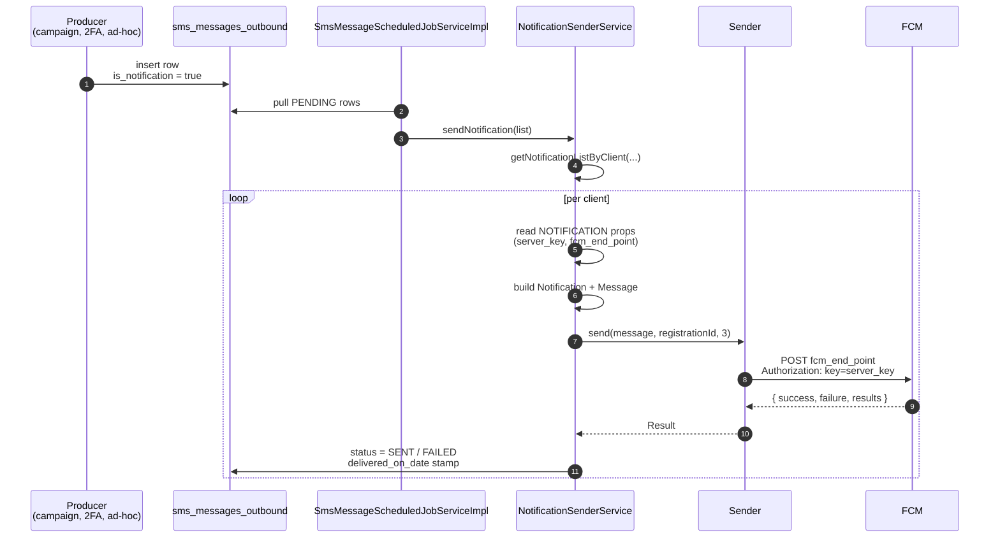

Apache Fineract embeds a small Google Cloud Messaging / Firebase Cloud Messaging (GCM / FCM) helper under `fineract-provider/src/main/java/org/apache/fineract/infrastructure/gcm/`. It is intentionally a thin, self‑contained client — three model classes (`Message`, `Notification`, `Result`/`MulticastResult`), one `Sender` that knows how to JSON‑encode a request and parse FCM responses, and one Spring service (`NotificationSenderService`) that bridges the outbound SMS table into a push call. There is no JAX‑RS resource exposing FCM directly: notifications enter the system as `sms_messages_outbound` rows with `is_notification = true`, and the scheduler dispatches them through the helper using credentials from the `NOTIFICATION` external service.

This page documents how the helper is wired, how the JSON it builds maps to FCM's HTTP API, and what to put into `c_external_service_properties` so the dispatch actually works.

## Where it lives

```
infrastructure/gcm/
├── GcmConstants.java                # JSON key names and parameter constants
├── domain/
│   ├── Message.java                 # Builder for the FCM request body
│   ├── Notification.java            # Builder for the "notification" object
│   ├── Result.java                  # Per-recipient result
│   ├── MulticastResult.java         # Aggregate result for /fcm/send
│   ├── Sender.java                  # HTTP client + JSON encode/decode + retries
│   └── NotificationConfigurationData.java
├── exception/
│   └── InvalidRequestException.java
└── service/
    └── NotificationSenderService.java
```

There is no entity in this package — the runtime state of a push lives back in `sms_messages_outbound`.

## End‑to‑end flow



## `Message` and `Notification`

Two builders produce the wire format:

```java
Notification notification = new Notification.Builder(GcmConstants.defaultIcon)
    .title(GcmConstants.title)
    .body(smsMessage.getMessage())
    .build();

Message message = new Message.Builder()
    .notification(notification)
    .dryRun(false)
    .contentAvailable(true)
    .timeToLive(GcmConstants.TIME_TO_LIVE)
    .priority(Priority.HIGH)
    .delayWhileIdle(true)
    .build();
```

`Message` carries the FCM top‑level fields and a `Map<String, String> data` for custom payload:

```java
public final class Message implements Serializable {
    private String collapseKey;
    private Boolean delayWhileIdle;
    private Integer timeToLive;
    private Map<String, String> data;
    private Boolean dryRun;
    private String restrictedPackageName;
    private String priority;
    private Boolean contentAvailable;
    private Notification notification;

    public enum Priority { NORMAL, HIGH }
}
```

`Notification` is the user‑visible part — title, body, icon, sound, badge, tag, color, click action, localisation keys:

```java
public final class Notification implements Serializable {
    private String title;
    private String body;
    private String icon;
    private String sound;
    private Integer badge;
    private String tag;
    private String color;
    private String clickAction;
    private String bodyLocKey;
    private List<String> bodyLocArgs;
    private String titleLocKey;
    private List<String> titleLocArgs;
}
```

`GcmConstants.TIME_TO_LIVE = 30` (seconds) and `defaultIcon = "default"` are the defaults the platform uses; the standard title `Hello !` is also a constant, so by default every push surfaces with that title until you customise the call site.

## The wire format

`Sender.makeGcmHttpRequest(...)` translates the builders into the FCM JSON. All the JSON field names are constants on `GcmConstants` — the relevant ones:

| Top‑level field | Constant |
|---|---|
| `to` | `JSON_TO` |
| `registration_ids` | `JSON_REGISTRATION_IDS` |
| `notification` | `JSON_NOTIFICATION` |
| `data` | `JSON_PAYLOAD` |
| `collapse_key` | `PARAM_COLLAPSE_KEY` |
| `delay_while_idle` | `PARAM_DELAY_WHILE_IDLE` |
| `dry_run` | `PARAM_DRY_RUN` |
| `restricted_package_name` | `PARAM_RESTRICTED_PACKAGE_NAME` |
| `time_to_live` | `PARAM_TIME_TO_LIVE` |
| `priority` | `PARAM_PRIORITY` |
| `content_available` | `PARAM_CONTENT_AVAILABLE` |

A typical request looks like:

```json
POST https://fcm.googleapis.com/fcm/send
Authorization: key=<server_key from NOTIFICATION>
Content-Type: application/json

{
  "to": "<device registration id>",
  "priority": "high",
  "delay_while_idle": true,
  "time_to_live": 30,
  "content_available": true,
  "dry_run": false,
  "notification": {
    "icon":  "default",
    "title": "Hello !",
    "body":  "Reminder: your next instalment is due Friday.",
    "sound": "default"
  }
}
```

FCM's response is parsed into a `Result` (single‑recipient call) or `MulticastResult` (with `registration_ids`):

| JSON | Constant | Read into |
|---|---|---|
| `success` | `JSON_SUCCESS` | `MulticastResult.success` |
| `failure` | `JSON_FAILURE` | `MulticastResult.failure` |
| `canonical_ids` | `JSON_CANONICAL_IDS` | `MulticastResult.canonicalIds` |
| `multicast_id` | `JSON_MULTICAST_ID` | `MulticastResult.multicastId` |
| `results[]` | `JSON_RESULTS` | list of `Result` |
| `message_id` | `JSON_MESSAGE_ID` | `Result.messageId` |
| `registration_id` | `TOKEN_CANONICAL_REG_ID` | `Result.canonicalRegistrationId` |
| `error` | `JSON_ERROR` | `Result.errorCode` |

## `Sender` — retries and back‑off

```java
public class Sender {
    protected static final int BACKOFF_INITIAL_DELAY = 1000;
    protected static final int MAX_BACKOFF_DELAY     = 1024000;
    private final String key;
    private String endpoint;
    private int connectTimeout;
    private int readTimeout;

    public Result send(Message message, String to, int retries) throws IOException { ... }
    public Result sendNoRetry(Message message, String to) throws IOException { ... }
}
```

The retry loop uses jittered exponential back‑off starting at `BACKOFF_INITIAL_DELAY` (1 s) and doubling up to `MAX_BACKOFF_DELAY` (~17 min). FCM error codes that the helper considers retriable are `Unavailable` and `InternalServerError` (`GcmConstants.ERROR_UNAVAILABLE`, `ERROR_INTERNAL_SERVER_ERROR`). Other 4xx errors raise `InvalidRequestException` — there is no point retrying a bad device token, for example.

## `NotificationSenderService` — the bridge

`infrastructure/gcm/service/NotificationSenderService.java`:

```java
@Service
@RequiredArgsConstructor
public class NotificationSenderService {

    private final SmsMessageRepository smsMessageRepository;
    private final ExternalServicesPropertiesReadPlatformService propertiesReadPlatformService;

    public void sendNotification(List<SmsMessage> smsMessages) {
        Map<Long, List<SmsMessage>> notificationByEachClient = getNotificationListByClient(smsMessages);
        for (Map.Entry<Long, List<SmsMessage>> entry : notificationByEachClient.entrySet()) {
            sendNotification(entry.getKey(), entry.getValue());
        }
    }
    // ...
}
```

The service does three things:

1. **Group by client.** `getNotificationListByClient` groups the incoming `SmsMessage` list by `client_id` — clients with no `client` reference are dropped (you can't push to "no one").
2. **Read the NOTIFICATION configuration** once per call. `propertiesReadPlatformService.getNotificationConfiguration()` returns a `NotificationConfigurationData` with `serverKey` and `fcmEndPoint`.
3. **Send and reconcile.** For each message it builds a `Notification`/`Message`, calls `Sender.send(...)`, and updates `status_enum` and `delivered_on_date` based on the `Result`:

```java
Sender sender = new Sender(notificationConfigurationData.getServerKey(),
                           notificationConfigurationData.getFcmEndPoint());
Result res = sender.send(message, registrationId, 3);
if (res.getSuccess() != null && res.getSuccess() > 0) {
    smsMessage.setStatusType(SmsMessageStatusType.SENT.getValue());
    smsMessage.setDeliveredOnDate(DateUtils.getLocalDateTimeOfTenant());
} else if (res.getFailure() != null && res.getFailure() > 0) {
    smsMessage.setStatusType(SmsMessageStatusType.FAILED.getValue());
}
```

> **Heads up — `registrationId` is `null` in the current code.** The loop initialises `String registrationId = null;` before iterating, so a vanilla install won't actually route to a device — you need to wire in per‑client device tokens (typically by storing them in a custom table and reading them inside the loop) before deploying this in production. The helper is otherwise complete: the gap is the registration‑id source.

## Setup

You need exactly two things in `c_external_service_properties` under service `NOTIFICATION`:

| Property | Example value |
|---|---|
| `server_key` | Your FCM legacy server key (e.g. `AAAA...`). **Masked on read** — see [Configuration & secrets](/external-services/configuration-and-secrets#secret-masking). |
| `fcm_end_point` | `https://fcm.googleapis.com/fcm/send` |

A historical `gcm_end_point` field is also present in `ExternalServicesConstants` — it's there for the deprecated GCM endpoint. Modern installs only set `fcm_end_point`.

Configure them via the standard REST surface:

```http
PUT /fineract-provider/api/v1/externalservice/NOTIFICATION
Content-Type: application/json

{
  "server_key":    "AAAA...your-fcm-server-key...",
  "fcm_end_point": "https://fcm.googleapis.com/fcm/send"
}
```

After this, the next time the SMS scheduler picks up a row with `is_notification = true` it will reach FCM.

## Producing a notification

There is no `/v1/notifications` resource. To enqueue a push, insert a row into `sms_messages_outbound` with `is_notification = 1`. The two practical paths are:

1. **Through the SMS API.** Set `isNotification: true` on the body of `POST /v1/sms` — many campaign templates already do this.
2. **Directly through the campaign machinery.** A `SmsCampaign` with notification mode true emits `is_notification` rows when triggered.

```http
POST /fineract-provider/api/v1/sms
Content-Type: application/json

{
  "clientId": 42,
  "mobileNo": "+260971234567",
  "message":  "New statement available",
  "isNotification": true
}
```

That row then flows through the dispatcher and is rendered into the JSON shown above.

## Diagnosing failures

| Symptom | Likely cause |
|---|---|
| Rows stay at `PENDING` (100) | The SMS scheduler is not running, or `getNotificationListByClient` is filtering them all out because no client is linked. |
| Rows flip to `FAILED` (400) immediately | `server_key` invalid, `fcm_end_point` wrong, or the per‑device registration id is null. |
| `IOException` inside `Sender.send` | Network egress to `fcm.googleapis.com` blocked. |
| `InvalidRequestException` | 4xx response from FCM; check that `time_to_live` is in range and `data` keys are not reserved. |

Logs are emitted at debug level inside `Sender`; raise `org.apache.fineract.infrastructure.gcm` to DEBUG in `logback.xml` to see the JSON body, status code, and raw response.

## Why a custom helper at all?

The codebase predates Firebase's official Admin SDK becoming widely available. The hand‑rolled `Sender` keeps the dependency surface small (no extra Maven artifact, no shaded Guava) and lets the platform keep a single set of HTTP / retry semantics across SMS gateway calls and push calls. If you outgrow it, replacing it is a localised change — only `NotificationSenderService` constructs `Sender`, so swapping in the Firebase Admin SDK is contained to that class.

## Related pages

- [SMS gateway integration](/external-services/sms-gateway) — the table and scheduler that feed this path.
- [External services configuration & secrets](/external-services/configuration-and-secrets) — where `server_key` / `fcm_end_point` live.
