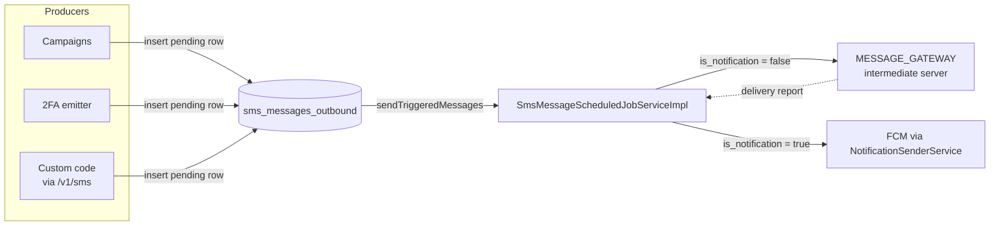
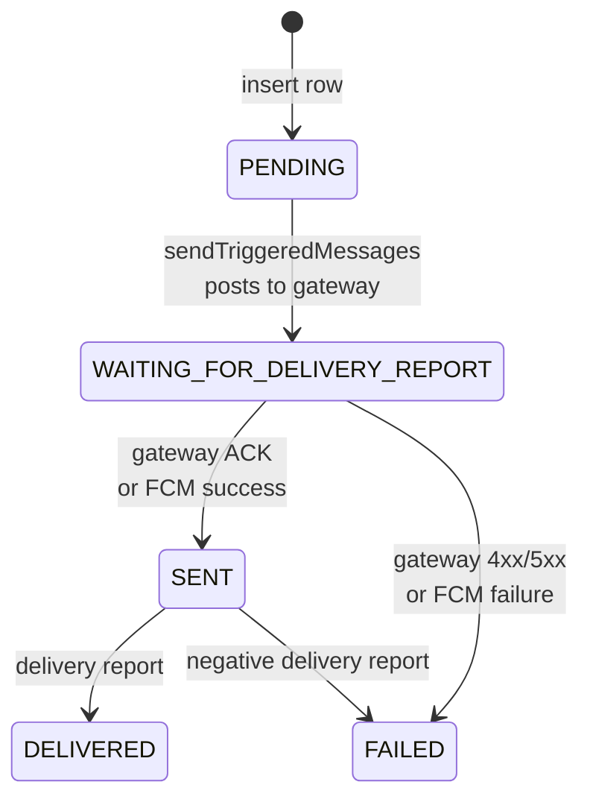

Apache Fineract carries two distinct SMS subsystems that often get confused. **Campaigns** (`infrastructure/campaigns/sms/`) handle scheduled, query‑driven, business‑rule‑powered bulk sends and are documented separately. This page covers the lower‑level **outbound message store and dispatcher** under `fineract-provider/src/main/java/org/apache/fineract/infrastructure/sms/` — the `sms_messages_outbound` table, the `SmsApiResource` CRUD endpoints at `/v1/sms`, and the `SmsMessageScheduledJobServiceImpl` background task that ships pending rows to the configured `MESSAGE_GATEWAY` external service (and, when `is_notification` is set, into the FCM push pipeline instead).

The split lets you generate an SMS from any code path (campaigns, two‑factor codes, ad‑hoc reminders triggered from a custom flow) by writing a row, and trust that the scheduler will deliver it.

## Where it sits



## Domain model

### `sms_messages_outbound`

Mapped by `infrastructure/sms/domain/SmsMessage.java`:

```java
@Entity
@Table(name = "sms_messages_outbound")
public class SmsMessage extends AbstractPersistableCustom<Long> {

    @Column(name = "external_id")
    private String externalId;

    @ManyToOne @JoinColumn(name = "group_id")   private Group group;
    @ManyToOne @JoinColumn(name = "client_id")  private Client client;
    @ManyToOne @JoinColumn(name = "staff_id")   private Staff staff;
    @ManyToOne @JoinColumn(name = "campaign_id") private SmsCampaign smsCampaign;

    @Column(name = "status_enum", nullable = false)
    private Integer statusType;

    @Column(name = "mobile_no", length = 50)
    private String mobileNo;

    @Column(name = "message", nullable = false)
    private String message;

    @Column(name = "submittedon_date")
    private LocalDate submittedOnDate;

    @Column(name = "delivered_on_date")
    private LocalDateTime deliveredOnDate;

    @Column(name = "is_notification")
    private boolean isNotification;
    // ...
}
```

Two factory methods set up rows in the correct starting state:

```java
public static SmsMessage pendingSms(... String message, String mobileNo,
                                    SmsCampaign smsCampaign, boolean isNotification) {
    return new SmsMessage().setStatusType(SmsMessageStatusType.PENDING.getValue())
        // ...
        .setNotification(isNotification)
        .setSubmittedOnDate(DateUtils.getBusinessLocalDate());
}

public static SmsMessage sentSms(... String message, String mobileNo,
                                 SmsCampaign smsCampaign, boolean isNotification) {
    return new SmsMessage()
        .setStatusType(SmsMessageStatusType.WAITING_FOR_DELIVERY_REPORT.getValue())
        // ...
}
```

### `SmsMessageStatusType`

Six integer states, persisted to the `status_enum` column:

```java
public enum SmsMessageStatusType {
    INVALID(0,   "smsMessageStatusType.invalid"),
    PENDING(100, "smsMessageStatusType.pending"),
    WAITING_FOR_DELIVERY_REPORT(150, "smsMessageStatusType.waitingForDeliveryReport"),
    SENT(200,    "smsMessageStatusType.sent"),
    DELIVERED(300, "smsMessageStatusType.delivered"),
    FAILED(400,  "smsMessageStatusType.failed");
}
```



### Other domain classes

| File | Role |
|---|---|
| `infrastructure/sms/domain/SmsMessageAssembler.java` | Assembles a `SmsMessage` from a `JsonCommand`. |
| `infrastructure/sms/domain/SmsMessageRepository.java` | Spring Data repository. |
| `infrastructure/sms/data/SmsMessageApiQueueResourceData.java` | Wire format sent to the gateway. |
| `infrastructure/sms/data/SmsMessageDeliveryReportData.java` | Wire format received back. |

## The REST surface — `/v1/sms`

`infrastructure/sms/api/SmsApiResource.java`:

```java
@Path("/v1/sms")
@Produces({ MediaType.APPLICATION_JSON })
@Tag(name = "SMS", description = "")
public class SmsApiResource {
    private static final String RESOURCE_NAME_FOR_PERMISSIONS = "SMS";
    // ...
}
```

| Method | Path | Returns / consumes | Notes |
|---|---|---|---|
| `GET` | `/v1/sms` | `List<SmsData>` | List all messages (admin / diagnostic). |
| `POST` | `/v1/sms` | `SmsCreationRequest` → `CommandProcessingResult` | Insert a new pending message. Dispatched via `CommandWrapperBuilder.createSms()`. |
| `GET` | `/v1/sms/{resourceId}` | `SmsData` | Single message read. |
| `GET` | `/v1/sms/{campaignId}/messageByStatus` | `Page<SmsData>` | Paginated, filter by `status`, `fromDate`/`toDate`, sort. |
| `PUT` | `/v1/sms/{resourceId}` | `SmsUpdateRequest` | Update mobile no, message, etc. Dispatched via `updateSms(id)`. |
| `DELETE` | `/v1/sms/{resourceId}` | — | Dispatched via `deleteSms(id)`. |

### Creating a message

The `SmsCreationRequest` record only carries the recipient *reference* and the body:

```java
public record SmsCreationRequest(Long groupId, Long clientId, Long staffId,
                                 String message, Long campaignId) implements Serializable {}
```

Mobile number is derived from the linked client or staff record by `SmsMessageAssembler.assembleFromJson(...)` (`client.mobileNo()` / `staff.getMobileNo()`), and `is_notification` is inherited from `SmsCampaign.isNotification()` if a `campaignId` is supplied — both fields are off-limits from the request body:

```java
if (this.fromApiJsonHelper.parameterExists(SmsApiConstants.clientIdParamName, element)) {
    final Long clientId = this.fromApiJsonHelper.extractLongNamed(SmsApiConstants.clientIdParamName, element);
    client = this.clientRepository.findOneWithNotFoundDetection(clientId);
    mobileNo = client.mobileNo();
}
// ...
if (this.fromApiJsonHelper.parameterExists(SmsApiConstants.campaignIdParamName, element)) {
    final Long campaignId = this.fromApiJsonHelper.extractLongNamed(SmsApiConstants.campaignIdParamName, element);
    smsCampaign = this.smsCampaignRepository.findById(campaignId).orElseThrow(...);
    isNotification = smsCampaign.isNotification();
}
```

```http
POST /fineract-provider/api/v1/sms
Content-Type: application/json

{
  "clientId": 42,
  "message":  "Reminder: your next instalment is due Friday."
}
```

The resource hands the JSON to `PortfolioCommandSourceWritePlatformService`, the `CreateSmsCommandHandler` (`infrastructure/sms/handler/CreateSmsCommandHandler.java`) consumes it, and `SmsWritePlatformServiceJpaRepositoryImpl.create(...)` validates and persists:

```java
@Transactional
@Override
public CommandProcessingResult create(final JsonCommand command) {
    this.validator.validateForCreate(command.json());
    final SmsMessage message = this.assembler.assembleFromJson(command);
    this.repository.saveAndFlush(message);
    return new CommandProcessingResultBuilder()
        .withCommandId(command.commandId())
        .withEntityId(message.getId())
        .build();
}
```

At this point the row sits at `PENDING` (100) until the scheduler picks it up.

### Filtering by status

`GET /v1/sms/{campaignId}/messageByStatus` is the practical way to introspect a queue:

```java
@GET
@Path("{campaignId}/messageByStatus")
public Page<SmsData> retrieveAllSmsByStatus(@PathParam("campaignId") final Long campaignId,
        @BeanParam SmsRequestParam smsRequestParam) {
    // ...
    final SearchParameters searchParameters = SearchParameters.builder()
        .limit(smsRequestParam.getLimit())
        .offset(smsRequestParam.getOffset())
        .orderBy(smsRequestParam.getOrderBy())
        .sortOrder(smsRequestParam.getSortOrder())
        .build();
    // ...
    return readPlatformService.retrieveSmsByStatus(campaignId, searchParameters,
            smsRequestParam.getStatus().intValue(), fromDate, toDate);
}
```

Use `status=400` to find what failed yesterday and decide whether to re‑send manually with a `PUT` (to fix the body) and a follow‑up `POST` reset, or to triage gateway downtime.

## The dispatcher

`infrastructure/sms/scheduler/SmsMessageScheduledJobServiceImpl.java`:

```java
@Service
@Slf4j
public class SmsMessageScheduledJobServiceImpl implements SmsMessageScheduledJobService {

    private final SmsMessageRepository smsMessageRepository;
    private final RestTemplate restTemplate = new RestTemplate();
    private final SmsConfigUtils smsConfigUtils;
    private final NotificationSenderService notificationSenderService;
    @Qualifier(TaskExecutorConstant.DEFAULT_TASK_EXECUTOR_BEAN_NAME)
    private final ThreadPoolTaskExecutor taskExecutor;
    // ...
}
```

### Routing logic

`sendTriggeredMessages(Map<SmsCampaign, Collection<SmsMessage>>)` splits the input into two buckets:

```java
for (SmsMessage smsMessage : entry.getValue()) {
    if (smsMessage.isNotification()) {
        smsMessage.setStatusType(SmsMessageStatusType.WAITING_FOR_DELIVERY_REPORT.getValue());
        toSendNotificationMessages.add(smsMessage);
    } else {
        smsMessage.setStatusType(SmsMessageStatusType.WAITING_FOR_DELIVERY_REPORT.getValue());
        toSaveMessages.add(smsMessage);
    }
}
```

- Messages with `is_notification = false` are SMS‑gateway bound — they are batched into `SmsMessageApiQueueResourceData` payloads and POSTed to the intermediate server.
- Messages with `is_notification = true` are reused as the body of an FCM push and dispatched through `NotificationSenderService` — the row is still tracked but the wire is HTTPS + JSON to FCM.

### Posting to the gateway

```java
private void connectAndSendToIntermediateServer(Collection<SmsMessageApiQueueResourceData> apiQueueResourceDatas) {
    Map<String, Object> hostConfig = this.smsConfigUtils.getMessageGateWayRequestURI("sms",
        SmsMessageApiQueueResourceData.toJsonString(apiQueueResourceDatas));
    URI uri = (URI) hostConfig.get("uri");
    HttpEntity<?> entity = (HttpEntity<?>) hostConfig.get("entity");
    ResponseEntity<String> responseOne = restTemplate.exchange(uri, HttpMethod.POST, entity,
        new ParameterizedTypeReference<String>() {});
    if (responseOne != null && !responseOne.getStatusCode().equals(HttpStatus.ACCEPTED)) {
        throw new ConnectionFailureException(SmsCampaignConstants.SMS);
    }
}
```

The URI and headers are computed by `SmsConfigUtils.getMessageGateWayRequestURI(...)`:

```java
headers.add(SmsCampaignConstants.FINERACT_PLATFORM_TENANT_ID, tenant.getTenantIdentifier());
headers.add(SmsCampaignConstants.FINERACT_TENANT_APP_KEY, messageGatewayConfigurationData.tenantAppKey());
UriBuilder builder = UriBuilder.fromPath(pathBuilder.toString())
    .host(messageGatewayConfigurationData.hostName()).scheme("http")
    .port(messageGatewayConfigurationData.portNumber());
```

So every outbound call carries:

- The Fineract tenant identifier (`Fineract-Platform-TenantId` header).
- A tenant‑specific app key (`Fineract-Tenant-App-Key`) — proves the call came from this tenant.
- A POST body that's an array of `SmsMessageApiQueueResourceData` (id, mobile no, message, providerId).

The host, port and end‑point segment come from `c_external_service_properties` rows under `MESSAGE_GATEWAY` — see [External services configuration & secrets](/external-services/configuration-and-secrets#sms-message-gateway-message-gateway).

### Async fan‑out

Each gateway POST runs on the platform's default task executor:

```java
this.taskExecutor.execute(new SmsTask(apiQueueResourceDatas, ThreadLocalContextUtil.getContext()));
```

`SmsTask` carries the `FineractContext` so the worker thread can re‑establish tenant / user context before issuing the HTTP call:

```java
@Override
public void run() {
    try {
        ThreadLocalContextUtil.init(context);
        connectAndSendToIntermediateServer(apiQueueResourceDatas);
    } finally {
        ThreadLocalContextUtil.reset();
    }
}
```

The same class implements `ApplicationListener<ContextClosedEvent>` so the executor is shut down on Spring context close.

## Delivery reports

When the intermediate server later posts back delivery information, it lands on a separate endpoint (campaigns side) and feeds `SmsMessageDeliveryReportData`. The dispatcher reconciles:

- `200 SENT` (gateway ack) → row goes from `WAITING_FOR_DELIVERY_REPORT` to `SENT`.
- Telco ACK → `SENT` → `DELIVERED` and `delivered_on_date` is stamped.
- Any failure marks the row `FAILED`.

## Notifications branch

When `is_notification = true`, the same row is rendered into a `Notification` and posted to FCM:

```java
Notification notification = new Notification.Builder(GcmConstants.defaultIcon)
    .title(GcmConstants.title)
    .body(smsMessage.getMessage())
    .build();
Message message = new Message.Builder().notification(notification)
    .dryRun(false).contentAvailable(true)
    .timeToLive(GcmConstants.TIME_TO_LIVE)
    .priority(Priority.HIGH).delayWhileIdle(true).build();
Sender sender = new Sender(notificationConfigurationData.getServerKey(),
                           notificationConfigurationData.getFcmEndPoint());
Result res = sender.send(message, registrationId, 3);
if (res.getSuccess() != null && res.getSuccess() > 0) {
    smsMessage.setStatusType(SmsMessageStatusType.SENT.getValue());
    smsMessage.setDeliveredOnDate(DateUtils.getLocalDateTimeOfTenant());
} else if (res.getFailure() != null && res.getFailure() > 0) {
    smsMessage.setStatusType(SmsMessageStatusType.FAILED.getValue());
}
```

This is the bridge into the FCM helper documented on [Notifications: GCM and FCM](/external-services/notifications-gcm-and-fcm).

## Difference vs the campaigns API

| Concern | `/v1/sms` (this page) | `/v1/smscampaigns` |
|---|---|---|
| Use case | Single message you want to insert and send | Periodic, query‑driven, audience‑targeted bulk send |
| Body | One mobile no + one text | A campaign object with schedule, recipient SQL, body template |
| State | `sms_messages_outbound` rows produced directly | Campaign generates many `sms_messages_outbound` rows |
| Lifecycle | CRUD on individual messages | Activate / pause / reschedule the campaign |

Both feed the same `sms_messages_outbound` table and the same dispatcher.

## Operational checklist

- Make sure rows exist in `c_external_service_properties` for `MESSAGE_GATEWAY` with `host_name`, `port_number`, `end_point`, `tenant_app_key`. Without them `SmsConfigUtils` will return null fields and the POST will fail.
- The scheduler runs under the regular Quartz scheduling — see the job definition for `Send Messages to SMS Gateway` and check it's not paused.
- If you see rows stuck at `100 PENDING` for long, either the scheduler is not running or `is_notification` paths are throwing on FCM credentials — look at logs in `NotificationSenderService.sendNotification`.
- Tail `m_portfolio_command_source` for `CREATE_SMS`, `UPDATE_SMS`, `DELETE_SMS` to audit who created what.

## Related pages

- [External services configuration & secrets](/external-services/configuration-and-secrets) — where `host_name`, `port_number`, `end_point`, `tenant_app_key` are configured.
- [Notifications: GCM and FCM](/external-services/notifications-gcm-and-fcm) — the push branch when `is_notification = true`.
