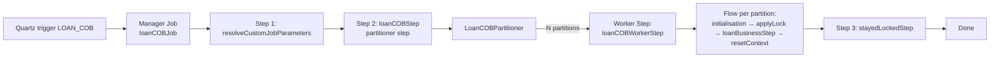
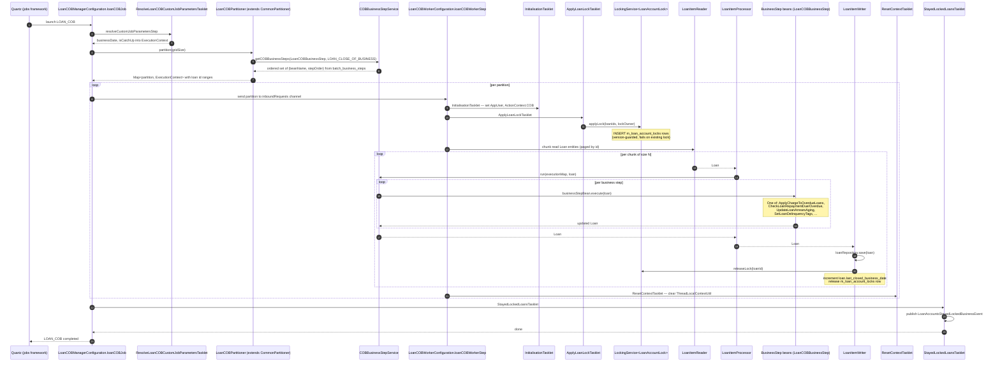

This page describes how Apache Fineract's nightly **Loan COB (Close of Business)** job moves every active loan one business day forward. The job is implemented as a **Spring Batch partitioned job** with a manager step that produces partitions, worker steps that lock loans and run business steps, and a final tasklet that reports loans whose locks were not released.

Read this page when you need to know why a loan is stuck in `m_loan_account_locks`, when the next business date will tick over, or how to add a new business step to the COB pipeline.

## Job topology



## Sequence diagram



## Step-by-step file map

| Step | File | Purpose |
| --- | --- | --- |
| Job definition | `fineract-provider/src/main/java/org/apache/fineract/cob/loan/LoanCOBManagerConfiguration.java` | Builds `loanCOBJob` = `resolveCustomJobParametersStep` → `loanCOBStep` (partitioner) → `stayedLockedStep`. |
| Constants | `fineract-provider/src/main/java/org/apache/fineract/cob/loan/LoanCOBConstant.java` | `JOB_NAME = "LOAN_COB"`, `LOAN_COB_JOB_NAME = "LOAN_CLOSE_OF_BUSINESS"`. |
| Custom params | `fineract-provider/src/main/java/org/apache/fineract/cob/loan/ResolveLoanCOBCustomJobParametersTasklet.java` | Reads `businessDate`, `isCatchUp` job parameters and promotes them. |
| Partitioner | `fineract-provider/src/main/java/org/apache/fineract/cob/loan/LoanCOBPartitioner.java` (extends `fineract-cob/src/main/java/org/apache/fineract/cob/common/CommonPartitioner.java`) | Slices loan ids into partitions sized by `propertyService.getPartitionSize(JOB_NAME)`. |
| Step registry | `fineract-cob/src/main/java/org/apache/fineract/cob/COBBusinessStepService.java` and impl in same module | Loads the configured order of business-step beans from `batch_business_steps`. |
| Worker config | `fineract-provider/src/main/java/org/apache/fineract/cob/loan/LoanCOBWorkerConfiguration.java` | Worker flow: `initialisationStep → applyLockStep → loanBusinessStep → resetContextStep`. |
| Initialisation | `fineract-provider/src/main/java/org/apache/fineract/cob/common/InitialisationTasklet.java` | Sets `AppUser`, `ActionContext.COB` on the worker thread. |
| Lock acquisition | `fineract-provider/src/main/java/org/apache/fineract/cob/loan/ApplyLoanLockTasklet.java` (extends `fineract-cob/src/main/java/org/apache/fineract/cob/tasklet/ApplyCommonLockTasklet.java`) | Inserts `m_loan_account_locks` rows for the partition's loan ids. |
| Lock service | `fineract-provider/src/main/java/org/apache/fineract/cob/loan/LoanLockingServiceImpl.java` | Implements `LockingService<LoanAccountLock>`. |
| Item reader | `fineract-provider/src/main/java/org/apache/fineract/cob/loan/LoanItemReader.java` | Pages `Loan` rows for the partition's id range. |
| Item processor | `fineract-provider/src/main/java/org/apache/fineract/cob/loan/LoanItemProcessor.java` | Calls `COBBusinessStepService.run(executionMap, loan)`. |
| Item writer | `fineract-provider/src/main/java/org/apache/fineract/cob/loan/LoanItemWriter.java` | Persists the loan, advances `last_closed_business_date`, releases the lock. |
| Reset tasklet | `fineract-cob/src/main/java/org/apache/fineract/cob/common/ResetContextTasklet.java` | Clears `ThreadLocalContextUtil` for the worker thread. |
| Stayed-locked tasklet | `fineract-provider/src/main/java/org/apache/fineract/cob/loan/StayedLockedLoansTasklet.java` | Publishes `LoanAccountsStayedLockedBusinessEvent` for loans still locked at job end. |

## Job parameters

Promoted from the launching tasklet into the `ExecutionContext` by `ExecutionContextPromotionListener` (see `LoanCOBManagerConfiguration.customJobParametersPromotionListener()`):

| Parameter | Type | Meaning |
| --- | --- | --- |
| `businessDate` | `String` | The business date to close. Normally today; for catch-up runs an earlier date. |
| `isCatchUp` | `String` | `"true"` when running an [inline catch-up](/cob/internal-and-catchup-apis) for a single loan, `"false"` for the nightly job. |
| `thread-pool-size`, `chunk-size`, `partition-size` | from `PropertyService` | Tuning knobs per tenant. |

## Phase 1: parameter resolution

`ResolveLoanCOBCustomJobParametersTasklet` reads the job parameters (or accepts defaults computed from `BusinessDate`) and writes them to the step's `ExecutionContext`. The promotion listener:

```java
ExecutionContextPromotionListener listener = new ExecutionContextPromotionListener();
listener.setKeys(new String[] {
    LoanCOBConstant.BUSINESS_DATE_PARAMETER_NAME,
    LoanCOBConstant.IS_CATCH_UP_PARAMETER_NAME });
```

moves them into the job's execution context so all subsequent steps see them.

## Phase 2: partition

`LoanCOBPartitioner.partition(gridSize)`:

```java
int partitionSize = propertyService.getPartitionSize(LoanCOBConstant.JOB_NAME);
Set<BusinessStepNameAndOrder> cobBusinessSteps = cobBusinessStepService.getCOBBusinessSteps(
    LoanCOBBusinessStep.class, LoanCOBConstant.LOAN_COB_JOB_NAME);
return getPartitions(partitionSize, cobBusinessSteps);
```

The inherited `CommonPartitioner.getPartitions(...)` queries `RetrieveLoanIdService.retrieveLoanIdsNDaysBehind(numberOfDaysBehind, businessDate)` for the loan ids that need COB and groups them into partitions of `partitionSize` ids each.

The partitioner also embeds the ordered business-step map in each partition's `ExecutionContext` so workers don't need to consult the database again.

## Phase 3: per-partition worker flow

Each partition runs through this flow (defined in `LoanCOBWorkerConfiguration.flow(...)`):

```java
new FlowBuilder<Flow>("cobFlow")
    .start(initialisationStep)
    .next(applyLockStep)
    .next(loanBusinessStep)
    .next(resetContextStep)
    .build();
```

### 3a. `InitialisationTasklet`

Sets up the worker-thread `AppUser` (system user), `ActionContext.COB`, and tenant context — required because each Spring Batch step may run on a separate executor thread.

### 3b. `ApplyLoanLockTasklet`

Calls `loanLockingService.applyLock(loanIds, lockOwner)` which inserts rows into `m_loan_account_locks` for **all** loan ids in the partition. If a row already exists with a different lock owner, the tasklet throws `LockCannotBeAppliedException` and the partition fails.

The lock row carries:

| Column | Purpose |
| --- | --- |
| `loan_id` | The locked loan. |
| `version` | Optimistic lock version. |
| `lock_owner` | `LOAN_COB_CHUNK_PROCESSING` or `LOAN_INLINE_COB_PROCESSING`. |
| `lock_placed_on` | Timestamp. |

While this row exists, `LoanCOBApiFilter` rejects any synchronous API write for that loan with `403`.

### 3c. `loanBusinessStep` (chunked Spring Batch step)

This is the heart of the worker — a standard reader/processor/writer chunk:

```java
new StepBuilder("Loan Business - Step:" + partitionName, jobRepository)
    .<Loan, Loan>chunk(propertyService.getChunkSize(JobName.LOAN_COB.name()), transactionManager)
    .reader(cobWorkerItemReader())         // LoanItemReader
    .processor(cobWorkerItemProcessor())   // LoanItemProcessor
    .writer(cobWorkerItemWriter())         // LoanItemWriter
    .faultTolerant()
    .retry(Exception.class)
    .retryLimit(propertyService.getRetryLimit(JOB_NAME))
    .skip(Exception.class)
    .skipLimit(propertyService.getChunkSize(JOB_NAME) + 1)
    .listener(loanItemListener())          // ChunkProcessingLoanItemListener
    .transactionManager(transactionManager);
```

Inside the processor, `LoanItemProcessor.process(loan)` calls `COBBusinessStepService.run(executionMap, loan)`:

```java
boolean bulkEventEnabled = configurationDomainService.isCOBBulkEventEnabled();
try {
    if (bulkEventEnabled) {
        businessEventNotifierService.startExternalEventRecording();
    }
    for (String businessStep : executionMap.values()) {
        ThreadLocalContextUtil.setActionContext(ActionContext.COB);
        COBBusinessStep<S> businessStepBean = (COBBusinessStep<S>) applicationContext.getBean(businessStep);
        item = reloaderService.reload(item);
        item = businessStepBean.execute(item);
    }
    if (bulkEventEnabled) {
        businessEventNotifierService.stopExternalEventRecording();
    }
} catch (Exception e) {
    if (bulkEventEnabled) businessEventNotifierService.resetEventRecording();
    throw e;
}
```

`reloaderService.reload(item)` refreshes the JPA entity from the database between steps so each step sees the previous step's changes.

### 3d. The configured business steps

The execution order is read from `batch_business_steps` (job name `LOAN_CLOSE_OF_BUSINESS`). The shipped beans (each annotated `@Component` and implementing `LoanCOBBusinessStep`) include:

| Bean class | Job step name | Effect |
| --- | --- | --- |
| `ApplyChargeToOverdueLoansBusinessStep` | `APPLY_CHARGE_TO_OVERDUE_LOANS` | Posts overdue charges. |
| `CheckLoanRepaymentDueBusinessStep` | `CHECK_LOAN_REPAYMENT_DUE` | Emits notifications for installments due soon. |
| `CheckLoanRepaymentOverdueBusinessStep` | `CHECK_LOAN_REPAYMENT_OVERDUE` | Emits notifications for overdue installments. |
| `CheckDueInstallmentsBusinessStep` | `CHECK_DUE_INSTALLMENTS` | Internal book-keeping. |
| `UpdateLoanArrearsAgingBusinessStep` | `UPDATE_LOAN_ARREARS_AGING` | Recomputes the `m_loan_arrears_aging` row. |
| `LoanInterestRecalculationCOBBusinessStep` | `LOAN_INTEREST_RECALCULATION` | Re-amortises when interest recalculation is enabled. |
| `AddPeriodicAccrualEntriesBusinessStep` | `ADD_PERIODIC_ACCRUAL_ENTRIES` | Adds accrual transactions and journal entries. |
| `AccrualActivityPostingBusinessStep` | `ACCRUAL_ACTIVITY_POSTING` | Posts accrual activity. |
| `SetLoanDelinquencyTagsBusinessStep` | `LOAN_DELINQUENCY_CLASSIFICATION` | Recalculates delinquency tags. |
| `BuyDownFeeAmortizationBusinessStep` | `BUY_DOWN_FEE_AMORTIZATION` | Buy-down fee amortisation. |
| `CapitalizedIncomeAmortizationBusinessStep` | `CAPITALIZED_INCOME_AMORTIZATION` | Capitalised income amortisation. |

You can add a new step by adding a `@Component` implementing `LoanCOBBusinessStep`, defining a unique `getEnumStyledName()`, and inserting a row into `batch_business_steps` with the desired order.

### 3e. `LoanItemWriter`

Per chunk, the writer:

1. Saves the modified `Loan` entities via `LoanRepository`.
2. Advances `m_loan.last_closed_business_date` to the COB date.
3. Calls `loanLockingService.releaseLock(loanId)` per loan, removing the `m_loan_account_locks` row.

If the writer throws, the chunk transaction rolls back and Spring Batch's `faultTolerant().retry(...)` re-runs it. After `retryLimit` failures, the chunk is skipped (the writer's `skip(Exception.class)` policy) and the loans stay locked — to be picked up by the stayed-lock tasklet.

### 3f. `ResetContextTasklet`

Clears `ThreadLocalContextUtil` on the worker thread after the partition is done, so worker-thread reuse by Spring's `ThreadPoolTaskExecutor` does not leak tenant context.

## Phase 4: stayed-locked tasklet

`StayedLockedLoansTasklet` runs once at job end. It queries loans whose lock was not released (writer failure, worker crash, partition timeout) and publishes a `LoanAccountsStayedLockedBusinessEvent` so an operator alert can fire. The locks themselves remain — they must be released manually (or by a successful re-run that explicitly skips them via the catch-up mechanism).

## Lock model

| State | What it means |
| --- | --- |
| No row in `m_loan_account_locks` | Loan is free; synchronous writes allowed. |
| Row with `lock_owner = LOAN_COB_CHUNK_PROCESSING` | The nightly job is currently mid-chunk on this loan. |
| Row with `lock_owner = LOAN_INLINE_COB_PROCESSING` | An inline catch-up is running for this loan (triggered by `LoanCOBApiFilter`). |
| Row persists after job ends | Stayed locked — operator must investigate. |

`LoanCOBApiFilter` (in `fineract-provider/src/main/java/org/apache/fineract/infrastructure/jobs/filter/`) consults this table on every loan write to decide whether to allow the request, queue an inline catch-up, or return `403`.

## Inline COB

When a write API hits a loan whose `last_closed_business_date` is behind the current business date, `LoanCOBApiFilter` triggers an **inline COB** via `InlineLoanCOBExecutorServiceImpl`:

- It reuses the same `LoanCOBBusinessStep` beans through `COBBusinessStepService.run(...)`.
- It runs synchronously inside the request thread, so the user's write blocks on it.
- It uses the `INLINE_LOAN_COB` job parameters so the execution context is separated from the nightly job.

The detailed flow lives on the [inline COB page](/cob/internal-and-catchup-apis); from the perspective of this flow, just note that the **same business steps** run in the same order, against the same lock table.

## Manager vs worker conditions

`LoanCOBManagerConfiguration` is `@Conditional(BatchManagerCondition.class)` and `LoanCOBWorkerConfiguration` is `@Conditional(BatchWorkerCondition.class)`. In monolith mode both conditions are true so both beans are loaded. In a horizontally scaled batch deployment, manager-only and worker-only nodes are possible — the partitioner sends partitions over a Spring Integration channel (`outboundRequests` / `inboundRequests`) which can be backed by a JMS broker.

## Tuning knobs

| Property (via `PropertyService`) | Effect |
| --- | --- |
| `partition-size` | Loan ids per partition. |
| `chunk-size` | Loans per Spring Batch chunk (transaction boundary). |
| `thread-pool-size`, `thread-pool-core-size`, `thread-pool-queue-capacity` | Worker concurrency. With `thread-pool-max=1` the step uses `SyncTaskExecutor`. |
| `retry-limit` | How many times to retry a failing chunk. |
| `poll-interval` | Manager step poll interval for partition completion. |

## Where to put a breakpoint

| Symptom | Breakpoint |
| --- | --- |
| Job runs but no loans processed | `LoanCOBPartitioner.partition` — check `RetrieveLoanIdService` output. |
| Loans stay locked | `LoanItemWriter.write` — verify `releaseLock` is reached. |
| A specific business step misbehaves | The bean's `execute(loan)` method. |
| 403 on synchronous write | `LoanCOBApiFilter.doFilterInternal` — check `m_loan_account_locks`. |
| Inline COB doesn't trigger | `InlineLoanCOBExecutionDataParser` — check the `LAST_CLOSED_BUSINESS_DATE` field on the loan. |

## Related pages

- [COB module overview](/cob/overview) — high-level architecture of the framework.
- [COB business steps catalog](/cob/business-step-framework) — per-step semantics.
- [Inline COB](/cob/internal-and-catchup-apis) — synchronous catch-up triggered by API writes.
- [Loan repayment flow](/flows/loan-repayment-flow) — what `LoanCOBApiFilter` is protecting.
- [External event flow](/flows/external-event-flow) — how the bulk-event recording mode batches COB events.
