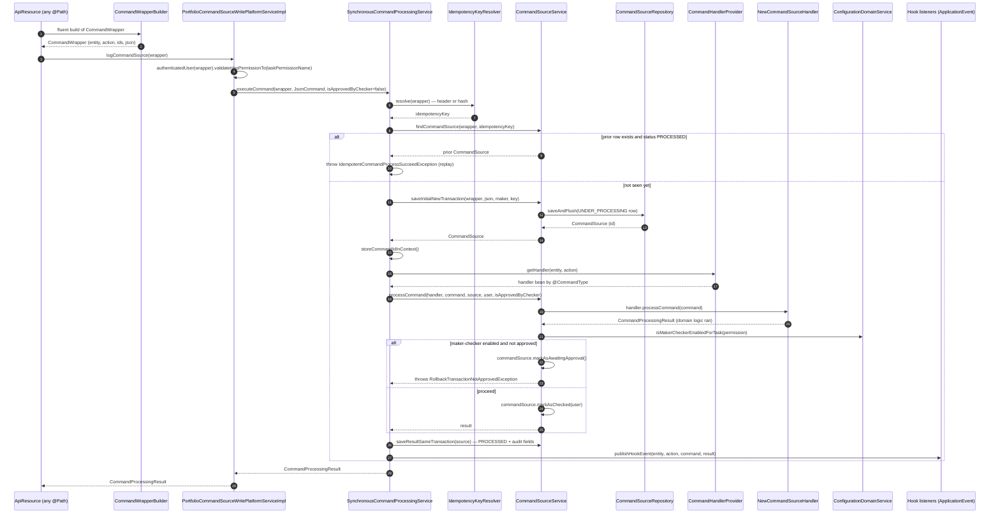

This page is the internal blueprint of the Apache Fineract **command bus**. Every state-changing API call funnels through it, and so does every internal job that wants the same audit, idempotency, retry, and maker-checker semantics. Read this when you need to understand why a write succeeded or failed, where the audit row comes from, or how to add a new command handler.

The bus is intentionally not a message broker. It is a synchronous Spring service that **persists an audit row before the work**, looks up a Spring-bean handler by `(entity, action)`, and **persists the result** in the same transaction (or a fresh one when the domain rolled back).

## Sequence diagram



## What each participant is

| Participant | File | Notes |
| --- | --- | --- |
| `CommandWrapperBuilder` | `fineract-core/src/main/java/org/apache/fineract/commands/service/CommandWrapperBuilder.java` | 4,000-line fluent builder, one method per (entity, action). Sets `actionName`, `entityName`, the various id fields, the JSON body, and the permission name. |
| `CommandWrapper` | `fineract-core/src/main/java/org/apache/fineract/commands/domain/CommandWrapper.java` | Plain DTO produced by the builder. Carries `actionName`, `entityName`, `entityId`, `groupId`, `clientId`, `loanId`, `savingsId`, `transactionId`, JSON, idempotency key, etc. |
| `PortfolioCommandSourceWritePlatformServiceImpl` | `fineract-core/src/main/java/org/apache/fineract/commands/service/PortfolioCommandSourceWritePlatformServiceImpl.java` | The public entry point invoked by API resources. Does permission check, builds a `JsonCommand`, calls `CommandProcessingService.executeCommand`. |
| `SynchronousCommandProcessingService` | `fineract-core/src/main/java/org/apache/fineract/commands/service/SynchronousCommandProcessingService.java` | The processor. Retry, idempotency, source row persistence, handler dispatch, result persistence, hook publication. |
| `IdempotencyKeyResolver` / `IdempotencyKeyGenerator` | `fineract-core/src/main/java/org/apache/fineract/commands/service/Idempotency*.java` | Reads the `Idempotency-Key` header if present (via `FineractRequestContextHolder`), otherwise hashes the request. |
| `CommandSourceService` | `fineract-core/src/main/java/org/apache/fineract/commands/service/CommandSourceService.java` | Owns the `m_portfolio_command_source` audit row across two phases: initial save (`REQUIRES_NEW`) and result save. Also contains the `processCommand()` method that calls the handler and enforces maker-checker. |
| `CommandSourceRepository` | `fineract-core/src/main/java/org/apache/fineract/commands/domain/CommandSourceRepository.java` | Spring Data JPA repo over the `m_portfolio_command_source` table. |
| `CommandHandlerProvider` | `fineract-core/src/main/java/org/apache/fineract/commands/provider/CommandHandlerProvider.java` | At startup, scans every bean annotated `@CommandType(entity, action)` and registers it in a `HashMap<String,String>` keyed by `entity + "|" + action`. |
| `NewCommandSourceHandler` | `fineract-core/src/main/java/org/apache/fineract/commands/handler/NewCommandSourceHandler.java` | The single-method interface (`CommandProcessingResult processCommand(JsonCommand)`) every handler implements. |
| `ConfigurationDomainService` | `fineract-core/src/main/java/org/apache/fineract/infrastructure/configuration/domain/ConfigurationDomainService.java` | Holds the maker-checker toggle per permission and other global flags. |

## Phase 1: build the wrapper

The API resource creates a `CommandWrapper` with the fluent builder. There is one method per (entity, action). Examples from `CommandWrapperBuilder.java`:

| Method | Sets `entityName` | Sets `actionName` |
| --- | --- | --- |
| `createLoanApplication()` | `LOAN` | `CREATE` |
| `approveLoanApplication(loanId)` | `LOAN` | `APPROVE` |
| `disburseLoanApplication(loanId)` | `LOAN` | `DISBURSE` |
| `loanRepaymentTransaction(loanId)` | `LOAN` | `REPAYMENT` |
| `savingsAccountDeposit(savingsId)` | `SAVINGSACCOUNT` | `DEPOSIT` |
| `savingsAccountInterestPosting(accountId)` | `SAVINGSACCOUNT` | `POSTINTEREST` |

The builder also sets the per-row id fields (`loanId`, `savingsId`, `groupId`, `clientId`, `transactionId`) so the audit row can be filtered later from the maker-checker UI.

## Phase 2: hand off to the bus

`PortfolioCommandSourceWritePlatformServiceImpl.logCommandSource(wrapper)` is intentionally thin:

```java
public CommandProcessingResult logCommandSource(final CommandWrapper wrapper) {
    boolean isApprovedByChecker = false;
    if (wrapper.isChangeOfOwnUserDetails(authenticatedUser(wrapper).getId())) {
        isApprovedByChecker = true; // bypass maker-checker for "edit own profile"
    } else {
        authenticatedUser(wrapper).validateHasPermissionTo(wrapper.getTaskPermissionName());
    }
    validateIsUpdateAllowed(); // refuses while scheduler is locked
    final String json = wrapper.getJson();
    final JsonElement parsedCommand = fromApiJsonHelper.parse(json);
    JsonCommand command = JsonCommand.from(json, parsedCommand, fromApiJsonHelper, /* every id */);
    return processAndLogCommandService.executeCommand(wrapper, command, isApprovedByChecker);
}
```

Note `validateIsUpdateAllowed()` — it calls `SchedulerJobRunnerReadService.isUpdatesAllowed()` which throws if a job has parked the platform.

## Phase 3: process the command

`SynchronousCommandProcessingService.executeCommand(...)` is the heart of the bus. The numbered steps below match the sequence diagram.

### Step 2 — idempotency resolution

```java
Long commandId = (Long) fineractRequestContextHolder.getAttribute(COMMAND_SOURCE_ID, null);
boolean isRetry = commandId != null;
String idempotencyKey;
if (isRetry) {
    commandSource = commandSourceService.getCommandSource(commandId);
    idempotencyKey = commandSource.getIdempotencyKey();
} else if ((commandId = command.commandId()) != null) {
    // action on the command itself, e.g. checker approving a parked command
    commandSource = commandSourceService.getCommandSource(commandId);
    idempotencyKey = commandSource.getIdempotencyKey();
} else {
    idempotencyKey = idempotencyKeyResolver.resolve(wrapper);
}
exceptionWhenTheRequestAlreadyProcessed(wrapper, idempotencyKey, isRetry);
```

`exceptionWhenTheRequestAlreadyProcessed` looks up `(actionName, entityName, idempotencyKey)` in `m_portfolio_command_source`. If a prior `PROCESSED` row exists, it throws `IdempotentCommandProcessSucceedException` — the exception mapper replays the original response. If an `UNDER_PROCESSING` row exists, it throws `IdempotentCommandProcessUnderProcessingException` (the client should retry).

### Step 4 — initial source row

```java
@Transactional(propagation = REQUIRES_NEW, isolation = REPEATABLE_READ)
public CommandSource saveInitialNewTransaction(CommandWrapper wrapper, JsonCommand jsonCommand,
        AppUser maker, String idempotencyKey) {
    return saveInitial(wrapper, jsonCommand, maker, idempotencyKey);
}
```

This row is inserted in its **own** transaction, so even if the domain logic rolls back, the audit row survives. The row carries `status = UNDER_PROCESSING (1)`, the maker user id, the serialised JSON (optionally sanitised — see `sanitizeJson`), and the idempotency key.

<Note>
When the call is inside a Batch API enclosing transaction (`BatchRequestContextHolder.isEnclosingTransaction()`), the initial source row uses `getInitialCommandSource` *without* a new transaction so the entire batch can roll back atomically.
</Note>

### Step 5 — handler lookup

`SynchronousCommandProcessingService.findCommandHandler(wrapper)` is mostly:

```java
handler = commandHandlerProvider.getHandler(wrapper.entityName(), wrapper.actionName());
```

with a long `if/else` for special resources (`DATATABLE`, `NOTE`, `SURVEY`, `LOAN_DISBURSE_DETAIL`, `INTEREST_PAUSE`) whose entity/action keys don't map cleanly because the bean name is computed.

`CommandHandlerProvider.afterPropertiesSet()` does the registration:

```java
final String[] commandHandlerBeans = applicationContext.getBeanNamesForAnnotation(CommandType.class);
for (final String commandHandlerName : commandHandlerBeans) {
    final CommandType commandType = applicationContext.findAnnotationOnBean(commandHandlerName, CommandType.class);
    registeredHandlers.put(commandType.entity() + "|" + commandType.action(), commandHandlerName);
}
```

So adding a new handler is just:

```java
@Service
@CommandType(entity = "LOAN", action = "MY_ACTION")
public class MyLoanCommandHandler implements NewCommandSourceHandler {
    @Transactional
    @Override public CommandProcessingResult processCommand(JsonCommand command) { ... }
}
```

### Step 6 — handler execution and maker-checker

```java
@Transactional
public CommandProcessingResult processCommand(NewCommandSourceHandler handler,
        JsonCommand command, CommandSource commandSource, AppUser user, boolean isApprovedByChecker) {
    final CommandProcessingResult result = handler.processCommand(command);
    String permission = commandSource.getPermissionCode();
    boolean isMakerChecker = configurationDomainService.isMakerCheckerEnabledForTask(permission);
    if (isMakerChecker || result.isRollbackTransaction()) {
        if (isApprovedByChecker || user.isCheckerSuperUser()) {
            commandSource.markAsChecked(user);
        } else {
            commandSource.markAsAwaitingApproval();
            throw new RollbackTransactionNotApprovedException(commandSource.getId(), commandSource.getResourceId());
        }
    }
    return result;
}
```

`RollbackTransactionNotApprovedException` is thrown **after** the domain work ran, which forces Spring to roll back the surrounding transaction — but the source row, having been written in its own transaction, persists as `AWAITING_APPROVAL` for the checker. See [maker-checker flow](/flows/maker-checker-flow).

### Step 7 — result persistence and audit fields

After a successful handler call, `SynchronousCommandProcessingService` updates the source row with the domain result and saves it via a Resilience4j retry-guarded path:

```java
CommandSource savedCommandSource = persistenceRetry.executeSupplier(() -> {
    currentSource.setResultStatusCode(SC_OK);
    currentSource.updateForAudit(result); // entity/sub-entity ids from result
    currentSource.setResult(toApiResultJsonSerializer.serializeResult(result));
    currentSource.setStatus(PROCESSED);
    return commandSourceService.saveResultSameTransaction(currentSource);
});
```

`updateForAudit(result)` copies `entityId`, `subEntityId`, `officeId`, `clientId`, `groupId`, `loanId`, `savingsId`, `productId`, `transactionId` from the `CommandProcessingResult` returned by the handler — so the maker-checker UI and the audit search can filter on those ids even when the original wrapper didn't know them (e.g. on `CREATE` actions).

### Step 8 — hook publication

Successful runs publish a `HookEvent` Spring `ApplicationEvent`:

```java
private void publishHookEvent(String entityName, String actionName, JsonCommand command, Object result) {
    HookEventSource src = new HookEventSource(entityName, actionName);
    // serialise request + response into a Map
    HookEvent event = new HookEvent(src, serialisedJson, appUser, ThreadLocalContextUtil.getContext());
    applicationContext.publishEvent(event);
}
```

The same path also drives [external event](/flows/external-event-flow) emission — domain services publish `BusinessEvent`s through `BusinessEventNotifierService` during the handler call; the outbox row is committed alongside the result.

When the call is inside an enclosing batch transaction, hook publication is deferred via `TransactionSynchronization.afterCommit()` so a webhook does not fire for a command that gets rolled back by a later step.

## Error handling, in detail

```java
try {
    result = commandSourceService.processCommand(...);
} catch (Throwable t) {
    RuntimeException mappable = ErrorHandler.getMappable(t);
    ErrorInfo errorInfo = commandSourceService.generateErrorInfo(mappable);
    commandSource.setResultStatusCode(errorInfo.getStatusCode());
    commandSource.setResult(errorInfo.getMessage());
    if (statusCode != SC_OK) {
        commandSource.setStatus(ERROR);
    }
    if (!isEnclosingTransaction) {
        commandSourceService.saveResultNewTransaction(commandSource);
    }
    publishHookErrorEvent(wrapper, command, errorInfo);
    throw mappable;
}
```

The error path persists the failure via `saveResultNewTransaction(...)` (a fresh `REQUIRES_NEW` transaction) because the original transaction was already marked rollback by the exception. It also fires a hook **error** event so webhooks can observe failures.

## The retry wrapper

`SynchronousCommandProcessingService.retryWrapper(...)` wraps the whole flow in a Resilience4j `Retry` configured by `RetryConfigurationAssembler` — unless the request is already inside an enclosing batch transaction, in which case retry is skipped (otherwise a single failing child would retry the whole batch). The retry is keyed by exception class.

## Where to put a breakpoint

| Symptom | Breakpoint |
| --- | --- |
| Command is rejected before handler runs | `PortfolioCommandSourceWritePlatformServiceImpl.logCommandSource` line `validateHasPermissionTo(...)`. |
| Idempotent replay returns stale data | `SynchronousCommandProcessingService.exceptionWhenTheRequestAlreadyProcessed`. |
| Source row missing | `CommandSourceService.saveInitial(...)` — check for `UNIQUE_PORTFOLIO_COMMAND_SOURCE` violations. |
| Handler not found | `CommandHandlerProvider.getHandler` — check `@CommandType` annotation. |
| Maker-checker rollback unexpected | `CommandSourceService.processCommand` line `throw new RollbackTransactionNotApprovedException(...)`. |
| Hook didn't fire | `SynchronousCommandProcessingService.publishHookEvent` — check `TransactionSynchronizationManager.isSynchronizationActive()`. |

## Adding a new command handler — checklist

When you add a write endpoint that should go through the bus (and you should — anything that mutates domain state should), the cookbook is:

1. **Pick the (entity, action) pair.** Look in `CommandWrapperBuilder` for an existing entity name. Either reuse one and add an action, or add a new entity.
2. **Add a builder method.** Either in `CommandWrapperBuilder` or in a domain-specific builder that delegates to it. The method should set `actionName`, `entityName`, and the relevant id fields.
3. **Create a `@CommandType` handler bean.** Implement `NewCommandSourceHandler.processCommand(JsonCommand)`. Annotate the bean `@Service`, the class `@CommandType(entity = "...", action = "...")`, and the method `@Transactional`.
4. **Implement the domain write service.** The handler should be a thin delegate to a `*WritePlatformService`. Validation, repository writes, event firing happen there.
5. **Configure the permission.** Add `CREATE_FOO` / `UPDATE_FOO` to the system permissions and to the security configuration if a path-level rule applies.
6. **Wire the API resource.** A `@Path` JAX-RS method that calls `new CommandWrapperBuilder().myAction(args).build()` and then `commandsSourceWritePlatformService.logCommandSource(wrapper)`.
7. **Decide on maker-checker.** Maker-checker is a per-permission tenant toggle, so usually you don't have to do anything code-side — the operator turns it on through `m_permission.can_maker_checker`.

`CommandHandlerProvider` discovers the new bean at startup; no central registry to update.

## How handlers can short-circuit

Two patterns are available:

| Pattern | When to use |
| --- | --- |
| Throw a domain `RuntimeException` (e.g. `PlatformApiDataValidationException`). | Domain rule violation. The exception mapper returns the right 4xx and the source row goes to `ERROR (5)`. |
| Return a `CommandProcessingResult` with `setRollbackTransaction(true)`. | The work should be reviewed under maker-checker even when the permission isn't otherwise configured for it. The source row goes to `AWAITING_APPROVAL (2)`. |

You should not catch the rollback or idempotency exceptions in your handler — the bus needs them to propagate to do its job.

## Batch API interplay

When the bus is reached through `POST /api/v1/batches` (one of the child requests inside the batch), `BatchRequestContextHolder.isEnclosingTransaction()` returns true. Then:

- `saveInitialNewTransaction(...)` is replaced by `getInitialCommandSource(...)` (no `REQUIRES_NEW`) so the batch can roll back atomically.
- The Resilience4j retry around `executeCommand` is **skipped** — a single child's retry would re-execute siblings.
- Hook publication is deferred via `TransactionSynchronization.afterCommit()` so webhooks don't fire for a child whose batch later fails.

This is the only place in the bus where behaviour bifurcates significantly; everywhere else, the API-bus path and the maker-checker-replay path use the same code.

## Related pages

- [Command core](/command/command-core)
- [Command handlers catalog](/command/command-handlers-catalog)
- [Command audit](/command/command-audit)
- [Maker-checker and audits](/command/maker-checker-and-audits)
- [HTTP request lifecycle](/flows/http-request-lifecycle)
- [Maker-checker flow](/flows/maker-checker-flow)
- [External event flow](/flows/external-event-flow)
