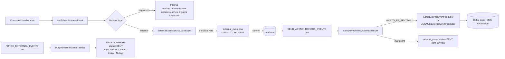
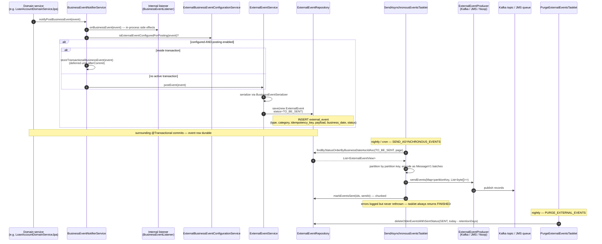

This page describes how Apache Fineract turns an in-process `BusinessEvent` (raised inside a command handler) into an Avro-serialised message on a Kafka topic or JMS queue. The mechanism is a classic **transactional outbox**: events are written to `external_event` inside the same transaction that produced them, then drained asynchronously by a Spring Batch job.

This decouples downstream subscribers from the API thread (so a Kafka outage cannot fail a loan repayment) while still giving exactly-once semantics relative to the underlying transaction (an event is published if and only if the transaction committed).

## Big picture



## Sequence diagram



## Producers

`BusinessEvent`s are raised by domain services. A typical example from `LoanAccountDomainServiceJpa`:

```java
businessEventNotifierService.notifyPostBusinessEvent(new LoanBalanceChangedBusinessEvent(loan));
businessEventNotifierService.notifyPostBusinessEvent(transactionRepaymentEvent);
```

Inside `BusinessEventNotifierServiceImpl.notifyPostBusinessEvent` (in `fineract-core/src/main/java/org/apache/fineract/infrastructure/event/business/service/BusinessEventNotifierServiceImpl.java`):

```java
boolean isExternalEvent = !(businessEvent instanceof NoExternalEvent);
List<BusinessEventListener> businessEventListeners = findSuitableListeners(postListeners, businessEvent.getClass());
for (BusinessEventListener eventListener : businessEventListeners) {
    eventListener.onBusinessEvent(businessEvent);
}
if (isExternalEvent && isExternalEventPostingEnabled()) {
    if (externalBusinessEventConfigurationService.isExternalEventConfiguredForPosting(businessEvent)) {
        if (isExternalEventRecordingEnabled()) {
            recordedEvents.get().add(businessEvent);
        } else {
            if (transactionHelper.hasTransaction()) {
                storeTransactionalBusinessEvent(businessEvent);
            } else {
                externalEventService.postEvent(businessEvent);
            }
        }
    }
}
```

Three gates an event must pass to reach the outbox:

1. **Posting enabled globally**: `fineract.events.external.enabled = true`.
2. **Configured per type**: `m_external_event_configuration.is_enabled` for the event type.
3. **Not a `NoExternalEvent`**: marker interface for events that exist only for in-process listeners.

## In-process listeners

| Interface | File | Used for |
| --- | --- | --- |
| `BusinessEventListener<T>` | `fineract-core/src/main/java/org/apache/fineract/infrastructure/event/business/BusinessEventListener.java` | Synchronous side effects (cache invalidation, follow-on writes, blocking validation). |

Example: `GuarantorDomainServiceImpl` registers a listener on `LoanApprovedBusinessEvent` to block guarantor funds.

In-process listeners run **inside** the original transaction. They cannot be skipped, and an exception from one rolls the command back.

## The outbox table

`ExternalEventService.postEvent(...)` (in `fineract-core/src/main/java/org/apache/fineract/infrastructure/event/external/service/ExternalEventService.java`):

```java
public <T> void postEvent(BusinessEvent<T> event) {
    try {
        entityManager.flush();
        ExternalEvent externalEvent;
        if (event instanceof BulkBusinessEvent) {
            externalEvent = handleBulkBusinessEvent((BulkBusinessEvent) event);
        } else {
            externalEvent = handleRegularBusinessEvent(event);
        }
        repository.save(externalEvent);
    } catch (IOException e) {
        throw new RuntimeException("Error while serializing event " + event.getClass().getSimpleName(), e);
    }
}
```

`handleRegularBusinessEvent(event)` looks up a `BusinessEventSerializer` for the event type (via `BusinessEventSerializerFactory`), produces an Avro `ByteBufferSerializable`, generates an idempotency key (`DefaultExternalEventIdempotencyKeyGenerator`), and constructs an `ExternalEvent` row:

| Column | Source |
| --- | --- |
| `type` | `BusinessEvent.getType()` (e.g. `LoanTransactionMakeRepaymentPostBusinessEvent`). |
| `category` | `BusinessEvent.getCategory()` (e.g. `LOAN`). |
| `schema` | Avro schema name. |
| `data` | Avro-serialised payload. |
| `idempotency_key` | Stable hash over event identity. |
| `business_date` | `ThreadLocalContextUtil.getBusinessDate()`. |
| `status` | `TO_BE_SENT`. |
| `created_at` | `DateUtils.getAuditOffsetDateTime()`. |

The row is `save()`d using the same `EntityManager` that the surrounding transaction is using, so it commits or rolls back atomically with the command. This is the **transactional outbox** guarantee.

## Transactional ordering

`BusinessEventNotifierServiceImpl` registers itself as a Spring `TransactionExecutionListener` so it knows when a transaction commits. The `storeTransactionalBusinessEvent(event)` path buffers events on a per-transaction `Stack<List<BusinessEventWithContext>>` so that:

- Multiple events from a single command are stored in arrival order.
- Events are only flushed to the outbox **inside** the transaction (so they share the commit).
- Bulk mode (`isCOBBulkEventEnabled`) groups them into a single `BulkBusinessEvent` to reduce row count.

## The sending tasklet

`SEND_ASYNCHRONOUS_EVENTS` is a Spring Batch job whose only step is `SendAsynchronousEventsTasklet` (in `fineract-core/src/main/java/org/apache/fineract/infrastructure/event/external/jobs/SendAsynchronousEventsTasklet.java`):

```java
@Override
public RepeatStatus execute(StepContribution contribution, ChunkContext chunkContext) {
    try {
        if (isDownstreamChannelEnabled()) {
            List<ExternalEventView> events = getQueuedEventsBatch();
            sendEvents(events);
        }
    } catch (Exception e) {
        log.error("Error occurred while processing events: ", e);
    }
    return RepeatStatus.FINISHED;
}
```

`isDownstreamChannelEnabled()` checks both Kafka and JMS toggles:

```java
return fineractProperties.getEvents().getExternal().getProducer().getJms().isEnabled()
    || fineractProperties.getEvents().getExternal().getProducer().getKafka().isEnabled();
```

### Reading the batch

```java
int readBatchSize = getBatchSize();
Pageable batchSize = PageRequest.ofSize(readBatchSize);
return repository.findByStatusOrderByBusinessDateAscIdAsc(ExternalEventStatus.TO_BE_SENT, batchSize);
```

The query is ordered by `business_date` then `id` so out-of-order publication is impossible for a single tenant.

### Partitioning before send

```java
private void sendEvents(List<ExternalEventView> queuedEvents) {
    Map<Long, List<byte[]>> partitions = generatePartitions(queuedEvents);
    List<Long> eventIds = queuedEvents.stream().map(ExternalEventView::getId).toList();
    sendEventsToProducer(partitions);
    markEventsAsSent(eventIds);
}
```

Each event is wrapped in a `MessageV1` Avro envelope by `MessageFactory`. The partition key is currently derived from the event id so multiple workers can publish in parallel without out-of-order Kafka writes within a partition.

### Marking as sent

```java
private void markEventsAsSent(final List<Long> eventIds) {
    OffsetDateTime sentAt = DateUtils.getAuditOffsetDateTime();
    final int partitionSize = fineractProperties.getEvents().getExternal().getPartitionSize();
    List<List<Long>> partitions = Lists.partition(eventIds, partitionSize);
    // submit each partition to threadPoolTaskExecutor; per-partition transaction:
    transactionTemplate.execute((status) -> {
        repository.markEventsSent(partitionedEventIds, sentAt);
        return null;
    });
}
```

The `partitionSize` cap is set to avoid the JDBC `65,535 parameter` limit on `IN (...)` updates.

<Note>
The tasklet **always returns `RepeatStatus.FINISHED`** and swallows exceptions. A broker outage logs an error but does not fail the Spring Batch step — the events stay `TO_BE_SENT` and the next scheduler tick retries.
</Note>

## Producers

| Implementation | File | Active when |
| --- | --- | --- |
| `KafkaExternalEventProducer` | `fineract-provider/src/main/java/org/apache/fineract/infrastructure/event/external/producer/kafka/KafkaExternalEventProducer.java` | `fineract.events.external.producer.kafka.enabled = true`. |
| `JMSMultiExternalEventProducer` | `fineract-provider/src/main/java/org/apache/fineract/infrastructure/event/external/producer/jms/JMSMultiExternalEventProducer.java` | `fineract.events.external.producer.jms.enabled = true`. |
| `NoopExternalEventProducer` | `fineract-core/src/main/java/org/apache/fineract/infrastructure/event/external/producer/NoopExternalEventProducer.java` | Neither Kafka nor JMS enabled — used by tests. |

Both real producers expose `sendEvents(Map<Long, List<byte[]>> partitions)` — the tasklet doesn't care which is wired.

## Purge job

`PURGE_EXTERNAL_EVENTS` is the cleanup tasklet:

```java
@Override
public RepeatStatus execute(StepContribution contribution, ChunkContext chunkContext) {
    try {
        Long numberOfDaysForPurgeCriteria = configurationDomainService.retrieveExternalEventsPurgeDaysCriteria();
        LocalDate dateForPurgeCriteria = DateUtils.getBusinessLocalDate().minusDays(numberOfDaysForPurgeCriteria);
        repository.deleteOlderEventsWithSentStatus(ExternalEventStatus.SENT, dateForPurgeCriteria);
    } catch (Exception e) {
        log.error("Error occurred while purging external events: ", e);
    }
    return RepeatStatus.FINISHED;
}
```

| File | Behaviour |
| --- | --- |
| `fineract-core/src/main/java/org/apache/fineract/infrastructure/event/external/jobs/PurgeExternalEventsTasklet.java` | Deletes only `SENT` rows older than `retrieveExternalEventsPurgeDaysCriteria()` days. |

Failed / unsent rows survive — the operator is expected to investigate stuck events before purging.

## Status table

| Status | Meaning |
| --- | --- |
| `TO_BE_SENT` | Written by `ExternalEventService.postEvent`. Awaiting the send tasklet. |
| `SENT` | Successfully published to Kafka/JMS. Eligible for purge after retention. |

The schema has no `FAILED` status — repeated send failures simply leave the row at `TO_BE_SENT` for the next tasklet run.

## Bulk event mode

When `isCOBBulkEventEnabled` is true, the COB business-step orchestrator wraps the per-loan business steps in:

```java
businessEventNotifierService.startExternalEventRecording();
// ... run business steps ...
businessEventNotifierService.stopExternalEventRecording();
```

Inside this window, `notifyPostBusinessEvent` appends to a thread-local list instead of writing to the outbox. `stopExternalEventRecording` then collapses the list into a `BulkBusinessEvent` and writes **one** outbox row containing many constituent events. This dramatically reduces row count during the nightly COB job.

See [COB execution flow](/flows/cob-execution-flow) for where this is invoked.

## Where to put a breakpoint

| Symptom | Breakpoint |
| --- | --- |
| Event raised but never reaches outbox | `BusinessEventNotifierServiceImpl.notifyPostBusinessEvent` — check `isExternalEventPostingEnabled` and `isExternalEventConfiguredForPosting`. |
| Outbox row present but never sent | `SendAsynchronousEventsTasklet.isDownstreamChannelEnabled` — Kafka/JMS toggles. |
| Kafka topic receives bytes but consumer chokes | `BusinessEventSerializerFactory` — Avro schema mismatch. |
| Rows pile up | Check `m_job` schedule for `SEND_ASYNCHRONOUS_EVENTS`; verify the tasklet is firing without logged errors. |
| Purge not deleting | `PurgeExternalEventsTasklet.execute` — verify `configurationDomainService.retrieveExternalEventsPurgeDaysCriteria()` is set. |

## Operational checklist

- Enable: `fineract.events.external.enabled=true` plus one of the producer toggles.
- Configure per type: `PUT /externalevents/configuration` (see `ExternalEventConfigurationApiResource`).
- Monitor: `SELECT status, COUNT(*) FROM external_event GROUP BY status` — both numbers should stay small in steady state.
- Retention: `EXTERNAL_EVENTS_PURGE_DAYS_CRITERIA` global config.

## Related pages

- [Events & hooks overview](/events/overview)
- [External events](/events/external-events-and-producers)
- [Command dispatch flow](/flows/command-dispatch-flow) — where `notifyPostBusinessEvent` is called from.
- [COB execution flow](/flows/cob-execution-flow) — bulk-event mode.
- [Background jobs framework](/core/jobs-framework) — how the scheduler triggers the two tasklets.
