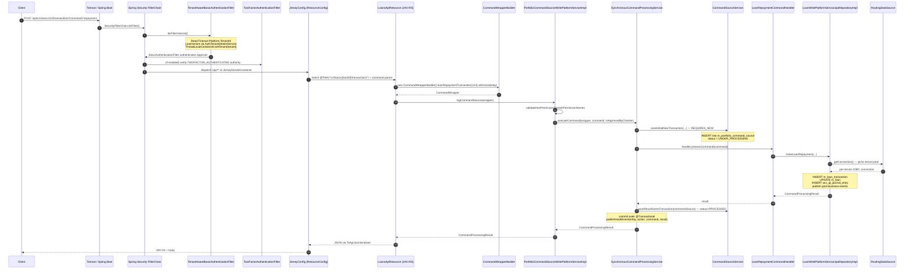

This page walks a single API request through Apache Fineract end-to-end — from the moment Tomcat hands it to Spring, through the Spring Security filter chain, into Jersey, through the JAX-RS resource method, into the command bus, down to JPA, and back out as a JSON response. Read this when you need a mental map of **where to put a breakpoint** for an inbound problem.

The path below is the standard `/api/v1/...` route in `fineract-provider`. Read endpoints (`GET`) and write endpoints (`POST`, `PUT`, `DELETE`) diverge at the resource method: reads call a `*ReadPlatformService` directly, writes use the command bus.

## Sequence diagram



## Step-by-step file map

| # | Step | File | Method / responsibility |
| --- | --- | --- | --- |
| 1 | Servlet container receives request | Spring Boot embedded Tomcat | Routes `/api/**` to the Spring Security filter chain. |
| 2 | Security filter chain assembled | `fineract-provider/src/main/java/org/apache/fineract/infrastructure/core/config/SecurityConfig.java` | Bean `filterChain(HttpSecurity)` defines the matcher `/api/**` and registers all filters below. |
| 3 | Tenant + basic auth | `fineract-security/src/main/java/org/apache/fineract/infrastructure/security/filter/TenantAwareBasicAuthenticationFilter.java` | Reads `Fineract-Platform-TenantId`, resolves tenant via `AuthTenantDetailsService`, sets `ThreadLocalContextUtil.setTenant(...)`, then delegates to Spring's `BasicAuthenticationFilter` for credentials. |
| 4 | Two-factor (optional) | `fineract-security/src/main/java/org/apache/fineract/infrastructure/security/filter/TwoFactorAuthenticationFilter.java` | When `fineract.security.twoFactor.enabled=true`, asserts the `TWOFACTOR_AUTHENTICATED` authority on the principal. |
| 5 | Idempotency, correlation, instance mode | `org.apache.fineract.infrastructure.core.filters.*` and `org.apache.fineract.infrastructure.instancemode.filter.*` | Wrap the request with an idempotency-key reader, MDC correlation id, and a filter that returns `503` when this node is not the API instance. |
| 6 | JAX-RS dispatch | `fineract-provider/src/main/java/org/apache/fineract/infrastructure/core/jersey/JerseyConfig.java` | `@ApplicationPath("/api")` `ResourceConfig`. Auto-registers every Spring bean annotated `@Path` and `@Provider`. |
| 7 | Resource method | e.g. `fineract-provider/src/main/java/org/apache/fineract/portfolio/loanaccount/api/LoansApiResource.java` | The matched `@POST` / `@PUT` method builds a `CommandWrapper`. |
| 8 | Build command | `fineract-core/src/main/java/org/apache/fineract/commands/service/CommandWrapperBuilder.java` | One fluent factory method per (entity, action) pair, e.g. `loanRepaymentTransaction(loanId)`, `createLoanApplication()`, `approveLoanApplication(loanId)`. |
| 9 | Dispatch to command bus | `fineract-core/src/main/java/org/apache/fineract/commands/service/PortfolioCommandSourceWritePlatformServiceImpl.java` | `logCommandSource(wrapper)` performs permission check via `PlatformSecurityContext.authenticatedUser(wrapper).validateHasPermissionTo(...)` then calls `CommandProcessingService.executeCommand(...)`. |
| 10 | Command processing | `fineract-core/src/main/java/org/apache/fineract/commands/service/SynchronousCommandProcessingService.java` | Wraps in Resilience4j retry, resolves idempotency key, persists initial `CommandSource` row, looks up handler, executes, persists result, publishes hook event. See [command dispatch flow](/flows/command-dispatch-flow). |
| 11 | Source row persistence | `fineract-core/src/main/java/org/apache/fineract/commands/service/CommandSourceService.java` | `saveInitialNewTransaction()` (`REQUIRES_NEW`) and `processCommand(...)` which calls the actual handler inside an `@Transactional` boundary. |
| 12 | Handler invocation | e.g. `fineract-loan/src/main/java/org/apache/fineract/portfolio/loanaccount/handler/LoanRepaymentCommandHandler.java` | One Spring bean per `@CommandType(entity, action)` registered by `CommandHandlerProvider`. |
| 13 | Domain write service | `fineract-provider/src/main/java/org/apache/fineract/portfolio/loanaccount/service/LoanWritePlatformServiceJpaRepositoryImpl.java` (and peers) | Performs domain logic — validation, repository writes, event notification. |
| 14 | JDBC connection | `fineract-core/src/main/java/org/apache/fineract/infrastructure/core/service/database/RoutingDataSource.java` | Delegates to the per-tenant HikariCP pool resolved from `ThreadLocalContextUtil.getTenant()`. See [tenant resolution flow](/flows/tenant-resolution-flow). |
| 15 | Serialise response | `org.apache.fineract.infrastructure.core.serialization.ToApiJsonSerializer` (registered as a JAX-RS body writer via `JerseyJacksonConverterConfig`) | Converts `CommandProcessingResult` (or domain DTOs) to JSON. |

## Filter ordering, in code

The order is set declaratively inside `SecurityConfig.filterChain(...)` in `fineract-provider/src/main/java/org/apache/fineract/infrastructure/core/config/SecurityConfig.java`:

```java
http.addFilterBefore(tenantAwareBasicAuthenticationFilter(), SecurityContextHolderFilter.class)
    .addFilterAfter(requestResponseFilter(), ExceptionTranslationFilter.class)
    .addFilterAfter(correlationHeaderFilter(), RequestResponseFilter.class)
    .addFilterAfter(fineractInstanceModeApiFilter(), CorrelationHeaderFilter.class);
// If loanCOB filter helper present:
http.addFilterAfter(loanCOBApiFilter(), FineractInstanceModeApiFilter.class)
    .addFilterAfter(idempotencyStoreFilter(), LoanCOBApiFilter.class);
http.addFilterBefore(progressiveLoanModelCheckerFilter, LoanCOBApiFilter.class);
// If 2FA enabled:
http.addFilterAfter(twoFactorAuthenticationFilter(), CorrelationHeaderFilter.class);
```

The effective order on a typical request is therefore:

1. `TenantAwareBasicAuthenticationFilter`
2. `SecurityContextHolderFilter`
3. `ExceptionTranslationFilter`
4. `RequestResponseFilter`
5. `CorrelationHeaderFilter`
6. `FineractInstanceModeApiFilter`
7. `ProgressiveLoanModelCheckerFilter`
8. `LoanCOBApiFilter`
9. `IdempotencyStoreFilter`
10. (optional) `TwoFactorAuthenticationFilter`
11. `CallerIpTrackingFilter`
12. Jersey servlet (dispatches to `@Path` resource)

<Warning>
The `LoanCOBApiFilter` short-circuits any loan write while the loan is locked by COB. If you see `403` with body mentioning "Loan is locked", the loan id is in `m_loan_account_locks`. See [COB execution flow](/flows/cob-execution-flow).
</Warning>

## What runs inside the resource method

Every write `@POST` / `@PUT` / `@DELETE` on the resource follows the same micro-pattern. From `LoansApiResource.calculateLoanScheduleOrSubmitLoanApplication(...)`:

```java
final CommandWrapper commandRequest = new CommandWrapperBuilder()
    .createLoanApplication()
    .withJson(apiRequestBodyAsJson)
    .build();
final CommandProcessingResult result = this.commandsSourceWritePlatformService.logCommandSource(commandRequest);
return this.toApiJsonSerializer.serialize(result);
```

Read endpoints skip the command bus entirely; they call `*ReadPlatformService` beans (which use `JdbcTemplate` directly against `RoutingDataSource`) and serialise the resulting DTO.

<Note>
`commandsSourceWritePlatformService` is the field name everywhere — the type is `PortfolioCommandSourceWritePlatformService` (interface in `fineract-core`). The impl is `PortfolioCommandSourceWritePlatformServiceImpl`.
</Note>

## Where the transaction boundary lives

There are **two** Spring-managed transactions for a single write request:

| Transaction | Annotation | Where | Purpose |
| --- | --- | --- | --- |
| Outer command-source row save | `@Transactional(propagation = REQUIRES_NEW, isolation = REPEATABLE_READ)` on `CommandSourceService.saveInitialNewTransaction(...)` | `fineract-core` | Persist the `UNDER_PROCESSING` audit row before domain work, so idempotency works even if the domain rollback fires. |
| Domain transaction | `@Transactional` on the handler class or the write service method | `fineract-loan`, `fineract-savings`, `fineract-provider` | The actual business write. Rolls back on `RollbackTransactionNotApprovedException` (maker-checker) or any other runtime exception. |

The hook publication (`publishHookEvent`) and the `CommandSource.status = PROCESSED` update happen **after** the domain transaction returns successfully. If the domain throws, the source row is updated to `ERROR` in a fresh transaction (`saveResultNewTransaction`).

## Error path

When the domain service throws, the exception bubbles up to:

1. `SynchronousCommandProcessingService.executeCommand(...)` — catches `Throwable`, calls `ErrorHandler.getMappable(t)` to translate, sets `commandSource.status = ERROR`, persists in a new transaction, and publishes a hook error event.
2. The mapped exception is rethrown to Jersey.
3. A registered `ExceptionMapper` (in `fineract-core/src/main/java/org/apache/fineract/infrastructure/core/exceptionmapper/`) converts it to a `Response`. For example, `RollbackTransactionNotApprovedExceptionMapper` returns `403` with the command id so the client can poll the maker-checker inbox.
4. `JerseyJacksonConverterConfig` serialises the body.

| Exception | Mapper | HTTP status |
| --- | --- | --- |
| `RollbackTransactionNotApprovedException` | `RollbackTransactionNotApprovedExceptionMapper` | `403` with `commandId` echoed |
| `IdempotentCommandProcessSucceedException` | `IdempotentCommandProcessSucceedExceptionMapper` | replays original `200` |
| `PlatformApiDataValidationException` | `PlatformApiDataValidationExceptionMapper` | `400` with field-level errors |
| `InvalidTenantIdentifierException` | (handled directly in `TenantAwareBasicAuthenticationFilter`) | `400` |

## Response serialisation

The default `ToApiJsonSerializer<T>` is a thin wrapper over Google Gson registered as a JAX-RS body writer through `fineract-provider/src/main/java/org/apache/fineract/infrastructure/core/jersey/JerseyJacksonConverterConfig.java`. It honours the `fields=` query param via `ApiRequestJsonSerializationSettings` and the `ApiRequestParameterHelper`. Pagination is added by the `PageableParamProvider` bound in `JerseyConfig`.

## Related flows

- [Command dispatch flow](/flows/command-dispatch-flow) — what `executeCommand` does step by step.
- [Tenant resolution flow](/flows/tenant-resolution-flow) — how step 3 finds the right tenant.
- [Maker-checker flow](/flows/maker-checker-flow) — why a successful write can return `403`.
- [External event flow](/flows/external-event-flow) — what `publishHookEvent` triggers downstream.

## Things this page deliberately skips

- **Batch API.** `POST /api/v1/batches` re-enters the command bus once per child request through `BatchRequestContextHolder`. The flow above still applies per child, but the outer transaction is shared. See `fineract-provider/src/main/java/org/apache/fineract/batch/`.
- **Internal API.** Routes under `/api/internal/*` skip permission checks and are filtered to the loopback interface by a separate filter chain.
- **OAuth2.** The OAuth2 flow replaces `TenantAwareBasicAuthenticationFilter` with `TenantAwareOAuth2AuthenticationFilter` (selected by the `fineract.security.oauth.enabled` property). The rest of the pipeline is unchanged.

## Reads vs writes — a side-by-side

| Aspect | Read endpoint (`GET`) | Write endpoint (`POST` / `PUT` / `DELETE`) |
| --- | --- | --- |
| Resource calls | `*ReadPlatformService` | `commandsSourceWritePlatformService.logCommandSource(wrapper)` |
| Data access | `JdbcTemplate` against `RoutingDataSource` | JPA repository (`*Repository` / `*RepositoryWrapper`). |
| Transaction | `@Transactional(readOnly = true)` on the read service. | `@Transactional` on the handler **plus** `REQUIRES_NEW` for the source row. |
| Audit row | None. | `m_portfolio_command_source` row, two-phase save (initial + result). |
| Business events | None unless a derived listener fires on the read entity (rare). | One or more `notifyPostBusinessEvent(...)` calls per write. |
| Idempotency | N/A. | Resolved from `Idempotency-Key` header or hashed wrapper. |
| Hook fire | None. | `publishHookEvent` after commit. |
| Failure | Exception mapper returns 4xx/5xx. | Same, plus the source row is moved to `ERROR (5)` in a fresh transaction. |

This is why you can't usually replicate a write bug with a read endpoint, and why a successful response on a write means the audit row, the event row, and the GL row are all consistent.

## Distributed tracing and MDC

Each request gets an MDC correlation id set by `CorrelationHeaderFilter` (filter step 5). If the client passes an `X-Fineract-Correlation-Id` header, that value is reused; otherwise a UUID is generated. The id is added to:

- `Slf4j`-emitted log lines on the request thread.
- Every Spring Batch worker thread that captures a `FineractContext` (the COB and savings-interest workers).
- The hook event payload that downstream webhooks receive.

Combined with the per-tenant log marker, this gives a complete trace from `Tomcat` accept to `acc_gl_journal_entry` insert.

## A representative resource method

For a concrete reference, this is the disbursal endpoint as a complete unit — note the same skeleton every write resource follows:

```java
@POST
@Path("{loanId}")
@Consumes(MediaType.APPLICATION_JSON)
@Produces(MediaType.APPLICATION_JSON)
public String stateTransitions(@PathParam("loanId") final Long loanId,
        @QueryParam("command") final String commandParam,
        final String apiRequestBodyAsJson) {

    final CommandWrapperBuilder builder = new CommandWrapperBuilder().withJson(apiRequestBodyAsJson);
    CommandProcessingResult result = null;
    if (is(commandParam, "reject"))      result = process(builder.rejectLoanApplication(loanId).build());
    else if (is(commandParam, "withdrawnByApplicant")) result = process(builder.withdrawLoanApplication(loanId).build());
    else if (is(commandParam, "approve"))  result = process(builder.approveLoanApplication(loanId).build());
    else if (is(commandParam, "disburse")) result = process(builder.disburseLoanApplication(loanId).build());
    // ... more transitions
    return this.toApiJsonSerializer.serialize(result);
}

private CommandProcessingResult process(CommandWrapper wrapper) {
    return this.commandsSourceWritePlatformService.logCommandSource(wrapper);
}
```

A single endpoint dispatches multiple commands by inspecting `?command=`. Each branch is a distinct (entity, action) pair handled by a distinct `@CommandType` bean. This is the standard pattern.

## Concurrency and thread safety

A single request is single-threaded **from accept to response**. The pieces that worry about thread safety are:

| Component | Concern | Solution |
| --- | --- | --- |
| `ThreadLocalContextUtil` | One thread sees the previous thread's tenant if the filter forgets to `reset()`. | `TenantAwareBasicAuthenticationFilter` resets in `try/finally`. |
| `TomcatJdbcDataSourcePerTenantService` | Two requests for the same tenant create two pools. | `ConcurrentHashMap.computeIfAbsent`. |
| `CommandSourceRepository` (idempotency key) | Two simultaneous requests with the same key both insert. | Unique index `unique_portfolio_command_source` plus `IdempotentCommandProcessUnderProcessingException`. |
| `BusinessEventNotifierServiceImpl` | One transaction's events leak into the next request's buffer. | Per-thread `Stack<List<BusinessEventWithContext>>` plus `TransactionExecutionListener` hooks. |

If you see weird cross-tenant data in logs, the suspect is always a missing `ThreadLocalContextUtil.reset()` somewhere on a worker thread (the request thread is fine).

## Reading the trace in production

A successful loan repayment leaves the following evidence:

| Artefact | Where to look |
| --- | --- |
| Audit row | `m_portfolio_command_source` — one row, `status_enum = 1`, `result_status_code = 200`. |
| Domain row | `m_loan_transaction` — one new row, type `2`. |
| Schedule deltas | `m_loan_transaction_repayment_schedule_mapping` — one row per installment touched. |
| Loan balance | `m_loan.principal_outstanding_derived` decreased. |
| GL entries | `acc_gl_journal_entry` — DR/CR pair per allocation. |
| Outbox row | `external_event` for the configured event types. |
| Log line | INFO with the MDC correlation id, tenant id, user id, and elapsed millis from `PlatformRequestLog`. |

A failed request leaves a partial trace:

| Failure mode | Artefacts |
| --- | --- |
| Validation rejected | Audit row `status_enum = 5`, `result_status_code = 400`. No domain rows. |
| Maker-checker rolled back | Audit row `status_enum = 2`. No domain rows. |
| System error | Audit row `status_enum = 5`, no domain rows; hook error event fired. |
| Idempotent replay | No new audit row; original returned. |

Knowing this pattern is the quickest way to reason about a production incident from log+DB alone.

## Performance and instrumentation

The platform timings the request end-to-end with `StopWatch` (in `TenantAwareBasicAuthenticationFilter`) and emits a `PlatformRequestLog` debug log line at the end of every request:

```
{
  "request": "GET /api/v1/loans/123",
  "tenant": "default",
  "user": "mifos",
  "elapsedMs": 124
}
```

For deeper performance work, the standard hot spots are:

| Hot spot | Cause | Mitigation |
| --- | --- | --- |
| First request after restart slow | Cold tenant pool, cold JPA metamodel, cold Spring caches. | Pre-warm with a health-check ping per tenant. |
| Idempotency lookup slow | Index `unique_portfolio_command_source` covers `(action_name, entity_name, idempotency_key)` — make sure your tenant has it. | Verify Liquibase ran. |
| Schedule generation slow on large loans | `LoanScheduleAssembler` builds installments in-memory. | Honour pivot-date configuration to limit the loaded transaction history. |
| Datatable joins on read | Each datatable read is a separate query through `JdbcTemplate`. | Use `?fields=` to suppress and `?datatables=` to allow-list. |

The `JerseyConfig` deliberately disables WADL (`ServerProperties.WADL_FEATURE_DISABLE`) to keep the OpenAPI surface clean and to avoid the eager scanning Jersey would otherwise do.

## Custom request filters

If you need to add a filter (e.g. capture X-Forwarded-* headers, inject a tenant default from the JWT), you have two options:

| Option | When | How |
| --- | --- | --- |
| Spring Security filter | Pre-auth, on every `/api/**` request. | Bean implementing `Filter`, registered in `SecurityConfig.filterChain(...)` with `addFilterAfter(...)`. |
| JAX-RS provider | Post-auth, scoped to specific resource methods. | Class annotated `@Provider` and `ContainerRequestFilter` / `ContainerResponseFilter`. `JerseyConfig` auto-registers it via `appCtx.getBeansWithAnnotation(Provider.class)`. |

Custom filters must not introduce a synchronous remote call before `TenantAwareBasicAuthenticationFilter` runs, since the tenant context isn't set yet and any tenant-scoped logic will fail.
