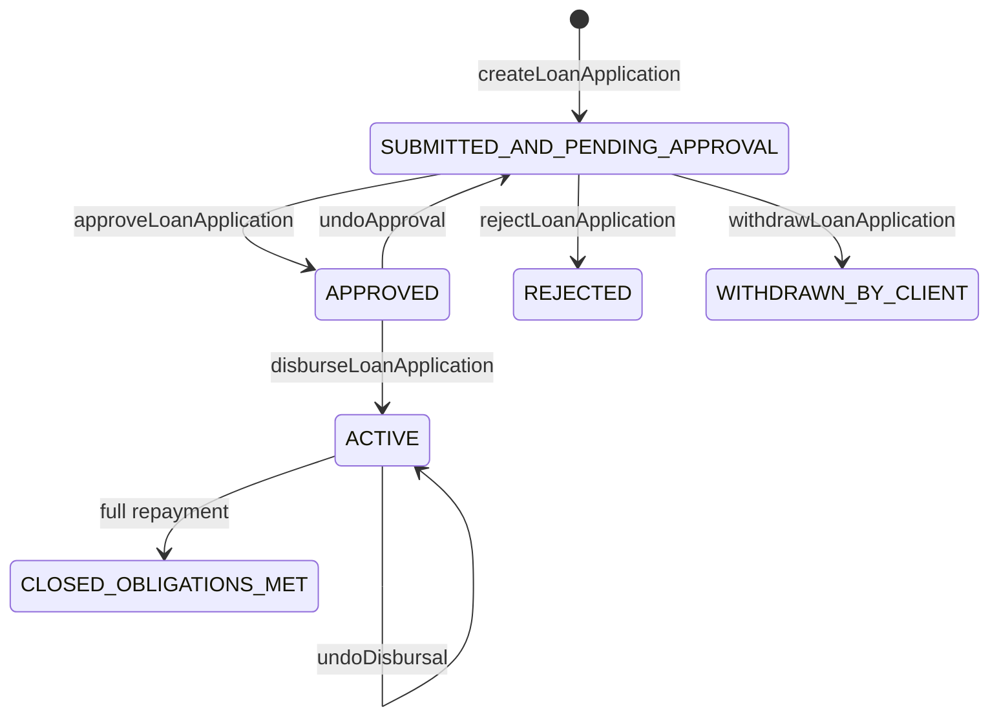

This page follows a loan through Apache Fineract's standard origination state machine: **submit → approve → disburse**, with each transition implemented as a distinct command handler. The end state is an active loan with a generated repayment schedule and disbursal journal entries posted to the general ledger.

The diagram and tables call out the actual handler classes, the write services they delegate to, and the side effects (`m_loan.loan_status_id` transitions, `m_loan_repayment_schedule` rows, `acc_gl_journal_entry` rows, and business events).

## State machine, at a glance



| Loan status (numeric in `m_loan_status_enum`) | Handler that sets it |
| --- | --- |
| `SUBMITTED_AND_PENDING_APPROVAL` (100) | `LoanApplicationSubmittalCommandHandler` |
| `APPROVED` (200) | `LoanApplicationApprovalCommandHandler` |
| `ACTIVE` (300) | `DisburseLoanCommandHandler` |
| `WITHDRAWN_BY_CLIENT` (400) | `LoanApplicationWithdrawnByApplicantCommandHandler` |
| `REJECTED` (500) | `LoanApplicationRejectedCommandHandler` |

## End-to-end sequence

```mermaid
sequenceDiagram
    autonumber
    participant Maker as Loan Officer
    participant Api as LoansApiResource
    participant Builder as CommandWrapperBuilder
    participant Bus as Command Bus (Synchronous)
    participant Sub as LoanApplicationSubmittalCommandHandler
    participant App as LoanApplicationWritePlatformServiceJpaRepositoryImpl
    participant Asm as LoanAssembler
    participant Sched as LoanScheduleAssembler
    participant Apr as LoanApplicationApprovalCommandHandler
    participant Dis as DisburseLoanCommandHandler
    participant Lwp as LoanWritePlatformServiceJpaRepositoryImpl
    participant Disb as LoanDisbursementService
    participant JE as LoanJournalEntryPoster
    participant Evt as BusinessEventNotifierService

    Maker->>Api: POST /api/v1/loans (createLoanApplication JSON)
    Api->>Builder: createLoanApplication().withJson(body).build()
    Api->>Bus: logCommandSource(wrapper) — entity=LOAN, action=CREATE
    Bus->>Sub: processCommand(JsonCommand)
    Sub->>App: submitApplication(command)
    App->>Asm: assembleFrom(command) — builds Loan aggregate
    App->>App: validateForCreate(loan)
    App->>App: loanRepositoryWrapper.saveAndFlush(loan)
    App->>Evt: notifyPostBusinessEvent(new LoanCreatedBusinessEvent(loan))
    App-->>Sub: CommandProcessingResult(loanId, status=100)
    Sub-->>Bus: result
    Bus-->>Api: 200 with loanId

    Maker->>Api: POST /api/v1/loans/{id}?command=approve
    Api->>Builder: approveLoanApplication(loanId).withJson(body).build()
    Api->>Bus: logCommandSource — entity=LOAN, action=APPROVE
    Bus->>Apr: processCommand(JsonCommand)
    Apr->>App: approveApplication(loanId, command)
    App->>Sched: assembleLoanApproval(user, command, loanId)
    Note over Sched: validates, sets approvedOnDate,<br/>approvedPrincipal; status -> 200
    App->>Evt: notifyPostBusinessEvent(new LoanApprovedBusinessEvent(loan))
    App-->>Apr: CommandProcessingResult(changes)
    Apr-->>Bus: result

    Maker->>Api: POST /api/v1/loans/{id}?command=disburse
    Api->>Builder: disburseLoanApplication(loanId).withJson(body).build()
    Api->>Bus: logCommandSource — entity=LOAN, action=DISBURSE
    Bus->>Dis: processCommand(JsonCommand)
    Dis->>Lwp: disburseLoan(loanId, command, isAccountTransfer=false)
    Lwp->>Asm: assembleFrom(loanId)
    Lwp->>Evt: notifyPreBusinessEvent(new LoanDisbursalBusinessEvent(loan))
    Lwp->>Disb: adjustDisburseAmount(loan, command, actualDate)
    Lwp->>Lwp: LoanTransaction.disbursement(...)
    Lwp->>JE: postJournalEntriesForLoanTransaction(disbursementTxn, false, false)
    Note over JE: INSERT acc_gl_journal_entry pairs:<br/>DR Fund Source / CR Loan Portfolio
    Lwp->>Lwp: regenerateScheduleOnDisbursement(...) — m_loan_repayment_schedule
    Lwp->>Evt: notifyPostBusinessEvent(LoanDisbursalBusinessEvent / LoanBalanceChangedBusinessEvent)
    Lwp-->>Dis: CommandProcessingResult
    Dis-->>Bus: result
    Bus-->>Api: 200; loan is ACTIVE
```

## Step 1: submit application

| File | Method | Side effect |
| --- | --- | --- |
| `fineract-provider/src/main/java/org/apache/fineract/portfolio/loanaccount/api/LoansApiResource.java` | `calculateLoanScheduleOrSubmitLoanApplication(...)` | Builds the `CREATE` `LOAN` command and calls `logCommandSource`. |
| `fineract-core/src/main/java/org/apache/fineract/commands/service/CommandWrapperBuilder.java` | `createLoanApplication()` | Sets `entityName = LOAN`, `actionName = CREATE`. |
| `fineract-loan/src/main/java/org/apache/fineract/portfolio/loanaccount/handler/LoanApplicationSubmittalCommandHandler.java` | `processCommand(JsonCommand)` | `@CommandType(entity = "LOAN", action = "CREATE")`. Delegates to `LoanApplicationWritePlatformService.submitApplication`. |
| `fineract-provider/src/main/java/org/apache/fineract/portfolio/loanaccount/service/LoanApplicationWritePlatformServiceJpaRepositoryImpl.java` | `submitApplication(JsonCommand)` | Validates, assembles `Loan`, persists, runs datatable checks, fires `LoanCreatedBusinessEvent`. |

The interface contract lives in `fineract-loan/src/main/java/org/apache/fineract/portfolio/loanaccount/service/LoanApplicationWritePlatformService.java`:

```java
CommandProcessingResult submitApplication(JsonCommand command);
```

### What submit really does

From `LoanApplicationWritePlatformServiceJpaRepositoryImpl.submitApplication(...)` — annotated `@Transactional`:

```java
this.loanApplicationValidator.validateForCreate(command);
final Loan loan = this.loanAssembler.assembleFrom(command);
this.loanApplicationValidator.validateForCreate(loan);
this.loanRepositoryWrapper.saveAndFlush(loan);
this.loanAssembler.accountNumberGeneration(command, loan);
if (loan.getLoanProduct().isInterestRecalculationEnabled()) {
    createAndPersistCalendarInstanceForInterestRecalculation(loan);
}
createNote(submittedOnNote, loan);
createCalendar(command, loan);
createSavingsAccountAssociation(savingsAccountId, loan);
// ... datatable checks, originators ...
businessEventNotifierService.notifyPostBusinessEvent(new LoanCreatedBusinessEvent(loan));
```

| Side effect | Table(s) |
| --- | --- |
| Insert loan aggregate | `m_loan`, `m_loan_charge`, `m_loan_disbursement_detail`, `m_loan_collateral_management`, `m_loan_term_variations` |
| Account number generation | Updates `m_loan.account_no` |
| Optional calendar instance | `m_calendar`, `m_calendar_instance` |
| Submitted-on note | `m_note` |
| Linked savings | `m_portfolio_account_associations` |
| Business event | `LoanCreatedBusinessEvent` — see [external event flow](/flows/external-event-flow) |

The `m_loan.loan_status_id` is set to `100` (`SUBMITTED_AND_PENDING_APPROVAL`) inside `LoanAssembler`.

## Step 2: approve application

| File | Method | Side effect |
| --- | --- | --- |
| `fineract-loan/.../handler/LoanApplicationApprovalCommandHandler.java` | `processCommand` | `@CommandType(entity = "LOAN", action = "APPROVE")`. Calls `writePlatformService.approveApplication(command.entityId(), command)`. |
| `fineract-provider/.../service/LoanApplicationWritePlatformServiceJpaRepositoryImpl.java` | `approveApplication(loanId, command)` | Validates approval JSON, delegates to `LoanScheduleAssembler.assembleLoanApproval` to update approvedOnDate/approvedPrincipal and transition status to `200`. |
| `LoanScheduleAssembler` (in `fineract-loan`) | `assembleLoanApproval(currentUser, command, loanId)` | Returns `Pair<Loan, Map<String,Object>>` with the changes. |

The approval handler is intentionally tiny — the validation and state mutation live in the assembler and the validator. From `LoanApplicationApprovalCommandHandler.java`:

```java
@CommandType(entity = "LOAN", action = "APPROVE")
public class LoanApplicationApprovalCommandHandler implements NewCommandSourceHandler {
    private final LoanApplicationWritePlatformService writePlatformService;
    @Transactional
    @Override
    public CommandProcessingResult processCommand(final JsonCommand command) {
        return this.writePlatformService.approveApplication(command.entityId(), command);
    }
}
```

And `approveApplication`:

```java
loanApplicationValidator.validateApproval(command, loanId);
Pair<Loan, Map<String,Object>> p = loanScheduleAssembler.assembleLoanApproval(currentUser, command, loanId);
Loan loan = p.getLeft(); Map<String,Object> changes = p.getRight();
if (!changes.isEmpty()) {
    createNote(noteText, loan).ifPresent(note -> changes.put("note", noteText));
    businessEventNotifierService.notifyPostBusinessEvent(new LoanApprovedBusinessEvent(loan));
}
```

<Note>
No journal entries are posted on approval — the GL is only touched once cash actually moves, which happens at disbursal.
</Note>

## Step 3: disburse

This is by far the largest of the three steps. The handler:

```java
@CommandType(entity = "LOAN", action = "DISBURSE")
public class DisburseLoanCommandHandler implements NewCommandSourceHandler {
    private final LoanWritePlatformService writePlatformService;
    @Transactional
    @Override
    public CommandProcessingResult processCommand(final JsonCommand command) {
        return this.writePlatformService.disburseLoan(command.entityId(), command, false);
    }
}
```

| File | Method |
| --- | --- |
| `fineract-loan/.../handler/DisburseLoanCommandHandler.java` | Routes to `LoanWritePlatformService`. |
| `fineract-provider/.../service/LoanWritePlatformServiceJpaRepositoryImpl.java` | `disburseLoan(Long, JsonCommand, Boolean, Boolean)` — actual work. |
| `fineract-loan/.../service/LoanDisbursementService.java` | `adjustDisburseAmount(loan, command, actualDate)` — handles tranches & top-up. |
| `fineract-provider/.../service/LoanJournalEntryPoster.java` | `postJournalEntriesForLoanTransaction(...)` — writes `acc_gl_journal_entry`. |

### Inside disburseLoan

```java
loanTransactionValidator.validateDisbursement(command, isAccountTransfer, loanId);
Loan loan = loanAssembler.assembleFrom(loanId);
// multi-disburse handling, expected vs actual disbursement details ...
ScheduleGeneratorDTO scheduleGeneratorDTO = loanUtilService.buildScheduleGeneratorDTO(loan, null);
businessEventNotifierService.notifyPreBusinessEvent(new LoanDisbursalBusinessEvent(loan));
PaymentDetail paymentDetail = paymentDetailWritePlatformService.createAndPersistPaymentDetail(command, changes);
updateLoanCounters(loan, actualDisbursementDate);
if (canDisburse(loan)) {
    Money disburseAmount = loanDisbursementService.adjustDisburseAmount(loan, command, actualDisbursementDate);
    // top-up branch: disburseLoanToLoan(...)
    LoanTransaction disbursementTransaction = LoanTransaction.disbursement(loan, amountToDisburse,
            paymentDetail, actualDisbursementDate, txnExternalId, loan.getTotalOverpaidAsMoney());
    disbursementTransaction.updateLoan(loan);
    loan.addLoanTransaction(disbursementTransaction);
    loanTransactionRepository.saveAndFlush(disbursementTransaction);
    journalEntryPoster.postJournalEntriesForLoanTransaction(disbursementTransaction, false, false);
    regenerateScheduleOnDisbursement(command, loan, recalculateSchedule, scheduleGeneratorDTO,
            nextPossibleRepaymentDate, rescheduledRepaymentDate);
    // optionally archive a snapshot for interest recalculation:
    if (loan.isInterestBearingAndInterestRecalculationEnabled() || downPaymentEnabled) {
        createAndSaveLoanScheduleArchive(loan, scheduleGeneratorDTO);
    }
    disburseLoan(command, isPaymentTypeApplicableForDisbursementCharge, paymentDetail, loan, currentUser,
            changes, scheduleGeneratorDTO);
    loan.adjustNetDisbursalAmount(amountToDisburse.getAmount());
}
```

### What gets written

| Subsystem | Table | Operation |
| --- | --- | --- |
| Loan transaction | `m_loan_transaction` | `INSERT` `transaction_type_enum = 1` (DISBURSEMENT) |
| Payment detail | `m_payment_detail` | `INSERT` |
| Schedule | `m_loan_repayment_schedule` | `INSERT` / `UPDATE` (regenerated from `ScheduleGeneratorDTO`) |
| Schedule archive | `m_loan_repayment_schedule_history` | `INSERT` (for interest recalc / down payment) |
| Loan aggregate | `m_loan` | `UPDATE` status -> 300, `actual_disbursement_date`, balances |
| Journal entries | `acc_gl_journal_entry` | Two rows minimum per accounting rule (DR fund source, CR loan portfolio) |

### Business events fired

| When | Event | Listener responsibility |
| --- | --- | --- |
| Before mutation | `LoanDisbursalBusinessEvent` (pre) | Allows extension modules (e.g. investor module) to veto. |
| After domain work | `LoanDisbursalBusinessEvent` (post) | Outbox to `external_event`, internal listeners (charge accrual, etc.). |
| Same transaction | `LoanBalanceChangedBusinessEvent` | Triggers cached balance recalcs. |
| Same transaction | `LoanCreatedBusinessEvent` (only on submit) | Origination notifications. |

See [external event flow](/flows/external-event-flow) for how these become Kafka messages.

## Multi-disbursal and tranches

Products with `multi_disburse_loan = true` keep a list of `LoanDisbursementDetails`. Each call to `disburseLoan` consumes one expected detail (matching by date / id), writes one `LoanTransaction`, and updates `m_loan_disbursement_detail.actual_disbursement_date`. The handler is invoked once per tranche; the API exposes this through `POST /api/v1/loans/{id}/disbursements`.

For products with `isDisallowExpectedDisbursements()` set, `disburseLoan` synthesises an artificial expected detail on the fly:

```java
if (loan.loanProduct().isDisallowExpectedDisbursements()) {
    List<LoanDisbursementDetails> filtered = loan.getDisbursementDetails().stream()
        .filter(d -> d.actualDisbursementDate() == null).toList();
    if (filtered.isEmpty()) {
        LoanDisbursementDetails artificial = new LoanDisbursementDetails(
            loan.getExpectedDisbursedOnLocalDate(), null, loan.getDisbursedAmount(), null, false);
        artificial.updateLoan(loan);
        loan.getAllDisbursementDetails().add(artificial);
    }
}
```

## Disburse-to-savings

When the disbursal is routed to a savings account (the API method that builds `disburseLoanToSavingsApplication()`), the handler is `DisburseLoanToSavingsCommandHandler` and the write service performs an `AccountTransfer` instead of a direct `LoanTransaction`. The chain is:

```
DisburseLoanToSavingsCommandHandler
  → LoanWritePlatformService.disburseLoan(loanId, command, isAccountTransfer=true)
    → disburseLoanToSavings(loan, command, amountToDisburse, paymentDetail)
      → m_account_transfer_transaction row
        → SavingsAccountWritePlatformService.deposit(...)
```

So the savings deposit flow ([savings deposit & interest posting](/flows/savings-deposit-and-interest-posting)) is reused.

## Maker-checker

Because each transition is a separate command, maker-checker can be enabled per transition: e.g. require approval for `DISBURSE_LOAN` but not for `CREATE_LOAN`. The `CommandSourceService.processCommand` branch (see [command dispatch flow](/flows/command-dispatch-flow)) checks `ConfigurationDomainService.isMakerCheckerEnabledForTask(permission)` on the command's permission code:

| Command | Permission code | Default maker-checker? |
| --- | --- | --- |
| `LOAN`/`CREATE` | `CREATE_LOAN` | off |
| `LOAN`/`APPROVE` | `APPROVE_LOAN` | tenant-configurable |
| `LOAN`/`DISBURSE` | `DISBURSE_LOAN` | tenant-configurable |

See [maker-checker flow](/flows/maker-checker-flow).

## Undo paths

| Action | Handler | Effect |
| --- | --- | --- |
| Undo approval | `LoanApplicationApprovalUndoCommandHandler` | Reverts status to 100, re-runs schedule generator when amount changed. |
| Undo disbursal | `UndoDisbursalLoanCommandHandler` | Reverses journal entries (creates contra rows), removes disbursement transaction, resets status. |
| Undo last disbursal (multi-tranche) | `UndoLastDisbursalLoanCommandHandler` | Only removes the most recent tranche. |

The undo handlers are intentionally separate beans with their own `@CommandType` so the audit row is distinguishable from the original.

## COB awareness

Once a loan is `ACTIVE`, it is subject to nightly COB. The `LoanCOBApiFilter` (see [HTTP lifecycle](/flows/http-request-lifecycle)) blocks write operations on a loan while the COB business steps are running on it. Re-running disbursal during COB is not possible — the request returns `403`.

## Related flows

- [Loan repayment flow](/flows/loan-repayment-flow) — what happens after disbursal.
- [COB execution flow](/flows/cob-execution-flow) — nightly maintenance.
- [Command dispatch flow](/flows/command-dispatch-flow) — generic dispatcher mechanics.
- [External event flow](/flows/external-event-flow) — outbox emission of the business events fired above.
- [Maker-checker flow](/flows/maker-checker-flow) — how `APPROVE` and `DISBURSE` get parked.
