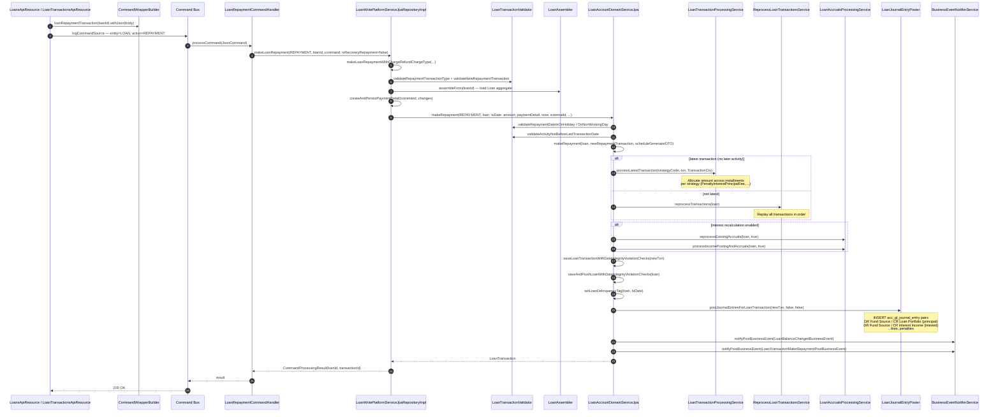

This page traces a single loan repayment through Apache Fineract — from the moment a `POST /api/v1/loans/{id}/transactions?command=repayment` hits the resource, into `LoanRepaymentCommandHandler`, down to `LoanWritePlatformService.makeLoanRepayment(...)`, through the **transaction processing strategy**, into schedule recalculation, and out as journal entries plus business events.

Repayment is the busiest write path in the platform: it touches the loan aggregate, writes a `LoanTransaction`, recomputes installment allocations using the loan's processing strategy, optionally regenerates the schedule, posts GL pairs, and emits multiple `BusinessEvent`s.

## Sequence diagram



## Step-by-step file map

| # | Step | File | Notes |
| --- | --- | --- | --- |
| 1 | API resource | `fineract-provider/src/main/java/org/apache/fineract/portfolio/loanaccount/api/LoanTransactionsApiResource.java` (and friends) | Builds `loanRepaymentTransaction(loanId)`. |
| 2 | Builder method | `fineract-core/src/main/java/org/apache/fineract/commands/service/CommandWrapperBuilder.java`, line ~1190 | `actionName = ACTION_REPAYMENT`, `entityName = LOAN`. |
| 3 | Handler | `fineract-loan/src/main/java/org/apache/fineract/portfolio/loanaccount/handler/LoanRepaymentCommandHandler.java` | `@CommandType(entity = "LOAN", action = "REPAYMENT")`. |
| 4 | Write service | `fineract-provider/src/main/java/org/apache/fineract/portfolio/loanaccount/service/LoanWritePlatformServiceJpaRepositoryImpl.java`, `makeLoanRepayment(...)` -> `makeLoanRepaymentWithChargeRefundChargeType(...)` | Validates, loads, builds payment detail. |
| 5 | Domain orchestration | `fineract-provider/src/main/java/org/apache/fineract/portfolio/loanaccount/domain/LoanAccountDomainServiceJpa.java`, `makeRepayment(...)` | The real work. |
| 6 | Strategy dispatch | `fineract-loan/src/main/java/org/apache/fineract/portfolio/loanaccount/service/LoanTransactionProcessingService.java` | Allocation across installments. |
| 7 | Replay (non-latest txn) | `fineract-loan/.../service/ReprocessLoanTransactionsService.java` | Used when a back-dated repayment invalidates later allocations. |
| 8 | Accruals | `fineract-loan/.../service/LoanAccrualsProcessingService.java` | For interest-recalculation-enabled products. |
| 9 | GL posting | `fineract-loan/src/main/java/org/apache/fineract/portfolio/loanaccount/service/LoanJournalEntryPoster.java` (interface; impl `LoanJournalEntryPosterImpl` in `fineract-provider`) | `postJournalEntriesForLoanTransaction(...)`. |
| 10 | Events | `fineract-core/.../event/business/service/BusinessEventNotifierService.java` | Drives [external event flow](/flows/external-event-flow). |

## The handler

```java
@Service
@RequiredArgsConstructor
@CommandType(entity = "LOAN", action = "REPAYMENT")
public class LoanRepaymentCommandHandler implements NewCommandSourceHandler {
    private final LoanWritePlatformService writePlatformService;
    private final DataIntegrityErrorHandler dataIntegrityErrorHandler;

    @Transactional
    @Override
    public CommandProcessingResult processCommand(final JsonCommand command) {
        try {
            boolean isRecoveryRepayment = false;
            return this.writePlatformService.makeLoanRepayment(
                LoanTransactionType.REPAYMENT, command.getLoanId(), command, isRecoveryRepayment);
        } catch (JpaSystemException | DataIntegrityViolationException dve) {
            dataIntegrityErrorHandler.handleDataIntegrityIssues(
                command, dve.getMostSpecificCause(), dve, "loan.repayment", "Repayment");
            return CommandProcessingResult.empty();
        }
    }
}
```

The peer handlers `LoanRepaymentAdjustmentCommandHandler`, `LoanRepaymentChargebackCommandHandler`, `GLIMBulkRepaymentCommandHandler` share the same write service entry points with different `LoanTransactionType` values and adjustment paths.

## Inside `makeLoanRepayment` (write service)

`makeLoanRepayment(...)` is a thin overload over `makeLoanRepaymentWithChargeRefundChargeType(...)`:

```java
public CommandProcessingResult makeLoanRepaymentWithChargeRefundChargeType(
        final LoanTransactionType repaymentTransactionType, final Long loanId, final JsonCommand command,
        final boolean isRecoveryRepayment, final String chargeRefundChargeType) {

    this.loanUtilService.validateRepaymentTransactionType(repaymentTransactionType);
    this.loanTransactionValidator.validateNewRepaymentTransaction(command.json());

    final LocalDate transactionDate = command.localDateValueOfParameterNamed("transactionDate");
    final BigDecimal transactionAmount = command.bigDecimalValueOfParameterNamed("transactionAmount");
    final ExternalId txnExternalId = externalIdFactory.createFromCommand(command, LoanApiConstants.externalIdParameterName);

    // ... changes map ...
    Loan loan = this.loanAssembler.assembleFrom(loanId);
    final PaymentDetail paymentDetail = this.paymentDetailWritePlatformService.createAndPersistPaymentDetail(command, changes);
    final Boolean isHolidayValidationDone = false;
    final HolidayDetailDTO holidayDetailDto = null;
    boolean isAccountTransfer = false;

    LoanTransaction loanTransaction = this.loanAccountDomainService.makeRepayment(
        repaymentTransactionType, loan, transactionDate, transactionAmount, paymentDetail,
        noteText, txnExternalId, isRecoveryRepayment, chargeRefundChargeType, isAccountTransfer,
        holidayDetailDto, isHolidayValidationDone);
    loan = loanTransaction.getLoan();
    this.loanAccountDomainService.updateAndSaveLoanCollateralTransactionsForIndividualAccounts(loan, loanTransaction);
    return new CommandProcessingResultBuilder()
        .withCommandId(command.commandId())
        .withLoanId(loan.getId())
        .withEntityId(loanTransaction.getId())
        .withEntityExternalId(loanTransaction.getExternalId())
        .withOfficeId(loan.getOfficeId()).withClientId(loan.getClientId()).withGroupId(loan.getGroupId())
        .with(changes).build();
}
```

This is the whole "outer" body — the rest of the complexity lives in `LoanAccountDomainServiceJpa.makeRepayment(...)`.

## Inside `LoanAccountDomainServiceJpa.makeRepayment`

The domain service does six things, in order. The fragments below come from `fineract-provider/src/main/java/org/apache/fineract/portfolio/loanaccount/domain/LoanAccountDomainServiceJpa.java` around line 270:

### 1. Validation

```java
loanTransactionValidator.validateActivityNotBeforeLastTransactionDate(loan, newRepaymentTransaction.getTransactionDate(), event);
loanDownPaymentTransactionValidator.validateRepaymentTypeAccountStatus(loan, newRepaymentTransaction, event);
loanTransactionValidator.validateActivityNotBeforeClientOrGroupTransferDate(loan, event, txDate);
```

### 2. Strategy-driven allocation

The inner `makeRepayment(loan, newTxn, scheduleGeneratorDTO)` (overloaded private method) decides whether to **append** the transaction to the existing schedule allocation or **replay** all prior transactions in chronological order. The decision uses `LoanTransactionProcessingService.canProcessLatestTransactionOnly(...)`:

```java
if (isLatestAndCleanlyAppendable) {
    loanTransactionProcessingService.processLatestTransaction(
        loan.getTransactionProcessingStrategyCode(),
        newRepaymentTransaction,
        new TransactionCtx(loan.getCurrency(), loan.getRepaymentScheduleInstallments(),
            loan.getActiveCharges(), new MoneyHolder(loan.getTotalOverpaidAsMoney()),
            null, loan.getActiveLoanTermVariations()));
} else {
    reprocessLoanTransactionsService.reprocessTransactions(loan);
}
```

The strategy code (e.g. `mifos-standard-strategy`, `creocore-strategy`, `early-repayment-strategy`) chooses the allocation order across **principal, interest, fees, penalties** for a single installment. Strategies are Spring beans implementing `LoanRepaymentScheduleTransactionProcessor`. The complete catalogue lives in `fineract-loan/.../domain/transactionprocessor/impl/`.

### 3. Interest recalculation and accruals

```java
if (loan.isInterestBearingAndInterestRecalculationEnabled()) {
    loanAccrualsProcessingService.reprocessExistingAccruals(loan, true);
    loanAccrualsProcessingService.processIncomePostingAndAccruals(loan, true);
}
```

Products with interest recalculation rebuild `m_loan_repayment_schedule` for the remaining term and post catch-up accruals.

### 4. Persistence

```java
loanAccountService.saveLoanTransactionWithDataIntegrityViolationChecks(newRepaymentTransaction);
loan = loanAccountService.saveAndFlushLoanWithDataIntegrityViolationChecks(loan);
```

The data-integrity wrapper translates unique-key violations into a domain error code so the client sees `EXTERNAL_ID_ALREADY_USED` instead of a JPA stack trace.

### 5. Delinquency tagging

```java
setLoanDelinquencyTag(loan, transactionDate);
```

Updates `m_loan_delinquency_tag_history` if this payment cleared or worsened the loan's overdue position.

### 6. Journal entries + business events

```java
journalEntryPoster.postJournalEntriesForLoanTransaction(newRepaymentTransaction, isAccountTransfer, isLoanToLoanTransfer);
if (!repaymentTransactionType.isChargeRefund()) {
    final LoanTransactionBusinessEvent txnEvent = getTransactionRepaymentTypeBusinessEvent(
        repaymentTransactionType, isRecoveryRepayment, newRepaymentTransaction);
    businessEventNotifierService.notifyPostBusinessEvent(new LoanBalanceChangedBusinessEvent(loan));
    businessEventNotifierService.notifyPostBusinessEvent(txnEvent);
}
disableStandingInstructionsLinkedToClosedLoan(loan);
```

The `getTransactionRepaymentTypeBusinessEvent(...)` helper picks the right concrete event class:

| Repayment type | Event class |
| --- | --- |
| `REPAYMENT` (normal) | `LoanTransactionMakeRepaymentPostBusinessEvent` |
| `REPAYMENT` with `isRecoveryRepayment=true` | `LoanTransactionRecoveryPaymentPostBusinessEvent` |
| `INTEREST_PAYMENT_WAIVER` | `LoanTransactionInterestPaymentWaiverPostBusinessEvent` |
| `MERCHANT_ISSUED_REFUND` / `PAYOUT_REFUND` | `LoanRefundPostBusinessEvent` |
| `GOODWILL_CREDIT` | `LoanGoodwillCreditPostBusinessEvent` |
| `CREDIT_BALANCE_REFUND` | `LoanCreditBalanceRefundPostBusinessEvent` |

These events fan out through `BusinessEventNotifierService` to (a) internal listeners that update caches and (b) the `external_event` outbox.

## What gets written, per table

| Table | Rows |
| --- | --- |
| `m_payment_detail` | One row per repayment with a payment method. |
| `m_loan_transaction` | One row, `transaction_type_enum = 2` (REPAYMENT). |
| `m_loan_transaction_repayment_schedule_mapping` | One row per installment touched, with principal/interest/fee/penalty splits. |
| `m_loan_repayment_schedule` | Updated `paid_*` columns; recreated entirely if interest recalc. |
| `m_loan` | Updated balances, status if closed. |
| `m_loan_delinquency_tag_history` | If delinquency changed. |
| `m_note` | If `note` parameter present. |
| `acc_gl_journal_entry` | DR/CR pairs per allocation (principal, interest, fees, penalties). |
| `external_event` | One row per `notifyPostBusinessEvent` for configured event types. |

## Reprocessing back-dated repayments

When the transaction date is **before** the latest existing transaction on the loan, `processLatestTransaction` cannot be used because it would corrupt the prior allocations. The domain service falls back to `ReprocessLoanTransactionsService.reprocessTransactions(loan)`, which:

1. Resets paid columns on all installments.
2. Iterates `m_loan_transaction` rows in chronological order.
3. Replays each through the strategy.
4. Rebuilds `m_loan_transaction_repayment_schedule_mapping`.

The replay runs inside the same `@Transactional` boundary, so a failure rolls the whole repayment back.

## Account-transfer-driven repayments

A standing instruction or a manual transfer from savings to loan ends up in the same `makeRepayment` method but with `isAccountTransfer = true`. The chain is:

```
AccountTransfersWritePlatformService
  → LoanAccountDomainService.makeRepayment(..., isAccountTransfer=true, ...)
    → journalEntryPoster.postJournalEntriesForLoanTransaction(txn, true, false)
```

The `isAccountTransfer` flag tells `LoanJournalEntryPoster` to use the **transfer** GL pair instead of the fund-source pair.

## Bulk repayment (GLIM and collection sheet)

| Variant | Entry point |
| --- | --- |
| GLIM (group with parent + child loans) | `GLIMBulkRepaymentCommandHandler` -> `makeLoanBulkRepayment(...)` (loops `makeLoanRepayment` over child loans). |
| Collection sheet | `CollectionSheetBulkRepaymentCommand` -> `LoanWritePlatformServiceJpaRepositoryImpl.makeLoanBulkRepayment(...)`. |

Both still call the same `LoanAccountDomainServiceJpa.makeRepayment(...)` per loan, so the per-loan behaviour is identical.

## COB-locked loans

If a COB business step is currently running against the loan, `LoanCOBApiFilter` rejects the request before it reaches the resource method. The filter consults `m_loan_account_locks`; see [COB execution flow](/flows/cob-execution-flow).

For **inline** COB (a write attempt arriving before the loan's `last_closed_business_date` catches up to today), `InlineLoanCOBExecutionDataParser` triggers an inline catch-up before the repayment is processed, so the schedule is current.

## Where to put a breakpoint

| Symptom | Breakpoint |
| --- | --- |
| Repayment validation rejected | `LoanTransactionValidator.validateNewRepaymentTransaction`. |
| Wrong allocation across components | `LoanTransactionProcessingService.processLatestTransaction` — depends on strategy code. |
| Schedule didn't regenerate | `LoanAccrualsProcessingService.reprocessExistingAccruals`. |
| GL pair missing | `LoanJournalEntryPoster.postJournalEntriesForLoanTransaction`. |
| Event missing from Kafka | `BusinessEventNotifierService.notifyPostBusinessEvent` (and then [external event flow](/flows/external-event-flow)). |

## Related flows

- [Loan application to disbursal](/flows/loan-application-to-disbursal) — what came before this transaction.
- [Command dispatch flow](/flows/command-dispatch-flow) — the generic dispatcher.
- [COB execution flow](/flows/cob-execution-flow) — nightly delinquency/accrual steps.
- [External event flow](/flows/external-event-flow) — outbox emission of repayment events.
- [Maker-checker flow](/flows/maker-checker-flow) — when `REPAYMENT_LOAN` is configured under maker-checker.
