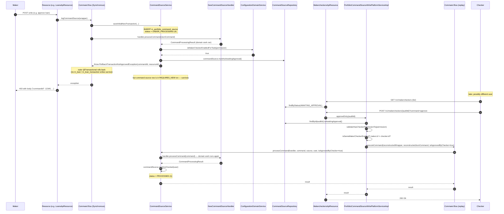

This page traces the **two-person review** (also called *4-eye*) flow in Apache Fineract. When maker-checker is enabled for a permission, a maker submits a command exactly as they normally would — but instead of committing, the platform throws `RollbackTransactionNotApprovedException`, rolls back the domain work, and persists the command as `AWAITING_APPROVAL` so a separate user (the checker) can review and approve it through `MakercheckersApiResource`. On approval the platform replays the exact same command and lets it commit.

Read this when you need to understand why a successful-looking POST returned `403` with a `commandId`, why the audit row is `status=2`, or why the checker's approval call uses `POST /v1/makercheckers/{auditId}`.

## End-to-end sequence



## Step-by-step file map

| Step | File | Purpose |
| --- | --- | --- |
| Maker call | API resource | Standard write entry point; no special code path. |
| Build command | `fineract-core/src/main/java/org/apache/fineract/commands/service/CommandWrapperBuilder.java` | Same wrapper as a normal call. |
| Process | `fineract-core/src/main/java/org/apache/fineract/commands/service/SynchronousCommandProcessingService.java`, `executeCommand(...)` | Saves the initial source row and calls the handler via `CommandSourceService.processCommand`. |
| Maker-checker decision | `fineract-core/src/main/java/org/apache/fineract/commands/service/CommandSourceService.java`, `processCommand(...)` | The branch that throws `RollbackTransactionNotApprovedException`. |
| Exception | `fineract-core/src/main/java/org/apache/fineract/commands/exception/RollbackTransactionNotApprovedException.java` | Wraps a `CommandProcessingResult` with `setRollbackTransaction(true)`. |
| Exception mapper | `fineract-core/src/main/java/org/apache/fineract/infrastructure/core/exceptionmapper/RollbackTransactionNotApprovedExceptionMapper.java` | Converts to HTTP response with the command id. |
| Maker-checker inbox | `fineract-provider/src/main/java/org/apache/fineract/commands/api/MakercheckersApiResource.java` | `GET /v1/makercheckers` list, `POST /v1/makercheckers/{id}?command=approve\|reject`, `DELETE /v1/makercheckers/{id}`. |
| Approve / reject service | `fineract-core/src/main/java/org/apache/fineract/commands/service/PortfolioCommandSourceWritePlatformServiceImpl.java` | `approveEntry(id)`, `rejectEntry(id)`, `deleteEntry(id)`. |
| Audit search | `fineract-provider/src/main/java/org/apache/fineract/commands/service/AuditReadPlatformServiceImpl.java` | Backs the inbox queries. |
| Configuration | `ConfigurationDomainService.isMakerCheckerEnabledForTask(permission)`, `.isSameMakerCheckerEnabled()` | Per-permission toggle and "can the maker be their own checker?" flag. |

## The decision point, in code

`CommandSourceService.processCommand(...)` in `fineract-core/src/main/java/org/apache/fineract/commands/service/CommandSourceService.java`:

```java
@Transactional
public CommandProcessingResult processCommand(NewCommandSourceHandler handler, JsonCommand command,
        CommandSource commandSource, AppUser user, boolean isApprovedByChecker) {
    final CommandProcessingResult result = handler.processCommand(command);

    String permission = commandSource.getPermissionCode();
    boolean isMakerChecker = configurationDomainService.isMakerCheckerEnabledForTask(permission);
    if (isMakerChecker || result.isRollbackTransaction()) {
        if (isApprovedByChecker || user.isCheckerSuperUser()) {
            commandSource.markAsChecked(user);
        } else {
            if (commandSource.isSanitized()) {
                throw new GeneralPlatformDomainRuleException("error.msg.invalid.sanitization",
                    "Maker-checker command can not be sanitized, please change the permission configuration", permission);
            }
            commandSource.markAsAwaitingApproval();
            throw new RollbackTransactionNotApprovedException(commandSource.getId(), commandSource.getResourceId());
        }
    }
    return result;
}
```

The key insight: **`handler.processCommand(command)` has already run** when the decision is made. Validation has happened, schedule generation has happened, journal entries have been written. The throw forces Spring's `@Transactional` proxy on the calling method (`SynchronousCommandProcessingService.executeCommand`) to **roll back the outer transaction**, so none of that domain work commits.

But two artefacts survive the rollback:

1. The `m_portfolio_command_source` row, which was inserted in a `REQUIRES_NEW` transaction at the very start of `executeCommand(...)`. The `markAsAwaitingApproval()` call happens to the **same managed entity**, and because `processCommand` is annotated `@Transactional` (default propagation `REQUIRED`), the status mutation is part of the inner transaction context. Importantly, `SynchronousCommandProcessingService.executeCommand` catches `Throwable`, persists the status mutation via `saveResultNewTransaction(...)` if needed, and rethrows. So the audit row ends up `status = AWAITING_APPROVAL (2)`.
2. The `idempotency_key`, which lets the platform recognise replays.

## The rollback exception

```java
public class RollbackTransactionNotApprovedException extends RuntimeException {
    private final CommandProcessingResult result;
    public RollbackTransactionNotApprovedException(Long commandId, Long entityId) {
        this.result = new CommandProcessingResultBuilder()
            .withCommandId(commandId)
            .withEntityId(entityId)
            .setRollbackTransaction(true)
            .build();
    }
    public CommandProcessingResult getResult() { return result; }
}
```

The exception **carries** the same `CommandProcessingResult` shape the maker would have got on a normal commit — so the mapper can return a JSON body the client can use to poll the inbox.

## The exception mapper

`RollbackTransactionNotApprovedExceptionMapper` (in `fineract-core/src/main/java/org/apache/fineract/infrastructure/core/exceptionmapper/`) implements `ExceptionMapper<RollbackTransactionNotApprovedException>`. It returns a `Response` whose body is the embedded `CommandProcessingResult`, so the maker UI sees:

```json
{
  "commandId": 12345,
  "resourceId": 678,
  "rollbackTransaction": true
}
```

The HTTP status code is configured by the mapper (`403` by default for this exception). UIs typically interpret `rollbackTransaction = true` to mean "queued for approval; show the checker inbox link".

## CommandSource status enum

From `fineract-core/src/main/java/org/apache/fineract/commands/domain/CommandProcessingResultType.java`:

| Value | Name | Meaning |
| --- | --- | --- |
| 0 | `INVALID` | Sentinel. |
| 1 | `PROCESSED` | Successful — committed. |
| 2 | `AWAITING_APPROVAL` | Maker has submitted; waiting for checker. |
| 3 | `REJECTED` | Checker rejected. |
| 4 | `UNDER_PROCESSING` | Initial state, during the handler call. |
| 5 | `ERROR` | Domain or system error. |

Transitions on `CommandSource`:

| Method | Sets status |
| --- | --- |
| `getInitialCommandSource(...)` | `UNDER_PROCESSING (4)` |
| `markAsAwaitingApproval()` | `AWAITING_APPROVAL (2)` |
| `markAsChecked(checker)` | `PROCESSED (1)` and stamps `checker_id`/`checked_on_date`. |
| `markAsRejected(checker)` | `REJECTED (3)` and stamps `checker_id`/`checked_on_date`. |

## Checker endpoints

`MakercheckersApiResource` (in `fineract-provider/src/main/java/org/apache/fineract/commands/api/MakercheckersApiResource.java`) is annotated `@Path("/v1/makercheckers")` and exposes:

| Verb | Path | Method | Behaviour |
| --- | --- | --- | --- |
| `GET` | `/v1/makercheckers` | `retrieveCommands(...)` | Lists `AWAITING_APPROVAL` rows scoped to the requester's office. |
| `GET` | `/v1/makercheckers/searchtemplate` | `retrieveAuditSearchTemplate()` | Returns the action names / entity names the requester can approve. |
| `POST` | `/v1/makercheckers/{auditId}?command=approve` | `approveMakerCheckerEntry(auditId, "approve")` | Replays the command with `isApprovedByChecker = true`. |
| `POST` | `/v1/makercheckers/{auditId}?command=reject` | `approveMakerCheckerEntry(auditId, "reject")` | Marks the source row `REJECTED`. |
| `DELETE` | `/v1/makercheckers/{auditId}` | `deleteMakerCheckerEntry(auditId)` | Removes the parked row entirely. |

The `approve` body of the resource method:

```java
if (is(commandParam, COMMAND_APPROVE)) {
    result = writePlatformService.approveEntry(auditId);
} else if (is(commandParam, COMMAND_REJECT)) {
    final Long id = writePlatformService.rejectEntry(auditId);
    result = CommandProcessingResult.commandOnlyResult(id);
}
```

## The replay path

`PortfolioCommandSourceWritePlatformServiceImpl.approveEntry(makerCheckerId)` reconstructs both the `CommandWrapper` and the `JsonCommand` from the parked `CommandSource` row:

```java
final CommandSource commandSourceInput = validateMakerCheckerTransaction(makerCheckerId);
validateIsUpdateAllowed();
final CommandWrapper wrapper = CommandWrapper.fromExistingCommand(makerCheckerId,
    commandSourceInput.getActionName(), commandSourceInput.getEntityName(),
    commandSourceInput.getResourceId(), commandSourceInput.getSubResourceId(),
    commandSourceInput.getResourceGetUrl(), /* every id field from the row */);
final JsonElement parsedCommand = this.fromApiJsonHelper.parse(commandSourceInput.getCommandAsJson());
final JsonCommand command = JsonCommand.fromExistingCommand(makerCheckerId,
    commandSourceInput.getCommandAsJson(), parsedCommand, /* etc */);
return this.processAndLogCommandService.executeCommand(wrapper, command, /* isApprovedByChecker */ true);
```

The third argument — `true` — is the only difference from the maker's original call. Inside the command bus:

- `SynchronousCommandProcessingService.executeCommand` notices `command.commandId()` is non-null (the audit id from the wrapper) and **reuses the existing `CommandSource` row** instead of creating a new one.
- `CommandSourceService.processCommand` sees `isApprovedByChecker = true` and skips the throw, calling `markAsChecked(user)` instead.

The handler is invoked exactly as during the maker call — same validation, same journal entries, same business events. Because the maker's transaction rolled back, none of that work was previously committed, so this is a fresh write.

## Replay safety: validation

Between the maker's call and the checker's call, the world may have changed. The replay **re-runs full validation**. If a precondition no longer holds (the loan has been disbursed already, the client is suspended, the business date has rolled forward), the handler throws a `PlatformApiDataValidationException` or `GeneralPlatformDomainRuleException` and the source row is moved to `ERROR (5)`. The checker sees the error, can `DELETE` the row, and ask the maker to resubmit.

## Same-user-as-checker rule

`validateMakerCheckerTransaction(makerCheckerId)` enforces the "different person" rule unless `same-maker-checker-enabled` is on:

```java
if (!configurationService.isSameMakerCheckerEnabled() && !appUser.isCheckerSuperUser()) {
    AppUser maker = commandSource.getMaker();
    if (maker == null) {
        throw new UnsupportedCommandException(permissionCode, "Maker user is missing.");
    }
    if (Objects.equals(appUser.getId(), maker.getId())) {
        throw new UnsupportedCommandException(permissionCode, "Can not be checked by the same user.");
    }
}
```

And earlier:

```java
String permissionCode = commandSource.getPermissionCode();
appUser.validateHasCheckerPermissionTo(permissionCode);
```

So the checker must hold the **CHECKER variant** of the permission (e.g. `APPROVE_LOAN_CHECKER` to approve a parked `APPROVE_LOAN`).

## Rejection path

```java
public Long rejectEntry(final Long makerCheckerId) {
    final CommandSource commandSourceInput = validateMakerCheckerTransaction(makerCheckerId);
    validateIsUpdateAllowed();
    final AppUser maker = this.context.authenticatedUser();
    commandSourceInput.markAsRejected(maker);
    this.commandSourceRepository.save(commandSourceInput);
    if (cleanupServices != null) {
        for (CleanupService cleanupService : cleanupServices) {
            cleanupService.cleanup(commandSourceInput);
        }
    }
    return makerCheckerId;
}
```

The `cleanupServices` hook lets modules that wrote draft state during the maker's run (e.g. an unsanitised JSON copy) clear it on rejection.

## Auto-bypass for "change of own user details"

`PortfolioCommandSourceWritePlatformServiceImpl.logCommandSource` short-circuits the maker-checker rule when a user is updating their own profile:

```java
if (wrapper.isChangeOfOwnUserDetails(this.context.authenticatedUser(wrapper).getId())) {
    isApprovedByChecker = true; // bypass
}
```

So `PUT /users/{id}` against your own user id never gets parked.

## Bypass: `result.isRollbackTransaction()`

A handler can set `rollbackTransaction = true` on the result it returns to mean "this needs review even though maker-checker isn't globally enabled for the permission". The `CommandSourceService.processCommand` decision branch reads this and parks the command identically.

## Idempotency interaction

If the maker submits the same command twice (same idempotency key) before the checker approves, the second submission sees the `AWAITING_APPROVAL` row and either returns the parked status or throws an idempotent-process exception, depending on the precise lifecycle stage. The checker still sees exactly one row.

## Operational observability

`m_portfolio_command_source` carries everything you need:

| Column | Use |
| --- | --- |
| `status_enum` | Filter `2` for the inbox. |
| `made_by_user_id` | Maker. |
| `checked_by_user_id` | Checker (NULL until approved/rejected). |
| `made_on_date` / `checked_on_date` | SLA reporting. |
| `permission_code` | Which permission triggered the review. |
| `command_as_json` | What the maker submitted. |
| `result_status_code` / `result` | Filled when approved or errored on replay. |

## Where to put a breakpoint

| Symptom | Breakpoint |
| --- | --- |
| Command did not get parked | `CommandSourceService.processCommand` — check `isMakerCheckerEnabledForTask(permission)`. |
| Approve fails "Maker user is missing" | `PortfolioCommandSourceWritePlatformServiceImpl.validateMakerCheckerTransaction`. |
| Approve replay re-errors | Inside the handler — fresh validation against current state. |
| Inbox shows wrong scope | `AuditReadPlatformServiceImpl.retrieveAllEntriesToBeChecked`. |

## Related flows

- [Command dispatch flow](/flows/command-dispatch-flow) — where the rollback exception is thrown.
- [HTTP request lifecycle](/flows/http-request-lifecycle) — how the mapper turns the rollback into a `403`.
- [Loan application to disbursal](/flows/loan-application-to-disbursal) — common use case (4-eye approve / disburse).
- [Command audit](/command/command-audit) — table schema details.
- [Users, roles, permissions](/security/users-roles-permissions) — where the CHECKER permissions are defined.
