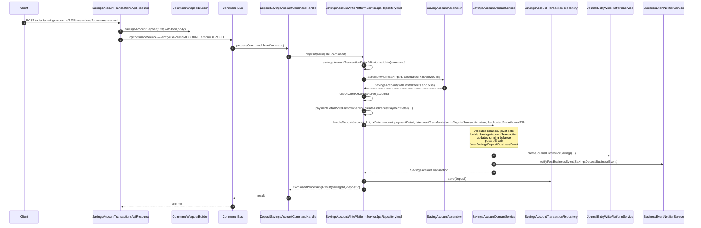
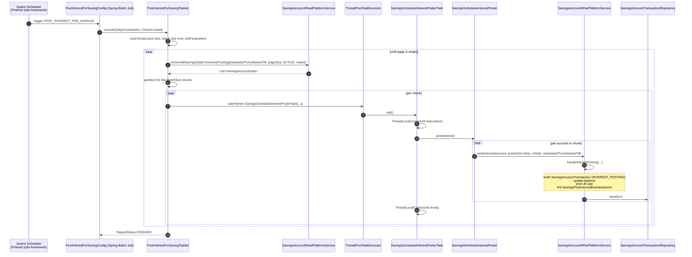

This page covers two complementary savings flows in Apache Fineract: the **synchronous deposit** triggered by a `POST /api/v1/savingsaccounts/{id}/transactions?command=deposit` call, and the **nightly `POST_INTEREST_FOR_SAVINGS`** scheduled job that capitalises accrued interest across all active savings accounts.

The deposit flow is the simpler of the two — a single command handler delegating to the savings domain service. The interest-posting flow is a parallelised Spring Batch tasklet that pages accounts, fans them out to a thread pool, and posts interest per account inside its own per-task transaction.

## Part 1: Synchronous deposit

### Sequence diagram



### Step-by-step file map

| # | Step | File | Method |
| --- | --- | --- | --- |
| 1 | Resource | `fineract-provider/src/main/java/org/apache/fineract/portfolio/savings/api/SavingsAccountTransactionsApiResource.java` | Matches `command=deposit`, builds `savingsAccountDeposit(savingsId)`. |
| 2 | Builder | `fineract-core/src/main/java/org/apache/fineract/commands/service/CommandWrapperBuilder.java` | `savingsAccountDeposit(savingsId)` — sets entity `SAVINGSACCOUNT`, action `DEPOSIT`. |
| 3 | Handler | `fineract-provider/src/main/java/org/apache/fineract/portfolio/savings/handler/DepositSavingsAccountCommandHandler.java` | `@CommandType(entity = "SAVINGSACCOUNT", action = "DEPOSIT")`. |
| 4 | Write service | `fineract-provider/src/main/java/org/apache/fineract/portfolio/savings/service/SavingsAccountWritePlatformServiceJpaRepositoryImpl.java`, `deposit(Long savingsId, JsonCommand command)` | Validates, assembles, persists. |
| 5 | Domain | `fineract-savings/src/main/java/org/apache/fineract/portfolio/savings/service/SavingsAccountDomainService.java` (impl in `fineract-provider`) | `handleDeposit(...)` — updates balance, posts GL. |
| 6 | Transaction repo | `fineract-savings/.../domain/SavingsAccountTransactionRepository.java` | JPA repository. |
| 7 | Events | `BusinessEventNotifierService.notifyPostBusinessEvent(...)` | Drives [external event flow](/flows/external-event-flow). |

### What the handler does

```java
@Service
@CommandType(entity = "SAVINGSACCOUNT", action = "DEPOSIT")
public class DepositSavingsAccountCommandHandler implements NewCommandSourceHandler {
    private final SavingsAccountWritePlatformService writePlatformService;
    @Transactional
    @Override
    public CommandProcessingResult processCommand(final JsonCommand command) {
        return this.writePlatformService.deposit(command.getSavingsId(), command);
    }
}
```

### What `deposit(...)` does

From `SavingsAccountWritePlatformServiceJpaRepositoryImpl.deposit(...)` around line 281:

```java
this.context.authenticatedUser();
this.savingsAccountTransactionDataValidator.validate(command);
final boolean backdatedTxnsAllowedTill = this.savingAccountAssembler.getPivotConfigStatus();
final SavingsAccount account = this.savingAccountAssembler.assembleFrom(savingsId, backdatedTxnsAllowedTill);
checkClientOrGroupActive(account);
// parse date, amount, externalId, paymentDetail
this.savingsAccountTransactionDataValidator.validateTransactionWithPivotDate(transactionDate, account);
final PaymentDetail paymentDetail = this.paymentDetailWritePlatformService.createAndPersistPaymentDetail(command, changes);
boolean isAccountTransfer = false;
boolean isRegularTransaction = true;
final SavingsAccountTransaction deposit = this.savingsAccountDomainService.handleDeposit(
    account, fmt, transactionDate, transactionAmount, paymentDetail,
    isAccountTransfer, isRegularTransaction, backdatedTxnsAllowedTill);
deposit.updateExternalId(externalId);
this.savingsAccountTransactionRepository.save(deposit);
// optional: GSIM aggregate update if this is a group savings sub-account
// optional: note row
return new CommandProcessingResultBuilder()
    .withEntityId(deposit.getId()).withOfficeId(account.officeId())
    .withClientId(account.clientId()).withGroupId(account.groupId())
    .withSavingsId(savingsId).with(changes).build();
```

### What gets written

| Table | Operation |
| --- | --- |
| `m_payment_detail` | Optional `INSERT` if payment method present. |
| `m_savings_account_transaction` | `INSERT` `transaction_type_enum = 1` (DEPOSIT). |
| `m_savings_account` | `UPDATE` running balance. |
| `m_gsim_account` | `UPDATE` parent deposit when the account is a GSIM sub-account. |
| `m_note` | `INSERT` when `note` is provided. |
| `acc_gl_journal_entry` | DR/CR pair: DR fund source, CR savings reference. |
| `external_event` | If `SavingsDepositBusinessEvent` is configured. |

### Pivot date and backdated transactions

`backdatedTxnsAllowedTill` is the global flag from `ConfigurationDomainService.retrievePivotDateConfig()`. When enabled, the account is assembled differently — only transactions on or after the pivot date are loaded — and back-dated transactions get extra validation through `validateTransactionWithPivotDate(...)`. This is the standard performance optimisation for tenants with millions of historical transactions.

### Related savings handlers

| Action | Handler | Calls |
| --- | --- | --- |
| `DEPOSIT` | `DepositSavingsAccountCommandHandler` | `deposit(...)` |
| `WITHDRAWAL` | `SavingsAccountWithdrawalCommandHandler` | `withdrawal(...)` |
| `POSTINTEREST` | `PostInterestSavingsAccountCommandHandler` | `postInterest(JsonCommand)` |
| `POSTINTERESTASONDATE` | `PostSavingsAccountInterestAsOnDateCommandHandler` | `postInterest(JsonCommand)` |
| `CALCULATEINTEREST` | `CalculateInterestSavingsAccountCommandHandler` | `calculateInterest(...)` |
| `ACTIVATE` | `ActivateSavingsAccountCommandHandler` | `activate(...)` |
| `DEPOSIT` (fixed deposit) | `FixedDepositAccountDepositCommandHandler` | `depositToFD(...)` |

All follow the same command-handler-delegates-to-write-service shape.

## Part 2: Nightly interest posting

The `POST_INTEREST_FOR_SAVINGS` Spring Batch job runs every night (cron-configurable per tenant in `job` table). It scans every `ACTIVE` savings account and posts accrued interest as a single transaction per account.

### Sequence diagram



### Step-by-step file map

| # | Step | File | Purpose |
| --- | --- | --- | --- |
| 1 | Job definition | `fineract-provider/src/main/java/org/apache/fineract/portfolio/savings/jobs/postinterestforsavings/PostInterestForSavingConfig.java` | Spring Batch `@Configuration` registering the `Job` bean. |
| 2 | Tasklet | `fineract-provider/src/main/java/org/apache/fineract/portfolio/savings/jobs/postinterestforsavings/PostInterestForSavingTasklet.java` | Implements `Tasklet.execute(...)` — paging + thread pool fan-out. |
| 3 | Read service | `fineract-provider/.../service/SavingsAccountReadPlatformServiceImpl.java`, method `retrieveAllSavingsDataForInterestPosting(...)` | Pages `ACTIVE` savings with `id > maxSavingsIdInList`. |
| 4 | Per-task wrapper | `fineract-savings/src/main/java/org/apache/fineract/portfolio/savings/service/SavingsSchedularInterestPosterTask.java` | Implements `Callable<Void>`; restores `ThreadLocalContextUtil` from the captured `FineractContext` so the worker thread sees the right tenant + business date. |
| 5 | Poster | `fineract-savings/.../service/SavingsSchedularInterestPoster.java` (impl in `fineract-provider`) | Loops over the assigned `SavingsAccountData` and calls `postInterest(account, ...)` on the write service. |
| 6 | Write service | `SavingsAccountWritePlatformServiceJpaRepositoryImpl.postInterest(SavingsAccount account, boolean postInterestAs, LocalDate transactionDate, boolean backdatedTxnsAllowedTill)` | Produces and persists an `INTEREST_POSTING` transaction with the GL entries. |

### What the tasklet does, in code

```java
@Override
public RepeatStatus execute(StepContribution contribution, ChunkContext chunkContext) throws Exception {
    final Queue<List<SavingsAccountData>> queue = new ArrayDeque<>();
    final int threadPoolSize = Integer.parseInt((String) chunkContext.getStepContext().getJobParameters().get("thread-pool-size"));
    taskExecutor.setCorePoolSize(threadPoolSize);
    taskExecutor.setMaxPoolSize(threadPoolSize);
    final int batchSize = Integer.parseInt((String) chunkContext.getStepContext().getJobParameters().get("batch-size"));
    final int pageSize = batchSize * threadPoolSize;
    Long maxSavingsIdInList = 0L;
    final boolean backdatedTxnsAllowedTill = this.configurationDomainService.retrievePivotDateConfig();
    List<SavingsAccountData> savingsAccounts = savingAccountReadPlatformService
        .retrieveAllSavingsDataForInterestPosting(backdatedTxnsAllowedTill, pageSize, ACTIVE.getValue(), maxSavingsIdInList);
    // partition + submit + drain queue ...
}
```

The key design choices:

- **Paging by id**. The query uses `WHERE id > :maxSavingsIdInList ORDER BY id LIMIT :pageSize` so it scales without offset.
- **Per-page fan-out**. Each page is split into `threadPoolSize` chunks of `batchSize` accounts.
- **Tenant context propagation**. Each `SavingsSchedularInterestPosterTask` captures the parent thread's `FineractContext` and reinstates it via `ThreadLocalContextUtil.init(context)` inside `call()`. Without this, the worker would have no tenant and `RoutingDataSource.determineTargetDataSource()` would fail.

### What the per-account `postInterest` does

`SavingsAccountWritePlatformServiceJpaRepositoryImpl.postInterest(...)` runs inside its own transaction (annotated on the public method) and:

1. Computes accrued interest using the savings product's compounding/posting period configuration.
2. Builds a `SavingsAccountTransaction` with `transaction_type_enum = 12` (`INTEREST_POSTING`).
3. Updates the running balance.
4. Posts a GL pair (DR interest expense, CR savings reference).
5. Fires `SavingsPostInterestBusinessEvent`.

### What gets written, per account

| Table | Operation |
| --- | --- |
| `m_savings_account_transaction` | One `INSERT` per posting period. |
| `m_savings_account` | Running balance + `last_interest_calculation_date`. |
| `m_savings_account_charge_paid_by` | Updated when capitalised interest pays a charge. |
| `acc_gl_journal_entry` | DR/CR pair. |
| `external_event` | If configured. |

### Failure isolation

The tasklet catches exceptions per chunk — a poison-pill account doesn't halt the whole job. But each chunk runs in its own transaction (started inside the write service), so partial chunk failures **do** roll back the chunk's accounts. Operationally, this means `POST_INTEREST_FOR_SAVINGS` can have a non-zero "skipped" count without leaving the GL inconsistent.

### Tuning knobs

| Job parameter | Effect |
| --- | --- |
| `thread-pool-size` | Number of concurrent worker threads. |
| `batch-size` | Accounts per chunk per worker. `pageSize = batch-size * thread-pool-size`. |
| Cron | When the job fires; configured via the Scheduler API or `job` table. |
| Global config `pivot date` | Limits the period reloaded for each account. |

## Where to put a breakpoint

| Symptom | Breakpoint |
| --- | --- |
| Deposit validation rejected | `SavingsAccountTransactionDataValidator.validate(JsonCommand)`. |
| Balance is wrong after deposit | `SavingsAccountDomainServiceJpa.handleDeposit(...)` (impl). |
| GL pair missing | `JournalEntryWritePlatformServiceJpaRepositoryImpl.createJournalEntriesForSavings(...)`. |
| Nightly job runs but no interest posted | `PostInterestForSavingTasklet.execute` — check `savingsAccounts.size()` after the read service call. |
| Worker thread NPE on tenant | `SavingsSchedularInterestPosterTask.call()` — verify `FineractContext` was captured. |

## Withdrawals: the mirror image

Although out of scope for the synchronous deposit flow, the **withdrawal** path is identical with the sign flipped and an extra validation layer:

| Step | Withdrawal-specific behaviour |
| --- | --- |
| Handler | `SavingsAccountWithdrawalCommandHandler` (`@CommandType(entity="SAVINGSACCOUNT", action="WITHDRAWAL")`). |
| Write service | `SavingsAccountWritePlatformServiceJpaRepositoryImpl.withdraw(...)`. |
| Validation | `SavingsAccountTransactionDataValidator.validate(command)` plus a min-balance / overdraft check against the savings product configuration. |
| Charge applied | Optional `WITHDRAWAL_FEE`; posted as a separate `SavingsAccountTransaction` row inside the same transaction. |
| GL pair | DR savings reference, CR fund source. |
| Event | `SavingsWithdrawalBusinessEvent`. |

The "block" variant (`SAVINGSACCOUNT/BLOCK`, `UNBLOCK`, `BLOCK_DEPOSIT`, `BLOCK_WITHDRAWAL`) does not move money, but writes a `m_savings_account_transaction` row of the appropriate type so balance computation honours the block until it is reversed.

## Interest posting toggled by global config

Two flavours of interest posting coexist:

| Mode | Trigger | Behaviour |
| --- | --- | --- |
| Per-account synchronous | `POST /savingsaccounts/{id}?command=postInterest` via `PostInterestSavingsAccountCommandHandler` | Useful for ad-hoc reconciliation or manual close. |
| Nightly batched | `POST_INTEREST_FOR_SAVINGS` Spring Batch job | Production path. |

Both end up calling the same `SavingsAccountWritePlatformServiceJpaRepositoryImpl.postInterest(...)` overload, so the per-account computation, GL pair, and event are identical regardless of how the call was triggered.

When `posting period` is configured on the savings product (monthly / quarterly / annual), the batched job only emits transactions for accounts whose **next** posting date is on or before the business date. The read service's `retrieveAllSavingsDataForInterestPosting(...)` query filters on this so workers don't waste CPU on accounts that aren't due yet.

## Fixed deposit and recurring deposit variants

Both fixed deposit (FD) and recurring deposit (RD) accounts reuse the same savings infrastructure with extra handlers for their specific lifecycle:

| Action | FD handler | RD handler |
| --- | --- | --- |
| Submit | `FixedDepositAccountApplicationSubmittalCommandHandler` | `RecurringDepositAccountApplicationSubmittalCommandHandler` |
| Approve | `FixedDepositAccountApplicationApprovalCommandHandler` | `RecurringDepositAccountApplicationApprovalCommandHandler` |
| Activate | `ActivateFixedDepositAccountCommandHandler` | `ActivateRecurringDepositAccountCommandHandler` |
| Deposit | `FixedDepositAccountDepositCommandHandler` | `RecurringDepositAccountDepositCommandHandler` |
| Interest posting | `PostInterestFixedDepositAccountCommandHandler` | `PostInterestRecurringDepositAccountCommandHandler` |
| Premature close | `PrematureCloseFixedDepositAccountCommandHandler` | `PrematureCloseRecurringDepositAccountCommandHandler` |

The write-service layer dispatches to `DepositAccountWritePlatformService` (a peer of `SavingsAccountWritePlatformService`) that internally calls the same savings transaction primitives.

## Related flows

- [Command dispatch flow](/flows/command-dispatch-flow) — the synchronous path.
- [Background jobs framework](/core/jobs-framework) — how Quartz fires the batch job.
- [COB execution flow](/flows/cob-execution-flow) — the analogous loan job, with deeper partitioning.
- [External event flow](/flows/external-event-flow) — how `SavingsDepositBusinessEvent` and `SavingsPostInterestBusinessEvent` reach Kafka.
- [Tenant resolution flow](/flows/tenant-resolution-flow) — context propagation that the worker threads rely on.
