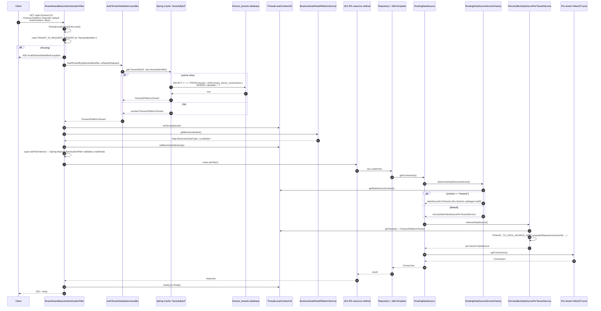

This page explains how Apache Fineract turns the `Fineract-Platform-TenantId` HTTP header into a JDBC connection pointed at the right tenant database. The mechanism is a Spring filter that reads the header, a cached `JdbcTenantDetailsService` (and its sibling `AuthTenantDetailsServiceJdbc` for auth-time reports), a `ThreadLocal` context, and a `RoutingDataSource` that picks a per-tenant HikariCP pool when JPA asks for a `Connection`.

Read this when you need to debug a 400 with `InvalidTenantIdentifierException`, understand why background jobs need to capture a `FineractContext`, or work out where to add a new tenant connection pool.

## Big picture

```mermaid
flowchart LR
    H[Fineract-Platform-TenantId header] --> F[TenantAwareBasicAuthenticationFilter]
    F --> A[AuthTenantDetailsService.loadTenantById<br/>cache: tenantsById<br/>SELECT from fineract_tenants.tenants + tenant_server_connections]
    A --> T[FineractPlatformTenant]
    T --> TL[ThreadLocalContextUtil.setTenant]
    TL --> R[RoutingDataSource<br/>extends AbstractDataSource]
    R --> F2[RoutingDataSourceServiceFactory]
    F2 --> S[TomcatJdbcDataSourcePerTenantService<br/>or dataSourceForTenants]
    S --> M[(per-tenant HikariCP pool<br/>TENANT_TO_DATA_SOURCE_MAP)]
    M --> C[JDBC Connection]
```



## Sequence diagram



## Step-by-step file map

| Step | File | Role |
| --- | --- | --- |
| Filter | `fineract-security/src/main/java/org/apache/fineract/infrastructure/security/filter/TenantAwareBasicAuthenticationFilter.java` | Reads the header, resolves the tenant, populates `ThreadLocalContextUtil`. |
| Header constant | same file | `private static final String TENANT_ID_REQUEST_HEADER = "Fineract-Platform-TenantId"`. |
| Auth tenant lookup | `fineract-security/src/main/java/org/apache/fineract/infrastructure/security/service/AuthTenantDetailsServiceJdbc.java` | `@Cacheable("tenantsById")` JDBC lookup against `hikariTenantDataSource`. |
| Tenant catalogue lookup | `fineract-core/src/main/java/org/apache/fineract/infrastructure/core/service/tenant/JdbcTenantDetailsService.java` | Same shape; used by non-auth code paths (e.g. job context restoration). |
| Tenant mapper | `fineract-core/src/main/java/org/apache/fineract/infrastructure/core/service/tenant/TenantMapper.java` | Row mapper for `FineractPlatformTenant`. |
| Tenant DTO | `fineract-core/src/main/java/org/apache/fineract/infrastructure/core/domain/FineractPlatformTenant.java` + `FineractPlatformTenantConnection.java` | In-memory representation of `tenants` + `tenant_server_connections` join. |
| Thread-local | `fineract-core/src/main/java/org/apache/fineract/infrastructure/core/service/ThreadLocalContextUtil.java` | Holds tenant, business date, auth token, action context. |
| Routing DataSource | `fineract-core/src/main/java/org/apache/fineract/infrastructure/core/service/database/RoutingDataSource.java` | `@Primary` `DataSource`; delegates per request. |
| Routing factory | `fineract-core/src/main/java/org/apache/fineract/infrastructure/core/service/database/RoutingDataSourceServiceFactory.java` | Picks between tenant catalogue and per-tenant. |
| Per-tenant pool registry | `fineract-core/src/main/java/org/apache/fineract/infrastructure/core/service/database/TomcatJdbcDataSourcePerTenantService.java` | `ConcurrentHashMap<connectionId, DataSource>` built lazily. |

## The tenants catalogue

Apache Fineract stores tenant metadata in a **separate** database (default name `fineract_tenants`) with at least these tables:

| Table | Purpose |
| --- | --- |
| `tenants` | One row per tenant (`identifier`, `name`, `timezone`, `is_active`, etc.). |
| `tenant_server_connections` | The JDBC details (`schema_server`, `schema_server_port`, `schema_name`, `username`, `password_hash`, etc.) for each tenant's database. |

The Hikari pool that talks to `fineract_tenants` is the bean named `hikariTenantDataSource`, configured in the application properties under `fineract.tenant.*`. The catalogue is consulted only for tenant lookups; nothing in the per-tenant data ever lives there.

## Step 1: the filter reads the header

From `TenantAwareBasicAuthenticationFilter.doFilterInternal(...)`:

```java
ThreadLocalContextUtil.reset();
if ("OPTIONS".equalsIgnoreCase(request.getMethod())) {
    filterChain.doFilter(request, response);  // CORS preflight
    return;
}
String tenantIdentifier = request.getHeader(TENANT_ID_REQUEST_HEADER);
if (org.apache.commons.lang3.StringUtils.isBlank(tenantIdentifier)) {
    tenantIdentifier = request.getParameter("tenantIdentifier");
}
if (tenantIdentifier == null && EXCEPTION_IF_HEADER_MISSING) {
    throw new InvalidTenantIdentifierException("No tenant identifier found: ...");
}
```

The fallback to the `tenantIdentifier` query parameter exists so that links generated by the BIRT/Pentaho report engines (which run server-side) can carry the tenant id when basic auth headers are stripped.

## Step 2: resolve the tenant

```java
String pathInfo = request.getRequestURI();
boolean isReportRequest = pathInfo != null && pathInfo.contains("report");
final FineractPlatformTenant tenant = basicAuthTenantDetailsService.loadTenantById(tenantIdentifier, isReportRequest);
ThreadLocalContextUtil.setTenant(tenant);
```

The `isReportRequest` flag tells `AuthTenantDetailsServiceJdbc` to return the **report DB credentials** branch of `tenant_server_connections` (where reports point at a read replica). The mapper code is:

```java
@Cacheable(value = "tenantsById")
public FineractPlatformTenant loadTenantById(final String tenantIdentifier, final boolean isReport) {
    try {
        final TenantMapper rm = new TenantMapper(isReport);
        final String sql = "select " + rm.schema() + " where t.identifier = ?";
        return this.jdbcTemplate.queryForObject(sql, rm, new Object[] { tenantIdentifier });
    } catch (final EmptyResultDataAccessException e) {
        throw new InvalidTenantIdentifierException("The tenant identifier: " + tenantIdentifier + " is not valid.", e);
    }
}
```

<Note>
`@Cacheable("tenantsById")` makes the lookup essentially free after the first hit for each tenant identifier. The cache is reset when configuration changes (`CacheWritePlatformService.switchToCache(...)`).
</Note>

## Step 3: set business dates + auth token

The filter populates **all** the request-scoped context before handing off:

```java
HashMap<BusinessDateType, LocalDate> businessDates = businessDateReadPlatformService.getBusinessDates();
ThreadLocalContextUtil.setBusinessDates(businessDates);
String authToken = request.getHeader("Authorization");
if (authToken != null && authToken.startsWith("Basic ")) {
    ThreadLocalContextUtil.setAuthToken(authToken.replaceFirst("Basic ", ""));
}
```

`ThreadLocalContextUtil` keeps four thread-locals:

| Thread-local | Set by | Read by |
| --- | --- | --- |
| `tenantContext` | `TenantAwareBasicAuthenticationFilter` | `RoutingDataSource`, every audit-aware entity. |
| `authTokenContext` | same | Some external integrations needing to re-call Fineract. |
| `businessDateContext` | same | `DateUtils.getBusinessLocalDate()` — everything date-sensitive. |
| `actionContext` | `ResetContextTasklet`, `COBBusinessStepServiceImpl`, etc. | Tells events apart (API vs COB). |

## Step 4: Spring Security takes over

After the tenant context is set, the filter delegates to `super.doFilterInternal(...)` — i.e. Spring's `BasicAuthenticationFilter`. The downstream `TenantAwareJpaPlatformUserDetailsService` (in `fineract-security`) loads the `AppUser` **from the tenant database** (which works because `ThreadLocalContextUtil.getTenant()` is now populated and `RoutingDataSource` will route the user query correctly).

## Step 5: RoutingDataSource resolves the pool

When JPA or `JdbcTemplate` asks for a connection, Spring's primary `DataSource` bean is the `RoutingDataSource`:

```java
@Service(value = "dataSource") @Primary
public class RoutingDataSource extends AbstractDataSource {
    @Autowired private RoutingDataSourceServiceFactory dataSourceServiceFactory;
    @Override public Connection getConnection() throws SQLException {
        return determineTargetDataSource().getConnection();
    }
    public DataSource determineTargetDataSource() {
        return this.dataSourceServiceFactory.determineDataSourceService().retrieveDataSource();
    }
}
```

The factory picks the strategy:

```java
public RoutingDataSourceService determineDataSourceService() {
    String serviceName = "tomcatJdbcDataSourcePerTenantService";
    if (ThreadLocalContextUtil.CONTEXT_TENANTS.equalsIgnoreCase(ThreadLocalContextUtil.getDataSourceContext())) {
        serviceName = "dataSourceForTenants";
    }
    return this.applicationContext.getBean(serviceName, RoutingDataSourceService.class);
}
```

The `dataSourceForTenants` branch is used by code that needs to read or write the tenants catalogue itself (e.g. the `TenantsApiResource`). Everything else uses `TomcatJdbcDataSourcePerTenantService`.

## Step 6: per-tenant pool, lazily

`TomcatJdbcDataSourcePerTenantService.retrieveDataSource()`:

```java
DataSource actualDataSource = this.tenantDataSource;  // fallback
final FineractPlatformTenant tenant = ThreadLocalContextUtil.getTenant();
if (tenant != null) {
    final FineractPlatformTenantConnection tenantConnection = tenant.getConnection();
    Long tenantConnectionKey = tenantConnection.getConnectionId();
    actualDataSource = TENANT_TO_DATA_SOURCE_MAP.computeIfAbsent(tenantConnectionKey,
        (key) -> dataSourcePerTenantServiceFactory.createNewDataSourceFor(tenant, tenantConnection));
}
return actualDataSource;
```

Key properties:

- The map is `static final ConcurrentHashMap` — pools survive the request and are reused.
- Keyed by `connectionId` so multiple tenants sharing a physical database share a pool.
- `createNewDataSourceFor(tenant, connection)` builds a fresh `DataSourcePerTenantServiceFactory` (HikariCP) using the JDBC URL, credentials, pool sizing from `FineractProperties`.
- On `ContextRefreshedEvent` (the `ApplicationListener` interface this class implements), pools are pre-warmed for every active tenant in the catalogue.

A side effect handled here is **MoneyHelper initialisation**: the first time a tenant is touched, it reads the tenant's `decimal_places` and `rounding_mode` configuration and registers them so currency arithmetic is consistent.

## Step 7: cleanup

In `TenantAwareBasicAuthenticationFilter`'s `finally` block:

```java
} finally {
    ThreadLocalContextUtil.reset();
    task.stop();
    final PlatformRequestLog msg = PlatformRequestLog.from(task, request);
    log.debug("{}", toApiJsonSerializer.serialize(msg));
}
```

This is essential — Tomcat reuses threads, and a request that did not reset the context would leak the previous tenant's data into the next request.

## Background jobs and worker threads

Spring Batch tasklets, Quartz jobs, and the COB worker pool all run on threads that **do not** go through `TenantAwareBasicAuthenticationFilter`. They restore the tenant context manually using `FineractContext`:

```java
final FineractContext context = ThreadLocalContextUtil.getContext();  // captured on the launching thread
// later, on the worker thread:
ThreadLocalContextUtil.init(context);
try {
    // work happens here; RoutingDataSource resolves correctly
} finally {
    ThreadLocalContextUtil.reset();
}
```

You'll see this pattern in:

- `SavingsSchedularInterestPosterTask.call()` (see [savings flow](/flows/savings-deposit-and-interest-posting)).
- `SendAsynchronousEventsTasklet.markEventsAsSent(...)` (see [external event flow](/flows/external-event-flow)).
- `InitialisationTasklet` in COB (see [COB execution flow](/flows/cob-execution-flow)).

`ContextAwareTaskDecorator` (used by the COB worker pool) does the capture-and-restore automatically when a task is submitted.

## Failure modes

| Symptom | Likely cause | Where to look |
| --- | --- | --- |
| `400 InvalidTenantIdentifierException` | Header missing or tenant identifier not in catalogue. | `TenantAwareBasicAuthenticationFilter` / `AuthTenantDetailsServiceJdbc`. |
| First request slow, subsequent fast | Cold cache + lazy pool creation. | `TomcatJdbcDataSourcePerTenantService.createNewDataSourceFor`. |
| Background job hits the wrong tenant | `FineractContext` not captured before submitting. | The task wrapper / `ContextAwareTaskDecorator`. |
| Lookup hits `fineract_tenants` repeatedly | Cache invalidated or evicted; check the EhCache / no-op switch in `CacheWritePlatformService.switchToCache`. | Filter's first-request initialisation block. |
| Tenant change in catalogue not picked up | Cached `FineractPlatformTenant`. Evict via the admin caches API or restart. | Same cache. |

## OAuth2 variant

When `fineract.security.oauth.enabled=true`, the basic auth filter is replaced by `TenantAwareOAuth2AuthenticationFilter`, but the tenant header parsing is identical (the OAuth filter extends a similar base). Everything downstream of the filter is unchanged — `ThreadLocalContextUtil`, `RoutingDataSource`, the per-tenant pool registry are all OAuth-agnostic.

## Multi-tenant DDL operations

When Liquibase runs at startup, it iterates the tenants catalogue (`JdbcTenantDetailsService.findAllTenants()`), and for each tenant temporarily sets the `ThreadLocalContextUtil.tenant`, then triggers Liquibase against `RoutingDataSource`. The same multi-tenant routing therefore drives schema migrations.

## Where to put a breakpoint

| Symptom | Breakpoint |
| --- | --- |
| Wrong tenant fetched | `AuthTenantDetailsServiceJdbc.loadTenantById` — and verify the `tenantsById` cache is not stale. |
| `NullPointerException` from `RoutingDataSource` | `ThreadLocalContextUtil.getTenant()` returned null; check the filter ran. |
| Connection from wrong pool | `TomcatJdbcDataSourcePerTenantService.retrieveDataSource` — log `connectionId`. |
| Business date wrong | `BusinessDateReadPlatformService.getBusinessDates()` returned nothing; check `m_business_date` for that tenant. |

## Related pages

- [Multi-tenancy](/runtime/multi-tenancy)
- [Tenant vs tenant_store](/database/tenant-vs-tenant-store)
- [HTTP request lifecycle](/flows/http-request-lifecycle)
- [Savings deposit & interest posting](/flows/savings-deposit-and-interest-posting)
- [External event flow](/flows/external-event-flow)
- [COB execution flow](/flows/cob-execution-flow)
