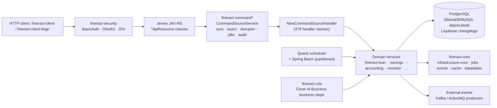

Apache Fineract is an Apache Software Foundation core banking platform aimed at microfinance and financial inclusion. It is a multi-module Gradle project on Java 21 / Spring Boot 3 that exposes a JAX-RS REST API (Jersey) over a multi-tenant relational data model. This wiki maps the source tree as it actually exists in [`apache/fineract`](https://github.com/apache/fineract), with one deep-dive page per subsystem and module so coding agents and engineers can navigate the codebase without grepping.

## What you are looking at

- **Repository**: [`apache/fineract`](https://github.com/apache/fineract) — Apache-2.0, Java + Gradle.
- **Entry point**: `fineract-provider/src/main/java/org/apache/fineract/ServerApplication.java`, which boots Spring via `FineractWebApplicationConfiguration` and `FineractLiquibaseOnlyApplicationConfiguration` (both under `fineract-provider/.../infrastructure/core/boot/`).
- **API surface**: 164 `*ApiResource` classes registered with Jersey across all `fineract-*` modules; configuration in `fineract-provider/.../infrastructure/core/jersey/`.
- **Persistence**: EclipseLink JPA with static weaving (`static-weaving.gradle`), Liquibase changesets under `fineract-provider/src/main/resources/db/changelog/{tenant,tenant-store}/`.
- **Build**: `settings.gradle` enumerates ~35 first-party modules and dynamically includes everything under `custom/<company>/<category>/<module>/`.

## Architecture at a glance

The HTTP request lifecycle is documented end-to-end on the [request lifecycle](/flows/http-request-lifecycle) and [command dispatch](/flows/command-dispatch-flow) pages.

## Repository map

Top-level Gradle modules, with one-line role and the wiki page that covers each. The full graph is on [Repository layout](/overview/repository-layout) and [Module graph](/overview/module-graph).

| Path | Role | Wiki |
| --- | --- | --- |
| `fineract-provider/` | Spring Boot application + most subsystems (infrastructure, portfolio, accounting, jobs) | [Bootstrap & Runtime](/runtime/server-application) |
| `fineract-core/` | Shared infrastructure: jobs, events, cache, datatables, codes, document mgmt primitives | [Core Platform](/core/overview) |
| `fineract-command/` and `fineract-command-*` | Command bus core, async, audit, disruptor, jdbc store, test fixtures | [Command Bus](/command/overview) |
| `fineract-security/` | Authentication filters, OAuth2 config, password & 2FA primitives | [Security](/security/overview) |
| `fineract-loan/` | Cumulative-interest loan aggregate, schedule, charges, repayment | [Loan Domain](/loan/overview) |
| `fineract-progressive-loan/` and `-embeddable-schedule-generator` | Progressive (declining-balance EMI) loan model | [Progressive Loan](/progressive-loan/overview) |
| `fineract-working-capital-loan/` | Working capital loan product, COB hooks | [Working Capital Loan](/working-capital-loan/overview) |
| `fineract-loan-origination/` | Loan originator domain (broker/branch attribution) | [Loan Origination](/loan-origination/overview) |
| `fineract-savings/` | Savings, fixed & recurring deposits, share accounts | [Savings & Deposits](/savings/overview) |
| `fineract-accounting/` | GL accounts, journal entries, accruals, financial activity mapping | [Accounting](/accounting/overview) |
| `fineract-cob/` | Close-of-Business framework + loan account locks | [Close of Business](/cob/overview) |
| `fineract-investor/` | External asset owner — sell/transfer loans to investors | [Investor](/investor/overview) |
| `fineract-charge/`, `fineract-tax/`, `fineract-rates/` | Charge, tax component/group, floating rate primitives | [Charges, Taxes & Rates](/charges/overview) |
| `fineract-branch/` | Tellers, cashiers, branch teller journal | [Organisation › Tellers](/organisation/tellers-and-cashiers) |
| `fineract-document/` | Document management API + pluggable content stores (FS, S3) | [Document & Content Store](/document/overview) |
| `fineract-report/`, `fineract-mix/` | Pentaho reports, MIX taxonomy reporting | [Reporting](/reporting/overview) |
| `fineract-validation/` | Custom Bean Validation constraints | [Validation Layer](/validation/overview) |
| `fineract-avro-schemas/` | Avro schemas for external business events | [Events](/events/external-events-and-producers) |
| `fineract-client/`, `fineract-client-feign/` | Generated OkHttp/Retrofit and Feign clients | [Client SDKs](/build/fineract-client-sdks) |
| `fineract-e2e-tests-core/`, `fineract-e2e-tests-runner/` | Cucumber/Gherkin end-to-end suite | [E2E tests](/build/e2e-cucumber-tests) |
| `integration-tests/`, `twofactor-tests/`, `oauth2-tests/` | JUnit integration suites | [Integration tests](/build/integration-tests) |
| `fineract-war/` | Traditional WAR packaging for external servlet containers | [Deployment](/overview/runtime-and-deployment) |
| `fineract-doc/` | Antora documentation modules | [Build](/build/overview) |
| `fineract-db/` | Legacy SQL bootstrap files and demo backups | [Database](/database/overview) |
| `custom/` | Dynamically discovered third-party / vendor modules | [Custom Modules](/custom/overview) |
| `docker/`, `docker-compose-*.yml`, `kubernetes/` | Deployment manifests for Postgres / MariaDB / Kafka / ActiveMQ | [Build & Deploy](/build/docker-images-and-compose) |

## Subsystem map

<CardGroup cols={2}>
  <Card title="Bootstrap & Runtime" icon="rocket" href="/runtime/server-application">
    `ServerApplication`, Spring Boot configuration, Jersey wiring, EclipseLink static weaving, instance-mode flags and multi-tenant data source routing.
  </Card>
  <Card title="Core Platform" icon="cubes" href="/core/overview">
    Shared infrastructure under `fineract-core`: business date, codes, data tables, jobs, Spring Batch, cache, hooks, document primitives.
  </Card>
  <Card title="Command Bus" icon="bus" href="/command/overview">
    `fineract-command*` modules: command core, sync/async/disruptor dispatch, audit, JDBC store, maker-checker.
  </Card>
  <Card title="Security" icon="lock" href="/security/overview">
    `fineract-security`: BasicAuth, OAuth2, two-factor, filters, users/roles/permissions, password preferences.
  </Card>
  <Card title="Organisation" icon="building" href="/organisation/overview">
    Offices, staff, holidays, working days, monetary/currency, provisioning, tellers and cashiers.
  </Card>
  <Card title="Client & Group Portfolio" icon="users" href="/portfolio/clients">
    Clients, groups, centers, meetings/calendars, notes, search, transfers, funds, collection sheet, collateral.
  </Card>
  <Card title="Loan Domain" icon="hand-holding-dollar" href="/loan/overview">
    `fineract-loan`: cumulative `Loan` aggregate, products, schedules, charges, guarantors, rescheduling, delinquency, jobs.
  </Card>
  <Card title="Progressive Loan" icon="chart-line" href="/progressive-loan/overview">
    EMI / declining-balance model with embeddable schedule generator and dedicated delinquency service.
  </Card>
  <Card title="Working Capital Loan" icon="briefcase" href="/working-capital-loan/overview">
    Revolving working-capital product, calc engine, API handlers and COB business steps.
  </Card>
  <Card title="Loan Origination" icon="signature" href="/loan-origination/overview">
    Originator domain, API resources, enrichers, mappers and serialization for loan source attribution.
  </Card>
  <Card title="Savings & Deposits" icon="piggy-bank" href="/savings/overview">
    `fineract-savings`: savings accounts/products, fixed and recurring deposits, share accounts, interest posting.
  </Card>
  <Card title="Accounting" icon="book" href="/accounting/overview">
    `fineract-accounting`: GL accounts, journal entries, accrual engine, product mapping, provisioning, trial balance.
  </Card>
  <Card title="Charges, Taxes & Rates" icon="percent" href="/charges/overview">
    `fineract-charge`, `fineract-tax`, `fineract-rates` primitives used across loans and savings.
  </Card>
  <Card title="Investor" icon="users-between-lines" href="/investor/overview">
    External asset owner module: transfer loans to investors with accounting and COB hooks.
  </Card>
  <Card title="Close of Business" icon="moon" href="/cob/overview">
    `fineract-cob`: business-step framework, loan account locking, catch-up APIs, Spring Batch wiring.
  </Card>
  <Card title="Batch API" icon="layer-group" href="/batch/overview">
    HTTP `/batches` API for client-side request batching, dispatched via internal command handlers.
  </Card>
  <Card title="Background Jobs" icon="clock" href="/jobs/overview">
    Quartz scheduler, `JobName` enum, Spring Batch partitioned jobs, inline execution, stuck-job handling.
  </Card>
  <Card title="Events & Hooks" icon="bell" href="/events/overview">
    Business events, external event producers (Kafka/ActiveMQ), `fineract-avro-schemas`, hooks, notifications.
  </Card>
  <Card title="Document & Content Store" icon="file" href="/document/overview">
    Pluggable file storage: filesystem and S3 content stores, MIME/virus detectors, policies, processors.
  </Card>
  <Card title="Reporting" icon="chart-pie" href="/reporting/overview">
    Pentaho-backed `/reports` and `/runreports`, report mailing job, MIX taxonomy, ad-hoc query.
  </Card>
  <Card title="Campaigns (SMS & Email)" icon="envelope" href="/campaigns/overview">
    Outbound SMS and email campaigns with scheduler, helpers and gateway integration.
  </Card>
  <Card title="Credit Bureau & External" icon="id-card" href="/creditbureau/overview">
    Credit bureau configuration/integration and other external service configuration.
  </Card>
  <Card title="Surveys & SPM" icon="square-poll-vertical" href="/spm/overview">
    Social Performance Management scorecards, poverty line, likelihood, lookup tables.
  </Card>
  <Card title="Templates & Bulk Import" icon="file-import" href="/templates/overview">
    Mustache-based template engine and Excel bulk import (populators + handlers).
  </Card>
  <Card title="Interoperation" icon="arrows-left-right" href="/interop/overview">
    Mojaloop-aligned `InteropApiResource` and supporting domain.
  </Card>
  <Card title="Validation Layer" icon="check" href="/validation/overview">
    `fineract-validation`: custom Bean Validation constraints used across modules.
  </Card>
  <Card title="Data Models" icon="database" href="/models/overview">
    Entity catalogue: clients, loans, savings, accounting, organisation, COB locks, audit/event tables.
  </Card>
  <Card title="Database & Migrations" icon="server" href="/database/overview">
    Liquibase tenant vs tenant-store changelogs, legacy SQL, multi-tenant demo backups.
  </Card>
  <Card title="Configuration & Env" icon="sliders" href="/configuration/overview">
    `application.properties`, env vars, global configuration flags, Resilience4j retry, feature toggles.
  </Card>
  <Card title="API Reference" icon="code" href="/api/overview">
    Endpoint catalogue grouped by resource, with the originating `*ApiResource` class and command name.
  </Card>
  <Card title="Key Flows" icon="route" href="/flows/overview">
    End-to-end traces: HTTP lifecycle, command dispatch, loan application, COB, maker-checker, tenant resolution.
  </Card>
  <Card title="Build, Test & Deploy" icon="hammer" href="/build/overview">
    Gradle modules, static weaving, Docker/Compose, Kubernetes manifests, integration and Cucumber tests, client SDKs.
  </Card>
  <Card title="Custom Modules" icon="puzzle-piece" href="/custom/overview">
    The `custom/` discovery mechanism in `settings.gradle` and its dedicated Docker image.
  </Card>
</CardGroup>

## Where to start

<Tip>
If you are new to the codebase, read [Architecture](/overview/architecture) and [Repository layout](/overview/repository-layout) first, then jump to the subsystem you need to modify. Every subsystem overview page lists the exact files and packages it owns.
</Tip>

Key entry points to open in your editor:

| Concern | File |
| --- | --- |
| `main(String[])` | `fineract-provider/src/main/java/org/apache/fineract/ServerApplication.java` |
| Spring web configuration | `fineract-provider/src/main/java/org/apache/fineract/infrastructure/core/boot/FineractWebApplicationConfiguration.java` |
| Liquibase-only mode | `fineract-provider/src/main/java/org/apache/fineract/infrastructure/core/boot/FineractLiquibaseOnlyApplicationConfiguration.java` |
| Default application config | `fineract-provider/src/main/resources/application.properties` |
| Liquibase master changelog | `fineract-provider/src/main/resources/db/changelog/db.changelog-master.xml` |
| Gradle module list | `settings.gradle` |
| Background job catalogue | `fineract-core/src/main/java/org/apache/fineract/infrastructure/jobs/service/JobName.java` |
| API resource directory | `fineract-provider/src/main/java/org/apache/fineract/**/api/*ApiResource.java` and same path in every `fineract-*` module |
| Command core | `fineract-command/src/main/java/org/apache/fineract/command/core/` |
