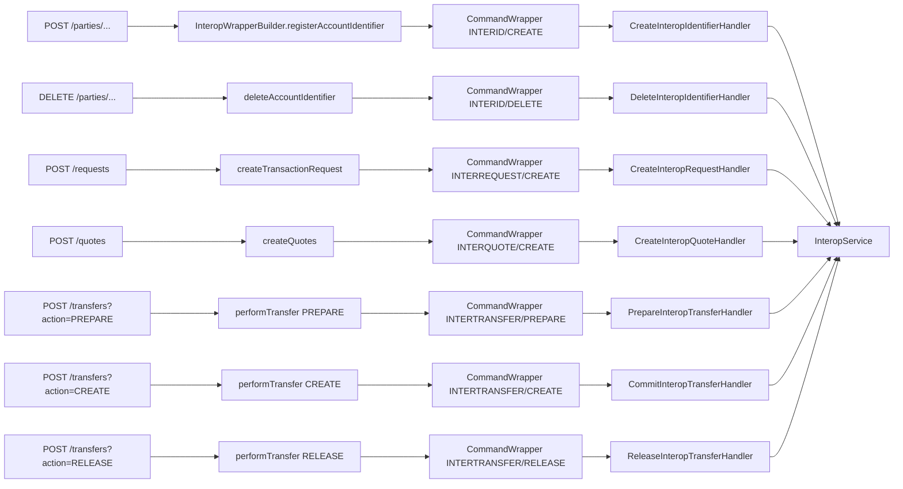

`InteropApiResource` is the JAX-RS surface Apache Fineract exposes for OAFI / Mojaloop integrations. It sits at `/v1/interoperation` and implements the eight resource families the Mojaloop spec demands: account-info, identifiers (parties), transaction-requests, quotes, transfers, KYC, and loan side-channels. This page enumerates every endpoint defined in `fineract-provider/src/main/java/org/apache/fineract/interoperation/api/InteropApiResource.java` and shows how each maps onto the command handlers and the central `InteropService`.

## Resource declaration

```java
@Path("/v1/interoperation")
@Component
@Tag(name = "Inter Operation", description = "")
@RequiredArgsConstructor
public class InteropApiResource {

    private final PlatformSecurityContext context;
    private final ApiRequestParameterHelper apiRequestParameterHelper;
    private final DefaultToApiJsonSerializer<CommandProcessingResult> jsonSerializer;
    private final InteropService interopService;
    private final PortfolioCommandSourceWritePlatformService commandsSourceService;
    // ...
}
```

Read-only endpoints call `interopService` directly. Mutating endpoints build a `CommandWrapper` with `InteropWrapperBuilder` and run it through `PortfolioCommandSourceWritePlatformService.logCommandSource(...)` — that detour gives every interop call the same audit row, idempotency, and retry semantics as a regular portfolio operation.

## Endpoint reference

### Health and account read

| Method | Path                                                                                                                  | Service call                                  |
| ------ | --------------------------------------------------------------------------------------------------------------------- | --------------------------------------------- |
| `GET`  | `/v1/interoperation/health`                                                                                           | Returns `OK` — basic liveness probe.          |
| `GET`  | `/v1/interoperation/accounts/{accountId}`                                                                             | `interopService.getAccountDetails(accountId)` |
| `GET`  | `/v1/interoperation/accounts/{accountId}/transactions?debit&credit&fromBookingDateTime&toBookingDateTime`             | `interopService.getAccountTransactions(...)`  |
| `GET`  | `/v1/interoperation/accounts/{accountId}/identifiers`                                                                 | `interopService.getAccountIdentifiers(...)`   |
| `GET`  | `/v1/interoperation/accounts/{accountId}/kyc`                                                                         | `interopService.getKyc(accountId)`            |

The accountId is the Fineract savings-account external id or numeric id — the interop service resolves both forms.

The transaction listing endpoint accepts a `debit`/`credit` filter plus an ISO-8601 booking date window:

```java
public String getAccountTransactions(@PathParam("accountId") String accountId,
        @DefaultValue("true") @QueryParam("debit") boolean debit,
        @DefaultValue("false") @QueryParam("credit") boolean credit,
        @QueryParam("fromBookingDateTime") String fromBookingDateTime,
        @QueryParam("toBookingDateTime") String toBookingDateTime,
        @Context UriInfo uriInfo) {
    LocalDateTime transactionsFrom = fromBookingDateTime == null ? null
            : LocalDateTime.parse(fromBookingDateTime, DateTimeFormatter.ISO_LOCAL_DATE_TIME);
    LocalDateTime transactionsTo = toBookingDateTime == null ? null
            : LocalDateTime.parse(toBookingDateTime, DateTimeFormatter.ISO_LOCAL_DATE_TIME);

    InteropTransactionsData result = interopService.getAccountTransactions(accountId, debit, credit, transactionsFrom, transactionsTo);
    // ... serialize
}
```

### Parties (identifier registration)

The party lookup family is the OAFI `parties` resource — looking up an account by MSISDN / EMAIL / IBAN / etc.

| Method   | Path                                                                  | Wrapper / service                                                |
| -------- | --------------------------------------------------------------------- | ---------------------------------------------------------------- |
| `GET`    | `/v1/interoperation/parties/{idType}/{idValue}`                       | `interopService.getAccountByIdentifier(idType, idValue, null)`   |
| `GET`    | `/v1/interoperation/parties/{idType}/{idValue}/{subIdOrType}`         | `interopService.getAccountByIdentifier(idType, idValue, subIdOrType)` |
| `POST`   | `/v1/interoperation/parties/{idType}/{idValue}`                       | `InteropWrapperBuilder.registerAccountIdentifier(...)` → `CreateInteropIdentifierHandler` |
| `POST`   | `/v1/interoperation/parties/{idType}/{idValue}/{subIdOrType}`         | Same as above with sub-id                                        |
| `DELETE` | `/v1/interoperation/parties/{idType}/{idValue}`                       | `InteropWrapperBuilder.deleteAccountIdentifier(...)` → `DeleteInteropIdentifierHandler` |
| `DELETE` | `/v1/interoperation/parties/{idType}/{idValue}/{subIdOrType}`         | Same as above with sub-id                                        |

The `{idType}` path param is bound directly to `InteropIdentifierType`, so JAX-RS rejects unknown identifier kinds before they reach the service:

```java
@GET
@Path("parties/{idType}/{idValue}")
public String getAccountByIdentifier(@PathParam("idType") InteropIdentifierType idType,
        @PathParam("idValue") String idValue, @Context UriInfo uriInfo) {
    InteropIdentifierAccountResponseData result = interopService.getAccountByIdentifier(idType, idValue, null);
    // ...
}
```

POST and DELETE go through the command source:

```java
@POST
@Path("parties/{idType}/{idValue}")
public String registerAccountIdentifier(@PathParam("idType") InteropIdentifierType idType,
        @PathParam("idValue") String idValue, @Parameter(hidden = true) String identifierJson,
        @Context UriInfo uriInfo) {
    CommandWrapper commandRequest = new InteropWrapperBuilder().registerAccountIdentifier(idType, idValue, null)
            .withJson(identifierJson).build();

    InteropIdentifierAccountResponseData result = (InteropIdentifierAccountResponseData) commandsSourceService
            .logCommandSource(commandRequest);
    // ...
}
```

`InteropWrapperBuilder` itself stamps the command pair and the `href`:

```java
public InteropWrapperBuilder registerAccountIdentifier(InteropIdentifierType idType, String idValue, String subIdOrType) {
    this.actionName = "CREATE";
    this.entityName = ENTITY_NAME_IDENTIFIER;
    this.href = "/" + ROOT_PATH + "/parties/" + idType + "/" + idValue + "/" + (subIdOrType == null ? " " : subIdOrType);
    return this;
}
```

That `href` is what feeds into the `m_portfolio_command_source` audit row — replaying it later goes back through `InteropApiResource`.

### Transaction requests

A *transaction request* in OAFI vocabulary is the "request to pay" that one DFSP sends another. Fineract stores them so a payer-side party can be queried for outstanding requests.

| Method | Path                                                                  | Wrapper / service                                          |
| ------ | --------------------------------------------------------------------- | ---------------------------------------------------------- |
| `GET`  | `/v1/interoperation/transactions/{transactionCode}/requests/{requestCode}` | `interopService.getTransactionRequest(...)`            |
| `POST` | `/v1/interoperation/requests`                                          | `InteropWrapperBuilder.createTransactionRequest()` → `CreateInteropRequestHandler` |

The GET endpoint requires the caller to have the `INTERREQUEST` read permission:

```java
@GET
@Path("transactions/{transactionCode}/requests/{requestCode}")
public String getTransactionRequest(@PathParam("transactionCode") String transactionCode,
        @PathParam("requestCode") String requestCode, @Context UriInfo uriInfo) {
    context.authenticatedUser().validateHasReadPermission(ENTITY_NAME_REQUEST);

    InteropTransactionRequestResponseData result = interopService.getTransactionRequest(transactionCode, requestCode);
    // ...
}
```

The POST takes the raw JSON body — it is passed straight through to the command source so the underlying `InteropDataValidator` can do strongly-typed parsing.

### Quotes

A quote is the per-leg fee calculation the Mojaloop payer DFSP requests from the payee before committing to a transfer.

| Method | Path                                                                                  | Wrapper / service                              |
| ------ | ------------------------------------------------------------------------------------- | ---------------------------------------------- |
| `GET`  | `/v1/interoperation/transactions/{transactionCode}/quotes/{quoteCode}`                | `interopService.getQuote(...)` (requires `INTERQUOTE` read perm) |
| `POST` | `/v1/interoperation/quotes`                                                            | `InteropWrapperBuilder.createQuotes()` → `CreateInteropQuoteHandler` |

The POST endpoint maps onto `(INTERQUOTE, CREATE)`:

```java
@POST
@Path("quotes")
public String createQuote(@Parameter(hidden = true) String quotesJson, @Context UriInfo uriInfo) {
    CommandWrapper commandRequest = new InteropWrapperBuilder().createQuotes().withJson(quotesJson).build();

    InteropQuoteResponseData result = (InteropQuoteResponseData) commandsSourceService.logCommandSource(commandRequest);
    // ...
}
```

`InteropServiceImpl.createQuote(...)` consults the savings product's charge table and any per-account fees to compute `fspFee` and `fspCommission`, signs the response, and returns the resulting `InteropQuoteResponseData`.

### Transfers — prepare, commit, release

The transfer family is the heart of the module. A single REST path — `/v1/interoperation/transfers` — carries all three actions, discriminated by the `action` query string:

| Method | Path                                                                  | `action` values                                  |
| ------ | --------------------------------------------------------------------- | ------------------------------------------------ |
| `GET`  | `/v1/interoperation/transactions/{transactionCode}/transfers/{transferCode}` | n/a (read)                                |
| `POST` | `/v1/interoperation/transfers?action=PREPARE`                          | Reserves funds → `PrepareInteropTransferHandler` |
| `POST` | `/v1/interoperation/transfers?action=CREATE`                           | Commits the debit/credit → `CommitInteropTransferHandler` |
| `POST` | `/v1/interoperation/transfers?action=RELEASE`                          | Releases a previously-prepared hold → `ReleaseInteropTransferHandler` |

The router validates the `action` query parameter before dispatch:

```java
@POST
@Path("transfers")
public String performTransfer(@QueryParam("action") String action,
        @Parameter(hidden = true) String quotesJson, @Context UriInfo uriInfo) {

    final List<ApiParameterError> dataValidationErrors = new ArrayList<>();
    final DataValidatorBuilder baseDataValidator = new DataValidatorBuilder(dataValidationErrors).resource("InteropApi");

    baseDataValidator.reset().parameter("action").value(action).notNull().isOneOfEnumValues(InteropTransferActionType.class);

    if (!dataValidationErrors.isEmpty()) {
        throw new PlatformApiDataValidationException("validation.msg.validation.errors.exist", "Validation errors exist.",
                dataValidationErrors);
    }

    CommandWrapper commandRequest = new InteropWrapperBuilder().performTransfer(InteropTransferActionType.valueOf(action))
            .withJson(quotesJson).build();

    InteropTransferResponseData result = (InteropTransferResponseData) commandsSourceService.logCommandSource(commandRequest);
    // ...
}
```

`performTransfer(...)` builds the wrapper with the matching action constant:

```java
public InteropWrapperBuilder performTransfer(InteropTransferActionType action) {
    this.actionName = action.name();
    this.entityName = ENTITY_NAME_TRANSFER;
    this.href = "/" + ROOT_PATH + "/transfers";
    return this;
}
```

…and the platform routes to one of three handlers based on the `@CommandType` annotation each handler carries.

### Refunds

`InteropRefundData` is the DTO used to pass a previously-completed transfer back. The refund path in the REST surface is folded into the `/transfers` family — a refund is modelled as a new transfer in the opposite direction whose `refundInfo` envelope references the original transaction code. The `PARAM_REFUND_INFO` constant in `InteropUtil` is the wire key.

### KYC

`GET /v1/interoperation/accounts/{accountId}/kyc` returns `InteropKycResponseData`, which is built by the service from the linked client's KYC documents (`IdDocument`), personal name (`SubjectName`), and `PostalAddress`. The data classes are in `interoperation/data/`:

- `IdDocument.java` — government ID type, number, issuing country, expiry.
- `SubjectName.java` — first / middle / last name plus title.
- `PostalAddress.java` — street, city, state, country, postal code.

### Loan side-channels

The Mojaloop loan flow is implemented through two convenience endpoints that bypass the quote / transfer dance:

| Method | Path                                                                  | Service                                                     |
| ------ | --------------------------------------------------------------------- | ----------------------------------------------------------- |
| `POST` | `/v1/interoperation/transactions/{accountId}/disburse`                | `interopService.disburseLoan(accountId, apiRequestBodyAsJson)` |
| `POST` | `/v1/interoperation/transactions/{accountId}/loanrepayment`           | `interopService.loanRepayment(accountId, apiRequestBodyAsJson)` |

These delegate straight into the standard portfolio loan write-platform service. The `accountId` here is the loan account, not a savings account.

## Command pair matrix



## Spec compliance notes

<Note>
Fineract maps onto the Mojaloop / OAFI shape but does **not** terminate the Mojaloop wire protocol directly. The expected deployment is:

```text
[Mojaloop Switch]  ⇄  [DFSP Mojaloop Connector (mojaloop-payment-manager)]  ⇄  [Fineract /v1/interoperation]
```

The Mojaloop Connector handles JWS signing, ILP packets, MTLS, and the FSPIOP envelope. Fineract receives plain JSON requests on its REST surface; the Connector translates between the two.
</Note>

The fields Fineract emits in its responses match the OAFI spec one-to-one — `transactionCode`, `quoteCode`, `transferCode`, `transactionRole`, `transactionType.scenario`, `transactionType.initiator`, `transactionType.initiatorType`, `amount.amount`, `amount.currency`, `fspFee`, `fspCommission`, `geoCode.latitude`, `geoCode.longitude`, `extensionList[i].key`, `extensionList[i].value`. All of these are defined as constants in `InteropUtil`.

## Per-endpoint payload mapping

For mutating endpoints, the raw request body is shoved into the `CommandWrapper`'s `json` field unchanged; parsing happens inside the matching handler via `InteropDataValidator`. The expected JSON shape is anchored by the OpenAPI annotations on each method — e.g. `POST /quotes` declares:

```java
@RequestBody(required = true, content = @Content(schema = @Schema(implementation = InteropQuoteRequestData.class)))
@ApiResponse(responseCode = "200", description = "OK", content = @Content(schema = @Schema(implementation = InteropQuoteResponseData.class)))
```

So the Swagger contract is exactly `InteropQuoteRequestData → InteropQuoteResponseData`. The same `@Schema` pattern is applied to every mutating endpoint, which makes the generated OpenAPI spec a complete reference for body shapes.

## Authentication and permissions

The resource uses the standard Fineract `PlatformSecurityContext` — every authenticated user has an identity row in `m_appuser`. A handful of read endpoints explicitly check for entity-level read permissions before delegating:

```java
context.authenticatedUser().validateHasReadPermission(ENTITY_NAME_REQUEST);
context.authenticatedUser().validateHasReadPermission(ENTITY_NAME_QUOTE);
```

The entity name strings are the same `ENTITY_NAME_REQUEST` / `ENTITY_NAME_QUOTE` constants used by the command handlers. The permission rows in `m_permission` follow the regular `READ_INTERREQUEST` / `READ_INTERQUOTE` naming.

## Tips for integrators

<Tip>
Use the same `transactionCode` across the entire payment lifecycle. Fineract uses it as the primary correlation key — both for retrieving quotes (`/transactions/{transactionCode}/quotes/{quoteCode}`) and for the prepare → commit → release transfer chain. The Mojaloop Connector typically generates this UUID once when the payer DFSP first sees the payment and propagates it everywhere.
</Tip>

<Tip>
Set `action=RELEASE` on the transfer endpoint when the switch reports the other leg failed. This rolls back the savings hold left by the earlier `PREPARE` call — without it, the held amount stays out of the account's available balance until manual intervention.
</Tip>

## See also

<CardGroup cols={1}>
  <Card title="Interop overview" href="/interop/overview">
    Module map, identifier types, the three-phase transfer model, and how it integrates with the rest of Fineract.
  </Card>
</CardGroup>
