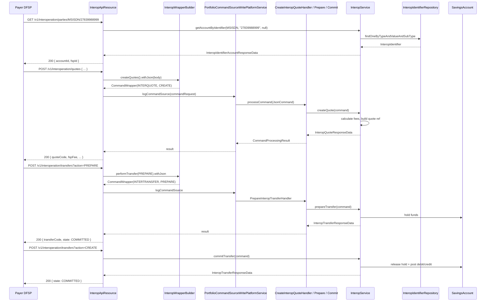

Apache Fineract ships a dedicated **interoperation** module that exposes the platform as an Open API for Financial Inclusion (OAFI) participant — the same shape consumed by the Mojaloop Switch. A Digital Financial Service Provider (DFSP) integrator can register account aliases (MSISDN, e-mail, IBAN, …), look up a remote party, request a quote, and execute a transfer in three phases: prepare, commit, and (if rolled back) release. Every operation maps cleanly onto a savings account inside Fineract — the underlying movement is just a savings-to-savings transfer, except every step is auditable, idempotent, and reversible.

The code lives under `fineract-provider/src/main/java/org/apache/fineract/interoperation/` with the JPA entities split into `fineract-savings` and the identifier-type enum in `fineract-core`.

## Package layout

```text
fineract-provider/src/main/java/org/apache/fineract/interoperation/
├── api/
│   ├── InteropApiResource.java            ← JAX-RS endpoints at /v1/interoperation
│   └── InteropWrapperBuilder.java         ← CommandWrapper factory for mutating ops
├── data/                                  ← request/response DTOs (one per resource)
│   ├── InteropAccountData.java
│   ├── InteropIdentifierAccountResponseData.java
│   ├── InteropIdentifierRequestData.java
│   ├── InteropIdentifiersResponseData.java
│   ├── InteropKycData.java / KycResponseData
│   ├── InteropQuoteRequestData.java / QuoteResponseData
│   ├── InteropRequestData.java / ResponseData
│   ├── InteropTransactionData.java / sData
│   ├── InteropTransactionRequestData.java / RequestResponseData
│   ├── InteropTransactionTypeData.java
│   ├── InteropTransferRequestData.java / ResponseData
│   ├── InteropRefundData.java
│   ├── MoneyData.java                     ← amount + currency pair
│   ├── ExtensionData.java                 ← Mojaloop extension key/value list
│   ├── GeoCodeData.java                   ← latitude / longitude
│   ├── IdDocument.java / SubjectName.java / PostalAddress.java  ← KYC payloads
├── domain/
│   └── InteropIdentifierRepository.java   ← JpaRepository<InteropIdentifier>
├── exception/                             ← interop-specific platform exceptions
├── handler/                               ← command handlers (entity-action pairs)
│   ├── CreateInteropIdentifierHandler.java
│   ├── DeleteInteropIdentifierHandler.java
│   ├── CreateInteropRequestHandler.java
│   ├── CreateInteropQuoteHandler.java
│   ├── PrepareInteropTransferHandler.java
│   ├── CommitInteropTransferHandler.java
│   └── ReleaseInteropTransferHandler.java
├── serialization/
│   └── InteropDataValidator.java          ← JSON → typed request validation
├── service/
│   ├── InteropService.java
│   └── InteropServiceImpl.java
├── starter/                               ← @Configuration auto-wiring
└── util/
    └── InteropUtil.java                   ← constants: entity/action names, param keys, locale
```

The `InteropIdentifier` JPA entity and the `InteropTransferActionType` enum live in `fineract-savings/src/main/java/org/apache/fineract/interoperation/domain/`, and the shared `InteropIdentifierType` enum lives in `fineract-core/src/main/java/org/apache/fineract/interoperation/domain/`.

## Identifier types

OAFI / Mojaloop call account aliases **identifiers**. Fineract supports the full set, indexed in `InteropIdentifierType`:

```java
public enum InteropIdentifierType {

    MSISDN("interopIdentifierType.msisdn"),
    EMAIL("interopIdentifierType.email"),
    PERSONAL_ID("interopIdentifierType.personalId", "PERSONALID", "PERSONALID"),
    BUSINESS("interopIdentifierType.business"),
    DEVICE("interopIdentifierType.device"),
    ACCOUNT_ID("interopIdentifierType.accountId", "ACCOUNTID", "ACCOUNTID"),
    IBAN("interopIdentifierType.iban"),
    ALIAS("interopIdentifierType.alias"),
    BBAN("interopIdentifierType.bban");
}
```

The `alias` field on each value (`PERSONALID`, `ACCOUNTID`) provides the wire-spelling that Mojaloop uses in URLs while the Java enum name stays Java-idiomatic.

## The `InteropIdentifier` row

Each registration of an alias against a savings account writes one row to `interop_identifier`:

```java
@Entity
@Table(name = "interop_identifier", uniqueConstraints = {
        @UniqueConstraint(name = "uk_hathor_identifier_account", columnNames = { "account_id", "type" }),
        @UniqueConstraint(name = "uk_hathor_identifier_value", columnNames = { "type", "a_value", "sub_value_or_type" }) })
public class InteropIdentifier extends AbstractPersistableCustom<Long> {

    @ManyToOne(optional = false)
    @JoinColumn(name = "account_id", nullable = false)
    private SavingsAccount account;

    @Column(name = "type", nullable = false, length = 32)
    @Enumerated(EnumType.STRING)
    private InteropIdentifierType type;

    @Column(name = "a_value", nullable = false, length = 128)
    private String value;

    @Column(name = "sub_value_or_type", length = 128)
    private String subType;
    // audit columns ...
}
```

The composite unique key `(type, a_value, sub_value_or_type)` guarantees an identifier can only point at one account — exactly what the OAFI party-lookup contract requires.

## The three-phase transfer model

Mojaloop transfers are deliberately two-phase-commit-ish. Fineract encodes the same shape with three command actions and three command handlers, all sharing the `INTERTRANSFER` entity name:

```java
// fineract-savings/.../InteropTransferActionType.java
public enum InteropTransferActionType {

    PREPARE,   // ACTION_TRANSFER_PREPARE — reserve funds
    CREATE,    // ACTION_TRANSFER_COMMIT  — apply the debit + credit
    RELEASE;   // ACTION_TRANSFER_RELEASE — release the reservation
}
```

The constants on the wire are defined in `InteropUtil`:

```java
public static final String ACTION_TRANSFER_PREPARE = "PREPARE";
public static final String ACTION_TRANSFER_COMMIT  = "CREATE";
public static final String ACTION_TRANSFER_RELEASE = "RELEASE";
```

A successful transfer is `PREPARE` → `CREATE`. A rejected one is `PREPARE` → `RELEASE`. This is what makes Fineract usable on either side of the Mojaloop interface — the platform can hold a debit hold until the switch confirms the other leg has cleared.

## Entity / action constants

Every command handler matches on a fixed `(entity, action)` pair. The strings come from `InteropUtil`:

```java
public static final String ENTITY_NAME_IDENTIFIER = "INTERID";
public static final String ENTITY_NAME_REQUEST    = "INTERREQUEST";
public static final String ENTITY_NAME_QUOTE      = "INTERQUOTE";
public static final String ENTITY_NAME_TRANSFER   = "INTERTRANSFER";
```

The mapping between handler class and command pair:

| Handler class                               | Command entity     | Command action |
| ------------------------------------------- | ------------------ | -------------- |
| `CreateInteropIdentifierHandler`            | `INTERID`          | `CREATE`       |
| `DeleteInteropIdentifierHandler`            | `INTERID`          | `DELETE`       |
| `CreateInteropRequestHandler`               | `INTERREQUEST`     | `CREATE`       |
| `CreateInteropQuoteHandler`                 | `INTERQUOTE`       | `CREATE`       |
| `PrepareInteropTransferHandler`             | `INTERTRANSFER`    | `PREPARE`      |
| `CommitInteropTransferHandler`              | `INTERTRANSFER`    | `CREATE`       |
| `ReleaseInteropTransferHandler`             | `INTERTRANSFER`    | `RELEASE`      |

Each handler is annotated `@CommandType(entity = ..., action = ...)` so the platform `NewCommandSourceHandler` dispatcher routes incoming `CommandWrapper`s to the right Spring bean. The handler body is uniformly thin — it just delegates to `InteropService`:

```java
// fineract-provider/.../handler/CreateInteropQuoteHandler.java
@Service
@CommandType(entity = ENTITY_NAME_QUOTE, action = "CREATE")
public class CreateInteropQuoteHandler implements NewCommandSourceHandler {

    private final InteropService interopService;
    // ...

    @Transactional
    @Override
    public CommandProcessingResult processCommand(final JsonCommand command) {
        return this.interopService.createQuote(command);
    }
}
```

## The service contract

`InteropService` is the central façade with **one method per OAFI operation**. The full interface:

```java
InteropIdentifierAccountResponseData getAccountByIdentifier(InteropIdentifierType idType, String value, String subType);
InteropIdentifierAccountResponseData registerAccountIdentifier(InteropIdentifierType idType, String value, String subType, JsonCommand command);
InteropIdentifierAccountResponseData deleteAccountIdentifier(InteropIdentifierType idType, String value, String subType);
InteropIdentifiersResponseData getAccountIdentifiers(String accountId);
InteropAccountData getAccountDetails(String accountId);
InteropTransactionsData getAccountTransactions(String accountId, boolean debit, boolean credit, LocalDateTime from, LocalDateTime to);

InteropTransactionRequestResponseData getTransactionRequest(String transactionCode, String requestCode);
InteropTransactionRequestResponseData createTransactionRequest(JsonCommand command);

InteropQuoteResponseData getQuote(String transactionCode, String quoteCode);
InteropQuoteResponseData createQuote(JsonCommand command);

InteropTransferResponseData getTransfer(String transactionCode, String transferCode);
InteropTransferResponseData prepareTransfer(JsonCommand command);
InteropTransferResponseData commitTransfer(JsonCommand command);
InteropTransferResponseData releaseTransfer(JsonCommand command);

InteropKycResponseData getKyc(String accountId);

String disburseLoan(String accountId, String apiRequestBodyAsJson);
String loanRepayment(String accountId, String apiRequestBodyAsJson);
```

`InteropServiceImpl` carries the business logic: it resolves identifiers to savings accounts via `InteropIdentifierRepository.findOneByTypeAndValueAndSubType(...)`, validates request bodies with `InteropDataValidator`, calculates quote fees from the savings-product charge table, books the prepare-leg as a hold transaction, and finally posts the savings transaction on commit (or releases the hold on release). Disburse-loan and loan-repayment are convenience hooks for the Mojaloop loan-account workflow.

## End-to-end flow



## Common request payload conventions

Every mutating request carries the OAFI envelope fields. The constants defined in `InteropUtil` are used both at parsing time (`InteropDataValidator`) and at command-building time (`InteropWrapperBuilder`):

```java
public static final String PARAM_LOCALE = "locale";
public static final String PARAM_DATE_FORMAT = "dateFormat";
public static final String PARAM_TRANSACTION_CODE = "transactionCode";
public static final String PARAM_REQUEST_CODE = "requestCode";
public static final String PARAM_QUOTE_CODE = "quoteCode";
public static final String PARAM_TRANSFER_CODE = "transferCode";
public static final String PARAM_ACCOUNT_ID = "accountId";
public static final String PARAM_AMOUNT_TYPE = "amountType";
public static final String PARAM_AMOUNT = "amount";
public static final String PARAM_FEES = "fees";
public static final String PARAM_FSP_FEE = "fspFee";
public static final String PARAM_FSP_COMMISSION = "fspCommission";
public static final String PARAM_TRANSACTION_TYPE = "transactionType";
public static final String PARAM_TRANSACTION_ROLE = "transactionRole";
public static final String PARAM_NOTE = "note";
public static final String PARAM_GEO_CODE = "geoCode";
public static final String PARAM_CURRENCY = "currency";
public static final String PARAM_SCENARIO = "scenario";
public static final String PARAM_SUB_SCENARIO = "subScenario";
public static final String PARAM_INITIATOR = "initiator";
public static final String PARAM_INITIATOR_TYPE = "initiatorType";
public static final String PARAM_REFUND_INFO = "refundInfo";
public static final String PARAM_BALANCE_OF_PAYMENTS = "balanceOfPayments";
public static final String PARAM_EXPIRATION = "expiration";
public static final String PARAM_EXTENSION_LIST = "extensionList";
```

The default locale for ISO 8601 dates is also fixed:

```java
public static final String ISO8601_DATE_TIME_FORMAT = "yyyy-MM-dd'T'HH:mm:ss.SSS[-HH:MM]";
public static final String ISO8601_DATE_FORMAT = "yyyy-MM-dd";
public static final Locale DEFAULT_LOCALE = Locale.US;
```

## Routing

The route prefix is also a constant — `ROOT_PATH = "interoperation"` — which `InteropWrapperBuilder` uses when stamping the `href` on outgoing command wrappers. The `DEFAULT_ROUTING_CODE = "INTEROPERATION"` value identifies the FSP itself in OAFI payloads (and is what foreign DFSPs see as the `payeeFspId` / `payerFspId`).

## KYC and loan integration

Two adjacent capabilities round out the module:

<CardGroup cols={2}>
  <Card title="KYC retrieval" icon="id-card">
    `GET /v1/interoperation/accounts/{accountId}/kyc` returns an `InteropKycResponseData` assembled from the linked client's identification documents (`IdDocument`), legal name (`SubjectName`), and `PostalAddress`. Useful for the Mojaloop `/parties/{type}/{id}/info` enrichment.
  </Card>
  <Card title="Loan operations" icon="hand-holding-dollar">
    `POST /v1/interoperation/transactions/{accountId}/disburse` and `.../loanrepayment` are convenience hooks for Mojaloop-driven loan disbursement and repayment. They wrap the standard portfolio loan APIs with the same account-id resolution as the savings flow.
  </Card>
</CardGroup>

## What the service does *not* do

<Note>
The interoperation module is the **server side** of the OAFI interface — i.e. it tells external switches and DFSPs how to interact with Fineract. It does *not* implement an outbound Mojaloop client; integrators are expected to drive Fineract from a Mojaloop Connector (e.g. mojaloop-payment-manager) that handles the Public Key infrastructure, JWS, and signing required by the Mojaloop Switch itself.
</Note>

## Data DTOs at a glance

A few of the data classes you'll see in every payload:

- `MoneyData` — `{ amount, currency }` pair, the canonical unit of money in the module.
- `ExtensionData` — `{ key, value }` row inside an `extensionList`; survives unchanged round-trip so a switch can attach metadata.
- `GeoCodeData` — `{ latitude, longitude }`; both as decimal strings, useful for fraud heuristics.
- `IdDocument`, `SubjectName`, `PostalAddress` — KYC structures for natural persons.
- `InteropRequestData` / `InteropResponseData` — base records carrying the OAFI envelope (transactionCode, requestCode, expiration, …).

## Next up

<CardGroup cols={1}>
  <Card title="The interop API resource" href="/interop/interop-api-resource">
    Full endpoint reference for `InteropApiResource` — parties, quotes, transfers, transactions, KYC. Includes the command-flow diagram and per-endpoint expectations.
  </Card>
</CardGroup>
