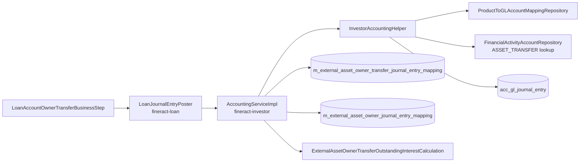

When the COB step flips a transfer to `ACTIVE` (or `BUYBACK`) on its settlement date, the investor module emits a balanced batch of journal entries against the general ledger that takes the loan's receivable components *off* the bank's loan-portfolio / receivable accounts and *onto* a single asset-transfer clearing account. This is the only ledger movement triggered by the module; loan repayments continue to post through the existing loan-engine GL path.

This page traces that batch end-to-end: which accounts get hit, which side (debit / credit), how each line is attributed to the investor or the previous owner, and how the buyback reversal works.

## Two-layer implementation

The accounting layer in `fineract-investor` is split:

- **`AccountingServiceImpl`** under `service/` — composes the per-transfer batch. Knows which receivable accounts to hit based on the loan's outstanding components (`principal`, `interest`, `fees`, `penalties`, `overpaid`) and the loan's charge-off state. Calls into the helper to post individual lines, then writes the mapping rows that attribute each line to a transfer and (where applicable) an owner.
- **`InvestorAccountingHelper`** under `accounting/journalentry/service/` — a low-level facade over Fineract's existing journal-entry infrastructure: looks up GL accounts by product-to-account mapping, creates `JournalEntry` rows in `acc_gl_journal_entry`, checks for branch closure conflicts.



`LoanJournalEntryPoster.postJournalEntriesForExternalOwnerTransfer(loan, transfer, previousOwner)` is the entry point the COB step actually calls; the interface lives in `fineract-loan` (so the COB step can depend on it without taking a hard dependency on `fineract-investor`), and dispatches to `AccountingService` (the investor-module interface) based on the transfer's status — `ACTIVE` or `ACTIVE_INTERMEDIATE` → `createJournalEntriesForSaleAssetTransfer`; `BUYBACK` or `BUYBACK_INTERMEDIATE` → `createJournalEntriesForBuybackAssetTransfer`.

## The accounts involved

Five accrual-basis loan accounts can appear in a transfer batch, plus the asset-transfer clearing account:

| Source of amount | GL account family (`AccrualAccountsForLoan` enum) | Notes |
| --- | --- | --- |
| Principal outstanding | `LOAN_PORTFOLIO` (or charge-off variants) | Charge-off path branches: if `loan.isChargedOff()`, the per-reason charge-off mapping is consulted; absent that, `CHARGE_OFF_FRAUD_EXPENSE` for fraud, `CHARGE_OFF_EXPENSE` otherwise. |
| Interest outstanding | `INTEREST_RECEIVABLE` (or `INCOME_FROM_CHARGE_OFF_INTEREST` when charged off) | The amount itself comes from the strategy `ExternalAssetOwnerTransferOutstandingInterestCalculation.calculateOutstandingInterest(loan)` — products can pick a different interest definition. |
| Fee charges outstanding | `FEES_RECEIVABLE` (or `INCOME_FROM_CHARGE_OFF_FEES` when charged off) | |
| Penalty charges outstanding | `PENALTIES_RECEIVABLE` (or `INCOME_FROM_CHARGE_OFF_PENALTY` when charged off) | |
| Overpaid | `OVERPAYMENT` | Only included if `loan.getTotalOverpaid() > 0`. Drives the OVERPAID-status branch of owner attribution. |
| Clearing leg | `FinancialActivity.ASSET_TRANSFER` (value `100`, account type ASSET) | A single line for the *total* of the other components. |

The financial-activity account `ASSET_TRANSFER` is the bank's *organisation-wide* clearing account for asset movements; it's looked up through `FinancialActivityAccountRepositoryWrapper.findByFinancialActivityTypeWithNotFoundDetection(100)`, not per loan product. Per `fineract-core/.../AccountingConstants.java`:

```java
public enum FinancialActivity {
    ASSET_TRANSFER(100, "assetTransfer", GLAccountType.ASSET), //
    LIABILITY_TRANSFER(200, "liabilityTransfer", GLAccountType.LIABILITY), //
    // …
}
```

Operations teams pre-configure which physical GL account sits behind `ASSET_TRANSFER` through the standard financial-activity-account UI.

## The sale batch

`createJournalEntriesForSaleAssetTransfer` runs roughly:

```java
@Override
public void createJournalEntriesForSaleAssetTransfer(Loan loan, ExternalAssetOwnerTransfer transfer,
                                                     ExternalAssetOwner previousOwner) {
    ExternalAssetOwner newOwner = transfer.getOwner();
    List<JournalEntry> journalEntryList = createJournalEntries(loan, transfer, /* isReversalOrder */ true);
    createMappingToTransfer(transfer, journalEntryList);

    FinancialActivityAccount faAccount = financialActivityAccountRepository
        .findByFinancialActivityTypeWithNotFoundDetection(AccountingConstants.FinancialActivity.ASSET_TRANSFER.getValue());

    journalEntryList.forEach(journalEntry -> {
        if (isOwnedByFinancialActivityAccount(journalEntry, faAccount)) {
            createMappingToOwner(null, journalEntry);  // clearing line — no owner attribution
            return;
        }
        ExternalAssetOwner owner = determineOwnerForSale(journalEntry, loan, previousOwner, newOwner);
        createMappingToOwner(owner, journalEntry);
    });
}
```

Then `createJournalEntries(loan, transfer, isReversalOrder=true)` builds the lines, in two halves:

```java
List<JournalEntry> list = createJournalEntries(loan, txId, txDate, principal, interest, fees, penalties, overpaid, !isReversalOrder);
list.addAll(createJournalEntries(loan, txId, txDate, principal, interest, fees, penalties, overpaid, isReversalOrder));
```

The same amounts are posted twice: once in normal order (`isReversalOrder = false` → credits on receivables, debit on clearing) and once reversed (`isReversalOrder = true` → debits on receivables, credit on clearing). The two halves leave the bank's books *with* the receivables (the second half) but post matching credits and debits against the clearing account. The clearing account nets to zero across the two halves; the *receivable accounts* net to zero too, which is the point — the receivables come off the bank's portfolio account *and* simultaneously appear on the bank's records again, but tagged to the new owner via the per-line owner mapping. The two halves together form a complete ownership-transfer journal with attribution to both parties.

The single-half builder is in `createJournalEntries(loan, txId, txDate, …, isReversalOrder)`:

```java
private List<JournalEntry> createJournalEntries(Loan loan, Long txId, LocalDate txDate,
                                                BigDecimal principal, BigDecimal interest,
                                                BigDecimal fees, BigDecimal penalties,
                                                BigDecimal overpaid, boolean isReversalOrder) {
    final List<JournalEntry> list = new ArrayList<>();
    final Map<GLAccount, BigDecimal> accountMap = new LinkedHashMap<>();
    BigDecimal totalDebitAmount = BigDecimal.ZERO;

    // Principal — LOAN_PORTFOLIO normally; charge-off mapping or default charge-off accounts if charged off
    if (MathUtil.isGreaterThanZero(principal)) {
        totalDebitAmount = totalDebitAmount.add(principal);
        GLAccount account = /* see below */;
        accountMap.put(account, principal);
    }
    // Interest — INTEREST_RECEIVABLE; INCOME_FROM_CHARGE_OFF_INTEREST if charged off
    if (MathUtil.isGreaterThanZero(interest)) {
        totalDebitAmount = totalDebitAmount.add(interest);
        accountMap.merge(helper.getLinkedGLAccountForLoanProduct(loanProductId, accrualAccount.getValue()), interest, BigDecimal::add);
    }
    // Fees — FEES_RECEIVABLE; INCOME_FROM_CHARGE_OFF_FEES if charged off
    // Penalties — PENALTIES_RECEIVABLE; INCOME_FROM_CHARGE_OFF_PENALTY if charged off
    // Overpaid — OVERPAYMENT

    // One credit (or reverse) per receivable account
    for (Map.Entry<GLAccount, BigDecimal> entry : accountMap.entrySet()) {
        list.add(helper.createCreditJournalEntryOrReversalForInvestor(
            office, currencyCode, loanId, transactionId, transactionDate,
            entry.getValue(), isReversalOrder, entry.getKey()));
    }
    // One offsetting debit against ASSET_TRANSFER for the total
    if (MathUtil.isGreaterThanZero(totalDebitAmount)) {
        list.add(helper.createDebitJournalEntryOrReversalForInvestor(
            office, currencyCode,
            AccountingConstants.FinancialActivity.ASSET_TRANSFER.getValue(),
            loanProductId, loanId, transactionId, transactionDate,
            totalDebitAmount, isReversalOrder));
    }
    return list;
}
```

The principal-account selection captures the charge-off variants:

```java
if (loan.isChargedOff()) {
    Long chargeOffReasonId = loan.fetchChargeOffReasonId();
    ProductToGLAccountMapping mapping = chargeOffReasonId != null
        ? helper.getChargeOffMappingByCodeValue(loanProductId, PortfolioProductType.LOAN, chargeOffReasonId)
        : null;
    if (mapping != null) {
        account = mapping.getGlAccount();
    } else {
        AccountingConstants.AccrualAccountsForLoan accrualAccount = loan.isFraud()
            ? AccountingConstants.AccrualAccountsForLoan.CHARGE_OFF_FRAUD_EXPENSE
            : AccountingConstants.AccrualAccountsForLoan.CHARGE_OFF_EXPENSE;
        account = helper.getLinkedGLAccountForLoanProduct(loanProductId, accrualAccount.getValue());
    }
} else {
    account = helper.getLinkedGLAccountForLoanProduct(loanProductId,
        AccountingConstants.AccrualAccountsForLoan.LOAN_PORTFOLIO.getValue());
}
```

### Worked example — first sale of a healthy loan

A bank-owned loan with principal outstanding 10,000, interest outstanding 200, fees 50 (no penalties, not overpaid, not charged off) is sold to investor `INV-42` at purchase price ratio 1.02. The COB step calls `createJournalEntriesForSaleAssetTransfer(loan, transfer, previousOwner = null)`.

Total = 10,000 + 200 + 50 = 10,250.

The batch posted (one transaction id, modified by prefix `I` → e.g. `I12345`):

| # | Account | Debit | Credit | Owner mapping |
| --- | --- | --- | --- | --- |
| 1 | LOAN_PORTFOLIO (for product) | | 10,000 | INV-42 (newOwner — credit on a non-overpaid loan) |
| 2 | INTEREST_RECEIVABLE | | 200 | INV-42 |
| 3 | FEES_RECEIVABLE | | 50 | INV-42 |
| 4 | ASSET_TRANSFER (financial activity 100) | 10,250 | | none (clearing) |
| 5 | LOAN_PORTFOLIO | 10,000 | | null (previousOwner = null, bank's side) |
| 6 | INTEREST_RECEIVABLE | 200 | | null |
| 7 | FEES_RECEIVABLE | 50 | | null |
| 8 | ASSET_TRANSFER | | 10,250 | none |

Lines 1–4 are the "normal order" half (transfer of receivables to ASSET_TRANSFER for the new owner). Lines 5–8 are the reverse-order half (the bank's side). Net effect on each account is zero — but the per-line owner mapping records that the new owner now owes those receivables (lines 1–3) while the bank discharged them (lines 5–7). When the buyback comes, the directions flip and the previous owner's account is re-credited.

Note line #4 and #8 use the `INVESTOR_TRANSFER_IDENTIFIER = "I"` prefix on the transaction id (`InvestorAccountingHelper.INVESTOR_TRANSFER_IDENTIFIER`); the modified id is `"I" + transferId`. This lets ledger queries distinguish investor transfers from regular loan transactions sharing the same numeric id space.

### Worked example — overpaid loan

If the loan is `OVERPAID` at settlement (the borrower paid more than they owed), the attribution logic swaps. `determineOwnerForSale`:

```java
private ExternalAssetOwner determineOwnerForSale(JournalEntry je, Loan loan,
                                                 ExternalAssetOwner previousOwner, ExternalAssetOwner newOwner) {
    boolean isOverpaid = LoanStatus.OVERPAID.equals(loan.getStatus());
    if (isOverpaid) {
        if (je.isCreditEntry()) return newOwner;
        if (je.isDebitEntry())  return previousOwner;
    } else {
        if (je.isCreditEntry()) return previousOwner;
        if (je.isDebitEntry())  return newOwner;
    }
    throw new IllegalArgumentException("Given journalEntry has invalid type: " + je.getType());
}
```

The asymmetry reflects the economic direction: in the normal case the receivable goes *to* the new owner (credit on the new owner's account, debit on the previous owner's); in the overpaid case the liability (overpayment) is being passed, so the new owner inherits the credit balance (debit attribution flips). Either way, clearing lines (those hitting `ASSET_TRANSFER`) are owner-null — the clearing account is the bank's, not either counterparty's.

## The buyback batch

`createJournalEntriesForBuybackAssetTransfer` is structurally identical but with `isReversalOrder = false` in the first half (so the receivables get debited back onto the relevant accounts, then credited on the second half — netting zero again but in reverse direction). The previousOwner attribution simplifies because buyback always returns the asset upstream:

```java
public void createJournalEntriesForBuybackAssetTransfer(Loan loan, ExternalAssetOwnerTransfer transfer) {
    ExternalAssetOwner previousOwner = transfer.getOwner();    // the seller this time
    List<JournalEntry> journalEntryList = createJournalEntries(loan, transfer, /* isReversalOrder */ false);
    createMappingToTransfer(transfer, journalEntryList);

    FinancialActivityAccount faAccount = financialActivityAccountRepository
        .findByFinancialActivityTypeWithNotFoundDetection(AccountingConstants.FinancialActivity.ASSET_TRANSFER.getValue());

    journalEntryList.forEach(je -> {
        if (isOwnedByFinancialActivityAccount(je, faAccount)) { createMappingToOwner(null, je); return; }
        ExternalAssetOwner owner = determineOwnerForBuyback(je, loan, previousOwner);
        createMappingToOwner(owner, je);
    });
}

private ExternalAssetOwner determineOwnerForBuyback(JournalEntry je, Loan loan, ExternalAssetOwner previousOwner) {
    boolean isOverpaid = LoanStatus.OVERPAID.equals(loan.getStatus());
    if (isOverpaid  && je.isDebitEntry())  return previousOwner;
    if (!isOverpaid && je.isCreditEntry()) return previousOwner;
    return null;   // buyer is always the bank, no owner attribution on the bank's side
}
```

Only the leaving owner's lines are attributed; the bank's recapture is left null (the bank isn't an `ExternalAssetOwner`). So the buyback mapping shows "what was returned by INV-42" without polluting the bank's side.

## Mapping the lines

Both flows then do two writes per non-clearing line, plus one per clearing line:

```java
// for every line
private void createMappingToTransfer(ExternalAssetOwnerTransfer transfer, List<JournalEntry> list) {
    list.forEach(je -> {
        ExternalAssetOwnerTransferJournalEntryMapping m = new ExternalAssetOwnerTransferJournalEntryMapping();
        m.setJournalEntry(je);
        m.setOwnerTransfer(transfer);
        externalAssetOwnerTransferJournalEntryMappingRepository.saveAndFlush(m);
    });
}

// for every line whose owner attribution returned non-null
@Override public void createMappingToOwner(ExternalAssetOwner owner, JournalEntry je) {
    if (owner == null) return;
    ExternalAssetOwnerJournalEntryMapping m = new ExternalAssetOwnerJournalEntryMapping();
    m.setJournalEntry(je);
    m.setOwner(owner);
    externalAssetOwnerJournalEntryMappingRepository.saveAndFlush(m);
}
```

These two mapping tables — `m_external_asset_owner_transfer_journal_entry_mapping` and `m_external_asset_owner_journal_entry_mapping` — are exactly what backs the two read APIs:

- `GET /v1/external-asset-owners/transfers/{transferId}/journal-entries` → reads from the *transfer* mapping table; returns *every* line of the batch.
- `GET /v1/external-asset-owners/owners/external-id/{ownerExternalId}/journal-entries` → reads from the *owner* mapping table; returns every non-clearing line ever attributed to that investor across all their transfers.

## The helper layer

`InvestorAccountingHelper` is the seam between this module and Fineract's generic accounting:

```java
public JournalEntry createDebitJournalEntryOrReversalForInvestor(Office office, String currencyCode,
        int accountMappingTypeId, Long loanProductId, Long loanId, Long transactionId,
        LocalDate transactionDate, BigDecimal amount, Boolean isReversalOrder) {
    GLAccount account = getLinkedGLAccountForLoanProduct(loanProductId, accountMappingTypeId);
    return isReversalOrder
        ? createCreditJournalEntryForInvestor(office, currencyCode, account, loanId, transactionId, transactionDate, amount)
        : createDebitJournalEntryForInvestor( office, currencyCode, account, loanId, transactionId, transactionDate, amount);
}
```

The "or reversal" suffix is how a single call site emits *either* a debit or its inverted credit without branching at the caller. The helper is also where:

- **Branch closure validation** happens: `checkForBranchClosures(officeId, transactionDate)` consults `GLClosureRepository` and rejects the batch if the office has closed past the transfer's settlement date — throws `JournalEntryInvalidException(ACCOUNTING_CLOSED, …)`.
- **GL account lookup** happens, with two sources: `FinancialActivityAccountRepositoryWrapper` for organisation-wide accounts (anything matching a `FinancialActivity` enum value, e.g. `ASSET_TRANSFER`), and `ProductToGLAccountMappingRepository.findCoreProductToFinAccountMapping` for per-loan-product accrual accounts (`LOAN_PORTFOLIO`, `INTEREST_RECEIVABLE`, …). Missing mappings throw `ProductToGLAccountMappingNotFoundException`.
- **Transaction-id namespacing** happens: `modifiedTransactionId = "I" + transactionId`, so investor lines never collide with loan-transaction lines in the ledger.

Underlying `JournalEntry.createNew(...)` is the standard `acc_gl_journal_entry` factory from `fineract-accounting`; `saveAndFlush` is used so the new row's id is available immediately for the mapping inserts.

## Interactions with branch closure

A transfer's settlement date can pre-date today (if the operator was retroactively recording an off-system trade). The helper's `checkForBranchClosures` is the only check that the date is acceptable — it enforces that settlement post-dates the most recent GL closure for the loan's office. If a closure has happened in between, the COB pipeline will surface `JournalEntryInvalidException` with `GlJournalEntryInvalidReason.ACCOUNTING_CLOSED`; the operator has to wait until the closure is unwound or pick a later settlement date.

## A note on idempotency

The COB step is invoked exactly once per loan per day by the pipeline. Within a single invocation, the batch is built and inserted atomically — either all journal entries and all mapping rows commit, or none do. There is no idempotency token on retries because the pipeline's own checkpointing ensures the step won't double-fire for the same business date.

## Reading the journal-entry history

A typical operations query — *"what was the GL impact of selling loan 123 to INV-42 on 2025-02-15?"* — turns into:

1. Find the transfer: `SELECT * FROM m_external_asset_owner_transfer WHERE loan_id = 123 AND settlement_date = '2025-02-15' AND status = 'ACTIVE'`.
2. List its journal lines: `SELECT je.* FROM m_external_asset_owner_transfer_journal_entry_mapping m JOIN acc_gl_journal_entry je ON m.journal_entry_id = je.id WHERE m.owner_transfer_id = <transferId>`.

Same data is available via REST: `GET /v1/external-asset-owners/transfers/{transferId}/journal-entries`. The shape returned (`ExternalOwnerTransferJournalEntryData`) carries the journal-entry rows verbatim plus the transfer header — see [API and enrichers](/investor/api-and-enrichers) for the JSON shape.

A complementary investor-side query, *"all GL lines attributed to INV-42 across all their assets"*, uses the *owner* mapping table:

```sql
SELECT je.*
FROM   m_external_asset_owner_journal_entry_mapping m
JOIN   acc_gl_journal_entry je ON m.journal_entry_id = je.id
JOIN   m_external_asset_owner o ON m.owner_id = o.id
WHERE  o.external_id = 'INV-42';
```

Same data via REST: `GET /v1/external-asset-owners/owners/external-id/INV-42/journal-entries`.

The next (and final) page in this section covers the REST surface and the Avro-event enrichers.
