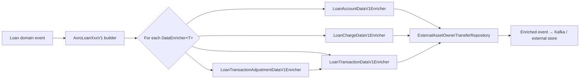
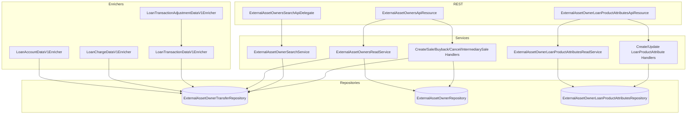

The investor module in Apache Fineract exposes its capabilities through two narrow REST resources and a small fleet of *outbound event enrichers*. The REST layer is what operators use to register an external owner, sell a loan, buy it back, search transfers, or pull journal entries; the enrichers are what makes downstream consumers (Kafka subscribers, ledger replicators, reporting pipelines) see the owner attribution stamped on every loan, charge, and transaction event the platform publishes.

This page covers three things:

1. The full endpoint surface of `ExternalAssetOwnersApiResource` (`/v1/external-asset-owners`) and `ExternalAssetOwnerLoanProductAttributesApiResource` (`/v1/external-asset-owners/loan-product`), including the dispatch table that maps the `command` query parameter onto a `CommandWrapper`.
2. The four `DataEnricher` beans under `fineract-investor/src/main/java/org/apache/fineract/investor/enricher/` that augment outgoing `LoanAccountDataV1`, `LoanChargeDataV1`, `LoanTransactionDataV1`, and `LoanTransactionAdjustmentDataV1` Avro records with `externalOwnerId`, `settlementDate`, and `purchasePriceRatio`.
3. The `internal/` package — currently just a placeholder for internal-test endpoints.

All beans on this page sit behind `@Conditional(InvestorModuleIsEnabledCondition.class)` (or `@ConditionalOnProperty` in the case of certain helpers). With `fineract.module.investor.enabled = false`, none of the REST paths are registered and none of the enrichers contribute to the outgoing event pipeline.

## Module gate

Both REST resources start with the same Spring guards:

```java title="fineract-investor/src/main/java/org/apache/fineract/investor/api/ExternalAssetOwnersApiResource.java"
@Path("/v1/external-asset-owners")
@Component
@Tag(name = "External Asset Owners", description = "External Asset Owners")
@RequiredArgsConstructor
@Conditional(InvestorModuleIsEnabledCondition.class)
public class ExternalAssetOwnersApiResource {
```

`InvestorModuleIsEnabledCondition` reads the module flag from `FineractProperties`:

```java title="fineract-investor/src/main/java/org/apache/fineract/investor/config/InvestorModuleIsEnabledCondition.java"
public class InvestorModuleIsEnabledCondition extends PropertiesCondition {

    @Override
    protected boolean matches(FineractProperties properties) {
        return properties.getModule().getInvestor().isEnabled();
    }
}
```

If the flag is `false`, the JAX-RS scanner never picks up `/v1/external-asset-owners/**`, the enricher beans are never built, and outgoing events carry the base shape (no `externalOwnerId` field populated).

## ExternalAssetOwnersApiResource

This is the workhorse resource. It exposes the *entire transfer lifecycle*, the *owner directory*, and a *search* endpoint. There are nine routes, grouped into five concerns.

### Endpoint table

| Method | Path | Purpose | Command dispatched |
| --- | --- | --- | --- |
| `POST` | `/v1/external-asset-owners` | Create an external asset owner from `ExternalAssetOwnerRequest` JSON. | `CREATE` → `CreateExternalAssetOwnerHandler` |
| `GET` | `/v1/external-asset-owners` | List all owners with current totals. | — (read) |
| `POST` | `/v1/external-asset-owners/transfers/loans/{loanId}` | Initiate a transfer against a loan by internal `loanId`. `command` query parameter selects the action. | See [command dispatch](#command-dispatch) |
| `POST` | `/v1/external-asset-owners/transfers/loans/external-id/{loanExternalId}` | Same but resolves `loanId` via `LoanReadPlatformServiceCommon.getLoanIdByLoanExternalId`. | Same |
| `POST` | `/v1/external-asset-owners/transfers/{id}` | Cancel a pending transfer by its database id. `command=cancel`. | `CANCEL` |
| `POST` | `/v1/external-asset-owners/transfers/external-id/{externalId}` | Cancel by transfer external id; resolves with `retrieveLastTransferIdByExternalId`. | `CANCEL` |
| `GET` | `/v1/external-asset-owners/transfers` | Page through transfers filtered by `transferExternalId`, `loanId`, or `loanExternalId`. | — (read) |
| `GET` | `/v1/external-asset-owners/transfers/active-transfer` | Return the currently-active row only. | — (read) |
| `GET` | `/v1/external-asset-owners/transfers/{transferId}/journal-entries` | Paged journal entries posted on COB activation. | — (read) |
| `GET` | `/v1/external-asset-owners/owners/external-id/{ownerExternalId}/journal-entries` | Owner-scoped journal entries (across all of their loans). | — (read) |
| `POST` | `/v1/external-asset-owners/search` | Text + date-range search returning `Page<ExternalTransferData>`. | — (delegated, see [search](#search)) |

### Command dispatch

Initiating a transfer is a single endpoint family — the *action* (sell, buy back, intermediary sale, cancel, create) is selected by the `command` query parameter. The resource holds a static dispatch table built once at class-load:

```java title="fineract-investor/src/main/java/org/apache/fineract/investor/api/ExternalAssetOwnersApiResource.java"
private static final CommandHandlerRegistry<String, Long, String, CommandWrapper> COMMAND_HANDLER_REGISTRY = new CommandHandlerRegistry<>(
        Map.of(CANCEL_COMMAND_VALUE, (id, json) -> new CommandWrapperBuilder().cancelTransactionByIdToExternalAssetOwner(id).build(),
                INTERMEDIARY_SALE_COMMAND_VALUE,
                (id, json) -> new CommandWrapperBuilder().withJson(json).intermediarySaleLoanToExternalAssetOwner(id).build(),
                SALE_COMMAND_VALUE, (id, json) -> new CommandWrapperBuilder().withJson(json).saleLoanToExternalAssetOwner(id).build(),
                BUY_BACK_COMMAND_VALUE,
                (id, json) -> new CommandWrapperBuilder().withJson(json).buybackLoanToExternalAssetOwner(id).build(),
                CREATE_COMMAND_VALUE, (id, json) -> new CommandWrapperBuilder().withJson(json).createExternalAssetOwner().build()));
```

The constants come from `org.apache.fineract.infrastructure.core.service.CommandParameterUtil` and map to the canonical strings `sale`, `buyback`, `intermediarySale`, `cancel`, and `create`.

| `command` value | Constant | Resulting handler |
| --- | --- | --- |
| `sale` | `SALE_COMMAND_VALUE` | `SaleLoanToExternalAssetOwnerHandler` |
| `intermediarySale` | `INTERMEDIARY_SALE_COMMAND_VALUE` | `IntermediarySaleToExternalAssetOwnerHandler` |
| `buyback` | `BUY_BACK_COMMAND_VALUE` | `BuybackLoanFromExternalAssetOwnerHandler` |
| `cancel` | `CANCEL_COMMAND_VALUE` | `CancelTransactionFromExternalAssetOwnerHandler` |
| `create` | `CREATE_COMMAND_VALUE` | `CreateExternalAssetOwnerHandler` |

If the supplied command is not in the map, the registry throws `UnrecognizedQueryParamException("command", commandParam)`, which the global exception mapper translates to HTTP 400.

### Request flow for an initiate-transfer call

The two `transferRequestWith*` methods follow the same pattern:

```java title="fineract-investor/src/main/java/org/apache/fineract/investor/api/ExternalAssetOwnersApiResource.java"
public CommandProcessingResult transferRequestWithLoanId(@PathParam("loanId") final Long loanId,
        @Parameter ExternalAssetOwnerRequest assetOwnerReq,
        @QueryParam(COMMAND_PARAM) @Parameter(description = COMMAND_PARAM) final String commandParam) {
    platformUserRightsContext.isAuthenticated();
    final String serializedAssetRequest = postApiJsonSerializerService.serialize(assetOwnerReq);
    final CommandWrapper commandRequest = COMMAND_HANDLER_REGISTRY.execute(commandParam, loanId, serializedAssetRequest,
            new UnrecognizedQueryParamException(COMMAND_PARAM, commandParam));
    return this.commandsSourceWritePlatformService.logCommandSource(commandRequest);
}
```

Three things are worth noting:

1. **Authentication first.** `PlatformUserRightsContext.isAuthenticated()` runs *before* any deserialization or dispatch. There is no public access path.
2. **Re-serialization.** The `ExternalAssetOwnerRequest` POJO is deserialized by JAX-RS, then re-serialized via `DefaultToApiJsonSerializer<String>` to a normalized JSON string. The command pipeline persists this string in `m_portfolio_command_source` as the auditable payload.
3. **Two-step write.** `logCommandSource` enrolls the command in Fineract's *maker–checker* pipeline. If the action requires approval, the actual handler is invoked later (by an approver). Otherwise it runs synchronously.

### Lookups by external id

The resource transparently supports external-id lookups for both loans and transfers:

```java title="fineract-investor/src/main/java/org/apache/fineract/investor/api/ExternalAssetOwnersApiResource.java"
public CommandProcessingResult transferRequestWithLoanExternalId(@PathParam("loanExternalId") final String externalLoanId,
        @Parameter ExternalAssetOwnerRequest assetOwnerReq,
        @QueryParam(COMMAND_PARAM) @Parameter(description = COMMAND_PARAM) final String commandParam) {
    platformUserRightsContext.isAuthenticated();
    final Long loanId = loanReadPlatformService.getLoanIdByLoanExternalId(externalLoanId);
    ...
}
```

and for transfers:

```java
public CommandProcessingResult transferRequestWithId(@PathParam("externalId") final String externalId,
        @QueryParam(COMMAND_PARAM) @Parameter(description = COMMAND_PARAM) final String commandParam) {
    ...
    final Long id = externalAssetOwnersReadService.retrieveLastTransferIdByExternalId(new ExternalId(externalId));
    ...
}
```

`retrieveLastTransferIdByExternalId` uses `ExternalId` (an `@Embeddable` value object from `fineract-core`) and returns the *most recent* transfer with that external id — important because a single loan may go through several `PENDING → ACTIVE → BUYBACK → ACTIVE` cycles, each with the same external id reused or distinct.

### Reading transfers

`GET /transfers` and `GET /transfers/active-transfer` share the same filter signature (`transferExternalId`, `loanId`, `loanExternalId`) but differ in what they return:

```java title="fineract-investor/src/main/java/org/apache/fineract/investor/api/ExternalAssetOwnersApiResource.java"
public Page<ExternalTransferData> getTransfers(
        @QueryParam("transferExternalId") final String transferExternalId,
        @QueryParam("loanId") final Long loanId,
        @QueryParam("loanExternalId") final String loanExternalId,
        @QueryParam("offset") final Integer offset,
        @QueryParam("limit") final Integer limit) {
    platformUserRightsContext.isAuthenticated();
    return externalAssetOwnersReadService.retrieveTransferData(loanId, loanExternalId, transferExternalId, offset, limit);
}
```

`getTransfers` returns the full history (every status row for the matched scope), paged. `getActiveTransfer` returns at most one row — the currently-active one whose `effective_date_to = 9999-12-31`.

### Journal entry endpoints

There are two read paths into the ledger side of the integration:

- `GET /transfers/{transferId}/journal-entries` — entries posted when *this specific transfer* was activated by COB.
- `GET /owners/external-id/{ownerExternalId}/journal-entries` — *all* entries across every transfer owned by this external counterparty.

Both delegate straight to `ExternalAssetOwnersReadService`. The DTOs (`ExternalOwnerTransferJournalEntryData`, `ExternalOwnerJournalEntryData`) live under `fineract-investor/.../data/` and join `acc_gl_journal_entry` to the mapping tables (`m_external_asset_owner_journal_entry_mapping`, `m_external_asset_owner_transfer_journal_entry_mapping`). See [External Asset Owner Domain](/investor/external-asset-owner-domain) for the schema and [Accounting Integration](/investor/accounting-integration) for how rows get there.

### Search {#search}

`POST /search` is the one route that does *not* go through `CommandWrapper`. It accepts a `PagedRequest<ExternalAssetOwnerSearchRequest>` body and delegates to an `@Component` that implements the auto-generated `ExternalAssetOwnersSearchApi`:

```java title="fineract-investor/src/main/java/org/apache/fineract/investor/api/search/ExternalAssetOwnersSearchApiDelegate.java"
@Component
@RequiredArgsConstructor
public class ExternalAssetOwnersSearchApiDelegate implements ExternalAssetOwnersSearchApi {

    private final ExternalAssetOwnerSearchService externalAssetOwnerSearchService;

    @Override
    public Page<ExternalTransferData> searchInvestorData(PagedRequest<ExternalAssetOwnerSearchRequest> request) {
        return externalAssetOwnerSearchService.searchInvestorData(request);
    }
}
```

`ExternalAssetOwnerSearchRequest` (under `service/search/domain/`) supports free-text matching plus date-range filters on `settlementDate` and `effectiveFrom` / `effectiveTo`. The actual SQL lives in `SearchingExternalAssetOwnerRepositoryImpl`.

## ExternalAssetOwnerLoanProductAttributesApiResource

This second resource manages **per-product policy attributes** — small bits of configuration that change *how* a loan product behaves under externalisation. Today there is one attribute: `SETTLEMENT_MODEL`, with values `DELAYED_SETTLEMENT` (enables a two-step intermediary-sale path) or none (default direct settlement).

```java title="fineract-investor/src/main/java/org/apache/fineract/investor/api/ExternalAssetOwnerLoanProductAttributesApiResource.java"
@Path("/v1/external-asset-owners/loan-product")
@Component
@Tag(name = "External Asset Owner Loan Product Attributes", description = "External Asset Owner Loan Product Attributes")
@RequiredArgsConstructor
@Conditional(InvestorModuleIsEnabledCondition.class)
public class ExternalAssetOwnerLoanProductAttributesApiResource {
```

### Endpoint table

| Method | Path | Operation id | Purpose |
| --- | --- | --- | --- |
| `POST` | `/v1/external-asset-owners/loan-product/{loanProductId}/attributes` | `createExternalAssetOwnerLoanProductAttribute` | Add an attribute key/value to a product. |
| `GET` | `/v1/external-asset-owners/loan-product/{loanProductId}/attributes` | `retrieveAllExternalAssetOwnerLoanProductAttributes` | List all attributes; optional `attributeKey` filter. |
| `PUT` | `/v1/external-asset-owners/loan-product/{loanProductId}/attributes/{id}` | `updateExternalAssetOwnerLoanProductAttribute` | Update an attribute by its database id. |

### Create

```java title="fineract-investor/src/main/java/org/apache/fineract/investor/api/ExternalAssetOwnerLoanProductAttributesApiResource.java"
public CommandProcessingResult postExternalAssetOwnerLoanProductAttribute(
        @PathParam("loanProductId") @Parameter(description = "loanProductId") final Long loanProductId,
        @Parameter(hidden = true) final String apiRequestBodyAsJson) {
    platformUserRightsContext.isAuthenticated();
    final CommandWrapperBuilder builder = new CommandWrapperBuilder().withJson(apiRequestBodyAsJson);
    CommandWrapper request = builder.createExternalAssetOwnerLoanProductAttribute(loanProductId).build();

    return commandsSourceWritePlatformService.logCommandSource(request);
}
```

The command dispatches to `CreateExternalAssetOwnerLoanProductAttributeHandler` (under `service/`), which delegates to `ExternalAssetOwnerLoanProductAttributesWriteServiceImpl`. The handler enforces that the `(loanProductId, attributeKey)` pair is unique — duplicates raise `ExternalAssetOwnerLoanProductAttributeAlreadyExistsException`.

### Read

The read path returns a `Page<ExternalTransferLoanProductAttributesData>`:

```java title="fineract-investor/src/main/java/org/apache/fineract/investor/api/ExternalAssetOwnerLoanProductAttributesApiResource.java"
public Page<ExternalTransferLoanProductAttributesData> getExternalAssetOwnerLoanProductAttributes(@Context final UriInfo uriInfo,
        @PathParam("loanProductId") @Parameter(description = "loanProductId") final Long loanProductId,
        @QueryParam("attributeKey") @Parameter(description = "attributeKey") final String attributeKey) {
    platformUserRightsContext.isAuthenticated();

    return externalAssetOwnerLoanProductAttributesReadService.retrieveAllLoanProductAttributesByLoanProductId(loanProductId,
            attributeKey);
}
```

The companion constants class (`api/ExternalAssetOwnerLoanProductAttributesApiConstants.java`) pins the response shape:

```java title="fineract-investor/src/main/java/org/apache/fineract/investor/api/ExternalAssetOwnerLoanProductAttributesApiConstants.java"
static final Set<String> RESPONSE_DATA_PARAMETERS = new HashSet<>(
        Arrays.asList(id, loanProductIdParamName, attributeKeyParamName, attributeValueParamName));
```

So a GET response row looks like `{ "id", "loanProductId", "attributeKey", "attributeValue" }` — nothing more.

### Update

```java title="fineract-investor/src/main/java/org/apache/fineract/investor/api/ExternalAssetOwnerLoanProductAttributesApiResource.java"
public CommandProcessingResult updateLoanProductAttribute(
        @PathParam("loanProductId") final Long loanProductId,
        @PathParam("id") final Long attributeId,
        @Parameter(hidden = true) final String apiRequestBodyAsJson) {
    platformUserRightsContext.isAuthenticated();
    final CommandWrapperBuilder builder = new CommandWrapperBuilder().withJson(apiRequestBodyAsJson);
    CommandWrapper request = builder.updateExternalAssetOwnerLoanProductAttribute(loanProductId, attributeId).build();

    return commandsSourceWritePlatformService.logCommandSource(request);
}
```

Routes to `UpdateExternalAssetOwnerLoanProductAttributeHandler`. The handler validates that the new value is recognised — invalid settlement models raise `ExternalAssetOwnerLoanProductAttributeInvalidSettlementAttributeException`.

## Outbound event enrichers

When the platform publishes a domain event (loan disbursed, transaction posted, charge created), the message is built as a versioned Avro record (`LoanAccountDataV1`, `LoanChargeDataV1`, `LoanTransactionDataV1`, …) and run through every Spring-discovered `DataEnricher<T>` bean for that type. The investor module ships four enrichers:

```
fineract-investor/src/main/java/org/apache/fineract/investor/enricher/
├── LoanAccountDataV1Enricher.java
├── LoanChargeDataV1Enricher.java
├── LoanTransactionDataV1Enricher.java
└── LoanTransactionAdjustmentDataV1Enricher.java
```

Each is a `@Component` (so it's discovered automatically by the event dispatcher) and each is *idempotent* and *fail-quiet*: when the loan is not currently owned by an external party, the enricher returns without mutating the data.

### Dispatch sketch



### LoanAccountDataV1Enricher

The richest of the four. When a loan account is emitted, this enricher attaches the external owner's id *and* the settlement date *and* the purchase-price ratio, then propagates the owner id to every embedded charge:

```java title="fineract-investor/src/main/java/org/apache/fineract/investor/enricher/LoanAccountDataV1Enricher.java"
@Override
public void enrich(LoanAccountDataV1 data) {
    externalAssetOwnerTransferRepository.findActiveByLoanId(data.getId()).ifPresent(transfer -> {
        ExternalId transferOwnerExternalId = transfer.getOwner().getExternalId();
        data.setExternalOwnerId(externalIdMapper.mapExternalId(transferOwnerExternalId));
        data.setSettlementDate(avroDateTimeMapper.mapLocalDate(transfer.getSettlementDate()));
        data.setPurchasePriceRatio(transfer.getPurchasePriceRatio());
        if (data.getCharges() != null) {
            data.getCharges().forEach(charge -> charge.setExternalOwnerId(externalIdMapper.mapExternalId(transferOwnerExternalId)));
        }
    });
}
```

Three things are notable:

- `findActiveByLoanId` is the same repository call used by the COB step and the read service. It returns at most one row — the active transfer.
- `externalIdMapper.mapExternalId(...)` flattens the `ExternalId` value object to its bare string for the Avro shape.
- `avroDateTimeMapper.mapLocalDate(...)` converts `java.time.LocalDate` to the Avro timestamp format.

`isDataTypeSupported` is a strict instance check:

```java
@Override
public boolean isDataTypeSupported(Class<LoanAccountDataV1> dataType) {
    return dataType.isAssignableFrom(LoanAccountDataV1.class);
}
```

### LoanChargeDataV1Enricher

For standalone charge events (e.g. a charge waived after the fact), the enricher looks up the *owner* not the *transfer*:

```java title="fineract-investor/src/main/java/org/apache/fineract/investor/enricher/LoanChargeDataV1Enricher.java"
@Override
public void enrich(LoanChargeDataV1 data) {
    externalAssetOwnerTransferRepository.findActiveOwnerByLoanId(data.getLoanId())
            .ifPresent(owner -> data.setExternalOwnerId(externalIdMapper.mapExternalId(owner.getExternalId())));
}
```

`findActiveOwnerByLoanId` returns the `ExternalAssetOwner` directly (no `Transfer` shape needed), so the query is slightly cheaper.

### LoanTransactionDataV1Enricher

Same shape as the charge enricher but typed on `LoanTransactionDataV1`:

```java title="fineract-investor/src/main/java/org/apache/fineract/investor/enricher/LoanTransactionDataV1Enricher.java"
@Override
public void enrich(LoanTransactionDataV1 data) {
    externalAssetOwnerTransferRepository.findActiveOwnerByLoanId(data.getLoanId())
            .ifPresent(owner -> data.setExternalOwnerId(externalIdMapper.mapExternalId(owner.getExternalId())));
}
```

Every repayment, fee posting, accrual, or write-off published by the loan transaction event chain therefore carries the current owner id.

### LoanTransactionAdjustmentDataV1Enricher

Transaction *adjustments* — reversals, charge-off undo, reschedules — wrap *two* `LoanTransactionDataV1` instances (the original and the replacement). The enricher delegates to the transaction enricher for each:

```java title="fineract-investor/src/main/java/org/apache/fineract/investor/enricher/LoanTransactionAdjustmentDataV1Enricher.java"
@Component
@RequiredArgsConstructor
public class LoanTransactionAdjustmentDataV1Enricher implements DataEnricher<LoanTransactionAdjustmentDataV1> {

    private final LoanTransactionDataV1Enricher loanTransactionDataV1Enricher;

    @Override
    public boolean isDataTypeSupported(Class<LoanTransactionAdjustmentDataV1> dataType) {
        return dataType.isAssignableFrom(LoanTransactionAdjustmentDataV1.class);
    }

    @Override
    public void enrich(LoanTransactionAdjustmentDataV1 data) {
        if (data.getTransactionToAdjust() != null) {
            loanTransactionDataV1Enricher.enrich(data.getTransactionToAdjust());
        }
        if (data.getNewTransactionDetail() != null) {
            loanTransactionDataV1Enricher.enrich(data.getNewTransactionDetail());
        }
    }
}
```

This is the only enricher that *composes* another enricher instead of holding a repository reference directly — it keeps the lookup logic in one place.

### Enricher behaviour summary

| Enricher | Avro type | Lookup repo method | Fields set |
| --- | --- | --- | --- |
| `LoanAccountDataV1Enricher` | `LoanAccountDataV1` | `findActiveByLoanId(loanId)` | `externalOwnerId`, `settlementDate`, `purchasePriceRatio`, plus per-charge `externalOwnerId` |
| `LoanChargeDataV1Enricher` | `LoanChargeDataV1` | `findActiveOwnerByLoanId(loanId)` | `externalOwnerId` |
| `LoanTransactionDataV1Enricher` | `LoanTransactionDataV1` | `findActiveOwnerByLoanId(loanId)` | `externalOwnerId` |
| `LoanTransactionAdjustmentDataV1Enricher` | `LoanTransactionAdjustmentDataV1` | (delegates) | `externalOwnerId` on both wrapped transactions |

### When an enricher does nothing

If the loan is not currently owned externally:

- `findActiveByLoanId(loanId)` returns `Optional.empty()`.
- `findActiveOwnerByLoanId(loanId)` returns `Optional.empty()`.
- Both `ifPresent(...)` lambdas no-op.
- The Avro record carries no owner field, no settlement date, no price ratio.

This is the correct behaviour for the great majority of loans that the bank keeps on its own balance sheet. Downstream consumers can tell the difference by checking whether `externalOwnerId` is present in the published record.

## The internal/ package

The investor module reserves a `org.apache.fineract.investor.internal` package for *internal test endpoints* that should never be reachable in production. Today the package holds a single placeholder:

```java title="fineract-investor/src/main/java/org/apache/fineract/investor/internal/InternalAPIForTesting.java"
package org.apache.fineract.investor.internal;

public class InternalAPIForTesting {}
```

The class is empty — there is no body, no methods, no annotations. It exists to *anchor* the package so:

- It shows up in the Spring component scan path (the package is on the classpath in production builds).
- Future internal-only endpoints can be added next to it without re-organising the module layout.
- Other Fineract modules already follow the convention of grouping test-only utilities under an `internal/` package guarded by an external condition (typically a `fineract.test-enabled` flag).

If you are looking for the *actually-used* internal test seam, it is in `fineract-investor` under `cob/loan/LoanAccountOwnerTransferBusinessStep` and its supporting services, which the test harness invokes directly through their public API. See [COB Business Steps](/investor/cob-business-steps) for those.

## Tying it back to the data layer

Both API resources and all four enrichers ultimately fan out to two repositories from the domain layer:

- `ExternalAssetOwnerTransferRepository` — drives `findActiveByLoanId`, `findActiveOwnerByLoanId`, the read service, and the COB step.
- `ExternalAssetOwnerLoanProductAttributesRepository` — drives the loan-product-attributes resource.



The diagram makes the trade-off explicit. The REST resources are *thin* — they validate, dispatch, and serialize. The enrichers are *thinner still* — one repository call per loan, then a setter. All the durable business behaviour lives in the services and command handlers, which are covered by sibling pages in this section:

- For the entity shape and ER relationships, read [External Asset Owner Domain](/investor/external-asset-owner-domain).
- For the end-to-end write workflow that the `sale`/`buyback`/`intermediarySale` commands kick off, see [Transferring Loans to an Investor](/investor/transfer-loans-to-investor).
- For the COB step that flips a `PENDING` row to `ACTIVE` on settlement day and posts the matching journal entries, see [COB Business Steps](/investor/cob-business-steps).
- For how those journal entries actually reach `acc_gl_journal_entry`, see [Accounting Integration](/investor/accounting-integration).
