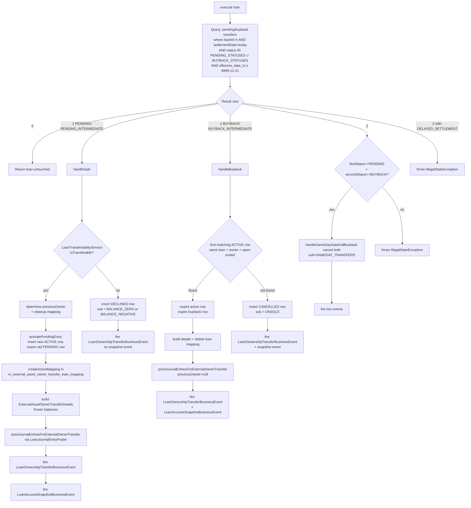

The investor module contributes exactly one Close-of-Business (COB) step to Apache Fineract's daily batch pipeline: `LoanAccountOwnerTransferBusinessStep` under `fineract-investor/src/main/java/org/apache/fineract/investor/cob/loan/`. It is the *only* place where a transfer's status actually changes from `PENDING` to `ACTIVE` (or `BUYBACK` to expired) and where the matching journal entries get posted. Everything the REST API does is merely scheduling — this step is where the work happens.

This page explains how the step is wired into `fineract-cob`, the per-loan algorithm it runs, and the invariants it maintains.

## Why a COB business step (not a Quartz job)?

Fineract's Loan COB pipeline iterates **each eligible loan**, takes a transactional lock on it, and runs a configured list of `LoanCOBBusinessStep` implementations against the loan in order — interest accrual, delinquency tagging, charge accrual, NPL flagging, and so on. The ordering matters: a step further down can rely on the previous step's effects. Locking and the Spring transaction context come from the pipeline.

Ownership transfer logically belongs *in that pipeline* because:

1. **It needs the loan's current outstanding balances** (`loan.getSummary().getTotalPrincipalOutstanding()`, `getTotalInterestOutstanding()`, …) as of *today*, post any of today's accruals. A standalone Quartz job that runs at midnight would see yesterday's view.
2. **It posts journal entries against the loan** through `LoanJournalEntryPoster`. The journal entry framework expects a locked, hydrated Loan aggregate. The COB pipeline already provides this.
3. **It can decline a transfer based on the loan's current state** (e.g. balance went to zero overnight via a final repayment). That decision needs the just-updated balance, not a snapshot.
4. **It must fire `LoanAccountSnapshotBusinessEvent`** so downstream consumers see the loan's externally-owned snapshot. The COB pipeline already publishes related events; sitting in it keeps the event sequence consistent.

The COB pipeline guarantees the step runs once per loan per day, atomically, with the right transactional scope. That's a much cleaner home than a Quartz job that would have to re-implement loan iteration, locking, and event ordering.

## Plug into fineract-cob

The base interfaces live in `fineract-cob/.../cob/COBBusinessStep.java` and `fineract-loan/.../cob/loan/LoanCOBBusinessStep.java`:

```java
// fineract-cob
public interface COBBusinessStep<T extends AbstractPersistableCustom<Long>> {
    T execute(T input);
    String getEnumStyledName();
    String getHumanReadableName();
}

// fineract-loan
public interface LoanCOBBusinessStep extends COBBusinessStep<Loan> {}
```

A `LoanCOBBusinessStep` is just a `COBBusinessStep<Loan>`. The investor module implements it:

```java
@Component
@RequiredArgsConstructor
@Slf4j
@Conditional(InvestorModuleIsEnabledCondition.class)
public class LoanAccountOwnerTransferBusinessStep implements LoanCOBBusinessStep {

    public static final LocalDate FUTURE_DATE_9999_12_31 = LocalDate.of(9999, 12, 31);
    public static final List<ExternalTransferStatus> PENDING_STATUSES =
        List.of(ExternalTransferStatus.PENDING_INTERMEDIATE, ExternalTransferStatus.PENDING);
    public static final List<ExternalTransferStatus> BUYBACK_STATUSES =
        List.of(ExternalTransferStatus.BUYBACK_INTERMEDIATE, ExternalTransferStatus.BUYBACK);

    // … injected dependencies …

    @Override public Loan execute(Loan loan) { /* main algorithm */ return loan; }
    @Override public String getEnumStyledName()    { return "EXTERNAL_ASSET_OWNER_TRANSFER"; }
    @Override public String getHumanReadableName() { return "Execute external asset owner transfer"; }
}
```

Two things make this bean *participate*:

1. **`@Component`** registers it as a Spring bean.
2. **`@Conditional(InvestorModuleIsEnabledCondition.class)`** gates the bean on the `fineract.module.investor.enabled` flag. If the investor module is off, the bean never gets created and the step is not present in the pipeline at all.

The pipeline configuration (in `fineract-cob`) discovers every `LoanCOBBusinessStep` bean and lets operators pick which ones to run, and in what order, through the COB configuration UI. Operators enable `EXTERNAL_ASSET_OWNER_TRANSFER` (the `enumStyledName`) at whatever position in the chain makes sense — typically after interest accrual and charge accrual have finalised today's balances, so the transferability check and the freezing of `ExternalAssetOwnerTransferDetails` see correct numbers.

## What `execute(Loan loan)` does

A single loan, on a single day. The step does these things (and *only* these things — if no transfer is due today, the loan passes through untouched):



The full method body is short. Here's the key part verbatim:

```java
@Override
public Loan execute(Loan loan) {
    Long loanId = loan.getId();
    LocalDate settlementDate = DateUtils.getBusinessLocalDate();

    List<ExternalAssetOwnerTransfer> transferDataList = externalAssetOwnerTransferRepository.findAll(
        (root, query, cb) -> cb.and(
            cb.equal(root.get("loanId"), loanId),
            cb.equal(root.get("settlementDate"), settlementDate),
            root.get("status").in(Stream.concat(PENDING_STATUSES.stream(), BUYBACK_STATUSES.stream()).toList()),
            cb.greaterThanOrEqualTo(root.get("effectiveDateTo"), FUTURE_DATE_9999_12_31)),
        Sort.by(Sort.Direction.ASC, "id"));

    int size = transferDataList.size();

    if (size == 2) {
        // … same-day sale+buyback collapse OR illegal state …
        handleSameDaySaleAndBuyback(settlementDate, transferDataList, loan);
    } else if (size == 1) {
        ExternalAssetOwnerTransfer transfer = transferDataList.get(0);
        if (PENDING_STATUSES.contains(transfer.getStatus())) {
            handleSale(loan, settlementDate, transfer);
        } else if (BUYBACK_STATUSES.contains(transfer.getStatus())) {
            handleBuyback(loan, settlementDate, transfer);
        }
    }
    return loan;
}
```

### Sale path: `handleSale → sellAssetOrDecline → sellAsset`

```java
private void handleSale(Loan loan, LocalDate settlementDate, ExternalAssetOwnerTransfer pending) {
    ExternalAssetOwnerTransfer newTransfer = sellAssetOrDecline(loan, settlementDate, pending);
    businessEventNotifierService.notifyPostBusinessEvent(new LoanOwnershipTransferBusinessEvent(newTransfer, loan));
    if (!ExternalTransferStatus.DECLINED.equals(newTransfer.getStatus())) {
        businessEventNotifierService.notifyPostBusinessEvent(new LoanAccountSnapshotBusinessEvent(loan));
    }
}

private ExternalAssetOwnerTransfer sellAssetOrDecline(...) {
    if (!loanTransferabilityService.isTransferable(loan, pending)) {
        ExternalTransferSubStatus declined = loanTransferabilityService.getDeclinedSubStatus(loan);
        return declinePendingEntry(loan, settlementDate, pending, declined);
    }
    ExternalAssetOwnerTransfer newTransfer = sellAsset(loan, settlementDate, pending);
    createActiveMapping(loan.getId(), newTransfer);
    newTransfer.setExternalAssetOwnerTransferDetails(createAssetOwnerTransferDetails(loan, newTransfer));
    return newTransfer;
}
```

`sellAsset` is where the journal entries get posted, and where the `previousOwner` is resolved against the `m_external_asset_owner_transfer_loan_mapping` table (or against the active intermediate transfer when delayed settlement is enabled):

```java
private ExternalAssetOwnerTransfer sellAsset(Loan loan, LocalDate settlementDate, ExternalAssetOwnerTransfer pending) {
    ExternalAssetOwner previousOwner = determinePreviousOwnerAndCleanupIfNeeded(loan, settlementDate, pending);
    ExternalTransferStatus activeStatus = determineActiveStatus(pending);
    ExternalAssetOwnerTransfer newTransfer = activatePendingEntry(settlementDate, pending, activeStatus, previousOwner);
    loanJournalEntryPoster.postJournalEntriesForExternalOwnerTransfer(loan, newTransfer, previousOwner);
    return newTransfer;
}
```

`activatePendingEntry` sets the new row's `effectiveDateFrom = settlementDate + 1` and `effectiveDateTo = FUTURE_DATE_9999_12_31`. The old PENDING row's `effective_date_to` is set to `settlementDate` (so it now appears as a closed historical record). The new row's status is `ACTIVE` for normal flow, `ACTIVE_INTERMEDIATE` for the `PENDING_INTERMEDIATE` case.

### Previous-owner resolution

The previous-owner column on the new row is what allows downstream profit-loss attribution to know "who lost this asset?". The logic in `determinePreviousOwnerAndCleanupIfNeeded` is:

- **Delayed settlement off, OR a `PENDING_INTERMEDIATE` activation** → look at the existing `m_external_asset_owner_transfer_loan_mapping` for this loan. If one row exists, the active transfer's owner is the previous owner; the mapping is deleted and the old active transfer is expired. If no mapping exists, the loan is being sold *out of the bank* for the first time → previousOwner = null.
- **Delayed settlement on, regular `PENDING` activation** → expect an `ACTIVE_INTERMEDIATE` transfer already present (otherwise `IllegalStateException`). Its owner is the previousOwner; that intermediate transfer is expired and its mapping deleted.

This is why the entity model has a nullable `previous_owner_id` on `m_external_asset_owner_transfer`: bank-to-investor sales legitimately have no previous external owner.

### Decline path

If `LoanTransferabilityService.isTransferable(loan, transfer)` returns false — currently, when the loan's total outstanding has dropped to 0 or gone negative since the operator created the PENDING row — the step inserts a `DECLINED` row in lieu of an `ACTIVE` row, with the sub-status set by `getDeclinedSubStatus(loan)`:

```java
// LoanTransferabilityServiceImpl
public ExternalTransferSubStatus getDeclinedSubStatus(Loan loan) {
    if (MathUtil.nullToDefault(loan.getTotalOverpaid(), BigDecimal.ZERO).compareTo(BigDecimal.ZERO) > 0) {
        return ExternalTransferSubStatus.BALANCE_NEGATIVE;
    }
    return ExternalTransferSubStatus.BALANCE_ZERO;
}
```

And `isTransferable` compares `loan.getSummary().getTotalOutstanding()` strictly against zero — only when validation applies (delayed settlement off, or the `PENDING_INTERMEDIATE` first leg). For the second leg of a delayed-settlement sale (intermediate → final investor), the check is skipped entirely.

No journal entries are posted, the loan stays bank-owned, no `m_external_asset_owner_transfer_loan_mapping` is created. A single `LoanOwnershipTransferBusinessEvent` is emitted (without a `LoanAccountSnapshotBusinessEvent` — there's no new snapshot to publish because nothing economic changed).

### Buyback path: `handleBuyback`

```java
private void handleBuyback(Loan loan, LocalDate settlementDate, ExternalAssetOwnerTransfer buyback) {
    ExternalTransferStatus expectedActive = determineExpectedActiveStatus(buyback);
    Optional<ExternalAssetOwnerTransfer> activeOpt = externalAssetOwnerTransferRepository
        .findOne((root, query, cb) -> cb.and(
            cb.equal(root.get("loanId"),         loan.getId()),
            cb.equal(root.get("owner"),          buyback.getOwner()),
            cb.equal(root.get("status"),         expectedActive),
            cb.equal(root.get("effectiveDateTo"), FUTURE_DATE_9999_12_31)));

    ExternalAssetOwnerTransfer newTransfer;
    if (activeOpt.isEmpty()) {
        newTransfer = createNewEntryAndExpireOldEntry(
            settlementDate, buyback,
            ExternalTransferStatus.CANCELLED, ExternalTransferSubStatus.UNSOLD,
            settlementDate, settlementDate);
    } else {
        newTransfer = buybackAsset(loan, settlementDate, buyback, activeOpt.get());
    }
    businessEventNotifierService.notifyPostBusinessEvent(new LoanOwnershipTransferBusinessEvent(newTransfer, loan));
    businessEventNotifierService.notifyPostBusinessEvent(new LoanAccountSnapshotBusinessEvent(loan));
}

private ExternalAssetOwnerTransfer buybackAsset(Loan loan, LocalDate settlementDate,
        ExternalAssetOwnerTransfer buyback, ExternalAssetOwnerTransfer active) {
    active.setEffectiveDateTo(settlementDate);
    buyback.setEffectiveDateTo(settlementDate);
    buyback.setExternalAssetOwnerTransferDetails(createAssetOwnerTransferDetails(loan, buyback));
    externalAssetOwnerTransferRepository.save(active);
    buyback = externalAssetOwnerTransferRepository.save(buyback);
    externalAssetOwnerTransferLoanMappingRepository.deleteByLoanIdAndOwnerTransfer(loan.getId(), active);
    loanJournalEntryPoster.postJournalEntriesForExternalOwnerTransfer(loan, buyback, null);
    return buyback;
}
```

Two subtleties:

1. **Both the active and the buyback rows are expired** (set `effective_date_to = settlementDate`). After buyback, neither is "current" — they're both history. The loan has no current owner row.
2. **The mapping is deleted**, restoring the loan to "bank-owned" status for the enricher and downstream queries.
3. **`previousOwner` passed to the poster is `null`** — the buyback reversing journal entries do not need previous-owner attribution; the *current* owner (the one losing the asset) is on the buyback row itself.

If no matching active row was found, this means the original sale was declined (or already bought back). The step inserts a `CANCELLED` / `UNSOLD` row and posts no GL movements.

### Same-day sale + buyback

When the COB query returns two rows, the only legal combination is `[PENDING, BUYBACK]` (ordered by id ascending). The step inserts two `CANCELLED` rows with sub-status `SAMEDAY_TRANSFERS` and posts nothing — economically nothing happened so the GL should not bounce. Any other two-row combination throws `IllegalStateException`. Two rows under `DELAYED_SETTLEMENT` always throws because that configuration only ever permits one in-flight transfer.

## Per-loan invariants the step maintains

Across all branches, the step is careful to keep four invariants true after it runs:

1. **Exactly one row per loan with `effective_date_to = 9999-12-31`**, or zero rows. Never two.
2. **Mapping presence = current external ownership.** A row exists in `m_external_asset_owner_transfer_loan_mapping` for the loan iff the loan is currently externally owned (status `ACTIVE` or `ACTIVE_INTERMEDIATE`).
3. **Frozen balance snapshot present whenever cash was transferred.** Every `ACTIVE`, `ACTIVE_INTERMEDIATE`, and `BUYBACK` row that successfully matched has a non-null `ExternalAssetOwnerTransferDetails`. `DECLINED` and `CANCELLED` rows do not.
4. **Journal entries are mapped to both transfer and owner.** Every posted line gets a `m_external_asset_owner_transfer_journal_entry_mapping` row; non-clearing-account lines also get a `m_external_asset_owner_journal_entry_mapping` row. See [accounting integration](/investor/accounting-integration).

These invariants are what let the enrichers do their job with a single query: "find the active mapping for the loan, decorate the event payload with its owner's external id."

## Configuration touchpoint: per-product attribute

The step branches significantly on `DelayedSettlementAttributeService.isEnabled(loanProductId)`, which reads `m_external_asset_owner_loan_product_attribute` for `(loan_product_id, attribute_key = "SETTLEMENT_MODEL")` and returns true iff the value is `"DELAYED_SETTLEMENT"`. So a single COB run might process some loans through the simple flow and others through the intermediate flow purely based on their product configuration. Per-product CRUD for these attributes is exposed at `/v1/external-asset-owners/loan-product/{loanProductId}/attributes` — see [API and enrichers](/investor/api-and-enrichers).

## Events emitted

For every COB step invocation that actually changes something, two events may fire:

- **`LoanOwnershipTransferBusinessEvent`** (always, when the step acted) — payload is the new transfer row (`ExternalAssetOwnerTransfer`), category `"Investor"`, type `"LoanOwnershipTransferBusinessEvent"`. Serialized through `InvestorBusinessEventSerializer` for Avro publication.
- **`LoanAccountSnapshotBusinessEvent`** — fires when ownership actually moved (not on `DECLINED`). Payload is the Loan, used downstream to publish the externally-owned snapshot.

Subscribers can react: a data-warehouse consumer can mirror the new ownership in its dimensional model; a Kafka topic can carry it to a reporting subsystem; an alerting subsystem can fire when a sale is declined.

## Where the step is *not* responsible

A few things the step deliberately does *not* do:

- **Settlement-date scheduling.** That's the operator's job — they pick the date when they POST the sale. The step only checks "is today the date?"
- **Loan eligibility for external ownership.** That's the write service's job at sale-time (loan status check, in-flight transfer check). The step assumes the row got created correctly.
- **Cash movement to/from the investor.** That happens outside Fineract. The step just writes journal entries against the `ASSET_TRANSFER` clearing GL account; reconciling that clearing account against real bank movements is the operations team's job.
- **Loan-product CRUD.** Loan-product attribute writes happen through the separate `ExternalAssetOwnerLoanProductAttributesApiResource`, not COB.

That tight scope is what makes the step easy to reason about: it walks the loan's calendar, finds the right transfer row, and atomically transitions it. Nothing more.
