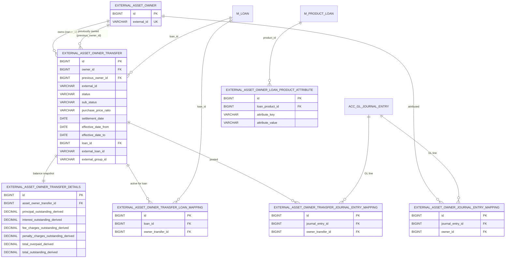

The investor module's persistence layer in Apache Fineract is small — six entities — but every one has a clearly delineated job. This page walks through each in source-order, gives the column shape, and ties them together into a single ER diagram. Read this before [transfer-loans-to-investor](/investor/transfer-loans-to-investor): once the entities are clear, the workflow becomes obvious.

All entities live under `fineract-investor/src/main/java/org/apache/fineract/investor/domain/` and extend `AbstractAuditableWithUTCDateTimeCustom<Long>` from `fineract-core`, which gives them a `Long id`, `createdBy`, `createdDate`, `lastModifiedBy` and `lastModifiedDate` for free, all in UTC.

## ExternalAssetOwner

File: `investor/domain/ExternalAssetOwner.java` · Table: `m_external_asset_owner`

This is the **investor identity**. Despite the name, it is a deliberately thin record — no name, address, contact details or balance. It exists only so that other rows can foreign-key it.

```java
@Entity
@Table(name = "m_external_asset_owner")
public class ExternalAssetOwner extends AbstractAuditableWithUTCDateTimeCustom<Long> {
    @Column(name = "external_id", nullable = false, length = 100, unique = true)
    private ExternalId externalId;
}
```

The single business column is `external_id`, a unique string (wrapped in Fineract's `ExternalId` value object). Operators pick the value — typical conventions are LEI codes, SPV reference numbers, or internal counterparty IDs. There is exactly **one row per investor** and rows are *never* deleted; subsequent transfers continue to point back at the same owner row even after the investor sells nothing for years.

Creation goes through `ExternalAssetOwnersWriteServiceImpl.createExternalAssetOwner(JsonCommand)` which is triggered by the `CreateExternalAssetOwnerHandler` command handler (`@CommandType(entity = "EXTERNAL_ASSET_OWNER", action = "CREATE")`). The validator `ExternalAssetOwnerValidator.validateForCreate` requires only `ownerExternalId`; duplicate creates raise `ExternalAssetOwnerDuplicateException`.

## ExternalAssetOwnerTransfer

File: `investor/domain/ExternalAssetOwnerTransfer.java` · Table: `m_external_asset_owner_transfer`

This is the **transfer event**, and the busiest entity in the module. Each row records one *state change* of one loan's ownership. The same loan accumulates many rows across its life: one PENDING → one ACTIVE → eventually one BUYBACK → one CANCELLED, with each later row pointing at the previous through column data rather than a parent FK.

Schema (relevant columns only):

| Column | Java type | Meaning |
| --- | --- | --- |
| `owner_id` | `ExternalAssetOwner` (`@ManyToOne`) | The investor that this transfer is to/from. |
| `previous_owner_id` | `ExternalAssetOwner` (`@ManyToOne`, nullable) | Populated when the asset moves owner-to-owner (or out of an intermediate owner under delayed settlement); null when the bank itself was the previous owner. |
| `external_id` | `ExternalId` (length 100, not null) | Operator-supplied id for the transfer; reused across the PENDING→ACTIVE→BUYBACK chain so consumers can correlate. |
| `status` | `ExternalTransferStatus` enum stored as string | One of the eight values listed below. |
| `sub_status` | `ExternalTransferSubStatus` enum, nullable | Reason code when status is `DECLINED` or `CANCELLED`. |
| `purchase_price_ratio` | `String(50)` | Free-form ratio string, e.g. `"1.02"`, `"0.985"`. The module stores it verbatim; consumers parse. |
| `settlement_date` | `LocalDate` | The business day the transfer should activate (or has activated). |
| `effective_date_from`, `effective_date_to` | `LocalDate` | Validity window for *this row's* status. Open rows carry `effective_date_to = 9999-12-31`. |
| `loan_id` | `Long` | The Fineract loan being transferred. |
| `external_loan_id` | `ExternalId` (nullable) | Cached external id of the loan; populated at create. |
| `external_group_id` | `ExternalId` (nullable) | Operator-supplied grouping id so a batch of transfers can be reported together. |
| `external_asset_owner_transfer_details` | `ExternalAssetOwnerTransferDetails` (`@OneToOne`, cascade ALL, mappedBy) | Balance snapshot — see below. |

The status enum values come from `ExternalTransferStatus.java`:

```java
public enum ExternalTransferStatus {
    ACTIVE, ACTIVE_INTERMEDIATE, DECLINED,
    PENDING, PENDING_INTERMEDIATE,
    BUYBACK, BUYBACK_INTERMEDIATE,
    CANCELLED
}
```

The `_INTERMEDIATE` variants exist only for the **delayed-settlement** flow: a loan product configured with `SETTLEMENT_MODEL = DELAYED_SETTLEMENT` (an `ExternalAssetOwnerLoanProductAttributes` row) allows a two-leg sale through an intermediate counterparty before reaching the final investor. The COB step branches on this — see [COB business steps](/investor/cob-business-steps).

The sub-status enum values come from `ExternalTransferSubStatus.java`:

```java
public enum ExternalTransferSubStatus {
    BALANCE_ZERO,        // declined: loan was fully repaid by settlement
    BALANCE_NEGATIVE,    // declined: loan went overpaid by settlement
    SAMEDAY_TRANSFERS,   // cancelled: same-day sale + buyback collapsed
    USER_REQUESTED,      // cancelled: operator cancelled the pending transfer
    UNSOLD               // cancelled: buyback request matched no active sale
}
```

### Lifecycle states

Putting them together, each row's status is one of:

```mermaid
stateDiagram-v2
    direction LR
    [*] --> PENDING : POST ?command=sale
    [*] --> PENDING_INTERMEDIATE : POST ?command=intermediarySale
    PENDING --> CANCELLED : POST ?command=cancel<br/>sub=USER_REQUESTED
    PENDING --> ACTIVE : COB on settlement date<br/>(transferable)
    PENDING --> DECLINED : COB on settlement date<br/>(not transferable)
    PENDING_INTERMEDIATE --> ACTIVE_INTERMEDIATE : COB on settlement date
    ACTIVE_INTERMEDIATE --> ACTIVE : second-leg sale + COB
    ACTIVE --> BUYBACK : POST ?command=buyback
    ACTIVE_INTERMEDIATE --> BUYBACK_INTERMEDIATE : POST ?command=buyback
    BUYBACK --> CANCELLED : COB; no matching ACTIVE<br/>sub=UNSOLD
    BUYBACK --> [*] : COB; ownership returned to bank
    BUYBACK_INTERMEDIATE --> [*] : COB; intermediate ownership returned
    PENDING --> CANCELLED : same-day sale+buyback<br/>sub=SAMEDAY_TRANSFERS
    BUYBACK --> CANCELLED : same-day sale+buyback<br/>sub=SAMEDAY_TRANSFERS
    DECLINED --> [*]
    CANCELLED --> [*]
```



Mechanically each "transition" is **insert-new-row + close-old-row**, not an in-place update:

```java
// Excerpt from LoanAccountOwnerTransferBusinessStep
private ExternalAssetOwnerTransfer createNewEntryAndExpireOldEntry(...) {
    ExternalAssetOwnerTransfer newOne = new ExternalAssetOwnerTransfer();
    // copy owner, externalId, externalLoanId, externalGroupId, purchasePriceRatio…
    newOne.setStatus(newStatus);
    newOne.setSubStatus(newSubStatus);
    newOne.setEffectiveDateFrom(effectiveDateFrom);
    newOne.setEffectiveDateTo(effectiveDateTo);
    expireTransfer(settlementDate, oldOne); // sets oldOne.effective_date_to = settlementDate
    return repository.save(newOne);
}
```

This audit-trail style means you can reconstruct the ownership history of any loan by selecting all rows for `loan_id = ?` ordered by `id`.

### Queries

Repository: `ExternalAssetOwnerTransferRepository.java`

| Method | Query | Used by |
| --- | --- | --- |
| `findActiveByLoanId(Long)` | Joins through `ExternalAssetOwnerTransferLoanMapping`. | Enrichers, read service. |
| `findActiveOwnerByLoanId(Long)` | Joins through the mapping, returns the owner directly. | `LoanChargeDataV1Enricher`, `LoanTransactionDataV1Enricher`. |
| `findEffectiveTransfersOrderByIdDesc(Long, LocalDate)` | `effective_date_to > :effectiveDate`. | Buyback validation. |
| `findLatestByLoanId(Long)` | Max id per loan. | Read service. |
| `findFirstByExternalIdOrderByIdAsc(ExternalId)` / `findLastByExternalIdOrderByIdDesc` | First / last transfer by external id. | Lookup-by-external-id. |
| `findAll(Specification, Sort)` | JPA Criteria. | The COB step's daily pending scan. |

## ExternalAssetOwnerTransferDetails

File: `investor/domain/ExternalAssetOwnerTransferDetails.java` · Table: `m_external_asset_owner_transfer_details`

A one-to-one child of `ExternalAssetOwnerTransfer` that *freezes the loan's outstanding balances* at the moment the transfer was settled. This snapshot is what gets multiplied by `purchase_price_ratio` to derive the cash the investor pays.

| Column | Meaning |
| --- | --- |
| `asset_owner_transfer_id` | FK back to the parent transfer (`@OneToOne(cascade = ALL)`). |
| `principal_outstanding_derived` | Principal at settlement. |
| `interest_outstanding_derived` | Interest at settlement (strategy-dependent — `ExternalAssetOwnerTransferOutstandingInterestCalculation` lets product config pick how it's computed). |
| `fee_charges_outstanding_derived` | Fee charges outstanding. |
| `penalty_charges_outstanding_derived` | Penalty charges outstanding. |
| `total_overpaid_derived` | Overpaid amount, only non-zero when the loan was OVERPAID at settlement. |
| `total_outstanding_derived` | Sum of the four positive components, kept in sync by the setters. |

The entity is *write-once via setters that recompute the total*:

```java
public void setTotalPrincipalOutstanding(BigDecimal v) {
    this.totalPrincipalOutstanding = Objects.requireNonNullElse(v, BigDecimal.ZERO);
    updateTotalOutstanding();
}
private void updateTotalOutstanding() {
    this.totalOutstanding = MathUtil.add(
        getTotalPrincipalOutstanding(),
        getTotalInterestOutstanding(),
        getTotalFeeChargesOutstanding(),
        getTotalPenaltyChargesOutstanding());
}
```

It is created by `LoanAccountOwnerTransferBusinessStep.createAssetOwnerTransferDetails` during COB *after* the transfer flips to `ACTIVE` or `BUYBACK`, so the values reflect the balances on the actual settlement business day, not whatever was there when the operator first POSTed the sale request.

## ExternalAssetOwnerTransferLoanMapping

File: `investor/domain/ExternalAssetOwnerTransferLoanMapping.java` · Table: `m_external_asset_owner_transfer_loan_mapping`

A small index that answers "who currently owns loan X?" in one row, instead of forcing a scan of the transfer table.

| Column | Meaning |
| --- | --- |
| `loan_id` | The loan. |
| `owner_transfer_id` (FK → `ExternalAssetOwnerTransfer`) | The currently-active transfer row (status `ACTIVE` or `ACTIVE_INTERMEDIATE`). |

It is **inserted** by `createActiveMapping` when a PENDING transfer activates, and **deleted** by `deleteByLoanIdAndOwnerTransfer` on buyback or cleanup. So at any instant a loan is either in this table (externally owned) or not (bank-owned).

This is exactly what `ExternalAssetOwnerTransferRepository.findActiveByLoanId` joins through, and what the read service and enrichers use as the canonical "is this loan externally owned right now?" check.

## ExternalAssetOwnerJournalEntryMapping

File: `investor/domain/ExternalAssetOwnerJournalEntryMapping.java` · Table: `m_external_asset_owner_journal_entry_mapping`

A join table that pins each `JournalEntry` posted during a transfer to the **owner that the line belongs to** (the buyer side for credit-into-owner lines, the seller side for debit-into-owner lines). Created by `AccountingServiceImpl.createMappingToOwner`.

| Column | Meaning |
| --- | --- |
| `journal_entry_id` (FK → `acc_gl_journal_entry`) | The posted GL entry. |
| `owner_id` (FK → `m_external_asset_owner`) | The owner this line is attributed to. |

This is what backs `GET /v1/external-asset-owners/owners/external-id/{ownerExternalId}/journal-entries` — list every GL line ever attributed to a given investor.

## ExternalAssetOwnerTransferJournalEntryMapping

File: `investor/domain/ExternalAssetOwnerTransferJournalEntryMapping.java` · Table: `m_external_asset_owner_transfer_journal_entry_mapping`

The sibling join table that pins every line of a transfer's batch to the **transfer event itself**. Created in the same loop, before the owner attribution is decided.

| Column | Meaning |
| --- | --- |
| `journal_entry_id` (FK → `acc_gl_journal_entry`) | The posted GL entry. |
| `owner_transfer_id` (FK → `m_external_asset_owner_transfer`) | The transfer event the line came from. |

This is what backs `GET /v1/external-asset-owners/transfers/{transferId}/journal-entries` — list every GL line posted for one transfer event.

Two mapping tables exist instead of one because the queries are different: the *owner* view ignores asset-transfer clearing lines entirely (clearing-account hits aren't attributed to either party — see [accounting integration](/investor/accounting-integration)), while the *transfer* view records all lines regardless of attribution.

## ExternalAssetOwnerLoanProductAttributes

File: `investor/domain/ExternalAssetOwnerLoanProductAttributes.java` · Table: `m_external_asset_owner_loan_product_attribute`

Out of scope for the transfer lifecycle but lives in the same package: this entity holds *per-loan-product* configuration that controls how transfers behave for that product. The only attribute key today is `SETTLEMENT_MODEL`, whose allowed values are `DEFAULT_SETTLEMENT` (the normal one-step sale) and `DELAYED_SETTLEMENT` (the two-leg `intermediarySale` flow), defined in `data/attribute/SettlementModelExternalAssetOwnerLoanProductAttribute`:

```java
public enum SettlementModelExternalAssetOwnerLoanProductAttribute
        implements ExternalAssetOwnerLoanProductAttribute {
    DEFAULT_SETTLEMENT("DEFAULT_SETTLEMENT"),
    DELAYED_SETTLEMENT("DELAYED_SETTLEMENT");
    // attributeKey = "SETTLEMENT_MODEL"
}
```

`DelayedSettlementAttributeServiceImpl.isEnabled(loanProductId)` is the single consumer: it looks up the loan product's attribute row and returns true iff `SETTLEMENT_MODEL = DELAYED_SETTLEMENT`. Several decision points in the write service and COB step branch on this.

The CRUD for this entity is exposed under `/v1/external-asset-owners/loan-product/{loanProductId}/attributes` — see [API and enrichers](/investor/api-and-enrichers).

## The ER diagram



A few subtle relationships to note:

- **A single loan, a single owner at a time.** Enforced by the `ExternalAssetOwnerTransferLoanMapping` having only one row per `loan_id` while it's externally owned. There is no DB unique constraint shown in the entity, but the COB and write logic both maintain the invariant.
- **An investor never disappears.** The unique constraint on `m_external_asset_owner.external_id` means the same owner row keeps accumulating transfers across years.
- **`previous_owner_id` decouples chain reasoning from history scanning.** Without this, computing "who used to own this loan before now?" would require walking back through expired transfer rows. With it, you read the current ACTIVE row and have both.
- **The two journal-entry mapping tables are intentional.** Some lines (the `ASSET_TRANSFER` clearing-account hits) belong to a transfer but to **no** owner, because the clearing account is the bank's own account. The owner mapping is therefore nullable in spirit — `AccountingServiceImpl.createMappingToOwner` short-circuits when `owner == null`, skipping the insert.

## Business events emitted

The domain also defines two Kafka/in-process business events under `investor/domain/`:

- `InvestorBusinessEvent` (abstract) — category `"Investor"`, generic payload `ExternalAssetOwnerTransfer`.
- `LoanOwnershipTransferBusinessEvent extends InvestorBusinessEvent` — type `"LoanOwnershipTransferBusinessEvent"`.

`LoanAccountOwnerTransferBusinessStep` fires the latter through `BusinessEventNotifierService.notifyPostBusinessEvent` after every successful sale, decline, buyback or cancel. The Avro serializer for it lives at `investor/service/serialization/serializer/investor/InvestorBusinessEventSerializer.java` and is what allows downstream consumers (data warehouse, analytics) to know that ownership of loan X just changed.

Now that the entities are clear, the next page traces the [transfer workflow](/investor/transfer-loans-to-investor) end-to-end.
